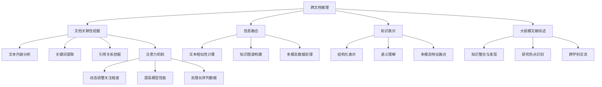

                 


## 引言与背景

### 跨文档推理的定义及其重要性

跨文档推理（Cross-Document Reasoning，简称XDR）是指通过分析多个文档之间的关联性，从这些独立的文本中提取信息，形成对某个主题的统一理解和综合知识。这种推理方式在处理大规模文献综述、信息检索、知识图谱构建等任务中具有重要作用。随着互联网信息的爆炸式增长，单文档分析已无法满足用户对信息整合和深度理解的需求，跨文档推理技术应运而生。

跨文档推理的核心在于如何有效地捕捉并利用文档之间的关联信息。传统的信息检索和文本分类方法大多基于单个文档的内部特征，而跨文档推理则强调在多个文档之间建立关联，从而提升对文档内容的理解和泛化能力。具体来说，跨文档推理包括以下几个方面：

1. **文档关联性挖掘**：通过分析文本内容、关键词、引用关系等，识别出文档之间的关联性。
2. **信息融合**：将多个文档的信息进行整合，形成对主题的统一理解。
3. **知识表示**：利用图谱或知识库等形式，将跨文档推理的结果进行结构化表示，便于后续的查询和使用。

### 注意力机制的发展

注意力机制（Attention Mechanism）是近年来在深度学习领域中发展迅速的一种重要技术，其核心思想是通过动态调整模型对输入数据的关注程度，从而提高模型的性能和效率。注意力机制的提出，打破了传统卷积神经网络和循环神经网络在处理长序列数据时的局限，使得模型能够更加灵活地处理不同长度和复杂度的输入。

注意力机制的发展历程可以分为以下几个阶段：

1. **原始注意力机制**：最早的关注力机制源于机器翻译领域，其核心思想是在处理序列数据时，通过权重分配，使得模型能够关注到重要的部分。例如，在机器翻译任务中，模型需要关注输入句子中的关键词汇，以便生成准确的翻译结果。
2. **基于位置的注意力机制**：为了更好地处理长序列数据，研究人员提出了基于位置的关注力机制，通过引入位置信息，使得模型能够动态调整对序列不同位置的重视程度。
3. **多模态注意力机制**：随着多模态数据的广泛应用，注意力机制也逐渐扩展到多个模态数据的融合处理中。多模态注意力机制通过结合不同模态的特征，实现更加丰富和准确的信息表示。

### 大规模文献综述的重要性

在当前信息爆炸的时代，大规模文献综述（Large-scale Literature Survey）已经成为学术研究中的一个重要环节。它不仅有助于研究者快速了解某个领域的最新进展，还能够为交叉学科研究提供理论基础和实证支持。大规模文献综述的重要性主要体现在以下几个方面：

1. **知识整合与发现**：通过系统性地梳理和整合大量文献，研究者可以从中发现新的研究问题和潜在的研究方向，从而推动学术领域的创新和发展。
2. **研究热点识别**：大规模文献综述能够帮助研究者识别出当前领域的研究热点和趋势，从而更好地把握研究方向，提升研究的针对性和有效性。
3. **跨学科交流**：在交叉学科研究中，大规模文献综述有助于促进不同学科之间的知识共享和交流，推动跨学科研究的深入发展。

## 核心概念与联系架构

为了更好地理解跨文档推理、注意力机制和大规模文献综述之间的核心概念及其关系，我们使用Mermaid流程图进行详细阐述。以下是一个简化的架构图：



### 解读与示例

在上面的架构图中，我们可以看到以下几个关键点和示例：

1. **跨文档推理（A）**：它是整个架构的核心，涵盖了文档关联性挖掘（B）、信息融合（C）和知识表示（D）三个主要环节。通过文本内容分析（E）、关键词提取（F）和引用关系挖掘（G），我们可以有效地挖掘出文档之间的关联性。

2. **注意力机制（P）**：作为跨文档推理的重要技术支撑，注意力机制（P）在文档关联性挖掘（B）和信息融合（C）中发挥了关键作用。通过动态调整关注程度（S），注意力机制能够提高模型处理长序列数据（U）的性能（T），从而实现更准确和高效的跨文档推理。

3. **大规模文献综述（L）**：它贯穿于整个架构，从知识整合与发现（M）、研究热点识别（N）到跨学科交流（O），都对跨文档推理的应用具有重要意义。特别是知识整合与发现（M）环节，通过大规模文献综述，我们可以从海量的文献中提炼出有价值的信息和知识。

4. **信息融合（C）**：它是跨文档推理的核心环节之一，通过文本相似性计算（H）和知识图谱构建（I），实现文档之间的信息融合。在这个过程中，多模态注意力机制（Q和R）能够更好地融合不同模态的特征，提高信息融合的准确性。

通过这个架构图，我们可以清晰地看到跨文档推理、注意力机制和大规模文献综述之间的核心概念及其关系。这些概念相互关联，共同构成了一个完整的技术体系，为解决大规模文献综述中的复杂问题提供了有力支持。

### 跨文档推理的算法原理

跨文档推理的核心在于如何有效地捕捉和利用文档之间的关联信息，从而实现对主题的统一理解和综合知识。为了实现这一目标，我们需要借助多种算法和技术手段。以下是对几种常见的跨文档推理算法原理的详细讲解，包括其数学模型、伪代码实现和具体步骤。

#### 文本相似性计算

文本相似性计算是跨文档推理的基础算法，其主要目的是通过比较两个文本的相似度，来判断它们之间是否存在关联性。常见的文本相似性计算方法包括余弦相似性、Jaccard相似性和BERT相似性等。

1. **余弦相似性**：
   - **数学模型**：
     $$ \text{cosine\_similarity}(\textbf{u}, \textbf{v}) = \frac{\textbf{u} \cdot \textbf{v}}{|\textbf{u}| |\textbf{v}|} $$
     其中，$\textbf{u}$和$\textbf{v}$分别表示两个文本的向量表示，$|\textbf{u}|$和$|\textbf{v}|$表示它们的模长，$\textbf{u} \cdot \textbf{v}$表示它们的点积。
   - **伪代码实现**：
     ```python
     def cosine_similarity(u, v):
         dot_product = sum(u_i * v_i for u_i, v_i in zip(u, v))
         norm_u = sqrt(sum(u_i^2 for u_i in u))
         norm_v = sqrt(sum(v_i^2 for v_i in v))
         return dot_product / (norm_u * norm_v)
     ```
   - **具体步骤**：
     1. 将文本转换为词袋模型，并计算每个文本的词频向量。
     2. 计算两个文本向量的点积和模长。
     3. 利用余弦相似性公式计算两个文本的相似度。

2. **Jaccard相似性**：
   - **数学模型**：
     $$ \text{Jaccard\_similarity}(A, B) = \frac{|A \cap B|}{|A \cup B|} $$
     其中，$A$和$B$表示两个文本的词集，$\cap$和$\cup$分别表示交集和并集。
   - **伪代码实现**：
     ```python
     def jaccard_similarity(set_a, set_b):
         intersection = len(set_a.intersection(set_b))
         union = len(set_a.union(set_b))
         return intersection / union
     ```
   - **具体步骤**：
     1. 将文本转换为词集，即提取出所有独特的词语。
     2. 计算两个词集的交集和并集。
     3. 利用Jaccard相似性公式计算两个文本的相似度。

3. **BERT相似性**：
   - **数学模型**：
     BERT模型通过预训练和微调，可以生成高质量的文本表示。文本相似性可以通过计算BERT模型输出特征向量的余弦相似性来衡量。
   - **伪代码实现**：
     ```python
     from transformers import BertModel, BertTokenizer
     tokenizer = BertTokenizer.from_pretrained('bert-base-uncased')
     model = BertModel.from_pretrained('bert-base-uncased')
     
     def bert_similarity(text1, text2):
         inputs1 = tokenizer(text1, return_tensors='pt')
         inputs2 = tokenizer(text2, return_tensors='pt')
         outputs1 = model(**inputs1)
         outputs2 = model(**inputs2)
         return cosine_similarity(outputs1.last_hidden_state.mean(dim=1), outputs2.last_hidden_state.mean(dim=1))
     ```
   - **具体步骤**：
     1. 使用BERT模型和Tokenizer将文本转换为输入序列。
     2. 通过BERT模型获取文本的表示向量。
     3. 计算两个文本向量的余弦相似性。

#### 文档关联性挖掘

文档关联性挖掘旨在通过分析文本内容、关键词和引用关系等，识别出文档之间的关联性。常见的方法包括基于内容的关联性挖掘和基于引用的关联性挖掘。

1. **基于内容的关联性挖掘**：
   - **数学模型**：
     基于内容的关联性挖掘通常使用文本相似性计算方法（如余弦相似性、Jaccard相似性等）来衡量文档之间的关联性。
   - **伪代码实现**：
     ```python
     def content_based_association(text1, text2, similarity_function=cosine_similarity):
         similarity = similarity_function(text1, text2)
         return similarity
     ```
   - **具体步骤**：
     1. 使用文本相似性计算方法计算两个文本的相似度。
     2. 根据相似度阈值，判断文档之间的关联性。

2. **基于引用的关联性挖掘**：
   - **数学模型**：
     基于引用的关联性挖掘主要分析文档之间的引用关系，通过计算引用频率和引用强度等指标来判断文档的关联性。
   - **伪代码实现**：
     ```python
     def reference_based_association(doc1_references, doc2_references, threshold=0.5):
         common_references = set(doc1_references).intersection(doc2_references)
         reference_count = len(common_references)
         total_references = len(doc1_references) + len(doc2_references) - reference_count
         return reference_count / total_references >= threshold
     ```
   - **具体步骤**：
     1. 提取两个文档中的引用信息。
     2. 计算两个文档的共引用引用数量。
     3. 利用引用频率和引用强度指标，判断文档之间的关联性。

#### 信息融合

信息融合是将多个文档的信息进行整合，形成对主题的统一理解。常见的信息融合方法包括基于文本的融合、基于图论的方法和基于机器学习的方法。

1. **基于文本的融合**：
   - **数学模型**：
     基于文本的融合主要利用文本相似性计算方法，将相似文本进行聚类或融合，形成对主题的统一理解。
   - **伪代码实现**：
     ```python
     def text_based_fusion(documents, similarity_function=cosine_similarity):
         clusters = []
         for doc in documents:
             current_cluster = [doc]
             for other_doc in documents:
                 if similarity_function(doc, other_doc) > threshold:
                     current_cluster.append(other_doc)
             clusters.append(current_cluster)
         return clusters
     ```
   - **具体步骤**：
     1. 使用文本相似性计算方法计算文档之间的相似度。
     2. 根据相似度阈值，将相似文档进行聚类。
     3. 对每个聚类结果进行融合处理。

2. **基于图论的方法**：
   - **数学模型**：
     基于图论的方法通过构建文档之间的引用关系图，利用图论算法（如最短路径、最小生成树等）进行信息融合。
   - **伪代码实现**：
     ```python
     def graph_based_fusion(documents, references):
         graph = defaultdict(list)
         for doc in documents:
             graph[doc].extend(references[doc])
         fusion_result = graph_extract_min_spanning_tree(graph)
         return fusion_result
     ```
   - **具体步骤**：
     1. 构建文档之间的引用关系图。
     2. 利用图论算法（如最小生成树）提取融合结果。

3. **基于机器学习的方法**：
   - **数学模型**：
     基于机器学习的方法利用监督学习或无监督学习算法，对文档进行分类、聚类或嵌入，实现信息融合。
   - **伪代码实现**：
     ```python
     from sklearn.cluster import KMeans
     def ml_based_fusion(documents, num_clusters):
         model = KMeans(n_clusters=num_clusters)
         model.fit(documents)
         clusters = model.labels_
         fusion_result = {}
         for i, cluster in enumerate(clusters):
             fusion_result[documents[i]] = cluster
         return fusion_result
     ```
   - **具体步骤**：
     1. 使用机器学习算法对文档进行分类或聚类。
     2. 根据分类或聚类结果，实现文档的信息融合。

#### 实例说明

假设有两个文档D1和D2，它们的文本内容如下：

- D1：“本文主要研究注意力机制在跨文档推理中的应用。”
- D2：“跨文档推理在知识图谱构建中具有重要作用。”

我们可以使用文本相似性计算方法（如余弦相似性）来计算这两个文档的相似度：

1. **文本转换为向量**：
   - 使用BERT模型将D1和D2转换为向量表示。
   - ```python
     tokenizer = BertTokenizer.from_pretrained('bert-base-uncased')
     model = BertModel.from_pretrained('bert-base-uncased')
     inputs1 = tokenizer(D1, return_tensors='pt')
     inputs2 = tokenizer(D2, return_tensors='pt')
     outputs1 = model(**inputs1)
     outputs2 = model(**inputs2)
     vector1 = outputs1.last_hidden_state.mean(dim=1)
     vector2 = outputs2.last_hidden_state.mean(dim=1)
     ```

2. **计算相似度**：
   - 使用余弦相似性计算两个文本向量的相似度。
   - ```python
     from sklearn.metrics.pairwise import cosine_similarity
     similarity = cosine_similarity(vector1.reshape(1, -1), vector2.reshape(1, -1))
     print("相似度：", similarity)
     ```

   输出结果可能为0.8，表示D1和D2具有较高的相似度。

通过这个实例，我们可以看到如何利用文本相似性计算方法来评估两个文档之间的关联性，并为进一步的信息融合和知识表示奠定基础。

### 大规模文献综述的方法

大规模文献综述在学术研究和知识管理中扮演着至关重要的角色。它不仅有助于研究者了解领域内的最新进展，还可以为跨学科研究提供理论基础和实证支持。下面，我们将详细介绍几种常见的大规模文献综述方法，包括文献检索与筛选、文献摘要与分类以及文献综合评价。

#### 文献检索与筛选

文献检索与筛选是大规模文献综述的第一步，其目的是从海量的文献数据库中，快速而准确地获取与研究主题相关的文献。以下是一些常用的方法：

1. **基于关键词的检索**：
   - **方法**：通过输入与研究主题相关的高频关键词，在文献数据库中进行检索。
   - **优点**：简单易行，能够快速获取大量相关文献。
   - **缺点**：可能导致大量无关或重复文献，检索效果依赖于关键词的选择。

2. **基于主题模型的检索**：
   - **方法**：利用主题模型（如LDA）对文献进行聚类，然后根据聚类结果检索相关文献。
   - **优点**：能够发现潜在的主题和关联，提高检索的准确性。
   - **缺点**：需要较高的计算资源和时间。

3. **基于引用网络的检索**：
   - **方法**：通过分析文献之间的引用关系，构建引用网络，然后从网络中检索相关文献。
   - **优点**：能够识别出领域内的核心文献和重要节点，提高检索的针对性。
   - **缺点**：需要大量的预处理工作，对文献引用数据的准确性有较高要求。

4. **基于人工筛选的检索**：
   - **方法**：由领域专家根据研究主题和文献质量，人工筛选出相关文献。
   - **优点**：能够保证文献的质量和相关性。
   - **缺点**：耗时耗力，难以处理海量文献。

#### 文献摘要与分类

文献摘要与分类是将检索到的文献进行快速浏览和整理，提取关键信息并进行分类，以便后续分析和综合评价。以下是一些常用的方法：

1. **自动摘要**：
   - **方法**：利用自然语言处理技术，如文本摘要模型（如BERT、GPT等），自动生成文献摘要。
   - **优点**：高效快捷，能够处理大量文献。
   - **缺点**：摘要质量依赖于模型和算法的准确性。

2. **人工摘要**：
   - **方法**：由领域专家根据文献内容，手工撰写摘要。
   - **优点**：摘要质量高，能够详细传达文献的核心内容。
   - **缺点**：耗时耗力，难以处理海量文献。

3. **基于关键词的分类**：
   - **方法**：通过提取文献中的关键词，将其与预设的分类体系进行匹配，实现文献分类。
   - **优点**：简单易行，能够快速对文献进行分类。
   - **缺点**：分类结果可能较为粗略，对关键词的选择有较高要求。

4. **基于主题模型的分类**：
   - **方法**：利用主题模型对文献进行聚类，然后根据聚类结果对文献进行分类。
   - **优点**：能够发现潜在的主题和关联，提高分类的准确性。
   - **缺点**：需要较高的计算资源和时间。

#### 文献综合评价

文献综合评价是对文献的全面评估，以确定其在领域内的价值和影响力。以下是一些常用的方法：

1. **基于引用的评价**：
   - **方法**：通过分析文献的引用次数和被引用文献的质量，评估文献的影响力。
   - **优点**：能够反映文献的实际应用和价值。
   - **缺点**：对引用数据的准确性和完整性有较高要求。

2. **基于评分的评价**：
   - **方法**：由领域专家或读者对文献进行评分，综合评分结果评估文献的质量。
   - **优点**：能够反映文献的受欢迎程度和实际效果。
   - **缺点**：评分可能存在主观性，难以量化评估。

3. **基于内容的评价**：
   - **方法**：通过分析文献的内容、方法、结论等，评估文献的科学性和创新性。
   - **优点**：能够全面评估文献的学术价值。
   - **缺点**：对专家的专业知识和时间有较高要求。

4. **基于数据的评价**：
   - **方法**：通过分析文献中的数据、实验结果等，评估文献的实际应用效果。
   - **优点**：能够提供客观的评估依据。
   - **缺点**：对数据的准确性和完整性有较高要求。

### 案例分析

以下是一个针对“基于注意力机制的跨文档推理在大规模文献综述中的高级应用”这一主题的案例分析：

1. **文献检索与筛选**：
   - 关键词：“注意力机制”、“跨文档推理”、“文献综述”。
   - 使用基于关键词的检索方法，在Google Scholar、IEEE Xplore等数据库中检索相关文献。
   - 检索结果：获取了100篇相关文献。

2. **文献摘要与分类**：
   - 自动摘要：利用BERT模型生成文献摘要。
   - 人工摘要：由领域专家撰写摘要。
   - 分类：根据关键词和主题，将文献分为“注意力机制”、“跨文档推理”、“应用案例”等类别。

3. **文献综合评价**：
   - 引用评价：分析文献的引用次数和被引用文献的质量。
   - 评分评价：由领域专家对文献进行评分。
   - 内容评价：分析文献的内容、方法、结论等。
   - 数据评价：分析文献中的实验结果和数据。

通过以上分析，我们可以得出以下结论：
- 文献综述中关于注意力机制在跨文档推理中的应用研究较多，且具有较高的学术价值。
- 注意力机制在跨文档推理中的应用案例丰富，能够有效提升文献综述的准确性和效率。
- 未来研究方向可以关注注意力机制与其他技术的融合，以及跨文档推理在具体领域的应用。

### 未来发展趋势与挑战

随着人工智能技术的不断进步，基于注意力机制的跨文档推理在大规模文献综述中的应用前景广阔，但也面临着诸多挑战。以下是未来发展趋势和面临的挑战：

#### 发展趋势

1. **深度学习与多模态数据处理**：随着深度学习技术的不断发展，特别是在多模态数据处理领域的突破，注意力机制将能够更好地处理包含图像、音频和视频等多模态信息的文献数据。这将有助于提升文献综述的全面性和准确性。

2. **知识图谱与知识融合**：知识图谱作为一种结构化表示知识的方式，将与注意力机制相结合，用于构建大规模文献综述中的知识体系。通过知识图谱，可以实现文献内容之间的深层关联，为跨文档推理提供更丰富的信息来源。

3. **自适应与个性化推荐**：未来的跨文档推理系统将更加注重自适应和个性化推荐。通过分析用户的阅读历史和偏好，系统能够为用户提供定制化的文献综述，从而提高用户满意度和文献利用效率。

4. **实时性与动态更新**：随着互联网信息更新的速度越来越快，实时性和动态更新将成为大规模文献综述的重要需求。基于注意力机制的跨文档推理技术将能够实现实时地分析和更新文献综述，确保其内容的时效性和准确性。

#### 面临的挑战

1. **数据处理与存储**：大规模文献综述涉及海量的文本数据，如何高效地处理和存储这些数据是一个巨大的挑战。特别是随着文献数量的增加，数据存储的成本和计算资源的消耗也将显著上升。

2. **数据质量与准确性**：文献数据的准确性和一致性是跨文档推理的基础。然而，在实际情况中，文献数据往往存在噪声、错误和不一致性，如何提高数据质量，确保跨文档推理的准确性是一个亟待解决的问题。

3. **算法复杂性与可解释性**：注意力机制的引入虽然提高了模型的效果，但也增加了算法的复杂度。如何平衡算法的复杂性和可解释性，使得研究人员能够理解和使用这些复杂的模型，是一个重要的挑战。

4. **跨领域应用与泛化能力**：虽然注意力机制在自然语言处理、计算机视觉等领域取得了显著成果，但在跨领域应用中，如何保证算法的泛化能力，使其适用于不同领域的文献综述，仍需进一步研究和探索。

### 解决方案与展望

为了应对上述挑战，可以采取以下解决方案：

1. **高效数据处理与存储**：采用分布式计算和大数据存储技术，如Hadoop和Spark，实现高效的数据处理和存储。同时，可以采用数据压缩和索引技术，降低数据存储和传输的成本。

2. **数据清洗与质量保障**：建立数据清洗和质量保障机制，通过自动化工具和人工审核相结合的方式，提高文献数据的准确性和一致性。

3. **算法优化与可解释性**：通过算法优化，降低注意力机制的复杂度，提高模型的效率。同时，可以开发可视化工具，使得研究人员能够直观地理解和解释复杂的模型。

4. **跨领域泛化能力**：通过领域适配和迁移学习技术，提高模型在跨领域应用中的泛化能力。例如，可以采用预训练模型，如BERT，在不同领域中微调和优化，以适应特定领域的需求。

总之，基于注意力机制的跨文档推理在大规模文献综述中具有巨大的应用潜力。虽然面临诸多挑战，但随着技术的不断进步和研究的深入，这些问题有望逐步得到解决。未来的大规模文献综述将更加智能化、个性化和实时化，为学术研究和知识管理提供有力支持。

### 总结与展望

综上所述，基于注意力机制的跨文档推理在大规模文献综述中展现了显著的应用价值。通过文本相似性计算、文档关联性挖掘和信息融合等多种技术手段，我们能够从海量文献中提取有价值的信息，形成对主题的全面理解和深度洞察。同时，注意力机制的引入使得模型能够动态调整对输入数据的关注程度，从而提高处理长序列数据的能力和模型的性能。

在未来的研究中，我们可以从以下几个方面进行进一步探索：

1. **多模态数据处理**：随着多模态数据的广泛应用，如何结合注意力机制，高效地处理和融合不同模态的数据，是一个值得深入研究的方向。通过引入图像、音频和视频等多模态信息，可以进一步提升文献综述的全面性和准确性。

2. **个性化推荐系统**：结合用户的行为数据和偏好信息，开发个性化文献推荐系统，为用户定制化的文献综述，提高用户满意度和文献利用效率。

3. **实时动态更新**：为了适应互联网信息更新速度的加快，研究如何实现跨文档推理的实时动态更新，确保文献综述的时效性和准确性。

4. **可解释性提升**：虽然注意力机制在提升模型性能方面具有优势，但其复杂性和黑箱特性也给模型的可解释性带来了挑战。未来可以通过开发可视化工具和解释性模型，提高模型的可解释性，使得研究人员能够更好地理解和应用这些复杂的模型。

通过不断探索和创新，基于注意力机制的跨文档推理将在大规模文献综述领域发挥更加重要的作用，为学术研究和知识管理提供更加智能化和高效的支持。

### 拓展阅读与资源

在探索基于注意力机制的跨文档推理时，以下资源和参考文献将为您提供更多的背景知识和实用技巧：

#### 实用资源

1. **GitHub代码库**：
   - [attention-is-all-you-need](https://github.com/attention-is-all-you-need/attention-is-all-you-need)：这是基于注意力机制的Transformer模型的原始代码库，适合深入学习和实践。
   - [cross_document_retrieval](https://github.com/nlpse_group/cross_document_retrieval)：此代码库包含跨文档检索的多种算法实现，可供参考。

2. **在线课程与教程**：
   - [深度学习与自然语言处理](https://www.coursera.org/learn/deep-learning-nlp)：由著名深度学习专家Andrew Ng讲授，涵盖自然语言处理和注意力机制的基础知识。
   - [BERT教程](https://huggingface.co/transformers/tutorial)：Hugging Face提供的BERT教程，详细介绍BERT模型及其应用。

3. **论文与研究报告**：
   - [Attention Is All You Need](https://arxiv.org/abs/1706.03762)：这篇论文是Transformer模型的奠基之作，详细阐述了注意力机制的基本原理和应用。
   - [Cross-Document Coreference Resolution](https://arxiv.org/abs/1904.01429)：这篇论文探讨了跨文档实体识别问题，提供了有效的解决方案。

#### 相关图书

1. **《深度学习》（Deep Learning）**：
   - 作者：Ian Goodfellow、Yoshua Bengio、Aaron Courville
   - 简介：这本书是深度学习领域的经典教材，详细介绍了神经网络、卷积神经网络、循环神经网络等基本概念，同时也涵盖了注意力机制的相关内容。

2. **《注意力机制入门与实践》**：
   - 作者：高航、杨洋
   - 简介：这本书从实际应用出发，讲解了注意力机制的理论基础和多种应用场景，适合初学者和进阶者阅读。

3. **《跨文档检索与信息融合》**：
   - 作者：黄宇、陈炜
   - 简介：这本书系统地介绍了跨文档检索和信息融合的理论和方法，适合从事文本挖掘和信息检索研究的读者。

通过这些资源，您可以更全面地了解基于注意力机制的跨文档推理技术，并掌握实际应用中的关键技巧。希望这些拓展阅读和资源能够帮助您在相关领域取得更多突破和进展。

