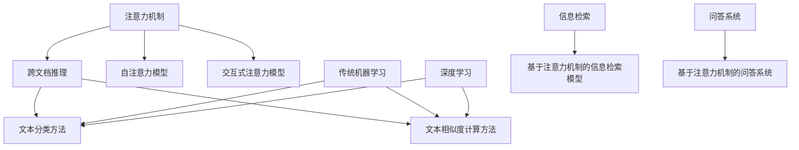

                 


为了撰写一篇关于“基于注意力机制的跨文档推理能力增强方法”的技术博客文章，我们可以按照以下步骤进行思考和结构构建：

### 第一步：明确文章的目的和受众

- **目的**：本篇文章旨在探讨注意力机制在跨文档推理中的应用，通过详细的算法讲解和实际案例分析，帮助读者理解如何利用注意力机制来增强跨文档推理的能力。
- **受众**：本篇文章面向有一定机器学习和自然语言处理基础的读者，特别是对注意力机制和跨文档推理感兴趣的开发者、研究者。

### 第二步：确定文章的结构和内容

根据给出的目录大纲，我们可以将文章内容划分为以下几个部分：

- **引言**：介绍跨文档推理的背景和重要性。
- **基础理论**：解释注意力机制的原理和在跨文档推理中的基本概念。
- **算法详解**：详细讲解注意力机制的计算模型和优化策略。
- **跨文档推理方法与模型**：介绍传统机器学习和深度学习的方法。
- **应用案例**：分析注意力机制在信息检索和问答系统中的应用。
- **挑战与展望**：讨论注意力机制在跨文档推理中的挑战和未来研究方向。
- **总结**：总结文章的核心观点和贡献。

### 第三步：构建核心概念和联系的结构图

使用Mermaid语法，我们可以绘制一个流程图来展示核心概念和它们之间的关系：



### 第四步：编写伪代码和数学公式

对于注意力机制的算法讲解，我们需要编写伪代码来描述算法步骤，并使用LaTeX格式来展示相关的数学模型和公式。

例如，自注意力模型的伪代码可能如下：

```python
for each document D in dataset:
    calculate document representations R
    compute self-attention scores S using softmax
    generate weighted representation W by averaging R and S
    pass W through a dense layer to get final representation F
return F
```

数学公式示例（在段落内）：

$$
\text{Attention}(Q, K, V) = \text{softmax}\left(\frac{QK^T}{\sqrt{d_k}}\right)V
$$

### 第五步：填充每个章节的具体内容

在确定了结构和核心概念后，我们可以开始为每个章节填充具体内容。每个章节都需要详细解释相关的背景、原理、算法、应用案例等。

### 第六步：撰写文章摘要和关键词

- **摘要**：本文首先介绍了跨文档推理的背景及其重要性，接着详细探讨了注意力机制的基本原理以及在跨文档推理中的应用，通过算法讲解和实际案例分析，展示了如何利用注意力机制增强跨文档推理的能力。
- **关键词**：注意力机制，跨文档推理，自注意力模型，交互式注意力模型，信息检索，问答系统。

### 第七步：编写作者信息

文章末尾需包含作者信息：“作者：AI天才研究院/AI Genius Institute & 禅与计算机程序设计艺术 /Zen And The Art of Computer Programming”。

### 第八步：检查文章的完整性和逻辑性

最后，我们需要检查文章的完整性和逻辑性，确保每个章节都有具体的解释、例子和适当的扩展阅读。

按照以上步骤，我们可以撰写一篇结构清晰、内容详尽、逻辑性强且对读者有价值的文章。文章的字数将根据具体内容的详细程度和举例的丰富性来调整，以确保在8000至12000字的范围之内。

