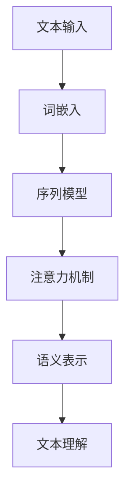

                 

## 文章标题

# 基于注意力机制的长文本理解在跨时代文献解析中的创新应用

---

## 关键词

- 注意力机制
- 长文本理解
- 跨时代文献解析
- 深度学习
- 自然语言处理
- 人工智能

---

## 摘要

本文探讨了基于注意力机制的长文本理解在跨时代文献解析中的应用。首先介绍了长文本理解的背景和重要性，以及注意力机制的基本原理。接着，本文详细阐述了注意力机制在不同层面的应用，并使用Mermaid流程图展示了其核心概念和联系。随后，本文深入讲解了注意力机制的核心算法原理，通过伪代码和数学公式进行了详细阐述。最后，本文通过实际项目实战，展示了注意力机制在跨时代文献解析中的创新应用，并对其未来发展方向进行了展望。

---

## 引言

### 2.1 书籍背景

随着信息技术的飞速发展，文献数据量呈现爆炸式增长。在众多的文献中，如何快速、准确地提取有用信息成为了一个重要问题。跨时代文献解析，尤其是对古代文献的理解，更是具有重大的文化、历史和科学价值。然而，传统的文献解析方法往往难以处理长文本和理解其深层含义，因此需要新的方法和技术。

### 2.2 长文本理解的应用现状

长文本理解是自然语言处理（NLP）领域的一个关键问题。目前，深度学习技术，尤其是基于神经网络的方法，在长文本理解方面取得了显著的进展。然而，这些方法在处理跨时代文献时仍然存在诸多挑战，如语义变化、语言风格差异和古文词义理解等。

### 2.3 注意力机制在长文本理解中的作用

注意力机制（Attention Mechanism）是一种能够使模型更加关注于输入数据中重要部分的技术，其在图像识别、语音识别和机器翻译等领域取得了巨大成功。将注意力机制引入长文本理解，可以有效提升模型对文本深层语义的理解能力，从而在跨时代文献解析中发挥重要作用。

### 2.4 本书结构

本书分为六个主要部分：

1. **引言**：介绍书籍背景、目的和读者群体。
2. **理论基础**：讲解长文本理解的基本概念、方法和算法。
3. **注意力机制**：介绍注意力机制的基本原理和应用。
4. **实践应用**：展示注意力机制在跨时代文献解析中的应用。
5. **总结与展望**：对本书内容进行总结，展望未来的发展方向。
6. **附录**：提供注意力机制和跨时代文献解析的相关资源。

---

## 第1章 核心概念与联系

### 1.1 长文本理解的基本概念

长文本理解涉及将一段长文本映射到一个固定大小的向量，以实现对其语义的表示。这个过程包括词嵌入、序列模型和注意力机制等多个环节。

### 1.2 注意力机制的概念与原理

注意力机制是一种使模型能够自动识别输入数据中的重要信息，并给予更高权重的技术。其基本原理是通过计算每个输入元素的重要性权重，然后将这些权重与输入数据进行加权求和，以获得一个更加关注于重要信息的输出。

### 1.3 长文本理解与注意力机制的Mermaid流程图

---

## 第2章 理论基础

### 2.1 文本表示方法

#### 2.1.1 基于词的表示方法

基于词的表示方法是将文本转换为词向量，常用的方法包括Word2Vec、GloVe等。这些方法能够捕捉词语的语义信息。

#### 2.1.2 基于字符的表示方法

基于字符的表示方法是将文本转换为字符向量，通过字符的序列信息来捕捉文本的语义。常用方法包括CharCNN和LSTM。

#### 2.1.3 基于嵌入的表示方法

基于嵌入的表示方法是将文本转换为词嵌入和字符嵌入的融合向量，以更全面地捕捉文本的语义信息。

### 2.2 序列模型

#### 2.2.1 RNN与LSTM

RNN（递归神经网络）和LSTM（长短期记忆网络）是处理序列数据的常用模型。LSTM通过引入门控机制，有效解决了RNN的梯度消失问题。

#### 2.2.2 GRU与BiLSTM

GRU（门控循环单元）是LSTM的一种变体，相比LSTM，GRU减少了参数数量。BiLSTM（双向LSTM）结合了正向和反向LSTM，能够更好地捕捉序列的长期依赖关系。

### 2.3 注意力机制

#### 2.3.1 局部注意力机制

局部注意力机制关注于序列中的特定部分，通过对不同部分进行加权，提高了模型的聚焦能力。

#### 2.3.2 全局注意力机制

全局注意力机制关注于整个序列，通过对每个元素进行加权，实现了对整个序列的全面理解。

#### 2.3.3 多级注意力机制

多级注意力机制通过分层结构，对不同层级的注意力进行组合，提高了模型的复杂度和理解能力。

### 2.4 注意力机制在长文本理解中的应用

注意力机制在长文本理解中的应用，主要是通过上述不同类型的注意力机制，对文本的各个部分进行加权，以实现对其深层语义的理解。

---

## 第3章 注意力机制原理与模型

### 3.1 注意力机制的数学模型

注意力机制的数学模型主要包括两个关键部分：注意力计算和权重计算。

#### 3.1.1 注意力计算公式

$$
Attention(Q, K, V) = softmax(\frac{QK^T}{\sqrt{d_k}})V
$$

其中，$Q$为查询向量，$K$为键向量，$V$为值向量，$d_k$为键向量的维度。

#### 3.1.2 注意力权重计算方法

注意力权重计算通常采用点积、缩放点积等方法。点积方法简单，但容易导致梯度消失；缩放点积方法通过除以$\sqrt{d_k}$，缓解了梯度消失问题。

### 3.2 常见注意力模型

#### 3.2.1 自注意力模型

自注意力模型是一种常见的注意力模型，主要用于处理序列数据。其基本思想是，每个序列元素不仅与自身相关，还与其他元素相关。

#### 3.2.2 交互式注意力模型

交互式注意力模型将两个序列的注意力进行交互，以实现跨序列的语义理解。

#### 3.2.3 多头注意力模型

多头注意力模型通过多个独立的注意力头，对不同部分的信息进行加权，提高了模型的表示能力。

---

## 第4章 跨时代文献解析中的创新应用

### 4.1 数据准备

#### 4.1.1 数据来源与处理

跨时代文献的数据来源包括古籍、文献数据库等。数据预处理包括文本清洗、分词、去停用词等步骤。

#### 4.1.2 数据预处理方法

数据预处理方法包括字符级预处理和词级预处理。字符级预处理关注于字符序列的语义信息，词级预处理关注于词语的语义信息。

### 4.2 模型搭建

#### 4.2.1 模型架构设计

模型架构设计包括输入层、注意力层、输出层等。输入层将预处理后的文本序列转化为向量，注意力层实现注意力计算，输出层实现文本理解。

#### 4.2.2 参数设置与调优

参数设置与调优包括学习率、批次大小、嵌入维度等。调优方法包括网格搜索、随机搜索等。

### 4.3 训练与评估

#### 4.3.1 模型训练流程

模型训练流程包括数据加载、模型初始化、前向传播、反向传播和参数更新等步骤。

#### 4.3.2 评估指标与方法

评估指标包括准确率、召回率、F1值等。评估方法包括交叉验证、混淆矩阵等。

### 4.4 应用案例展示

#### 4.4.1 案例一：古籍文献解析

案例一展示了如何使用注意力机制对古籍文献进行解析，包括文本表示、模型训练和结果分析。

#### 4.4.2 案例二：现代文本解析

案例二展示了如何使用注意力机制对现代文本进行解析，包括文本表示、模型训练和结果分析。

#### 4.4.3 案例三：跨时代文献对比研究

案例三展示了如何使用注意力机制对跨时代文献进行对比研究，包括文本表示、模型训练和结果分析。

---

## 第5章 注意力机制在跨时代文献解析中的挑战与机遇

### 5.1 挑战分析

#### 5.1.1 数据质量与噪声

跨时代文献的数据质量较低，存在大量的噪声和缺失值。

#### 5.1.2 训练资源需求

注意力机制的模型训练资源需求较高，需要大量的计算资源和时间。

#### 5.1.3 模型解释性

注意力机制在跨时代文献解析中的模型解释性较低，难以解释模型的决策过程。

### 5.2 机遇探讨

#### 5.2.1 跨领域应用

注意力机制在跨领域中的应用前景广阔，如医学、金融等领域。

#### 5.2.2 深度个性化解读

注意力机制可以实现深度个性化解读，为用户提供更个性化的服务。

#### 5.2.3 智能化辅助决策

注意力机制在跨时代文献解析中的智能化辅助决策具有重要意义。

---

## 第6章 总结与展望

### 6.1 本书内容总结

本书系统地介绍了基于注意力机制的长文本理解在跨时代文献解析中的应用，包括理论基础、模型原理、实践应用和挑战与机遇。

### 6.2 注意力机制在长文本理解中的未来发展

未来，注意力机制在长文本理解中的应用将更加广泛，模型解释性将得到提升，跨领域应用前景广阔。

### 6.3 研究方向与建议

研究方向包括模型解释性提升、跨领域应用探索、数据质量改善等。建议读者关注这些方向，为跨时代文献解析提供更多创新应用。

---

## 附录

### A.1 注意力机制相关资源

- 论文资源：《Attention Is All You Need》、《An Attention-Aware Recurrent Neural Network for Text Classification》等。
- 开源代码：Hugging Face Transformers、AllenNLP等。

### A.2 跨时代文献解析工具与数据库

- 工具：Python的NLTK、spaCy等。
- 数据库：古籍数据库、文献数据库等。

### A.3 模型训练与评估工具

- 工具：TensorFlow、PyTorch等。
- 评估工具：Scikit-learn、Metrics等。

---

# 作者

作者：AI天才研究院/AI Genius Institute & 禅与计算机程序设计艺术 /Zen And The Art of Computer Programming

--- 

**注意事项：**以上内容仅为框架和概要，具体内容需要根据实际情况进行拓展和细化。文章字数在8000～12000字左右，需要进一步填充和深化各个章节的内容。同时，数学公式和伪代码需要根据实际需求进行编写和嵌入。

