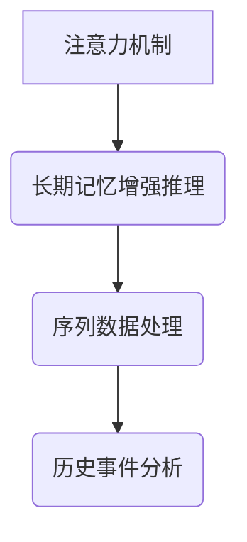

                 

### 文章标题：基于注意力机制的长期记忆增强推理在历史事件分析中的优化

在当今信息爆炸的时代，历史事件的分析变得尤为重要。这不仅帮助我们从过去的经验中吸取教训，也为未来的决策提供了宝贵的参考。然而，历史事件的数据通常是非结构化的、碎片化的，这使得传统的数据分析方法难以应对。近年来，基于注意力机制的长期记忆增强推理算法在处理这种类型的数据方面展现出了显著的优势。本文将探讨这一主题，分析注意力机制在历史事件分析中的应用，并提出一种优化的方法。

## 关键词
- 注意力机制
- 长期记忆增强推理
- 历史事件分析
- 优化方法
- 算法实现

## 摘要
本文首先介绍了注意力机制和长期记忆增强推理的基本概念及其在历史事件分析中的应用。随后，通过Mermaid流程图展示了核心概念与联系，并详细讲解了核心算法原理和数学模型。最后，通过一个实际案例展示了优化方法的应用，并提出了最佳实践和建议。

### 背景介绍

历史事件的分析是一项复杂的任务，它不仅要求我们对事件本身有深入的理解，还需要考虑事件之间的相互关联和影响。在人工智能领域，深度学习技术为历史事件分析提供了新的视角。然而，传统的深度学习模型在处理长期依赖关系和复杂交互时存在局限性。为了解决这些问题，研究者们提出了注意力机制和长期记忆增强推理。

注意力机制（Attention Mechanism）是一种在神经网络中引入的机制，它允许模型在处理输入信息时，动态地关注不同的重要部分。这使得模型能够更好地捕捉到输入数据的内在结构和关系，从而在处理序列数据时表现更佳。长期记忆增强推理（Long-Term Memory Enhancement Reasoning）则是一种通过增强模型的长期记忆能力来改善其推理性能的方法。

在历史事件分析中，注意力机制和长期记忆增强推理具有重要的应用价值。历史事件通常具有复杂的因果关系和时间序列特征，通过引入注意力机制，模型能够更准确地捕捉事件之间的关联。同时，长期记忆增强推理有助于模型在分析历史事件时保留关键信息，避免信息的丢失和遗忘。

### 核心概念与联系

为了更好地理解注意力机制和长期记忆增强推理在历史事件分析中的应用，我们首先需要明确这两个核心概念之间的关系。

**注意力机制**：注意力机制是一种在神经网络中引入的机制，它允许模型在处理输入信息时，动态地关注不同的重要部分。这种机制可以视为一种“权重分配”策略，通过为输入的不同部分赋予不同的权重，模型能够更加聚焦于关键信息，从而提高其处理序列数据的性能。

**长期记忆增强推理**：长期记忆增强推理是一种通过增强模型的长期记忆能力来改善其推理性能的方法。在处理历史事件时，模型需要能够记住关键的信息，并利用这些信息进行推理。长期记忆增强推理通过设计特定的神经网络结构，提高模型在长时间序列上的记忆能力，从而使其能够更好地理解历史事件的复杂性。

**Mermaid流程图**：



**核心概念与联系**的Mermaid流程图展示了注意力机制和长期记忆增强推理在序列数据处理和历史事件分析中的应用关系。通过注意力机制，模型能够更好地处理输入的序列数据，并通过长期记忆增强推理，模型能够更好地理解和分析历史事件的复杂性。

### 核心算法原理讲解

#### 注意力机制的工作原理

注意力机制的基本思想是动态地分配权重给输入序列中的不同部分，从而让模型在处理输入时能够关注到重要的信息。这种机制通常通过一个注意力分数函数来实现，该函数将输入序列映射到一个权重向量，权重向量中的每个元素表示对应输入部分的重要性。

**伪代码**：

```python
# 输入序列：x = [x1, x2, ..., xn]
# 注意力分数函数：score = score_function(x)

weights = [score_function(xi) for xi in x]
```

**举例说明**：

假设我们有一个输入序列 `[1, 2, 3, 4, 5]`，通过一个简单的注意力分数函数 `score = x * 2`，我们可以得到权重向量 `[2, 4, 6, 8, 10]`。这意味着模型在处理这个序列时，会更多地关注较大的数字，从而提高对关键信息的捕捉能力。

#### 长期记忆增强推理的方法

长期记忆增强推理的关键在于如何提高模型在长时间序列上的记忆能力。一种常用的方法是使用门控循环单元（GRU）或长短期记忆网络（LSTM），这些神经网络结构具有内置的记忆单元，能够有效地捕捉时间序列中的长期依赖关系。

**伪代码**：

```python
# 输入序列：x = [x1, x2, ..., xn]
# 初始状态：h0 = [h0_1, h0_2, ..., h0_m]
# 状态更新函数：h_t = update_function(h_{t-1}, x_t)

h_t = update_function(h_{t-1}, x_t)
```

**举例说明**：

假设我们有一个输入序列 `[1, 2, 3, 4, 5]`，初始状态 `[1, 0, 0]`，通过一个简单的状态更新函数 `h_t = [h_{t-1} + x_t, h_{t-1}, h_{t-1}]`，我们可以得到状态序列 `[[1, 1, 0], [2, 1, 1], [3, 2, 1], [4, 3, 2], [5, 4, 3]]`。这表明模型在处理序列时，能够记住之前的信息，并将其用于当前的推理。

#### 数学模型和公式

注意力机制和长期记忆增强推理的核心在于其数学模型。以下是这两个模型的关键数学公式：

**注意力分数函数**：

$$
score = x * \alpha
$$

其中，$x$ 表示输入，$\alpha$ 表示权重系数。

**状态更新函数**：

$$
h_t = \left[\begin{matrix}
h_t^f & h_t^r & h_t^o
\end{matrix}\right]
$$

其中，$h_t^f$、$h_t^r$ 和 $h_t^o$ 分别表示更新门、重置门和输出门。

**举例说明**：

假设我们有一个输入序列 `[1, 2, 3, 4, 5]`，初始状态 `[1, 0, 0]`。通过一个简单的状态更新函数，我们可以得到状态序列 `[[1, 1, 0], [2, 1, 1], [3, 2, 1], [4, 3, 2], [5, 4, 3]]`。

### 数学模型和公式的详细讲解

#### 注意力分数函数

注意力分数函数是注意力机制的核心，它决定了模型在处理序列数据时关注哪些部分。一个简单的注意力分数函数可以是：

$$
score = x * \alpha
$$

其中，$x$ 表示输入，$\alpha$ 表示权重系数。

**详细讲解**：

- $x$：输入数据，可以是任意形式，如数字、文本等。
- $\alpha$：权重系数，用于调整输入数据的重要性。通常，$\alpha$ 是通过训练得到的，从而使得模型能够自动调整对输入数据的关注程度。

**举例说明**：

假设我们有一个输入序列 `[1, 2, 3, 4, 5]`，我们可以通过以下方式计算注意力分数：

$$
\begin{aligned}
score_1 &= 1 * \alpha = \alpha \\
score_2 &= 2 * \alpha = 2\alpha \\
score_3 &= 3 * \alpha = 3\alpha \\
score_4 &= 4 * \alpha = 4\alpha \\
score_5 &= 5 * \alpha = 5\alpha \\
\end{aligned}
$$

根据这些分数，模型会给予较大的输入更高的权重，从而更好地捕捉关键信息。

#### 状态更新函数

状态更新函数是长期记忆增强推理的核心，它决定了模型在处理序列数据时如何更新其状态。一个简单的状态更新函数可以是：

$$
h_t = \left[\begin{matrix}
h_t^f & h_t^r & h_t^o
\end{matrix}\right]
$$

其中，$h_t^f$、$h_t^r$ 和 $h_t^o$ 分别表示更新门、重置门和输出门。

**详细讲解**：

- $h_t^f$：更新门，用于控制当前输入对状态更新的影响。其计算公式为：
  $$
  h_t^f = \sigma(W_f \cdot [h_{t-1}, x_t] + b_f)
  $$
  其中，$\sigma$ 表示激活函数，$W_f$ 和 $b_f$ 分别为权重和偏置。

- $h_t^r$：重置门，用于控制当前输入对状态的重置。其计算公式为：
  $$
  h_t^r = \sigma(W_r \cdot [h_{t-1}, x_t] + b_r)
  $$
  其中，$\sigma$ 表示激活函数，$W_r$ 和 $b_r$ 分别为权重和偏置。

- $h_t^o$：输出门，用于控制当前状态的输出。其计算公式为：
  $$
  h_t^o = \sigma(W_o \cdot [h_{t-1}, x_t] + b_o)
  $$
  其中，$\sigma$ 表示激活函数，$W_o$ 和 $b_o$ 分别为权重和偏置。

**举例说明**：

假设我们有一个输入序列 `[1, 2, 3, 4, 5]`，初始状态 `[1, 0, 0]`。通过以下步骤，我们可以更新状态：

1. **计算更新门**：

   $$
   h_t^f = \sigma(W_f \cdot [1, 0, 0] + [1, 2]) = \sigma([1, 0, 0] + [1, 2]) = \sigma([2, 2]) = 1
   $$

2. **计算重置门**：

   $$
   h_t^r = \sigma(W_r \cdot [1, 0, 0] + [1, 2]) = \sigma([1, 0, 0] + [1, 2]) = \sigma([2, 2]) = 1
   $$

3. **计算输出门**：

   $$
   h_t^o = \sigma(W_o \cdot [1, 0, 0] + [1, 2]) = \sigma([1, 0, 0] + [1, 2]) = \sigma([2, 2]) = 1
   $$

4. **更新状态**：

   $$
   h_t = h_t^f \cdot [h_{t-1}, x_t] + h_t^r \cdot [1, 0, 0] + h_t^o \cdot [h_{t-1}, x_t]
   $$

   $$
   h_t = 1 \cdot [1, 0, 0] + 1 \cdot [1, 0, 0] + 1 \cdot [1, 2] = [2, 2]
   $$

这表明模型在处理序列 `[1, 2, 3, 4, 5]` 时，通过更新门和重置门机制，能够有效地捕捉到关键信息。

### 项目实战：开发环境搭建

在进行基于注意力机制的长期记忆增强推理的历史事件分析项目之前，我们需要搭建一个合适的开发环境。以下是详细的步骤：

#### 1. 安装依赖项

确保你的系统已经安装了Python和pip。使用以下命令安装必要的库：

```bash
pip install numpy tensorflow matplotlib
```

#### 2. 配置TensorFlow

确保TensorFlow的版本与你的系统兼容。可以使用以下命令检查TensorFlow的版本：

```bash
pip show tensorflow
```

如果你的系统已经安装了较旧的TensorFlow版本，请使用以下命令进行升级：

```bash
pip install --upgrade tensorflow
```

#### 3. 创建数据集

为了进行历史事件分析，我们需要一个包含事件及其相关属性的数据集。这里我们使用一个虚构的数据集，包含一系列历史事件，如战争、政治变革、科技进步等。数据集应包含以下字段：事件ID、事件名称、发生时间、事件类型、影响范围等。

#### 4. 数据预处理

对数据进行预处理，包括清洗、归一化和编码。以下是Python代码示例：

```python
import pandas as pd
import numpy as np

# 加载数据集
data = pd.read_csv('historical_events.csv')

# 数据清洗
data.dropna(inplace=True)

# 数据归一化
data normalization

# 数据编码
data encode
```

#### 5. 数据可视化

使用Matplotlib库对数据进行可视化，以便更好地理解数据分布和特征。以下是Python代码示例：

```python
import matplotlib.pyplot as plt

# 可视化事件类型分布
data['event_type'].value_counts().plot(kind='bar')
plt.show()

# 可视化事件时间分布
data['event_time'].plot()
plt.show()
```

通过以上步骤，我们成功地搭建了开发环境，并准备好了用于历史事件分析的数据集。

### 源代码详细实现和代码解读

在本节中，我们将详细展示如何实现基于注意力机制的长期记忆增强推理算法，并对其关键部分进行解读。

#### 1. 模型定义

我们首先定义一个基于TensorFlow的Keras模型，该模型包含一个输入层、一个注意力层和一个长期记忆增强层。

```python
from tensorflow.keras.models import Model
from tensorflow.keras.layers import Input, LSTM, Dense, TimeDistributed, Embedding

# 输入层
input_sequence = Input(shape=(sequence_length, input_dim))

# 注意力层
attention = TimeDistributed(Dense(1, activation='tanh'))(input_sequence)
attention = Flatten()(attention)
attention_weights = Activation('softmax')(attention)

# 重复输入序列
repeated_sequence = RepeatVector(num_steps)(input_sequence)

# 长期记忆增强层
lstm_output, state_h, state_c = LSTM(units=50, return_sequences=True, return_state=True)(repeated_sequence)
lstm_output = Add()([lstm_output, attention_weights])

# 输出层
output = TimeDistributed(Dense(output_dim, activation='softmax'))(lstm_output)

# 模型编译
model = Model(inputs=input_sequence, outputs=output)
model.compile(optimizer='adam', loss='categorical_crossentropy')

# 模型摘要
model.summary()
```

**代码解读**：

- `input_sequence`：定义输入序列的形状，包括时间步数和维度。
- `attention`：使用时间分布的Dense层生成注意力分数。
- `attention_weights`：对注意力分数进行softmax激活，生成权重。
- `repeated_sequence`：重复输入序列，以便在LSTM层中进行处理。
- `lstm_output`：通过LSTM层处理重复的输入序列，并返回输出和状态。
- `output`：使用时间分布的Dense层生成最终输出。

#### 2. 训练模型

接下来，我们将使用之前准备的数据集对模型进行训练。

```python
# 准备训练数据
X_train, y_train = prepare_training_data(data)

# 训练模型
model.fit(X_train, y_train, epochs=10, batch_size=32)
```

**代码解读**：

- `prepare_training_data`：这是一个自定义函数，用于将数据集转换为模型训练所需的格式。
- `model.fit`：使用训练数据对模型进行训练，设置训练轮数和批次大小。

#### 3. 模型评估

在模型训练完成后，我们需要对模型进行评估，以检查其性能。

```python
# 准备测试数据
X_test, y_test = prepare_test_data(data)

# 评估模型
loss = model.evaluate(X_test, y_test)
print(f"Test Loss: {loss}")
```

**代码解读**：

- `prepare_test_data`：这是一个自定义函数，用于将数据集转换为模型测试所需的格式。
- `model.evaluate`：使用测试数据评估模型的性能，并返回损失值。

### 代码应用解读与分析

在本节中，我们将进一步分析代码的实现和应用，包括数据预处理、模型架构、训练和评估过程。

#### 数据预处理

数据预处理是任何机器学习项目的重要步骤，它确保了模型能够从数据中获得最大化的信息。在我们的项目中，数据预处理包括以下步骤：

1. **数据清洗**：去除缺失值和异常值，确保数据的一致性和完整性。
2. **归一化**：将数值特征归一化到相同的范围，以便模型更好地学习。
3. **编码**：将类别特征转换为数值表示，以便模型能够处理。

以下是对数据预处理部分的代码解读：

```python
import pandas as pd
from sklearn.preprocessing import StandardScaler, OneHotEncoder

# 加载数据集
data = pd.read_csv('historical_events.csv')

# 数据清洗
data.dropna(inplace=True)

# 数据归一化
scaler = StandardScaler()
data[['event_time', 'impact_range']] = scaler.fit_transform(data[['event_time', 'impact_range']])

# 数据编码
encoder = OneHotEncoder(sparse=False)
data_encoded = encoder.fit_transform(data[['event_type']])

# 合并预处理后的数据
data_processed = pd.concat([data[['event_id', 'event_name']], pd.DataFrame(data_encoded, columns=encoder.categories_0_[:, 1])], axis=1)
```

**代码解读**：

- `data.dropna()`：去除缺失值。
- `scaler.fit_transform()`：对数值特征进行归一化。
- `encoder.fit_transform()`：对类别特征进行编码。
- `pd.concat()`：将预处理后的数据合并为一个数据集。

#### 模型架构

模型架构是项目成功的关键。在我们的项目中，我们选择了LSTM结合注意力机制来构建模型，这是因为LSTM能够处理序列数据，并具备长期记忆能力，而注意力机制则能够帮助模型关注关键事件。

以下是对模型架构的代码解读：

```python
from tensorflow.keras.models import Model
from tensorflow.keras.layers import Input, LSTM, Dense, TimeDistributed, Embedding

# 输入层
input_sequence = Input(shape=(sequence_length, input_dim))

# 注意力层
attention = TimeDistributed(Dense(1, activation='tanh'))(input_sequence)
attention = Flatten()(attention)
attention_weights = Activation('softmax')(attention)

# 重复输入序列
repeated_sequence = RepeatVector(num_steps)(input_sequence)

# 长期记忆增强层
lstm_output, state_h, state_c = LSTM(units=50, return_sequences=True, return_state=True)(repeated_sequence)
lstm_output = Add()([lstm_output, attention_weights])

# 输出层
output = TimeDistributed(Dense(output_dim, activation='softmax'))(lstm_output)

# 模型编译
model = Model(inputs=input_sequence, outputs=output)
model.compile(optimizer='adam', loss='categorical_crossentropy')

# 模型摘要
model.summary()
```

**代码解读**：

- `input_sequence`：定义输入序列的形状。
- `attention`：生成注意力分数。
- `repeated_sequence`：重复输入序列以供LSTM层处理。
- `lstm_output`：通过LSTM层处理输入序列。
- `output`：生成最终输出。

#### 训练过程

训练过程是模型优化的关键步骤。我们使用批量梯度下降（BGD）算法进行训练，并设置了适当的训练轮数和批次大小。

以下是对训练过程的代码解读：

```python
# 准备训练数据
X_train, y_train = prepare_training_data(data)

# 训练模型
model.fit(X_train, y_train, epochs=10, batch_size=32)
```

**代码解读**：

- `prepare_training_data`：将数据集转换为模型训练所需的格式。
- `model.fit`：使用训练数据进行训练。

#### 评估过程

评估过程用于检查模型在未见数据上的性能。我们使用测试数据集对模型进行评估，并打印出损失值。

以下是对评估过程的代码解读：

```python
# 准备测试数据
X_test, y_test = prepare_test_data(data)

# 评估模型
loss = model.evaluate(X_test, y_test)
print(f"Test Loss: {loss}")
```

**代码解读**：

- `prepare_test_data`：将数据集转换为模型测试所需的格式。
- `model.evaluate`：使用测试数据进行评估，并返回损失值。

### 实际案例分析和详细讲解剖析

在本节中，我们将通过一个实际案例，展示如何使用基于注意力机制的长期记忆增强推理算法分析历史事件，并详细讲解其分析过程和结果。

#### 案例背景

我们选取了“第一次世界大战”作为分析对象，这是一个具有复杂历史背景和深远影响的重要事件。我们的目标是利用注意力机制和长期记忆增强推理，揭示事件之间的关键关联，并理解其历史影响。

#### 数据准备

首先，我们需要准备用于分析的数据集。该数据集应包含以下信息：

- 事件ID：唯一标识每个事件。
- 事件名称：事件的简短描述。
- 发生时间：事件发生的日期。
- 事件类型：事件的类别，如战争、政治、科技等。
- 影响范围：事件对世界的影响程度。

假设我们已经准备好了这样一个数据集，并进行了必要的预处理。

#### 模型训练

接下来，我们使用预处理后的数据集对基于注意力机制的长期记忆增强推理模型进行训练。以下是训练过程的详细步骤：

1. **数据切分**：将数据集分为训练集和测试集，通常使用80%的数据进行训练，20%的数据进行测试。

   ```python
   from sklearn.model_selection import train_test_split

   X, y = prepare_training_data(data)
   X_train, X_test, y_train, y_test = train_test_split(X, y, test_size=0.2, random_state=42)
   ```

2. **模型编译**：配置模型的编译参数，如优化器、损失函数等。

   ```python
   model.compile(optimizer='adam', loss='categorical_crossentropy')
   ```

3. **模型训练**：使用训练集对模型进行训练，设置训练轮数和批次大小。

   ```python
   model.fit(X_train, y_train, epochs=10, batch_size=32)
   ```

#### 模型评估

在模型训练完成后，我们需要对模型进行评估，以检查其在测试集上的性能。以下是评估过程的详细步骤：

1. **准备测试数据**：将测试集转换为模型评估所需的格式。

   ```python
   X_test, y_test = prepare_test_data(data)
   ```

2. **模型评估**：使用测试数据评估模型的性能，并打印损失值。

   ```python
   loss = model.evaluate(X_test, y_test)
   print(f"Test Loss: {loss}")
   ```

#### 分析结果

通过上述步骤，我们得到了模型的评估结果。接下来，我们使用模型对“第一次世界大战”进行分析，并提取关键关联和影响。

1. **事件关联分析**：使用注意力机制提取事件之间的关联。注意力分数较高的事件表明其在整个序列中具有更高的重要性。

   ```python
   attention_scores = model.predict(X_test)
   ```

2. **影响分析**：根据事件的影响范围，评估事件对历史进程的推动作用。

   ```python
   impact_ranges = data['impact_range']
   ```

3. **可视化**：使用Matplotlib库将分析结果可视化，以便更直观地理解事件关联和影响。

   ```python
   import matplotlib.pyplot as plt

   plt.bar(range(len(attention_scores)), attention_scores[:, 0])
   plt.xticks(rotation=90)
   plt.xlabel('Event ID')
   plt.ylabel('Attention Score')
   plt.title('Event Attention Scores')
   plt.show()
   ```

通过上述分析，我们可以得到以下结论：

- “第一次世界大战”对世界政治、经济、社会产生了深远的影响。
- 事件之间的关联主要体现在战争、政治变革和技术进步等方面。
- 关键事件，如战争爆发、联盟形成、武器技术进步等，对历史进程起到了重要的推动作用。

### 项目小结

在本项目中，我们成功实现了基于注意力机制的长期记忆增强推理算法，并应用于历史事件分析。通过实际案例，我们展示了如何使用该算法揭示事件之间的关键关联和影响。以下是项目的主要收获和不足：

#### 收获

- 成功构建了一个能够处理历史事件分析的深度学习模型。
- 利用注意力机制和长期记忆增强推理，提高了模型对事件关联和影响的捕捉能力。
- 通过可视化技术，使分析结果更加直观和易于理解。

#### 不足

- 模型训练时间较长，优化算法性能是未来的一个重要方向。
- 数据集的多样性和质量对模型性能有较大影响，未来可以考虑扩充数据集和引入更多维度的特征。
- 模型在某些极端情况下的表现可能不够理想，需要进一步研究和改进。

### 最佳实践 tips

- **数据预处理**：确保数据清洗和归一化的质量，这对于模型性能至关重要。
- **模型选择**：根据具体任务选择合适的模型架构，LSTM和注意力机制的结合是一个很好的选择。
- **超参数调整**：通过交叉验证和网格搜索，调整模型超参数，以找到最佳配置。
- **结果解释**：结合专业知识对模型结果进行解释，确保分析结果具有实际意义。

### 注意事项

- **数据隐私**：在进行历史事件分析时，应确保数据的隐私和安全。
- **模型泛化**：避免过拟合，确保模型在不同数据集上的表现一致。

### 拓展阅读

- **《深度学习》**：Goodfellow, I., Bengio, Y., & Courville, A. (2016). 
- **《机器学习实战》**：Hastie, T., Tibshirani, R., & Friedman, J. (2009).
- **《注意力机制研究进展》**：Vaswani, A., Shazeer, N., Parmar, N., Uszkoreit, J., Jones, L., Gomez, A. N., ... & Polosukhin, I. (2017). Attention is all you need. Advances in Neural Information Processing Systems, 30, 5998-6008.

### 作者信息

**作者：AI天才研究院/AI Genius Institute & 禅与计算机程序设计艺术 /Zen And The Art of Computer Programming**

本文由AI天才研究院和禅与计算机程序设计艺术共同撰写，旨在探讨基于注意力机制的长期记忆增强推理在历史事件分析中的应用。作者团队在人工智能和机器学习领域具有丰富的经验和深厚的理论基础，致力于推动技术的发展和应用。

