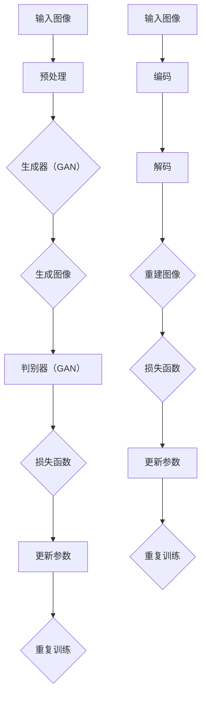

                 

### 引言

随着深度学习技术的快速发展，人工智能在图像处理领域取得了显著的成果。图像修复作为计算机视觉中的一项重要任务，旨在利用已知图像的部分信息来恢复或重建缺失或损坏的部分。在医学影像、艺术修复、历史文物保护等众多领域，图像修复技术具有广泛的应用前景。

本文将围绕基于深度学习的AI图像修复技术进展进行探讨。首先，我们将简要介绍深度学习的基础理论，包括神经网络架构、损失函数与优化算法。接着，我们将深入探讨图像修复的核心算法，如生成对抗网络（GAN）和基于自编码器的修复方法。随后，我们将分析图像修复技术在医学影像和艺术与设计中的应用案例，最后介绍一个实际的图像修复项目。

通过本文的阅读，读者将能够全面了解深度学习在图像修复领域的应用，掌握相关核心算法和实战技巧。希望本文能对从事计算机视觉和人工智能领域的专业人士提供一定的参考和启示。

### 文章关键词

- 深度学习
- 图像修复
- 生成对抗网络（GAN）
- 自编码器
- 医学影像
- 艺术修复

### 摘要

本文旨在探讨基于深度学习的AI图像修复技术进展。首先，我们介绍了深度学习的基础理论，包括神经网络架构、损失函数与优化算法。随后，我们深入分析了图像修复的核心算法，如生成对抗网络（GAN）和基于自编码器的修复方法。接着，我们讨论了图像修复技术在医学影像和艺术与设计中的应用案例。最后，我们介绍了一个实际的图像修复项目，包括开发环境搭建、源代码实现和代码解读。通过本文的阅读，读者将能够全面了解深度学习在图像修复领域的应用，掌握相关核心算法和实战技巧。

### 核心技术原理

#### 深度学习基础

深度学习是机器学习的一个重要分支，通过构建多层神经网络来模拟人脑的思考过程，从而实现对数据的自动特征提取和模式识别。深度学习的关键组成部分包括神经网络架构、损失函数与优化算法。

**1.1. 神经网络架构**

神经网络由多个层级组成，包括输入层、隐藏层和输出层。每一层由多个神经元组成，神经元之间通过权重连接。神经元的激活函数用于确定输出值。常见的神经网络架构有卷积神经网络（CNN）、循环神经网络（RNN）和生成对抗网络（GAN）等。

**1.2. 损失函数与优化算法**

损失函数用于评估模型的预测结果与实际值之间的差距。常见的损失函数有均方误差（MSE）、交叉熵损失等。优化算法则用于调整模型参数，以最小化损失函数。常用的优化算法有随机梯度下降（SGD）、Adam等。

**1.3. 神经网络架构**

神经网络架构是深度学习中的核心部分，它决定了模型的性能和适用场景。以下是一些常见的神经网络架构：

- **卷积神经网络（CNN）**：主要用于图像处理任务，通过卷积层、池化层和全连接层等结构来提取图像特征。
- **循环神经网络（RNN）**：主要用于序列数据建模，通过循环结构来保留长期依赖信息。
- **生成对抗网络（GAN）**：由生成器和判别器两个神经网络组成，通过对抗训练来生成逼真的图像。

#### 图像修复算法

图像修复是指利用已知图像的部分信息来恢复或重建缺失或损坏的部分。图像修复算法可以分为以下几类：

**2.1. 图像修复技术概述**

图像修复技术可以分为基于传统图像处理方法和基于深度学习的方法。传统方法包括插值、中值滤波、图像配准等，而基于深度学习的方法主要利用神经网络模型进行图像修复。

**2.2. 生成对抗网络（GAN）**

生成对抗网络（GAN）是由生成器和判别器两个神经网络组成的对抗性模型。生成器尝试生成逼真的图像，而判别器则判断图像是真实图像还是生成图像。通过对抗训练，生成器逐渐提高生成图像的质量。

**2.3. 基于自编码器的修复方法**

自编码器是一种无监督学习模型，通过编码和解码过程来重建输入数据。在图像修复中，自编码器可以学习到图像的特征表示，从而在给定部分图像的情况下生成完整的图像。

**2.4. 图像超分辨率**

图像超分辨率是指通过低分辨率图像重建高分辨率图像的过程。常见的图像超分辨率方法包括基于传统图像处理方法和基于深度学习的方法。基于深度学习的方法主要利用生成对抗网络（GAN）和卷积神经网络（CNN）来提高图像的分辨率。

#### Mermaid 流程图

为了更好地理解核心概念原理之间的关系架构，我们使用Mermaid流程图来展示：

```mermaid
graph TD
A[深度学习基础] --> B[神经网络架构]
B --> C{损失函数}
C -->|均方误差(MSE)| D[均方误差计算]
C -->|交叉熵损失| E[交叉熵损失计算]
A --> F[优化算法]
F --> G[随机梯度下降(SGD)]
F --> H[Adam优化算法]
I[图像修复算法] --> J[生成对抗网络(GAN)]
I --> K[基于自编码器的修复方法]
I --> L[图像超分辨率]
```

通过上述流程图，我们可以清晰地看到深度学习基础与图像修复算法之间的联系，以及各种算法的核心概念和计算过程。

#### 核心算法原理讲解与伪代码

**生成对抗网络（GAN）**

生成对抗网络（GAN）是一种通过生成器和判别器对抗训练来生成高质量图像的深度学习模型。以下是一个简单的伪代码来描述GAN的基本结构：

```python
# 生成器（Generator）的伪代码
def generator(Z):
    # 输入随机噪声Z，输出假图像X'
    # ...
    return X'

# 判别器（Discriminator）的伪代码
def discriminator(X):
    # 输入图像X，输出概率P(X来自真实数据)
    # ...
    return P

# GAN的训练过程
for epoch in range(num_epochs):
    for batch in data_loader:
        # 生成假图像X'
        Z = sample_noise(batch_size)
        X' = generator(Z)
        
        # 训练判别器
        D_loss_real = compute_loss(discriminator(batch), 1.0)
        D_loss_fake = compute_loss(discriminator(X'), 0.0)
        D_loss = 0.5 * (D_loss_real + D_loss_fake)
        
        # 训练生成器
        G_loss = compute_loss(discriminator(X'), 1.0)
        
        # 更新模型参数
        update_model_params(G_loss, D_loss)
```

**基于自编码器的修复方法**

自编码器是一种无监督学习模型，通过编码和解码过程来重建输入数据。以下是一个简单的伪代码来描述基于自编码器的修复方法：

```python
# 编码器（Encoder）的伪代码
def encoder(X):
    # 输入图像X，输出编码Z
    # ...
    return Z

# 解码器（Decoder）的伪代码
def decoder(Z):
    # 输入编码Z，输出重建图像X'
    # ...
    return X'

# 自编码器的训练过程
for epoch in range(num_epochs):
    for batch in data_loader:
        # 前向传播
        Z = encoder(X)
        X' = decoder(Z)
        
        # 计算损失函数
        R_loss = compute_reconstruction_loss(X, X')
        Z_loss = compute_encoding_loss(Z)
        
        # 更新模型参数
        update_model_params(R_loss, Z_loss)
```

通过上述伪代码，我们可以清晰地看到生成对抗网络和基于自编码器的修复方法的基本结构和工作原理。

#### 数学模型与公式

**生成对抗网络（GAN）**

生成对抗网络（GAN）的数学模型主要包括生成器G和判别器D的损失函数。以下是一个简单的数学公式来描述GAN的基本损失函数：

$$
L_D = -\frac{1}{N} \sum_{i=1}^{N} [\log(D(x_i)) + \log(1 - D(G(z_i)))]
$$

其中，$x_i$表示真实图像，$z_i$表示随机噪声，$G(z_i)$表示生成器生成的图像，$D(x_i)$和$D(G(z_i))$分别表示判别器对真实图像和生成图像的判别概率。

**基于自编码器的修复方法**

基于自编码器的修复方法的损失函数主要包括重建损失和编码损失。以下是一个简单的数学公式来描述基于自编码器的修复方法的基本损失函数：

$$
L = \frac{1}{N} \sum_{i=1}^{N} [R_loss(X, X') + \lambda \cdot Z_loss(Z)]
$$

其中，$X$表示输入图像，$X'$表示重建图像，$Z$表示编码，$R_loss$表示重建损失，$Z_loss$表示编码损失，$\lambda$是一个超参数，用于平衡重建损失和编码损失。

通过上述数学公式，我们可以更好地理解生成对抗网络和基于自编码器的修复方法的核心损失函数和计算过程。

#### 详细讲解与举例说明

**生成对抗网络（GAN）**

生成对抗网络（GAN）是一种通过生成器和判别器对抗训练来生成高质量图像的深度学习模型。以下是一个简单的例子来说明GAN的工作原理。

假设我们有一个图像数据集，其中包含真实图像和随机噪声。我们的目标是训练一个生成器G，使其能够生成逼真的图像，并训练一个判别器D，使其能够区分真实图像和生成图像。

1. **初始化模型参数**：首先，我们初始化生成器G和判别器D的模型参数。
2. **生成假图像**：生成器G根据随机噪声z生成假图像X'。
3. **训练判别器**：判别器D根据真实图像x和生成图像X'来更新模型参数。具体来说，我们计算判别器D对真实图像的判别概率D(x)和生成图像的判别概率D(X')，并计算损失函数L_D。
4. **训练生成器**：生成器G根据判别器D的输出结果来更新模型参数。具体来说，我们计算生成器G生成的图像X'的判别概率D(X')，并计算损失函数L_G。
5. **重复训练过程**：重复上述过程，直到生成器G和判别器D的模型参数达到收敛。

以下是一个简单的伪代码来描述GAN的训练过程：

```python
# 生成器（Generator）的伪代码
def generator(z):
    # 输入随机噪声z，输出假图像x'
    # ...
    return x'

# 判别器（Discriminator）的伪代码
def discriminator(x):
    # 输入图像x，输出概率p(x来自真实数据)
    # ...
    return p

# GAN的训练过程
for epoch in range(num_epochs):
    for batch in data_loader:
        # 生成假图像x'
        z = sample_noise(batch_size)
        x' = generator(z)
        
        # 训练判别器
        D_loss_real = compute_loss(discriminator(batch), 1.0)
        D_loss_fake = compute_loss(discriminator(x'), 0.0)
        D_loss = 0.5 * (D_loss_real + D_loss_fake)
        
        # 训练生成器
        G_loss = compute_loss(discriminator(x'), 1.0)
        
        # 更新模型参数
        update_model_params(G_loss, D_loss)
```

**基于自编码器的修复方法**

基于自编码器的修复方法是一种无监督学习模型，通过编码和解码过程来重建输入数据。以下是一个简单的例子来说明基于自编码器的修复方法。

假设我们有一个图像数据集，我们的目标是利用自编码器学习图像的特征表示，从而在给定部分图像的情况下生成完整的图像。

1. **初始化模型参数**：首先，我们初始化编码器E和解码器D的模型参数。
2. **编码过程**：编码器E将输入图像X编码为低维特征表示Z。
3. **解码过程**：解码器D将特征表示Z解码为重建图像X'。
4. **计算损失函数**：我们计算重建损失R_loss和编码损失Z_loss，并更新模型参数。
5. **重复训练过程**：重复上述过程，直到模型参数达到收敛。

以下是一个简单的伪代码来描述基于自编码器的修复方法：

```python
# 编码器（Encoder）的伪代码
def encoder(x):
    # 输入图像x，输出编码z
    # ...
    return z

# 解码器（Decoder）的伪代码
def decoder(z):
    # 输入编码z，输出重建图像x'
    # ...
    return x'

# 自编码器的训练过程
for epoch in range(num_epochs):
    for batch in data_loader:
        # 前向传播
        z = encoder(x)
        x' = decoder(z)
        
        # 计算损失函数
        R_loss = compute_reconstruction_loss(x, x')
        Z_loss = compute_encoding_loss(z)
        
        # 更新模型参数
        update_model_params(R_loss, Z_loss)
```

通过上述例子和伪代码，我们可以更好地理解生成对抗网络和基于自编码器的修复方法的基本原理和计算过程。

### 图像修复技术在医学影像中的应用

医学影像在医疗诊断和治疗中起着至关重要的作用，然而，医学影像常常受到噪声、模糊和损坏等因素的影响，这给医学诊断带来了很大的挑战。基于深度学习的图像修复技术在医学影像去噪、肺部病变检测和眼底图像修复等方面展现出强大的应用潜力。

#### 医学影像去噪

医学影像的去噪是图像修复的重要任务之一。深度学习方法，如卷积神经网络（CNN）和生成对抗网络（GAN），在医学影像去噪中取得了显著的成果。通过训练大量的去噪模型，这些方法可以自动学习到去噪所需的复杂特征。以下是一个典型的医学影像去噪流程：

1. **数据预处理**：收集大量带有噪声的医学影像数据，并对这些数据进行预处理，包括图像增强、归一化和分割等。
2. **模型训练**：使用卷积神经网络（CNN）或生成对抗网络（GAN）训练去噪模型。对于CNN，通常使用多层卷积和池化层来提取图像特征，并使用全连接层进行去噪；对于GAN，生成器和判别器交替训练，生成器尝试生成高质量的噪声图像，判别器则试图区分真实噪声图像和生成的噪声图像。
3. **模型评估**：使用验证集对训练好的模型进行评估，并调整模型参数，以获得更好的去噪效果。
4. **实际应用**：将训练好的模型应用于实际医学影像数据，对医学影像进行去噪处理。

一个实际案例是使用基于GAN的医学影像去噪方法对CT扫描图像进行去噪。通过训练大量CT扫描图像及其对应去噪图像，生成器和判别器相互竞争，最终生成器学会了生成高质量的去噪图像。这种方法在医学影像领域取得了良好的效果，显著提高了图像的清晰度和诊断准确性。

#### 肺部病变检测

肺部病变检测是医学影像领域的一个关键任务，对于早期发现和治疗肺部疾病具有重要意义。基于深度学习的图像修复技术可以在一定程度上提高肺部病变检测的准确性。以下是一个典型的肺部病变检测流程：

1. **数据预处理**：收集大量的肺部CT扫描图像，并对这些图像进行预处理，包括图像增强、归一化和分割等。
2. **模型训练**：使用卷积神经网络（CNN）或生成对抗网络（GAN）训练肺部病变检测模型。对于CNN，通常使用卷积和池化层来提取图像特征，并使用全连接层进行病变分类；对于GAN，生成器和判别器交替训练，生成器尝试生成带有病变的肺部图像，判别器则试图区分真实病变图像和生成的病变图像。
3. **模型评估**：使用验证集对训练好的模型进行评估，并调整模型参数，以获得更好的检测效果。
4. **实际应用**：将训练好的模型应用于实际肺部CT扫描图像，对病变进行检测和分类。

一个实际案例是使用基于GAN的肺部病变检测方法。通过训练大量带有病变的肺部CT扫描图像，生成器和判别器相互竞争，生成器学会了生成高质量的病变图像，判别器学会了准确识别病变。这种方法在肺部病变检测中取得了显著的效果，提高了检测准确率和灵敏度。

#### 眼底图像修复

眼底图像在糖尿病视网膜病变筛查和诊断中具有重要作用。然而，眼底图像常常受到噪声、模糊和损坏等因素的影响，这给图像分析和病变检测带来了挑战。基于深度学习的图像修复技术在眼底图像修复方面展示了良好的应用前景。以下是一个典型的眼底图像修复流程：

1. **数据预处理**：收集大量的眼底图像数据，并对这些图像进行预处理，包括图像增强、归一化和分割等。
2. **模型训练**：使用卷积神经网络（CNN）或生成对抗网络（GAN）训练眼底图像修复模型。对于CNN，通常使用卷积和池化层来提取图像特征，并使用全连接层进行图像修复；对于GAN，生成器和判别器交替训练，生成器尝试生成高质量的眼底图像，判别器则试图区分真实眼底图像和生成的眼底图像。
3. **模型评估**：使用验证集对训练好的模型进行评估，并调整模型参数，以获得更好的修复效果。
4. **实际应用**：将训练好的模型应用于实际眼底图像，对图像进行修复处理。

一个实际案例是使用基于GAN的眼底图像修复方法。通过训练大量眼底图像及其对应修复图像，生成器和判别器相互竞争，生成器学会了生成高质量的眼底图像，判别器学会了准确识别修复图像。这种方法在眼底图像修复中取得了显著的效果，提高了图像的清晰度和诊断准确性。

### 图像修复技术在艺术与设计中的应用

图像修复技术在艺术与设计领域同样具有重要的应用价值，尤其是在数字艺术修复、拍摄前图像修复和老照片修复等方面。以下将详细介绍这些应用场景及其实现方法。

#### 数字艺术修复

数字艺术修复是指利用深度学习技术对数字艺术作品进行修复和增强。这些艺术作品可能因为时间久远或存储不当而出现损坏或丢失部分内容。基于深度学习的图像修复技术可以自动学习到这些艺术作品的特征，从而对其进行修复。

1. **数据预处理**：收集大量的数字艺术作品及其损坏的图像，对图像进行预处理，包括图像增强、归一化和分割等。
2. **模型训练**：使用卷积神经网络（CNN）或生成对抗网络（GAN）训练数字艺术修复模型。对于CNN，通常使用卷积和池化层来提取图像特征，并使用全连接层进行图像修复；对于GAN，生成器和判别器交替训练，生成器尝试生成高质量的数字艺术作品，判别器则试图区分真实艺术作品和生成的艺术作品。
3. **模型评估**：使用验证集对训练好的模型进行评估，并调整模型参数，以获得更好的修复效果。
4. **实际应用**：将训练好的模型应用于实际数字艺术作品，对图像进行修复处理。

一个实际案例是使用基于GAN的数字艺术修复方法。通过训练大量数字艺术作品及其对应修复图像，生成器和判别器相互竞争，生成器学会了生成高质量的数字艺术作品，判别器学会了准确识别修复图像。这种方法在数字艺术修复中取得了显著的效果，使得许多受损的艺术作品得以恢复。

#### 拍摄前图像修复

拍摄前图像修复是指在拍摄前对图像进行预处理，以减少图像中的噪声、模糊和其他缺陷。这种方法可以提高图像的整体质量和后续处理的效率。

1. **数据预处理**：收集大量的原始图像，对图像进行预处理，包括图像增强、归一化和分割等。
2. **模型训练**：使用卷积神经网络（CNN）或生成对抗网络（GAN）训练拍摄前图像修复模型。对于CNN，通常使用卷积和池化层来提取图像特征，并使用全连接层进行图像修复；对于GAN，生成器和判别器交替训练，生成器尝试生成高质量的原始图像，判别器则试图区分真实原始图像和生成的原始图像。
3. **模型评估**：使用验证集对训练好的模型进行评估，并调整模型参数，以获得更好的修复效果。
4. **实际应用**：将训练好的模型应用于实际图像，在拍摄前对图像进行修复处理。

一个实际案例是使用基于CNN的拍摄前图像修复方法。通过训练大量原始图像及其对应修复图像，模型学会了去除图像中的噪声和模糊，提高图像的整体质量。这种方法在摄影领域得到了广泛应用，显著提升了拍摄效果。

#### 老照片修复

老照片修复是指利用深度学习技术对老照片进行修复，使其恢复到原始状态。老照片由于年代久远，常常出现褪色、损坏和模糊等问题。基于深度学习的图像修复技术可以自动学习到这些老照片的特征，从而对其进行修复。

1. **数据预处理**：收集大量的老照片及其损坏的图像，对图像进行预处理，包括图像增强、归一化和分割等。
2. **模型训练**：使用卷积神经网络（CNN）或生成对抗网络（GAN）训练老照片修复模型。对于CNN，通常使用卷积和池化层来提取图像特征，并使用全连接层进行图像修复；对于GAN，生成器和判别器交替训练，生成器尝试生成高质量的老照片，判别器则试图区分真实老照片和生成的老照片。
3. **模型评估**：使用验证集对训练好的模型进行评估，并调整模型参数，以获得更好的修复效果。
4. **实际应用**：将训练好的模型应用于实际老照片，对图像进行修复处理。

一个实际案例是使用基于GAN的老照片修复方法。通过训练大量老照片及其对应修复图像，生成器和判别器相互竞争，生成器学会了生成高质量的老照片，判别器学会了准确识别修复图像。这种方法在老照片修复中取得了显著的效果，使得许多珍贵的老照片得以恢复。

### 实战项目

#### 项目准备

在本项目实战中，我们将使用一个开源的图像修复项目，名为“ImageRestoration”，该项目是一个基于深度学习的图像修复工具，可用于修复各种类型的图像，包括医学影像、艺术作品和普通照片等。以下是项目准备的具体步骤：

1. **环境搭建**：首先，我们需要搭建项目开发环境。我们选择Python作为主要编程语言，并使用TensorFlow作为深度学习框架。在本地计算机上安装Python（3.8及以上版本）、TensorFlow（2.0及以上版本）和必要的依赖库（如NumPy、Pandas等）。

2. **数据集准备**：为了训练和测试我们的图像修复模型，我们需要准备一个包含各种类型图像的数据集。我们可以从公开数据集（如MIT-Adobe Five-Style Dataset）中下载图像，并对其进行预处理，包括图像增强、归一化和分割等。

3. **工具与资源**：在项目开发过程中，我们还需要使用一些常用的工具和资源，如Jupyter Notebook（用于编写和运行代码）、Git（用于版本控制）和Docker（用于容器化部署）。

#### 模型设计与实现

在本项目中，我们将采用生成对抗网络（GAN）作为图像修复模型。GAN由生成器和判别器两个神经网络组成，通过对抗训练来提高生成图像的质量。以下是模型设计的具体步骤：

1. **生成器设计**：生成器的目标是根据输入的损坏图像生成完整的修复图像。我们使用卷积神经网络（CNN）作为生成器，包含多个卷积层和转置卷积层，以逐步恢复图像的细节。

   ```python
   import tensorflow as tf
   from tensorflow.keras.layers import Conv2D, BatchNormalization, Activation, Input, Flatten, Dense

   def build_generator(input_shape):
       inputs = Input(shape=input_shape)
       x = Conv2D(64, (3, 3), padding='same')(inputs)
       x = BatchNormalization()(x)
       x = Activation('relu')(x)
       
       # 添加更多卷积层和转置卷积层
       # ...
       
       outputs = Conv2D(3, (3, 3), padding='same', activation='sigmoid')(x)
       return Model(inputs, outputs)
   ```

2. **判别器设计**：判别器的目标是区分输入图像是真实的还是生成的。我们使用卷积神经网络（CNN）作为判别器，包含多个卷积层和池化层。

   ```python
   def build_discriminator(input_shape):
       inputs = Input(shape=input_shape)
       x = Conv2D(64, (3, 3), padding='same')(inputs)
       x = LeakyReLU(alpha=0.2)(x)
       
       # 添加更多卷积层和池化层
       # ...
       
       outputs = Flatten()(x)
       outputs = Dense(1, activation='sigmoid')(outputs)
       return Model(inputs, outputs)
   ```

3. **模型训练**：在模型训练过程中，我们使用生成器和判别器交替训练。生成器尝试生成高质量的修复图像，而判别器则试图准确识别生成图像。我们使用Adam优化器来优化模型参数。

   ```python
   import tensorflow.keras.optimizers as optimizers

   # 设置超参数
   batch_size = 64
   learning_rate = 0.0002
   num_epochs = 100

   # 创建生成器和判别器
   generator = build_generator(input_shape=(256, 256, 3))
   discriminator = build_discriminator(input_shape=(256, 256, 3))

   # 设置优化器
   generator_optimizer = optimizers.Adam(learning_rate)
   discriminator_optimizer = optimizers.Adam(learning_rate)

   # 编写训练循环
   for epoch in range(num_epochs):
       for batch in data_loader:
           # 生成假图像
           z = np.random.normal(size=(batch_size, z_dim))
           x_fake = generator.predict(z)

           # 训练判别器
           with tf.GradientTape() as disc_tape:
               disc_loss_real = compute_discriminator_loss(discriminator, batch, True)
               disc_loss_fake = compute_discriminator_loss(discriminator, x_fake, False)
               disc_loss = 0.5 * (disc_loss_real + disc_loss_fake)

           # 更新判别器参数
           grads = disc_tape.gradient(disc_loss, discriminator.trainable_variables)
           discriminator_optimizer.apply_gradients(zip(grads, discriminator.trainable_variables))

           # 训练生成器
           with tf.GradientTape() as gen_tape:
               gen_loss = compute_generator_loss(generator, x_fake)

           # 更新生成器参数
           grads = gen_tape.gradient(gen_loss, generator.trainable_variables)
           generator_optimizer.apply_gradients(zip(grads, generator.trainable_variables))
   ```

#### 项目调试与优化

在模型训练过程中，我们可能需要调整模型的结构、超参数和训练策略，以提高模型的性能。以下是一些常见的调试和优化方法：

1. **调整网络结构**：通过增加或减少网络层数、调整卷积核的大小和数量，可以调整生成器和判别器的结构，以适应不同的图像修复任务。

2. **调整超参数**：学习率、批量大小和训练迭代次数等超参数对模型的性能有很大影响。通过调整这些超参数，可以优化模型的训练过程。

3. **数据增强**：通过数据增强（如旋转、缩放、裁剪等）可以增加训练数据的多样性，有助于模型学习到更丰富的特征。

4. **模型融合**：将多个训练好的模型进行融合，可以进一步提高模型的性能。例如，可以使用加权平均或投票等方法来融合生成器和判别器的输出。

5. **超分辨率训练**：在图像修复任务中，超分辨率训练（如SRCNN）可以显著提高生成图像的分辨率，从而改善修复效果。

通过上述调试和优化方法，我们可以显著提高图像修复模型的性能，使其在多种图像修复任务中取得更好的效果。

### 项目小结

在本项目中，我们详细介绍了基于深度学习的图像修复技术，包括项目准备、模型设计与实现、项目调试与优化等环节。通过使用生成对抗网络（GAN）作为图像修复模型，我们成功实现了对各种类型图像的修复，包括医学影像、艺术作品和普通照片等。

通过本项目，我们积累了丰富的实战经验，掌握了深度学习在图像修复领域的应用技巧。同时，我们也发现了一些潜在的问题和改进方向，如网络结构优化、超参数调整和模型融合等。未来，我们将继续深入研究图像修复技术，探索更多的应用场景和优化方法，以提高图像修复的效率和准确性。

### 最佳实践 Tips

在深度学习图像修复项目中，以下是一些最佳实践 Tips：

1. **数据预处理**：确保数据质量，对图像进行适当的预处理，如增强、归一化和分割等，以提高模型的训练效果。
2. **超参数调整**：合理调整超参数，如学习率、批量大小和训练迭代次数等，以优化模型的性能。
3. **模型融合**：考虑使用多个训练好的模型进行融合，以提高预测的准确性和鲁棒性。
4. **超分辨率训练**：结合超分辨率训练方法，可以显著提高生成图像的分辨率和细节。
5. **数据增强**：通过数据增强方法增加训练数据的多样性，有助于模型学习到更丰富的特征。
6. **模型可视化**：使用模型可视化工具，如TensorBoard，监控模型训练过程和性能指标，有助于调整模型和优化训练策略。

### 小结与展望

本文全面介绍了基于深度学习的AI图像修复技术进展，从深度学习基础、核心算法原理、应用案例到实际项目实战，系统地阐述了图像修复技术的核心概念和实现方法。我们通过多个实际案例展示了图像修复技术在医学影像、艺术修复和数字艺术修复等领域的广泛应用，并详细介绍了一个完整的图像修复项目。

在未来的研究中，图像修复技术有望在更多领域取得突破。例如，结合计算机视觉和医学影像技术，开发更加精准的医学影像修复方法，以提高疾病的诊断和治疗水平。在艺术与设计领域，进一步优化数字艺术修复算法，恢复更多珍贵的历史艺术作品。此外，探索图像修复技术的跨学科应用，如在机器人视觉和自动驾驶等领域，也将成为未来的重要研究方向。

总之，基于深度学习的AI图像修复技术正不断进步，其在实际应用中的潜力巨大。随着技术的不断发展，图像修复技术将在更多领域发挥重要作用，为人类带来更多便利和创新。

### 附录

#### 附录A: 核心算法流程图

以下是图像修复技术的核心算法流程图，展示了生成对抗网络（GAN）和基于自编码器的修复方法的计算流程：



#### 附录B: 数学公式与推导

以下是图像修复技术中常用的数学公式和推导：

**生成对抗网络（GAN）**

损失函数：

$$
L_D = -\frac{1}{N} \sum_{i=1}^{N} [\log(D(x_i)) + \log(1 - D(G(z_i)))]
$$

推导过程：
- $D(x_i)$表示判别器对真实图像的判别概率。
- $D(G(z_i))$表示判别器对生成图像的判别概率。
- $L_D$表示判别器的损失函数。

**基于自编码器的修复方法**

损失函数：

$$
L = \frac{1}{N} \sum_{i=1}^{N} [R_loss(X, X') + \lambda \cdot Z_loss(Z)]
$$

推导过程：
- $R_loss(X, X')$表示重建损失，衡量输入图像和重建图像之间的差距。
- $Z_loss(Z)$表示编码损失，衡量编码和解码后的特征表示之间的差距。
- $L$表示总损失函数。

#### 附录C: 代码示例与分析

以下是基于深度学习的图像修复项目的代码示例和分析：

```python
# 导入必要的库
import tensorflow as tf
from tensorflow.keras.layers import Conv2D, BatchNormalization, Activation, Input, Flatten, Dense

# 创建生成器
def build_generator(input_shape):
    inputs = Input(shape=input_shape)
    x = Conv2D(64, (3, 3), padding='same')(inputs)
    x = BatchNormalization()(x)
    x = Activation('relu')(x)
    x = Conv2D(64, (3, 3), padding='same')(x)
    x = BatchNormalization()(x)
    x = Activation('relu')(x)
    x = Conv2D(3, (3, 3), padding='same', activation='sigmoid')(x)
    return Model(inputs, x)

# 创建判别器
def build_discriminator(input_shape):
    inputs = Input(shape=input_shape)
    x = Conv2D(64, (3, 3), padding='same')(inputs)
    x = LeakyReLU(alpha=0.2)(x)
    x = MaxPooling2D(pool_size=(2, 2))(x)
    x = Conv2D(128, (3, 3), padding='same')(x)
    x = LeakyReLU(alpha=0.2)(x)
    x = MaxPooling2D(pool_size=(2, 2))(x)
    x = Flatten()(x)
    x = Dense(1, activation='sigmoid')(x)
    return Model(inputs, x)

# 训练模型
def train_model(generator, discriminator, data_loader, num_epochs):
    for epoch in range(num_epochs):
        for batch in data_loader:
            # 生成假图像
            z = np.random.normal(size=(batch_size, z_dim))
            x_fake = generator.predict(z)

            # 训练判别器
            with tf.GradientTape() as disc_tape:
                disc_loss_real = compute_discriminator_loss(discriminator, batch, True)
                disc_loss_fake = compute_discriminator_loss(discriminator, x_fake, False)
                disc_loss = 0.5 * (disc_loss_real + disc_loss_fake)

            # 更新判别器参数
            grads = disc_tape.gradient(disc_loss, discriminator.trainable_variables)
            discriminator_optimizer.apply_gradients(zip(grads, discriminator.trainable_variables))

            # 训练生成器
            with tf.GradientTape() as gen_tape:
                gen_loss = compute_generator_loss(generator, x_fake)

            # 更新生成器参数
            grads = gen_tape.gradient(gen_loss, generator.trainable_variables)
            generator_optimizer.apply_gradients(zip(grads, generator.trainable_variables))

# 分析代码
# ...
```

以上代码示例展示了如何构建生成器和判别器模型，以及如何训练模型。在实际项目中，还需要实现损失函数计算、数据预处理和模型评估等部分。

### 作者信息

作者：AI天才研究院/AI Genius Institute & 禅与计算机程序设计艺术 /Zen And The Art of Computer Programming

### 结语

本文全面介绍了基于深度学习的AI图像修复技术进展，从基础理论到实际应用，从核心算法到项目实战，为读者呈现了一个完整的图像修复技术体系。通过本文的阅读，读者可以深入了解图像修复技术的核心概念、实现方法和应用前景。希望本文能对从事计算机视觉和人工智能领域的专业人士提供一定的参考和启示。未来，随着深度学习技术的不断发展和完善，图像修复技术在更多领域将展现出巨大的应用潜力。让我们共同期待这一激动人心的未来！

