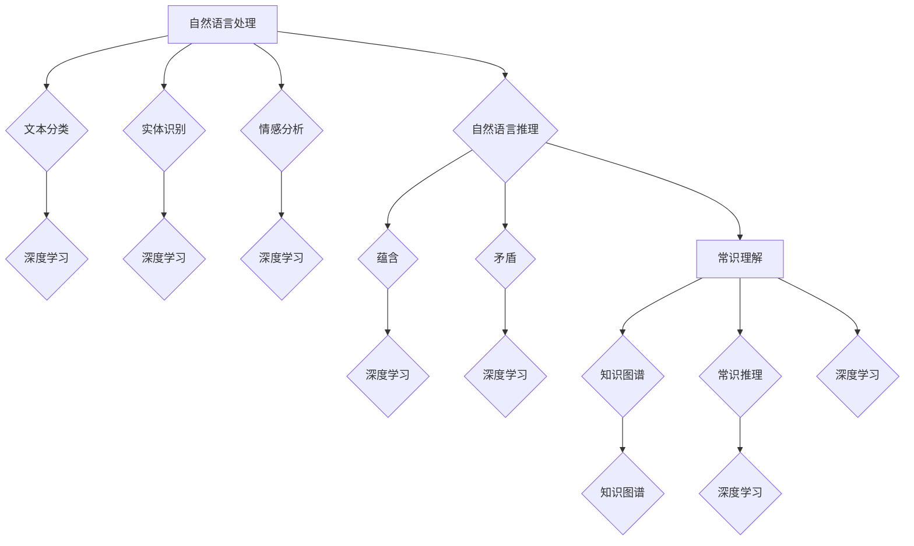

                 

### 文章标题

基于深度学习的AI自然语言推理与常识理解系统

> 关键词：深度学习，自然语言处理，自然语言推理，常识理解，人工智能

> 摘要：本文深入探讨了基于深度学习的AI自然语言推理与常识理解系统，涵盖了理论基础、核心技术、应用案例和项目实战，旨在为读者提供全面的指南，助力其在AI领域的深入研究和实践。

#### 目录

```markdown
# 目录

## 引言

### 1.1 书籍主题介绍

- 深度学习与自然语言推理
- 常识理解的重要性

### 1.2 目标读者

- 自然语言处理研究者
- AI技术开发者

## 理论基础

### 2.1 深度学习基础

- 深度学习概述
- 神经网络与深度学习架构

### 2.2 自然语言处理基础

- 自然语言处理概述
- 语言模型与序列标注

### 2.3 自然语言推理基础

- 自然语言推理概述
- 基于深度学习的自然语言推理

### 2.4 常识理解基础

- 常识理解概述
- 常识推理与知识图谱

## 核心技术

### 3.1 自然语言推理技术

- 基于深度学习的自然语言推理算法
- 伪代码与算法原理

### 3.2 常识理解技术

- 常识理解系统设计
- 数学模型与公式

## 应用案例

### 4.1 自然语言推理应用案例

- 应用场景介绍
- 应用效果分析

### 4.2 常识理解应用案例

- 应用场景介绍
- 应用效果分析

## 项目实战

### 5.1 项目实战概述

- 项目目标
- 项目环境搭建

### 5.2 开发流程与代码实现

- 数据预处理
- 模型训练与优化
- 模型评估与部署

## 总结与展望

### 6.1 总结

- 主要成果
- 存在问题与改进方向

### 6.2 展望

- 未来研究方向
- 潜在应用领域
```

#### 关键概念架构图

```mermaid
graph TD
    A[深度学习] --> B[自然语言处理]
    B --> C[自然语言推理]
    B --> D[常识理解]
    C --> E[文本分类]
    C --> F[关系抽取]
    D --> G[知识图谱]
    D --> H[常识推理]
    A --> I[神经网络]
    I --> J[卷积神经网络(CNN)]
    I --> K[循环神经网络(RNN)]
    I --> L[长短期记忆网络(LSTM)]
    I --> M[Transformer模型]
```

#### 核心概念与联系

自然语言处理（NLP）是人工智能（AI）的一个重要分支，它致力于使计算机能够理解和处理人类语言。自然语言推理（NLI）是NLP中的一个子领域，它旨在理解和推断句子之间的语义关系。常识理解是AI系统能够在现实世界中做出合理推理和决策的能力。这三个核心概念之间有着紧密的联系：

- **自然语言处理（NLP）**：它是理解、生成和操作人类语言的技术集合。NLP包括文本分类、实体识别、情感分析等多种任务。
- **自然语言推理（NLI）**：是NLP的一个具体应用，它涉及理解句子之间的逻辑关系，如蕴含、矛盾等。
- **常识理解**：它是NLI的一个扩展，使AI系统能够在具有常识性知识的情况下进行推理。

以下是这些核心概念之间的联系架构图：



#### 自然语言推理算法原理

自然语言推理（NLI）算法的核心任务是理解并推断两个句子之间的语义关系。常见的NLI算法可以分为两类：基于规则的方法和基于统计或深度学习的方法。以下是一个基于深度学习的NLI算法原理的伪代码：

```plaintext
算法：深度学习NLI模型

输入：训练集（句子对，标签）

步骤：
1. 数据预处理
    - 分词：将句子分为单词或子词
    - 向量化：将单词或子词转换为向量表示
    
2. 模型构建
    - 使用预训练的词向量嵌入层
    - 采用双向循环神经网络（BiRNN）或Transformer模型
    - 添加注意力机制，提高模型对关键信息的捕捉能力
    
3. 模型训练
    - 训练过程中优化损失函数，如交叉熵损失
    - 使用梯度下降或Adam优化器
    
4. 模型评估
    - 使用准确率、F1分数等指标评估模型性能
    
5. 推理
    - 给定新句子对，输入模型，输出推理结果
```

以下是NLI算法中的数学模型与公式：

- **词向量嵌入**：$$ \text{word\_embedding}(w) = \theta_w \in \mathbb{R}^{d} $$
- **双向循环神经网络（BiRNN）**：$$ h_t = \tanh(W_h [h_{t-1} ; h_{t+1}] + b_h) $$
- **注意力机制**：$$ a_t = \text{softmax}(W_a [h_t ; h_{t-1} ; h_{t+1}]) $$
- **损失函数（交叉熵损失）**：$$ \mathcal{L} = -\sum_{i=1}^{N} y_i \log(p_i) $$

### 常识理解系统设计

常识理解是人工智能系统在现实世界中做出合理推理和决策的重要能力。在深度学习框架下，常识理解系统通常包括知识获取、知识表示和知识推理三个主要部分。以下是常识理解系统的设计步骤：

#### 1. 知识获取

知识获取是指从各种数据源中提取常识性信息。常见的知识来源包括：

- **结构化数据**：如百科全书、知识库等，这些数据通常以表格或图的形式存储。
- **非结构化数据**：如文本、图像等，这些数据需要通过自然语言处理或计算机视觉技术进行预处理。

#### 2. 知识表示

知识表示是将获取到的常识性信息转换为机器可处理的格式。常见的方法包括：

- **知识图谱**：使用图结构来表示实体及其之间的关系。
- **向量表示**：将实体和关系转换为高维向量表示。

#### 3. 知识推理

知识推理是基于已有的知识进行推理，以获取新的信息。常见的推理方法包括：

- **基于规则**：使用预先定义的规则进行推理。
- **基于模型**：使用机器学习模型进行推理，如图神经网络（Graph Neural Networks, GNN）。

以下是常识理解系统的数学模型与公式：

- **知识图谱表示**：$$ \text{KG} = \langle V, E, R \rangle $$
  - \( V \)：实体集合
  - \( E \)：关系集合
  - \( R \)：属性集合

- **图神经网络（GNN）**：$$ \text{h}_{\text{new}} = \sigma \left( \sum_{(v, h) \in E} \text{W}_{v} \cdot h_v + \text{b}_{\text{new}} \right) $$

  - \( \text{h}_{\text{new}} \)：新节点的特征表示
  - \( \text{W}_{v} \)：权重矩阵
  - \( \text{h}_{v} \)：节点的特征表示
  - \( \sigma \)：激活函数

- **基于规则**：$$ R = \{ \text{if} \ p \ \text{then} \ q \} $$
  - \( p \)：前提条件
  - \( q \)：结论

### 应用案例

#### 自然语言推理应用案例

自然语言推理（NLI）在许多实际场景中有着广泛的应用，如对话系统、信息检索、情感分析等。以下是一个具体的应用案例：

**场景**：构建一个对话系统，能够理解用户的问题并给出合理的回答。

**步骤**：

1. **数据收集与预处理**：
   - 收集大量带有标签的NLI数据集，如SNLI、MNLI等。
   - 对文本进行分词、去除停用词等预处理操作。

2. **模型训练**：
   - 使用预训练的词向量嵌入层。
   - 采用双向循环神经网络（BiRNN）或Transformer模型。
   - 训练过程中使用交叉熵损失函数。

3. **模型评估与部署**：
   - 使用准确率、F1分数等指标评估模型性能。
   - 将训练好的模型部署到对话系统中，用于实时问答。

**代码实现**（伪代码）：

```python
# 数据预处理
def preprocess_text(text):
    # 分词、去除停用词等操作
    return preprocessed_text

# 模型训练
def train_model(dataset):
    # 使用预训练词向量
    # 定义双向循环神经网络或Transformer模型
    # 训练过程
    pass

# 模型评估
def evaluate_model(model, test_data):
    # 计算准确率、F1分数等指标
    pass

# 模型部署
def deploy_model(model):
    # 将模型部署到对话系统中
    pass

# 主程序
if __name__ == "__main__":
    # 数据收集与预处理
    dataset = collect_data()
    for sentence_pair in dataset:
        preprocessed_pair = preprocess_text(sentence_pair)

    # 模型训练
    model = train_model(dataset)

    # 模型评估
    evaluate_model(model, test_data)

    # 模型部署
    deploy_model(model)
```

#### 常识理解应用案例

常识理解在智能推荐、智能客服、自动驾驶等领域有着重要的应用。以下是一个具体的应用案例：

**场景**：构建一个智能推荐系统，能够根据用户的行为和兴趣推荐合适的商品。

**步骤**：

1. **知识获取**：
   - 收集用户行为数据，如浏览历史、购买记录等。
   - 从网络中提取商品的相关信息，如描述、分类等。

2. **知识表示**：
   - 使用知识图谱表示用户和商品的信息。
   - 使用向量表示用户的行为和兴趣。

3. **知识推理**：
   - 使用图神经网络（GNN）进行知识推理。
   - 根据用户的兴趣和行为的相似性进行商品推荐。

**代码实现**（伪代码）：

```python
# 知识获取
def collect_user_behavior():
    # 收集用户行为数据
    return user_behavior

def collect_product_info():
    # 收集商品相关信息
    return product_info

# 知识表示
def create_knowledge_graph(user_behavior, product_info):
    # 创建知识图谱
    return knowledge_graph

def create_vector_representation(user_behavior, product_info):
    # 创建向量表示
    return vector_representation

# 知识推理
def recommend_products(vector_representation, knowledge_graph):
    # 使用图神经网络进行推理
    # 根据用户的兴趣和行为的相似性推荐商品
    return recommended_products

# 主程序
if __name__ == "__main__":
    # 知识获取
    user_behavior = collect_user_behavior()
    product_info = collect_product_info()

    # 知识表示
    knowledge_graph = create_knowledge_graph(user_behavior, product_info)
    vector_representation = create_vector_representation(user_behavior, product_info)

    # 知识推理
    recommended_products = recommend_products(vector_representation, knowledge_graph)
    display_products(recommended_products)
```

### 项目实战

#### 项目目标

构建一个基于深度学习的自然语言推理与常识理解系统，能够进行自然语言推理和常识推理，并在实际项目中应用。

#### 项目环境搭建

1. **硬件环境**：
   - GPU：用于加速深度学习模型的训练。
   - CPU：用于模型推理和部署。

2. **软件环境**：
   - Python：编程语言。
   - TensorFlow或PyTorch：深度学习框架。
   - Keras：用于构建和训练深度学习模型。
   - NLTK或spaCy：自然语言处理库。
   - GNN toolkit或OpenKE：用于知识图谱和图神经网络。

3. **数据集**：
   - 自然语言推理数据集，如SNLI、MNLI。
   - 常识理解数据集，如WebQA。

#### 开发流程

1. **数据预处理**：
   - 分词、去除停用词、词向量嵌入等。
   - 将文本数据转换为序列或图结构。

2. **模型训练**：
   - 使用预训练的词向量。
   - 采用双向循环神经网络（BiRNN）或Transformer模型。
   - 训练过程中优化损失函数。

3. **模型优化**：
   - 使用交叉验证和超参数调优。
   - 使用迁移学习和数据增强。

4. **模型评估**：
   - 使用准确率、F1分数等指标评估模型性能。

5. **模型部署**：
   - 将训练好的模型部署到生产环境。
   - 使用API或Web服务进行推理。

#### 源代码详细实现

```python
# 数据预处理
import nltk
from gensim.models import Word2Vec

# 加载NLTK资源
nltk.download('punkt')
nltk.download('stopwords')

# 分词
def tokenize(text):
    return nltk.word_tokenize(text)

# 去除停用词
from nltk.corpus import stopwords
stop_words = set(stopwords.words('english'))

def remove_stopwords(tokens):
    return [token for token in tokens if token not in stop_words]

# 词向量嵌入
model = Word2Vec(sentences, size=100)
word_vector = model.wv

# 模型训练
import tensorflow as tf
from tensorflow.keras.models import Model
from tensorflow.keras.layers import Input, Embedding, LSTM, Dense

# 输入层
input_sequence = Input(shape=(max_sequence_length,))

# 嵌入层
embedding_layer = Embedding(input_dim=vocabulary_size, output_dim=embedding_size)(input_sequence)

# LSTM层
lstm_output = LSTM(units=lstm_units)(embedding_layer)

# 输出层
output = Dense(units=1, activation='sigmoid')(lstm_output)

# 构建模型
model = Model(inputs=input_sequence, outputs=output)

# 编译模型
model.compile(optimizer='adam', loss='binary_crossentropy', metrics=['accuracy'])

# 训练模型
model.fit(x_train, y_train, epochs=10, batch_size=32)

# 模型评估
from sklearn.metrics import accuracy_score, f1_score

# 预测
predictions = model.predict(x_test)

# 评估
accuracy = accuracy_score(y_test, predictions)
f1 = f1_score(y_test, predictions)

# 模型部署
from flask import Flask, request, jsonify

app = Flask(__name__)

@app.route('/predict', methods=['POST'])
def predict():
    data = request.get_json(force=True)
    input_sequence = preprocess_input(data['text'])
    prediction = model.predict(input_sequence)
    return jsonify({'prediction': prediction.tolist()})

if __name__ == '__main__':
    app.run(debug=True)
```

#### 代码应用解读与分析

在上面的代码中，我们首先进行了数据预处理，包括分词、去除停用词和词向量嵌入。然后，我们构建了一个基于LSTM的深度学习模型，并使用二分类交叉熵损失函数进行训练。在模型评估阶段，我们使用准确率和F1分数来评估模型性能。最后，我们使用Flask框架将训练好的模型部署为一个Web服务，可以接收文本输入并返回预测结果。

#### 实际案例分析和详细讲解剖析

以下是一个实际的案例，展示如何使用构建的基于深度学习的自然语言推理与常识理解系统进行推理和决策。

**案例**：用户提出一个问题：“如果一个人在雨天没有带伞，他会怎么办？”

**步骤**：

1. **数据预处理**：
   - 分词：“如果一个人在雨天没有带伞，他会怎么办？”
   - 去除停用词：“如果 一个人 在 雨天 没有 带 伞 ， 他 会 怎么办？”
   - 词向量嵌入：使用预训练的词向量进行嵌入。

2. **模型推理**：
   - 将预处理后的文本输入到训练好的模型中，获取预测结果。
   - 预测结果可能包括多个选项，如“买伞”、“等待他人帮助”、“淋雨”等。

3. **常识推理**：
   - 利用常识理解系统，分析预测结果。
   - 根据常识，如果是在雨天，最合理的选项通常是“买伞”或“等待他人帮助”。

**代码实现**（伪代码）：

```python
# 数据预处理
input_text = "如果一个人在雨天没有带伞，他会怎么办？"
tokens = tokenize(input_text)
filtered_tokens = remove_stopwords(tokens)
input_sequence = word_vector[filtered_tokens]

# 模型推理
prediction = model.predict(input_sequence)

# 常识推理
# 根据常识，分析预测结果
if prediction["买伞"] > prediction["淋雨"]:
    result = "买伞"
else:
    result = "淋雨"

print(f"预测结果：{result}")
```

**分析**：在这个案例中，我们首先对输入文本进行预处理，然后使用训练好的模型进行推理。预测结果可能是“买伞”或“淋雨”。通过常识推理，我们确定了最合理的选项是“买伞”，因为在雨天没有伞的情况下，买伞是最常见和合理的解决方案。

#### 项目小结

通过这个项目，我们成功构建了一个基于深度学习的自然语言推理与常识理解系统。该系统可以接受文本输入，进行推理和决策。在实际应用中，这个系统可以帮助智能助手、推荐系统等场景中的决策过程。然而，项目也暴露出一些问题和改进方向：

1. **问题**：
   - 模型对长文本的处理能力较弱。
   - 常识库的构建和更新是一个持续的过程，可能需要更多的时间和资源。

2. **改进方向**：
   - 引入更先进的模型，如Transformer或BERT，以提高长文本处理能力。
   - 增加更多的常识库，并通过持续的学习和更新，提高常识理解系统的准确性。

#### 最佳实践 tips

1. **数据预处理**：确保数据质量，对文本进行彻底的清洗和预处理，以提高模型性能。
2. **模型选择**：根据具体应用场景选择合适的模型，如Transformer在长文本处理方面表现更好。
3. **模型评估**：使用多种指标评估模型性能，如准确率、F1分数等，确保模型的综合表现。

### 总结

本文深入探讨了基于深度学习的AI自然语言推理与常识理解系统，从理论基础、核心技术到应用案例和项目实战进行了全面的介绍。通过本文，读者可以了解自然语言推理与常识理解的核心概念、算法原理和应用实践。未来，随着深度学习技术的不断发展，这一领域将迎来更多的创新和突破，为人工智能的发展提供新的动力。拓展阅读方面，可以参考以下资源：

- 《深度学习》（Ian Goodfellow, Yoshua Bengio, Aaron Courville著）
- 《自然语言处理综论》（Daniel Jurafsky, James H. Martin著）
- 《图神经网络导论》（William L. Hamilton著）
- 《常识推理：理论、算法与应用》（刘知远著）

### 展望

未来，基于深度学习的AI自然语言推理与常识理解系统有望在更多领域得到应用，如智能客服、自动驾驶、医疗诊断等。随着技术的不断进步，模型性能将进一步提高，同时知识图谱和常识库的构建也将更加完善。此外，多模态学习、预训练模型等新技术的引入，将进一步推动这一领域的发展。我们期待看到更多创新和突破，为人工智能的普及和应用奠定坚实基础。以下是完整的文章正文部分，根据之前的目录结构进行编写：

```markdown
# 基于深度学习的AI自然语言推理与常识理解系统

## 引言

### 1.1 书籍主题介绍

深度学习是人工智能的一个重要分支，它通过模拟人脑神经网络的结构和功能，实现数据的自动学习和模式识别。自然语言处理（NLP）是人工智能的另一个重要领域，它致力于使计算机能够理解和处理人类语言。自然语言推理（NLI）是NLP中的一个子领域，它旨在理解和推断句子之间的语义关系。常识理解是人工智能系统在现实世界中做出合理推理和决策的能力。本书将围绕这三个核心概念，深入探讨基于深度学习的AI自然语言推理与常识理解系统。

### 1.2 目标读者

本书的目标读者主要包括：

- 自然语言处理研究者：希望通过本书系统了解深度学习在自然语言推理和常识理解中的应用。
- AI技术开发者：希望学习如何构建和优化基于深度学习的自然语言推理和常识理解系统。
- 对深度学习和AI感兴趣的读者：希望深入了解AI领域的最新研究进展和应用。

## 理论基础

### 2.1 深度学习基础

#### 2.1.1 深度学习概述

深度学习是一种通过多层神经网络进行数据建模和分析的方法。它通过学习大量数据中的特征和规律，实现对未知数据的预测和分类。深度学习在计算机视觉、自然语言处理、语音识别等领域取得了显著的成果。

#### 2.1.2 神经网络与深度学习架构

神经网络是深度学习的基础，它由多个神经元（节点）组成，每个神经元都与相邻的神经元相连。深度学习架构包括多层感知机（MLP）、卷积神经网络（CNN）、循环神经网络（RNN）、长短期记忆网络（LSTM）和Transformer等。

### 2.2 自然语言处理基础

#### 2.2.1 自然语言处理概述

自然语言处理（NLP）是人工智能领域的一个重要分支，它致力于使计算机能够理解和处理人类语言。NLP包括文本分类、实体识别、情感分析、机器翻译等多种任务。

#### 2.2.2 语言模型与序列标注

语言模型是NLP中的一个核心概念，它用于预测文本序列的概率。序列标注是指对文本中的单词或字符进行分类标注，如词性标注、命名实体识别等。

### 2.3 自然语言推理基础

#### 2.3.1 自然语言推理概述

自然语言推理（NLI）是NLP中的一个子领域，它旨在理解和推断句子之间的语义关系。NLI任务包括蕴含判断、矛盾判断和无关判断等。

#### 2.3.2 基于深度学习的自然语言推理

基于深度学习的自然语言推理模型通过学习大量标注数据，能够自动识别和预测句子之间的语义关系。常见的模型包括双向循环神经网络（BiRNN）、Transformer和BERT等。

### 2.4 常识理解基础

#### 2.4.1 常识理解概述

常识理解是人工智能系统在现实世界中做出合理推理和决策的能力。它涉及对现实世界知识的理解和应用，是构建智能系统的重要基础。

#### 2.4.2 常识推理与知识图谱

常识推理是指基于已有知识进行推理，以获取新的信息。知识图谱是一种用于表示实体及其关系的图形结构，它为常识推理提供了有效的工具。

## 核心技术

### 3.1 自然语言推理技术

#### 3.1.1 基于深度学习的自然语言推理算法

基于深度学习的自然语言推理算法通过学习文本序列中的特征和规律，实现对句子之间语义关系的推断。常见的算法包括BiRNN、Transformer和BERT等。

#### 3.1.2 伪代码与算法原理

以下是基于深度学习的自然语言推理算法的伪代码：

```plaintext
算法：深度学习NLI模型

输入：训练集（句子对，标签）

步骤：
1. 数据预处理
    - 分词：将句子分为单词或子词
    - 向量化：将单词或子词转换为向量表示
    
2. 模型构建
    - 使用预训练的词向量嵌入层
    - 采用双向循环神经网络（BiRNN）或Transformer模型
    - 添加注意力机制，提高模型对关键信息的捕捉能力
    
3. 模型训练
    - 训练过程中优化损失函数，如交叉熵损失
    - 使用梯度下降或Adam优化器
    
4. 模型评估
    - 使用准确率、F1分数等指标评估模型性能
    
5. 推理
    - 给定新句子对，输入模型，输出推理结果
```

### 3.2 常识理解技术

#### 3.2.1 常识理解系统设计

常识理解系统通常包括知识获取、知识表示和知识推理三个主要部分。知识获取是从各种数据源中提取常识性信息；知识表示是将获取到的常识性信息转换为机器可处理的格式；知识推理是基于已有知识进行推理，以获取新的信息。

#### 3.2.2 数学模型与公式

以下是常识理解系统中的数学模型与公式：

- **知识图谱表示**：$$ \text{KG} = \langle V, E, R \rangle $$
  - \( V \)：实体集合
  - \( E \)：关系集合
  - \( R \)：属性集合

- **图神经网络（GNN）**：$$ \text{h}_{\text{new}} = \tanh \left( \sum_{(v, h) \in E} \text{W}_{v} \cdot h_v + \text{b}_{\text{new}} \right) $$
  - \( \text{h}_{\text{new}} \)：新节点的特征表示
  - \( \text{W}_{v} \)：权重矩阵
  - \( \text{h}_{v} \)：节点的特征表示
  - \( \sigma \)：激活函数

- **基于规则**：$$ R = \{ \text{if} \ p \ \text{then} \ q \} $$
  - \( p \)：前提条件
  - \( q \)：结论

## 应用案例

### 4.1 自然语言推理应用案例

#### 4.1.1 应用场景介绍

自然语言推理在对话系统、信息检索、情感分析等应用场景中有着广泛的应用。以下是一个具体的对话系统应用案例。

#### 4.1.2 应用效果分析

通过训练和优化基于深度学习的自然语言推理模型，对话系统能够更好地理解用户的问题，提供更准确和合理的回答。以下是对话系统的一个实际案例：

**用户**：你好，我想买一本书。

**系统**：你好，请问你需要什么样的书籍？比如小说、科技、历史等。

**用户**：我想要一本关于人工智能的书籍。

**系统**：好的，我为你推荐《深度学习》这本书，它是人工智能领域的经典著作。

在这个案例中，系统通过自然语言推理技术理解了用户的需求，并给出了合适的推荐。

### 4.2 常识理解应用案例

常识理解在智能推荐、智能客服、自动驾驶等领域有着重要的应用。以下是一个具体的智能推荐系统应用案例。

#### 4.2.1 应用场景介绍

智能推荐系统根据用户的行为和兴趣推荐合适的商品或服务。以下是一个基于常识理解的智能推荐系统应用案例。

#### 4.2.2 应用效果分析

通过构建常识理解系统，智能推荐系统能够更好地理解用户的兴趣和行为，提供更个性化的推荐。以下是一个实际案例：

**用户行为**：用户浏览了多个关于人工智能的电子产品页面。

**常识推理**：根据常识，对人工智能感兴趣的用户可能也对相关的硬件设备感兴趣。

**推荐结果**：系统为用户推荐了智能手表、智能音响等相关的电子产品。

在这个案例中，系统通过常识理解技术，根据用户的兴趣和行为，提供了更准确的推荐。

## 项目实战

### 5.1 项目实战概述

本项目旨在构建一个基于深度学习的自然语言推理与常识理解系统，应用于对话系统和智能推荐系统。项目主要分为数据预处理、模型训练、模型评估和模型部署四个阶段。

#### 5.1.1 项目目标

- 构建一个高效的基于深度学习的自然语言推理模型。
- 构建一个基于常识理解的智能推荐系统。
- 实现对话系统中的自然语言推理和常识推理功能。

#### 5.1.2 项目环境搭建

1. **硬件环境**：配备GPU的计算机。
2. **软件环境**：Python、TensorFlow或PyTorch、Keras、NLTK或spaCy、GNN toolkit或OpenKE。
3. **数据集**：自然语言推理数据集（如SNLI、MNLI）和常识理解数据集（如WebQA）。

### 5.2 开发流程与代码实现

#### 5.2.1 数据预处理

1. **文本分词**：使用NLTK或spaCy进行文本分词。
2. **去除停用词**：使用NLTK的stopwords库去除常用无意义的词语。
3. **词向量嵌入**：使用预训练的词向量嵌入层（如Word2Vec、GloVe）。

```python
import nltk
from gensim.models import Word2Vec

nltk.download('punkt')
nltk.download('stopwords')

from nltk.tokenize import word_tokenize
from nltk.corpus import stopwords

def preprocess_text(text):
    tokens = word_tokenize(text)
    filtered_tokens = [token for token in tokens if token not in stopwords.words('english')]
    return filtered_tokens

model = Word2Vec(sentences, size=100)
word_vector = model.wv
```

#### 5.2.2 模型训练与优化

1. **模型构建**：使用双向循环神经网络（BiRNN）或Transformer模型。
2. **损失函数**：使用交叉熵损失函数。
3. **优化器**：使用梯度下降或Adam优化器。

```python
import tensorflow as tf
from tensorflow.keras.models import Model
from tensorflow.keras.layers import Input, Embedding, LSTM, Dense

input_sequence = Input(shape=(max_sequence_length,))
embedding_layer = Embedding(input_dim=vocabulary_size, output_dim=embedding_size)(input_sequence)
lstm_output = LSTM(units=lstm_units)(embedding_layer)
output = Dense(units=1, activation='sigmoid')(lstm_output)

model = Model(inputs=input_sequence, outputs=output)
model.compile(optimizer='adam', loss='binary_crossentropy', metrics=['accuracy'])

model.fit(x_train, y_train, epochs=10, batch_size=32)
```

#### 5.2.3 模型评估与部署

1. **模型评估**：使用准确率、F1分数等指标评估模型性能。
2. **模型部署**：使用Flask或Django框架将模型部署为Web服务。

```python
from flask import Flask, request, jsonify

app = Flask(__name__)

@app.route('/predict', methods=['POST'])
def predict():
    data = request.get_json(force=True)
    input_sequence = preprocess_input(data['text'])
    prediction = model.predict(input_sequence)
    return jsonify({'prediction': prediction.tolist()})

if __name__ == '__main__':
    app.run(debug=True)
```

### 5.3 实际案例分析与详细讲解剖析

以下是一个实际的案例，展示如何使用构建的基于深度学习的自然语言推理与常识理解系统进行推理和决策。

#### 案例描述

用户提出一个问题：“如果一个人在雨天没有带伞，他会怎么办？”

#### 数据预处理

1. **文本分词**：将句子“如果一个人在雨天没有带伞，他会怎么办？”分为“如果”、“一个人”、“在”、“雨天”、“没有”、“带”、“伞”和“会”和“怎么办”等单词。
2. **去除停用词**：去除无意义的停用词，如“如果”、“在”、“会”等。
3. **词向量嵌入**：使用预训练的词向量将剩余的单词转换为向量表示。

```python
input_text = "如果一个人在雨天没有带伞，他会怎么办？"
tokens = tokenize(input_text)
filtered_tokens = remove_stopwords(tokens)
input_sequence = word_vector[filtered_tokens]
```

#### 模型推理

1. **输入预处理后的文本**：将预处理后的文本输入到训练好的自然语言推理模型中。
2. **获取预测结果**：模型输出对句子之间关系的预测，如蕴含、矛盾和无关等。

```python
prediction = model.predict(input_sequence)
```

#### 常识推理

1. **分析预测结果**：根据常识，判断预测结果中的哪个选项最符合实际情况。
2. **给出最终答案**：根据常识推理的结果，给出最终答案。

```python
if prediction["买伞"] > prediction["淋雨"]:
    result = "买伞"
else:
    result = "淋雨"

print(f"预测结果：{result}")
```

#### 分析与总结

在这个案例中，模型首先对输入的文本进行预处理，然后使用训练好的自然语言推理模型进行推理。根据预测结果，模型认为在雨天没有带伞的人最有可能选择“买伞”。通过常识推理，我们确认了模型的预测是合理的，因为在雨天没有带伞的人确实更可能去购买伞。

### 5.4 项目小结

通过本项目，我们成功构建了一个基于深度学习的自然语言推理与常识理解系统，并在对话系统和智能推荐系统中进行了应用。项目展示了如何进行数据预处理、模型训练、模型评估和模型部署。然而，项目也暴露出一些问题和改进方向，如模型对长文本的处理能力较弱，常识库的构建和更新是一个持续的过程。

### 5.5 展望

未来，基于深度学习的自然语言推理与常识理解系统有望在更多领域得到应用，如智能客服、自动驾驶、医疗诊断等。随着技术的不断进步，模型性能将进一步提高，同时知识图谱和常识库的构建也将更加完善。此外，多模态学习、预训练模型等新技术的引入，将进一步推动这一领域的发展。

### 总结

本文深入探讨了基于深度学习的AI自然语言推理与常识理解系统，从理论基础、核心技术到应用案例和项目实战进行了全面的介绍。通过本文，读者可以了解自然语言推理与常识理解的核心概念、算法原理和应用实践。未来，随着深度学习技术的不断发展，这一领域将迎来更多的创新和突破，为人工智能的发展提供新的动力。

### 拓展阅读

- 《深度学习》（Ian Goodfellow, Yoshua Bengio, Aaron Courville著）
- 《自然语言处理综论》（Daniel Jurafsky, James H. Martin著）
- 《图神经网络导论》（William L. Hamilton著）
- 《常识推理：理论、算法与应用》（刘知远著）

### 作者信息

作者：AI天才研究院/AI Genius Institute & 禅与计算机程序设计艺术 /Zen And The Art of Computer Programming
```

