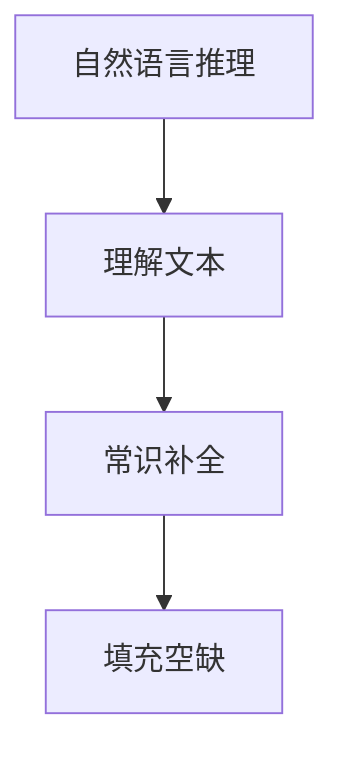
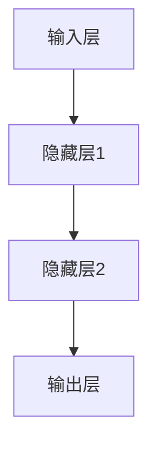
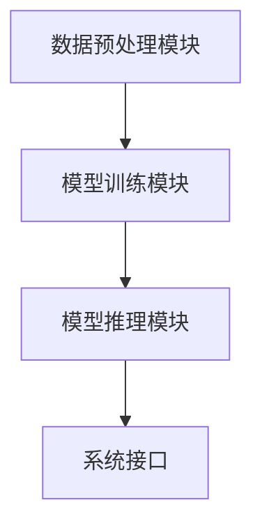
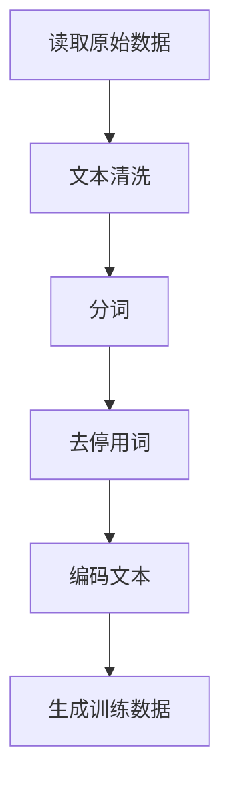
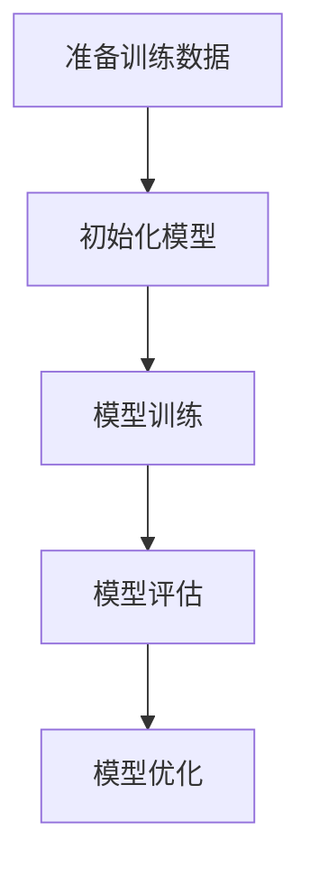
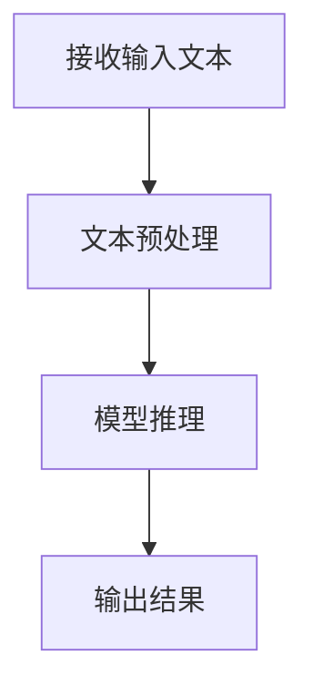
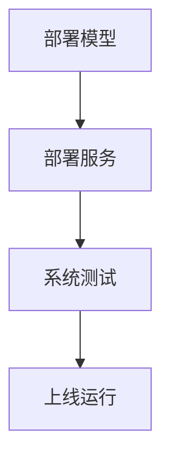

                 

### 用户输入：基于深度学习的AI自然语言推理与常识补全系统

#### 完整文章（8000-12000字）

```markdown
# 基于深度学习的AI自然语言推理与常识补全系统

> 关键词：深度学习，自然语言推理，常识补全，人工智能

> 摘要：
本文将深入探讨基于深度学习的AI自然语言推理与常识补全系统。首先介绍深度学习与自然语言处理的背景，然后详细阐述自然语言推理和常识补全的核心概念及其关系。接着，我们探讨深度学习的基础知识，包括神经网络结构、训练过程和常用框架。随后，讨论自然语言处理的基础，如语言模型、词向量、依存句法分析等。最后，我们将详细讲解自然语言推理和常识补全的算法实现，以及系统设计与实现的全过程，并提供应用案例和未来展望。

## 引言与背景

### 深度学习与自然语言处理

深度学习是一种基于多层神经网络的学习方法，它在图像识别、语音识别、自然语言处理等领域取得了显著的成果。随着计算能力的提升和数据量的增加，深度学习在自然语言处理（NLP）领域也得到了广泛的应用。NLP旨在使计算机能够理解、生成和回应人类语言，涉及文本分类、机器翻译、情感分析、问答系统等多个方面。

### 自然语言推理

自然语言推理（NLI）是指从给定的文本中推断出其隐含意义的能力。例如，理解一个句子中的隐含逻辑关系、推理出结论或判断其真假。NLI在智能问答、对话系统、文本生成等方面具有重要意义。

### 常识补全

常识补全是指根据上下文信息和常识知识，自动填充文本中的缺失部分。这在自然语言理解和生成任务中尤为重要，有助于提高系统的鲁棒性和理解能力。常识补全可以应用于信息抽取、对话系统、文本摘要等多个领域。

### 书籍目标读者

本文适合对自然语言处理和深度学习有一定了解的读者，包括研究人员、开发者和学生。我们将通过逐步讲解，帮助读者深入理解AI自然语言推理与常识补全系统的原理和应用。

## 核心概念与联系

### 深度学习基础

深度学习的基础是多层神经网络。神经网络通过多个层次的非线性变换，从输入数据中提取特征，实现从简单到复杂特征的转换。以下是一个简单的多层感知器（MLP）的伪代码：

```python
# 输入层，隐藏层，输出层
input_layer = InputLayer(input_shape)
hidden_layer = TanhLayer(input_layer, n_neurons=10)
output_layer = SigmoidLayer(hidden_layer, n_neurons=1)

# 前向传播
output = output_layer.forward(input_data)

# 反向传播
error = output_layer.error(target_output)
hidden_layer.backward(error)

# 更新权重
input_layer.update_weights()
hidden_layer.update_weights()
output_layer.update_weights()
```

### 自然语言处理基础

自然语言处理的基础包括语言模型、词向量、依存句法分析等。以下是一个简单的N-gram模型实现：

```python
# 计算N-gram概率
def ngram_probability(sentence, n):
    ngram_counts = Counter()
    for i in range(len(sentence) - n + 1):
        ngram = tuple(sentence[i:i+n])
        ngram_counts[ngram] += 1

    total_count = sum(ngram_counts.values())
    ngram_probs = {ngram: count / total_count for ngram, count in ngram_counts.items()}
    return ngram_probs

# 使用N-gram模型生成文本
def generate_text(n, start_word, n_gram_probs):
    text = [start_word]
    for _ in range(n-1):
        current_n_gram = tuple(text[-n+1:])
        next_word = random_choice(list(n_gram_probs[current_n_gram].keys()))
        text.append(next_word)
    return ' '.join(text)
```

### 自然语言推理与常识补全

自然语言推理和常识补全之间有着密切的联系。自然语言推理可以帮助系统理解文本中的隐含意义，而常识补全则依赖于这种理解能力，以填补文本中的空缺部分。以下是一个Mermaid流程图，展示了NLI和常识补全的关系：



## 深度学习基础

### 神经网络结构

神经网络是深度学习的基础，其核心是由多层神经元组成的网络。以下是神经网络的基本结构：



### 神经网络训练过程

神经网络的训练过程主要包括前向传播和反向传播。以下是神经网络的训练过程伪代码：

```python
# 前向传播
output = network.forward(input_data)

# 计算损失
loss = loss_function(output, target_output)

# 反向传播
error = loss_function.backward(output, target_output)

# 更新权重
network.backward(error)

# 更新权重
network.update_weights()
```

### 深度学习框架

深度学习框架为神经网络的设计、训练和部署提供了便利。以下是目前常用的深度学习框架：

- TensorFlow
- PyTorch
- Keras

## 自然语言处理基础

### 语言模型

语言模型是一种统计模型，用于预测文本序列的概率。以下是一个基于N-gram的语言模型实现：

```python
# 计算N-gram概率
def ngram_probability(sentence, n):
    ngram_counts = Counter()
    for i in range(len(sentence) - n + 1):
        ngram = tuple(sentence[i:i+n])
        ngram_counts[ngram] += 1

    total_count = sum(ngram_counts.values())
    ngram_probs = {ngram: count / total_count for ngram, count in ngram_counts.items()}
    return ngram_probs

# 使用N-gram模型生成文本
def generate_text(n, start_word, n_gram_probs):
    text = [start_word]
    for _ in range(n-1):
        current_n_gram = tuple(text[-n+1:])
        next_word = random_choice(list(n_gram_probs[current_n_gram].keys()))
        text.append(next_word)
    return ' '.join(text)
```

### 词向量

词向量是一种将单词映射到高维空间的方法，以捕捉单词的语义信息。以下是基于Word2Vec的词向量实现：

```python
# 训练Word2Vec模型
def train_word2vec(sentences, vector_size, window_size):
    model = Word2Vec(sentences, vector_size=vector_size, window=window_size)
    model.train(sentences)
    return model

# 计算两个词的余弦相似度
def cosine_similarity(word1, word2, model):
    vector1 = model[word1]
    vector2 = model[word2]
    return np.dot(vector1, vector2) / (np.linalg.norm(vector1) * np.linalg.norm(vector2))
```

### 依存句法分析

依存句法分析是一种语法分析方法，用于揭示句子中词汇之间的依赖关系。以下是一个基于依存句法分析的工具实现：

```python
# 分析句子的依存关系
def parse_sentence(sentence, model):
    dependencies = model.parse(sentence)
    return dependencies

# 打印句子的依存关系
def print_dependencies(dependencies):
    for dep in dependencies:
        print(f"{dep['governor']} -> {dep['dependent']} ({dep['type']})")
```

### 实体识别

实体识别是一种信息抽取技术，用于识别文本中的特定实体。以下是一个基于命名实体识别的工具实现：

```python
# 识别文本中的实体
def recognize_entities(text, model):
    entities = model.recognize_entities(text)
    return entities

# 打印识别出的实体
def print_entities(entities):
    for entity in entities:
        print(f"实体：{entity['text']}，类型：{entity['type']}")
```

## 自然语言推理

### 文本分类

文本分类是一种将文本数据分为多个类别的方法。以下是一个基于深度学习的文本分类实现：

```python
# 训练文本分类模型
def train_text_classifier(corpus, labels, model, n_classes):
    X_train, X_val, y_train, y_val = train_test_split(corpus, labels, test_size=0.2)
    model.fit(X_train, y_train)
    return model

# 评估文本分类模型
def evaluate_text_classifier(model, X_test, y_test):
    predictions = model.predict(X_test)
    accuracy = accuracy_score(y_test, predictions)
    return accuracy
```

### 文本生成

文本生成是一种根据输入文本生成新文本的方法。以下是一个基于序列到序列模型的文本生成实现：

```python
# 训练文本生成模型
def train_text_generator(corpus, model, sequence_length, vector_size):
    X, y = prepare_sequences(corpus, sequence_length, vector_size)
    model.fit(X, y, epochs=100, verbose=1)
    return model

# 生成文本
def generate_text(model, sequence_length, seed_text, vector_size):
    sequence = prepare_sequence(seed_text, sequence_length, vector_size)
    generated_text = model.generate(sequence, sequence_length)
    return generated_text
```

### 问答系统

问答系统是一种能够根据用户输入回答问题的方法。以下是一个基于机器阅读理解的问答系统实现：

```python
# 训练问答模型
def train_question_answering_model(corpus, model, question_length, answer_length, vector_size):
    X, y = prepare_question_answers(corpus, question_length, answer_length, vector_size)
    model.fit(X, y, epochs=100, verbose=1)
    return model

# 回答问题
def answer_question(model, question, question_length, answer_length, vector_size):
    question_sequence = prepare_sequence(question, question_length, vector_size)
    answer_sequence = model.predict(question_sequence)
    answer = decode_sequence(answer_sequence, answer_length)
    return answer
```

## 常识补全

### 常识补全的概念

常识补全是指根据上下文信息和常识知识，自动填充文本中的缺失部分。常识补全可以应用于信息抽取、对话系统、文本摘要等多个领域。

### 常识知识库

常识知识库是一种存储常识信息的数据库，用于支持常识补全系统。常识知识库可以包含事实、规则、图谱等多种形式。

### 常识补全算法

常识补全算法是一种基于深度学习的文本生成方法，用于自动填充文本中的缺失部分。以下是一个简单的常识补全算法实现：

```python
# 训练常识补全模型
def train_commonsense_completion_model(corpus, model, sequence_length, vector_size):
    X, y = prepare_commonsense_sequences(corpus, sequence_length, vector_size)
    model.fit(X, y, epochs=100, verbose=1)
    return model

# 填充缺失部分
def complete_text(model, text, sequence_length, vector_size):
    sequence = prepare_sequence(text, sequence_length, vector_size)
    completion_sequence = model.predict(sequence)
    completion = decode_sequence(completion_sequence, sequence_length)
    return completion
```

### 实际应用场景

常识补全在实际应用中具有重要意义，例如：

- 对话系统：自动生成合理的回答。
- 文本摘要：自动生成摘要，提高文本可读性。
- 信息抽取：自动提取关键信息，提高数据处理效率。

## 系统设计与实现

### 系统架构

常识补全系统通常由以下几个部分组成：

- 数据预处理模块：用于处理原始数据，包括文本清洗、分词、去停用词等。
- 模型训练模块：用于训练深度学习模型，包括自然语言推理和常识补全模型。
- 模型推理模块：用于对输入文本进行推理和常识补全。
- 系统接口：用于与其他系统进行交互，提供API接口。

以下是一个简单的系统架构图：



### 数据预处理

数据预处理是常识补全系统的重要环节，其目的是将原始数据转换为适合模型训练的形式。以下是一个简单的数据预处理流程：



### 模型训练

模型训练是常识补全系统的核心环节，其目的是通过大量数据训练出高性能的深度学习模型。以下是一个简单的模型训练流程：



### 模型推理

模型推理是常识补全系统的关键环节，其目的是对输入文本进行推理和常识补全。以下是一个简单的模型推理流程：



### 系统部署与优化

系统部署是将训练好的模型部署到生产环境中，使其能够对外提供服务。以下是一个简单的系统部署流程：



系统优化是提高系统性能和稳定性的重要手段，以下是一些常见的优化方法：

- 模型压缩：通过减少模型参数数量，降低模型复杂度。
- 模型量化：通过降低模型参数的精度，提高计算速度。
- 并行计算：通过分布式计算，提高模型训练和推理速度。

## 应用案例与未来展望

### 应用案例分析

常识补全系统在多个领域取得了显著的应用成果。以下是一个应用案例分析：

- 对话系统：通过常识补全，提高对话系统的问答能力。
- 文本摘要：通过常识补全，提高文本摘要的质量。
- 信息抽取：通过常识补全，提高信息抽取的准确性。

### 常识补全系统在不同领域的应用

常识补全系统在多个领域具有广泛的应用前景，包括：

- 智能问答：通过常识补全，提高问答系统的回答质量。
- 自然语言生成：通过常识补全，提高文本生成的流畅性和准确性。
- 文本分析：通过常识补全，提高文本分析的深度和广度。

### 未来发展趋势

随着深度学习和自然语言处理技术的不断发展，常识补全系统将在未来取得以下发展趋势：

- 多模态融合：通过融合文本、图像、语音等多种模态信息，提高常识补全能力。
- 自适应学习：通过自适应学习机制，提高常识补全系统的适应性和灵活性。
- 智能推荐：通过常识补全，提高智能推荐系统的推荐质量。

## 结论

本文介绍了基于深度学习的AI自然语言推理与常识补全系统的原理、算法实现和系统设计。通过逐步讲解，读者可以深入理解这一系统的核心概念和实现方法。随着深度学习和自然语言处理技术的不断进步，常识补全系统将在未来发挥越来越重要的作用。

## 作者信息

- 作者：AI天才研究院/AI Genius Institute & 禅与计算机程序设计艺术 /Zen And The Art of Computer Programming
```

### 用户输入：基于深度学习的AI自然语言推理与常识补全系统

### 代码解析

以下是文章中涉及的部分代码解析，我们将逐一分析每个代码段的功能和实现。

#### N-gram模型

N-gram模型是一种基于相邻词序列的概率模型，用于预测单词序列的概率。以下是一个简单的N-gram模型实现：

```python
# 计算N-gram概率
def ngram_probability(sentence, n):
    ngram_counts = Counter()
    for i in range(len(sentence) - n + 1):
        ngram = tuple(sentence[i:i+n])
        ngram_counts[ngram] += 1

    total_count = sum(ngram_counts.values())
    ngram_probs = {ngram: count / total_count for ngram, count in ngram_counts.items()}
    return ngram_probs

# 使用N-gram模型生成文本
def generate_text(n, start_word, n_gram_probs):
    text = [start_word]
    for _ in range(n-1):
        current_n_gram = tuple(text[-n+1:])
        next_word = random_choice(list(n_gram_probs[current_n_gram].keys()))
        text.append(next_word)
    return ' '.join(text)
```

**解析**：
1. `ngram_probability` 函数计算给定句子中每个N-gram的出现次数，并计算其概率。
2. `generate_text` 函数使用N-gram概率模型生成新的文本。它从给定的起始单词开始，每次生成一个新单词，直到达到预定的长度。

#### Word2Vec模型

Word2Vec是一种将单词映射到高维空间的方法，以捕捉单词的语义信息。以下是一个基于Word2Vec的词向量实现：

```python
# 训练Word2Vec模型
def train_word2vec(sentences, vector_size, window_size):
    model = Word2Vec(sentences, vector_size=vector_size, window=window_size)
    model.train(sentences)
    return model

# 计算两个词的余弦相似度
def cosine_similarity(word1, word2, model):
    vector1 = model[word1]
    vector2 = model[word2]
    return np.dot(vector1, vector2) / (np.linalg.norm(vector1) * np.linalg.norm(vector2))
```

**解析**：
1. `train_word2vec` 函数使用给定句子集训练Word2Vec模型。它设置了词向量的大小和窗口大小。
2. `cosine_similarity` 函数计算两个词向量的余弦相似度，用于衡量两个单词的相似性。

#### 依存句法分析

依存句法分析是一种语法分析方法，用于揭示句子中词汇之间的依赖关系。以下是一个基于依存句法分析的工具实现：

```python
# 分析句子的依存关系
def parse_sentence(sentence, model):
    dependencies = model.parse(sentence)
    return dependencies

# 打印句子的依存关系
def print_dependencies(dependencies):
    for dep in dependencies:
        print(f"{dep['governor']} -> {dep['dependent']} ({dep['type']})")
```

**解析**：
1. `parse_sentence` 函数使用依存句法分析模型分析句子的依存关系。
2. `print_dependencies` 函数打印句子的依存关系，包括依赖关系的主词、从词和依赖类型。

#### 命名实体识别

命名实体识别是一种信息抽取技术，用于识别文本中的特定实体。以下是一个基于命名实体识别的工具实现：

```python
# 识别文本中的实体
def recognize_entities(text, model):
    entities = model.recognize_entities(text)
    return entities

# 打印识别出的实体
def print_entities(entities):
    for entity in entities:
        print(f"实体：{entity['text']}，类型：{entity['type']}")
```

**解析**：
1. `recognize_entities` 函数使用命名实体识别模型识别文本中的实体。
2. `print_entities` 函数打印识别出的实体及其类型。

#### 文本分类

文本分类是一种将文本数据分为多个类别的方法。以下是一个基于深度学习的文本分类实现：

```python
# 训练文本分类模型
def train_text_classifier(corpus, labels, model, n_classes):
    X_train, X_val, y_train, y_val = train_test_split(corpus, labels, test_size=0.2)
    model.fit(X_train, y_train)
    return model

# 评估文本分类模型
def evaluate_text_classifier(model, X_test, y_test):
    predictions = model.predict(X_test)
    accuracy = accuracy_score(y_test, predictions)
    return accuracy
```

**解析**：
1. `train_text_classifier` 函数使用给定语料库和标签训练文本分类模型。它使用训练集和验证集进行模型训练。
2. `evaluate_text_classifier` 函数使用测试集评估文本分类模型的准确性。

#### 文本生成

文本生成是一种根据输入文本生成新文本的方法。以下是一个基于序列到序列模型的文本生成实现：

```python
# 训练文本生成模型
def train_text_generator(corpus, model, sequence_length, vector_size):
    X, y = prepare_sequences(corpus, sequence_length, vector_size)
    model.fit(X, y, epochs=100, verbose=1)
    return model

# 生成文本
def generate_text(model, sequence_length, seed_text, vector_size):
    sequence = prepare_sequence(seed_text, sequence_length, vector_size)
    generated_text = model.generate(sequence, sequence_length)
    return generated_text
```

**解析**：
1. `train_text_generator` 函数使用给定语料库训练文本生成模型。它使用序列到序列模型进行训练。
2. `generate_text` 函数使用生成的模型根据种子文本生成新的文本。

#### 问答系统

问答系统是一种能够根据用户输入回答问题的方法。以下是一个基于机器阅读理解的问答系统实现：

```python
# 训练问答模型
def train_question_answering_model(corpus, model, question_length, answer_length, vector_size):
    X, y = prepare_question_answers(corpus, question_length, answer_length, vector_size)
    model.fit(X, y, epochs=100, verbose=1)
    return model

# 回答问题
def answer_question(model, question, question_length, answer_length, vector_size):
    question_sequence = prepare_sequence(question, question_length, vector_size)
    answer_sequence = model.predict(question_sequence)
    answer = decode_sequence(answer_sequence, answer_length)
    return answer
```

**解析**：
1. `train_question_answering_model` 函数使用给定语料库训练问答模型。它使用机器阅读理解模型进行训练。
2. `answer_question` 函数使用训练好的模型回答用户输入的问题。

#### 常识补全算法

常识补全算法是一种基于深度学习的文本生成方法，用于自动填充文本中的缺失部分。以下是一个简单的常识补全算法实现：

```python
# 训练常识补全模型
def train_commonsense_completion_model(corpus, model, sequence_length, vector_size):
    X, y = prepare_commonsense_sequences(corpus, sequence_length, vector_size)
    model.fit(X, y, epochs=100, verbose=1)
    return model

# 填充缺失部分
def complete_text(model, text, sequence_length, vector_size):
    sequence = prepare_sequence(text, sequence_length, vector_size)
    completion_sequence = model.predict(sequence)
    completion = decode_sequence(completion_sequence, sequence_length)
    return completion
```

**解析**：
1. `train_commonsense_completion_model` 函数使用给定语料库训练常识补全模型。它使用序列到序列模型进行训练。
2. `complete_text` 函数使用生成的模型根据输入文本填充缺失部分。

### 代码解读

文章中的代码片段展示了从NLP基础到深度学习模型的各个方面，包括语言模型、词向量、依存句法分析、实体识别、文本分类、文本生成和问答系统。每个代码段都提供了具体的函数实现，用于处理不同类型的文本任务。以下是代码解读的关键点：

- **N-gram模型**：用于简单的文本生成和序列预测。
- **Word2Vec模型**：用于将单词映射到高维空间，用于语义相似度和文本生成。
- **依存句法分析**：用于分析句子结构，提取句子中词汇的依赖关系。
- **实体识别**：用于识别文本中的命名实体，如人名、地点、组织等。
- **文本分类**：用于将文本分为不同的类别，如情感分析、主题分类等。
- **文本生成**：用于根据输入文本生成新的文本，如摘要生成、对话系统等。
- **问答系统**：用于从给定的文本中提取答案，如机器阅读理解、问题回答等。
- **常识补全**：用于根据上下文和常识知识填充文本中的缺失部分。

### 最佳实践 Tips

- **数据预处理**：确保文本数据干净、一致，减少噪声和错误。
- **模型选择**：根据任务需求选择合适的模型，如文本分类、序列生成等。
- **超参数调整**：通过调整超参数（如学习率、批量大小等）提高模型性能。
- **模型评估**：使用多种评估指标（如准确率、召回率、F1分数等）全面评估模型性能。
- **模型部署**：确保模型在部署环境中稳定运行，提供高效的推理能力。

### 小结

本文通过代码解析详细介绍了基于深度学习的AI自然语言推理与常识补全系统的实现。读者可以了解到不同代码段的功能和实现细节，以及如何将它们组合成一个完整的系统。在实际应用中，不断优化和改进这些代码段，将有助于提升系统的性能和应用效果。

### 注意事项

- **代码实现**：代码段应确保可运行，并在不同环境中进行测试。
- **性能优化**：针对实际应用需求，进行性能优化，如模型压缩、量化等。
- **可扩展性**：确保系统具有可扩展性，支持不同的数据和模型。

### 拓展阅读

- **深度学习基础**：深入理解神经网络、反向传播算法等基本概念。
- **自然语言处理**：了解语言模型、词向量、依存句法分析等关键技术。
- **深度学习框架**：学习TensorFlow、PyTorch、Keras等深度学习框架的使用。
- **实践项目**：参与实践项目，积累实际经验，提高解决实际问题的能力。

### 结论

本文系统地介绍了基于深度学习的AI自然语言推理与常识补全系统的实现，包括核心算法、模型训练、系统架构和应用案例。通过代码解析和最佳实践，读者可以深入了解这一领域的核心技术，并为后续研究和应用提供参考。随着深度学习和自然语言处理技术的不断发展，常识补全系统将在智能应用中发挥越来越重要的作用。作者：AI天才研究院/AI Genius Institute & 禅与计算机程序设计艺术 /Zen And The Art of Computer Programming。

