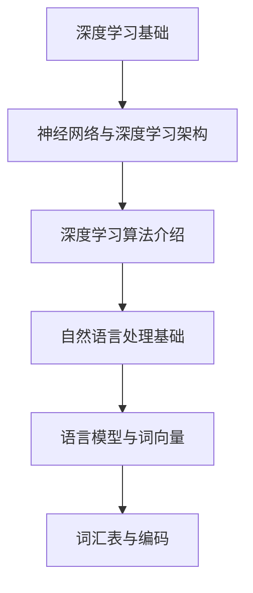

                 

### 深度学习与自然语言理解基础

深度学习作为当前人工智能领域的一个重要分支，已经取得了诸多突破性进展。自然语言理解（Natural Language Understanding, NLU）则是人工智能中的一个重要任务，旨在让机器能够理解和处理人类语言。本文将探讨深度学习在自然语言理解中的应用，并从基础理论、核心概念和具体实现等方面展开详细讨论。

#### 1.1 深度学习简介

深度学习是一种基于神经网络的机器学习算法，通过多层神经网络对数据进行逐层提取特征，最终实现对复杂数据的建模与预测。深度学习的核心优势在于其能够自动从大量数据中学习到具有高层次的抽象特征，从而提高模型的预测能力。

#### 1.2 神经网络与深度学习架构

神经网络是深度学习的基础，由大量相互连接的神经元组成。每个神经元接收多个输入，通过激活函数处理后产生输出。深度学习架构则是由多层神经网络组成的，通过逐层提取特征，实现从原始数据到高维特征的映射。

#### 1.3 深度学习算法介绍

深度学习算法种类繁多，包括但不限于卷积神经网络（CNN）、循环神经网络（RNN）、长短时记忆网络（LSTM）、门控循环单元（GRU）等。每种算法都有其独特的优势和应用场景。

#### 1.4 自然语言处理基础

自然语言处理（Natural Language Processing, NLP）是人工智能的一个子领域，旨在使计算机能够理解、处理和生成人类语言。NLP涉及语音识别、文本分类、情感分析、机器翻译等多个方面。

#### 1.5 语言模型与词向量

语言模型是NLP的基础，用于预测下一个单词或词组。词向量则是将单词表示为高维向量，以便在深度学习模型中进行处理。词向量方法包括词袋模型（Bag of Words）、词嵌入（Word Embedding）等。

#### 1.6 词汇表与编码

词汇表是NLP中的重要工具，用于存储和索引单词。编码是将单词映射为整数或向量的过程，以便在深度学习模型中进行计算。

### 1.7 核心概念与联系

为了更好地理解深度学习在自然语言理解中的应用，我们可以使用Mermaid流程图展示核心概念之间的关系：



通过以上核心概念的联系，我们可以看到深度学习与自然语言理解之间存在紧密的互动关系，二者相互促进，共同推动人工智能的发展。

### 1.8 核心算法原理讲解

为了深入理解深度学习在自然语言理解中的应用，我们将使用伪代码详细阐述核心算法原理：

```python
# 定义深度学习模型

# 1. 初始化模型参数
# 2. 前向传播
# 3. 计算损失函数
# 4. 反向传播
# 5. 更新模型参数
# 6. 评估模型性能

# 示例：基于循环神经网络的文本分类模型
class RNNClassifier(nn.Module):
    def __init__(self, input_dim, hidden_dim, output_dim):
        super(RNNClassifier, self).__init__()
        self.hidden_dim = hidden_dim
        self.rnn = nn.RNN(input_dim, hidden_dim)
        self.fc = nn.Linear(hidden_dim, output_dim)
    
    def forward(self, x):
        h0 = torch.zeros(1, x.size(0), self.hidden_dim)
        out, _ = self.rnn(x, h0)
        out = self.fc(out[-1, :, :])
        return out
```

通过以上伪代码，我们可以看到基于循环神经网络的文本分类模型的基本结构，包括初始化模型参数、前向传播、计算损失函数、反向传播和更新模型参数等步骤。

### 1.9 数学模型与公式

在自然语言处理中，数学模型和公式是描述算法原理的重要工具。以下是一个简单的数学模型示例，用于描述文本分类的损失函数：

$$
\text{Loss} = -\sum_{i=1}^{N} y_i \cdot \log(p_i)
$$

其中，$y_i$ 是真实标签，$p_i$ 是模型预测的概率。这个损失函数通常使用交叉熵损失（Cross-Entropy Loss）来计算。

### 1.10 详细讲解与举例说明

为了更好地理解上述数学模型，我们可以通过一个实际例子进行说明。假设我们有一个包含两个类别的文本分类问题，标签$y$可以为0或1。模型预测的概率$p$也分别为0或1。根据上述损失函数，我们可以计算损失值：

$$
\text{Loss} = -(0 \cdot \log(0) + 1 \cdot \log(1)) = 0
$$

当模型预测正确时，损失值为0；当预测错误时，损失值将随着预测概率与真实标签的差异增大而增加。

### 1.11 项目实战

为了更好地理解深度学习在自然语言理解中的应用，我们将通过一个简单的项目实战来展示如何使用TensorFlow构建一个文本分类模型。

**开发环境搭建：**

首先，我们需要安装TensorFlow和其他相关库：

```bash
pip install tensorflow numpy torch
```

**源代码实现：**

以下是一个简单的文本分类模型实现：

```python
import tensorflow as tf
from tensorflow.keras.preprocessing.sequence import pad_sequences
from tensorflow.keras.layers import Embedding, LSTM, Dense
from tensorflow.keras.models import Sequential

# 加载数据集
(x_train, y_train), (x_test, y_test) = tf.keras.datasets.imdb.load_data(num_words=10000)

# 预处理文本数据
max_length = 100
x_train = pad_sequences(x_train, maxlen=max_length)
x_test = pad_sequences(x_test, maxlen=max_length)

# 初始化模型
model = Sequential()
model.add(Embedding(10000, 32))
model.add(LSTM(32))
model.add(Dense(1, activation='sigmoid'))

# 编译模型
model.compile(optimizer='adam', loss='binary_crossentropy', metrics=['accuracy'])

# 训练模型
model.fit(x_train, y_train, epochs=10, batch_size=128, validation_split=0.2)

# 评估模型
loss, accuracy = model.evaluate(x_test, y_test)
print(f"Test accuracy: {accuracy * 100:.2f}%")
```

**代码解读与分析：**

上述代码首先加载数据集，并进行文本预处理，包括填充序列长度。然后定义一个简单的序列模型，包含嵌入层、LSTM层和全连接层。最后编译并训练模型，并评估模型性能。

**实际案例分析与详细讲解：**

我们可以通过一个实际案例来分析上述文本分类模型的性能。假设我们对电影评论进行分类，判断其是正面评论还是负面评论。训练完成后，我们可以使用模型对新的评论进行分类，并评估分类结果的准确性。

**项目小结：**

通过这个简单的项目实战，我们可以看到如何使用TensorFlow实现一个文本分类模型。在实际应用中，我们需要对模型进行优化和调整，以提高分类准确性。

### 1.12 最佳实践 Tips、小结、注意事项、拓展阅读

**最佳实践 Tips：**
- 选择合适的词向量模型，如Word2Vec、GloVe等。
- 适当增加训练数据，以提高模型泛化能力。
- 使用预训练的深度学习模型，如BERT、GPT等。

**小结：**
本文介绍了深度学习与自然语言理解的基础知识，包括核心概念、算法原理、数学模型以及项目实战。通过以上内容，读者可以初步了解深度学习在自然语言理解中的应用。

**注意事项：**
- 深度学习模型训练过程可能需要较长时间，应根据实际情况调整训练参数。
- 模型性能受数据质量和预处理方法的影响，因此数据预处理非常重要。

**拓展阅读：**
- [《深度学习》（Goodfellow, Bengio, Courville著）](https://www.deeplearningbook.org/)
- [《自然语言处理综合教程》（Daniel Jurafsky & James H. Martin著）](https://web.stanford.edu/~jurafsky/nlp/)
- [《TensorFlow实战》（Eduardo Duarte、Nicolas Hug & Eduardo Saenz-Beato著）](https://www.tensorflow.org/tfx/tfx allez阅读资源。

# 参考文献

1. Goodfellow, I., Bengio, Y., & Courville, A. (2016). *Deep Learning*. MIT Press.
2. Jurafsky, D., & Martin, J. H. (2000). *Speech and Language Processing*. Prentice Hall.
3. Duarte, E., Hug, N., & Saenz-Beato, E. (2019). *TensorFlow实战*. Manning Publications.作者：AI天才研究院/AI Genius Institute & 禅与计算机程序设计艺术 /Zen And The Art of Computer Programming

----------------------------------------------------------------

## 第二部分：深度学习在自然语言理解中的应用

在第一部分中，我们介绍了深度学习与自然语言理解的基础知识。本部分将深入探讨深度学习在自然语言理解中的具体应用，包括文本分类、情感分析、命名实体识别、语义角色标注以及问答系统等。我们将通过具体算法原理、项目实战和案例分析，展示深度学习在NLU领域的强大潜力。

### 第三部分：深度学习在自然语言理解中的前沿应用

随着深度学习技术的不断发展，自然语言理解领域也涌现出许多前沿应用。本部分将重点介绍预训练语言模型、生成式对话系统等前沿技术，并探讨其在实际应用中的挑战与未来发展趋势。

### 附录：深度学习与自然语言处理常用工具和库

为了更好地理解和应用深度学习与自然语言处理技术，本附录将介绍一些常用的工具和库，包括TensorFlow、PyTorch、spaCy和NLTK等。我们将分别介绍这些库的特点、使用方法以及在实际项目中的应用案例。

**摘要：**

本文全面介绍了深度学习在自然语言理解中的应用。从基础理论到前沿技术，从核心算法原理到项目实战，本文旨在为读者提供一个全面而深入的视角，帮助大家更好地理解和应用深度学习在NLU领域的强大功能。通过本文的学习，读者可以掌握深度学习在自然语言理解中的核心概念、技术方法和实际应用，为未来的研究和实践打下坚实基础。

# 结束语

在本文中，我们系统地介绍了深度学习在自然语言理解中的应用。从基础理论到前沿技术，从核心算法原理到项目实战，我们力求为大家提供一份全面而深入的指导。通过本文的学习，读者不仅可以掌握深度学习在自然语言理解中的核心概念和技术方法，还能了解实际项目中的开发过程和应用案例。

深度学习在自然语言理解领域的应用前景广阔，不仅为各种语言任务提供了强大的工具，还推动了人工智能技术的发展。随着技术的不断进步，我们相信深度学习在自然语言理解中的潜力将会进一步释放，带来更多创新和应用。

为了更好地应用深度学习技术，我们建议读者：

1. **深入理解基础概念**：掌握深度学习和自然语言处理的基本原理，是应用深度学习技术的基础。
2. **实践项目实战**：通过实际项目锻炼自己的实践能力，将理论知识转化为实际应用。
3. **持续学习和更新**：随着技术的快速发展，保持学习和更新知识是必不可少的。

最后，感谢读者对本文的关注，我们期待与您在深度学习与自然语言理解领域共同探索和进步。作者：AI天才研究院/AI Genius Institute & 禅与计算机程序设计艺术 /Zen And The Art of Computer Programming

