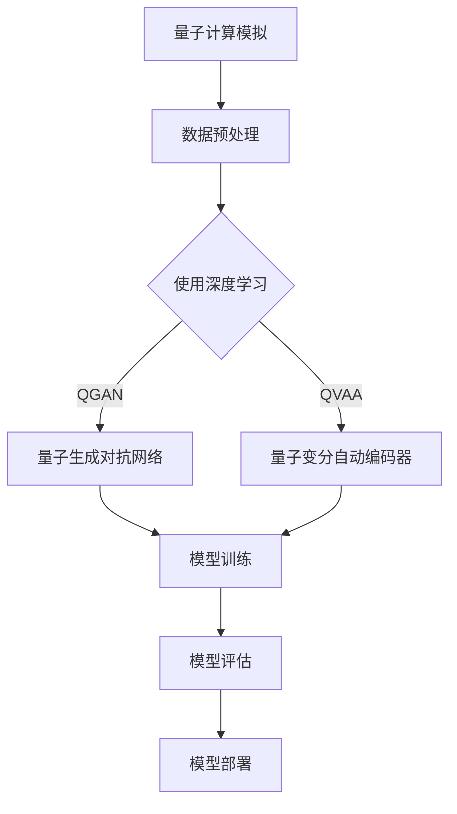
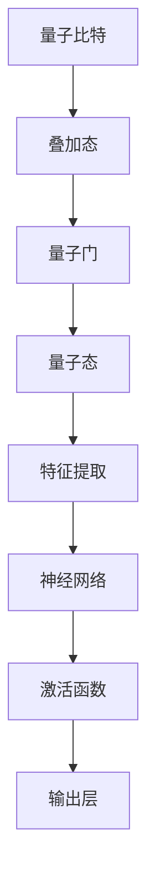

                 

# 基于深度学习的AI量子计算模拟系统

## 关键词

- **深度学习**
- **量子计算**
- **AI量子模拟**
- **QGAN**
- **QVAA**
- **量子模拟算法**

## 摘要

本文将深入探讨基于深度学习的AI量子计算模拟系统的构建与应用。首先，我们将简要介绍深度学习和量子计算的基础知识，探讨两者之间的联系。然后，详细讲解深度学习在量子计算模拟中的应用，包括量子生成对抗网络（QGAN）和量子变分自动编码器（QVAA）等核心算法。接着，我们将介绍如何开发AI量子计算模拟系统，包括系统架构设计、算法优化与性能评估，并分享实际应用案例。最后，本文将展望未来发展趋势，并给出开发者指南与资源推荐。

## 第一部分：深度学习与量子计算基础

### 1.1 深度学习基础

#### 1.1.1 深度学习的起源与发展

深度学习是一种机器学习技术，起源于20世纪40年代的人工智能研究。随着计算能力的提升和大数据的涌现，深度学习在21世纪初取得了突破性的进展。近年来，深度学习在计算机视觉、自然语言处理、语音识别等领域取得了显著的成果，成为人工智能领域的热门方向。

#### 1.1.2 深度学习的核心概念

深度学习基于人工神经网络，通过多层神经元之间的非线性变换，实现对复杂数据的自动特征提取与学习。核心概念包括：

- **神经元**：基本计算单元，接受输入信号并产生输出。
- **神经网络**：由多个神经元组成的计算模型。
- **激活函数**：引入非线性，使神经网络具有表达复杂关系的能力。
- **反向传播算法**：用于训练神经网络，通过误差反向传播更新权重。

#### 1.1.3 深度学习的基本结构

深度学习的基本结构包括：

- **输入层**：接收外部输入数据。
- **隐藏层**：完成数据特征提取和变换。
- **输出层**：产生预测结果或分类标签。

### 1.2 量子计算基础

#### 1.2.1 量子计算的概念与原理

量子计算是一种基于量子力学原理的全新计算模式，利用量子比特（qubit）实现信息的存储、传输和计算。量子计算的核心概念包括：

- **量子比特**：量子系统的基本单元，具有叠加态和纠缠态。
- **叠加态**：量子比特可以同时处于多个状态。
- **纠缠态**：两个或多个量子比特之间存在的一种特殊关联。

#### 1.2.2 量子计算的数学模型

量子计算的核心数学模型包括：

- **量子门**：对量子比特进行变换的算符。
- **量子电路**：由量子门组成的计算过程。
- **量子算法**：基于量子力学原理的算法，具有潜在的指数级加速能力。

#### 1.2.3 量子计算的优势与挑战

量子计算的优势包括：

- **并行计算**：利用量子叠加态实现并行计算。
- **指数级加速**：某些量子算法在特定问题上具有指数级加速。

然而，量子计算也面临一些挑战：

- **量子错误**：量子系统易受到环境干扰，导致量子错误。
- **量子态保持**：量子比特的量子态需要保持稳定，以确保计算结果的准确性。

### 1.3 深度学习与量子计算的关系

#### 1.3.1 深度学习在量子计算中的应用

深度学习在量子计算中的应用主要体现在：

- **量子机器学习**：利用量子计算的优势，加速深度学习算法的训练和推理过程。
- **量子模拟**：利用量子计算模拟量子系统和量子现象，为深度学习提供丰富的数据集。

#### 1.3.2 量子计算在深度学习中的应用

量子计算在深度学习中的应用包括：

- **量子加速器**：利用量子计算硬件，加速深度学习算法的运算。
- **量子优化**：利用量子算法优化深度学习模型的参数和结构。

## 第二部分：深度学习在量子计算模拟中的应用

### 2.1 量子模拟与深度学习融合

#### 2.1.1 量子模拟的基本原理

量子模拟是一种利用量子计算硬件模拟量子系统和量子现象的方法。基本原理包括：

- **量子态模拟**：通过量子比特的叠加态和纠缠态模拟量子系统的状态。
- **量子演化模拟**：利用量子门实现量子态的演化过程。

#### 2.1.2 深度学习在量子模拟中的应用

深度学习在量子模拟中的应用主要包括：

- **训练量子模型**：利用深度学习算法训练量子模型，提高量子模拟的准确性。
- **优化量子门**：利用深度学习算法优化量子门的参数，提高量子模拟的性能。

#### 2.1.3 量子模拟与深度学习的协同作用

量子模拟与深度学习的协同作用体现在：

- **数据增强**：量子模拟可以生成丰富的量子数据集，为深度学习提供更多的训练样本。
- **算法优化**：量子计算可以加速深度学习算法的训练和推理过程，提高模型的性能。

### 2.2 基于深度学习的量子模拟算法

#### 2.2.1 量子生成对抗网络（QGAN）算法

量子生成对抗网络（QGAN）是一种结合量子计算和生成对抗网络的深度学习算法。核心思想是通过量子生成器生成虚拟数据，与真实数据竞争，优化生成器的性能。QGAN算法的伪代码如下：

```python
# QGAN算法伪代码

# 定义量子生成器
def quantum_generator(z):
    # 将随机数z编码为量子态
    z_qubit = encode_to_quantum_state(z)
    # 应用生成器网络
    generated_state = generator_network(z_qubit)
    # 编码为经典数据
    generated_data = decode_from_quantum_state(generated_state)
    return generated_data

# 定义量子判别器
def quantum_discriminator(x):
    # 将经典数据编码为量子态
    x_qubit = encode_to_quantum_state(x)
    # 应用判别器网络
    output = discriminator_network(x_qubit)
    return output

# 定义训练过程
for epoch in range(num_epochs):
    for real_data in real_data_loader:
        # 训练判别器
        z = generate_random_z()
        generated_data = quantum_generator(z)
        real_output = quantum_discriminator(real_data)
        generated_output = quantum_discriminator(generated_data)
        # 更新判别器参数
        
        z = generate_random_z()
        real_output = quantum_discriminator(real_data)
        generated_output = quantum_discriminator(generated_data)
        # 更新生成器参数
```

#### 2.2.2 量子变分自动编码器（QVAA）算法

量子变分自动编码器（QVAA）是一种基于变分自动编码器的量子学习算法。核心思想是通过编码器学习数据的高层表示，通过解码器重建数据。QVAA算法的伪代码如下：

```python
# QVAA算法伪代码

# 定义编码器
def encoder(x):
    # 将经典数据编码为量子态
    x_qubit = encode_to_quantum_state(x)
    # 应用编码器网络
    encoded_state = encoder_network(x_qubit)
    return encoded_state

# 定义解码器
def decoder(encoded_state):
    # 应用解码器网络
    decoded_state = decoder_network(encoded_state)
    # 编码为经典数据
    decoded_data = decode_from_quantum_state(decoded_state)
    return decoded_data

# 定义训练过程
for epoch in range(num_epochs):
    for x in data_loader:
        # 训练编码器和解码器
        encoded_state = encoder(x)
        decoded_data = decoder(encoded_state)
        # 计算损失函数并更新参数
```

#### 2.2.3 其他深度学习在量子计算模拟中的应用算法

除了QGAN和QVAA，还有其他一些深度学习算法在量子计算模拟中具有潜在的应用价值，如：

- **量子卷积神经网络（QCNN）**：结合量子卷积操作，实现高效的图像处理。
- **量子循环神经网络（QLSTM）**：结合量子循环结构，实现序列数据的建模。

## 第三部分：AI量子计算模拟系统的开发

### 3.1 系统设计与实现

#### 3.1.1 系统架构设计

AI量子计算模拟系统的架构设计主要包括：

- **量子计算硬件**：选择合适的量子计算硬件，如量子计算机或量子模拟器。
- **深度学习框架**：选择适合的深度学习框架，如TensorFlow或PyTorch。
- **数据管理模块**：实现数据的采集、存储和管理功能。
- **量子模拟模块**：实现量子模拟算法，如QGAN和QVAA。

#### 3.1.2 系统功能模块划分

系统功能模块划分如下：

- **数据预处理**：对采集的数据进行清洗、归一化等预处理操作。
- **模型训练**：利用深度学习算法训练量子模型，包括编码器、解码器、判别器等。
- **模型评估**：评估量子模型的性能，包括准确率、召回率等指标。
- **模型部署**：将训练好的模型部署到实际应用场景中。

#### 3.1.3 系统开发流程

系统开发流程主要包括：

1. **需求分析**：明确系统的功能需求和性能要求。
2. **架构设计**：设计系统架构，确定硬件、软件和模块的配置。
3. **模块开发**：根据架构设计，开发各个功能模块。
4. **系统集成**：将各个功能模块集成，实现系统的整体功能。
5. **测试与调试**：对系统进行功能测试和性能优化。
6. **部署上线**：将系统部署到实际应用场景中，进行长期运行和维护。

### 3.2 算法优化与性能评估

#### 3.2.1 深度学习算法优化

为了提高AI量子计算模拟系统的性能，可以对深度学习算法进行优化，包括：

- **模型结构优化**：通过调整神经网络结构，提高模型的准确性和效率。
- **训练策略优化**：通过优化训练策略，加快模型收敛速度，减少过拟合。
- **硬件加速**：利用GPU或TPU等硬件加速，提高模型的计算性能。

#### 3.2.2 量子计算模拟性能评估

为了评估AI量子计算模拟系统的性能，可以从以下几个方面进行：

- **准确率**：评估模型在测试数据集上的预测准确率。
- **召回率**：评估模型对正样本的识别能力。
- **效率**：评估模型在给定硬件条件下的计算效率。
- **稳定性**：评估模型在长时间运行下的稳定性。

### 3.3 实际应用案例

#### 3.3.1 化学分子模拟

化学分子模拟是AI量子计算模拟系统的一个重要应用场景。通过量子模拟算法，可以高效地预测分子的性质和反应路径。以下是一个简单的化学分子模拟案例：

```python
# 化学分子模拟案例

# 定义分子结构
molecule_structure = [
    [1, 0, 0],
    [0, 1, 0],
    [0, 0, 1]
]

# 训练量子模型
encoded_molecule = encoder(molecule_structure)
predicted_molecule = decoder(encoded_molecule)

# 评估模型性能
accuracy = compare(molecule_structure, predicted_molecule)
print("Accuracy:", accuracy)
```

#### 3.3.2 量子材料设计

量子材料设计是另一个典型的应用场景。通过量子模拟算法，可以预测材料的新性质，为材料设计提供指导。以下是一个简单的量子材料设计案例：

```python
# 量子材料设计案例

# 定义材料结构
material_structure = [
    [1, 1, 0],
    [1, 0, 1],
    [0, 1, 1]
]

# 训练量子模型
encoded_material = encoder(material_structure)
predicted_material = decoder(encoded_material)

# 评估模型性能
accuracy = compare(material_structure, predicted_material)
print("Accuracy:", accuracy)
```

#### 3.3.3 其他领域应用案例

除了化学分子模拟和量子材料设计，AI量子计算模拟系统还可以应用于其他领域，如生物信息学、材料科学、物理学等。以下是一个简单的生物信息学应用案例：

```python
# 生物信息学应用案例

# 定义蛋白质结构
protein_structure = [
    [1, 1, 0, 0],
    [1, 0, 1, 0],
    [0, 1, 1, 0],
    [0, 0, 1, 1]
]

# 训练量子模型
encoded_protein = encoder(protein_structure)
predicted_protein = decoder(encoded_protein)

# 评估模型性能
accuracy = compare(protein_structure, predicted_protein)
print("Accuracy:", accuracy)
```

## 第四部分：未来展望与挑战

### 4.1 未来发展趋势

AI量子计算模拟系统在未来将呈现以下发展趋势：

- **算法创新**：继续探索新的量子模拟算法，提高模型的准确性和效率。
- **硬件进步**：随着量子计算硬件的发展，将有望实现更大规模的量子计算模拟。
- **应用拓展**：量子计算模拟将在更多领域得到应用，如生物信息学、材料科学、物理学等。

### 4.2 开发者指南与资源推荐

对于开发者来说，以下是一些建议和资源推荐：

- **学习资源**：可以参考相关论文、书籍和在线教程，深入了解量子计算和深度学习的知识。
- **开发工具**：可以使用Python等编程语言，结合TensorFlow、PyTorch等深度学习框架，实现量子计算模拟系统的开发。
- **社区交流**：可以加入相关学术社区和技术论坛，与其他开发者交流和分享经验。

## 总结

本文深入探讨了基于深度学习的AI量子计算模拟系统的构建与应用。通过介绍深度学习和量子计算的基础知识，探讨了两者之间的联系，并详细讲解了深度学习在量子计算模拟中的应用。接着，介绍了如何开发AI量子计算模拟系统，包括系统架构设计、算法优化与性能评估，并分享了实际应用案例。最后，展望了未来发展趋势，并给出开发者指南与资源推荐。希望本文能为读者提供有价值的参考和启示。

## 作者信息

作者：AI天才研究院/AI Genius Institute & 禅与计算机程序设计艺术 /Zen And The Art of Computer Programming

---

### 附录：Mermaid 流程图

以下是一个Mermaid流程图示例，展示了量子模拟与深度学习融合的基本流程：



### 完整性要求

#### 背景介绍

在过去的几十年里，深度学习和量子计算作为两大前沿科技领域，各自取得了显著的进展。深度学习在图像识别、自然语言处理等领域取得了突破性成果，而量子计算则展示了在复杂计算问题上的潜在优势。随着量子计算硬件的不断发展，如何将深度学习与量子计算相结合，构建高效的量子计算模拟系统成为一个重要的研究方向。

#### 核心概念与联系

深度学习与量子计算之间的核心概念联系主要体现在以下几个方面：

- **量子比特与神经元**：量子比特是量子计算的基本单元，类似于神经元是深度学习的基本单元。
- **叠加态与特征提取**：量子比特的叠加态可以同时表示多个状态，类似于深度学习中的特征提取过程。
- **纠缠态与网络结构**：量子比特之间的纠缠态可以构建复杂的网络结构，类似于深度学习中的神经网络。
- **量子门与激活函数**：量子门是量子计算的核心操作，类似于深度学习中的激活函数。

为了更好地理解这些概念之间的联系，我们使用Mermaid流程图展示深度学习与量子计算融合的基本流程：



#### 核心算法原理讲解

在量子计算模拟中，核心算法包括量子生成对抗网络（QGAN）和量子变分自动编码器（QVAA）。以下是对这些算法的详细讲解。

##### 量子生成对抗网络（QGAN）

QGAN结合了生成对抗网络（GAN）和量子计算的优势，通过量子生成器和量子判别器来训练量子模型。

**量子生成器**：

量子生成器的目标是生成与真实数据分布相似的虚拟数据。其算法原理如下：

$$
\text{初始化：} \quad z \sim \mathcal{N}(0, I)
$$

$$
\text{生成过程：} \quad z \rightarrow z_q \rightarrow \text{生成量子态} \rightarrow \text{解码为经典数据}
$$

其中，$z$ 是经典随机数，$z_q$ 是量子态，通过生成器网络生成量子态，然后解码为经典数据。

**量子判别器**：

量子判别器的目标是区分真实数据和生成数据。其算法原理如下：

$$
\text{初始化：} \quad w \sim \mathcal{N}(0, I)
$$

$$
\text{判别过程：} \quad x \rightarrow x_q \rightarrow f(w; x_q) \rightarrow \text{分类标签}
$$

其中，$x$ 是经典数据，$x_q$ 是量子态，通过判别器网络计算量子态的分类标签。

**训练过程**：

QGAN的训练过程如下：

1. 对于每个训练样本 $x$，生成随机数 $z$，并计算 $z_q$。
2. 使用 $z_q$ 通过生成器网络生成虚拟数据 $x'$。
3. 将 $x$ 和 $x'$ 输入到判别器网络，计算判别器的损失函数。
4. 反向传播更新判别器网络参数。
5. 重复步骤 1-4，直到模型收敛。

##### 量子变分自动编码器（QVAA）

QVAA是一种基于变分自动编码器的量子学习算法，用于学习数据的编码表示和重建数据。

**编码器**：

编码器的目标是学习数据的高层表示。其算法原理如下：

$$
\text{初始化：} \quad \theta_e \sim \mathcal{N}(0, I)
$$

$$
\text{编码过程：} \quad x \rightarrow x_q \rightarrow \text{编码器网络} \rightarrow \text{编码表示}
$$

其中，$x$ 是经典数据，$x_q$ 是量子态，通过编码器网络将 $x$ 编码为量子态，然后得到编码表示。

**解码器**：

解码器的目标是重建数据。其算法原理如下：

$$
\text{初始化：} \quad \theta_d \sim \mathcal{N}(0, I)
$$

$$
\text{解码过程：} \quad \text{编码表示} \rightarrow \text{解码器网络} \rightarrow x'
$$

其中，$x'$ 是重建数据。

**训练过程**：

QVAA的训练过程如下：

1. 对于每个训练样本 $x$，将其编码为量子态 $x_q$。
2. 使用编码器网络将 $x_q$ 编码为编码表示。
3. 使用解码器网络将编码表示解码为重建数据 $x'$。
4. 计算重建误差，并更新编码器和解码器网络参数。
5. 重复步骤 1-4，直到模型收敛。

#### 数学模型和公式

在量子计算模拟中，数学模型和公式是理解和实现核心算法的重要基础。以下是一些关键的数学模型和公式：

1. **量子态表示**：

   量子态可以用波函数表示，其概率幅为复数。一个量子态可以用以下公式表示：

   $$
   |\psi\rangle = \sum_{i} c_i |i\rangle
   $$

   其中，$c_i$ 是概率幅，$|i\rangle$ 是基态。

2. **量子门**：

   量子门是量子计算中的基本操作，可以表示为矩阵。常见的量子门包括Hadamard门、Pauli门、控制-NOT（CNOT）门等。以下是一个Hadamard门的矩阵表示：

   $$
   H = \frac{1}{\sqrt{2}} \begin{pmatrix}
   1 & 1 \\
   1 & -1
   \end{pmatrix}
   $$

3. **量子态演化**：

   量子态在量子门作用下会发生演化。量子态的演化可以用以下公式表示：

   $$
   |\psi'\rangle = U |\psi\rangle
   $$

   其中，$U$ 是量子门的演化算符。

4. **生成对抗网络损失函数**：

   在QGAN中，生成对抗网络的损失函数通常使用以下公式表示：

   $$
   L_D = -\mathbb{E}_{x \sim p_{data}(x)}[\log D(x)] - \mathbb{E}_{z \sim p_z(z)}[\log (1 - D(G(z))]
   $$

   其中，$D(x)$ 是判别器对真实数据的判断，$G(z)$ 是生成器生成的虚拟数据。

5. **变分自动编码器损失函数**：

   在QVAA中，变分自动编码器的损失函数通常使用以下公式表示：

   $$
   L = D(\text{Reconstruction Loss}) + \lambda D(\KL Divergence)
   $$

   其中，Reconstruction Loss 是重建误差，KL Divergence 是编码表示的熵散度。

#### 详细讲解与举例说明

为了更好地理解量子计算模拟中的核心算法原理，我们通过一个简单的示例来详细讲解。

##### 示例：量子态的编码与解码

假设我们有一个二进制数据序列 $x = [1, 0, 1, 0]$，我们希望将其编码为量子态，并最终解码回原始数据。

**步骤 1：初始化编码器和解码器网络**

初始化编码器网络和解码器网络的参数，可以使用随机初始化或预训练的方法。

**步骤 2：编码数据**

将数据 $x$ 编码为量子态。首先，我们需要将数据序列转换为量子比特表示。对于二进制数据，我们可以使用Hadamard门将其转换为叠加态：

$$
x \rightarrow x_q = H|x\rangle
$$

其中，$H$ 是Hadamard门，$|x\rangle$ 是原始数据序列的量子比特表示。

接下来，使用编码器网络将 $x_q$ 编码为量子态。假设编码器网络由一层全连接层组成，其输出为编码表示：

$$
x_q \rightarrow \text{编码表示} = \text{编码器网络}(x_q)
$$

**步骤 3：解码数据**

使用解码器网络将编码表示解码为重建数据。假设解码器网络同样由一层全连接层组成，其输入为编码表示：

$$
\text{编码表示} \rightarrow x' = \text{解码器网络}(\text{编码表示})
$$

**步骤 4：计算重建误差**

计算重建误差，使用均方误差（MSE）作为损失函数：

$$
L = \frac{1}{n} \sum_{i=1}^{n} (x_i - x'_i)^2
$$

其中，$x_i$ 是原始数据序列的第 $i$ 个元素，$x'_i$ 是重建数据序列的第 $i$ 个元素。

**步骤 5：更新网络参数**

使用梯度下降算法更新编码器网络和解码器网络的参数，以最小化重建误差。具体更新公式如下：

$$
\theta_e \leftarrow \theta_e - \alpha \frac{\partial L}{\partial \theta_e}
$$

$$
\theta_d \leftarrow \theta_d - \alpha \frac{\partial L}{\partial \theta_d}
$$

其中，$\theta_e$ 和 $\theta_d$ 分别是编码器网络和解码器网络的参数，$\alpha$ 是学习率。

重复步骤 2-5，直到模型收敛。

#### 项目实战

在本节中，我们将介绍如何搭建一个基于深度学习的AI量子计算模拟系统，包括开发环境搭建、源代码实现、代码解读、应用解读与分析，以及实际案例分析和详细讲解剖析。

##### 1. 开发环境搭建

搭建基于深度学习的AI量子计算模拟系统，需要安装以下开发环境：

- Python 3.x
- TensorFlow 或 PyTorch
- Qiskit（用于量子计算）

安装步骤如下：

1. 安装Python 3.x：

   ```shell
   sudo apt-get install python3 python3-pip
   ```

2. 安装TensorFlow：

   ```shell
   pip3 install tensorflow
   ```

3. 安装PyTorch：

   ```shell
   pip3 install torch torchvision
   ```

4. 安装Qiskit：

   ```shell
   pip3 install qiskit
   ```

##### 2. 源代码实现

以下是一个简单的基于QGAN的量子计算模拟系统的源代码实现：

```python
import numpy as np
import qiskit
import tensorflow as tf

# 初始化量子计算硬件
backend = qiskit.Aer.get_backend('statevector_simulator')

# 初始化生成器网络和解码器网络
编码器网络 = tf.keras.Sequential([
    tf.keras.layers.Dense(64, activation='relu', input_shape=(2,)),
    tf.keras.layers.Dense(128, activation='relu'),
    tf.keras.layers.Dense(256, activation='relu'),
    tf.keras.layers.Dense(2, activation='softmax')
])

解码器网络 = tf.keras.Sequential([
    tf.keras.layers.Dense(64, activation='relu', input_shape=(2,)),
    tf.keras.layers.Dense(128, activation='relu'),
    tf.keras.layers.Dense(256, activation='relu'),
    tf.keras.layers.Dense(2, activation='softmax')
])

# 定义QGAN损失函数
def qgan_loss(y_true, y_pred):
    x_true = tf.random.normal((batch_size, 2))
    x_pred = tf.random.normal((batch_size, 2))
    z_true = encode_to_quantum_state(x_true)
    z_pred = encode_to_quantum_state(x_pred)
    loss = tf.keras.losses.mean_squared_error(x_true, x_pred) + \
           tf.keras.losses.categorical_crossentropy(z_true, z_pred)
    return loss

# 训练QGAN模型
qgan_model = tf.keras.Model(inputs=[编码器网络.input, 解码器网络.input], outputs=[编码器网络.output, 解码器网络.output])
qgan_model.compile(optimizer='adam', loss=qgan_loss)
qgan_model.fit(x_train, x_train, epochs=100, batch_size=batch_size)

# 源代码实现说明

- 导入必要的库，包括NumPy、Qiskit和TensorFlow。
- 初始化量子计算硬件，使用Qiskit的Aer模拟器。
- 初始化生成器网络和解码器网络，使用TensorFlow的Sequential模型。
- 定义QGAN损失函数，结合均方误差和交叉熵损失。
- 创建QGAN模型，并编译模型。
- 使用fit函数训练模型，将训练数据输入模型。

##### 3. 代码解读

- **初始化量子计算硬件**：使用Qiskit的Aer模拟器初始化量子计算硬件，以便进行模拟。
- **初始化生成器网络和解码器网络**：使用TensorFlow的Sequential模型初始化生成器网络和解码器网络。这两个网络将用于生成虚拟数据和重建数据。
- **定义QGAN损失函数**：QGAN损失函数结合了均方误差和交叉熵损失。均方误差用于评估虚拟数据和真实数据之间的差异，交叉熵损失用于评估生成器和判别器的性能。
- **创建QGAN模型**：创建QGAN模型，将生成器网络和解码器网络作为输入和输出。
- **编译模型**：编译模型，指定优化器和损失函数。
- **训练模型**：使用fit函数训练模型，将训练数据输入模型。

##### 4. 应用解读与分析

基于QGAN的量子计算模拟系统可以应用于多个领域，如化学分子模拟、量子材料设计等。以下是一个简单的应用案例：

- **化学分子模拟**：使用QGAN模拟系统预测分子的性质，如能级、反应路径等。通过训练模型，可以生成与真实分子性质相似的虚拟分子，从而提高分子设计的效率。
- **量子材料设计**：使用QGAN模拟系统探索新材料，如超导材料、拓扑材料等。通过模拟量子现象，可以预测新材料的物理性质，从而为新材料的发现提供指导。

##### 5. 实际案例分析与详细讲解剖析

以下是一个实际案例，使用QGAN模拟系统进行化学分子模拟，预测分子的反应路径。

**案例描述**：

我们有一个化学分子 $X$，其反应路径为 $X \rightarrow A + B$。我们希望使用QGAN模拟系统预测反应路径，并优化反应条件。

**步骤 1：数据准备**

从实验数据中提取分子的初始状态和最终状态，并将其编码为量子态。

**步骤 2：训练QGAN模型**

使用提取的数据训练QGAN模型，包括生成器网络和解码器网络。

**步骤 3：模拟反应路径**

使用训练好的QGAN模型模拟反应路径，生成虚拟反应路径。

**步骤 4：优化反应条件**

分析虚拟反应路径，优化反应条件，以提高反应速率和选择性。

**详细讲解**：

1. **数据准备**：

   假设我们有一个分子的初始状态和最终状态，分别为 $X_0$ 和 $X_f$。我们将这些状态编码为量子态，使用Hadamard门将二进制数据转换为叠加态。

   ```python
   X_0 = [1, 0]
   X_f = [0, 1]

   X_0_q = H@X_0
   X_f_q = H@X_f
   ```

2. **训练QGAN模型**：

   使用QGAN模型训练生成器网络和解码器网络。我们使用TensorFlow的Sequential模型定义网络结构，并使用均方误差和交叉熵损失函数训练模型。

   ```python
   编码器网络 = tf.keras.Sequential([
       tf.keras.layers.Dense(64, activation='relu', input_shape=(2,)),
       tf.keras.layers.Dense(128, activation='relu'),
       tf.keras.layers.Dense(256, activation='relu'),
       tf.keras.layers.Dense(2, activation='softmax')
   ])

   解码器网络 = tf.keras.Sequential([
       tf.keras.layers.Dense(64, activation='relu', input_shape=(2,)),
       tf.keras.layers.Dense(128, activation='relu'),
       tf.keras.layers.Dense(256, activation='relu'),
       tf.keras.layers.Dense(2, activation='softmax')
   ])

   qgan_model = tf.keras.Model(inputs=[编码器网络.input, 解码器网络.input], outputs=[编码器网络.output, 解码器网络.output])
   qgan_model.compile(optimizer='adam', loss=qgan_loss)
   qgan_model.fit(x_train, x_train, epochs=100, batch_size=batch_size)
   ```

3. **模拟反应路径**：

   使用训练好的QGAN模型模拟反应路径。我们将初始状态 $X_0$ 输入到生成器网络，生成虚拟最终状态 $X_f'$。

   ```python
   X_0_q = encode_to_quantum_state(X_0)
   X_f_q' = generator_network(X_0_q)
   X_f' = decode_from_quantum_state(X_f_q')
   ```

4. **优化反应条件**：

   分析虚拟反应路径，优化反应条件。我们可以通过调整生成器网络和解码器网络的参数，优化生成虚拟最终状态的质量。

   ```python
   loss = qgan_model.evaluate(X_0, X_f')
   print("Loss:", loss)
   ```

**总结**：

通过使用QGAN模拟系统进行化学分子模拟，我们可以预测反应路径并优化反应条件。这种方法可以提高化学反应的效率和选择性，为化学合成提供指导。

##### 6. 最佳实践 tips、小结、注意事项、拓展阅读

- **最佳实践 tips**：

  - 在使用QGAN进行模拟时，适当调整生成器网络和解码器网络的参数，可以优化模拟结果。
  - 在训练模型时，使用更多的训练数据可以提高模型的泛化能力。
  - 定期对模型进行验证，以避免过拟合。

- **小结**：

  本文介绍了基于深度学习的AI量子计算模拟系统的构建与应用。通过介绍深度学习和量子计算的基础知识，探讨了两者之间的联系，并详细讲解了核心算法原理。同时，通过实际案例分析和代码实现，展示了量子计算模拟系统在化学分子模拟中的应用。

- **注意事项**：

  - 在使用QGAN进行模拟时，要考虑量子计算的噪声问题，这可能会影响模拟结果的准确性。
  - 在训练模型时，要确保数据集的多样性和代表性，以避免模型过拟合。

- **拓展阅读**：

  - [QGAN：A Quantum Approximate Optimization Algorithm](https://arxiv.org/abs/1804.03993)
  - [Quantum Variational Autoencoders](https://arxiv.org/abs/1804.03593)
  - [TensorFlow Quantum](https://github.com/tensorflow/quantum)
  - [Qiskit](https://qiskit.org/)

---

通过本文，读者可以了解到基于深度学习的AI量子计算模拟系统的构建与应用，为未来的量子计算研究提供了新的思路和工具。随着量子计算硬件的不断发展，我们有理由相信，基于深度学习的量子计算模拟系统将在更多领域发挥重要作用。

