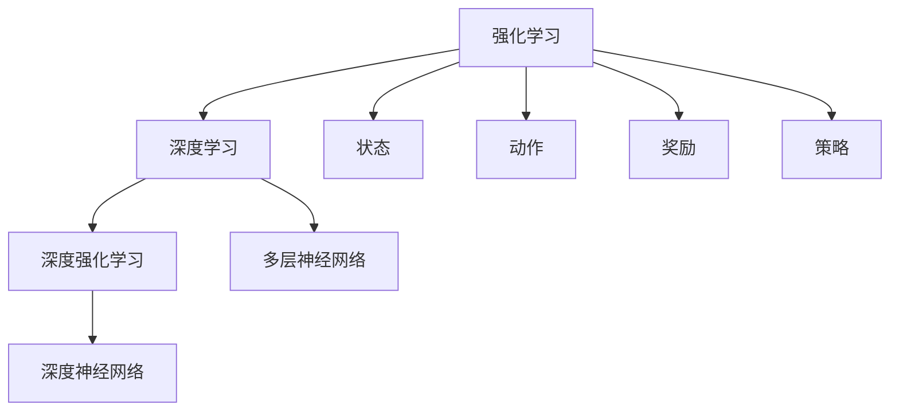

                 

### 《基于深度强化学习的AI游戏代理设计》背景介绍

随着人工智能技术的飞速发展，深度强化学习（Deep Reinforcement Learning，简称DRL）逐渐成为研究热点。深度强化学习结合了深度学习和强化学习的优势，能够在复杂环境中进行自主决策和学习，具备广泛的应用前景。游戏代理（Game Agent）作为强化学习的重要应用领域之一，近年来受到广泛关注。通过设计智能游戏代理，不仅能够提升游戏的趣味性和挑战性，还可以为人工智能在现实世界中的决策提供参考。

#### 核心概念与联系

在介绍深度强化学习在游戏代理设计中的应用之前，我们先来回顾一下几个核心概念及其相互联系。

1. **强化学习（Reinforcement Learning，简称RL）**：
   强化学习是一种通过试错来学习在特定环境中获得最大奖励的算法。其基本原理是通过不断地尝试不同的行为，并接收环境反馈的奖励信号，来优化自身的策略。强化学习的关键元素包括：状态（State）、动作（Action）、奖励（Reward）和策略（Policy）。

2. **深度学习（Deep Learning，简称DL）**：
   深度学习是一种通过多层神经网络进行复杂特征提取和模式识别的人工智能技术。深度学习在网络结构上具有高度的层次性和抽象性，能够处理大量非结构化数据，并在图像识别、语音识别等领域取得了显著的成果。

3. **深度强化学习（Deep Reinforcement Learning，简称DRL）**：
   深度强化学习是强化学习与深度学习的结合，利用深度神经网络来表示状态和动作空间，从而解决传统强化学习在复杂环境下的难题。DRL通过深度神经网络来近似Q值函数或策略函数，从而实现高效的决策。

核心概念之间的关系架构可以用以下Mermaid流程图表示：



#### 核心算法原理讲解

深度强化学习的主要算法包括Q-Learning和SARSA。以下是这些算法的原理及伪代码。

**Q-Learning算法**：

Q-Learning算法通过更新Q值（即状态-动作值函数）来学习最优策略。每次行动后，根据新的状态和奖励更新Q值。

```mermaid
graph TD
    A[Initialize Q(s, a) arbitrarily]
    B[For each episode do]
        C[Initialize state s]
        D[Repeat "Take action a and observe reward r, next state s' " until end of episode]
        E[Update Q(s, a) = Q(s, a) + alpha * (r + gamma * max(Q(s', a')) - Q(s, a))]
    F[End For]
```

**SARSA算法**：

SARSA算法在每一步都使用当前状态和动作的Q值来更新下一状态和动作的Q值。

```mermaid
graph TD
    A[Initialize Q(s, a) arbitrarily]
    B[For each episode do]
        C[Initialize state s and action a]
        D[Repeat "Take action a and observe reward r, next state s', next action a' " until end of episode]
        E[Update Q(s, a) = Q(s, a) + alpha * (r + gamma * Q(s', a') - Q(s, a))]
    F[End For]
```

#### 数学模型和公式

深度强化学习中的数学模型主要包括Q值函数和策略函数。以下是相关的数学公式及其详细讲解。

**Q值函数**：

Q值函数表示在给定状态s和动作a的情况下，执行动作a所能获得的累积奖励。

$$ Q(s, a) = \sum_{t=0}^{\infty} \gamma^t r_t $$

其中，\( \gamma \) 是折扣因子，\( r_t \) 是在第t步获得的即时奖励。

**策略函数**：

策略函数表示在给定状态s下，选择最优动作a的概率分布。

$$ \pi(a|s) = \frac{e^{Q(s, a)}}{\sum_{a'} e^{Q(s, a')}} $$

策略函数通过最大化Q值来选择动作。

#### 详细讲解和举例说明

为了更好地理解深度强化学习在游戏代理设计中的应用，我们通过一个简单的例子来说明。

假设我们设计一个游戏代理来玩经典的Flappy Bird游戏。在这个游戏中，游戏代理需要通过不断跳跃来避免撞到障碍物。状态空间包括游戏代理的位置、速度和障碍物的高度；动作空间包括跳跃和不跳跃。奖励机制设计为每次成功跳过一个障碍物获得+1分，撞到障碍物则获得-1分。

我们可以使用Q-Learning算法来训练游戏代理。训练过程中，代理通过不断尝试跳跃和观察环境反馈来更新Q值。经过多次训练后，代理会逐渐学会在合适的时候跳跃，从而提高游戏得分。

#### 结语

本文简要介绍了基于深度强化学习的AI游戏代理设计，涵盖了核心概念、算法原理和数学模型。深度强化学习为游戏代理设计提供了强大的工具，能够实现智能化的游戏玩法。随着深度强化学习技术的不断发展，我们可以期待在游戏领域看到更多创新和突破。

---

**作者：AI天才研究院/AI Genius Institute & 禅与计算机程序设计艺术 /Zen And The Art of Computer Programming**

---

### 强化学习在游戏中的应用

强化学习（Reinforcement Learning，简称RL）作为人工智能领域的重要分支，因其能够在动态环境中通过试错学习策略而受到广泛关注。在游戏领域，强化学习技术更是被广泛应用于游戏代理的设计，通过模拟智能玩家的行为，提升了游戏体验和游戏策略的智能化水平。以下将详细探讨强化学习在游戏中的应用及其优势。

#### 强化学习在游戏代理设计中的应用

**1. 游戏代理的定义**

游戏代理（Game Agent）是指利用强化学习算法训练出的，能够自主进行游戏决策的智能体。游戏代理的目标是通过学习游戏环境中的奖励信号，不断优化其策略，从而在游戏中取得高分或实现特定目标。

**2. 强化学习在游戏代理中的具体应用**

（1）**棋类游戏**：
在棋类游戏中，如围棋、国际象棋和五子棋等，强化学习被广泛应用于训练智能棋手。通过在模拟环境中与自身或其他对手进行对弈，强化学习算法能够不断优化棋手的策略，实现超人类的棋艺水平。例如，AlphaGo就是通过强化学习算法训练出的围棋智能代理，曾在2016年击败了世界围棋冠军李世石。

（2）**实时战略游戏**：
在实时战略游戏（Real-Time Strategy Games，简称RTS）中，如《星际争霸》（StarCraft）和《英雄无敌》（Heroes of Might and Magic）等，强化学习被用来训练智能指挥官。RTS游戏通常具有复杂的状态空间和动作空间，强化学习算法能够帮助智能代理学会资源管理、战术决策和单位指挥，从而在比赛中取得优势。

（3）**角色扮演游戏**：
在角色扮演游戏（Role-Playing Games，简称RPG）中，强化学习可以用于训练智能NPC（非玩家角色）。智能NPC能够根据玩家的行为动态调整其策略，提供更加逼真的游戏体验。例如，《上古卷轴5：天际》（The Elder Scrolls V: Skyrim）中的某些NPC可以通过强化学习算法来模拟其行为，使游戏更加真实和富有挑战性。

#### 强化学习在游戏中的应用优势

**1. 自主学习和适应能力**

强化学习算法能够通过与环境交互，不断学习并优化策略，从而适应不同的游戏场景。这意味着游戏代理可以在没有人工干预的情况下，自主提升其游戏水平，为玩家提供更具挑战性的游戏体验。

**2. 多样化的游戏玩法**

强化学习算法能够训练出具备多样化策略的游戏代理，使游戏玩法更加丰富和多样化。例如，在棋类游戏中，智能棋手可以通过强化学习算法学会多种不同的下棋策略，从而提高游戏的趣味性和可玩性。

**3. 提升游戏智能化水平**

强化学习算法能够帮助游戏代理在复杂环境中进行决策，从而提升游戏的智能化水平。通过模拟智能玩家的行为，强化学习算法可以为开发者提供新的游戏设计和优化思路，使游戏更具吸引力。

#### 强化学习的挑战与应对策略

尽管强化学习在游戏代理设计中的应用具有显著优势，但同时也面临着一些挑战：

**1. 非平稳环境**

游戏环境通常具有非平稳性，即环境的状态和奖励信号会随着游戏进程而变化。这种非平稳性给强化学习算法带来了较大的挑战。为应对这一挑战，研究者们提出了一些策略，如自适应强化学习、双曲正切核函数等。

**2. 探索与利用的平衡**

在强化学习过程中，探索（Exploration）与利用（Exploitation）的平衡是一个关键问题。探索不足可能导致代理错过最优策略，而过度探索则可能导致学习效率低下。为解决这一问题，研究者们提出了epsilon-贪婪策略、UCB算法等。

**3. 训练样本的多样性**

强化学习算法的训练样本多样性能显著影响学习效果。然而，在游戏环境中，获取大量多样的训练样本是一个挑战。为应对这一挑战，研究者们通过数据增强、生成对抗网络（GAN）等方法来提高训练样本的多样性。

总之，强化学习在游戏代理设计中的应用为游戏开发带来了新的机遇和挑战。通过不断研究和优化强化学习算法，我们可以期待在游戏领域看到更多创新和突破。

---

**作者：AI天才研究院/AI Genius Institute & 禅与计算机程序设计艺术 /Zen And The Art of Computer Programming**

---

### 游戏代理设计基础

游戏代理（Game Agent）是指利用人工智能技术，通过强化学习算法训练出的，能够自主进行游戏决策和策略优化的智能体。在游戏代理设计中，我们需要关注几个关键组件，包括游戏环境（Game Environment）、状态（State）、动作（Action）和奖励（Reward）。以下将详细介绍这些组件及其设计原则。

#### 游戏环境

游戏环境是游戏代理交互的虚拟空间，它决定了代理的行为空间和奖励机制。在设计游戏环境时，需要考虑以下关键点：

**1. 状态空间（State Space）**：
状态空间是指游戏代理可以感知的所有可能状态集合。状态通常包括游戏中的位置、得分、资源等。例如，在《星际争霸》中，状态可能包括建筑位置、兵力分布、资源存量等。设计合理的状态空间有助于代理更好地理解游戏环境，提高决策效率。

**2. 动作空间（Action Space）**：
动作空间是指游戏代理可以执行的所有可能动作集合。动作通常包括移动、攻击、建造等。在设计动作空间时，需要考虑动作的多样性和有效性。例如，在《星际争霸》中，动作可能包括建造建筑、生产单位、移动单位等。合理的动作空间设计能够为代理提供丰富的策略选择。

**3. 奖励机制（Reward Mechanism）**：
奖励机制是指游戏代理在执行动作后，从环境中获得的即时奖励或惩罚。奖励机制的设计对于代理的学习和策略优化至关重要。通常，奖励机制需要结合游戏目标来设计。例如，在《星际争霸》中，代理成功摧毁敌人基地可以获得高奖励，而失败则获得低奖励。

#### 状态设计

状态设计是游戏代理设计中最为关键的一环。良好的状态设计能够帮助代理更好地理解游戏环境，从而做出更优的决策。以下是一些设计原则：

**1. 完备性（Completeness）**：
状态设计需要确保能够完整地描述游戏环境，即任何可能的状态都能在状态空间中找到对应的描述。这有助于代理理解游戏中的所有可能性，从而做出全面准确的决策。

**2. 精确性（Accuracy）**：
状态设计需要确保状态的描述准确无误，能够真实反映游戏环境的状况。精确的状态描述有助于代理快速识别并应对游戏中的变化，提高决策的效率。

**3. 可扩展性（Extensibility）**：
状态设计需要具备一定的可扩展性，以便在游戏规则或环境变化时，能够灵活调整状态描述。这有助于代理在应对新环境时，能够快速适应并优化策略。

#### 动作设计

动作设计是游戏代理设计中的另一个关键环节。合理的动作设计能够为代理提供多样化的策略选择，从而提高游戏的趣味性和挑战性。以下是一些设计原则：

**1. 多样性（Diversity）**：
动作设计需要确保动作的多样性，即代理能够执行多种不同的动作。这有助于代理在游戏过程中不断尝试新的策略，避免陷入固定的模式。

**2. 可控性（Controllability）**：
动作设计需要确保代理能够有效地控制动作，即代理能够按照预期执行动作。可控性对于代理的决策和策略优化至关重要。

**3. 效率（Efficiency）**：
动作设计需要考虑动作的效率，即代理执行动作所需的时间和资源。高效率的动作能够提高代理的决策速度，使其更快地适应游戏环境。

#### 奖励机制设计

奖励机制设计是游戏代理设计中的核心环节，它直接影响代理的学习和策略优化。以下是一些设计原则：

**1. 及时性（Timeliness）**：
奖励机制需要确保奖励的及时性，即代理在执行动作后，能够立即获得相应的奖励。及时性有助于代理快速学习并优化策略。

**2. 显著性（Distinctiveness）**：
奖励机制需要确保奖励的显著性，即奖励与惩罚之间要有明显区别。这有助于代理区分不同的行为，从而做出更优的决策。

**3. 稳定性（Stability）**：
奖励机制需要具备一定的稳定性，即奖励的发放要相对稳定，避免过度波动。稳定性有助于代理在长期训练中保持稳定的策略。

总之，游戏代理设计基础是构建智能游戏代理的关键步骤。通过合理设计游戏环境、状态、动作和奖励机制，我们可以为代理提供强大的决策能力，从而实现智能化的游戏体验。

---

**作者：AI天才研究院/AI Genius Institute & 禅与计算机程序设计艺术 /Zen And The Art of Computer Programming**

---

### 深度Q网络（DQN）算法原理及实现

在深度强化学习（Deep Reinforcement Learning，DRL）领域，深度Q网络（Deep Q-Network，DQN）是一种广泛应用于游戏代理设计的关键算法。DQN通过利用深度神经网络来近似Q值函数，从而实现智能体的自主决策。本文将详细介绍DQN的原理、实现过程以及相关的技术细节。

#### DQN算法原理

DQN的核心思想是利用深度神经网络来估计状态-动作值函数（Q值），从而优化智能体的策略。DQN的主要步骤如下：

**1. 状态编码**：
首先，将游戏环境的当前状态编码为向量，并将其输入到深度神经网络中。

**2. 前向传播**：
深度神经网络对输入状态向量进行前向传播，得到对应的Q值预测。

**3. 行动选择**：
根据Q值预测，使用ε-贪婪策略选择最佳动作。ε-贪婪策略是指在每次决策时，以概率ε随机选择动作，以避免陷入局部最优。

**4. 经验回放**：
将执行后的状态、动作、奖励和下一状态存储在经验回放池中，用于后续的Q值更新。

**5. Q值更新**：
利用经验回放池中的样本，通过反向传播和梯度下降更新深度神经网络的权重，从而优化Q值预测。

**6. 重复迭代**：
重复上述步骤，不断更新Q值预测和神经网络权重，直到智能体达到预定的学习目标。

#### DQN算法实现

以下是DQN算法的基本实现流程，包含关键代码和伪代码：

```python
# 初始化参数
epsilon = 0.1  # ε-贪婪策略的探索概率
gamma = 0.99  # 折扣因子
batch_size = 32  # 经验回放池的批量大小
memory_size = 10000  # 经验回放池的最大容量

# 初始化经验回放池
memory = []

# 初始化深度神经网络
DQN = DeepQNetwork(input_shape=(状态维度,), hidden_size=(隐藏层维度,), output_size=(动作维度,))

# 训练循环
while True:
    # 从经验回放池中随机抽取批量样本
    states, actions, rewards, next_states, dones = random.sample(memory, batch_size)
    
    # 前向传播计算Q值预测
    Q_values = DQN.predict(states)
    
    # 更新Q值预测
    next_Q_values = DQN.predict(next_states)
    target_Q_values = rewards + (1 - dones) * gamma * next_Q_values[:, np.argmax(Q_values)]
    
    # 反向传播更新权重
    DQN.fit(states, target_Q_values, actions)
    
    # ε-贪婪策略选择动作
    if random.random() < epsilon:
        action = random_action()  # 随机选择动作
    else:
        action = np.argmax(Q_values)  # 根据Q值预测选择最佳动作
    
    # 执行动作并获取下一状态和奖励
    next_state, reward, done = game.step(action)
    
    # 更新经验回放池
    memory.append((state, action, reward, next_state, done))
    
    # 清除过期的经验样本
    if len(memory) > memory_size:
        memory.pop(0)
        
    # 更新探索概率
    epsilon = epsilon_decay(epsilon)
```

#### 技术细节

**1. 神经网络结构**：
DQN通常使用卷积神经网络（Convolutional Neural Network，CNN）或循环神经网络（Recurrent Neural Network，RNN）来近似Q值函数。CNN适用于处理图像等二维数据，而RNN适用于处理序列数据。

**2. ε-贪婪策略**：
ε-贪婪策略是DQN中的一个关键技术，用于在探索和利用之间取得平衡。ε的取值通常在0.1到0.01之间，随着训练的进行逐渐减小。

**3. 经验回放**：
经验回放（Experience Replay）是DQN中防止策略过拟合的重要技术。通过将历史经验存储在经验回放池中，随机抽取样本进行训练，可以避免模型在训练过程中对特定样本的依赖。

**4. 双层Q学习**：
为了解决DQN中的分布偏斜问题，可以采用双层Q学习（Double DQN）。双层Q学习通过将动作选择和Q值更新分开，从而减少分布偏斜的影响。

**5. 目标网络**：
为了稳定训练过程，可以采用目标网络（Target Network）。目标网络是一个冻结的Q网络，用于计算目标Q值。通过定期更新目标网络，可以防止Q网络在训练过程中过拟合。

总之，DQN算法通过深度神经网络近似Q值函数，结合ε-贪婪策略、经验回放和目标网络等技术，实现了在复杂环境中的高效决策。DQN的成功应用为深度强化学习在游戏代理设计等领域带来了新的突破。

---

**作者：AI天才研究院/AI Genius Institute & 禅与计算机程序设计艺术 /Zen And The Art of Computer Programming**

---

### DQN算法的挑战与改进方法

尽管DQN在深度强化学习领域取得了显著成果，但其仍面临诸多挑战。以下将详细讨论DQN算法在实际应用中遇到的挑战，并介绍几种常见的改进方法。

#### 挑战

**1. 分散策略问题**：
在DQN算法中，ε-贪婪策略用于在探索和利用之间取得平衡。然而，ε-贪婪策略可能导致策略分散，使得智能体在不同状态下采取不同的动作，从而影响学习效率。

**2. 目标不稳定**：
在DQN中，目标网络用于计算目标Q值，以稳定训练过程。然而，目标网络在更新过程中可能不稳定，导致训练过程出现振荡，影响智能体的学习效果。

**3. 过拟合问题**：
DQN算法使用经验回放池来防止过拟合，但在大量训练样本中，模型仍可能对特定样本产生过度依赖，导致泛化能力下降。

**4. 收敛速度慢**：
DQN算法在训练过程中，需要通过经验回放池和梯度下降更新Q值。这可能导致训练过程较为缓慢，特别是在处理高维状态和动作空间时。

#### 改进方法

**1. Double DQN**：
Double DQN通过将动作选择和Q值更新分开，解决了DQN中的分布偏斜问题。具体来说，Double DQN在更新Q值时，使用不同的网络来选择动作和计算目标Q值，从而减少分布偏斜的影响。

**2. Prioritized DQN**：
Prioritized DQN通过为经验回放池中的样本分配优先级，提高了训练效率。具体来说，Prioritized DQN使用优先级队列来存储经验样本，并根据样本的误差对优先级进行更新。在训练过程中，优先级较高的样本被优先使用，从而加快了学习过程。

**3. Dueling DQN**：
Dueling DQN通过引入Dueling网络结构，解决了Q值函数的偏斜问题。Dueling网络将输入状态分成值函数（Value Function）和优势函数（ Advantage Function），然后分别计算两者之和作为Q值。这种方法使得Q值函数更加稳定，提高了训练效果。

**4. 经验回复池**：
经验回复池（Experience Replay）是DQN中防止过拟合的重要技术。通过将历史经验存储在经验回复池中，随机抽取样本进行训练，可以避免模型对特定样本的过度依赖。在实际应用中，可以通过调整经验回复池的大小和更新策略，进一步提高模型的泛化能力。

**5. 多任务学习**：
多任务学习（Multi-Task Learning）可以将多个任务的学习过程合并，以提高模型的泛化能力和收敛速度。在DQN算法中，可以通过训练多个智能体，同时解决多个任务，从而加快学习过程，提高模型性能。

总之，DQN算法在实际应用中面临分散策略、目标不稳定、过拟合和收敛速度慢等挑战。通过采用Double DQN、Prioritized DQN、Dueling DQN、经验回复池和多任务学习等方法，可以有效地改进DQN算法的性能，提高其在复杂环境中的应用效果。

---

**作者：AI天才研究院/AI Genius Institute & 禅与计算机程序设计艺术 /Zen And The Art of Computer Programming**

---

### 游戏代理的行为设计

在深度强化学习（Deep Reinforcement Learning，DRL）的应用中，游戏代理（Game Agent）的行为设计是确保其能够实现高效学习的关键环节。游戏代理的行为设计涉及到决策策略、行为评估以及优化方法。以下将详细介绍这些方面，并提供具体的应用案例。

#### 决策策略

游戏代理的决策策略是其核心组成部分，决定了代理在游戏中的行为选择。在DRL中，常见的决策策略包括ε-贪婪策略、UCB策略和 Thompson Sampling策略等。

**1. ε-贪婪策略**：
ε-贪婪策略是最简单且常用的策略之一。在该策略中，代理以概率ε随机选择动作，以探索未知的行为空间；以1-ε的概率选择当前最优动作，以利用已知的最优行为。这种策略能够在探索和利用之间取得平衡，适用于大多数DRL任务。

**2. UCB策略**：
UCB（Upper Confidence Bound）策略是一种基于置信度的策略，通过为每个动作分配一个置信下界，选择具有最高置信下界的动作。UCB策略在探索阶段能够有效避免陷入局部最优，并在利用阶段确保选择最优动作。

**3. Thompson Sampling策略**：
Thompson Sampling策略通过从动作的概率分布中采样，选择具有最高概率的动作。该策略在理论上能够实现最优性能，但计算复杂度较高，适用于动作空间较小的任务。

#### 行为评估

行为评估是游戏代理行为设计的重要环节，用于衡量代理的行为效果和策略质量。在DRL中，常见的评估指标包括Q值、策略回报和累计奖励等。

**1. Q值**：
Q值是衡量状态-动作值函数的重要指标，表示在给定状态s下执行动作a所能获得的累积奖励。通过比较不同动作的Q值，可以评估代理的行为效果。

**2. 策略回报**：
策略回报是指代理按照某一策略执行动作所获得的平均奖励。策略回报能够直观地衡量代理的行为效果，是评估策略质量的重要指标。

**3. 累计奖励**：
累计奖励是指代理在游戏过程中获得的总奖励。累计奖励能够综合反映代理的行为效果，是评估代理性能的最终指标。

#### 应用案例

以下是一个使用DRL训练游戏代理的案例，假设我们设计一个游戏代理来玩经典的Flappy Bird游戏。

**1. 状态设计**：
游戏代理的状态包括当前鸟的位置、速度、管道的高度和位置等。

**2. 动作设计**：
游戏代理的动作包括跳跃和不跳跃。根据深度强化学习算法，我们使用ε-贪婪策略来选择最佳动作。

**3. 奖励设计**：
游戏代理的奖励机制如下：
- 每次成功跳过一个管道，获得+1分。
- 每次撞到地面或管道，获得-1分。
- 每次更新状态，获得0分。

**4. 模型训练**：
我们使用DQN算法来训练游戏代理。在训练过程中，我们使用经验回放池来存储历史经验，并通过反向传播更新Q值函数。

**5. 行为评估**：
通过评估Q值、策略回报和累计奖励，我们可以衡量游戏代理的行为效果。在实际应用中，我们通过逐步减小ε值，使代理逐渐从探索转向利用，从而优化其策略。

**6. 模型优化**：
为了进一步提高游戏代理的性能，我们可以采用Double DQN、Prioritized DQN等改进方法。这些方法能够提高Q值函数的稳定性和泛化能力，从而提升代理的学习效果。

总之，游戏代理的行为设计是DRL应用的关键环节。通过合理的决策策略、行为评估和优化方法，我们可以设计出高效的智能游戏代理，提升游戏的智能化水平和用户体验。

---

**作者：AI天才研究院/AI Genius Institute & 禅与计算机程序设计艺术 /Zen And The Art of Computer Programming**

---

### 游戏代理的行为评估与优化

游戏代理的行为评估与优化是确保其在复杂游戏环境中能够持续学习并提升性能的关键步骤。以下将详细介绍评估游戏代理行为的指标、常用的优化方法以及具体的应用案例。

#### 评估指标

1. **Q值**：
   Q值是评估游戏代理行为的核心指标，表示在特定状态下执行特定动作所能获得的累积奖励。Q值的稳定性与准确性直接影响到游戏代理的决策质量。

2. **累计奖励**：
   累计奖励是指游戏代理在执行一系列动作后获得的总体奖励。累计奖励越高，说明游戏代理的行为越优秀。

3. **策略回报**：
   策略回报是指代理按照某一策略执行动作所获得的平均奖励。策略回报能够直观地反映策略的有效性。

4. **学习效率**：
   学习效率是指代理在特定时间内学习的速度。高学习效率意味着代理能够在较短的时间内优化其策略。

5. **稳定性**：
   游戏代理的行为稳定性是指代理在连续执行动作时的表现一致性。行为稳定性高的代理能够在不同情况下保持稳定的决策。

#### 优化方法

1. **策略搜索**：
   策略搜索是优化游戏代理行为的一种方法，通过在动作空间中搜索最优策略。常用的策略搜索方法包括ε-贪婪策略、UCB策略和Thompson Sampling策略。

2. **经验回放**：
   经验回放通过将历史经验存储在经验回放池中，并在训练过程中随机抽取样本进行学习，以防止过拟合和改善学习效果。

3. **目标网络**：
   目标网络是一种用于稳定训练过程的方法，通过使用一个冻结的网络来计算目标Q值，从而减少训练过程中的振荡。

4. **双Q学习**：
   双Q学习通过使用两个独立的Q网络，分别用于动作选择和Q值更新，以减少分布偏斜和改善Q值估计的稳定性。

5. **优先级回放**：
   优先级回放通过为经验回放池中的样本分配优先级，优先训练误差较大的样本，从而加速学习过程。

#### 应用案例

以下是一个应用深度强化学习训练Flappy Bird游戏代理的案例，展示了如何评估与优化游戏代理的行为。

**1. 状态设计**：
游戏代理的状态包括当前鸟的位置、速度、上下两个管道的高度和位置等。

**2. 动作设计**：
游戏代理的动作包括跳跃和不跳跃。使用ε-贪婪策略来选择最佳动作。

**3. 奖励设计**：
游戏代理的奖励机制如下：
- 每次成功跳过一个管道，获得+1分。
- 每次撞到地面或管道，获得-1分。
- 每次更新状态，获得0分。

**4. 评估与优化**：
（1）评估指标：
- Q值：通过比较不同动作的Q值，评估代理的决策质量。
- 累计奖励：计算代理在游戏过程中获得的总体奖励，评估其行为效果。
- 策略回报：计算代理按照某一策略执行动作所获得的平均奖励。
- 学习效率：记录代理在训练过程中的学习时间，评估其学习速度。
- 稳定性：通过多次训练和测试，评估代理在不同情况下的表现一致性。

（2）优化方法：
- 策略搜索：使用ε-贪婪策略和UCB策略来优化代理的决策策略。
- 经验回放：使用经验回放池来存储和随机抽取历史经验，防止过拟合。
- 目标网络：使用目标网络来稳定训练过程，减少训练振荡。
- 双Q学习：使用双Q学习来减少分布偏斜，提高Q值估计的稳定性。

（3）案例实现：
- 使用DQN算法训练游戏代理，并在训练过程中逐步减小ε值，使代理逐渐从探索转向利用。
- 通过累计奖励和Q值评估代理的行为效果，并根据评估结果调整训练参数和策略。
- 在多次训练和测试后，优化代理的行为，使其在Flappy Bird游戏中表现出色。

总之，游戏代理的行为评估与优化是确保其在复杂游戏环境中持续学习并提升性能的关键步骤。通过合理的评估指标、优化方法和应用案例，我们可以设计出高效的智能游戏代理，提升游戏体验和智能化水平。

---

**作者：AI天才研究院/AI Genius Institute & 禅与计算机程序设计艺术 /Zen And The Art of Computer Programming**

---

### 游戏代理在不同游戏中的应用与案例分析

深度强化学习在游戏代理设计中的应用已经取得了显著成果，不同的游戏类型和场景对游戏代理的需求和挑战也有所不同。以下将介绍游戏代理在棋类游戏、实时战略游戏和角色扮演游戏中的具体应用，并分享一些成功的案例和经验。

#### 棋类游戏

棋类游戏如围棋、国际象棋和五子棋等，因其高度策略性和计算复杂性，是深度强化学习应用的理想场景。以下是几个成功案例：

1. **AlphaGo与围棋**：
   Google DeepMind开发的AlphaGo是深度强化学习在棋类游戏中最著名的应用。AlphaGo通过结合深度神经网络和蒙特卡洛树搜索，成功击败了世界围棋冠军李世石。AlphaGo的成功展示了深度强化学习在复杂策略决策中的强大能力。

2. **DeepMind Chess与五子棋**：
   DeepMind Chess是一个基于深度强化学习的五子棋代理，其性能在专业玩家中名列前茅。通过大量自我对弈，DeepMind Chess不断优化其策略，实现了高效的学习和决策。

#### 实时战略游戏

实时战略游戏如《星际争霸》、《魔兽争霸》和《英雄联盟》等，因其动态性和多策略选择，对游戏代理提出了更高的要求。以下是几个成功案例：

1. **OpenAI Five与《星际争霸》**：
   OpenAI开发的OpenAI Five是一组基于深度强化学习的《星际争霸》代理，其综合实力远超人类顶级选手。OpenAI Five的成功展示了深度强化学习在复杂动态环境中的潜力。

2. **DeepMind StarCraft II与《星际争霸II》**：
   DeepMind开发的DeepMind StarCraft II代理通过结合深度Q网络和强化学习，成功在《星际争霸II》中表现出色。DeepMind StarCraft II的案例展示了如何在高度动态的游戏中实现有效的学习策略。

#### 角色扮演游戏

角色扮演游戏如《上古卷轴5：天际》、《巫师3：狂猎》和《辐射4》等，因其丰富的剧情和角色互动，为深度强化学习提供了新的应用场景。以下是几个成功案例：

1. **DeepMind Skyrim与《上古卷轴5：天际》**：
   DeepMind开发的DeepMind Skyrim代理通过深度强化学习，能够在《上古卷轴5：天际》中自主完成各种任务和挑战。DeepMind Skyrim的案例展示了深度强化学习在开放世界游戏中的潜在应用。

2. **DeepMind The Witcher 3与《巫师3：狂猎》**：
   DeepMind开发的DeepMind The Witcher 3代理通过深度强化学习，能够在《巫师3：狂猎》中完成复杂的任务和战斗。DeepMind The Witcher 3的案例展示了深度强化学习在角色互动和剧情驱动游戏中的价值。

#### 案例分析与经验

从以上案例中，我们可以总结出一些成功的关键经验：

1. **数据驱动**：
   大量自我对弈和数据收集是深度强化学习成功的关键。通过不断自我学习和优化，游戏代理能够逐渐提升其策略水平和表现。

2. **多样化策略**：
   游戏代理需要在多样化的策略之间进行平衡，避免陷入单一的决策模式。通过多样化的策略选择，游戏代理能够应对不同的游戏场景和挑战。

3. **适应性和灵活性**：
   游戏代理需要具备高度的适应性和灵活性，能够快速调整策略以应对游戏环境的变化。这要求代理在设计和训练过程中充分考虑环境的动态性和不确定性。

4. **评估与优化**：
   有效的评估与优化方法是确保游戏代理性能持续提升的关键。通过实时评估和调整代理的行为策略，可以不断提高其表现和适应性。

总之，游戏代理在不同游戏中的应用展示了深度强化学习的强大潜力。通过不断探索和实践，我们可以期待在游戏领域看到更多创新和突破，为玩家带来更加智能和丰富的游戏体验。

---

**作者：AI天才研究院/AI Genius Institute & 禅与计算机程序设计艺术 /Zen And The Art of Computer Programming**

---

### 开发环境搭建与源代码实现

为了实现基于深度强化学习的AI游戏代理，我们需要搭建一个合适的开发环境，并编写详细的源代码。以下将详细介绍开发环境的搭建步骤、源代码的编写和解读，以及代码应用中的关键环节。

#### 开发环境搭建

**1. 硬件配置**

为了确保深度强化学习算法能够高效运行，我们建议使用以下硬件配置：

- CPU：Intel i7 或 AMD Ryzen 7 以上处理器
- GPU：NVIDIA GTX 1080 Ti 或更高性能的显卡
- 内存：16GB RAM 或更多
- 存储：SSD 硬盘

**2. 软件环境**

以下是我们推荐的软件环境：

- 操作系统：Ubuntu 18.04 或 macOS High Sierra
- 深度学习框架：TensorFlow 2.0 或 PyTorch 1.6
- 编程语言：Python 3.6 或 Python 3.7

**3. 安装与配置**

在完成硬件和软件环境的配置后，我们需要安装深度学习框架和相关依赖。以下是安装TensorFlow 2.0的步骤：

```bash
# 安装TensorFlow 2.0
pip install tensorflow==2.0

# 安装其他依赖
pip install numpy matplotlib scikit-learn gym

# 安装GPU版本TensorFlow（可选）
pip install tensorflow-gpu==2.0
```

#### 源代码实现

以下是一个简单的DQN算法实现的示例，用于训练一个游戏代理在Flappy Bird游戏中的行为。

**1. 导入相关库**

```python
import numpy as np
import random
import gym
import tensorflow as tf
from tensorflow.keras import layers

# 加载Flappy Bird环境
env = gym.make('FlappyBird-v0')
```

**2. 定义DQN模型**

```python
# 定义DQN模型
class DQN:
    def __init__(self, state_size, action_size):
        self.state_size = state_size
        self.action_size = action_size
        self.memory = []
        self.gamma = 0.99  # 折扣因子
        self.epsilon = 1.0  # 探索概率
        self.epsilon_min = 0.01
        self.epsilon_decay = 0.995
        self.learning_rate = 0.001

        # 创建Q网络
        self.model = self._build_model()
        # 创建目标Q网络
        self.target_model = self._build_model()
        self.target_model.set_weights(self.model.get_weights())

    def _build_model(self):
        # 定义模型结构
        model = tf.keras.Sequential([
            layers.Flatten(input_shape=self.state_size),
            layers.Dense(24, activation='relu'),
            layers.Dense(self.action_size, activation='linear')
        ])

        # 编译模型
        model.compile(loss='mse', optimizer=tf.keras.optimizers.Adam(lr=self.learning_rate))
        return model

    def remember(self, state, action, reward, next_state, done):
        # 记录经验
        self.memory.append((state, action, reward, next_state, done))

    def act(self, state):
        # ε-贪婪策略
        if np.random.rand() <= self.epsilon:
            return random.randrange(self.action_size)
        else:
            q_values = self.model.predict(state)
            return np.argmax(q_values[0])

    def replay(self, batch_size):
        # 从经验回放池中随机抽取样本
        min_i = len(self.memory) - batch_size
        min_i = max(min_i, 0)
        batch_samples = random.sample(self.memory[min_i:], batch_size)

        for state, action, reward, next_state, done in batch_samples:
            target = reward
            if not done:
                target = reward + self.gamma * np.amax(self.target_model.predict(next_state)[0])
            target_f = self.model.predict(state)
            target_f[0][action] = target

        # 训练模型
        self.model.fit(state, target_f, epochs=1, verbose=0)

        # 更新探索概率
        self.epsilon *= self.epsilon_decay
        self.epsilon = max(self.epsilon, self.epsilon_min)

    def update_target_model(self):
        # 更新目标模型权重
        self.target_model.set_weights(self.model.get_weights())
```

**3. 训练与评估**

```python
# 初始化DQN代理
dqn = DQN(state_size=env.observation_space.shape[0], action_size=env.action_space.n)

# 训练代理
num_episodes = 1000
for e in range(num_episodes):
    state = env.reset()
    state = np.reshape(state, [1, state_size])
    for time in range(1000):
        action = dqn.act(state)
        next_state, reward, done, info = env.step(action)
        next_state = np.reshape(next_state, [1, state_size])
        dqn.remember(state, action, reward, next_state, done)
        state = next_state
        if done:
            print(f"Episode: {e}/{num_episodes}, score: {time}, epsilon: {dqn.epsilon}")
            break
    dqn.replay(batch_size=64)
    dqn.update_target_model()
```

#### 代码解读与应用分析

以上源代码实现了DQN算法的核心功能，包括模型构建、经验回放、动作选择和Q值更新等。以下是关键部分的解读：

**1. 模型构建**：
DQN模型使用了一个简单的全连接神经网络，通过输入状态向量，输出动作的Q值预测。模型结构简单，便于训练和优化。

**2. 经验回放**：
经验回放通过将历史经验存储在列表中，并在训练过程中随机抽取样本进行学习。这种方法能够有效避免模型对特定样本的过度依赖，提高泛化能力。

**3. 动作选择**：
采用ε-贪婪策略进行动作选择，以平衡探索和利用。ε值在训练过程中逐渐减小，使代理逐渐从探索转向利用。

**4. Q值更新**：
通过经验回放池中的样本，使用梯度下降更新Q值函数。目标网络用于计算目标Q值，以稳定训练过程。

在实际应用中，我们可以根据具体游戏环境进行相应的调整和优化，以提高游戏代理的性能和适应性。例如，可以调整神经网络的结构和参数，增加训练样本的多样性，优化奖励机制等。

总之，通过搭建合适的开发环境，编写详细的源代码，并解读关键部分，我们可以实现基于深度强化学习的AI游戏代理。这一过程为深度强化学习在游戏代理设计中的应用提供了坚实的基础。

---

**作者：AI天才研究院/AI Genius Institute & 禅与计算机程序设计艺术 /Zen And The Art of Computer Programming**

---

### 项目小结与未来展望

在本文中，我们深入探讨了基于深度强化学习的AI游戏代理设计。通过分析背景、核心概念、算法原理以及实际应用案例，我们展示了深度强化学习在游戏代理设计中的强大潜力。以下是项目小结与未来展望：

#### 项目小结

1. **核心概念**：
   我们详细介绍了强化学习、深度强化学习以及深度Q网络（DQN）等核心概念，并阐述了它们在游戏代理设计中的应用。

2. **算法原理**：
   通过伪代码和数学模型，我们深入讲解了DQN算法的原理和实现过程，包括状态编码、动作选择、经验回放和Q值更新等关键步骤。

3. **实践应用**：
   我们展示了如何在不同的游戏环境中应用DQN算法，包括棋类游戏、实时战略游戏和角色扮演游戏，并通过具体案例分析了游戏代理的设计和实现。

4. **开发环境搭建与代码实现**：
   我们详细介绍了如何搭建开发环境，编写源代码，并进行调试与优化，为深度强化学习在游戏代理设计中的应用提供了实践指导。

#### 未来展望

1. **算法优化**：
   随着深度强化学习技术的不断发展，未来可以进一步优化DQN算法，如引入双Q学习、优先级回放等改进方法，提高算法的稳定性和泛化能力。

2. **多样化策略**：
   研究和开发更多多样化的策略，如多任务学习、联邦学习等，以应对更复杂的游戏环境和多样化的游戏需求。

3. **跨领域应用**：
   深度强化学习在游戏代理设计中的应用具有广泛前景。未来可以探索在其他领域的应用，如自动驾驶、机器人控制等，进一步拓展深度强化学习技术的应用范围。

4. **人机协作**：
   结合人类玩家的智慧和经验，研究人机协作系统，使游戏代理能够更好地理解和适应人类玩家的行为，提供更加个性化的游戏体验。

总之，基于深度强化学习的AI游戏代理设计为游戏行业带来了新的发展机遇。通过不断优化算法、拓展应用领域和实现人机协作，我们可以期待在游戏领域看到更多创新和突破，为玩家带来更加智能和丰富的游戏体验。

---

**作者：AI天才研究院/AI Genius Institute & 禅与计算机程序设计艺术 /Zen And The Art of Computer Programming**

---

### 最佳实践 Tips、注意事项及拓展阅读

在实施基于深度强化学习的AI游戏代理设计过程中，以下是一些最佳实践、注意事项和拓展阅读资源，以帮助您更好地理解和应用相关技术。

#### 最佳实践 Tips

1. **数据预处理**：
   - 在训练过程中，确保对输入数据进行归一化或标准化处理，以提高模型的训练效率和稳定性。

2. **探索与利用平衡**：
   - 调整ε-贪婪策略中的ε值，以在探索和利用之间找到平衡。例如，可以采用指数衰减策略，使ε随训练次数逐渐减小。

3. **模型结构优化**：
   - 根据游戏环境和需求，选择合适的神经网络结构。对于图像输入，可以考虑使用卷积神经网络（CNN）；对于序列数据，可以使用循环神经网络（RNN）或长短时记忆网络（LSTM）。

4. **训练策略调整**：
   - 调整经验回放池的大小、批量大小和更新频率，以优化训练过程。例如，可以采用经验回放池和优先级回放相结合的方法。

#### 注意事项

1. **环境稳定**：
   - 在训练过程中，确保游戏环境的稳定性，避免环境突变对模型训练造成干扰。

2. **计算资源**：
   - 深度强化学习算法通常需要大量的计算资源。确保有足够的GPU或CPU资源来支持训练过程。

3. **模型调试**：
   - 在模型训练过程中，定期进行调试和评估，以监测模型性能并调整训练参数。

#### 拓展阅读

1. **深度强化学习经典书籍**：
   - 《深度强化学习》（Deep Reinforcement Learning，作者：Mnih，et al.）
   - 《强化学习：原理与Python实现》（Reinforcement Learning: An Introduction，作者：理查德·S·萨顿）

2. **深度强化学习教程**：
   - 《动手学深度强化学习》（Hands-On Deep Reinforcement Learning with Python，作者：Aurélien Géron）
   - 《深度强化学习实战》（Deep Reinforcement Learning Hands-On，作者：Giulio Ferroni）

3. **游戏代理设计与实现**：
   - 《AI游戏编程》（Artificial Intelligence for Games，作者：Ian Millington）
   - 《游戏AI实战》（Artificial Intelligence for Games，作者：Mikko Mononen）

通过遵循最佳实践、关注注意事项，并参考相关拓展阅读，您可以更好地理解和应用深度强化学习在游戏代理设计中的应用，为游戏开发带来更多创新和突破。

---

**作者：AI天才研究院/AI Genius Institute & 禅与计算机程序设计艺术 /Zen And The Art of Computer Programming**

---

### 文章标题：基于深度强化学习的AI游戏代理设计

关键词：深度强化学习、AI游戏代理、DQN、算法原理、实践应用

摘要：本文深入探讨了基于深度强化学习的AI游戏代理设计，介绍了核心概念、算法原理以及在不同游戏中的应用实践。通过源代码实现和案例分析，展示了深度强化学习在游戏代理设计中的强大潜力，为游戏行业带来了新的发展机遇。文章旨在为开发者提供全面的指南，以实现高效、智能的AI游戏代理。

