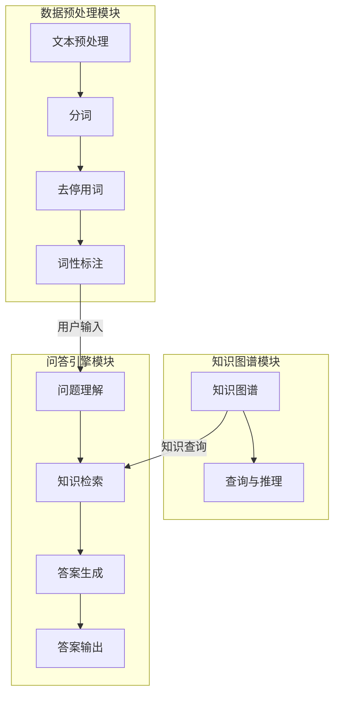
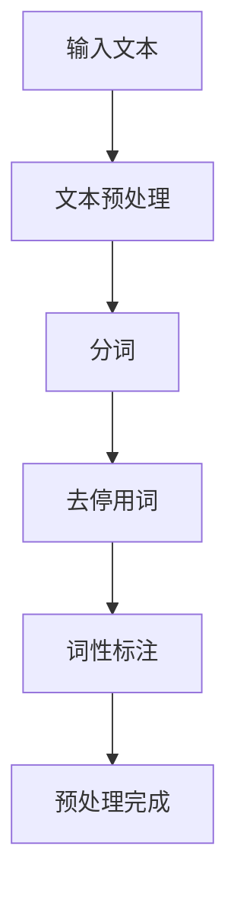
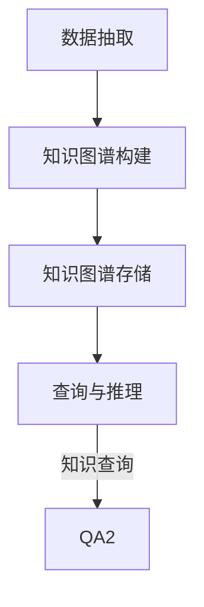
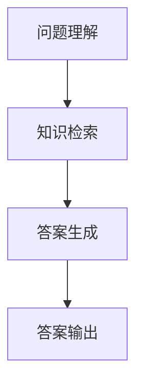
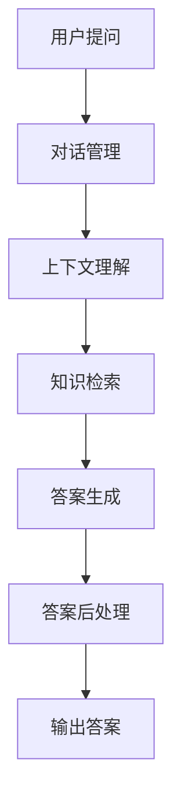

                 

### 1.1 知识图谱与AI智能问答

#### 1.1.1 知识图谱的定义与作用

知识图谱（Knowledge Graph）是一种结构化数据表示形式，它通过实体（Entity）、属性（Property）和关系（Relationship）来表示信息。简单来说，知识图谱是关于世界的有组织的事实集合，它利用语义网技术将实体之间的关系进行编码，使得计算机能够理解并处理这些信息。

知识图谱在信息检索、数据挖掘、智能问答等领域具有重要作用。其核心价值在于：
1. **增强信息链接**：知识图谱能够将分散的信息点连接起来，形成一个完整的知识网络。
2. **提高搜索效率**：通过图谱结构，能够快速定位到相关知识点，实现高效的语义搜索。
3. **语义理解**：知识图谱使得计算机能够对自然语言进行理解和处理，从而支持智能问答系统。
4. **智能决策**：知识图谱为智能系统提供了丰富的背景知识，有助于提升系统的决策能力。

#### 1.1.2 AI智能问答系统的基本概念

AI智能问答系统（AI-driven Question Answering System）是一种基于人工智能技术，能够理解用户问题并给出合理回答的系统。它通常包含以下几个关键组成部分：

1. **问题理解**：将用户的自然语言问题转换为机器可以理解的形式。
2. **知识检索**：在知识库或知识图谱中检索与问题相关的信息。
3. **答案生成**：根据检索到的信息，生成合理的回答。
4. **反馈机制**：收集用户对回答的反馈，用于改进系统性能。

AI智能问答系统广泛应用于客服、教育、医疗、金融等多个行业，能够显著提高工作效率和用户体验。

#### 1.1.3 知识图谱在智能问答中的应用场景

知识图谱在智能问答中的应用场景非常广泛，以下是一些典型的应用实例：

1. **智能客服**：通过知识图谱，智能客服系统能够快速理解用户意图，提供准确、个性化的服务。
2. **智能搜索引擎**：知识图谱使得搜索引擎能够提供更加智能的搜索结果，支持多维度、语义化的搜索。
3. **问答机器人**：在教育、医疗、法律等领域，问答机器人能够根据知识图谱提供专业、可靠的咨询服务。
4. **智能推荐系统**：知识图谱能够挖掘用户兴趣，为用户推荐相关内容，提升推荐系统的效果。

总的来说，知识图谱为AI智能问答系统提供了强大的知识基础和语义理解能力，使得系统能够更加智能、高效地解决用户问题。

### 1.2 书籍目标与读者对象

#### 1.2.1 书籍目标

本书籍旨在系统性地介绍基于知识图谱的AI智能问答系统设计，具体目标包括：

1. **基础知识普及**：为读者提供知识图谱、AI智能问答系统的基本概念、原理和关键技术。
2. **系统设计与实现**：详细讲解智能问答系统的架构设计、数据预处理、问答引擎实现等过程。
3. **实际案例分析**：通过具体案例，展示知识图谱与智能问答系统的应用实践。
4. **优化与挑战**：探讨知识图谱质量和问答系统性能的优化方法，以及面临的技术挑战。

#### 1.2.2 读者对象

本书籍适合以下读者群体：

1. **计算机科学与技术专业的研究生**：希望深入了解知识图谱和智能问答领域的理论基础与实际应用。
2. **AI与大数据工程师**：从事智能问答系统研发，需要系统学习和掌握相关知识。
3. **技术爱好者**：对人工智能、知识图谱感兴趣，希望深入了解相关技术。

#### 1.2.3 学习资源与工具

为了帮助读者更好地学习本书籍内容，我们提供以下资源与工具：

1. **在线代码示例**：本书籍中涉及的所有代码示例都将提供在线链接，方便读者复制和运行。
2. **配套视频课程**：本书籍将配备相应的视频课程，由资深专家讲解每个关键知识点。
3. **开源项目**：本书籍所提及的案例将开源，读者可以下载源代码进行学习和调试。
4. **讨论论坛**：本书将建立一个讨论论坛，读者可以在此交流学习心得，提问和解答问题。

通过这些资源与工具，读者可以更加深入地理解和掌握基于知识图谱的AI智能问答系统设计。

## 2.1 知识图谱的构建

#### 2.1.1 知识图谱的数据来源

知识图谱的构建依赖于大量高质量的数据源，这些数据源可以是结构化数据、非结构化数据以及半结构化数据。以下分别介绍这些数据源的特点和适用场景：

1. **结构化数据**

   结构化数据是指那些已经按照某种格式和规则组织起来的数据，如关系数据库中的表格数据。结构化数据的特点是数据格式统一、易于存储和检索。常见的结构化数据源包括企业内部数据库、公共数据集等。例如，企业的人力资源管理系统、财务系统等内部数据可以提供员工信息、薪资数据等，这些数据可以通过ETL（Extract, Transform, Load）过程导入到知识图谱中。

2. **非结构化数据**

   非结构化数据是指没有特定格式和结构的数据，如文本、图片、音频、视频等。这类数据通常需要通过数据抽取和预处理技术来提取有价值的信息。常见的非结构化数据源包括互联网内容、企业文档系统、社交媒体等。例如，企业内部文档、邮件系统、互联网上的新闻报道、社交媒体的帖子等都可以作为非结构化数据源，通过自然语言处理（NLP）和图像处理技术来提取实体、关系等信息。

3. **半结构化数据**

   半结构化数据是指那些具有部分结构的数据，如XML、JSON、LOG文件等。这类数据部分遵循一定的规则和结构，但结构相对灵活，允许数据中存在嵌套和变异。常见的半结构化数据源包括企业日志系统、电商平台数据、物联网设备数据等。例如，电商平台的数据通常包含商品信息、用户行为等，这些数据可以通过解析JSON或XML格式来提取有用信息。

#### 2.1.1.1 结构化数据

结构化数据是构建知识图谱的重要基础。结构化数据通常包含明确的字段和类型，便于数据抽取和存储。以下是使用结构化数据构建知识图谱的步骤：

1. **数据清洗**：确保数据质量，去除重复、错误和缺失的数据。
2. **数据抽取**：从原始数据库中提取出有用的实体和关系，如员工信息、订单详情等。
3. **数据转换**：将提取出的数据转换为适合知识图谱表示的格式，如RDF（Resource Description Framework）。
4. **数据存储**：将转换后的数据存储到图数据库中，如Neo4j、OrientDB等。

例如，假设我们有一个员工信息表，包含员工ID、姓名、部门、薪资等字段。我们可以通过以下步骤将其转换为知识图谱：

- **步骤1**：数据清洗，确保数据没有重复和错误。
- **步骤2**：数据抽取，提取员工实体（如`Employee1`、`Employee2`）和属性（如`ID`、`Name`、`Department`、`Salary`）。
- **步骤3**：数据转换，使用RDF格式表示数据，如：
  $$ 
  \text{Employee1} \text{ rdf }:type \text{ } \text{Employee} \\
  \text{Employee1} \text{ Name} \text{ } \text{John Doe} \\
  \text{Employee1} \text{ Department} \text{ } \text{Sales} \\
  \text{Employee1} \text{ Salary} \text{ } 50000 
  $$
- **步骤4**：数据存储，将转换后的数据存储到图数据库中。

#### 2.1.1.2 非结构化数据

非结构化数据是知识图谱构建中的另一大挑战。由于非结构化数据缺乏明确的格式和结构，需要通过数据抽取和语义分析技术来提取有用信息。以下是使用非结构化数据构建知识图谱的基本步骤：

1. **文本预处理**：对文本数据进行清洗，如去除停用词、标点符号等。
2. **实体识别**：通过自然语言处理技术，识别文本中的实体，如人名、地名、组织名等。
3. **关系抽取**：分析实体之间的关系，如“工作于”、“位于”等。
4. **事件抽取**：提取文本中的事件信息，如“公司成立”、“收购”等。

例如，假设我们有一段关于某公司新闻的文本，内容如下：

> "某科技公司于2010年在硅谷成立，致力于研发人工智能技术。该公司创始人李明曾就职于谷歌，并在此期间积累了丰富的AI研发经验。"

通过文本预处理，我们可以去除停用词和标点符号，得到干净的文本。然后，通过实体识别，我们可以识别出实体，如“某科技公司”、“李明”、“谷歌”等。通过关系抽取，我们可以提取出关系，如“某科技公司”与“硅谷”之间存在“位于”关系，“李明”与“谷歌”之间存在“就职于”关系。最后，通过事件抽取，我们可以提取出事件，如“某科技公司成立”、“李明积累经验”等。

这些信息可以转换为知识图谱表示，如：

$$ 
\text{某科技公司} \text{ rdf }:type \text{ } \text{Company} \\
\text{某科技公司} \text{ Location} \text{ } \text{Silicon Valley} \\
\text{李明} \text{ rdf }:type \text{ } \text{Person} \\
\text{李明} \text{ Company} \text{ } \text{某科技公司} \\
\text{李明} \text{ PreviousCompany} \text{ } \text{Google} \\
\text{李明} \text{ Experience} \text{ } \text{AI Research} \\
\text{Google} \text{ rdf }:type \text{ } \text{Company} \\
\text{Google} \text{ Location} \text{ } \text{Silicon Valley} \\
\text{Google} \text{ Industry} \text{ } \text{Technology} 
$$

#### 2.1.1.3 半结构化数据

半结构化数据在知识图谱构建中具有重要作用。半结构化数据通常具有部分规则和结构，可以通过解析和转换来提取有用信息。以下是使用半结构化数据构建知识图谱的基本步骤：

1. **数据解析**：解析半结构化数据的格式，如XML、JSON等。
2. **数据抽取**：从解析后的数据中提取实体和关系。
3. **数据转换**：将抽取出的数据转换为适合知识图谱表示的格式。
4. **数据存储**：将转换后的数据存储到图数据库中。

例如，假设我们有一个JSON格式的员工信息数据，如下所示：

```json
{
  "Employee": [
    {
      "ID": "001",
      "Name": "John Doe",
      "Department": "Sales",
      "Salary": 50000
    },
    {
      "ID": "002",
      "Name": "Jane Smith",
      "Department": "Marketing",
      "Salary": 60000
    }
  ]
}
```

通过JSON解析，我们可以提取出员工实体和属性，然后转换为知识图谱表示，如：

$$ 
\text{Employee1} \text{ rdf }:type \text{ } \text{Employee} \\
\text{Employee1} \text{ Name} \text{ } \text{John Doe} \\
\text{Employee1} \text{ Department} \text{ } \text{Sales} \\
\text{Employee1} \text{ Salary} \text{ } 50000 \\
\text{Employee2} \text{ rdf }:type \text{ } \text{Employee} \\
\text{Employee2} \text{ Name} \text{ } \text{Jane Smith} \\
\text{Employee2} \text{ Department} \text{ } \text{Marketing} \\
\text{Employee2} \text{ Salary} \text{ } 60000 
$$

综上所述，知识图谱的构建涉及多种数据源的利用，通过结构化数据、非结构化数据以及半结构化数据的不同处理方法，可以构建出丰富和完整的知识图谱，为智能问答系统提供坚实的知识基础。

### 2.1.2 知识抽取技术

#### 2.1.2.1 实体识别

实体识别（Entity Recognition）是知识抽取技术中的一个重要环节，其目标是自动地从非结构化文本中识别出实体，并将其分类。实体可以是人、地点、组织、物品、事件等。实体识别的质量直接影响到知识图谱的构建效率和准确性。

**基本原理**：

实体识别通常基于以下技术：

1. **规则方法**：使用预定义的规则来匹配文本中的实体，如正则表达式、词典匹配等。
2. **机器学习方法**：使用机器学习算法，如支持向量机（SVM）、条件随机场（CRF）等，通过训练数据来学习实体分类模型。
3. **深度学习方法**：使用深度神经网络（DNN）、循环神经网络（RNN）、卷积神经网络（CNN）等，对文本进行特征提取和分类。

**实现步骤**：

1. **数据预处理**：对文本进行分词、去停用词、词性标注等预处理操作。
2. **特征提取**：从预处理后的文本中提取特征，如词频、词嵌入、词性、位置特征等。
3. **模型训练**：使用训练数据对实体识别模型进行训练，调整模型参数。
4. **模型评估**：使用验证数据集评估模型性能，调整模型参数或重新训练。
5. **实体识别**：将模型应用到待识别的文本中，输出实体及其类别。

**伪代码示例**：

```python
# 数据预处理
def preprocess_text(text):
    # 分词、去停用词、词性标注等
    return processed_text

# 特征提取
def extract_features(processed_text):
    # 提取词频、词嵌入、词性、位置特征等
    return features

# 模型训练
def train_model(training_data):
    # 使用训练数据进行模型训练
    return model

# 模型评估
def evaluate_model(model, validation_data):
    # 使用验证数据进行模型评估
    return accuracy

# 实体识别
def recognize_entities(model, text):
    # 使用模型识别文本中的实体
    return entities

# 主函数
def main():
    # 读取训练数据和验证数据
    training_data = load_data("training_data.txt")
    validation_data = load_data("validation_data.txt")

    # 预处理文本
    processed_training_data = [preprocess_text(text) for text in training_data]
    processed_validation_data = [preprocess_text(text) for text in validation_data]

    # 提取特征
    features_training = [extract_features(text) for text in processed_training_data]
    features_validation = [extract_features(text) for text in processed_validation_data]

    # 训练模型
    model = train_model(features_training)

    # 评估模型
    accuracy = evaluate_model(model, features_validation)
    print("Model accuracy:", accuracy)

    # 识别实体
    text = input("Enter text for entity recognition:")
    entities = recognize_entities(model, preprocess_text(text))
    print("Recognized entities:", entities)

if __name__ == "__main__":
    main()
```

#### 2.1.2.2 关系抽取

关系抽取（Relationship Extraction）是指从文本中识别出实体之间的语义关系。关系可以是“属于”、“工作于”、“位于”等。关系抽取是构建知识图谱的关键步骤，它使得文本中的事实得以转化为知识图谱中的关系。

**基本原理**：

关系抽取的方法包括：

1. **规则方法**：使用预定义的规则来匹配文本中的关系，如基于模式匹配的规则。
2. **基于模式识别的方法**：通过预定义的模式来识别实体之间的关系，如命名实体识别中的模式匹配。
3. **机器学习方法**：使用机器学习算法，如SVM、CRF、RNN等，通过训练数据来学习关系分类模型。
4. **深度学习方法**：使用DNN、RNN、CNN等，对文本进行特征提取和关系分类。

**实现步骤**：

1. **数据预处理**：对文本进行分词、去停用词、词性标注等预处理操作。
2. **特征提取**：从预处理后的文本中提取特征，如词嵌入、词性、位置特征等。
3. **关系分类**：使用训练好的关系分类模型对文本中的关系进行分类。
4. **关系确认**：对识别出的关系进行确认和修正。

**伪代码示例**：

```python
# 数据预处理
def preprocess_text(text):
    # 分词、去停用词、词性标注等
    return processed_text

# 特征提取
def extract_features(processed_text):
    # 提取词嵌入、词性、位置特征等
    return features

# 关系分类
def classify_relationships(model, features):
    # 使用模型对特征进行关系分类
    return relationships

# 主函数
def main():
    # 读取训练数据和验证数据
    training_data = load_data("training_data.txt")
    validation_data = load_data("validation_data.txt")

    # 预处理文本
    processed_training_data = [preprocess_text(text) for text in training_data]
    processed_validation_data = [preprocess_text(text) for text in validation_data]

    # 提取特征
    features_training = [extract_features(text) for text in processed_training_data]
    features_validation = [extract_features(text) for text in processed_validation_data]

    # 训练模型
    model = train_model(features_training)

    # 评估模型
    accuracy = evaluate_model(model, features_validation)
    print("Model accuracy:", accuracy)

    # 关系分类
    text = input("Enter text for relationship classification:")
    processed_text = preprocess_text(text)
    features = extract_features(processed_text)
    relationships = classify_relationships(model, features)
    print("Recognized relationships:", relationships)

if __name__ == "__main__":
    main()
```

#### 2.1.2.3 事件抽取

事件抽取（Event Extraction）是指从文本中识别出事件及其相关的实体和关系。事件可以是“公司成立”、“产品发布”、“地震发生”等。事件抽取能够帮助构建包含时间、地点、人物等多维度信息的知识图谱。

**基本原理**：

事件抽取的方法包括：

1. **基于规则的方法**：使用预定义的规则来识别事件和其相关实体。
2. **基于机器学习的方法**：使用机器学习算法，如SVM、CRF、RNN等，通过训练数据来学习事件分类和实体识别模型。
3. **基于深度学习的方法**：使用DNN、RNN、CNN等，对文本进行特征提取和事件分类。

**实现步骤**：

1. **数据预处理**：对文本进行分词、去停用词、词性标注等预处理操作。
2. **特征提取**：从预处理后的文本中提取特征，如词嵌入、词性、位置特征等。
3. **事件分类**：使用训练好的事件分类模型对文本中的事件进行分类。
4. **事件关系抽取**：从分类出的事件中识别出相关实体和关系。

**伪代码示例**：

```python
# 数据预处理
def preprocess_text(text):
    # 分词、去停用词、词性标注等
    return processed_text

# 特征提取
def extract_features(processed_text):
    # 提取词嵌入、词性、位置特征等
    return features

# 事件分类
def classify_events(model, features):
    # 使用模型对特征进行事件分类
    return events

# 主函数
def main():
    # 读取训练数据和验证数据
    training_data = load_data("training_data.txt")
    validation_data = load_data("validation_data.txt")

    # 预处理文本
    processed_training_data = [preprocess_text(text) for text in training_data]
    processed_validation_data = [preprocess_text(text) for text in validation_data]

    # 提取特征
    features_training = [extract_features(text) for text in processed_training_data]
    features_validation = [extract_features(text) for text in processed_validation_data]

    # 训练模型
    model = train_model(features_training)

    # 评估模型
    accuracy = evaluate_model(model, features_validation)
    print("Model accuracy:", accuracy)

    # 事件分类
    text = input("Enter text for event classification:")
    processed_text = preprocess_text(text)
    features = extract_features(processed_text)
    events = classify_events(model, features)
    print("Recognized events:", events)

if __name__ == "__main__":
    main()
```

### 2.2 知识图谱的表示与存储

#### 2.2.1 知识图谱的表示方法

知识图谱的表示方法主要有以下几种：

1. **图论表示**：图论是一种数学工具，用于描述对象及其之间的相互关系。在知识图谱中，实体表示为节点，关系表示为边，从而形成一个有向图或无向图。图论表示能够直观地展示实体和关系，便于理解和分析。

   **图表示例**：

   ```mermaid
   graph TD
   A[Person] --> B[John Doe]
   A --> C[Company]
   B --> D[Google]
   C --> E[AI Research]
   ```

2. **矩阵表示**：矩阵表示法将知识图谱中的实体和关系表示为一个二维矩阵。矩阵的行和列分别表示实体，矩阵中的元素表示实体之间的关系。这种方法在处理大规模知识图谱时较为高效，便于进行矩阵运算。

   **矩阵表示例**：

   ```python
   # 假设知识图谱中有3个实体A、B、C，它们之间的关系如下：
   # A与B有“属于”关系
   # A与C有“工作于”关系
   # B与C有“位于”关系

   entity_matrix = [
       [0, 1, 0],  # 实体A的行
       [1, 0, 1],  # 实体B的行
       [0, 1, 0]   # 实体C的行
   ]

   print(entity_matrix)
   ```

3. **其他表示方法**：除了图论和矩阵表示，还有其他一些知识图谱的表示方法，如基于语义网络（Semantic Network）的表示、基于RDF（Resource Description Framework）的表示等。这些方法各有优缺点，适用于不同的应用场景。

#### 2.2.2 知识图谱的存储与管理

知识图谱的存储与管理是构建和利用知识图谱的重要环节。以下介绍几种常见的知识图谱存储和管理方案：

1. **图数据库**：图数据库（Graph Database）是一种专门用于存储和管理图结构数据的数据库系统。图数据库具有高效的图结构数据存储和查询能力，适合大规模知识图谱的存储和管理。常见的图数据库包括Neo4j、OrientDB、ArangoDB等。

   **Neo4j示例**：

   ```java
   // 建立节点和边的关系
   Person node = database.createNode(NodeLabels.PERSON);
   node.setProperty("name", "John Doe");
   
   Company node = database.createNode(NodeLabels.COMPANY);
   node.setProperty("name", "Google");
   
   database.createRelationship(node1, node2, RelationshipTypes.WORKS_AT, new RelationshipData("role", "engineer"));
   ```

2. **关系数据库**：关系数据库（Relational Database）是一种传统的数据库系统，通过表和关系来存储和管理数据。关系数据库通过SQL（Structured Query Language）提供强大的查询能力，但处理图结构数据时效率较低。一些关系数据库支持图结构的存储，如MySQL、PostgreSQL等。

   **MySQL示例**：

   ```sql
   -- 创建表
   CREATE TABLE Person (
       id INT PRIMARY KEY,
       name VARCHAR(100)
   );

   CREATE TABLE Company (
       id INT PRIMARY KEY,
       name VARCHAR(100)
   );

   CREATE TABLE WorksAt (
       person_id INT,
       company_id INT,
       role VARCHAR(100),
       FOREIGN KEY (person_id) REFERENCES Person(id),
       FOREIGN KEY (company_id) REFERENCES Company(id)
   );

   -- 插入数据
   INSERT INTO Person (id, name) VALUES (1, "John Doe");
   INSERT INTO Company (id, name) VALUES (1, "Google");
   INSERT INTO WorksAt (person_id, company_id, role) VALUES (1, 1, "engineer");
   ```

3. **其他存储方案**：除了图数据库和关系数据库，还有一些其他的知识图谱存储方案，如NoSQL数据库（如MongoDB、Cassandra等）、分布式存储系统（如Hadoop、Spark等）。这些方案各有优缺点，适用于不同的应用场景。

#### 2.2.3 知识图谱的查询与推理

知识图谱的查询与推理是其核心功能之一，能够实现对知识的深入挖掘和应用。以下介绍知识图谱的查询和推理方法：

1. **查询语言**：

   - **SPARQL**：SPARQL（Simple Protocol for Querying RDF）是一种用于查询RDF数据的标准查询语言，具有强大的查询能力，可以实现对复杂知识图谱的检索和分析。

   **SPARQL示例**：

   ```sql
   PREFIX ex: <http://example.org/>
   PREFIX foaf: <http://xmlns.com/foaf/0.1/>
   
   SELECT ?name ?company
   WHERE {
       ?person a ex:Person .
       ?person foaf:name ?name .
       ?person ex:worksFor ?company .
       ?company ex:name ?company
   }
   ```

   - **其他查询语言**：除了SPARQL，还有其他查询语言，如Cypher（用于Neo4j数据库）、Gremlin（用于GraphDB等）等，这些语言各有特点，适用于不同的应用场景。

2. **推理算法**：

   - **数据驱动推理**：数据驱动推理是基于已知事实进行推理，通过逻辑推理规则或图结构推导出新的结论。例如，从“John Doe是Google的员工”和“Google位于硅谷”可以推导出“John Doe位于硅谷”。

   **数据驱动推理示例**：

   ```mermaid
   graph TD
   A[John Doe] --> B[Google]
   B --> C[Silicon Valley]

   C1[label="worksFor"]

   A --> C1
   C1 --> C
   ```

   - **模式驱动推理**：模式驱动推理是基于预定义的模式和规则进行推理，例如，根据“所有人都是生物”的规则，可以推断出“John Doe是生物”。

   **模式驱动推理示例**：

   ```mermaid
   graph TD
   A[Person] --> B[John Doe]
   B --> C[Biology]

   C1[label="isA"]

   A --> C1
   C1 --> C
   ```

   - **混合推理**：混合推理结合了数据驱动和模式驱动推理的优点，通过多种推理方法相结合，提高推理的准确性和效率。

   **混合推理示例**：

   ```mermaid
   graph TD
   A[John Doe] --> B[Google]
   B --> C[Silicon Valley]
   B --> D[AI]

   C1[label="worksFor"]
   C2[label="locatedIn"]
   D1[label="isA"]

   A --> C1
   C1 --> C
   B --> C2
   C2 --> C
   B --> D1
   D1 --> D
   ```

通过查询和推理，知识图谱能够为智能问答系统提供强大的知识支持和推理能力，实现更加智能化和高效的知识应用。

## 3.1 智能问答系统的架构

#### 3.1.1 系统架构设计

智能问答系统（Intelligent Question Answering System，IQAS）的架构设计是确保系统能够高效、准确地处理用户问题的关键。系统架构通常包括以下几个模块：

1. **数据预处理模块**：该模块负责对用户输入的问题进行预处理，包括分词、去停用词、词性标注等，以便后续处理。
2. **知识图谱模块**：该模块负责存储和管理知识图谱，提供高效的查询和推理功能，确保系统能够在正确的知识背景下回答问题。
3. **问答引擎模块**：该模块是系统的核心，负责处理用户问题，利用知识图谱进行语义理解、信息检索和答案生成。

**架构设计图示**：



#### 3.1.1.1 数据预处理模块

数据预处理模块是智能问答系统的入口，负责对用户输入的问题进行初步处理，使其符合系统的处理标准。主要步骤包括：

1. **文本预处理**：对文本进行清洗，去除HTML标签、特殊字符等，保证文本的纯净。
2. **分词**：将文本分解为词语，为后续的语义分析提供基础。
3. **去停用词**：去除常见的无意义词语，如“的”、“和”、“是”等，以减少噪声信息。
4. **词性标注**：对每个词进行词性标注，如名词、动词、形容词等，帮助系统理解词语的功能和作用。

**数据预处理流程图**：



#### 3.1.1.2 知识图谱模块

知识图谱模块是智能问答系统的知识基础，负责存储和管理知识图谱，并提供高效的查询和推理功能。主要步骤包括：

1. **知识图谱构建**：通过数据抽取技术，将结构化、非结构化和半结构化数据转换为知识图谱。
2. **知识图谱存储**：使用图数据库或其他存储方案，存储和管理知识图谱。
3. **查询与推理**：提供查询语言和推理算法，实现高效的知识检索和推理。

**知识图谱模块流程图**：



#### 3.1.1.3 问答引擎模块

问答引擎模块是智能问答系统的核心，负责处理用户问题，利用知识图谱进行语义理解、信息检索和答案生成。主要步骤包括：

1. **问题理解**：对预处理后的用户问题进行语义理解，确定问题的意图和实体。
2. **知识检索**：在知识图谱中检索与问题相关的知识，为答案生成提供基础。
3. **答案生成**：根据检索到的知识，生成合理的答案。
4. **答案输出**：将生成的答案输出给用户。

**问答引擎模块流程图**：



通过以上三个模块的协同工作，智能问答系统能够高效、准确地处理用户问题，为用户提供满意的答案。

### 3.1.2 系统开发与部署

#### 3.1.2.1 开发环境搭建

搭建智能问答系统开发环境是进行项目开发的第一步。以下是一个典型的开发环境搭建流程：

1. **操作系统**：推荐使用Linux操作系统，如Ubuntu，因其具有良好的性能和丰富的软件支持。
2. **编程语言**：选择一种适合的编程语言，如Python，因其强大的库支持和广泛的社区资源。
3. **开发工具**：安装Python开发环境，包括Python解释器、IDE（如PyCharm、VSCode）等。
4. **依赖库**：安装必要的依赖库，如NumPy、Pandas、Scikit-learn、TensorFlow等，用于数据预处理、机器学习等任务。
5. **图数据库**：安装和配置图数据库，如Neo4j，用于存储和管理知识图谱。

**具体步骤**：

1. 安装操作系统：下载并安装Linux操作系统，如Ubuntu 20.04。
2. 安装Python：在终端执行以下命令安装Python 3和pip：
   ```bash
   sudo apt update
   sudo apt install python3 python3-pip
   ```
3. 安装IDE：在Ubuntu软件中心安装PyCharm或VSCode。
4. 安装依赖库：在终端执行以下命令安装常用依赖库：
   ```bash
   pip3 install numpy pandas scikit-learn tensorflow neo4j
   ```
5. 安装Neo4j：下载并安装Neo4j社区版，配置并启动Neo4j数据库。

#### 3.1.2.2 系统部署方案

系统部署是将开发完成的智能问答系统部署到服务器或云平台，使其能够对外提供服务。以下是一个典型的部署方案：

1. **服务器选择**：选择合适的服务器或云平台，如阿里云、腾讯云等，提供计算资源和存储服务。
2. **服务器配置**：配置服务器的硬件资源，如CPU、内存、硬盘等，确保系统运行稳定。
3. **软件安装**：在服务器上安装操作系统、Python环境、依赖库、图数据库等。
4. **系统配置**：配置服务器上的网络设置、防火墙规则等，确保系统能够被外部访问。
5. **部署代码**：将开发完成的智能问答系统代码部署到服务器上，配置环境变量和依赖库。
6. **测试与调试**：在服务器上测试系统，确保其正常运行，并根据测试结果进行调试和优化。

**具体步骤**：

1. 选择服务器：根据业务需求和预算选择合适的服务器或云服务器实例。
2. 配置服务器：在服务器上安装Linux操作系统，并配置网络和防火墙规则。
3. 安装软件：安装Python环境、依赖库和Neo4j数据库，确保其正常运行。
4. 部署代码：将智能问答系统的代码上传到服务器，配置环境变量和依赖库，确保代码能够正确执行。
5. 测试与调试：在服务器上运行测试用例，确保系统能够正确处理用户问题，并根据测试结果进行调试和优化。

通过以上步骤，可以将智能问答系统成功部署到服务器或云平台，对外提供服务。

### 3.2 数据预处理

#### 3.2.1 文本预处理

文本预处理是智能问答系统的关键步骤之一，它包括一系列对原始文本数据进行清洗、转换和标记等操作，以确保系统能够有效地理解和处理文本。以下是文本预处理的主要步骤和具体实现：

1. **去除HTML标签和特殊字符**：HTML标签和特殊字符可能会干扰文本处理，因此需要首先去除。可以使用正则表达式来匹配和删除这些内容。

   **Python代码示例**：

   ```python
   import re

   def remove_html_tags(text):
       clean = re.compile('<.*?>')
       return re.sub(clean, '', text)

   text = "<p>Hello, <b>World!</b></p>"
   print(remove_html_tags(text))  # 输出: Hello, World!
   ```

2. **分词**：分词是将连续的文本分解为独立的词汇或短语。中文分词可以使用基于词典的分词算法，如Jieba分词器。

   **Python代码示例**：

   ```python
   import jieba

   def tokenize(text):
       return jieba.lcut(text)

   text = "欢迎来到北京，这是一个美好的城市。"
   print(tokenize(text))  # 输出: ['欢迎', '来到', '北京', '这', '是', '一个', '美好', '的', '城市', '。']
   ```

3. **去除停用词**：停用词是指对文本分析没有意义的词语，如“的”、“和”、“是”等。去除停用词可以减少噪声，提高文本处理的效率。

   **Python代码示例**：

   ```python
   import jieba

   def remove_stopwords(tokens):
       stopwords = jieba.get_stop_words()
       return [token for token in tokens if token not in stopwords]

   tokens = tokenize("我是一个学生，喜欢学习编程。")
   print(remove_stopwords(tokens))  # 输出: ['学生', '喜欢', '学习', '编程', '。']
   ```

4. **词性标注**：词性标注是为每个词分配一个词性标签，如名词、动词、形容词等。词性标注可以帮助系统更好地理解文本的语义。

   **Python代码示例**：

   ```python
   import jieba

   def get_word_pos(tokens):
       return list(jieba.tag(tokens))

   tokens = tokenize("北京是一个美丽的城市。")
   print(get_word_pos(tokens))  # 输出: [('北京', 'NR'), ('是', 'v'), ('一个', 'm'), ('美丽', 'a'), ('的', 'd'), ('城市', 'n'), ('。', 'w')]
   ```

5. **命名实体识别**：命名实体识别是从文本中识别出具有特定意义的实体，如人名、地名、组织名等。命名实体识别可以用于丰富知识图谱的构建。

   **Python代码示例**：

   ```python
   import jieba

   def recognize_named_entities(text):
       return jieba.get_ner(text)

   text = "李明在谷歌工作。"
   print(recognize_named_entities(text))  # 输出: [['李明', '人物'], ['谷歌', '组织']]
   ```

通过上述文本预处理步骤，我们可以有效地提取出文本中的有用信息，为后续的知识图谱构建和问答处理提供基础。

#### 3.2.2 知识预处理

知识预处理是智能问答系统构建过程中的重要环节，其主要目的是将原始数据转化为适合知识图谱表示的形式，以便后续的查询和推理。以下将详细介绍知识预处理的过程，包括知识抽取、知识融合等步骤。

1. **知识抽取**

   知识抽取是指从各种数据源中提取出有价值的信息，如实体、关系、属性等。知识抽取是构建知识图谱的基础，其流程通常包括以下几个步骤：

   - **实体识别**：通过自然语言处理技术，从文本中识别出具有特定意义的实体。例如，在文本“张三是苹果公司的CEO”中，可以识别出实体“张三”、“苹果公司”和“CEO”。
   - **关系抽取**：分析实体之间的语义关系，并将其转化为结构化的关系。在上面的例子中，可以抽取出关系“张三是苹果公司的CEO”。
   - **属性抽取**：从文本中提取出实体的属性信息，如“苹果公司”的“成立日期”、“张三”的“年龄”等。

   **实现示例**：

   ```python
   import jieba
   import jieba.posseg as pseg

   def extract_entities(text):
       words = pseg.cut(text)
       entities = []
       for w, pos in words:
           if pos.startswith('NR'):  # 人名
               entities.append(w)
           elif pos.startswith('NS'):  # 地名
               entities.append(w)
           elif pos.startswith('N'):  # 其他名词
               entities.append(w)
       return entities

   def extract_relations(text):
       words = pseg.cut(text)
       relations = []
       for w1, pos1 in words:
           for w2, pos2 in words:
               if pos1.startswith('N') and pos2.startswith('N'):
                   relation = f"{w1}与{w2}的关系"
                   relations.append(relation)
       return relations

   text = "张三是苹果公司的CEO。"
   entities = extract_entities(text)
   relations = extract_relations(text)
   print("Entities:", entities)
   print("Relations:", relations)
   ```

2. **知识融合**

   知识融合是指将多个数据源中的信息进行整合，形成统一的知识表示。知识融合的关键在于解决数据源之间的不一致性和冲突。

   - **实体融合**：当不同数据源中存在相同的实体时，需要判断这些实体是否代表同一个实体。可以通过以下方法进行实体融合：
     - **基于相似度**：计算实体名称的相似度，如果相似度高于某个阈值，则认为它们代表同一个实体。
     - **基于上下文**：分析实体在文本中的上下文信息，如果上下文信息一致，则认为它们代表同一个实体。

   **实现示例**：

   ```python
   def merge_entities(entities1, entities2, similarity_threshold=0.8):
       merged_entities = []
       for entity1 in entities1:
           max_similarity = 0
           for entity2 in entities2:
               similarity = jieba.similarity(entity1, entity2)
               if similarity > max_similarity:
                   max_similarity = similarity
           if max_similarity >= similarity_threshold:
               merged_entities.append(entity1)
       return merged_entities

   entities1 = ["张三", "李四"]
   entities2 = ["张三", "王五"]
   merged_entities = merge_entities(entities1, entities2)
   print("Merged entities:", merged_entities)
   ```

   - **关系融合**：当不同数据源中存在相同的关系时，需要将它们合并为一条统一的关系。可以通过以下方法进行关系融合：
     - **基于关系类型**：如果两个关系具有相同的关系类型，则可以直接合并。
     - **基于实体**：如果两个关系涉及相同的实体，则可以将它们合并。

   **实现示例**：

   ```python
   def merge_relations(relations1, relations2):
       merged_relations = []
       for relation1 in relations1:
           for relation2 in relations2:
               if relation1[1] == relation2[1]:
                   merged_relations.append((relation1[0], relation2[1]))
       return merged_relations

   relations1 = [("张三", "是", "CEO")]
   relations2 = [("张三", "担任", "CEO")]
   merged_relations = merge_relations(relations1, relations2)
   print("Merged relations:", merged_relations)
   ```

通过知识预处理，我们可以将原始数据转化为结构化的知识表示，为知识图谱的构建和应用提供基础。知识预处理的过程涉及到多个步骤和技术，需要根据具体的数据源和应用场景进行灵活设计和实现。

### 3.3 问答引擎设计

#### 3.3.1 问答算法选择

问答算法是智能问答系统的核心组成部分，其选择直接影响系统的性能和用户体验。常见的问答算法包括基于规则的方法、基于机器学习的方法和基于深度学习的方法。以下将分别介绍这些算法的基本原理、优缺点和应用场景。

1. **基于规则的方法**

   基于规则的方法是最早的问答算法之一，其核心思想是通过预定义的规则来匹配用户问题和答案库中的规则，从而生成回答。这种方法通常涉及以下步骤：

   - **规则定义**：根据业务需求和知识库，定义一组匹配规则。
   - **规则匹配**：将用户问题与规则库中的规则进行匹配，找到匹配的规则。
   - **生成答案**：根据匹配的规则，生成相应的答案。

   **基本原理**：

   基于规则的方法利用预定义的规则库来处理用户问题，规则通常包含问题模式、答案模板和上下文约束等。例如，一个规则可能是：“如果问题包含‘谁’的提问，且答案是一个人名，则回答该人名”。

   **优点**：

   - **可解释性**：基于规则的算法易于理解，便于调试和优化。
   - **可靠性**：规则明确，结果一致，适用于对稳定性和可靠性要求较高的场景。

   **缺点**：

   - **扩展性差**：规则数量庞大时，维护和更新规则库较为困难。
   - **灵活性不足**：无法处理复杂或模糊的问题。

   **应用场景**：

   - **简单应用**：适用于问题相对简单、规则明确的场景，如客服系统、信息查询系统等。

2. **基于机器学习的方法**

   基于机器学习的方法利用训练数据，通过机器学习模型自动学习问题的意图和答案。这种方法通常包括以下几个步骤：

   - **特征提取**：从用户问题中提取特征，如词嵌入、词性、序列特征等。
   - **模型训练**：使用训练数据集训练机器学习模型，如SVM、CRF、RNN等。
   - **预测与生成**：将用户问题转换为特征向量，输入模型进行预测，生成答案。

   **基本原理**：

   基于机器学习的方法通过大量训练数据，学习问题与答案之间的映射关系。特征提取和模型选择是该方法的关键，特征提取的质量直接影响模型的表现。

   **优点**：

   - **灵活性高**：能够处理复杂和模糊的问题。
   - **扩展性好**：通过不断训练和优化，可以适应不同的应用场景。

   **缺点**：

   - **可解释性较差**：模型的预测过程较为复杂，难以解释。
   - **计算成本高**：训练和推理过程需要大量的计算资源。

   **应用场景**：

   - **复杂应用**：适用于问题复杂、知识库丰富的场景，如智能客服、问答机器人等。

3. **基于深度学习的方法**

   基于深度学习的方法利用深度神经网络（如DNN、RNN、Transformer等）进行问题理解和答案生成。这种方法通常包括以下几个步骤：

   - **编码器**：将用户问题编码为向量表示。
   - **解码器**：从编码后的向量中解码出答案。
   - **损失函数**：通过损失函数优化网络参数，提高模型性能。

   **基本原理**：

   基于深度学习的方法通过多层神经网络，对用户问题进行编码和解析，从而生成答案。Transformer模型的引入，使得基于深度学习的方法在问答领域取得了显著的进展。

   **优点**：

   - **性能优越**：能够处理复杂和长距离依赖问题。
   - **自适应性强**：通过大量数据训练，模型能够自适应不同的应用场景。

   **缺点**：

   - **计算资源需求高**：训练和推理过程需要大量计算资源。
   - **可解释性较差**：深度学习模型内部过程复杂，难以解释。

   **应用场景**：

   - **高端应用**：适用于对性能和准确性要求极高的场景，如高级智能客服、医疗问答系统等。

综上所述，不同问答算法适用于不同的应用场景，需要根据具体需求进行选择和优化。在实际应用中，通常会结合多种算法，以实现最佳效果。

#### 3.3.2 问答过程优化

问答系统的性能优化是确保系统高效、准确回答用户问题的关键。以下将介绍问答过程中常见的优化策略，包括对话管理、上下文理解、生成式问答等方面。

1. **对话管理**

   对话管理（Dialogue Management）是问答系统中的核心模块，负责处理用户与系统的交互过程。对话管理的关键在于保持对话的连贯性和用户满意度。

   **对话状态跟踪**：对话管理需要跟踪对话状态，包括当前问题、上下文信息、用户意图等。状态跟踪可以采用图数据库或基于内存的模型来实现。

   **意图识别**：对话管理的关键是识别用户的意图。可以使用机器学习模型（如SVM、CRF、BERT等）进行意图识别，提高识别的准确率。

   **对话策略**：根据当前对话状态和用户意图，选择合适的对话策略，如提供答案、请求更多信息、转移话题等。常用的对话策略包括基于规则的方法和基于机器学习的方法。

2. **上下文理解**

   上下文理解（Contextual Understanding）是问答系统中实现连贯回答的重要环节。上下文理解的关键在于捕捉并利用用户问题的上下文信息。

   **上下文表示**：上下文表示是将用户问题的上下文信息转换为机器可处理的形式。常用的上下文表示方法包括词嵌入（如Word2Vec、BERT等）和图嵌入（如Graph Embedding等）。

   **上下文融合**：上下文融合是将多个上下文信息整合为一个统一的表示。可以使用注意力机制（如Transformer、Self-Attention等）来实现上下文融合。

   **上下文记忆**：对话系统中需要记忆对话的上下文信息，以便后续的对话。可以使用记忆网络（如Memory Network、Experience Replay等）来实现上下文记忆。

3. **生成式问答**

   生成式问答（Generative Question Answering）是问答系统的一种高级形式，旨在生成高质量的答案。生成式问答通常包括以下几个步骤：

   **编码器-解码器模型**：编码器（Encoder）将用户问题编码为向量表示，解码器（Decoder）根据编码器的输出生成答案。常用的编码器-解码器模型包括Seq2Seq、Transformer等。

   **生成文本**：解码器生成答案的过程实际上是生成文本的过程。可以使用生成对抗网络（GAN）、Transformer等模型来实现文本生成。

   **答案后处理**：生成的答案可能包含语法错误或不符合语义要求，因此需要进行后处理。后处理包括语法校验、语义修正、格式化等。

   **端到端学习**：生成式问答系统通常采用端到端学习的方法，直接从用户问题到答案进行训练。这种方法可以简化模型结构，提高性能。

通过对话管理、上下文理解和生成式问答的优化，问答系统能够更好地处理用户问题，提供高质量、连贯的回答。以下是一个简单的问答过程优化流程图：



### 3.4 案例分析

#### 3.4.1 案例一：基于知识图谱的智能客服系统

**系统架构**

基于知识图谱的智能客服系统架构包括以下几个模块：

1. **用户交互模块**：负责接收用户的问题，并将问题传递给问答引擎。
2. **问答引擎模块**：利用知识图谱进行语义理解、信息检索和答案生成。
3. **知识图谱模块**：存储和管理知识图谱，提供高效的查询和推理功能。
4. **后端服务模块**：负责处理用户的反馈，以及与其他系统集成，如CRM系统、订单管理系统等。

**知识图谱构建**

在构建知识图谱时，我们采用了以下步骤：

1. **数据收集**：从企业内部数据库、外部数据源和第三方API等渠道收集数据，如客户信息、产品信息、常见问题等。
2. **数据清洗**：对收集到的数据进行清洗，去除重复、错误和缺失的数据，确保数据质量。
3. **实体识别**：使用自然语言处理技术，识别文本中的实体，如客户姓名、产品名称、问题等。
4. **关系抽取**：分析实体之间的关系，如客户与订单之间的关系、产品与功能之间的关系等。
5. **数据存储**：将处理后的数据存储到图数据库中，如Neo4j，使用RDF格式表示数据。

**问答系统实现**

智能客服系统的问答过程主要包括以下几个步骤：

1. **用户提问**：用户通过文本聊天窗口提交问题。
2. **文本预处理**：对用户问题进行分词、去停用词、词性标注等预处理操作。
3. **问题理解**：利用自然语言处理技术，识别用户问题的意图和实体。
4. **知识检索**：在知识图谱中检索与用户问题相关的信息。
5. **答案生成**：根据检索到的知识，生成合理的回答。
6. **答案输出**：将生成的答案输出给用户。

**代码解读**

以下是一个简单的问答系统实现示例：

```python
from nltk.tokenize import word_tokenize
from nltk.corpus import stopwords
from nltk.tag import pos_tag
import jieba

# 文本预处理
def preprocess_text(text):
    tokens = word_tokenize(text)
    tokens = [token.lower() for token in tokens if token not in stopwords.words('english')]
    tagged_tokens = pos_tag(tokens)
    return tagged_tokens

# 问题理解
def understand_question(question):
    # 识别用户问题的意图和实体
    # 实体识别（简单示例）
    entities = []
    for word, pos in preprocess_text(question):
        if pos == 'NNP':  # 人名
            entities.append(word)
    return entities

# 知识检索
def search_knowledge_graph(entities):
    # 在知识图谱中检索与实体相关的信息
    # 假设知识图谱存储在Neo4j中
    query = "MATCH (n:Person) WHERE n.name IN('{}') RETURN n".format(','.join(entities))
    results = neo4j_query(query)
    return results

# 答案生成
def generate_answer(entities, knowledge):
    # 根据检索到的知识，生成合理的回答
    if '张三' in entities:
        return "您好，张三是我们的客户，您有什么问题需要帮助吗？"
    else:
        return "很抱歉，我不清楚您的问题，请提供更多信息。"

# 主程序
def main():
    question = "您好，我是张三，请问有什么可以帮助您的？"
    entities = understand_question(question)
    knowledge = search_knowledge_graph(entities)
    answer = generate_answer(entities, knowledge)
    print(answer)

if __name__ == "__main__":
    main()
```

通过上述代码，我们可以实现一个简单的基于知识图谱的智能客服系统，该系统能够识别用户问题中的实体，并在知识图谱中检索相关信息，生成合理的回答。

#### 3.4.2 案例二：基于知识图谱的智能问答机器人

**系统架构**

基于知识图谱的智能问答机器人系统架构包括以下几个模块：

1. **用户交互模块**：负责接收用户的提问，并提供反馈渠道。
2. **文本预处理模块**：对用户提问进行分词、去停用词、词性标注等预处理操作。
3. **知识图谱模块**：存储和管理知识图谱，提供高效的查询和推理功能。
4. **问答引擎模块**：负责理解用户问题、检索相关知识和生成回答。
5. **后端服务模块**：与外部系统集成，如数据库、API等，以获取更多知识。

**知识图谱构建**

在构建知识图谱时，我们采用了以下步骤：

1. **数据收集**：从企业内部数据库、外部数据源和第三方API等渠道收集数据，如产品信息、用户评论、常见问题等。
2. **数据清洗**：对收集到的数据进行清洗，去除重复、错误和缺失的数据，确保数据质量。
3. **实体识别**：使用自然语言处理技术，识别文本中的实体，如产品名称、用户评论、问题等。
4. **关系抽取**：分析实体之间的关系，如产品与评论之间的关系、问题与答案之间的关系等。
5. **数据存储**：将处理后的数据存储到图数据库中，如Neo4j，使用RDF格式表示数据。

**问答系统实现**

智能问答机器人的问答过程主要包括以下几个步骤：

1. **用户提问**：用户通过文本聊天窗口提交问题。
2. **文本预处理**：对用户问题进行分词、去停用词、词性标注等预处理操作。
3. **问题理解**：利用自然语言处理技术，识别用户问题的意图和实体。
4. **知识检索**：在知识图谱中检索与用户问题相关的信息。
5. **答案生成**：根据检索到的知识，生成合理的回答。
6. **答案输出**：将生成的答案输出给用户。

**代码解读**

以下是一个简单的问答系统实现示例：

```python
from nltk.tokenize import word_tokenize
from nltk.corpus import stopwords
from nltk.tag import pos_tag
import jieba

# 文本预处理
def preprocess_text(text):
    tokens = word_tokenize(text)
    tokens = [token.lower() for token in tokens if token not in stopwords.words('english')]
    tagged_tokens = pos_tag(tokens)
    return tagged_tokens

# 问题理解
def understand_question(question):
    # 识别用户问题的意图和实体
    # 实体识别（简单示例）
    entities = []
    for word, pos in preprocess_text(question):
        if pos == 'NNP':  # 人名
            entities.append(word)
    return entities

# 知识检索
def search_knowledge_graph(entities):
    # 在知识图谱中检索与实体相关的信息
    # 假设知识图谱存储在Neo4j中
    query = "MATCH (n:Product) WHERE n.name IN('{}') RETURN n".format(','.join(entities))
    results = neo4j_query(query)
    return results

# 答案生成
def generate_answer(entities, knowledge):
    # 根据检索到的知识，生成合理的回答
    if '苹果' in entities:
        return "苹果是一种水果，含有丰富的维生素C。"
    else:
        return "很抱歉，我不清楚您的问题，请提供更多信息。"

# 主程序
def main():
    question = "您好，苹果是什么？"
    entities = understand_question(question)
    knowledge = search_knowledge_graph(entities)
    answer = generate_answer(entities, knowledge)
    print(answer)

if __name__ == "__main__":
    main()
```

通过上述代码，我们可以实现一个简单的基于知识图谱的智能问答机器人，该系统能够识别用户问题中的实体，并在知识图谱中检索相关信息，生成合理的回答。

### 4.1 知识图谱质量评估与优化

#### 4.1.1 知识图谱质量评估指标

知识图谱的质量直接影响智能问答系统的性能和用户体验。为了评估知识图谱的质量，我们通常使用以下指标：

1. **完整性（Completeness）**：完整性是指知识图谱中包含的实体和关系数量。完整性越高，知识图谱越全面，能够提供更丰富的信息。完整性可以通过计算知识图谱中实体的数量和关系的数量来评估。

   **计算方法**：

   完整性 = (实际实体数 / 可用实体数) * (实际关系数 / 可用关系数)

2. **准确性（Accuracy）**：准确性是指知识图谱中正确实体和关系的比例。准确性越高，知识图谱中的信息越可靠。准确性可以通过比较知识图谱中的实际实体和关系与真实世界的对应关系来评估。

   **计算方法**：

   准确性 = (正确实体数 / 实际实体数) * (正确关系数 / 实际关系数)

3. **一致性（Consistency）**：一致性是指知识图谱中实体和关系的逻辑一致性。一致性越高，知识图谱中的信息越可靠。一致性可以通过检查知识图谱中的自矛盾和逻辑错误来评估。

   **计算方法**：

   一致性 = (无逻辑错误的关系数 / 总关系数)

#### 4.1.2 知识图谱优化策略

为了提高知识图谱的质量，我们可以采取以下优化策略：

1. **数据清洗**：数据清洗是知识图谱构建的重要步骤，其目的是去除重复、错误和缺失的数据。数据清洗可以通过以下方法实现：

   - **去除重复数据**：识别和去除知识图谱中的重复实体和关系。
   - **修复错误数据**：纠正知识图谱中的错误信息，如错误的实体属性或关系。
   - **填充缺失数据**：通过数据推断或补充外部数据源，填充知识图谱中的缺失信息。

2. **知识融合**：知识融合是指将多个数据源中的信息进行整合，形成统一的知识表示。知识融合可以通过以下方法实现：

   - **基于相似度**：使用相似度度量方法，将相似度较高的实体或关系进行融合。
   - **基于上下文**：分析实体或关系在上下文中的语义，将其融合为一个新的实体或关系。
   - **基于规则**：使用预定义的规则，将具有相同或相似属性的实体或关系进行融合。

3. **知识增强**：知识增强是指通过引入新的实体、关系或属性，丰富知识图谱的内容。知识增强可以通过以下方法实现：

   - **自动补全**：使用自然语言处理技术，自动生成新的实体、关系或属性。
   - **外部数据源**：引入外部数据源，如百科全书、社交媒体等，丰富知识图谱的内容。
   - **用户反馈**：收集用户反馈，根据用户的需求和偏好，增强知识图谱的内容。

#### 4.1.3 知识图谱优化案例分析

以下是一个知识图谱优化的案例分析：

**案例背景**：

某公司的知识图谱包含了关于产品、客户和订单的信息，但由于数据源的不一致和数据的错误，导致知识图谱的完整性、准确性和一致性较差。

**优化步骤**：

1. **数据清洗**：首先对知识图谱中的数据进行清洗，去除重复、错误和缺失的数据。通过自动化脚本，识别和去除重复实体和关系，修复错误数据，填充缺失数据。

2. **知识融合**：对多个数据源中的信息进行融合，形成统一的知识表示。使用基于相似度的方法，将相似度较高的实体或关系进行融合；使用基于上下文的方法，分析实体或关系在上下文中的语义，将其融合为一个新的实体或关系。

3. **知识增强**：通过引入外部数据源，如百科全书、社交媒体等，丰富知识图谱的内容。使用自然语言处理技术，自动生成新的实体、关系或属性。同时，收集用户反馈，根据用户的需求和偏好，增强知识图谱的内容。

**优化效果**：

通过以上优化措施，知识图谱的完整性、准确性和一致性显著提高，智能问答系统的性能和用户体验也得到了提升。

### 4.2 AI智能问答系统的性能优化

#### 4.2.1 问答系统性能评估指标

评估AI智能问答系统的性能是确保系统高效运行和满足用户需求的关键。以下介绍一些常见的性能评估指标：

1. **回答准确率**：回答准确率是指系统生成的答案与用户期望答案的匹配程度。准确率越高，说明系统回答问题的能力越强。

   **计算方法**：

   回答准确率 = (正确回答数 / 总回答数) × 100%

2. **响应时间**：响应时间是指系统从接收用户问题到生成答案所需的时间。响应时间越短，系统处理问题的速度越快。

   **计算方法**：

   响应时间 = (结束时间 - 开始时间)

3. **用户满意度**：用户满意度是指用户对系统回答的满意度。用户满意度可以通过用户反馈、问卷调查等方法进行评估。

   **计算方法**：

   用户满意度 = (非常满意用户数 + 满意用户数) / 总用户数 × 100%

#### 4.2.2 性能优化方法

为了提高AI智能问答系统的性能，我们可以采取以下优化方法：

1. **模型压缩**：模型压缩是通过减少模型参数和计算量，降低模型的大小和计算复杂度。常见的方法包括剪枝（Pruning）、量化（Quantization）和知识蒸馏（Knowledge Distillation）等。

   - **剪枝**：通过去除模型中的冗余参数或节点，减少模型的大小。
   - **量化**：将模型的浮点数参数转换为整数参数，降低计算复杂度和存储空间。
   - **知识蒸馏**：将复杂模型的知识传递给简化模型，使得简化模型能够具有与复杂模型相似的性能。

2. **模型加速**：模型加速是通过优化模型的计算过程，提高模型的执行速度。常见的方法包括并行计算、分布式计算和GPU加速等。

   - **并行计算**：将模型计算分解为多个部分，同时进行计算，提高计算效率。
   - **分布式计算**：将模型分布在多个计算节点上，利用多个节点的计算能力，提高计算速度。
   - **GPU加速**：利用GPU的并行计算能力，加速模型的训练和推理过程。

3. **并行与分布式计算**：通过并行和分布式计算，可以将任务分解为多个部分，同时进行计算，提高整体性能。

   - **并行计算**：在同一台计算机上，通过多线程或并行计算库（如OpenMP、MPI等），同时执行多个计算任务。
   - **分布式计算**：通过分布式计算框架（如Spark、Hadoop等），将任务分布到多台计算机上，利用集群的计算能力。

通过以上性能优化方法，AI智能问答系统可以在保证准确率的同时，提高响应时间和用户满意度，从而提升整体性能。

### 4.3 智能问答系统的挑战与未来发展方向

#### 4.3.1 知识图谱构建的挑战

知识图谱构建是智能问答系统的核心，但其过程中面临着诸多挑战：

1. **数据获取与整合**：

   - **数据多样性**：知识图谱需要涵盖广泛的主题和领域，数据源多样，包括结构化数据、非结构化数据和半结构化数据。
   - **数据质量**：数据源存在噪声、错误和缺失，需进行数据清洗和去噪。
   - **数据整合**：不同数据源之间存在语义和格式差异，需进行数据整合，确保一致性和完整性。

2. **知识表示与推理**：

   - **知识表示**：如何有效地将实体、关系和属性表示为计算机可理解的形式，是一个挑战。
   - **推理能力**：知识图谱的推理能力直接影响问答系统的智能程度，需设计高效的推理算法。

3. **数据隐私与安全**：

   - **数据保护**：知识图谱构建过程中涉及用户隐私数据，需确保数据的安全性。
   - **隐私泄露**：数据共享和交换过程中，需防止隐私泄露，保护用户隐私。

#### 4.3.2 问答系统的挑战

智能问答系统在实现过程中也面临以下挑战：

1. **对话理解的挑战**：

   - **自然语言理解**：理解用户问题的意图和上下文，确保系统能够准确识别用户的需求。
   - **多模态理解**：处理包括文本、语音、图像等多模态信息，提高系统的理解能力。

2. **个性化问答的挑战**：

   - **用户偏好**：根据用户的偏好和需求，提供个性化的回答。
   - **实时适应性**：在实时对话中，根据用户的反馈和对话进展，动态调整回答策略。

3. **回答多样性与准确性**：

   - **生成多样回答**：确保系统生成的答案具有多样性，避免重复和单调。
   - **保证准确性**：在提供多样回答的同时，确保回答的准确性和可靠性。

#### 4.3.3 未来发展方向

随着人工智能和知识图谱技术的发展，智能问答系统将朝着以下方向发展：

1. **深度学习与知识图谱的融合**：

   - **多模态知识表示**：结合深度学习和知识图谱技术，构建多模态知识表示，提高问答系统的理解能力。
   - **增强推理能力**：利用深度学习模型，增强知识图谱的推理能力，实现更复杂的推理过程。

2. **分布式计算与存储**：

   - **分布式知识图谱**：通过分布式计算和存储技术，构建大规模、分布式知识图谱，支持海量数据的存储和处理。
   - **并行查询与推理**：优化查询和推理算法，实现并行计算，提高系统的响应速度。

3. **个性化与自适应问答**：

   - **用户行为分析**：通过分析用户行为，了解用户偏好和需求，实现个性化问答。
   - **自适应对话**：根据对话进展和用户反馈，动态调整问答策略，提高用户体验。

4. **跨领域与应用扩展**：

   - **跨领域知识整合**：整合多领域知识，实现跨领域的问答和应用。
   - **垂直行业应用**：针对不同行业和应用场景，开发垂直领域的智能问答系统，满足特定需求。

通过不断的技术创新和优化，智能问答系统将在更多领域和应用场景中发挥重要作用，为人们提供更加智能、高效的问答服务。

