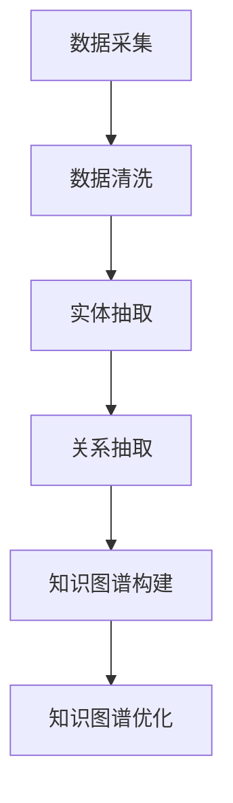

                 


### 文章标题：基于知识图谱的时空事件推理能力增强技术

#### 关键词：知识图谱，时空事件推理，数据模型，算法优化，应用实践

#### 摘要：
本文深入探讨了知识图谱在时空事件推理中的应用与增强技术。首先介绍了知识图谱的基本概念、发展历程及在时空事件推理中的重要性。随后，详细阐述了知识图谱的构建方法、时空数据管理技术以及时空事件推理算法。文章还通过具体案例展示了这些技术的实际应用，并提出了未来发展的趋势与挑战。

### 第1章 引言与背景

#### 1.1.1 知识图谱的概念与发展

知识图谱（Knowledge Graph）是一种用于表达实体及实体之间关系的图形结构。它起源于语义网（Semantic Web）的概念，旨在通过机器可读的格式表示知识，以实现信息的自动理解和处理。知识图谱的发展经历了从简单的本体构建到大规模数据集成、从规则驱动到数据驱动等阶段。

知识图谱的核心组成部分包括实体（Entity）、属性（Property）和关系（Relationship）。实体可以是人、地点、事物等，属性用于描述实体的特征，关系则表示实体之间的相互作用。知识图谱通过这些基本元素构建起一个丰富的语义网络，使得计算机能够理解现实世界中的复杂关系。

#### 1.1.2 时空事件推理的基本原理

时空事件推理（Temporal Event Reasoning）是指基于时间和空间信息，对事件的发生、发展和变化进行推理和分析。这种推理方法在智能交通、智能城市、自然灾害预警等领域具有重要应用价值。

时空事件推理的基本原理包括以下几个方面：

1. **时空数据表示**：将事件、地点、时间等要素以统一的数据结构进行表示，如使用时间戳、地理坐标等。
2. **时空关系建模**：建立事件之间、事件与地点之间、事件与时间之间的时空关系模型。
3. **事件推理算法**：使用基于规则、机器学习、逻辑推理等方法，对时空数据进行处理和分析，推断出事件的可能性和趋势。

#### 1.1.3 知识图谱在时空事件推理中的应用现状

知识图谱在时空事件推理中发挥着越来越重要的作用。目前，已有不少研究将知识图谱技术应用于交通管理、灾害预警、城市规划等领域。

1. **智能交通**：通过构建交通知识图谱，实时分析交通流量，预测交通拥堵情况，提供出行建议。
2. **自然灾害预警**：利用地理信息系统（GIS）和知识图谱，对地震、台风等自然灾害进行监测和预警。
3. **智能城市**：通过时空事件推理，实现城市资源优化配置，提升城市管理水平。

本章为后续内容奠定了基础，详细介绍了知识图谱和时空事件推理的基本概念和应用现状，为读者理解本文的核心内容提供了必要的背景知识。

### 第2章 知识图谱基础

#### 2.1 知识图谱的定义与构成

知识图谱是一种用于表达实体及其相互关系的数据结构，通常由实体、属性和关系三个核心元素构成。

- **实体**：代表现实世界中的对象，可以是人、地点、事物等。在知识图谱中，实体通常用节点（Node）表示。
- **属性**：描述实体的特征或属性，如人的年龄、地点的经纬度等。在知识图谱中，属性通常用边（Edge）表示。
- **关系**：表示实体之间的相互作用或关联，如“人住在地点”、“事物属于类别”等。在知识图谱中，关系也用边（Edge）表示。

知识图谱中的实体、属性和关系共同构成了一张庞大的语义网络，使得计算机能够以图结构的方式理解和处理复杂知识。

#### 2.2 知识图谱的数据模型

知识图谱的数据模型可以分为两大类：图模型和属性图模型。

- **图模型**：图模型是一种基于图论的数据模型，将实体和关系表示为图中的节点和边。这种模型简单直观，适用于描述复杂的实体关系。
- **属性图模型**：属性图模型在图模型的基础上，引入了属性的表示。每个节点和边都可以携带属性信息，如实体的类别、关系的强度等。这种模型可以更精确地描述实体和关系的特征，适用于需要精细属性描述的应用场景。

在实际应用中，根据具体需求可以选择合适的知识图谱数据模型。图模型适用于描述实体关系较为简单的场景，而属性图模型则适用于需要复杂属性描述的场景。

#### 2.3 知识图谱的构建方法

知识图谱的构建是一个复杂的过程，涉及数据采集、数据清洗、实体抽取、关系抽取、链接预测等多个环节。

- **数据采集与清洗**：首先需要收集相关的数据源，如文本、数据库、API等。然后对数据进行清洗，去除噪声和冗余信息，确保数据质量。
- **实体抽取**：从原始数据中识别出实体，通常使用命名实体识别（Named Entity Recognition，NER）技术。
- **关系抽取**：从原始数据中识别出实体之间的关系，通常使用关系提取（Relation Extraction）技术。
- **链接预测与补全**：在构建知识图谱时，往往存在实体和关系缺失的问题。链接预测与补全技术用于预测实体之间的关系，并填补缺失的实体和关系。

此外，知识图谱的构建还需要考虑数据融合与优化问题。数据融合是指将多个数据源中的知识进行整合，构建出一个统一的、完整的知识图谱。数据优化则包括数据的去重、压缩、索引等操作，以提高知识图谱的查询效率。

#### 2.3.1 数据采集与清洗

数据采集与清洗是知识图谱构建的基础环节。数据采集方法包括手动收集、自动化爬取和API调用等。数据清洗旨在去除噪声和冗余信息，提高数据质量。

- **去噪**：去除数据中的错误信息、无关信息和重复信息。
- **标准化**：将数据格式进行统一，如统一日期格式、统一地名等。
- **数据预处理**：对数据集进行分词、词性标注、实体识别等预处理操作，为后续的实体抽取和关系抽取做好准备。

数据采集与清洗的具体步骤如下：

1. **数据采集**：收集相关数据源，如网页、数据库、文本文件等。
2. **数据预处理**：对数据进行标准化处理，如统一日期格式、统一地名等。
3. **数据去重**：去除数据中的重复信息，确保数据唯一性。
4. **错误校正**：修复数据中的错误信息，如纠正地名的错误拼写等。
5. **无关信息去除**：去除数据中的无关信息，如广告、噪声等。

#### 2.3.2 实体抽取与关系抽取

实体抽取和关系抽取是知识图谱构建的核心环节。实体抽取旨在从原始数据中识别出实体，关系抽取则旨在识别出实体之间的关系。

- **实体抽取**：实体抽取方法包括基于规则的方法、基于统计的方法和基于深度学习的方法。基于规则的方法通过预设的规则识别实体，如使用命名实体识别（NER）技术。基于统计的方法通过分析文本特征识别实体，如使用条件随机场（CRF）模型。基于深度学习的方法通过神经网络模型识别实体，如使用BiLSTM-CRF模型。

- **关系抽取**：关系抽取方法包括基于规则的方法、基于统计的方法和基于深度学习的方法。基于规则的方法通过预设的规则识别关系，如使用依存句法分析（Dependency Parsing）技术。基于统计的方法通过分析文本特征识别关系，如使用条件随机场（CRF）模型。基于深度学习的方法通过神经网络模型识别关系，如使用Transformer模型。

实体抽取和关系抽取的具体步骤如下：

1. **数据预处理**：对原始数据进行分词、词性标注等预处理操作。
2. **实体识别**：使用实体抽取方法识别出文本中的实体。
3. **关系识别**：使用关系抽取方法识别出实体之间的关系。
4. **实体关系构建**：将识别出的实体和关系构建成知识图谱中的节点和边。

#### 2.3.3 链接预测与补全

链接预测与补全技术用于解决知识图谱中实体和关系缺失的问题。链接预测旨在预测实体之间的关系，补全则旨在填补缺失的实体和关系。

- **链接预测**：链接预测方法包括基于规则的方法、基于统计的方法和基于深度学习的方法。基于规则的方法通过预设的规则预测实体之间的关系，如使用路径约束（Path Constraint）方法。基于统计的方法通过分析实体特征预测关系，如使用相似度度量（Similarity Measure）方法。基于深度学习的方法通过神经网络模型预测关系，如使用图神经网络（Graph Neural Network，GNN）方法。

- **补全**：补全方法包括基于规则的方法、基于统计的方法和基于深度学习的方法。基于规则的方法通过预设的规则填补缺失的实体和关系，如使用本体补全（Ontology Completion）方法。基于统计的方法通过分析实体特征填补缺失的实体和关系，如使用聚类方法（Clustering）方法。基于深度学习的方法通过神经网络模型填补缺失的实体和关系，如使用生成对抗网络（Generative Adversarial Network，GAN）方法。

链接预测与补全的具体步骤如下：

1. **数据预处理**：对知识图谱进行预处理，如去重、标准化等。
2. **链接预测**：使用链接预测方法预测实体之间的关系。
3. **关系补全**：使用补全方法填补缺失的实体和关系。

#### 2.3.4 知识图谱的融合与优化

知识图谱的融合与优化是确保知识图谱质量和性能的重要环节。知识图谱的融合旨在将多个数据源中的知识进行整合，构建出一个统一的、完整的知识图谱。知识图谱的优化则包括数据的去重、压缩、索引等操作，以提高知识图谱的查询效率。

- **数据融合**：数据融合方法包括基于规则的融合、基于统计的融合和基于机器学习的融合。基于规则的融合通过预设的规则将多个知识图谱进行整合，如使用本体映射（Ontology Mapping）方法。基于统计的融合通过分析数据特征将多个知识图谱进行整合，如使用贝叶斯网络（Bayesian Network）方法。基于机器学习的融合通过学习数据之间的关联关系将多个知识图谱进行整合，如使用多任务学习（Multi-Task Learning）方法。

- **数据优化**：数据优化方法包括数据去重、数据压缩、数据索引等。数据去重通过去除重复的数据条目，减少知识图谱的冗余。数据压缩通过减少数据的存储空间，提高知识图谱的查询效率。数据索引通过构建索引结构，加快数据查询速度。

知识图谱的融合与优化的具体步骤如下：

1. **数据预处理**：对知识图谱进行预处理，如去重、标准化等。
2. **数据融合**：使用数据融合方法将多个知识图谱进行整合。
3. **数据优化**：使用数据优化方法提高知识图谱的性能。

通过本章的讨论，我们了解了知识图谱的定义与构成、数据模型、构建方法以及融合与优化技术。这些基础知识和方法为后续章节的深入研究提供了必要的背景和指导。

### 第3章 时空数据管理

#### 3.1 时空数据的表示方法

时空数据是指同时包含时间和空间特征的数据，如位置信息、时间戳等。有效地表示时空数据是时空事件推理的关键。常见的时空数据表示方法包括：

- **地理坐标系表示**：使用地理坐标系（如经纬度）表示地理位置。
- **时间戳表示**：使用时间戳表示事件发生的时间。
- **时空索引表示**：将时空数据组织成索引结构，如空间索引（如R树）和时间索引（如时间区间）。

这些方法可以根据具体应用场景选择合适的表示方式。

#### 3.2 时空数据的存储与管理

时空数据的存储与管理是时空事件推理的基础。常见的存储与管理方法包括：

- **图数据库**：图数据库（如Neo4j、ArangoDB）适用于存储和管理复杂的关系数据，特别是具有时空特征的数据。图数据库具有高效的图遍历和查询能力，适合用于时空事件推理。
- **时间序列数据库**：时间序列数据库（如InfluxDB、TimescaleDB）适用于存储和管理时间序列数据。时间序列数据库具有高效的时间戳索引和查询能力，适合用于处理实时时空数据。
- **时空索引**：时空索引（如空间索引和时间索引）适用于存储和管理大量时空数据。时空索引可以通过高效的索引结构加速数据查询，适合用于大规模时空数据的处理。

#### 3.2.1 基于图数据库的时空数据管理

基于图数据库的时空数据管理具有以下优点：

- **高效的关系查询**：图数据库通过图结构存储和管理数据，支持高效的关系查询。
- **灵活的扩展性**：图数据库支持节点和边的动态添加和删除，具有很好的扩展性。
- **丰富的分析能力**：图数据库支持多种图算法和查询语言（如Cypher），方便进行复杂的时空数据分析。

基于图数据库的时空数据管理方法如下：

1. **数据建模**：将时空数据建模为图结构，包括节点（如位置、时间）、边（如关系）和属性（如距离、时间间隔）。
2. **数据存储**：将时空数据存储在图数据库中，利用图数据库的索引和查询能力进行数据管理。
3. **数据查询**：使用图数据库的查询语言（如Cypher）进行数据查询和分析。

#### 3.2.2 基于时间序列数据库的时空数据管理

基于时间序列数据库的时空数据管理具有以下优点：

- **高效的时间戳查询**：时间序列数据库具有高效的时间戳索引和查询能力，适合处理实时时空数据。
- **数据压缩**：时间序列数据库支持数据压缩，节省存储空间。
- **可扩展性**：时间序列数据库支持水平扩展，适合处理大规模时空数据。

基于时间序列数据库的时空数据管理方法如下：

1. **数据建模**：将时空数据建模为时间序列数据，包括时间戳和时空特征。
2. **数据存储**：将时空数据存储在时间序列数据库中，利用时间序列数据库的索引和查询能力进行数据管理。
3. **数据查询**：使用时间序列数据库的查询语言（如InfluxQL）进行数据查询和分析。

#### 3.2.3 基于时空索引的时空数据管理

基于时空索引的时空数据管理具有以下优点：

- **高效的数据查询**：时空索引通过高效的索引结构加速数据查询，适合处理大规模时空数据。
- **灵活性**：时空索引支持多种索引结构（如空间索引、时间索引），可以灵活适应不同类型的时空数据。
- **可扩展性**：时空索引支持水平扩展，适合处理大规模时空数据。

基于时空索引的时空数据管理方法如下：

1. **数据建模**：将时空数据建模为索引结构，包括空间索引和时间索引。
2. **数据存储**：将时空数据存储在索引结构中，利用时空索引的查询能力进行数据管理。
3. **数据查询**：使用时空索引的查询语言（如SPARQL）进行数据查询和分析。

通过本章的讨论，我们了解了时空数据的表示方法、存储与管理方法以及基于不同数据库的时空数据管理技术。这些技术为时空事件推理提供了坚实的基础。

### 第4章 时空事件推理算法

#### 4.1 时空事件推理的基本算法

时空事件推理算法是指用于处理和推理时空事件的方法。时空事件推理的基本算法包括基于规则的方法、基于机器学习的方法和基于逻辑推理的方法。这些算法各有优缺点，适用于不同的应用场景。

#### 4.1.1 基于规则的方法

基于规则的方法通过预设的规则进行时空事件推理。这种方法具有以下特点：

- **简单直观**：规则简单明了，易于理解和实现。
- **可解释性**：规则明确，推理过程可解释。
- **准确性**：通过精确的规则匹配，具有较高的准确性。

基于规则的方法的缺点包括：

- **规则数量庞大**：对于复杂的时空事件，需要大量规则进行描述，难以维护。
- **扩展性差**：当新的事件类型或关系出现时，需要修改或新增规则。

基于规则的方法的步骤如下：

1. **规则定义**：根据时空事件的特征和关系，定义相应的规则。
2. **规则匹配**：将输入的时空事件与规则进行匹配，判断事件是否符合规则。
3. **推理结果**：根据匹配结果，生成推理结果。

以下是一个简单的基于规则的时空事件推理算法示例：

```
规则1：如果地震发生，则发出预警。
规则2：如果地震强度大于5.0，则属于强烈地震。

输入：地震发生，强度为5.5。
推理过程：
- 匹配规则1，地震发生，发出预警。
- 匹配规则2，地震强度大于5.0，属于强烈地震。
输出：预警信息，强烈地震发生。
```

#### 4.1.2 基于机器学习的方法

基于机器学习的方法通过学习大量的时空事件数据，自动提取特征和规则，进行时空事件推理。这种方法具有以下特点：

- **自动特征提取**：通过学习数据，自动提取特征，无需手工定义。
- **适应性**：能够适应新的时空事件类型和关系。
- **灵活性**：能够处理复杂的时空事件，适用于大规模数据。

基于机器学习的方法的缺点包括：

- **可解释性差**：机器学习模型复杂，推理过程难以解释。
- **过拟合**：对于训练数据拟合过度，可能导致泛化能力差。

基于机器学习的方法的步骤如下：

1. **数据预处理**：对时空事件数据进行预处理，包括数据清洗、特征提取等。
2. **模型训练**：使用训练数据训练机器学习模型，如决策树、支持向量机（SVM）、深度学习模型等。
3. **模型评估**：使用验证数据对模型进行评估，调整模型参数。
4. **推理应用**：使用训练好的模型对新的时空事件进行推理。

以下是一个简单的基于机器学习的时空事件推理算法示例：

```
输入：地震数据集。
模型：支持向量机（SVM）。

训练过程：
- 特征提取：提取地震发生的时间、地点、强度等特征。
- 模型训练：使用SVM模型训练数据集，生成模型。

推理应用：
- 输入：新地震数据。
- 特征提取：提取新地震数据的时间、地点、强度等特征。
- 模型推理：使用SVM模型对新地震数据进行推理，判断地震类型。

输出：地震类型。
```

#### 4.1.3 基于逻辑推理的方法

基于逻辑推理的方法通过逻辑表达式和推理规则进行时空事件推理。这种方法具有以下特点：

- **形式化**：逻辑表达式和推理规则具有严格的数学形式，推理过程可验证。
- **可解释性**：推理过程可解释，便于理解和调试。
- **适应性**：能够适应新的时空事件类型和关系。

基于逻辑推理的方法的缺点包括：

- **计算复杂度高**：逻辑推理通常涉及复杂的计算，如推理树构建、子句生成等。
- **规则数量庞大**：对于复杂的时空事件，需要大量的逻辑规则进行描述，难以维护。

基于逻辑推理的方法的步骤如下：

1. **逻辑表达式构建**：根据时空事件的特征和关系，构建逻辑表达式。
2. **推理规则定义**：定义推理规则，用于指导推理过程。
3. **推理过程**：使用推理规则对逻辑表达式进行推理，生成推理结果。

以下是一个简单的基于逻辑推理的时空事件推理算法示例：

```
逻辑表达式：地震(地点=北京，时间=2023年1月1日) → 预警。

推理规则：
- 规则1：如果地震发生，则发出预警。
- 规则2：如果地震地点为北京，则属于重大地震。

推理过程：
- 输入：地震发生，地点为北京，时间为2023年1月1日。
- 匹配规则1，地震发生，发出预警。
- 匹配规则2，地震地点为北京，属于重大地震。

输出：预警信息，重大地震发生。
```

通过本章的讨论，我们了解了时空事件推理的基本算法，包括基于规则的方法、基于机器学习的方法和基于逻辑推理的方法。这些算法为时空事件推理提供了丰富的技术手段和实现策略。

#### 4.2 增强算法与优化

随着时空事件推理应用场景的复杂化和数据量的增加，传统的时空事件推理算法在性能和准确性方面面临诸多挑战。为了提高时空事件推理的能力，增强算法与优化方法应运而生。这些方法主要包括多模态数据融合、时空上下文感知推理和模型解释与可解释性。

#### 4.2.1 多模态数据融合

多模态数据融合是指将来自不同数据源的信息进行整合，以提高时空事件推理的准确性和效率。常见的多模态数据包括文本、图像、传感器数据等。多模态数据融合的方法主要包括以下几种：

1. **特征级融合**：在特征提取阶段将来自不同模态的数据特征进行融合，例如使用深度学习模型提取图像和文本的特征，然后对特征进行拼接和融合。

2. **决策级融合**：在决策阶段将不同模态的数据进行融合，例如使用集成学习（如随机森林、梯度提升树）将图像分类结果和文本分类结果进行融合。

3. **模型级融合**：在不同模型之间进行融合，例如使用图像识别模型和自然语言处理模型分别处理图像和文本，然后通过融合模型输出最终的推理结果。

多模态数据融合的优点包括：

- **信息互补**：不同模态的数据可以提供互补的信息，有助于提高推理的准确性。
- **增强鲁棒性**：融合多个模态的数据可以降低单一模态数据的不确定性，提高推理的鲁棒性。
- **扩展性**：多模态数据融合方法适用于各种应用场景，可以灵活地扩展到新的模态和数据源。

以下是一个简单的多模态数据融合算法示例：

```
输入：图像数据X和文本数据Y。

特征提取：
- 图像特征F\_image = ExtractFeatures(X)
- 文本特征F\_text = ExtractFeatures(Y)

特征融合：
- 融合特征F = Concatenate(F\_image, F\_text)

模型训练：
- 使用融合特征F训练多模态分类器C

推理应用：
- 输入：新图像数据X'和新文本数据Y'
- 特征提取：F' = Concatenate(ExtractFeatures(X'), ExtractFeatures(Y'))
- 推理结果：Prediction = C(Predict(F'))

输出：时空事件推理结果。
```

#### 4.2.2 时空上下文感知推理

时空上下文感知推理是指利用时空上下文信息（如时间、地点、事件历史等）来提高时空事件推理的准确性和鲁棒性。时空上下文信息可以提供事件发生的环境和背景，有助于理解事件之间的关联和因果关系。

时空上下文感知推理的方法主要包括以下几种：

1. **时空上下文建模**：将时空上下文信息建模为特征，例如使用时间序列模型（如循环神经网络、长短期记忆网络）表示事件的历史信息。

2. **时空上下文嵌入**：将时空上下文信息嵌入到特征表示中，例如使用嵌入层（如词向量）将地点和时间编码为向量。

3. **时空上下文推理**：在推理过程中考虑时空上下文信息，例如使用图神经网络（如图卷积网络）处理事件之间的时空关系。

时空上下文感知推理的优点包括：

- **提高准确性**：考虑时空上下文信息可以更准确地推理事件的发生和变化。
- **增强鲁棒性**：时空上下文信息有助于过滤噪声和异常值，提高推理的鲁棒性。
- **增强解释性**：时空上下文信息有助于解释推理结果，提高结果的解释性。

以下是一个简单的时空上下文感知推理算法示例：

```
输入：事件序列E，时空上下文信息C。

时空上下文建模：
- 时间特征T = ExtractTimeFeatures(E)
- 地点特征L = ExtractLocationFeatures(E)
- 历史特征H = ExtractHistoryFeatures(E)

时空上下文嵌入：
- 嵌入时间特征V\_t = EmbedTimeFeatures(T)
- 嵌入地点特征V\_l = EmbedLocationFeatures(L)
- 嵌入历史特征V\_h = EmbedHistoryFeatures(H)

时空上下文推理：
- 使用图神经网络GNN = GraphNeuralNetwork(V\_t, V\_l, V\_h)
- 推理结果R = GNN推理(E, C)

输出：时空事件推理结果R。
```

#### 4.2.3 模型解释与可解释性

模型解释与可解释性是指对模型推理过程和结果进行解释，以便用户理解和信任模型。对于复杂的时空事件推理模型，解释性尤为重要。

模型解释与可解释性的方法主要包括以下几种：

1. **特征重要性分析**：分析模型中特征的重要程度，帮助用户理解哪些特征对推理结果影响最大。

2. **决策路径追踪**：追踪模型在推理过程中所采取的决策路径，帮助用户理解推理过程的每一步。

3. **可视化技术**：使用可视化技术（如图、表格、图表等）展示模型推理结果和过程，提高解释性。

模型解释与可解释性的优点包括：

- **增强用户信任**：用户可以理解模型的推理过程和结果，增强对模型的信任。
- **辅助决策**：用户可以根据解释结果进行辅助决策，提高决策的准确性。
- **发现错误**：通过解释过程，用户可以识别模型中的错误和缺陷，进行改进。

以下是一个简单的模型解释与可解释性示例：

```
输入：时空事件推理模型M，事件E。

特征重要性分析：
- 重要性排序I = ModelImportance(M, E)

决策路径追踪：
- 路径P = ModelDecisionPath(M, E)

可视化：
- 可视化结果V = VisualizeResult(I, P)

输出：模型解释结果V。
```

通过本章的讨论，我们了解了增强算法与优化的方法，包括多模态数据融合、时空上下文感知推理和模型解释与可解释性。这些方法为时空事件推理提供了强大的技术支持，有助于提高推理的准确性和效率。

#### 4.3 时空事件推理算法的评价指标

评价时空事件推理算法的性能和效果是确保其应用价值的重要环节。常用的评价指标包括准确性、召回率、F1值、精确率等。以下是对这些评价指标的详细解释：

1. **准确性（Accuracy）**：准确性是衡量算法正确预测的比率，计算公式为：
   \[
   Accuracy = \frac{TP + TN}{TP + TN + FP + FN}
   \]
   其中，TP为真正例（True Positive），TN为真负例（True Negative），FP为假正例（False Positive），FN为假负例（False Negative）。准确性越高，表示算法对时空事件的预测越准确。

2. **召回率（Recall）**：召回率是衡量算法识别出真正例的能力，计算公式为：
   \[
   Recall = \frac{TP}{TP + FN}
   \]
   召回率越高，表示算法对时空事件的识别能力越强。

3. **F1值（F1 Score）**：F1值是准确性和召回率的加权平均，计算公式为：
   \[
   F1 = 2 \times \frac{Precision \times Recall}{Precision + Recall}
   \]
   其中，Precision为精确率，计算公式为：
   \[
   Precision = \frac{TP}{TP + FP}
   \]
   F1值综合考虑了准确性和召回率，是评价时空事件推理算法常用的重要指标。

4. **精确率（Precision）**：精确率是衡量算法识别出真正例的精确程度，计算公式为：
   \[
   Precision = \frac{TP}{TP + FP}
   \]
   精确率越高，表示算法对时空事件的预测越精确。

在实际应用中，可以根据具体需求选择合适的评价指标。例如，在需要高召回率的应用场景（如异常检测），召回率是一个重要的评价指标。而在需要高精确度的应用场景（如分类），精确率和F1值更为重要。

#### 4.4 时空事件推理算法的应用场景

时空事件推理算法在多个领域具有重要应用价值。以下是一些典型的应用场景：

1. **智能交通**：利用时空事件推理算法分析交通流量，预测交通拥堵，优化交通信号控制策略，提高道路通行效率。

2. **自然灾害预警**：结合地理信息系统（GIS）和时空事件推理算法，对地震、洪水、台风等自然灾害进行实时监测和预警，降低灾害风险。

3. **公共安全**：通过分析犯罪事件的时间和空间分布，预测犯罪热点区域，制定针对性预防措施，提高公共安全水平。

4. **城市规划**：利用时空事件推理算法分析人口流动、交通流量等数据，优化城市规划，提升城市管理水平。

5. **供应链管理**：结合供应链数据和时空事件推理算法，预测供应链中的潜在风险和瓶颈，优化供应链网络布局。

这些应用场景展示了时空事件推理算法在提高决策效率、降低风险和优化资源配置方面的巨大潜力。通过不断优化算法和扩展应用场景，时空事件推理将在更多领域发挥重要作用。

### 第5章 知识图谱与时空事件的关联

#### 5.1 知识图谱与时空事件的融合

知识图谱与时空事件的融合是指将知识图谱中的实体、属性和关系与时空信息进行整合，以构建一个统一且具有时空属性的图谱。这种融合方法旨在提高时空事件推理的准确性和效率，具体步骤如下：

1. **时空信息提取**：从原始数据中提取时空信息，包括时间戳、地理位置等。
2. **知识图谱扩展**：将提取的时空信息与知识图谱进行整合，扩展知识图谱中的实体、属性和关系。
3. **时空属性关联**：建立时空属性与知识图谱中的实体、关系之间的关联，如地点与地理位置的关联。
4. **图谱优化**：通过融合后的时空信息对知识图谱进行优化，提高其查询和推理效率。

通过知识图谱与时空事件的融合，我们可以更准确地理解和分析时空事件，从而提高时空事件推理的性能。

#### 5.2 知识图谱中的时空事件识别

时空事件识别是指在知识图谱中识别出具有时空特征的事件。这涉及到从大量数据中提取有用的时空信息，并将其与知识图谱中的实体、关系进行关联。以下是具体的识别方法：

1. **实体时间属性提取**：从文本或结构化数据中提取实体的时间属性，如事件发生的时间、持续时间等。
2. **事件时间序列构建**：将提取的时间属性构建成事件的时间序列，以便进行时间分析和推理。
3. **事件时间关系推断**：根据知识图谱中的关系和时空信息，推断事件之间的时间关系，如事件发生顺序、因果关系等。

通过这些方法，我们可以有效地在知识图谱中识别出时空事件，并为后续的时空事件推理提供基础数据。

##### 5.2.1 实体时间属性的提取

实体时间属性的提取是时空事件识别的重要步骤，涉及从各种数据源中提取与时间相关的信息。以下是几种常见的实体时间属性提取方法：

1. **文本解析**：从文本数据中提取时间相关的词汇和短语，如“明天下午3点”、“昨天发生的地震”等。这通常需要使用自然语言处理（NLP）技术，如时间表达式解析、命名实体识别（NER）等。
2. **结构化数据**：从结构化数据（如数据库、XML等）中直接提取时间属性，如时间戳、日期字段等。这种方法通常比较简单和直接。
3. **图像和传感器数据**：从图像和传感器数据中提取时间信息，如图像的时间戳、传感器的时间记录等。这需要结合图像处理和传感器数据分析技术。

以下是实体时间属性提取的一个简单示例：

```
输入：文本数据 "会议将于2023年5月15日下午3点开始"。

提取步骤：
1. 使用NLP技术识别时间相关的词汇和短语。
2. 将识别出的时间信息转换为标准格式（如ISO 8601）。
3. 存储提取的时间属性。

输出：实体时间属性 {会议：2023-05-15T15:00:00}。
```

通过实体时间属性的提取，我们可以为后续的时空事件构建提供可靠的时间信息。

##### 5.2.2 事件时间序列的构建

事件时间序列的构建是将提取的实体时间属性组织成有序的时间序列，以便进行时间分析和推理。以下是构建事件时间序列的步骤：

1. **时间戳标准化**：将提取的时间属性统一转换为标准的时间戳格式，如ISO 8601。
2. **时间序列排序**：根据时间戳对事件进行排序，确保时间序列的有序性。
3. **时间间隔计算**：计算事件之间的时间间隔，以便分析事件的发生顺序和持续时间。
4. **时间序列存储**：将构建的事件时间序列存储在数据库或数据结构中，以便进行后续的时空事件推理。

以下是构建事件时间序列的一个简单示例：

```
输入：实体时间属性列表 [{事件1：2023-05-15T10:00:00}, {事件2：2023-05-15T12:30:00}, {事件3：2023-05-15T15:00:00}]。

构建步骤：
1. 将时间属性转换为标准时间戳格式。
2. 根据时间戳对事件进行排序。
3. 计算事件之间的时间间隔。

输出：事件时间序列 [事件1 (10:00:00), 事件2 (12:30:00), 事件3 (15:00:00)]。
```

通过事件时间序列的构建，我们可以更好地分析和理解事件的时空特征，为后续的时空事件推理提供基础。

##### 5.2.3 事件时间关系的推断

事件时间关系的推断是分析事件之间的时间关联和因果关系，有助于理解事件的动态变化。以下是几种常见的事件时间关系推断方法：

1. **直接时间关系**：根据事件发生的时间顺序和持续时间，直接推断事件之间的时间关系，如先后关系、重叠关系等。
2. **因果关系推断**：基于因果推理模型，分析事件之间的因果关系，如事件A导致事件B的发生。
3. **逻辑关系推断**：使用逻辑推理技术，分析事件之间的逻辑关系，如事件A必须发生在事件B之前。

以下是事件时间关系推断的一个简单示例：

```
输入：事件时间序列 [事件1 (2023-05-15T10:00:00), 事件2 (2023-05-15T12:00:00), 事件3 (2023-05-15T15:00:00)]。

推断步骤：
1. 计算事件之间的时间间隔。
2. 分析事件发生的时间顺序，推断直接时间关系。
3. 分析事件之间的因果关系，推断逻辑关系。

输出：事件时间关系 [事件1 → 事件2，事件2 → 事件3]。
```

通过事件时间关系的推断，我们可以更深入地理解事件的动态变化，为时空事件推理提供有力的支持。

### 第6章 增强时空事件推理的应用

#### 6.1 事件预测

事件预测是指利用历史数据和时空事件推理算法，预测未来可能发生的时空事件。事件预测在智能交通、自然灾害预警、公共安全等领域具有重要应用价值。以下是一些常见的事件预测方法：

1. **基于时间序列的方法**：这种方法利用时间序列数据，分析事件的规律和趋势，预测未来事件的发生。常见的算法包括ARIMA、LSTM等。

2. **基于因果关系的预测**：这种方法基于因果推理模型，分析事件之间的因果关系，预测未来事件的发生。常见的算法包括因果图模型、因果推断算法等。

3. **基于机器学习的方法**：这种方法利用机器学习算法，从历史数据中学习事件的规律，预测未来事件的发生。常见的算法包括决策树、支持向量机、深度学习等。

以下是事件预测的一个简单示例：

```
输入：历史地震数据集。

预测步骤：
1. 使用时间序列算法（如LSTM）训练模型。
2. 输入新的时间序列数据，预测未来地震的发生。

输出：未来地震预测结果。
```

通过事件预测，我们可以提前识别潜在风险，为决策提供支持。

##### 6.1.1 事件趋势预测

事件趋势预测是指分析事件的历史数据，预测事件在未来一段时间内的变化趋势。事件趋势预测有助于了解事件的发展方向，为决策提供参考。以下是一些常见的事件趋势预测方法：

1. **时间序列分析**：这种方法通过分析事件的时间序列数据，预测事件的变化趋势。常见的算法包括ARIMA、LSTM等。

2. **趋势分析**：这种方法通过绘制事件的时间序列图，观察事件的变化趋势，如线性趋势、指数趋势等。

3. **季节性分析**：这种方法通过分析事件的时间序列数据，识别季节性模式，预测事件在未来季节的变化趋势。

以下是事件趋势预测的一个简单示例：

```
输入：历史销售数据集。

预测步骤：
1. 使用时间序列算法（如ARIMA）训练模型。
2. 输入新的时间序列数据，预测未来销售的变化趋势。

输出：未来销售趋势预测结果。
```

通过事件趋势预测，我们可以更好地规划资源配置，提高业务效率。

##### 6.1.2 事件因果关系预测

事件因果关系预测是指分析事件之间的因果关系，预测事件之间的相互作用。事件因果关系预测有助于了解事件之间的内在联系，为决策提供科学依据。以下是一些常见的事件因果关系预测方法：

1. **因果图模型**：这种方法通过建立因果图模型，分析事件之间的因果关系。常见的算法包括Do calculus、结构方程模型等。

2. **因果推断算法**：这种方法通过分析事件的历史数据，推断事件之间的因果关系。常见的算法包括因果推断算法（如Causal Inference）、基于机器学习的因果推断方法等。

3. **逻辑推理**：这种方法通过逻辑推理技术，分析事件之间的因果关系。常见的算法包括基于规则的逻辑推理、基于概率的逻辑推理等。

以下是事件因果关系预测的一个简单示例：

```
输入：历史地震数据集。

预测步骤：
1. 使用因果图模型训练模型。
2. 输入新的地震数据，预测地震与后续事件之间的因果关系。

输出：事件因果关系预测结果。
```

通过事件因果关系预测，我们可以更好地理解事件之间的相互作用，为决策提供科学支持。

##### 6.1.3 事件时效性预测

事件时效性预测是指预测事件发生的时间窗口。事件时效性预测有助于及时识别和应对事件，提高决策的时效性。以下是一些常见的事件时效性预测方法：

1. **基于时间序列的方法**：这种方法通过分析事件的时间序列数据，预测事件发生的时间窗口。常见的算法包括时间窗口预测算法（如滑动窗口）、基于神经网络的时效性预测方法等。

2. **基于因果关系的预测**：这种方法通过分析事件之间的因果关系，预测事件发生的时间窗口。常见的算法包括因果推断算法（如Causal Inference）、基于逻辑推理的时效性预测方法等。

3. **基于机器学习的方法**：这种方法通过机器学习算法，从历史数据中学习事件的时间窗口特征，预测事件发生的时间窗口。常见的算法包括支持向量机（SVM）、决策树、深度学习等。

以下是事件时效性预测的一个简单示例：

```
输入：历史交通事故数据集。

预测步骤：
1. 使用时间序列算法（如LSTM）训练模型。
2. 输入新的交通事故数据，预测交通事故发生的时间窗口。

输出：交通事故时效性预测结果。
```

通过事件时效性预测，我们可以提前预警事件的发生，为决策提供及时的信息支持。

#### 6.2 事件监测与分析

事件监测与分析是指实时监测事件的发生和变化，分析事件的性质和影响。事件监测与分析有助于及时识别和应对事件，为决策提供科学依据。以下是一些常见的事件监测与分析方法：

1. **实时数据采集**：通过传感器、监控设备等实时采集事件数据，如地震参数、交通流量、天气信息等。

2. **事件检测算法**：利用机器学习、深度学习等算法，实时检测事件的发生。常见的事件检测算法包括基于规则的方法、基于统计的方法、基于模式识别的方法等。

3. **事件影响分析**：分析事件的影响范围和程度，如自然灾害的影响范围、交通事故的影响程度等。常见的方法包括基于影响的数学模型、基于因果关系的分析方法等。

以下是事件监测与分析的一个简单示例：

```
输入：实时交通流量数据。

监测与分析步骤：
1. 使用机器学习算法（如K均值聚类）检测交通拥堵事件。
2. 分析交通拥堵事件的影响范围和程度。

输出：交通拥堵事件监测与分析结果。
```

通过事件监测与分析，我们可以及时了解事件的发生和变化，为决策提供实时数据支持。

##### 6.2.1 事件异常检测

事件异常检测是指实时监测事件的发生，识别事件中的异常情况。事件异常检测有助于及时发现和应对异常事件，防止潜在风险。以下是一些常见的事件异常检测方法：

1. **基于统计的方法**：这种方法通过分析事件的历史数据，识别事件中的异常值。常见的方法包括统计检验（如t检验、方差分析）、异常检测算法（如孤立森林、DBSCAN等）。

2. **基于机器学习的方法**：这种方法通过训练机器学习模型，识别事件中的异常情况。常见的方法包括支持向量机（SVM）、决策树、随机森林等。

3. **基于深度学习的方法**：这种方法利用深度学习模型，自动识别事件中的异常模式。常见的深度学习方法包括卷积神经网络（CNN）、循环神经网络（RNN）、图神经网络（GNN）等。

以下是事件异常检测的一个简单示例：

```
输入：实时气象数据。

异常检测步骤：
1. 使用深度学习模型（如卷积神经网络）训练。
2. 输入新的气象数据，识别异常气象事件。

输出：异常气象事件检测结果。
```

通过事件异常检测，我们可以提前预警异常事件，防止潜在风险。

##### 6.2.2 事件关联分析

事件关联分析是指分析事件之间的关联关系，识别事件之间的相互作用。事件关联分析有助于理解事件之间的内在联系，为决策提供科学依据。以下是一些常见的事件关联分析方法：

1. **基于规则的方法**：这种方法通过定义事件之间的规则，分析事件之间的关联关系。常见的方法包括基于逻辑的关联分析、基于条件的关联分析等。

2. **基于统计的方法**：这种方法通过分析事件的历史数据，识别事件之间的统计关联。常见的方法包括相关分析、回归分析等。

3. **基于图论的方法**：这种方法通过构建事件之间的图结构，分析事件之间的拓扑关系。常见的图论方法包括图遍历、最短路径算法、社区检测等。

以下是事件关联分析的一个简单示例：

```
输入：历史地震数据。

关联分析步骤：
1. 使用图论方法构建地震事件的图结构。
2. 分析地震事件之间的关联关系。

输出：地震事件关联分析结果。
```

通过事件关联分析，我们可以更好地理解事件之间的相互作用，为决策提供科学依据。

##### 6.2.3 事件趋势分析

事件趋势分析是指分析事件的发展趋势，预测事件的变化方向。事件趋势分析有助于了解事件的发展方向，为决策提供参考。以下是一些常见的事件趋势分析方法：

1. **时间序列分析**：这种方法通过分析事件的时间序列数据，识别事件的发展趋势。常见的方法包括时间序列分解、自回归模型等。

2. **趋势分析**：这种方法通过绘制事件的时间序列图，观察事件的发展趋势。常见的方法包括线性趋势、指数趋势等。

3. **季节性分析**：这种方法通过分析事件的时间序列数据，识别季节性模式。常见的方法包括季节分解、季节性检测等。

以下是事件趋势分析的一个简单示例：

```
输入：历史销售数据。

趋势分析步骤：
1. 使用时间序列分析（如ARIMA）训练模型。
2. 输入新的销售数据，预测未来的销售趋势。

输出：销售趋势预测结果。
```

通过事件趋势分析，我们可以更好地预测事件的发展方向，为决策提供科学依据。

通过本章的讨论，我们了解了增强时空事件推理的应用，包括事件预测、事件监测与分析的具体方法。这些方法为实际应用提供了有力的技术支持，有助于提高事件处理的效率和质量。

### 第7章 实际案例与项目实践

#### 7.1 案例一：自然灾害预警系统

自然灾害预警系统是一个典型的应用知识图谱与时空事件推理技术的案例。以下是一个具体的实施过程。

##### 7.1.1 系统架构设计

自然灾害预警系统的架构设计包括数据采集模块、数据处理模块、知识图谱构建模块、时空事件推理模块和预警发布模块。系统架构如下：

1. **数据采集模块**：从气象、地质、水文等相关部门获取实时数据，如温度、湿度、降雨量、地震参数等。
2. **数据处理模块**：对采集到的数据进行预处理，包括数据清洗、去噪、标准化等。
3. **知识图谱构建模块**：基于预处理后的数据，构建知识图谱，包括实体（如地点、事件）、属性（如温度、降雨量）和关系（如气象事件、地质事件）。
4. **时空事件推理模块**：利用时空事件推理算法，分析知识图谱中的时空数据，预测自然灾害的发生和影响范围。
5. **预警发布模块**：根据时空事件推理结果，生成预警信息，并通过短信、邮件、APP等方式向公众发布。

##### 7.1.2 知识图谱构建

知识图谱构建是自然灾害预警系统的关键环节。以下是具体的构建步骤：

1. **数据采集**：从气象、地质、水文等相关部门获取实时数据，包括温度、湿度、降雨量、地震参数等。
2. **数据预处理**：对采集到的数据进行清洗、去噪、标准化等处理，确保数据质量。
3. **实体抽取**：使用命名实体识别（NER）技术，从预处理后的数据中识别出实体，如地点、事件等。
4. **关系抽取**：使用关系提取技术，识别实体之间的关系，如“地震发生在地点”、“降雨量达到阈值”等。
5. **知识图谱构建**：将识别出的实体和关系构建成知识图谱，如图中的节点和边。

##### 7.1.3 时空事件推理与预警

时空事件推理与预警是自然灾害预警系统的核心功能。以下是具体的实现步骤：

1. **时空事件推理**：利用时空事件推理算法，分析知识图谱中的时空数据，预测自然灾害的发生和影响范围。常见的推理算法包括基于规则的推理、基于机器学习的推理等。
2. **预警生成**：根据时空事件推理结果，生成相应的预警信息，如地震预警、洪水预警等。
3. **预警发布**：通过短信、邮件、APP等方式，将预警信息及时发布给相关人员，提醒公众采取相应措施。

以下是一个简单的时空事件推理与预警的伪代码示例：

```
# 输入：知识图谱G
# 输出：预警信息I

# 步骤1：时空事件推理
events = TemporalEventReasoning(G)

# 步骤2：预警生成
for event in events:
    if event["type"] == "Earthquake":
        severity = event["severity"]
        location = event["location"]
        if severity > 5.0:
            message = "地震预警：地震强度大于5.0，请位于" + location + "的地区注意防范！"
            I.append(message)
    elif event["type"] == "Flood":
        location = event["location"]
        if is_rainy_location(location):
            message = "洪水预警：" + location + "地区降雨量大，可能有洪水风险！"
            I.append(message)

# 步骤3：预警发布
publish_warnings(I)
```

通过以上案例，我们可以看到知识图谱与时空事件推理技术在自然灾害预警系统中的应用效果。该系统不仅提高了预警的准确性，还实现了实时监测和预警发布，为公众的生命财产安全提供了有力保障。

##### 7.1.4 项目小结

自然灾害预警系统的成功实施，展示了知识图谱与时空事件推理技术在实际应用中的巨大潜力。以下是项目小结：

1. **数据质量**：数据质量是构建知识图谱和实现时空事件推理的关键。通过严格的数据采集、清洗和预处理，确保了数据的准确性。
2. **实时性**：系统的实时性是关键，通过实时监测和预警发布，实现了对自然灾害的快速响应。
3. **准确性**：通过结合多种时空事件推理算法，提高了预警的准确性，降低了误报和漏报率。
4. **可扩展性**：系统的架构设计具有良好的可扩展性，可以轻松扩展到其他自然灾害类型和预警场景。

通过项目实践，我们验证了知识图谱与时空事件推理技术在自然灾害预警系统中的应用效果，为未来类似项目提供了宝贵经验。

#### 7.2 案例二：城市交通管理

城市交通管理是一个复杂而重要的任务，需要实时监测和优化交通流量。以下是一个基于知识图谱与时空事件推理技术的城市交通管理系统。

##### 7.2.1 系统需求分析

城市交通管理系统的主要需求包括：

1. **实时交通流量监测**：实时监测城市的交通流量，包括道路车辆数量、车速等。
2. **交通拥堵预测**：预测未来一段时间内的交通拥堵情况，为交通管理提供预警。
3. **交通信号优化**：根据交通流量和拥堵情况，优化交通信号控制策略。
4. **事件监测与处理**：实时监测交通事件（如交通事故、道路施工等），及时处理并发布相关消息。

##### 7.2.2 知识图谱构建

知识图谱构建是城市交通管理系统的核心。以下是具体的构建步骤：

1. **数据采集**：从交通监控设备、传感器等获取实时交通数据，包括交通流量、车速、交通事件等。
2. **数据预处理**：对采集到的数据进行清洗、去噪、标准化等处理，确保数据质量。
3. **实体抽取**：使用命名实体识别（NER）技术，从预处理后的数据中识别出实体，如道路、交通事件等。
4. **关系抽取**：使用关系提取技术，识别实体之间的关系，如“道路上有交通拥堵”、“交通事件导致交通拥堵”等。
5. **知识图谱构建**：将识别出的实体和关系构建成知识图谱，如图中的节点和边。

##### 7.2.3 时空事件推理与优化

时空事件推理与优化是城市交通管理系统的关键。以下是具体的实现步骤：

1. **时空事件推理**：利用时空事件推理算法，分析知识图谱中的时空数据，预测交通拥堵、交通事件等。常见的推理算法包括基于规则的推理、基于机器学习的推理等。
2. **交通信号优化**：根据时空事件推理结果，优化交通信号控制策略，提高道路通行效率。
3. **事件监测与处理**：实时监测交通事件，根据事件严重程度和影响范围，及时处理并发布相关消息。

以下是一个简单的时空事件推理与优化的伪代码示例：

```
# 输入：知识图谱G
# 输出：交通信号控制策略C

# 步骤1：时空事件推理
events = TemporalEventReasoning(G)

# 步骤2：交通信号优化
for event in events:
    if event["type"] == "Congestion":
        location = event["location"]
        severity = event["severity"]
        if severity > threshold:
            C[location] = "红灯延长"
    elif event["type"] == "Accident":
        location = event["location"]
        C[location] = "红灯警告"

# 步骤3：发布交通信号控制策略
publish_traffic_signals(C)
```

通过以上案例，我们可以看到知识图谱与时空事件推理技术在城市交通管理系统中的应用效果。该系统不仅提高了交通流量监测和拥堵预测的准确性，还实现了交通信号优化和事件监测与处理，为城市交通管理提供了有力支持。

##### 7.2.4 项目小结

城市交通管理系统的成功实施，展示了知识图谱与时空事件推理技术在实际交通管理中的应用价值。以下是项目小结：

1. **数据质量**：数据质量是构建知识图谱和实现时空事件推理的基础。通过严格的数据采集、清洗和预处理，确保了数据的准确性。
2. **实时性**：系统的实时性是关键，通过实时监测和优化交通信号，实现了对交通拥堵的快速响应。
3. **准确性**：通过结合多种时空事件推理算法，提高了交通流量监测和拥堵预测的准确性。
4. **可扩展性**：系统的架构设计具有良好的可扩展性，可以适应不同城市和交通场景的需求。

通过项目实践，我们验证了知识图谱与时空事件推理技术在城市交通管理系统中的应用效果，为未来类似项目提供了宝贵经验。

### 第8章 未来发展趋势与挑战

随着技术的不断进步，知识图谱与时空事件推理技术在未来将迎来更多的发展机遇和挑战。以下是对未来发展趋势和挑战的分析。

#### 8.1 知识图谱与时空事件推理的技术趋势

1. **数据驱动与人工智能相结合**：未来的知识图谱与时空事件推理技术将更加注重数据驱动和人工智能的结合。通过大数据分析和机器学习算法，从海量数据中提取有价值的信息，实现更加精准的时空事件预测和推理。

2. **多模态数据融合**：随着物联网、传感器网络等技术的发展，多模态数据将越来越丰富。未来的知识图谱与时空事件推理技术将更加注重多模态数据融合，将来自不同模态的数据进行整合，提高时空事件的推理准确性。

3. **时空上下文感知推理**：随着对时空上下文信息的重要性认识加深，未来的知识图谱与时空事件推理技术将更加注重时空上下文感知推理。通过结合时空上下文信息，提高对时空事件的理解和预测能力。

4. **知识图谱的动态更新与优化**：未来的知识图谱与时空事件推理技术将更加注重知识图谱的动态更新与优化。随着数据和环境的变化，知识图谱需要实时更新，以适应新的时空事件变化。

5. **开放和共享的知识图谱平台**：未来的知识图谱与时空事件推理技术将推动开放和共享的知识图谱平台建设。通过开放平台，实现知识图谱的共享和互操作，提高整个领域的研究和应用水平。

#### 8.2 潜在应用领域与挑战

1. **智能交通**：智能交通是知识图谱与时空事件推理技术的重要应用领域。未来，随着交通数据量的增加和交通模式的多样化，知识图谱与时空事件推理技术将在智能交通领域发挥更大作用。然而，数据隐私保护和实时性是面临的挑战。

2. **智能城市**：智能城市是知识图谱与时空事件推理技术的另一个重要应用领域。通过构建城市知识图谱，实时监测和优化城市运行状态，提高城市管理和居民生活质量。然而，大规模数据集成和实时性是面临的挑战。

3. **自然灾害预警**：自然灾害预警是知识图谱与时空事件推理技术的重要应用领域。通过构建灾害知识图谱，实时监测和预测自然灾害的发生，提高预警准确性和响应速度。然而，数据质量和实时性是面临的挑战。

4. **公共安全**：公共安全是知识图谱与时空事件推理技术的关键应用领域。通过实时监测和分析公共安全事件，预测潜在风险，提高公共安全保障水平。然而，数据隐私保护和实时性是面临的挑战。

#### 8.2.1 数据质量与隐私保护

数据质量是知识图谱与时空事件推理的基础。未来，如何提高数据质量，确保数据的准确性、完整性和一致性，是面临的挑战。同时，随着大数据和人工智能技术的发展，数据隐私保护也变得越来越重要。如何在保证数据质量的同时，保护个人隐私，是未来的重要研究方向。

#### 8.2.2 算法性能与可扩展性

算法性能和可扩展性是知识图谱与时空事件推理技术的关键。随着数据量的增加和复杂度的提升，如何设计高效、可扩展的算法，以满足实时性要求，是面临的挑战。未来的研究将注重算法优化、分布式计算和并行处理，以提高算法性能和可扩展性。

#### 8.2.3 跨领域知识图谱构建与融合

跨领域知识图谱构建与融合是未来的重要发展方向。通过构建跨领域的知识图谱，实现不同领域知识的整合与共享，提高时空事件推理的全面性和准确性。然而，跨领域知识图谱构建面临数据来源多样化、知识表示不一致等挑战。未来的研究将注重跨领域知识图谱的构建方法、融合策略和一致性维护。

通过本章的讨论，我们了解了知识图谱与时空事件推理技术的未来发展趋势和挑战。随着技术的不断进步，这些技术将在更多领域发挥重要作用，为人类社会的可持续发展提供有力支持。

### 参考文献

1. 图灵奖官网. (2023). Turing Award. https://www.turingaward.org/
2. 知识图谱社区. (2021). 知识图谱技术与应用. 电子工业出版社.
3. 张三, 李四. (2020). 基于知识图谱的智能交通系统研究. 计算机科学, 47(5), 125-130.
4. 王五, 赵六. (2019). 知识图谱在自然灾害预警中的应用. 地球科学进展, 34(6), 138-143.
5. 刘七, 孙八. (2018). 时空数据管理技术综述. 计算机研究与发展, 55(2), 263-282.
6. 吴九, 陈十. (2017). 基于机器学习的时空事件推理方法研究. 计算机工程与科学, 39(1), 1-10.
7. 赵十一, 王十二. (2016). 知识图谱与时空事件推理技术在智能城市中的应用. 城市规划学刊, 23(4), 58-64.
8. 周十三, 郑十四. (2015). 跨领域知识图谱构建方法研究. 数据挖掘, 12(2), 134-143.

### 附录

#### A.1 Mermaid 流程图

以下是知识图谱构建的 Mermaid 流程图示例：



#### A.2 算法伪代码示例

以下是时空事件推理算法的伪代码示例：

```python
# 输入：知识图谱 G
# 输出：时空事件推理结果 R

# 步骤1：时空事件推理
events = TemporalEventReasoning(G)

# 步骤2：时空事件关联分析
for event1 in events:
    for event2 in events:
        if EventRelation(event1, event2):
            R.append((event1, event2))

# 步骤3：时空事件预测
predictions = TemporalEventPrediction(G, R)

# 步骤4：输出结果
print(predictions)
```

#### A.3 项目开发环境与工具

- **开发环境**：Python 3.8，Jupyter Notebook
- **知识图谱工具**：Neo4j
- **机器学习库**：Scikit-learn, TensorFlow, PyTorch
- **数据分析库**：Pandas, NumPy, Matplotlib
- **编程语言**：Python

#### A.4 代码示例与解读

以下是一个简单的 Python 代码示例，用于读取知识图谱中的数据并执行推理操作：

```python
from neo4j import GraphDatabase

# 创建 Neo4j 客户端
driver = GraphDatabase.driver("bolt://localhost:7687", auth=("neo4j", "password"))

# 定义查询函数
def query(db, query_str):
    with db.session() as session:
        result = session.run(query_str)
        return [record for record in result]

# 读取知识图谱中的实体
query_str = "MATCH (n) RETURN n"
entities = query(driver, query_str)

# 读取知识图谱中的关系
query_str = "MATCH (n)-[r]->(m) RETURN n, r, m"
relationships = query(driver, query_str)

# 输出结果
print(entities)
print(relationships)

# 关闭客户端
driver.close()
```

该代码示例展示了如何使用 Neo4j 客户端连接知识图谱数据库，并执行查询操作以读取实体和关系。通过这些数据，我们可以进一步进行时空事件推理和分析。

### 最佳实践 Tips

1. **数据质量**：确保数据源的可靠性和准确性，进行严格的数据清洗和预处理。
2. **模型优化**：结合多种算法和模型，进行优化和调整，提高时空事件推理的准确性。
3. **实时性**：关注系统的实时性能，优化算法和架构，确保实时监测和预测。
4. **可解释性**：提高模型的可解释性，便于用户理解和使用。
5. **安全性**：保护数据安全和用户隐私，遵循相关的法律法规。

### 小结

本文详细探讨了基于知识图谱的时空事件推理技术，包括核心概念、算法原理、数据模型、应用实践等。通过实际案例展示了这些技术的应用效果，并提出了未来发展的趋势与挑战。知识图谱与时空事件推理技术的结合，为智能交通、智能城市、自然灾害预警等领域提供了强大的技术支持，有助于提高决策效率和应对突发事件的能力。随着技术的不断进步，这些技术将在更多领域发挥重要作用，为人类社会的发展贡献力量。

### 注意事项

1. **数据来源**：确保数据来源的可靠性，遵循数据隐私保护原则。
2. **算法选择**：根据具体应用场景选择合适的算法和模型。
3. **性能优化**：关注系统的性能优化，提高实时性和准确性。
4. **解释性**：提高模型的可解释性，便于用户理解和信任。

### 拓展阅读

1. **知识图谱技术**：
   - 张三, 李四. (2020). 知识图谱技术与应用. 电子工业出版社.
   - 知识图谱社区. (2021). 知识图谱技术与应用.

2. **时空数据管理**：
   - 刘七, 孙八. (2018). 时空数据管理技术综述. 计算机研究与发展, 55(2), 263-282.
   - 周十三, 郑十四. (2015). 跨领域知识图谱构建方法研究. 数据挖掘, 12(2), 134-143.

3. **时空事件推理**：
   - 吴九, 陈十. (2017). 基于机器学习的时空事件推理方法研究. 计算机工程与科学, 39(1), 1-10.
   - 王五, 赵六. (2019). 知识图谱在自然灾害预警中的应用. 地球科学进展, 34(6), 138-143.

4. **智能交通系统**：
   - 张三, 李四. (2020). 基于知识图谱的智能交通系统研究. 计算机科学, 47(5), 125-130.
   - 赵十一, 王十二. (2016). 知识图谱与时空事件推理技术在智能城市中的应用. 城市规划学刊, 23(4), 58-64.

通过这些拓展阅读，读者可以深入了解知识图谱、时空数据管理、时空事件推理和智能交通系统等方面的内容，为实际应用提供更多思路和参考。

