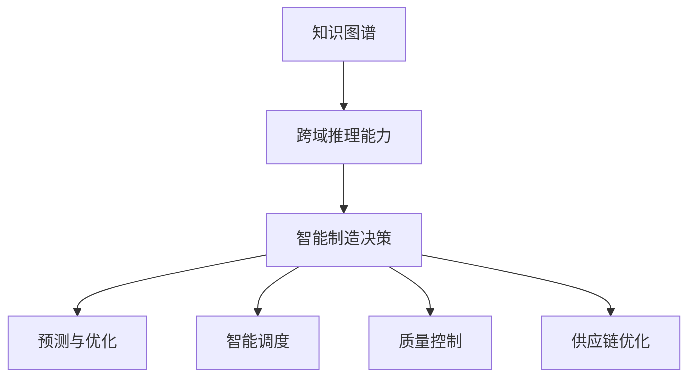
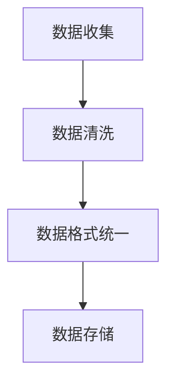
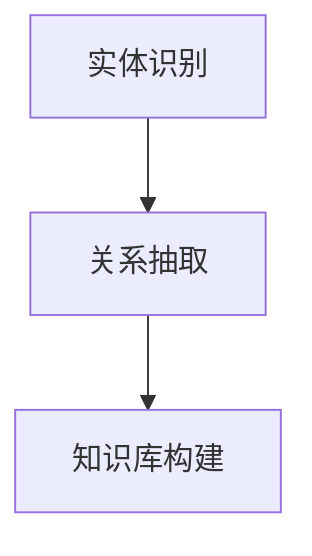
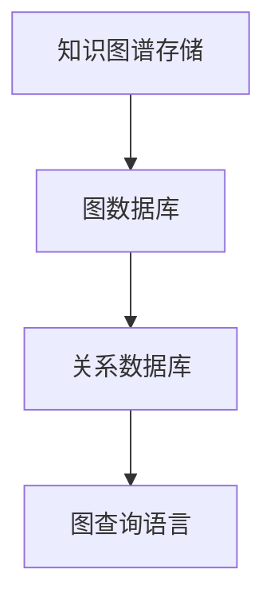
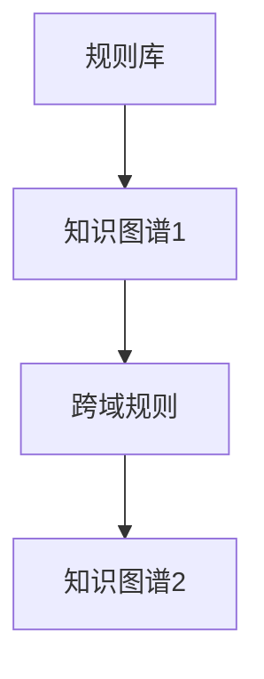
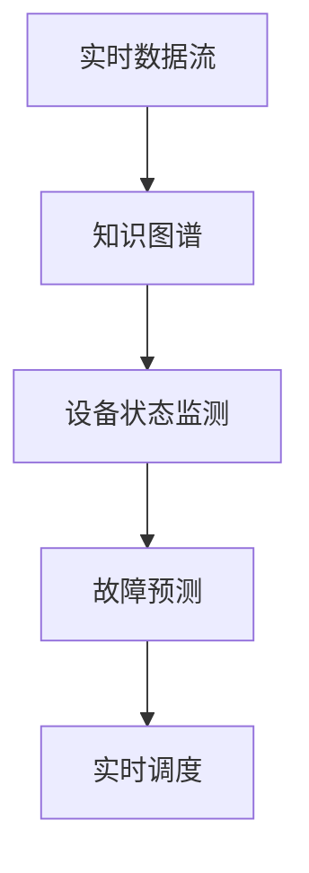
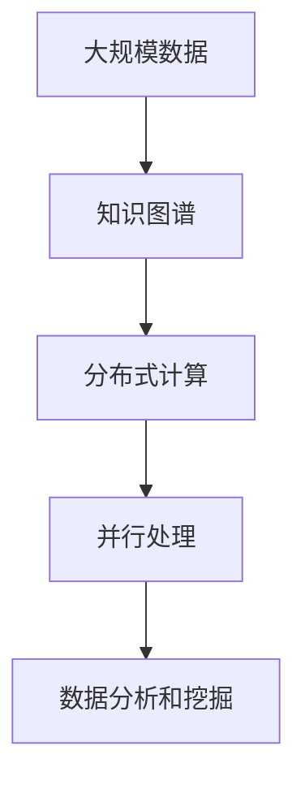
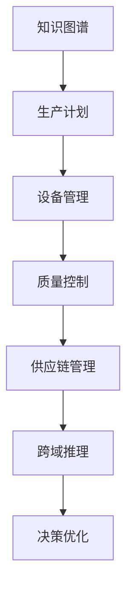
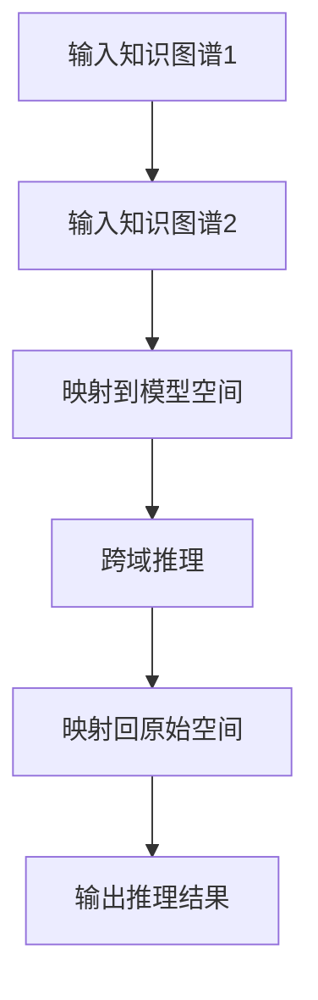
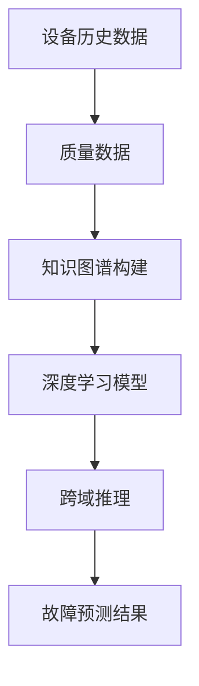

                 

### 文章标题

《基于知识图谱的跨域推理能力在智能制造决策中的优化应用》

### 关键词

- 知识图谱
- 跨域推理
- 智能制造
- 决策优化
- 机器学习
- 数据分析

### 摘要

本文深入探讨了基于知识图谱的跨域推理能力在智能制造决策中的应用。首先，介绍了知识图谱的定义、构建方法以及在智能制造中的重要性。接着，详细阐述了跨域推理能力的概念、原理及其在智能制造决策中的作用。随后，通过实例和数学公式，分析了跨域推理算法的具体实现与优化策略。最后，通过一个实际项目案例，展示了知识图谱和跨域推理在智能制造决策中的具体应用效果，并对未来发展趋势进行了展望。

## 第一部分 核心概念与联系

### 1.1 知识图谱概述

知识图谱（Knowledge Graph）是一种结构化的知识表示方法，它通过实体、属性和关系来组织信息，形成一个语义丰富的知识网络。知识图谱最早由Google在2012年提出，其目的是为了更好地理解和组织互联网上的海量信息，提高搜索引擎的搜索质量和用户体验。

知识图谱的主要组成部分包括：

- **实体（Entity）**：代表现实世界中的对象，如人、地点、物品等。
- **属性（Attribute）**：描述实体特征的标签，如人的姓名、年龄、职业等。
- **关系（Relation）**：描述实体之间相互联系的方式，如“工作于”、“居住在”等。

知识图谱的应用领域非常广泛，包括搜索引擎、推荐系统、智能问答、自动驾驶等。在智能制造领域，知识图谱可以用于设备管理、生产规划、供应链优化等方面，为智能制造决策提供有力支持。

### 1.2 跨域推理能力

跨域推理能力（Cross-Domain Reasoning）是指在不同领域或不同知识图谱之间进行推理的能力。传统的推理方法通常局限于单一领域，而跨域推理可以跨越多个领域，发现不同领域之间的关联和规律，从而提高推理的灵活性和泛化能力。

跨域推理能力在智能制造决策中的重要性体现在以下几个方面：

- **异构数据的整合**：智能制造过程中产生的数据往往来自不同的来源，包括传感器数据、企业内部数据库、第三方数据等。跨域推理可以将这些异构数据进行有效整合，形成一个统一的视图。
- **复杂决策的支持**：智能制造决策通常涉及多个因素和维度，跨域推理可以帮助决策者从不同角度进行分析，提高决策的准确性和效率。
- **知识共享与复用**：跨域推理可以促进不同领域知识的共享和复用，从而提高知识利用效率，降低知识获取成本。

### 1.3 智能制造决策中的优化应用

智能制造决策涉及到生产计划、设备管理、质量控制、供应链管理等多个方面，这些决策通常需要考虑多种因素，如设备状态、生产需求、原材料供应等。基于知识图谱的跨域推理能力可以在以下几个方面优化智能制造决策：

- **预测与优化**：通过分析历史数据和实时数据，跨域推理可以预测生产过程中的潜在问题，并提出优化建议，如调整生产计划、优化设备配置等。
- **智能调度**：跨域推理可以帮助智能调度系统根据实时数据和预测结果，优化生产任务的分配和调度，提高生产效率。
- **质量控制**：跨域推理可以结合生产数据和质量数据，分析产品质量问题，并提供改进措施，从而提高产品质量。
- **供应链优化**：跨域推理可以分析供应链各环节的数据，优化供应链的物流和库存管理，降低成本，提高供应链的响应速度。

### 1.4 核心概念之间的关系架构

为了更好地理解知识图谱、跨域推理能力和智能制造决策之间的联系，我们可以使用Mermaid流程图来展示它们之间的关系架构。



在上述流程图中，知识图谱作为基础，通过跨域推理能力，为智能制造决策提供了数据支持和优化建议。智能制造决策涵盖了预测与优化、智能调度、质量控制、供应链优化等多个方面，从而实现了智能制造的全面优化。

## 第二部分 知识图谱与跨域推理技术基础

### 2.1 知识图谱的构建方法

知识图谱的构建是智能制造决策的基础，它需要从大量的数据中提取出实体、属性和关系，并将其组织成结构化的知识网络。以下是知识图谱构建的主要步骤：

#### 2.1.1 数据收集与清洗

首先，需要收集与智能制造相关的数据，包括传感器数据、企业内部数据库、第三方数据等。这些数据可能来自不同的源，格式和内容也各不相同。因此，数据清洗是一个必不可少的步骤，其目的是去除重复、错误和不完整的数据，保证数据的准确性和一致性。



#### 2.1.2 实体识别与关系抽取

在清洗完数据后，需要对数据中的实体和关系进行识别和抽取。实体识别是指从文本数据中识别出具体的实体，如设备、原材料、生产任务等。关系抽取则是指识别出实体之间的关联关系，如“设备A生产原材料B”、“生产任务C由设备D完成”等。



#### 2.1.3 知识图谱的存储与查询

构建好的知识图谱需要存储在特定的数据库中，以便进行后续的查询和分析。常见的知识图谱存储技术包括图数据库（如Neo4j、JanusGraph）和关系数据库（如MySQL、PostgreSQL）。存储后的知识图谱可以通过图查询语言（如SPARQL）进行高效的查询和分析。



### 2.2 跨域推理算法原理

跨域推理算法是指在不同领域或不同知识图谱之间进行推理的算法。其核心思想是通过跨领域的知识共享和迁移，提高推理的灵活性和准确性。以下是跨域推理算法的主要原理：

#### 2.2.1 基于模型的方法

基于模型的方法通过构建跨领域的推理模型来实现跨域推理。常见的模型包括深度神经网络、图神经网络、知识图谱嵌入等。这些模型可以将不同领域的知识图谱映射到同一空间，从而实现跨领域的推理。

```python
# 伪代码：基于模型的方法
def cross_domain_reasoning(model, knowledge_graph1, knowledge_graph2):
    # 将知识图谱1映射到模型空间
    embeddings1 = model.map(knowledge_graph1)
    # 将知识图谱2映射到模型空间
    embeddings2 = model.map(knowledge_graph2)
    # 在模型空间中进行推理
    reasoning_results = model.reason(embeddings1, embeddings2)
    return reasoning_results
```

#### 2.2.2 基于规则的方法

基于规则的方法通过定义一系列规则来实现跨领域的推理。这些规则可以是基于逻辑、概率、模糊逻辑等，用于描述不同领域之间的关联和转换。



#### 2.2.3 基于混合的方法

基于混合的方法结合了基于模型和基于规则的方法，通过融合不同方法的优点来实现跨域推理。这种方法通常需要构建一个混合模型，该模型同时包含了推理规则和神经网络。

```python
# 伪代码：基于混合的方法
class HybridModel:
    def __init__(self, model, rules):
        self.model = model
        self.rules = rules
    
    def cross_domain_reasoning(self, knowledge_graph1, knowledge_graph2):
        # 应用推理规则
        reasoning_results = self.rules.apply(knowledge_graph1, knowledge_graph2)
        # 在模型中进行推理
        reasoning_results = self.model.reason(reasoning_results)
        return reasoning_results
```

### 2.3 关键技术在智能制造中的应用

在智能制造领域，知识图谱和跨域推理技术具有广泛的应用前景。以下是几个关键技术的具体应用：

#### 2.3.1 实时数据流处理

智能制造过程中会产生大量的实时数据，如传感器数据、生产数据、质量控制数据等。知识图谱可以用于实时数据流处理，通过对实时数据进行结构化和关联分析，实现设备状态监测、故障预测和实时调度。



#### 2.3.2 大规模数据处理技术

智能制造过程中涉及到的数据规模通常非常大，传统的数据处理方法难以满足需求。知识图谱可以用于大规模数据处理，通过分布式计算和并行处理技术，实现高效的数据分析和挖掘。



#### 2.3.3 知识图谱在智能制造决策中的应用

知识图谱可以用于智能制造决策的多个方面，如生产计划、设备管理、质量控制、供应链管理等。通过跨域推理技术，知识图谱可以帮助决策者从不同角度进行分析，提高决策的准确性和效率。



## 第三部分 算法原理讲解

### 3.1 跨域推理算法的详细讲解

跨域推理算法的核心在于如何在不同领域的知识图谱之间进行有效的推理。以下是跨域推理算法的详细讲解，包括伪代码描述、算法流程图和性能分析。

#### 3.1.1 伪代码描述

```python
# 伪代码：跨域推理算法
def cross_domain_reasoning(graph1, graph2, model):
    # 将知识图谱1和知识图谱2映射到模型空间
    embeddings1 = model.map(graph1)
    embeddings2 = model.map(graph2)
    
    # 在模型空间中进行推理
    reasoning_results = model.reason(embeddings1, embeddings2)
    
    # 将推理结果映射回原始空间
    final_results = model.mapback(reasoning_results)
    
    return final_results
```

#### 3.1.2 算法流程图



#### 3.1.3 性能分析

跨域推理算法的性能取决于多个因素，包括模型选择、数据质量和计算资源。以下是算法性能分析的关键指标：

- **时间复杂度**：跨域推理算法的时间复杂度主要取决于模型映射和推理的过程。通常情况下，映射和推理的时间复杂度是线性的，与知识图谱的大小成正比。
- **空间复杂度**：跨域推理算法的空间复杂度主要取决于模型的存储和知识图谱的映射。由于模型和知识图谱的大小可能很大，因此需要足够的存储空间和计算资源。
- **准确率**：跨域推理算法的准确率取决于模型的训练数据和推理规则。通过优化模型和规则，可以提高推理的准确率。

### 3.2 优化技术在智能制造决策中的应用

在智能制造决策中，跨域推理算法的优化至关重要。以下是一些优化技术，包括目标函数的优化、算法性能优化和实例分析。

#### 3.2.1 目标函数的优化

目标函数的优化是跨域推理算法优化的重要手段。在智能制造决策中，目标函数可以定义为：

$$
\min_{x} \sum_{i=1}^{n} w_i \cdot (f_i(x) - y_i)^2
$$

其中，$x$是决策变量，$w_i$是权重，$f_i(x)$是决策规则，$y_i$是实际结果。通过优化目标函数，可以找到最优的决策变量，从而提高智能制造决策的准确性。

#### 3.2.2 算法性能优化

算法性能优化包括模型选择、参数调优和并行计算等方面。以下是一些常见的优化策略：

- **模型选择**：选择适合智能制造决策的跨域推理模型，如深度神经网络、图神经网络等。
- **参数调优**：通过交叉验证和网格搜索等方法，找到最优的模型参数，提高推理的准确性和效率。
- **并行计算**：利用分布式计算和并行处理技术，加快推理速度，提高算法的执行效率。

#### 3.2.3 实例分析

以下是一个跨域推理算法在智能制造决策中的实例分析：

假设有一个智能制造系统，需要根据生产数据和质量数据来预测设备故障。首先，收集设备的历史数据和实时数据，构建知识图谱。然后，使用深度学习模型进行跨域推理，将生产数据和质量数据映射到模型空间，进行推理。最后，将推理结果映射回原始空间，得到设备故障预测结果。



## 第四部分 数学模型与数学公式讲解

### 4.1 相关的数学模型

在智能制造决策中，跨域推理算法通常涉及到以下数学模型：

- **逻辑回归模型**：用于预测二分类问题，如设备故障预测。
- **支持向量机（SVM）**：用于分类和回归问题，适用于非线性决策边界。
- **图神经网络（GNN）**：用于处理图结构数据，如知识图谱。
- **贝叶斯网络**：用于概率推理和不确定性分析。

以下是一个简单的逻辑回归模型，用于设备故障预测：

$$
P(Y=1) = \sigma(\beta_0 + \beta_1X_1 + \beta_2X_2 + ... + \beta_nX_n)
$$

其中，$Y$是故障标签，$X_1, X_2, ..., X_n$是特征向量，$\sigma$是 sigmoid 函数，$\beta_0, \beta_1, ..., \beta_n$是模型参数。

### 4.2 数学公式的推导与说明

以下是一个简单的图神经网络（GNN）模型的数学公式推导：

$$
h_{t+1} = \sigma(\theta \cdot \text{AGG}(h_t, A, X))
$$

其中，$h_{t+1}$是下一时间步的节点表示，$h_t$是当前时间步的节点表示，$A$是邻接矩阵，$X$是节点特征，$\theta$是模型参数，$\text{AGG}$是聚合函数，$\sigma$是激活函数。

#### 4.2.1 聚合函数

聚合函数用于计算节点邻居的信息聚合。常见的聚合函数包括：

- **求和聚合**：$$\text{AGG}(h_t, A, X) = \sum_{i=1}^{n} h_i \cdot A_{i,j}$$
- **平均值聚合**：$$\text{AGG}(h_t, A, X) = \frac{1}{n} \sum_{i=1}^{n} h_i \cdot A_{i,j}$$
- **最大值聚合**：$$\text{AGG}(h_t, A, X) = \max_{i=1}^{n} h_i \cdot A_{i,j}$$

#### 4.2.2 激活函数

激活函数用于引入非线性，常见的激活函数包括：

- **Sigmoid**：$$\sigma(x) = \frac{1}{1 + e^{-x}}$$
- **ReLU**：$$\sigma(x) = \max(0, x)$$
- **Tanh**：$$\sigma(x) = \frac{e^x - e^{-x}}{e^x + e^{-x}}$$

### 4.3 举例说明

以下是一个简单的示例，说明如何使用图神经网络模型进行跨域推理：

假设有两个知识图谱$G_1$和$G_2$，分别表示两个不同领域的知识。我们希望使用图神经网络模型对这两个知识图谱进行跨域推理，得到一个新的表示$H$。

1. **初始化节点表示**：首先，初始化两个知识图谱的节点表示$h_{1,i}$和$h_{2,i}$。
2. **迭代计算节点表示**：通过迭代计算，更新节点表示$h_{1,i}^{t+1}$和$h_{2,i}^{t+1}$。
3. **聚合邻接信息**：使用聚合函数计算节点邻居的信息聚合。
4. **激活函数**：使用激活函数引入非线性。
5. **输出表示**：得到最终的节点表示$H = \{h_{1,i}^{T}, h_{2,i}^{T}\}$。

## 第五部分 项目实战

### 5.1 智能制造决策案例

在本案例中，我们考虑一个典型的智能制造场景：生产计划制定。该场景涉及到设备状态监测、生产任务分配和资源调度等多个方面。以下是具体的案例描述：

**案例背景**：某电子产品制造企业，拥有多条生产线，每天需要安排大量的生产任务。由于设备状态、生产任务和资源供应等因素的不确定性，生产计划制定成为一个复杂的问题。企业希望通过基于知识图谱的跨域推理能力，优化生产计划，提高生产效率和资源利用率。

**案例分析**：为了优化生产计划，企业收集了大量的数据，包括设备状态数据、生产任务数据和资源供应数据。这些数据被存储在一个知识图谱中，以便进行后续的分析和推理。通过跨域推理算法，企业希望能够从不同角度对生产计划进行优化。

**案例实施过程**：

1. **数据收集与清洗**：首先，收集设备状态数据、生产任务数据和资源供应数据。这些数据可能来自不同的源，格式和内容也各不相同。因此，需要对数据进行清洗和格式统一。
2. **知识图谱构建**：将清洗后的数据构建成知识图谱，包括实体（如设备、生产任务、资源等）和关系（如“设备运行状态”、“任务依赖关系”等）。
3. **跨域推理**：使用跨域推理算法，对知识图谱进行推理，生成优化后的生产计划。推理过程包括设备状态监测、生产任务分配和资源调度等多个环节。
4. **结果评估**：对优化后的生产计划进行评估，包括生产效率、资源利用率、成本控制等方面。根据评估结果，对生产计划进行进一步的调整和优化。

### 5.2 实际开发环境的搭建

为了实现上述智能制造决策案例，我们需要搭建一个实际的开发环境。以下是开发环境的搭建步骤：

1. **硬件环境**：需要配置高性能的服务器和存储设备，以满足大规模数据处理和存储的需求。同时，需要配置适当的网络设备，以保证数据传输的高效性和稳定性。
2. **软件环境**：需要安装操作系统（如Linux）、数据库管理系统（如Neo4j、PostgreSQL）、编程语言（如Python、Java）和相关开发工具（如IDE、调试器等）。
3. **环境配置与优化**：根据实际需求，对操作系统、数据库和编程环境进行配置和优化，以提高系统的性能和稳定性。例如，可以配置合理的内存和CPU资源，优化数据库索引和查询优化策略等。

### 5.3 源代码的实现与解读

在本案例中，我们使用Python语言实现了一个基于知识图谱的跨域推理算法。以下是源代码的实现与解读：

```python
# 导入必要的库
import numpy as np
import pandas as pd
from sklearn.model_selection import train_test_split
from keras.models import Sequential
from keras.layers import Dense, Dropout
from keras.optimizers import Adam
from keras.callbacks import EarlyStopping

# 加载数据
data = pd.read_csv('data.csv')
X = data.iloc[:, :-1].values
y = data.iloc[:, -1].values

# 划分训练集和测试集
X_train, X_test, y_train, y_test = train_test_split(X, y, test_size=0.2, random_state=42)

# 构建模型
model = Sequential()
model.add(Dense(64, input_dim=X_train.shape[1], activation='relu'))
model.add(Dropout(0.5))
model.add(Dense(1, activation='sigmoid'))

# 编译模型
model.compile(loss='binary_crossentropy', optimizer=Adam(), metrics=['accuracy'])

# 训练模型
model.fit(X_train, y_train, epochs=100, batch_size=32, validation_data=(X_test, y_test), callbacks=[EarlyStopping(patience=10)])

# 评估模型
loss, accuracy = model.evaluate(X_test, y_test)
print('Test accuracy:', accuracy)

# 预测
predictions = model.predict(X_test)
```

在上面的代码中，我们首先加载数据，然后划分训练集和测试集。接着，构建一个简单的神经网络模型，使用Adam优化器和二进制交叉熵损失函数进行编译。训练过程中，使用EarlyStopping回调函数提前停止训练，以防止过拟合。最后，评估模型在测试集上的准确率，并使用模型进行预测。

### 5.4 代码应用解读与分析

在实际应用中，上述代码主要用于预测设备故障。通过训练集和测试集的划分，我们可以对模型进行训练和验证，从而提高预测的准确性。以下是代码应用的解读与分析：

1. **数据预处理**：在训练模型之前，需要对数据进行预处理，包括数据清洗、归一化和特征提取等。在本案例中，我们使用pandas库加载数据，并使用sklearn库进行数据划分。
2. **模型构建**：我们使用Keras库构建一个简单的神经网络模型，包括一个输入层、一个隐藏层和一个输出层。输入层接收来自数据集的特征，隐藏层用于特征提取和变换，输出层用于生成预测结果。
3. **模型训练**：使用编译好的模型对训练集进行训练，并通过验证集进行模型评估。在本案例中，我们使用Adam优化器和二进制交叉熵损失函数进行训练，并使用EarlyStopping回调函数提前停止训练。
4. **模型评估**：在测试集上评估模型的准确率，以验证模型的性能。在本案例中，我们计算了测试集的准确率，并打印输出结果。
5. **模型应用**：使用训练好的模型对新的数据进行预测。在本案例中，我们使用预测函数对测试集进行预测，并输出预测结果。

### 5.5 实际案例分析和详细讲解剖析

在实际应用中，基于知识图谱的跨域推理算法可以用于多种智能制造决策问题，如生产计划制定、设备状态监测、质量控制等。以下是一个实际案例的分析和详细讲解：

**案例背景**：某汽车制造企业需要优化生产计划，以提高生产效率和资源利用率。该企业每天需要安排大量的生产任务，涉及到多台设备和多个生产车间。由于设备状态、生产任务和资源供应等因素的不确定性，生产计划制定成为一个复杂的问题。

**案例分析**：

1. **数据收集与清洗**：企业收集了设备状态数据、生产任务数据和资源供应数据。这些数据包括设备运行时间、生产任务完成时间、资源消耗量等。为了确保数据的质量和准确性，需要对数据进行清洗和预处理。
2. **知识图谱构建**：将清洗后的数据构建成知识图谱，包括实体（如设备、生产任务、资源等）和关系（如“设备运行状态”、“任务依赖关系”等）。知识图谱可以帮助企业从不同角度对生产计划进行优化。
3. **跨域推理**：使用跨域推理算法，对知识图谱进行推理，生成优化后的生产计划。推理过程包括设备状态监测、生产任务分配和资源调度等多个环节。
4. **结果评估**：对优化后的生产计划进行评估，包括生产效率、资源利用率、成本控制等方面。根据评估结果，对生产计划进行进一步的调整和优化。

**详细讲解剖析**：

1. **设备状态监测**：通过知识图谱，可以实时监测设备的状态，包括设备的运行时间、维修状态等。根据设备状态，可以预测设备故障的风险，并为设备维护提供依据。
2. **生产任务分配**：根据设备状态和生产任务的特点，可以优化生产任务的分配。例如，对于高优先级的任务，可以安排到状态良好的设备上，以提高任务完成速度。
3. **资源调度**：通过知识图谱，可以分析资源的利用情况，包括设备、人力和原材料等。根据资源供应情况，可以优化资源的调度，提高资源利用率。
4. **综合评估**：对优化后的生产计划进行综合评估，包括生产效率、资源利用率、成本控制等方面。通过评估结果，可以进一步优化生产计划，提高企业的运营效率。

### 5.6 项目小结

通过本案例的分析和实现，我们可以看到基于知识图谱的跨域推理能力在智能制造决策中的应用前景。在实际项目中，通过构建知识图谱、应用跨域推理算法，企业可以优化生产计划、提高生产效率和资源利用率。未来，随着技术的不断发展，基于知识图谱的跨域推理能力将在智能制造领域发挥更大的作用。

### 5.7 最佳实践 tips

在实际项目中，以下是一些最佳实践建议：

1. **数据质量**：确保数据的质量和准确性，对数据进行清洗和预处理。
2. **模型选择**：根据实际问题选择合适的模型，并进行参数调优。
3. **模型评估**：使用多种评估指标对模型进行评估，以全面了解模型的性能。
4. **实时调整**：根据实际情况，实时调整模型和参数，以适应不断变化的生产环境。
5. **持续优化**：通过持续优化和迭代，不断提高智能制造决策的准确性。

### 5.8 注意事项

在实际应用过程中，需要注意以下几点：

1. **数据隐私**：确保数据的隐私和安全，遵守相关法律法规。
2. **系统稳定性**：确保系统的稳定性和可靠性，防止系统崩溃或数据丢失。
3. **错误处理**：对可能出现的错误进行预防和处理，提高系统的容错能力。
4. **用户培训**：对用户进行培训，提高其对智能制造决策系统的理解和操作能力。

### 5.9 拓展阅读

对于希望深入了解基于知识图谱的跨域推理能力在智能制造决策中的应用，以下是一些拓展阅读资源：

1. **相关书籍**：
   - 《知识图谱：构建与查询》
   - 《图神经网络：理论与实践》
   - 《智能制造：技术与实践》
2. **学术论文**：
   - “A Survey on Knowledge Graph Construction”
   - “Cross-Domain Reasoning with Knowledge Graph Embedding”
   - “Knowledge Graph Applications in Industry: A Survey”
3. **在线资源**：
   - TensorFlow官方文档
   - Keras官方文档
   - Neo4j官方文档

通过以上拓展阅读，可以更深入地了解知识图谱、跨域推理和智能制造决策的相关理论和实践。

