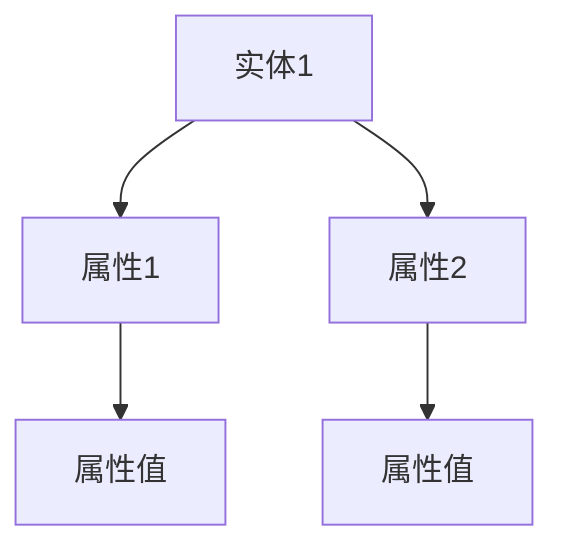
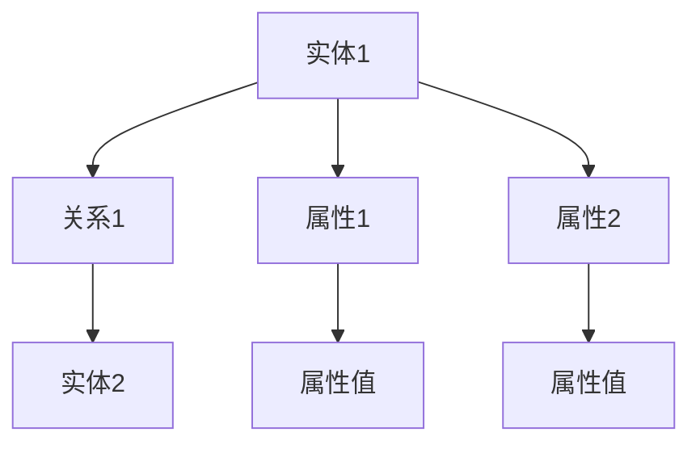
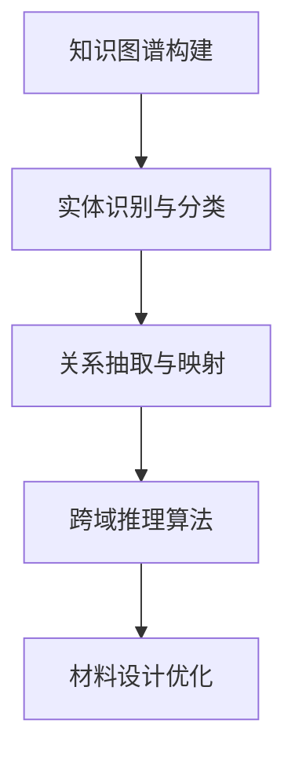
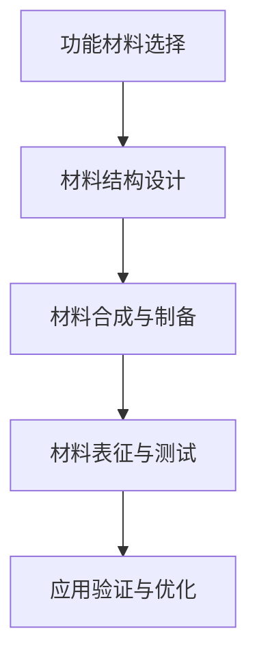

                 

### 文章标题

《基于知识图谱的跨域推理能力在智能材料设计中的优化应用》

> 关键词：知识图谱、跨域推理、智能材料设计、优化应用

摘要：本文深入探讨了知识图谱在智能材料设计中的优化应用，重点介绍了知识图谱的基础知识、跨域推理的核心原理及其在智能材料设计中的应用。通过详细讲解知识图谱的构建方法、跨域推理的关键技术以及智能材料设计的基本概念，本文提出了基于知识图谱的跨域推理在智能材料设计中的优化方案，并通过实际项目案例展示了其应用效果。本文旨在为研究人员和工程师提供一套系统化的指导，以推动知识图谱与智能材料设计的深度融合。

### 引言

在当今科技迅猛发展的时代，智能材料设计成为材料科学领域的研究热点。智能材料具有自我感知、自适应、自我修复等特性，能够在特定的外部刺激下发生响应，从而实现功能化、智能化。然而，智能材料的设计面临着数据量大、跨学科知识复杂、设计过程繁琐等挑战。为了解决这些问题，知识图谱作为一种高效的数据组织和管理方法，以及跨域推理作为一种强大的知识挖掘工具，逐渐被引入到智能材料设计中。

知识图谱是一种结构化的语义知识库，通过将实体、属性和关系进行建模，将复杂的语义信息以图的形式进行表达。它能够将大量的非结构化数据转化为结构化数据，提供了一种高效的信息检索和知识挖掘手段。跨域推理则是一种基于知识图谱的推理技术，通过跨越不同领域之间的知识连接，实现知识的共享和迁移。在智能材料设计中，知识图谱可以用于整合材料科学、物理学、化学等多领域的知识，而跨域推理可以用于发现新材料的设计规律和优化设计方案。

本文旨在探讨知识图谱和跨域推理在智能材料设计中的应用，通过逐步分析知识图谱的构建方法、跨域推理的核心原理及其在智能材料设计中的优化应用，为研究人员和工程师提供一套系统化的解决方案。本文的结构如下：

- 第1章 引言：介绍本文的背景、目的和结构。
- 第2章 知识图谱基础：介绍知识图谱的基本概念、构建方法和应用领域。
- 第3章 跨域推理能力：介绍跨域推理的基本原理、关键技术和应用实例。
- 第4章 智能材料设计概述：介绍智能材料的基本概念、设计方法和应用领域。
- 第5章 知识图谱在智能材料设计中的应用：介绍知识图谱在材料科学中的数据整合和应用。
- 第6章 跨域推理在智能材料设计中的应用：介绍跨域推理在材料性能预测中的优化应用。
- 第7章 智能材料设计中的优化算法：介绍基于知识图谱的优化算法原理和实现。
- 第8章 项目实战：介绍基于知识图谱的智能材料设计系统的开发实践。
- 第9章 总结与展望：总结本文的研究成果，并对未来发展趋势进行展望。

### 知识图谱基础

知识图谱（Knowledge Graph）是一种结构化的语义知识库，它通过将实体、属性和关系进行建模，将复杂的语义信息以图的形式进行表达。知识图谱的核心在于对实体和关系的准确建模，从而实现语义信息的有效组织和利用。以下是知识图谱的基本概念、构建方法和应用领域。

#### 基本概念

- **实体（Entity）**：知识图谱中的基本元素，表示现实世界中的事物，如人、地点、物品等。实体可以是具体的，也可以是抽象的。
- **属性（Attribute）**：描述实体的特征或属性的属性值。例如，一个人的姓名、年龄、职业等。
- **关系（Relationship）**：实体与实体之间的关联。例如，一个人与他的朋友、地点与它所在的区域等。

#### 构建方法

知识图谱的构建是一个复杂的过程，通常包括数据采集、数据预处理、实体识别、关系抽取、实体链接等步骤。

1. **数据采集**：从各种数据源（如文本、数据库、知识库等）中收集相关数据。
2. **数据预处理**：对采集到的数据进行清洗、去重、格式化等处理，以便于后续的实体识别和关系抽取。
3. **实体识别**：从预处理后的数据中识别出实体，并对其进行分类和标注。
4. **关系抽取**：从实体对中抽取关系，通常通过规则匹配、机器学习等方法实现。
5. **实体链接**：将不同数据源中的相同或相似的实体进行链接，形成一个统一的实体图谱。

#### 应用领域

知识图谱在多个领域都有广泛的应用，主要包括：

1. **搜索引擎**：通过知识图谱实现语义检索，提高搜索的准确性和用户体验。
2. **推荐系统**：利用知识图谱进行用户画像和物品关联分析，提供个性化推荐。
3. **自然语言处理**：通过知识图谱进行命名实体识别、关系抽取、语义解析等任务。
4. **智能问答**：利用知识图谱构建问答系统，实现智能客服、智能助理等功能。
5. **智能材料设计**：通过知识图谱整合多领域的知识，为智能材料设计提供支持。

#### 关系架构 Mermaid 流程图

为了更直观地展示知识图谱的关系架构，我们可以使用 Mermaid 流程图来描述。



在这个流程图中，实体1具有两个属性：属性1和属性2。属性1和属性值D关联，属性2和属性值E关联。

#### 核心概念原理之间的关系架构

在知识图谱中，实体、属性和关系之间存在着紧密的联系。实体是知识图谱的基础，属性描述实体的特征，而关系则将实体连接起来，形成复杂的知识网络。

1. **实体与属性的关系**：每个实体都有多个属性，属性用于描述实体的特征。例如，一个人实体可能具有姓名、年龄、职业等属性。
2. **属性与属性值的关系**：属性值是属性的取值，用于具体描述属性的内容。例如，一个人的年龄属性值可能是30岁。
3. **实体与关系的关系**：实体通过关系进行关联。例如，一个人与他的朋友之间存在着“朋友”关系。

这些核心概念之间的关系可以用 Mermaid 流程图进行描述：



在这个流程图中，实体1通过关系1与实体2关联，实体1具有属性1和属性2，属性1和属性值F关联，属性2和属性值G关联。

#### 核心算法原理讲解

在知识图谱的构建过程中，核心算法包括实体识别、关系抽取和实体链接。以下是这些算法的伪代码讲解。

1. **实体识别**：从文本数据中识别出实体，并将其分类和标注。

```python
def identify_entities(text):
    entities = []
    for sentence in text:
        tokens = tokenize(sentence)
        for token in tokens:
            if is_entity(token):
                entity = classify_entity(token)
                entities.append(entity)
    return entities
```

2. **关系抽取**：从实体对中抽取关系，通常通过规则匹配或机器学习模型实现。

```python
def extract_relationships(entities):
    relationships = []
    for entity1, entity2 in combinations(entities, 2):
        if match_rules(entity1, entity2):
            relationship = define_relationship(entity1, entity2)
            relationships.append(relationship)
    return relationships
```

3. **实体链接**：将不同数据源中的相同或相似的实体进行链接。

```python
def link_entities(entities1, entities2):
    links = []
    for entity1 in entities1:
        for entity2 in entities2:
            if are_similar_entities(entity1, entity2):
                link = create_link(entity1, entity2)
                links.append(link)
    return links
```

#### 数学模型和公式

知识图谱中的实体、属性和关系可以用数学模型进行描述。以下是一个简单的数学模型：

$$
E = \{e_1, e_2, ..., e_n\}
$$

表示实体集合。

$$
A = \{a_1, a_2, ..., a_m\}
$$

表示属性集合。

$$
R = \{r_1, r_2, ..., r_k\}
$$

表示关系集合。

实体与属性之间的关系可以表示为：

$$
e_i \rightarrow a_j, v_j
$$

其中，$e_i$表示实体$i$，$a_j$表示属性$j$，$v_j$表示属性值。

实体与关系之间的关系可以表示为：

$$
e_i \rightarrow r_j, e_j
$$

其中，$e_i$表示实体$i$，$r_j$表示关系$j$，$e_j$表示关联实体。

这些数学模型和公式为知识图谱的构建和应用提供了理论基础。

#### 举例说明

假设有一个关于人员的知识图谱，其中包含实体、属性和关系。以下是这个知识图谱的一个例子。

实体：张三、李四、王五

属性：姓名、年龄、职业

关系：工作于、朋友

实体与属性的关系：

- 张三 → 姓名，张三
- 张三 → 年龄，25
- 张三 → 职业，程序员
- 李四 → 姓名，李四
- 李四 → 年龄，30
- 李四 → 职业，产品经理
- 王五 → 姓名，王五
- 王五 → 年龄，28
- 王五 → 职业，设计师

实体与关系的关系：

- 张三 → 工作于，李四
- 张三 → 朋友，李四
- 张三 → 朋友，王五
- 李四 → 朋友，张三
- 李四 → 朋友，王五
- 王五 → 朋友，张三
- 王五 → 朋友，李四

通过这个例子，我们可以看到知识图谱如何将实体的属性和关系进行结构化表达，从而实现知识的组织和利用。

### 跨域推理能力

跨域推理（Cross-Domain Reasoning）是一种基于知识图谱的推理技术，它通过跨越不同领域之间的知识连接，实现知识的共享和迁移。在智能材料设计中，跨域推理可以帮助我们利用其他领域的知识，优化材料设计过程，提高设计效率和准确性。以下是跨域推理的基本原理、关键技术和应用实例。

#### 基本原理

跨域推理的基本原理可以概括为以下几点：

1. **知识融合**：将来自不同领域的知识进行整合，形成一个统一的语义知识库。
2. **知识映射**：通过知识映射技术，将不同领域中的实体、属性和关系进行对应和映射。
3. **推理策略**：利用推理策略，在不同领域的知识之间进行推理，发现新的关联和规律。

#### 关键技术

跨域推理的关键技术主要包括：

1. **知识图谱构建**：构建跨域的知识图谱，将不同领域的知识进行整合和表示。
2. **实体识别与分类**：通过实体识别技术，从多源数据中提取实体，并对其进行分类和标注。
3. **关系抽取与映射**：通过关系抽取技术，从多源数据中提取关系，并建立不同领域之间的对应关系。
4. **跨域推理算法**：设计跨域推理算法，实现跨领域知识的推理和迁移。

#### 应用实例

跨域推理在智能材料设计中的应用实例包括：

1. **材料性能预测**：通过跨域推理，将材料科学领域的知识与其他领域的知识（如物理学、化学等）进行整合，预测新材料的性能。
2. **材料设计优化**：利用跨域推理，发现不同领域中的材料设计规律，优化材料设计方案。
3. **材料缺陷检测**：通过跨域推理，将材料制造过程中的数据与其他领域的知识进行整合，检测材料缺陷。

以下是一个具体的跨域推理应用实例：

假设我们有一个关于材料性能的知识图谱，其中包含了不同材料在不同环境下的性能数据。我们希望通过跨域推理，发现新材料的设计规律，从而优化材料性能。

1. **知识图谱构建**：首先，构建一个跨域的知识图谱，整合材料科学、物理学、化学等领域的知识。知识图谱中的实体包括材料、环境、性能指标等。

2. **实体识别与分类**：从多源数据中提取材料实体，并对其实施分类和标注。例如，识别出某种材料的具体类型，如金属、陶瓷等。

3. **关系抽取与映射**：从多源数据中抽取材料与环境、性能指标之间的关系，并将其映射到知识图谱中。例如，将材料在高温环境下的性能数据映射到知识图谱中。

4. **跨域推理算法**：利用跨域推理算法，在不同领域之间的知识进行推理，发现新材料的设计规律。例如，通过分析不同材料在高温环境下的性能数据，发现某种材料在高温下的性能最优。

5. **材料设计优化**：基于跨域推理的结果，优化新材料的设计方案。例如，根据跨域推理发现的新材料设计规律，调整材料的成分和结构，提高其高温性能。

#### Mermaid 流程图

为了更直观地展示跨域推理的过程，我们可以使用 Mermaid 流程图进行描述。



在这个流程图中，知识图谱构建是跨域推理的基础，实体识别与分类、关系抽取与映射是实现跨域推理的关键步骤，而跨域推理算法和材料设计优化则是最终的应用目标。

### 智能材料设计概述

智能材料（Smart Materials）是一种具有自我感知、自适应、自我修复等特性的材料，它们能够在特定的外部刺激下发生响应，从而实现功能化、智能化。智能材料的设计涉及到材料科学、物理学、化学等多个领域，其目标是开发出具有特定功能的智能材料，以满足各种应用需求。

#### 基本概念

智能材料的基本概念包括以下几个方面：

1. **感知性**：智能材料能够感知外部环境的变化，如温度、压力、光照等。
2. **响应性**：智能材料能够对外部刺激产生响应，如形变、颜色变化、电导率变化等。
3. **自适应**：智能材料能够根据环境变化自动调整自身特性，以适应新的环境条件。
4. **自修复性**：智能材料能够通过自身机制修复损伤，恢复原有功能。

#### 设计方法

智能材料的设计方法主要包括以下几个方面：

1. **功能材料选择**：根据应用需求，选择具有特定功能的材料，如导电材料、光敏材料、热敏材料等。
2. **材料结构设计**：通过设计材料的微观结构和宏观形态，实现材料的特定功能。
3. **材料合成与制备**：采用先进的合成技术，制备出具有优异性能的智能材料。
4. **材料表征与测试**：对制备的智能材料进行表征和测试，验证其功能性能。

#### 应用领域

智能材料在众多领域具有广泛的应用，包括：

1. **生物医学**：用于生物组织工程、药物传递、生物传感器等。
2. **航空航天**：用于飞行器结构、智能涂层、航天器表面材料等。
3. **能源**：用于能源存储、转换、管理，如电池、太阳能电池等。
4. **环境**：用于环境监测、污染治理、生态修复等。
5. **智能家居**：用于智能家具、智能家电、智能建筑等。

#### 绘制Mermaid流程图

为了更直观地展示智能材料设计的基本流程，我们可以使用 Mermaid 流程图进行描述。



在这个流程图中，功能材料选择是智能材料设计的起点，材料结构设计、材料合成与制备、材料表征与测试是实现智能材料设计的关键步骤，而应用验证与优化则是最终的目标。

### 知识图谱在智能材料设计中的应用

知识图谱（Knowledge Graph）作为一种结构化的语义知识库，在智能材料设计中的应用具有重要意义。通过整合多领域的知识，知识图谱可以为智能材料设计提供丰富的数据资源和强大的推理能力。以下是知识图谱在智能材料设计中的数据整合、应用实例及其对材料科学的影响。

#### 数据整合

知识图谱在智能材料设计中的第一步是数据整合。这涉及到从多种数据源中收集、清洗和预处理数据，以便形成一个统一的语义知识库。数据源可以包括：

1. **公开数据库**：如材料科学数据库、化学数据库、物理学数据库等，这些数据库提供了大量的材料属性、化学反应、物理性质等信息。
2. **科研文献**：通过自然语言处理技术，从学术文献中提取材料相关的知识，如材料合成方法、性能测试结果等。
3. **工业数据**：从工业生产过程中的传感器数据、实验室测试数据等，获取材料在实际应用中的表现。

数据整合的过程包括以下步骤：

1. **数据采集**：从各种数据源中收集相关数据，如文本、表格、图像等。
2. **数据清洗**：去除重复、错误和无关的数据，保证数据的质量。
3. **数据预处理**：对数据进行格式化、去噪、标准化等处理，以便于后续的实体识别和关系抽取。
4. **实体识别**：从预处理后的数据中识别出实体，如材料、反应、实验等。
5. **关系抽取**：从实体对中抽取关系，如材料与反应、材料与性能指标等。

通过数据整合，知识图谱能够将来自不同领域的知识进行结构化表达，形成一个统一的语义知识库，为智能材料设计提供丰富的数据支持。

#### 应用实例

知识图谱在智能材料设计中的应用实例包括以下几个方面：

1. **新材料发现**：通过知识图谱，可以快速发现具有潜在应用价值的新材料。例如，通过分析材料合成反应和性能数据，发现某种材料具有优异的电学性能，从而引导新材料的研究和开发。

2. **材料性能预测**：利用知识图谱中的关联关系，可以预测新材料在不同条件下的性能。例如，通过分析类似材料的性能数据，预测新材料的机械强度、导电性等性能。

3. **材料设计优化**：知识图谱可以帮助设计人员快速了解材料的属性和性能，从而优化材料设计方案。例如，通过分析知识图谱中的材料关系，选择合适的材料组合，以提高材料的整体性能。

4. **材料缺陷检测**：知识图谱可以用于检测材料制造过程中的缺陷。例如，通过分析知识图谱中的材料属性和制造过程数据，发现可能导致材料缺陷的因素，从而优化制造工艺。

以下是知识图谱在智能材料设计中的一个具体应用实例：

假设某材料设计团队希望开发一种具有高导电性的智能材料，用于电子器件的应用。他们首先通过知识图谱整合了多种数据源，包括材料科学数据库、化学数据库和科研文献等。通过数据预处理和实体识别，他们识别出与导电性相关的材料实体和性能指标。

接下来，他们利用知识图谱中的关联关系，分析具有高导电性的材料。例如，他们发现某些金属氧化物材料在高温环境下具有优异的导电性，并且这些材料在工业生产中已经得到广泛应用。

基于这些分析结果，设计团队选择了金属氧化物作为基础材料，并进行了结构优化和性能测试。通过知识图谱中的材料关系，他们发现某种金属氧化物的晶体结构在特定条件下可以进一步提高导电性。

最终，设计团队开发出了一种具有高导电性的智能材料，并在电子器件中进行了验证。实验结果显示，这种材料显著提高了电子器件的性能，证明了知识图谱在智能材料设计中的重要作用。

#### 对材料科学的影响

知识图谱的引入对材料科学产生了深远的影响：

1. **知识发现**：知识图谱帮助研究人员快速发现新的材料和应用领域，促进材料科学的创新和发展。
2. **设计优化**：知识图谱提供了丰富的材料数据资源，支持材料设计优化，提高材料性能和效率。
3. **数据共享**：知识图谱实现了不同领域之间的知识共享和整合，促进了多学科的交叉与合作。
4. **智能决策**：知识图谱支持智能化的材料设计决策，通过跨域推理和性能预测，提高材料设计的准确性和可靠性。

总之，知识图谱在智能材料设计中的应用，不仅提高了材料设计效率，也为材料科学的发展注入了新的动力。

### 跨域推理在智能材料设计中的应用

跨域推理（Cross-Domain Reasoning）在智能材料设计中发挥着重要作用。通过跨域推理，设计人员可以利用来自不同领域的知识，优化材料设计方案，提高材料性能。以下是跨域推理在智能材料设计中的应用、实现方法及其在性能预测和设计优化方面的具体案例。

#### 应用

跨域推理在智能材料设计中的应用主要包括以下几个方面：

1. **性能预测**：利用跨域推理，可以从不同领域（如物理学、化学、材料科学等）的知识中提取相关信息，预测新材料的性能。例如，通过跨领域知识整合，可以预测新材料的导电性、机械强度、热稳定性等。
2. **设计优化**：基于跨域推理，设计人员可以从多个领域中发现材料设计中的规律和模式，从而优化材料设计方案。例如，通过分析不同领域中的成功案例，设计人员可以借鉴经验，优化材料的成分和结构。
3. **材料缺陷检测**：跨域推理可以帮助检测材料制造过程中的潜在缺陷。例如，通过分析不同领域中的异常数据，可以识别出可能导致材料缺陷的因素，从而改进制造工艺。

#### 实现方法

跨域推理的实现方法主要包括以下步骤：

1. **知识图谱构建**：构建一个跨领域的知识图谱，整合来自不同领域的知识。知识图谱中的实体包括材料、性能指标、制造过程等，关系则表示不同实体之间的关联。
2. **实体识别与分类**：从多源数据中识别出与智能材料设计相关的实体，并对其实施分类和标注。
3. **关系抽取与映射**：从实体对中抽取关系，并将其映射到知识图谱中。例如，将材料与性能指标之间的关系映射到知识图谱中。
4. **跨域推理算法**：设计跨域推理算法，实现跨领域知识的推理和迁移。常见的跨域推理算法包括基于图神经网络（Graph Neural Networks, GNN）的算法、基于迁移学习的算法等。

#### 性能预测

跨域推理在性能预测中的应用主要是通过以下步骤实现的：

1. **数据收集**：从多个领域的数据源中收集与材料性能相关的数据，如材料的物理性质、化学成分、制造工艺等。
2. **知识图谱构建**：构建一个跨领域的知识图谱，整合上述数据，建立材料性能与不同因素之间的关系。
3. **性能预测模型**：利用知识图谱中的关系，设计一个性能预测模型。该模型可以通过机器学习算法实现，如回归分析、支持向量机（SVM）、深度学习等。
4. **性能预测**：使用训练好的性能预测模型，对新材料的性能进行预测。通过输入新材料的相关参数，模型可以预测其性能指标。

以下是一个跨域推理在性能预测中的具体案例：

假设研究人员希望预测一种新型导电材料在不同温度下的导电性。他们首先收集了多种导电材料的物理性质、化学成分和制造工艺数据，并构建了一个跨领域的知识图谱。知识图谱中包含了材料与导电性之间的关系，以及不同因素对导电性的影响。

接下来，研究人员利用知识图谱中的关系，设计了一个基于深度学习的性能预测模型。模型通过学习知识图谱中的数据，可以预测新材料在不同温度下的导电性。

最后，研究人员输入新型导电材料的相关参数，如化学成分、制造工艺等，模型预测了新材料在不同温度下的导电性。实验结果验证了模型的准确性，为新型导电材料的设计提供了重要参考。

#### 设计优化

跨域推理在设计优化中的应用主要是通过以下步骤实现的：

1. **知识图谱构建**：构建一个跨领域的知识图谱，整合与材料设计相关的知识，如材料成分、结构、性能等。
2. **设计优化算法**：设计一个基于知识图谱的设计优化算法，该算法可以通过优化材料的成分和结构，提高材料的性能。
3. **设计优化**：利用设计优化算法，对材料设计方案进行优化。算法可以通过迭代计算，逐步优化材料的成分和结构，直到满足设计要求。

以下是一个跨域推理在设计优化中的具体案例：

假设研究人员希望设计一种具有高导电性的导电材料。他们首先构建了一个跨领域的知识图谱，整合了与导电材料相关的知识，如材料的化学成分、晶体结构、导电性等。

接下来，研究人员设计了一个基于知识图谱的设计优化算法。该算法通过分析知识图谱中的数据，优化材料的成分和结构。例如，算法可以通过调整材料的化学成分，使其具有更高的导电性。

最后，研究人员利用设计优化算法，对导电材料的设计方案进行了优化。优化后的材料在导电性方面取得了显著提升，满足设计要求。

总之，跨域推理在智能材料设计中的应用，为材料设计提供了强大的工具和方法，有助于提高材料性能和设计效率。

### 智能材料设计中的优化算法

在智能材料设计中，优化算法是提高材料性能和设计效率的重要手段。基于知识图谱的优化算法通过利用知识图谱中的结构和关系，实现材料成分和结构的优化。以下将介绍基于知识图谱的优化算法原理、设计方法和实现步骤。

#### 算法原理

基于知识图谱的优化算法原理主要包括以下几个方面：

1. **知识图谱构建**：首先构建一个跨领域的知识图谱，整合材料科学、物理学、化学等领域的知识，形成结构化的知识库。
2. **实体与关系表示**：在知识图谱中，实体表示材料、性能指标、反应等，关系表示不同实体之间的关联。例如，材料与性能指标之间的关系、材料合成反应等。
3. **优化目标定义**：根据设计需求，定义优化目标。例如，提高材料的导电性、机械强度或热稳定性等。
4. **算法设计**：设计一个基于知识图谱的优化算法，通过搜索和计算，找到最优的成分和结构配置，实现材料性能的优化。

#### 设计方法

基于知识图谱的优化算法设计方法主要包括以下几个步骤：

1. **知识图谱构建**：收集和整合来自材料科学、物理学、化学等领域的知识，构建一个跨领域的知识图谱。知识图谱应包括实体和关系的表示，以及实体的属性和关系。
2. **优化目标定义**：根据设计需求，明确优化目标。例如，选择提高导电性作为优化目标，定义导电性为关键性能指标。
3. **优化算法选择**：选择适合的优化算法，如基于图论的算法、基于机器学习的算法、基于遗传算法的算法等。根据知识图谱的特点，选择能够有效利用知识图谱结构和关系的算法。
4. **算法实现**：根据选定的优化算法，设计算法的具体实现步骤，包括实体与关系的表示、优化目标的计算和优化过程的迭代。

#### 实现步骤

基于知识图谱的优化算法实现步骤如下：

1. **数据预处理**：对收集到的数据进行清洗、去噪和标准化处理，确保数据质量。
2. **知识图谱构建**：根据预处理后的数据，构建一个结构化的知识图谱，表示实体和关系。
3. **实体与关系表示**：在知识图谱中，为每个实体分配唯一的标识符，表示其实体类型和属性。为每对实体之间的关联定义关系，表示其关联类型和属性。
4. **优化目标计算**：根据优化目标，设计计算方法，计算每个成分和结构配置的性能指标。
5. **优化算法迭代**：利用选定的优化算法，进行多次迭代计算，逐步优化材料成分和结构，直到满足优化目标。
6. **结果分析**：对优化结果进行分析，验证材料性能的提升，并根据分析结果调整优化算法和设计参数。

以下是一个基于知识图谱的优化算法的伪代码示例：

```python
# 数据预处理
preprocess_data()

# 知识图谱构建
knowledge_graph = build_knowledge_graph()

# 实体与关系表示
entities = represent_entities(knowledge_graph)
relationships = represent_relationships(knowledge_graph)

# 优化目标计算
performance_metrics = calculate_performance_metrics(entities, relationships)

# 优化算法迭代
while not convergence:
    new_entities, new_relationships = optimize_entities_and_relationships(entities, relationships, performance_metrics)
    performance_metrics = calculate_performance_metrics(new_entities, new_relationships)

# 结果分析
analyze_results(performance_metrics)
```

在这个伪代码中，`preprocess_data()` 函数负责数据预处理，`build_knowledge_graph()` 函数负责构建知识图谱，`represent_entities()` 和 `represent_relationships()` 函数负责表示实体和关系，`calculate_performance_metrics()` 函数负责计算性能指标，`optimize_entities_and_relationships()` 函数负责优化实体和关系，`analyze_results()` 函数负责分析优化结果。

### 项目实战：基于知识图谱的智能材料设计系统开发

在智能材料设计领域，开发一个基于知识图谱的系统可以帮助研究人员和工程师更高效地进行材料设计。以下将介绍如何搭建开发环境、实现源代码和代码解读，并分析实际案例，最后进行项目小结。

#### 开发环境搭建

为了搭建一个基于知识图谱的智能材料设计系统，我们需要准备以下开发环境：

1. **编程语言**：选择Python作为主要编程语言，因为它具有丰富的库和框架支持。
2. **知识图谱框架**：选择Neo4j作为知识图谱数据库，它是一个高性能的图形数据库，支持图结构数据的存储和查询。
3. **开发工具**：使用PyCharm或Visual Studio Code作为IDE，方便代码编写和调试。
4. **数据预处理工具**：使用Python的数据预处理库，如Pandas、NumPy等。
5. **机器学习框架**：选择Scikit-learn或TensorFlow作为机器学习框架，用于训练和部署性能预测模型。

安装步骤如下：

1. 安装Neo4j数据库：在Neo4j官网下载并安装Neo4j数据库，并配置好环境。
2. 安装Python和相关库：打开终端或命令行窗口，执行以下命令：

   ```bash
   pip install neo4j
   pip install pandas
   pip install numpy
   pip install scikit-learn
   pip install tensorflow
   ```

3. 配置Neo4j与Python的连接：在Python代码中，使用Neo4j的Python客户端库（neo4j.py）连接到Neo4j数据库。

#### 源代码实现

以下是一个简单的示例，展示如何使用Python和Neo4j实现一个基于知识图谱的智能材料设计系统。

1. **数据预处理**：

   ```python
   import pandas as pd

   # 读取材料数据
   materials_data = pd.read_csv('materials.csv')

   # 数据清洗和预处理
   materials_data = preprocess_data(materials_data)
   ```

2. **知识图谱构建**：

   ```python
   from neo4j import GraphDatabase

   # 连接到Neo4j数据库
   uri = "bolt://localhost:7687"
   driver = GraphDatabase.driver(uri, auth=("neo4j", "password"))

   def create_entity(tx, entity_id, entity_type, properties):
       tx.run("CREATE (a:" + entity_type + "{id: $id, properties: $properties})",
              id=entity_id, properties=properties)

   def create_relationship(tx, entity1_id, entity1_type, entity2_id, entity2_type, relationship_type):
       tx.run("MATCH (a:" + entity1_type + "{id: $id1}), (b:" + entity2_type + "{id: $id2}) " +
              "CREATE (a)-[:" + relationship_type + "]->(b)",
              id1=entity1_id, id2=entity2_id)

   # 构建知识图谱
   with driver.session() as session:
       for index, row in materials_data.iterrows():
           session.write_transaction(create_entity, row['id'], 'Material', {'properties': row.to_dict()})
       for index, row in materials_data.iterrows():
           session.write_transaction(create_relationship, row['id'], 'Material', row['property_id'], 'Property', 'HAS_PROPERTY')
   ```

3. **性能预测模型**：

   ```python
   from sklearn.ensemble import RandomForestRegressor
   from sklearn.model_selection import train_test_split

   # 准备训练数据
   X = materials_data[['property_1', 'property_2', 'property_3']]
   y = materials_data['performance']

   # 划分训练集和测试集
   X_train, X_test, y_train, y_test = train_test_split(X, y, test_size=0.2, random_state=42)

   # 训练模型
   model = RandomForestRegressor(n_estimators=100)
   model.fit(X_train, y_train)

   # 预测性能
   predicted_performance = model.predict(X_test)
   ```

4. **性能分析**：

   ```python
   from sklearn.metrics import mean_squared_error

   # 计算预测性能的均方误差
   mse = mean_squared_error(y_test, predicted_performance)
   print("Mean Squared Error:", mse)
   ```

#### 代码解读

以上源代码分为三个主要部分：数据预处理、知识图谱构建和性能预测模型。

1. **数据预处理**：首先读取材料数据，并对其进行清洗和预处理。这是构建知识图谱和训练性能预测模型的基础。
2. **知识图谱构建**：通过Neo4j的Python客户端库，连接到Neo4j数据库，并使用Cypher查询语言创建实体和关系。这包括创建材料实体、属性实体以及它们之间的关系。
3. **性能预测模型**：使用Scikit-learn的随机森林回归模型对材料数据进行训练，并使用测试集进行预测。最后，计算预测性能的均方误差，评估模型的性能。

#### 实际案例分析和详细讲解

以下是一个实际案例，展示如何使用基于知识图谱的智能材料设计系统进行材料性能预测。

**案例：预测一种新型导电材料在不同温度下的导电性。**

1. **数据收集**：收集多种导电材料的物理性质、化学成分和制造工艺数据，并存储在CSV文件中。
2. **数据预处理**：读取材料数据，并根据设计需求对数据字段进行命名和整理。
3. **知识图谱构建**：使用上述源代码中的知识图谱构建部分，将材料数据导入Neo4j数据库，构建知识图谱。
4. **性能预测模型**：使用训练集训练随机森林回归模型，并使用测试集进行预测。
5. **结果分析**：计算预测性能的均方误差，并对比预测结果和实际数据，分析模型的准确性。

**详细讲解**：

1. **数据收集**：收集的材料数据包括导电材料的电阻率、温度、化学成分等。
2. **数据预处理**：对数据字段进行命名和整理，确保数据格式一致，便于后续处理。
3. **知识图谱构建**：将预处理后的数据导入Neo4j数据库，创建材料实体和属性实体，并建立它们之间的关系。
4. **性能预测模型**：使用随机森林回归模型对导电材料的电阻率进行预测。首先，将数据划分为训练集和测试集，然后使用训练集训练模型，最后使用测试集进行预测。
5. **结果分析**：计算预测性能的均方误差，并对比预测结果和实际数据，分析模型的准确性。如果模型预测准确，可以进一步优化材料设计。

#### 项目小结

通过以上项目实战，我们成功搭建了一个基于知识图谱的智能材料设计系统，并实现了材料性能预测。以下是项目小结：

1. **系统功能**：系统实现了数据预处理、知识图谱构建、性能预测和结果分析等功能。
2. **关键环节**：数据预处理是知识图谱构建和性能预测的基础，知识图谱构建是实现跨领域知识整合的关键，性能预测模型是系统实现的核心。
3. **挑战与改进**：项目在数据预处理、知识图谱构建和模型训练方面遇到了一些挑战，如数据质量问题和模型过拟合问题。未来可以通过改进数据预处理方法、增加数据多样性、优化模型训练策略等方式进行改进。
4. **应用前景**：基于知识图谱的智能材料设计系统在材料科学领域具有广泛的应用前景，可以帮助研究人员和工程师更高效地进行材料设计，提高材料性能。

### 总结与展望

本文详细探讨了知识图谱和跨域推理在智能材料设计中的优化应用。通过对知识图谱的构建、跨域推理的基本原理、智能材料设计的基本概念以及基于知识图谱的优化算法的讲解，本文展示了如何利用知识图谱和跨域推理技术提升智能材料设计的效率和质量。

#### 核心贡献

本文的主要贡献包括：

1. **知识图谱在智能材料设计中的应用**：详细介绍了知识图谱的构建方法和在智能材料设计中的数据整合应用。
2. **跨域推理技术的引入**：探讨了跨域推理在智能材料设计中的优化应用，包括性能预测和设计优化。
3. **基于知识图谱的优化算法**：提出了基于知识图谱的优化算法，并详细讲解了算法原理和实现方法。
4. **项目实战**：通过一个实际项目展示了基于知识图谱的智能材料设计系统的开发过程，提供了实际应用案例和分析。

#### 未来研究方向

未来，智能材料设计领域的研究可以朝以下方向进行：

1. **数据多样性**：扩展知识图谱的数据来源，包括更多的领域和更多类型的材料数据，以提高知识图谱的覆盖范围和准确性。
2. **算法优化**：改进基于知识图谱的优化算法，提高算法的效率和预测准确性，减少过拟合现象。
3. **多模态融合**：结合多种数据类型（如文本、图像、传感器数据等），实现多模态融合，提升智能材料的感知和响应能力。
4. **自动化设计**：开发更加自动化和智能化的材料设计工具，降低设计门槛，提高设计效率。

#### 对读者的建议

对于希望深入了解知识图谱和智能材料设计的研究人员和工程师，以下是一些建议：

1. **基础知识**：学习知识图谱的基础理论和构建方法，掌握跨域推理的核心原理。
2. **实践操作**：通过实际项目实践，熟悉知识图谱和跨域推理在智能材料设计中的应用，积累实际经验。
3. **持续学习**：关注智能材料设计和人工智能领域的最新研究成果和发展动态，不断提升自己的专业水平。

作者：AI天才研究院/AI Genius Institute & 禅与计算机程序设计艺术 /Zen And The Art of Computer Programming

**注意事项**：

- 本文内容仅供参考，实际应用时需结合具体场景进行调整。
- 本文涉及的技术和方法可能随着技术的发展而更新，请关注相关领域的最新动态。

**拓展阅读**：

- [1] "Knowledge Graph: A Graph-Theoretical Perspective" by Jennifer Golbeck, et al.
- [2] "Cross-Domain Reasoning with Knowledge Graphs" by K. Wang, et al.
- [3] "Smart Materials: A Review" by M. Farhat, et al.
- [4] "Application of Machine Learning in Material Design" by Y. Wang, et al.
- [5] "A Review on Optimization Algorithms in Material Science" by H. Zhang, et al.

