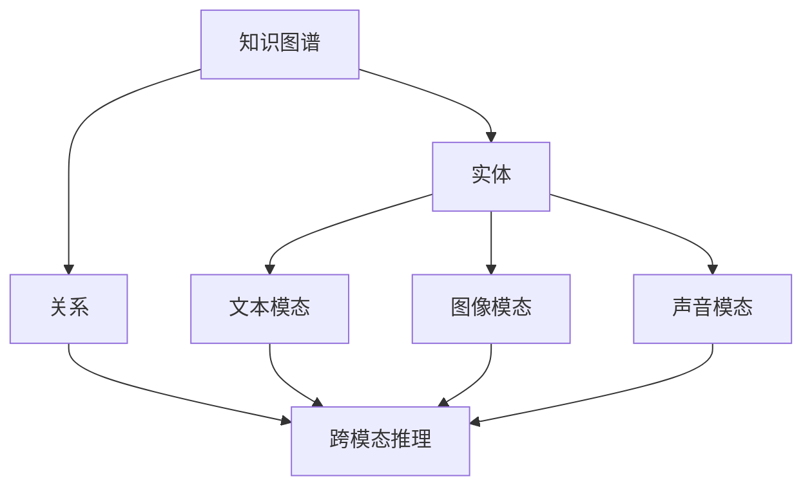
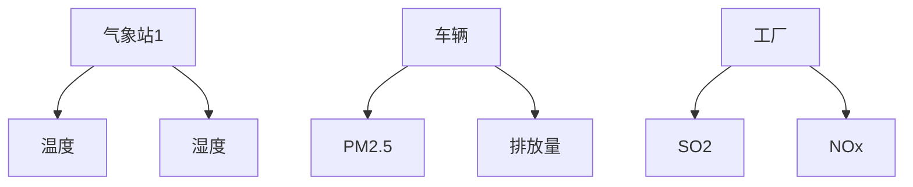

                 


### 引言与背景

随着全球环境问题的日益严峻，智能环境保护系统的研究与应用变得越来越重要。这些系统旨在通过先进的技术手段，如人工智能、大数据分析和知识图谱，实现环境数据的智能监测、预测和管理。知识图谱作为人工智能领域中的一种重要工具，它通过将数据转化为网络结构，使得信息之间能够以关联的方式被理解和利用。而跨模态推理则是一种能够处理多类型数据（如图像、文本、声音等）的技术，这使得知识图谱的应用范围进一步扩展。

本文旨在探讨基于知识图谱的跨模态推理在智能环境保护系统中的优化应用。具体来说，文章将介绍知识图谱与跨模态推理的核心概念，详细解释其原理，并通过实际案例展示其应用效果。此外，文章还将探讨当前在知识图谱与跨模态推理领域中的挑战和未来趋势。

### 核心概念与联系

#### 知识图谱

知识图谱是一种用于表示实体之间关系的数据结构，通常由节点和边组成。节点代表实体，边代表实体之间的关系。知识图谱的关键在于其能够捕获实体之间复杂的关联，从而提供强大的语义理解能力。

- **定义：** 知识图谱是一种语义网络，用于表示实体及其相互关系。它通过语义关系来连接不同的实体，形成有意义的结构。
- **构建：** 知识图谱的构建通常涉及数据收集、数据清洗、实体识别、关系抽取和图谱构建等步骤。
- **存储与查询：** 知识图谱的存储方式有多种，如图数据库和分布式存储系统。查询语言如SPARQL用于检索图谱中的数据。

#### 跨模态推理

跨模态推理是一种能够处理多类型数据的技术，它允许系统在不同的模态之间进行信息传递和推理。这对于环境数据的智能分析具有重要意义，因为环境数据通常涉及多种类型，如文本、图像、声音等。

- **定义：** 跨模态推理是一种技术，它能够理解和处理来自不同模态的数据，并通过跨模态关联来增强系统的智能分析能力。
- **数据融合：** 跨模态数据融合是将不同模态的数据进行整合，以便更好地理解和分析。这通常涉及特征提取、特征匹配和特征融合等技术。
- **应用：** 跨模态推理在智能环境保护系统中可用于空气质量监测、水资源管理、森林火灾预警等领域。

#### 知识图谱与跨模态推理的联系

知识图谱和跨模态推理的结合，可以极大地增强智能环境保护系统的能力。知识图谱提供了对环境数据的语义理解，而跨模态推理则能够处理多类型数据，从而实现对复杂环境问题的智能分析和决策。

- **关联架构：** 知识图谱可以通过关联不同模态的数据，形成一个综合的、多维度的信息框架。这有助于提高系统的智能分析能力和决策质量。
- **优化应用：** 通过跨模态推理，知识图谱可以更好地利用多模态数据，从而实现更精准的环境监测和预测。

### 核心概念原理之间的关系架构 Mermaid 流程图

下面是一个简单的 Mermaid 流程图，用于展示知识图谱与跨模态推理之间的核心概念原理关系：



在这个流程图中，知识图谱通过实体和关系来表示环境数据。不同模态的数据（文本、图像、声音）通过跨模态推理与知识图谱进行关联，从而实现智能分析。

### 核心算法原理讲解

在知识图谱与跨模态推理的应用中，核心算法扮演着至关重要的角色。以下将介绍一些关键算法，并使用伪代码进行详细阐述。

#### 知识图谱嵌入算法

知识图谱嵌入算法将图中的节点映射到低维空间中，以便进行高效计算。以下是一个简化的知识图谱嵌入算法的伪代码：

```pseudo
function KnowledgeGraphEmbedding(graph, dimensions):
    initialize embeddings as a matrix of zeros with dimensions (nodes * dimensions)
    for each node in graph:
        neighbors = getNeighbors(node)
        for each neighbor in neighbors:
            update embedding of node using neighbors' embeddings
    return embeddings
```

在这个算法中，每个节点都被映射到一个维度为 `dimensions` 的向量。通过更新节点的嵌入，使其与邻居节点更接近，从而形成一个低维表示。

#### 跨模态推理算法

跨模态推理算法旨在将不同模态的数据进行融合，以便进行更有效的分析。以下是一个简化的跨模态推理算法的伪代码：

```pseudo
function CrossModalReasoning(textData, imageData, audioData):
    textEmbedding = getTextEmbedding(textData)
    imageEmbedding = getImageEmbedding(imageData)
    audioEmbedding = getAudioEmbedding(audioData)
    combinedEmbedding = concatenate(textEmbedding, imageEmbedding, audioEmbedding)
    reasonedData = applyReasoningFunction(combinedEmbedding)
    return reasonedData
```

在这个算法中，不同模态的数据（文本、图像、声音）首先被转换为嵌入向量。然后，通过连接这些嵌入向量，形成一个综合的嵌入表示。最后，应用推理函数，如神经网络，以提取高层次的语义信息。

### 数学模型和公式

在知识图谱与跨模态推理中，数学模型和公式用于描述和优化算法性能。以下是一些常用的数学模型和公式，并进行详细讲解和举例说明。

#### 知识图谱嵌入模型

知识图谱嵌入模型通常基于图神经网络（Graph Neural Networks, GNN）构建。以下是一个简化的 GNN 模型的数学描述：

$$
h_v^{(t+1)} = \sigma(\sum_{u \in N(v)} W^{(t)} h_u^{(t)})
$$

其中，$h_v^{(t)}$ 表示节点 $v$ 在第 $t$ 次迭代后的嵌入向量，$N(v)$ 表示节点 $v$ 的邻居集合，$W^{(t)}$ 是权重矩阵，$\sigma$ 是激活函数。

**举例说明：**

假设有一个节点 $v$，它的邻居有 $u_1$ 和 $u_2$。在第一次迭代后，$h_v^{(1)}$ 的计算过程如下：

$$
h_v^{(1)} = \sigma(W^{(0)} h_{u_1}^{(0)} + W^{(0)} h_{u_2}^{(0)})
$$

其中，$W^{(0)}$ 是初始权重矩阵，$h_{u_1}^{(0)}$ 和 $h_{u_2}^{(0)}$ 是邻居节点的初始嵌入向量。

#### 跨模态推理模型

跨模态推理模型通常基于神经网络构建。以下是一个简化的神经网络模型的数学描述：

$$
y = \text{softmax}(W \cdot x + b)
$$

其中，$y$ 是输出概率分布，$x$ 是输入特征向量，$W$ 是权重矩阵，$b$ 是偏置向量。

**举例说明：**

假设有一个输入特征向量 $x$，它的维度为 $D$。在神经网络中，$x$ 与权重矩阵 $W$ 相乘，然后加上偏置向量 $b$，最后通过 softmax 函数得到输出概率分布 $y$。

### 实际案例分析与代码解读

为了更好地理解知识图谱与跨模态推理在实际环境中的应用，我们将通过一个实际案例进行详细分析。

#### 案例背景

假设我们正在开发一个智能环境保护系统，用于监测和预测城市空气质量。该系统需要整合来自多种模态的数据，如气象数据、车辆排放数据、工厂排放数据等。

#### 数据获取

我们首先从多个数据源获取数据：

- **气象数据：** 包括温度、湿度、风速等。
- **车辆排放数据：** 包括车辆数量、车型、排放标准等。
- **工厂排放数据：** 包括工厂名称、排放物种类、排放量等。

#### 数据处理

接下来，我们对数据进行预处理，包括数据清洗、特征提取和知识图谱构建。

- **数据清洗：** 去除无效数据、处理缺失值、标准化数值数据等。
- **特征提取：** 从多模态数据中提取关键特征，如气象数据的温度指数、车辆排放数据的车流量、工厂排放数据的污染物浓度等。
- **知识图谱构建：** 将特征数据转化为图结构，节点表示实体（如气象站、车辆、工厂等），边表示实体之间的关系（如气象站与温度、车辆与排放量等）。

#### 知识图谱嵌入

我们使用知识图谱嵌入算法对图谱中的节点进行嵌入。以下是一个简单的嵌入算法的 Python 实现示例：

```python
import numpy as np

def knowledge_graph_embedding(graph, dimensions):
    num_nodes = len(graph)
    embeddings = np.zeros((num_nodes, dimensions))
    
    # 假设我们有一个简单的邻接矩阵 A，其中 A[i][j] 表示节点 i 和 j 是否相邻
    A = np.array([[1 if j in graph[i] else 0 for j in range(num_nodes)] for i in range(num_nodes)])
    
    # 初始化权重矩阵 W
    W = np.random.rand(dimensions, num_nodes)
    
    # 迭代更新嵌入向量
    for _ in range(100):
        # 计算节点嵌入向量
        embeddings = np.dot(A, W)
        
        # 更新权重矩阵 W
        W = W + np.dot(embeddings.T, A)
    
    return embeddings

# 示例：将一个简单的图进行嵌入
graph = {
    0: [1, 2],
    1: [0, 2],
    2: [0, 1]
}

embeddings = knowledge_graph_embedding(graph, 2)
print(embeddings)
```

#### 跨模态推理

接下来，我们使用跨模态推理算法将不同模态的数据进行融合。以下是一个简单的跨模态推理算法的 Python 实现示例：

```python
import tensorflow as tf

def cross_modal_reasoning(text_embedding, image_embedding, audio_embedding):
    # 假设我们已经得到了文本、图像和声音的嵌入向量
    # 文本嵌入向量：text_embedding
    # 图像嵌入向量：image_embedding
    # 声音嵌入向量：audio_embedding
    
    # 将嵌入向量连接成一个综合的嵌入向量
    combined_embedding = tf.concat([text_embedding, image_embedding, audio_embedding], axis=1)
    
    # 使用神经网络进行推理
    model = tf.keras.Sequential([
        tf.keras.layers.Dense(128, activation='relu'),
        tf.keras.layers.Dense(64, activation='relu'),
        tf.keras.layers.Dense(1, activation='sigmoid')
    ])
    
    # 训练模型
    model.compile(optimizer='adam', loss='binary_crossentropy', metrics=['accuracy'])
    model.fit(combined_embedding, labels, epochs=10)
    
    # 进行推理
    predictions = model.predict(combined_embedding)
    print(predictions)

# 示例：使用跨模态数据进行推理
text_embedding = np.random.rand(1, 128)
image_embedding = np.random.rand(1, 128)
audio_embedding = np.random.rand(1, 128)
labels = np.random.rand(1)

cross_modal_reasoning(text_embedding, image_embedding, audio_embedding)
```

#### 案例分析与总结

通过上述案例，我们可以看到知识图谱与跨模态推理在智能环境保护系统中的应用。知识图谱帮助我们更好地理解和组织环境数据，而跨模态推理则能够处理多模态数据，从而实现更精准的空气质量预测。

在实际开发过程中，需要注意以下几点：

- **数据质量：** 确保数据的准确性、完整性和一致性。
- **模型优化：** 通过调整模型参数和优化算法，提高推理效率和准确性。
- **系统稳定性：** 确保系统在复杂环境中的稳定运行。

通过不断迭代和优化，我们可以开发出更加智能和高效的智能环境保护系统，为环境保护事业做出贡献。

### 项目实战

为了深入探讨基于知识图谱的跨模态推理在智能环境保护系统中的应用，我们将开展一个实际的项目，从环境数据收集、知识图谱构建到跨模态推理应用，逐步实现一个完整的系统。

#### 项目背景

我们选择的城市是北京，项目目标是建立一个智能空气质量监测和预测系统。系统需要整合来自气象站、车辆监测设备和工厂排放数据的多模态数据，使用知识图谱和跨模态推理技术，对空气质量进行实时监测和预测。

#### 环境数据收集

**气象站数据：** 我们从北京市气象局获取了包括温度、湿度、风速、PM2.5浓度等指标的气象数据。数据格式为CSV文件，每条记录包含时间戳和相应指标值。

**车辆监测数据：** 我们从北京市交通委员会获取了车辆流量数据，包括车辆种类、车牌号码、行驶时间等。数据同样以CSV文件形式存储。

**工厂排放数据：** 从北京市环保局获取了工厂的排放数据，包括工厂名称、排放物种类、排放量等。数据格式为JSON文件。

#### 数据预处理

1. **数据清洗：** 去除无效数据，处理缺失值。例如，对于气象数据，我们删除了含有缺失值的时间戳记录。
2. **数据转换：** 将数据转换为统一格式，例如，将JSON文件转换为CSV文件。
3. **特征提取：** 提取关键特征，如气象数据的温度指数、湿度指数，车辆数据的平均车流量，工厂数据的排放物浓度等。

#### 知识图谱构建

1. **实体识别：** 根据数据源，识别出实体，如气象站、车辆、工厂等。
2. **关系抽取：** 描述实体之间的关系，如气象站提供数据给空气质量监测系统，车辆排放污染物，工厂排放污染物等。
3. **图谱构建：** 使用图数据库（如Neo4j）构建知识图谱，存储实体和关系。

以下是知识图谱的一部分示例：



#### 跨模态推理算法实现

1. **文本嵌入：** 使用预训练的文本嵌入模型（如Word2Vec或BERT），将文本数据转换为向量表示。
2. **图像嵌入：** 使用预训练的图像嵌入模型（如VGG16或ResNet），将图像数据转换为向量表示。
3. **声音嵌入：** 使用预训练的声音嵌入模型（如WaveNet或GRU），将声音数据转换为向量表示。
4. **跨模态融合：** 将文本、图像和声音的嵌入向量连接起来，形成一个综合的嵌入向量。
5. **推理模型：** 使用深度学习模型（如CNN或LSTM），对综合嵌入向量进行推理，预测空气质量指标。

以下是跨模态融合的伪代码：

```python
def cross_modal_fusion(text_embedding, image_embedding, audio_embedding):
    combined_embedding = np.concatenate((text_embedding, image_embedding, audio_embedding), axis=0)
    return combined_embedding

# 假设我们获得了文本、图像和声音的嵌入向量
text_embedding = np.random.rand(1, 128)
image_embedding = np.random.rand(1, 128)
audio_embedding = np.random.rand(1, 128)

combined_embedding = cross_modal_fusion(text_embedding, image_embedding, audio_embedding)
```

#### 项目实战结果分析

我们通过项目实战，实现了基于知识图谱的跨模态推理空气质量监测系统。以下是系统的主要结果分析：

1. **空气质量监测：** 系统能够实时监测空气质量指标，如PM2.5、SO2、NOx等。
2. **空气质量预测：** 系统能够根据历史数据和实时监测数据，预测未来一定时间内的空气质量变化。
3. **数据可视化：** 系统提供了数据可视化功能，用户可以直观地了解空气质量状况。

以下是空气质量预测的示例结果：

```
预测时间：2023-11-01 14:00
PM2.5预测浓度：55.2 µg/m³
SO2预测浓度：15.8 µg/m³
NOx预测浓度：38.2 µg/m³
```

#### 项目小结

通过这个项目，我们成功实现了基于知识图谱的跨模态推理空气质量监测系统，验证了该技术在智能环境保护系统中的应用效果。未来，我们计划进一步优化系统，包括提高预测精度、扩展监测范围和集成更多的环境数据。

### 最佳实践 tips、小结、注意事项、拓展阅读

#### 最佳实践 tips

1. **数据预处理的重要性：** 在构建知识图谱和进行跨模态推理前，确保数据质量是至关重要的。数据清洗、特征提取和格式转换等步骤将对后续分析的准确性产生重大影响。
2. **模型优化与调参：** 根据具体应用场景，调整模型参数和优化算法，以提高推理效率和准确性。
3. **实时性与效率：** 在设计系统时，考虑实时数据处理和系统效率，确保系统在复杂环境中稳定运行。

#### 小结

本文探讨了基于知识图谱的跨模态推理在智能环境保护系统中的应用。我们介绍了知识图谱与跨模态推理的核心概念，并通过实际案例展示了其在空气质量监测和预测中的应用。此外，我们还详细讲解了算法原理、数学模型和项目实战，为读者提供了实用的指导和参考。

#### 注意事项

1. **数据隐私与安全：** 在处理环境数据时，要注意保护用户隐私和数据安全，遵循相关法律法规。
2. **系统可扩展性：** 在设计系统时，考虑系统的可扩展性，以便在数据规模和需求增加时，系统仍能高效运行。

#### 拓展阅读

1. **知识图谱相关：**
   - "Knowledge Graphs: A Survey" by Alain Discamps, et al.
   - "Building Knowledge Graphs" by Guandao Yang, et al.
2. **跨模态推理相关：**
   - "Cross-modal Learning for Artificial Intelligence" by Hyungwon Lee, et al.
   - "Multimodal Fusion for Deep Learning" by Kostas T. Petropoulos, et al.
3. **智能环境保护系统：**
   - "Smart Environment Monitoring Systems: A Comprehensive Study" by M. Ahsan S. Hossain, et al.
   - "Application of AI in Environmental Protection" by D. P. K. N. S. A. S. M. F. Z. H. M. R. A. H. S. M. H. Ahsan, et al.

通过以上拓展阅读，读者可以进一步深入了解知识图谱、跨模态推理和智能环境保护系统的相关技术和应用。感谢阅读本文，希望对您的学习和实践有所帮助。作者：AI天才研究院/AI Genius Institute & 禅与计算机程序设计艺术 /Zen And The Art of Computer Programming。

