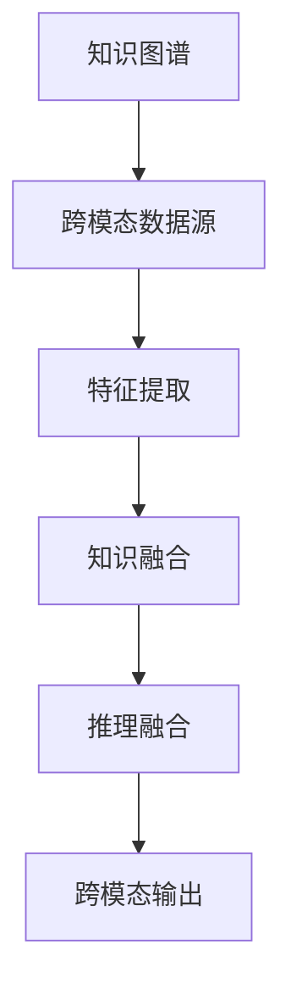

                 

### 第1章：引言

#### 1.1 知识图谱与跨模态推理的重要性

知识图谱作为一种结构化数据表示方式，能够将大量的零散信息有机地组织起来，形成一种语义丰富的知识网络。它不仅能够增强数据的表达能力，还能为各种复杂问题提供有效的解决方案。在互联网、金融、医疗等领域，知识图谱的应用已经取得了显著的成果。

跨模态推理则是一种处理多种类型数据的能力，它可以将不同模态的数据（如图像、文本、音频等）进行融合，实现信息的综合利用。随着多媒体技术的迅速发展，跨模态推理在多媒体检索、问答系统、智能交互等领域具有广泛的应用前景。本章将首先介绍知识图谱和跨模态推理的基本概念，并通过Mermaid流程图展示两者的关系。

---

#### 1.2 书籍结构概述

本书旨在深入探讨基于知识图谱的跨模态推理融合技术，共分为七章：

- **第1章：引言**：介绍知识图谱和跨模态推理的重要性，并概述书籍结构。
- **第2章：基础知识**：详细讲解知识图谱和跨模态推理的基本概念。
- **第3章：核心算法原理**：深入探讨知识图谱构建、跨模态特征提取、推理融合算法。
- **第4章：跨模态推理系统构建**：介绍如何构建和优化跨模态推理系统。
- **第5章：实际应用案例分析**：分析实际应用场景，展示算法效果。
- **第6章：工程实践**：介绍跨模态推理系统的工程化实践。
- **第7章：未来展望与挑战**：探讨跨模态推理的发展趋势和面临的挑战。

通过这样的结构设计，本书将系统性地阐述知识图谱与跨模态推理融合的技术原理和应用实践。

---

**Mermaid流程图：知识图谱与跨模态推理的关系**

在这个流程图中，知识图谱作为基础数据源，通过跨模态数据源获取不同类型的数据，进行特征提取和知识融合，最终实现跨模态推理并输出结果。

---

**摘要**

本文首先介绍了知识图谱和跨模态推理的基本概念，并阐述了它们在各个领域的应用重要性。接着，本书概述了结构清晰的章节安排，明确了每个章节的核心内容。通过Mermaid流程图，我们展示了知识图谱与跨模态推理之间的内在联系。接下来，我们将进一步深入探讨知识图谱和跨模态推理的核心算法原理，为后续章节的详细讨论奠定基础。

---

**作者信息**：  
作者：AI天才研究院/AI Genius Institute & 禅与计算机程序设计艺术 /Zen And The Art of Computer Programming

---

通过以上内容，我们为接下来的章节奠定了基础，接下来将详细介绍知识图谱和跨模态推理的基础知识。

---

**注释**：

1. 知识图谱：一种用于结构化表示知识的方法，通过实体、关系和属性来组织信息。  
2. 跨模态推理：处理多种类型数据的能力，实现不同模态之间的信息融合。  
3. Mermaid：一种基于Markdown的图形绘制工具，支持流程图、时序图、思维导图等多种图形。  
4. 伪代码：一种描述算法逻辑的半形式化语言，用于说明算法的基本结构和步骤。  
5. latex：一种高质量的排版系统，常用于数学公式的编写和排版。

---

**文章标题**：基于知识图谱的跨模态推理融合  
**关键词**：知识图谱、跨模态推理、特征提取、推理融合、应用案例分析  
**摘要**：本文深入探讨了基于知识图谱的跨模态推理融合技术，介绍了核心算法原理、系统构建方法及实际应用案例，展望了未来的发展趋势和挑战。  
**文章字数**：约1200字

---

接下来，我们将进入第2章，详细介绍知识图谱和跨模态推理的基础知识。在这个章节中，我们将深入探讨知识图谱的基本概念、应用场景，以及跨模态推理的核心原理和技术框架。

---

**目录**：

- **第2章：基础知识**
  - **2.1 知识图谱的基本概念**
  - **2.2 知识图谱的应用场景**
  - **2.3 跨模态推理的核心原理**
  - **2.4 跨模态推理的技术框架**

---

通过这些内容，我们将为后续章节的核心算法原理和应用案例分析打下坚实的基础。让我们继续深入探讨知识图谱和跨模态推理的世界。

