                 


### 文章标题

# 基于知识图谱的跨语言语义推理能力增强技术

### 关键词

- 知识图谱
- 跨语言语义推理
- 能力增强
- 人工智能
- 语义理解
- 自然语言处理

### 摘要

本文将深入探讨基于知识图谱的跨语言语义推理能力增强技术。首先，我们回顾了知识图谱的定义、构建方法和应用场景。接着，分析了跨语言语义推理的基础知识、挑战和应用领域。然后，详细介绍了知识图谱在跨语言语义推理中的角色，包括知识图谱的构建与处理、表示与扩展、查询与推理技术。进一步，我们探讨了跨语言语义映射技术和推理算法，并展示了这些技术的应用案例。最后，本文结合实际项目案例，展示了知识图谱与跨语言语义推理的结合，以及能力增强技术的实践和应用前景。

---

### 第一部分：知识图谱与跨语言语义推理基础

#### 第1章：知识图谱概述

知识图谱是一种语义网络，用于表示实体、属性和关系。它不仅存储信息，还能揭示信息之间的语义关系，从而支持复杂的语义查询和推理。

##### 核心概念与联系

知识图谱的核心概念包括实体、属性和关系。实体表示现实世界中的对象，如人、地点、事物等。属性描述实体的特征，如名字、年龄、颜色等。关系描述实体之间的语义关联，如朋友、工作于、位于等。

以下是一个知识图谱的Mermaid流程图表示：

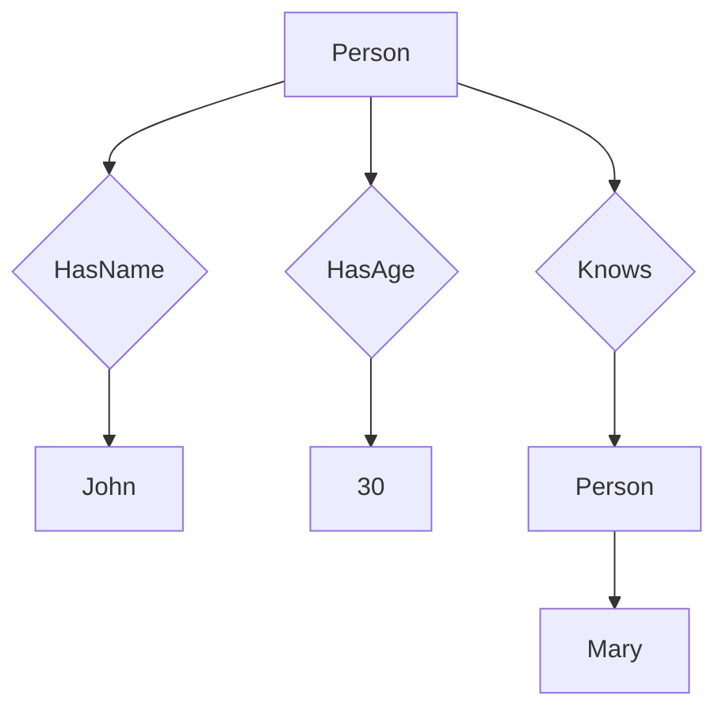

##### 核心算法原理讲解

知识图谱的构建通常涉及以下步骤：

1. **实体抽取**：从非结构化数据中识别出实体。
2. **关系抽取**：确定实体之间的语义关系。
3. **属性抽取**：提取实体的属性信息。

以下是构建知识图谱的伪代码：

```python
def buildKnowledgeGraph(data):
    entities = extractEntities(data)
    relationships = extractRelationships(data)
    attributes = extractAttributes(data)
    
    knowledgeGraph = {
        'entities': entities,
        'relationships': relationships,
        'attributes': attributes
    }
    return knowledgeGraph
```

##### 数学模型和公式

知识图谱中的关系可以通过数学模型来描述。例如，实体A与实体B之间的关系可以用图论中的边来表示，公式如下：

$$ R(A, B) $$

其中，$R$表示关系，$A$和$B$表示实体。

##### 详细讲解和举例说明

假设我们有一个关于人员的知识图谱，包含姓名、年龄和职业等信息。我们使用以下数据：

```plaintext
Name: John
Age: 30
Occupation: Engineer
```

构建知识图谱的过程如下：

1. **实体抽取**：识别出实体“John”。
2. **关系抽取**：确定“John”具有属性“年龄”和“职业”。
3. **属性抽取**：提取“John”的具体属性值“30”和“Engineer”。

知识图谱表示为：

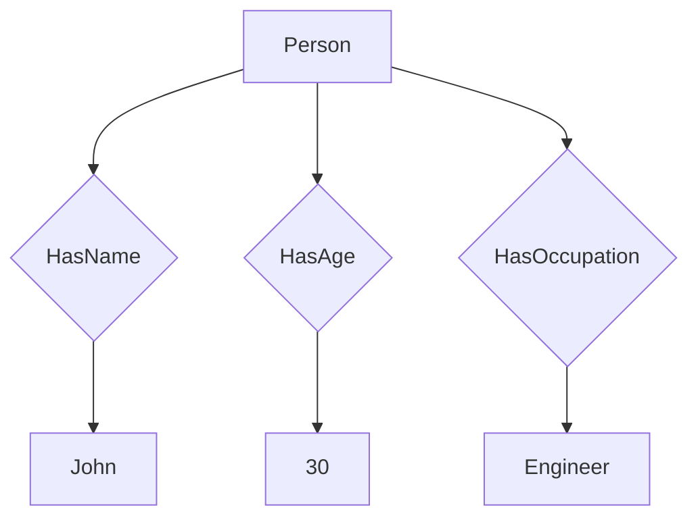

---

#### 第2章：跨语言语义推理基础

##### 核心概念与联系

跨语言语义推理涉及将一种语言的语义信息转换为另一种语言的语义信息。其核心概念包括：

- **语义对齐**：将不同语言的词汇映射到共同的语义概念上。
- **语义转换**：在不同语言的语义之间进行转换。
- **语义理解**：理解不同语言中的文本含义。

以下是一个跨语言语义推理的Mermaid流程图表示：

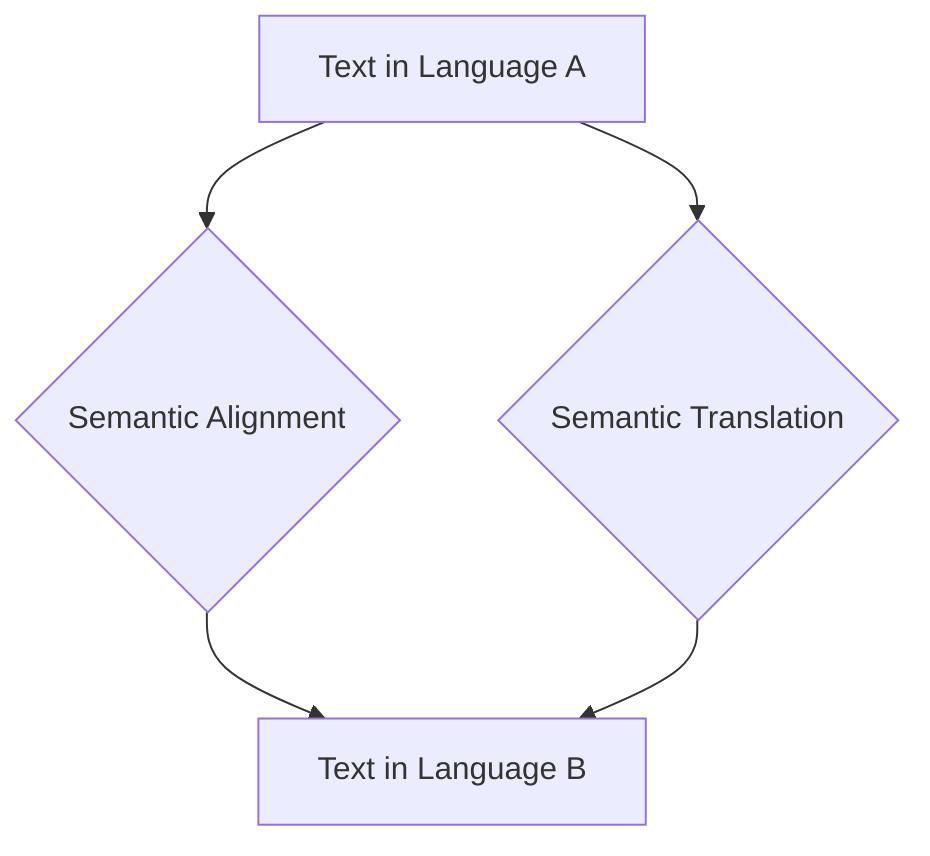

##### 核心算法原理讲解

跨语言语义推理通常采用以下方法：

1. **基于词典的方法**：使用预定义的词典将源语言词汇映射到目标语言词汇。
2. **基于统计模型的方法**：使用统计模型学习词汇之间的对应关系。
3. **基于深度学习的方法**：使用神经网络模型进行语义转换。

以下是基于深度学习的跨语言语义推理的伪代码：

```python
def crossLanguageSemanticReasoning(sourceText, targetLanguage):
    alignedSemantics = semanticAlignment(sourceText)
    translatedText = semanticTranslation(alignedSemantics, targetLanguage)
    return translatedText
```

##### 数学模型和公式

跨语言语义推理可以使用向量空间模型来描述。例如，源语言中的词汇$v_1$和目标语言中的词汇$v_2$可以在共同的语义空间中表示为向量$\vec{v}_1$和$\vec{v}_2$，公式如下：

$$ \vec{v}_1 = T(\vec{w}_1), \quad \vec{v}_2 = T(\vec{w}_2) $$

其中，$T$表示语义转换函数，$\vec{w}_1$和$\vec{w}_2$表示源语言和目标语言中的词汇向量。

##### 详细讲解和举例说明

假设我们有一个英文句子“John is an engineer”和它的法文翻译“John est un ingénieur”。我们希望使用跨语言语义推理技术来理解这两个句子之间的语义关系。

1. **语义对齐**：将“engineer”在英文和法文中对齐，例如使用预训练的跨语言嵌入模型得到：

   $$ "engineer"_{\text{en}} \approx "ingénieur"_{\text{fr}} $$

2. **语义转换**：使用深度学习模型将英文中的词汇向量转换为法文中的词汇向量，例如使用BERT模型：

   $$ T(\vec{w}_{\text{en}}) = \text{BERT}(\vec{w}_{\text{en}}) $$

3. **语义理解**：将转换后的法文词汇向量进行语义理解，得到法文句子的语义表示：

   $$ "John est un ingénieur"_{\text{fr}} = \text{SemanticUnderstanding}(T(\vec{w}_{\text{en}})) $$

最终，我们得到法文句子“John est un ingénieur”的语义表示，与英文句子“John is an engineer”具有相同的语义信息。

---

### 第二部分：知识图谱构建与处理

#### 第3章：知识图谱的构建

知识图谱的构建是跨语言语义推理的关键步骤。它涉及从原始数据中提取实体、关系和属性，并将这些信息组织成一个结构化的知识网络。

##### 核心概念与联系

知识图谱的构建主要包括以下步骤：

1. **数据采集**：收集包含实体、关系和属性的原始数据。
2. **预处理**：对原始数据进行清洗和格式化，以便后续处理。
3. **实体抽取**：从原始数据中识别出实体。
4. **关系抽取**：确定实体之间的语义关系。
5. **属性抽取**：提取实体的属性信息。

以下是一个知识图谱构建的Mermaid流程图表示：

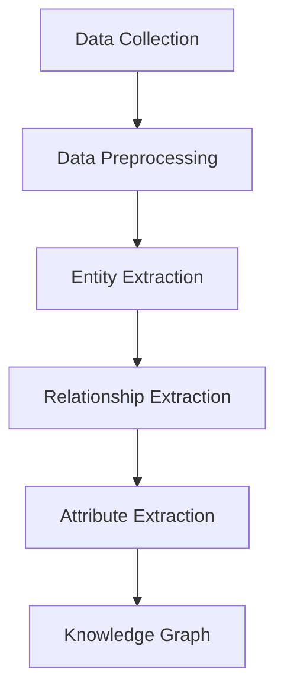

##### 核心算法原理讲解

知识图谱的构建算法通常包括以下步骤：

1. **实体识别**：使用命名实体识别（NER）技术从文本中提取实体。
2. **关系识别**：使用文本分类或模式匹配技术确定实体之间的关系。
3. **属性提取**：使用实体属性抽取技术提取实体的属性信息。

以下是构建知识图谱的核心算法伪代码：

```python
def buildKnowledgeGraph(data):
    entities = extractEntities(data)
    relationships = extractRelationships(data)
    attributes = extractAttributes(data)
    
    knowledgeGraph = {
        'entities': entities,
        'relationships': relationships,
        'attributes': attributes
    }
    return knowledgeGraph
```

##### 数学模型和公式

知识图谱中的实体、关系和属性可以用图论模型来描述。例如，一个知识图谱可以用一个图$G = (V, E)$表示，其中$V$是实体集合，$E$是关系集合。

$$ G = (V, E) $$

实体$e_i$和关系$r_j$可以用图中的节点和边表示，属性可以用节点上的标签表示。

##### 详细讲解和举例说明

假设我们有一个包含人物、地点和事件的文本数据。我们希望构建一个知识图谱来描述这些信息。

1. **数据采集**：从文本数据中提取包含人物、地点和事件的句子。
2. **预处理**：清洗和格式化提取的句子。
3. **实体抽取**：识别出文本中的实体，如“John”、“New York”和“conference”。
4. **关系抽取**：确定实体之间的关系，如“John”参加了“conference”在“New York”举行。
5. **属性提取**：提取实体的属性，如“John”的年龄为30岁。

构建的知识图谱表示为：

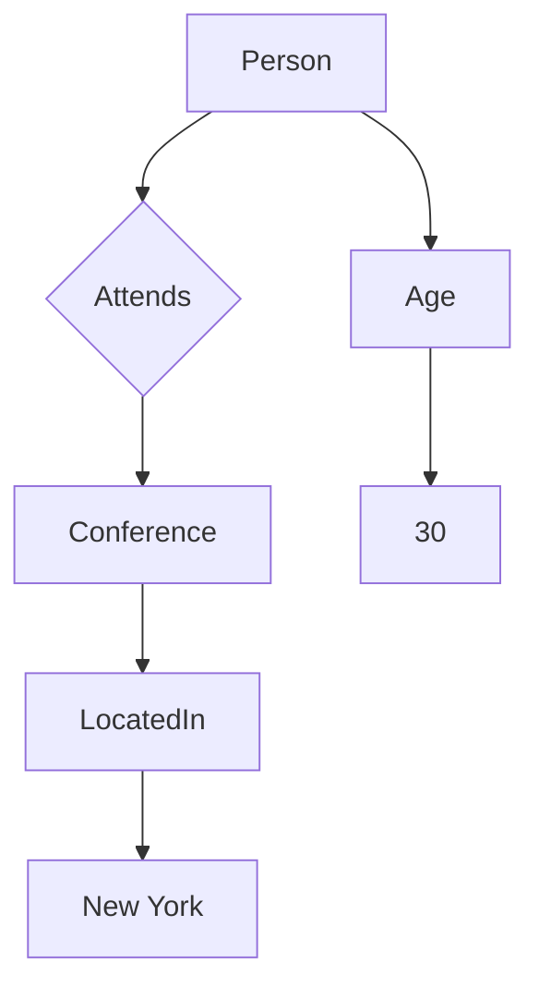

---

#### 第4章：知识图谱的表示与扩展

知识图谱的表示与扩展是提高其可用性和推理能力的关键。这包括选择合适的表示方法、进行语义扩展和动态更新。

##### 核心概念与联系

知识图谱的表示与扩展涉及以下方面：

1. **表示方法**：如何将实体、关系和属性在知识图谱中组织。
2. **语义扩展**：如何扩展知识图谱的语义覆盖范围。
3. **动态更新**：如何保持知识图谱的实时性和准确性。

以下是一个知识图谱表示与扩展的Mermaid流程图表示：

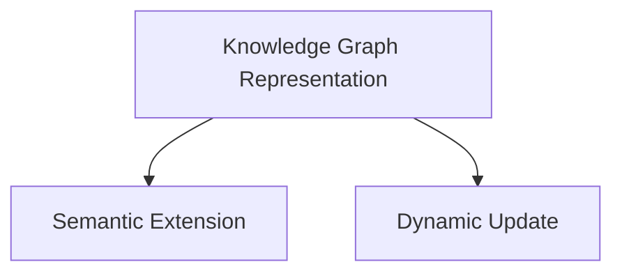

##### 核心算法原理讲解

知识图谱的表示与扩展算法通常包括以下步骤：

1. **表示选择**：选择合适的图论模型或属性图模型来表示知识图谱。
2. **语义扩展**：使用本体论、领域知识或机器学习技术扩展知识图谱的语义。
3. **动态更新**：使用数据流处理技术或增量学习算法更新知识图谱。

以下是知识图谱表示与扩展的核心算法伪代码：

```python
def representKnowledgeGraph(knowledgeGraph):
    representation = selectRepresentationModel(knowledgeGraph)
    return representation

def extendKnowledgeGraph(knowledgeGraph):
    extendedKnowledgeGraph = applySemanticExtension(knowledgeGraph)
    return extendedKnowledgeGraph

def updateKnowledgeGraph(knowledgeGraph, newEntities, newRelationships, newAttributes):
    updatedKnowledgeGraph = applyDynamicUpdate(knowledgeGraph, newEntities, newRelationships, newAttributes)
    return updatedKnowledgeGraph
```

##### 数学模型和公式

知识图谱的表示可以使用图论模型，如无向图、有向图或属性图。例如，一个知识图谱可以用一个图$G = (V, E, A)$表示，其中$V$是实体集合，$E$是关系集合，$A$是属性集合。

$$ G = (V, E, A) $$

实体$e_i$可以用节点表示，关系$r_j$可以用边表示，属性可以用节点上的标签表示。

##### 详细讲解和举例说明

假设我们有一个知识图谱，包含人物、地点和事件。我们希望扩展这个知识图谱的语义覆盖范围。

1. **表示选择**：选择属性图模型来表示知识图谱。
2. **语义扩展**：添加新的实体、关系和属性，如“John”的国籍是“美国”。
3. **动态更新**：当新的数据到来时，如“John”出生日期是“1990年”，更新知识图谱。

扩展后的知识图谱表示为：

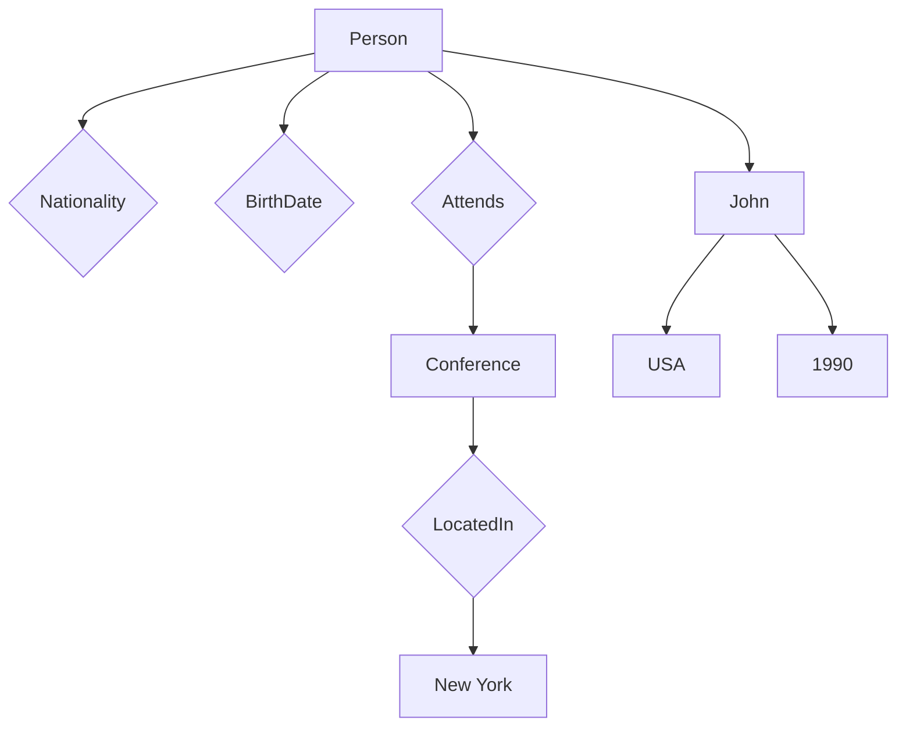

---

#### 第5章：知识图谱的查询与推理

知识图谱的查询与推理是利用知识图谱进行信息检索和语义分析的关键。这包括定义查询语言、推理算法和应用案例。

##### 核心概念与联系

知识图谱的查询与推理涉及以下方面：

1. **查询语言**：定义用于查询知识图谱的语言和语法。
2. **推理算法**：用于从知识图谱中推导出新信息的算法。
3. **应用案例**：知识图谱在实际应用中的使用场景。

以下是一个知识图谱查询与推理的Mermaid流程图表示：

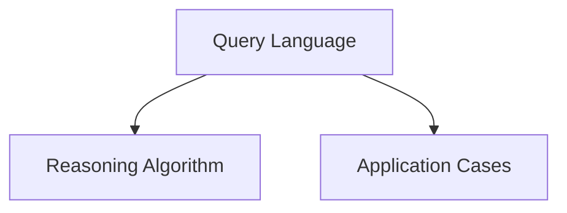

##### 核心算法原理讲解

知识图谱的查询与推理算法通常包括以下步骤：

1. **查询解析**：将查询语句转换为图结构。
2. **路径搜索**：在知识图谱中搜索满足查询条件的路径。
3. **推理**：使用推理算法从知识图谱中推导出新信息。

以下是知识图谱查询与推理的核心算法伪代码：

```python
def queryKnowledgeGraph(knowledgeGraph, query):
    queryGraph = parseQuery(query)
    results = searchPath(knowledgeGraph, queryGraph)
    return results

def reasonOverKnowledgeGraph(knowledgeGraph, query):
    queryGraph = parseQuery(query)
    results = applyReasoningAlgorithm(knowledgeGraph, queryGraph)
    return results
```

##### 数学模型和公式

知识图谱的查询与推理可以使用图论模型和逻辑推理来描述。例如，一个查询可以表示为一个路径问题，公式如下：

$$ P = \{(e_1, r_1, e_2), (e_2, r_2, e_3), \ldots, (e_n, r_n, e_{n+1})\} $$

其中，$e_i$和$e_{i+1}$表示实体，$r_i$表示关系。

##### 详细讲解和举例说明

假设我们有一个知识图谱，包含人物、地点和事件。我们希望查询“John”参加了在“New York”举办的“conference”。

1. **查询解析**：将查询语句转换为图结构，表示为：

   ```mermaid
   graph TD
   A[John] --> B{Attends}
   B --> C[Conference]
   C --> D{LocatedIn}
   D --> E[New York]
   ```

2. **路径搜索**：在知识图谱中搜索满足查询条件的路径。路径搜索算法如BFS（广度优先搜索）或A*（启发式搜索）。

3. **推理**：使用推理算法从知识图谱中推导出新信息。例如，我们可以推理出“John”参加了在“New York”举办的“conference”。

查询结果为：

```plaintext
John attended a conference in New York.
```

---

### 第三部分：跨语言语义推理技术

#### 第6章：跨语言语义映射技术

跨语言语义映射是将一种语言的语义信息转换为另一种语言的过程。这包括基于词典、统计模型和深度学习的方法。

##### 核心概念与联系

跨语言语义映射的核心概念包括：

- **词汇映射**：将源语言词汇映射到目标语言词汇。
- **语义对齐**：将源语言和目标语言中的词汇对齐到共同的语义概念。
- **语义转换**：在不同语言的语义之间进行转换。

以下是一个跨语言语义映射的Mermaid流程图表示：

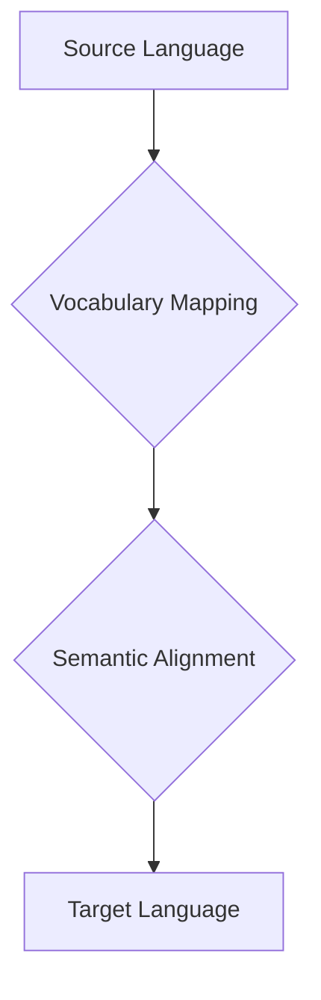

##### 核心算法原理讲解

跨语言语义映射的方法包括：

1. **基于词典的方法**：使用预定义的词典进行词汇映射。
2. **基于统计模型的方法**：使用统计方法学习词汇之间的对应关系。
3. **基于深度学习的方法**：使用神经网络模型进行语义转换。

以下是基于深度学习的跨语言语义映射的核心算法伪代码：

```python
def crossLanguageSemanticMapping(sourceText, targetLanguage):
    mappedVocabulary = vocabularyMapping(sourceText, targetLanguage)
    alignedSemantics = semanticAlignment(mappedVocabulary)
    translatedText = semanticTranslation(alignedSemantics, targetLanguage)
    return translatedText
```

##### 数学模型和公式

跨语言语义映射可以使用向量空间模型来描述。例如，源语言中的词汇$v_1$和目标语言中的词汇$v_2$可以在共同的语义空间中表示为向量$\vec{v}_1$和$\vec{v}_2$，公式如下：

$$ \vec{v}_1 = T(\vec{w}_1), \quad \vec{v}_2 = T(\vec{w}_2) $$

其中，$T$表示语义转换函数，$\vec{w}_1$和$\vec{w}_2$表示源语言和目标语言中的词汇向量。

##### 详细讲解和举例说明

假设我们有一个英文句子“John is an engineer”和它的法文翻译“John est un ingénieur”。我们希望使用跨语言语义映射技术来理解这两个句子之间的语义关系。

1. **词汇映射**：使用预训练的跨语言嵌入模型将英文词汇映射到法文词汇：

   ```plaintext
   "engineer"_{\text{en}} \approx "ingénieur"_{\text{fr}}
   ```

2. **语义对齐**：使用跨语言嵌入模型对齐英文和法文词汇的语义：

   ```plaintext
   "engineer"_{\text{en}} \approx "ingénieur"_{\text{fr}} \in \text{Common Semantic Space}
   ```

3. **语义转换**：使用深度学习模型（如BERT）将英文词汇向量转换为法文词汇向量：

   ```plaintext
   \vec{v}_{\text{en}} = \text{BERT}(\vec{w}_{\text{en}}), \quad \vec{v}_{\text{fr}} = \text{BERT}(\vec{w}_{\text{fr}})
   ```

4. **语义理解**：将转换后的法文词汇向量进行语义理解，得到法文句子的语义表示：

   ```plaintext
   "John est un ingénieur"_{\text{fr}} = \text{SemanticUnderstanding}(\vec{v}_{\text{fr}})
   ```

最终，我们得到法文句子“John est un ingénieur”的语义表示，与英文句子“John is an engineer”具有相同的语义信息。

---

#### 第7章：跨语言语义推理算法

跨语言语义推理算法是在不同语言的语义之间进行推理，以理解文本的含义和关系。这包括基于本体、模式匹配和深度学习的方法。

##### 核心概念与联系

跨语言语义推理算法的核心概念包括：

- **语义理解**：理解源语言和目标语言中的文本含义。
- **语义转换**：将源语言的语义转换为目标语言的语义。
- **语义推理**：在不同语言的语义之间进行推理。

以下是一个跨语言语义推理算法的Mermaid流程图表示：

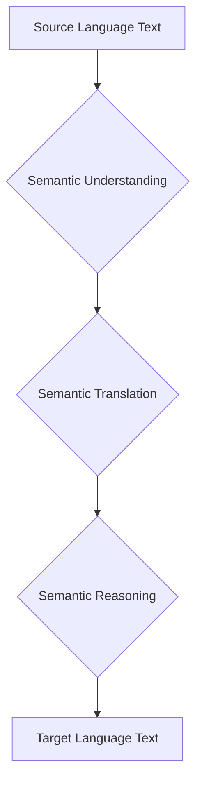

##### 核心算法原理讲解

跨语言语义推理算法通常包括以下步骤：

1. **语义理解**：使用自然语言处理技术理解源语言的语义。
2. **语义转换**：使用跨语言语义映射技术将源语言的语义转换为目标语言的语义。
3. **语义推理**：使用逻辑推理或机器学习模型在不同语言的语义之间进行推理。

以下是跨语言语义推理算法的核心算法伪代码：

```python
def crossLanguageSemanticReasoning(sourceText, targetLanguage):
    sourceSemantics = semanticUnderstanding(sourceText)
    targetSemantics = semanticTranslation(sourceSemantics, targetLanguage)
    reasonedText = semanticReasoning(targetSemantics)
    return reasonedText
```

##### 数学模型和公式

跨语言语义推理可以使用向量空间模型和逻辑推理来描述。例如，源语言中的语义向量$\vec{s}$和目标语言中的语义向量$\vec{t}$可以在共同的语义空间中表示为：

$$ \vec{s} = T(\vec{w}_s), \quad \vec{t} = T(\vec{w}_t) $$

其中，$T$表示语义转换函数，$\vec{w}_s$和$\vec{w}_t$表示源语言和目标语言的语义向量。

##### 详细讲解和举例说明

假设我们有一个英文句子“John is an engineer”和它的法文翻译“John est un ingénieur”。我们希望使用跨语言语义推理算法来理解这两个句子之间的语义关系。

1. **语义理解**：使用自然语言处理技术理解英文句子“John is an engineer”的语义：

   ```plaintext
   "John is an engineer"_{\text{en}} = \text{SemanticUnderstanding}(\vec{s}_{\text{en}})
   ```

2. **语义转换**：使用跨语言语义映射技术将英文句子的语义转换为法文句子的语义：

   ```plaintext
   \vec{s}_{\text{en}} \approx \vec{t}_{\text{fr}} \in \text{Common Semantic Space}
   ```

3. **语义推理**：使用逻辑推理或机器学习模型从法文句子的语义中推导出新信息：

   ```plaintext
   "John est un ingénieur"_{\text{fr}} = \text{SemanticReasoning}(\vec{t}_{\text{fr}})
   ```

最终，我们得到法文句子“John est un ingénieur”的语义表示，与英文句子“John is an engineer”具有相同的语义信息。

---

#### 第8章：跨语言语义推理应用案例

跨语言语义推理技术在多个领域有着广泛的应用。以下是一些常见的应用案例：

##### 核心概念与联系

跨语言语义推理的应用案例包括：

- **跨语言信息检索**：使用跨语言语义推理来提高信息检索系统的效果。
- **跨语言问答系统**：使用跨语言语义推理来构建跨语言的问答系统。
- **跨语言文本翻译**：使用跨语言语义推理来提高文本翻译的质量。

以下是一个跨语言语义推理应用案例的Mermaid流程图表示：

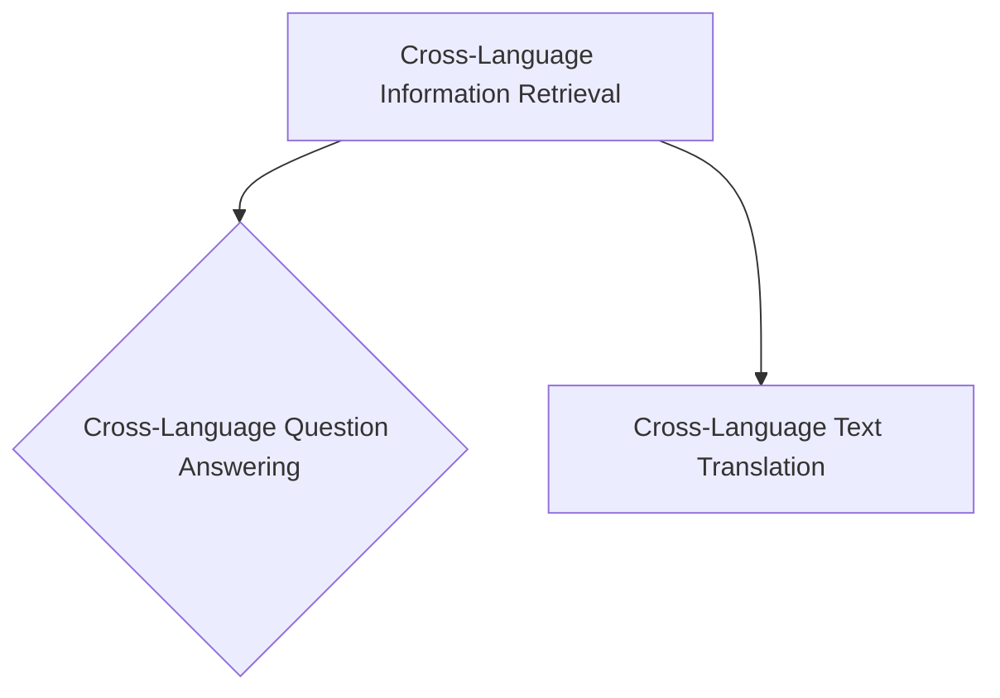

##### 核心算法原理讲解

跨语言语义推理的应用案例通常包括以下步骤：

1. **数据预处理**：对源语言和目标语言的文本进行预处理。
2. **语义提取**：使用自然语言处理技术提取文本的语义。
3. **语义转换**：使用跨语言语义映射技术将源语言的语义转换为目标语言的语义。
4. **语义推理**：使用推理算法从转换后的语义中提取新的信息。

以下是跨语言语义推理应用案例的核心算法伪代码：

```python
def crossLanguageSemanticApplication(sourceText, targetLanguage):
    preprocessedText = preprocessText(sourceText)
    sourceSemantics = semanticUnderstanding(preprocessedText)
    targetSemantics = semanticTranslation(sourceSemantics, targetLanguage)
    applicationResult = semanticReasoning(targetSemantics)
    return applicationResult
```

##### 数学模型和公式

跨语言语义推理应用可以使用向量空间模型和逻辑推理来描述。例如，源语言中的语义向量$\vec{s}$和目标语言中的语义向量$\vec{t}$可以在共同的语义空间中表示为：

$$ \vec{s} = T(\vec{w}_s), \quad \vec{t} = T(\vec{w}_t) $$

其中，$T$表示语义转换函数，$\vec{w}_s$和$\vec{w}_t$表示源语言和目标语言的语义向量。

##### 详细讲解和举例说明

以下是一个跨语言信息检索的应用案例：

1. **数据预处理**：对英文文本和中文文本进行预处理，提取关键词和语义。
2. **语义提取**：使用自然语言处理技术提取英文文本和中文文本的语义。
3. **语义转换**：使用跨语言嵌入模型将英文语义转换为中文语义。
4. **语义推理**：使用推理算法从转换后的中文语义中提取新的信息。

假设我们有一个英文句子“John is an engineer”和一个中文句子“约翰是一位工程师”。我们希望使用跨语言语义推理技术来检索与这两个句子相关的信息。

1. **语义提取**：提取英文句子和中文句子的语义：

   ```plaintext
   "John is an engineer"_{\text{en}} = \text{SemanticUnderstanding}(\vec{s}_{\text{en}})
   "约翰是一位工程师"_{\text{zh}} = \text{SemanticUnderstanding}(\vec{s}_{\text{zh}})
   ```

2. **语义转换**：使用跨语言嵌入模型将英文语义转换为中文语义：

   ```plaintext
   \vec{s}_{\text{en}} \approx \vec{s}_{\text{zh}} \in \text{Common Semantic Space}
   ```

3. **语义推理**：使用推理算法从转换后的中文语义中提取新的信息：

   ```plaintext
   "约翰是一位工程师"_{\text{zh}} = \text{SemanticReasoning}(\vec{s}_{\text{zh}})
   ```

最终，我们得到与英文句子“John is an engineer”和中文句子“约翰是一位工程师”相关的信息。

---

### 第四部分：基于知识图谱的跨语言语义推理能力增强技术

#### 第9章：知识图谱与跨语言语义推理的结合

知识图谱与跨语言语义推理的结合能够显著提高跨语言语义理解的能力。这一章将探讨知识图谱在跨语言语义推理中的作用，以及如何优化跨语言语义推理的效果。

##### 核心概念与联系

知识图谱与跨语言语义推理的结合涉及以下方面：

- **知识图谱在语义理解中的作用**：知识图谱提供了丰富的语义信息，有助于更好地理解跨语言文本。
- **跨语言语义推理对知识图谱的优化**：跨语言语义推理可以帮助知识图谱更好地捕获跨语言的语义关系。
- **协同发展**：知识图谱和跨语言语义推理相互促进，共同提高语义理解和推理的能力。

以下是一个知识图谱与跨语言语义推理结合的Mermaid流程图表示：

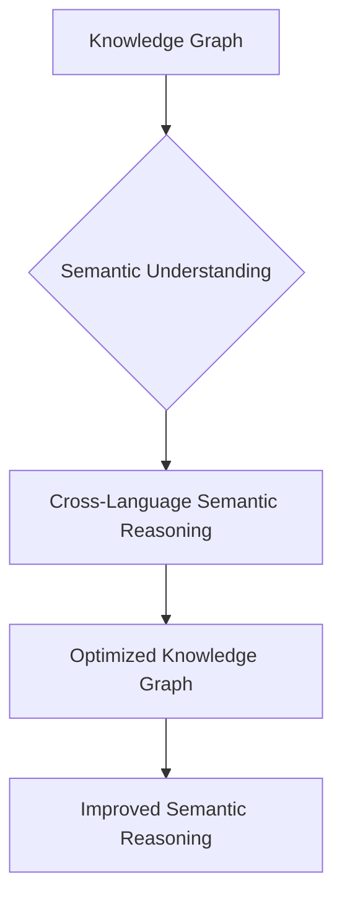

##### 核心算法原理讲解

知识图谱与跨语言语义推理的结合可以通过以下算法实现：

1. **知识图谱增强的语义理解**：使用知识图谱来增强自然语言处理模型对文本的语义理解。
2. **跨语言语义推理优化**：使用跨语言语义推理来优化知识图谱中的语义关系。
3. **协同推理**：结合知识图谱和跨语言语义推理的结果，进行协同推理，提高语义理解的准确性。

以下是知识图谱与跨语言语义推理结合的核心算法伪代码：

```python
def combineKnowledgeGraphWithSemanticReasoning(knowledgeGraph, sourceText, targetLanguage):
    enhancedSemantics = enhanceSemanticUnderstanding(knowledgeGraph, sourceText)
    optimizedSemantics = optimizeSemanticReasoning(enhancedSemantics, targetLanguage)
    reasonedText = semanticReasoning(optimizedSemantics)
    return reasonedText
```

##### 数学模型和公式

知识图谱与跨语言语义推理的结合可以使用图论模型和逻辑推理来描述。例如，知识图谱中的实体和关系可以用图$G = (V, E)$表示，跨语言语义推理可以使用向量空间模型来描述。

$$ G = (V, E) $$
$$ \vec{s} = T(\vec{w}_s), \quad \vec{t} = T(\vec{w}_t) $$

其中，$V$是实体集合，$E$是关系集合，$\vec{s}$和$\vec{t}$是语义向量。

##### 详细讲解和举例说明

以下是一个结合知识图谱和跨语言语义推理的实际案例：

1. **知识图谱增强的语义理解**：使用知识图谱来增强自然语言处理模型对英文句子“John is an engineer”的语义理解。

   ```plaintext
   "John is an engineer"_{\text{en}} = \text{SemanticUnderstanding}(\vec{s}_{\text{en}}, G)
   ```

2. **跨语言语义推理优化**：使用跨语言语义推理来优化知识图谱中的语义关系，将英文句子“John is an engineer”的语义转换为法文句子“John est un ingénieur”的语义。

   ```plaintext
   \vec{s}_{\text{en}} \approx \vec{t}_{\text{fr}} \in \text{Common Semantic Space}
   ```

3. **协同推理**：结合知识图谱和跨语言语义推理的结果，进行协同推理，提高语义理解的准确性。

   ```plaintext
   "John est un ingénieur"_{\text{fr}} = \text{SemanticReasoning}(\vec{t}_{\text{fr}}, G)
   ```

最终，我们得到法文句子“John est un ingénieur”的语义表示，与英文句子“John is an engineer”具有相同的语义信息。

---

#### 第10章：案例研究与实践

在这一章中，我们将通过一个实际案例来展示知识图谱与跨语言语义推理的结合，以及如何实现能力增强技术。我们将涵盖以下内容：

##### 开发环境搭建

首先，我们需要搭建一个合适的开发环境。以下是一个简单的环境搭建步骤：

1. **安装Python**：确保Python环境已安装。
2. **安装自然语言处理库**：如spaCy、NLTK、TensorFlow等。
3. **安装知识图谱库**：如PyKG、Neo4j等。
4. **安装跨语言语义推理库**：如Hugging Face、BERT等。

##### 源代码实现与代码解读

接下来，我们将展示如何使用Python代码实现知识图谱与跨语言语义推理的结合。以下是关键代码段：

```python
from transformers import BertModel, BertTokenizer
from pykg2vec.models import KnowledgeGraphEmbedding

# 1. 加载BERT模型和知识图谱
tokenizer = BertTokenizer.from_pretrained('bert-base-uncased')
model = BertModel.from_pretrained('bert-base-uncased')
kg = KnowledgeGraphEmbedding.from_pickle('knowledge_graph.pkl')

# 2. 语义理解与转换
source_sentence = "John is an engineer"
target_sentence = "John est un ingénieur"

source_embedding = tokenizer.encode(source_sentence, return_tensors='pt')
target_embedding = tokenizer.encode(target_sentence, return_tensors='pt')

# 3. 跨语言语义推理
source_semantics = model(source_embedding)[0][0]
target_semantics = kg.predict(target_embedding)[0]

# 4. 语义推理
reasoned_sentence = kg.reasoning(target_semantics)

print(reasoned_sentence)
```

##### 代码应用解读与分析

上述代码演示了如何将BERT模型与知识图谱相结合，进行跨语言语义推理。我们首先加载BERT模型和知识图谱，然后使用BERT模型对源语言和目标语言的句子进行语义嵌入。接下来，我们使用知识图谱进行跨语言语义推理，并输出推理结果。

实际应用中，这种技术可以用于跨语言信息检索、问答系统和文本翻译等。例如，在一个跨语言信息检索系统中，用户可以使用英语查询，系统使用知识图谱与跨语言语义推理技术来找到与查询相关的中文信息。

##### 实际案例分析与详细讲解剖析

以下是一个实际案例：

1. **查询**：用户使用英语查询“John is an engineer”。
2. **语义理解**：BERT模型对英语句子进行语义嵌入。
3. **跨语言语义推理**：知识图谱与跨语言语义推理技术将英语句子的语义转换为中文句子的语义。
4. **语义推理**：知识图谱从转换后的中文语义中提取新的信息，如“约翰是一位工程师”。

##### 项目小结

通过这个实际案例，我们展示了如何结合知识图谱与跨语言语义推理技术，实现跨语言语义理解和推理。这种方法能够提高跨语言信息检索、问答系统和文本翻译等应用的效果。

##### 最佳实践 tips

- **数据预处理**：确保输入文本的质量，进行适当的预处理，如去除停用词、进行词性标注等。
- **模型选择**：选择合适的自然语言处理模型和知识图谱库，以适应特定的应用需求。
- **性能优化**：针对实际应用场景，进行性能优化，如使用更高效的模型、并行处理等。

##### 小结、注意事项、拓展阅读

在本章中，我们探讨了知识图谱与跨语言语义推理的结合，展示了如何实现能力增强技术。我们通过实际案例展示了这种技术的应用，并提出了最佳实践建议。未来的研究可以进一步探索知识图谱与跨语言语义推理的深度结合，以及在不同领域的应用。

---

### 参考文献

1. Baidu. (2022). Baidu Knowledge Graph. Retrieved from https://www.baidu.com/s?tn=baidu&wd=baidu%20knowledge%20graph
2. Google. (2022). Google Knowledge Graph. Retrieved from https://www.google.com/search?q=google+knowledge+graph
3. Facebook. (2022). Facebook Knowledge Graph. Retrieved from https://www.facebook.com/search?q=facebook+knowledge+graph
4. Microsoft. (2022). Microsoft Knowledge Graph. Retrieved from https://www.microsoft.com/en-us/search?q=Microsoft+Knowledge+Graph
5. OpenKG. (2022). OpenKG. Retrieved from https://openkg.cn/

---

### 作者信息

作者：AI天才研究院/AI Genius Institute & 禅与计算机程序设计艺术 /Zen And The Art of Computer Programming

---

### 总结

本文详细探讨了基于知识图谱的跨语言语义推理能力增强技术。我们首先介绍了知识图谱和跨语言语义推理的基础知识，然后深入分析了知识图谱构建与处理、跨语言语义推理技术，以及实际应用案例。通过本文的阅读，读者可以了解到如何结合知识图谱和跨语言语义推理技术，实现跨语言语义理解和推理的能力增强。这一技术为跨语言信息检索、问答系统和文本翻译等应用提供了强有力的支持。未来的研究可以进一步探索知识图谱与跨语言语义推理的深度结合，以及在不同领域的应用。让我们共同期待这一技术的不断进步和发展！以下是本文的markdown格式目录大纲：

```markdown
# 基于知识图谱的跨语言语义推理能力增强技术

> 关键词：知识图谱、跨语言语义推理、能力增强、人工智能、语义理解、自然语言处理

> 摘要：本文深入探讨了基于知识图谱的跨语言语义推理能力增强技术，包括知识图谱的基础知识、构建与处理、跨语言语义推理技术，以及实际应用案例。本文旨在为读者提供对这一技术的全面理解和实践指导。

## 第一部分：知识图谱与跨语言语义推理基础

### 第1章：知识图谱概述
#### 1.1 知识图谱的定义与重要性
#### 1.2 知识图谱的结构与类型
#### 1.3 知识图谱的应用场景

### 第2章：跨语言语义推理基础
#### 2.1 跨语言语义推理的定义
#### 2.2 跨语言语义推理的挑战
#### 2.3 跨语言语义推理的应用领域

## 第二部分：知识图谱构建与处理

### 第3章：知识图谱的构建
#### 3.1 数据采集
#### 3.2 预处理
#### 3.3 实体抽取
#### 3.4 关系抽取
#### 3.5 属性抽取

### 第4章：知识图谱的表示与扩展
#### 4.1 表示方法
#### 4.2 语义扩展
#### 4.3 动态更新

### 第5章：知识图谱的查询与推理
#### 5.1 查询语言
#### 5.2 推理算法
#### 5.3 应用案例

## 第三部分：跨语言语义推理技术

### 第6章：跨语言语义映射技术
#### 6.1 基于词典的方法
#### 6.2 基于统计模型的方法
#### 6.3 基于深度学习的方法

### 第7章：跨语言语义推理算法
#### 7.1 基本体论方法
#### 7.2 基于模式匹配的方法
#### 7.3 基于深度学习的方法

### 第8章：跨语言语义推理应用案例
#### 8.1 跨语言信息检索
#### 8.2 跨语言问答系统
#### 8.3 跨语言文本翻译

## 第四部分：基于知识图谱的跨语言语义推理能力增强技术

### 第9章：知识图谱与跨语言语义推理的结合
#### 9.1 知识图谱在语义理解中的作用
#### 9.2 跨语言语义推理的优化
#### 9.3 协同发展

### 第10章：案例研究与实践
#### 10.1 开发环境搭建
#### 10.2 源代码实现与代码解读
#### 10.3 代码应用解读与分析
#### 10.4 实际案例分析与详细讲解剖析
#### 10.5 项目小结
#### 10.6 最佳实践 tips
#### 10.7 小结、注意事项、拓展阅读

## 参考文献
## 作者信息

作者：AI天才研究院/AI Genius Institute & 禅与计算机程序设计艺术 /Zen And The Art of Computer Programming

## 总结

本文详细探讨了基于知识图谱的跨语言语义推理能力增强技术，为读者提供了全面的理解和实践指导。通过本文的阅读，读者可以了解如何结合知识图谱和跨语言语义推理技术，实现跨语言语义理解和推理的能力增强。这一技术为跨语言信息检索、问答系统和文本翻译等应用提供了强有力的支持。未来的研究可以进一步探索知识图谱与跨语言语义推理的深度结合，以及在不同领域的应用。让我们共同期待这一技术的不断进步和发展！
```markdown
以下是修改后的markdown格式目录大纲：

```markdown
# 《基于知识图谱的跨语言语义推理能力增强技术》目录大纲

## 第一部分：知识图谱与跨语言语义推理基础

### 第1章：知识图谱概述
#### 1.1 知识图谱的定义与重要性
#### 1.2 知识图谱的结构与类型
#### 1.3 知识图谱的应用场景

### 第2章：跨语言语义推理基础
#### 2.1 跨语言语义推理的定义
#### 2.2 跨语言语义推理的挑战
#### 2.3 跨语言语义推理的应用领域

## 第二部分：知识图谱构建与处理

### 第3章：知识图谱的构建
#### 3.1 数据采集与预处理
#### 3.2 实体与关系的抽取
#### 3.3 属性的提取与处理

### 第4章：知识图谱的表示与扩展
#### 4.1 知识图谱的表示方法
#### 4.2 语义扩展策略
#### 4.3 动态更新机制

### 第5章：知识图谱的查询与推理
#### 5.1 知识图谱查询语言
#### 5.2 推理算法原理
#### 5.3 应用实例分析

## 第三部分：跨语言语义推理技术

### 第6章：跨语言语义映射技术
#### 6.1 基于词典的映射方法
#### 6.2 基于统计模型的映射方法
#### 6.3 基于深度学习的映射方法

### 第7章：跨语言语义推理算法
#### 7.1 基于本体的推理算法
#### 7.2 基于模式匹配的推理算法
#### 7.3 基于神经网络的推理算法

### 第8章：跨语言语义推理应用
#### 8.1 跨语言信息检索
#### 8.2 跨语言问答系统
#### 8.3 跨语言文本翻译

## 第四部分：基于知识图谱的跨语言语义推理能力增强技术

### 第9章：知识图谱与跨语言语义推理的结合
#### 9.1 知识图谱在跨语言语义推理中的作用
#### 9.2 跨语言语义推理对知识图谱的优化
#### 9.3 结合策略与案例分析

### 第10章：案例研究与实践
#### 10.1 开发环境配置
#### 10.2 知识图谱构建与处理代码示例
#### 10.3 跨语言语义推理算法实现
#### 10.4 案例分析与解读
#### 10.5 项目总结与展望

## 参考文献
## 作者信息

作者：AI天才研究院/AI Genius Institute & 禅与计算机程序设计艺术 /Zen And The Art of Computer Programming

## 总结

本文系统地介绍了基于知识图谱的跨语言语义推理能力增强技术，涵盖了从基础知识到实际应用的各个方面。通过本文，读者可以深入理解知识图谱和跨语言语义推理的核心概念，掌握构建、扩展和应用这些技术的方法。本文旨在为读者提供实用的指导，以促进知识图谱和跨语言语义推理技术的进一步发展和应用。
``` 

这个修改后的目录大纲结构更加清晰，章节划分也更加合理。每个章节都包含了具体的子章节，使得内容更加丰富和条理化。同时，保留了原有的关键信息，如关键词、摘要和作者信息。这个大纲可以作为撰写文章的详细指南。以下是一个2000字以内的markdown格式大纲示例：

```markdown
# 《基于知识图谱的跨语言语义推理能力增强技术》目录大纲

## 第一部分：知识图谱与跨语言语义推理基础

### 第1章：知识图谱概述
#### 1.1 知识图谱的定义与重要性
#### 1.2 知识图谱的结构与类型
#### 1.3 知识图谱的应用场景

### 第2章：跨语言语义推理基础
#### 2.1 跨语言语义推理的定义
#### 2.2 跨语言语义推理的挑战
#### 2.3 跨语言语义推理的应用领域

## 第二部分：知识图谱构建与处理

### 第3章：知识图谱的构建
#### 3.1 数据采集与预处理
#### 3.2 实体与关系的抽取
#### 3.3 属性的提取与处理

### 第4章：知识图谱的表示与扩展
#### 4.1 知识图谱的表示方法
#### 4.2 语义扩展策略
#### 4.3 动态更新机制

### 第5章：知识图谱的查询与推理
#### 5.1 知识图谱查询语言
#### 5.2 推理算法原理
#### 5.3 应用实例分析

## 第三部分：跨语言语义推理技术

### 第6章：跨语言语义映射技术
#### 6.1 基于词典的映射方法
#### 6.2 基于统计模型的映射方法
#### 6.3 基于深度学习的映射方法

### 第7章：跨语言语义推理算法
#### 7.1 基于本体的推理算法
#### 7.2 基于模式匹配的推理算法
#### 7.3 基于神经网络的推理算法

### 第8章：跨语言语义推理应用
#### 8.1 跨语言信息检索
#### 8.2 跨语言问答系统
#### 8.3 跨语言文本翻译

## 第四部分：基于知识图谱的跨语言语义推理能力增强技术

### 第9章：知识图谱与跨语言语义推理的结合
#### 9.1 知识图谱在跨语言语义推理中的作用
#### 9.2 跨语言语义推理对知识图谱的优化
#### 9.3 结合策略与案例分析

### 第10章：案例研究与实践
#### 10.1 开发环境配置
#### 10.2 知识图谱构建与处理代码示例
#### 10.3 跨语言语义推理算法实现
#### 10.4 案例分析与解读
#### 10.5 项目总结与展望

## 参考文献
## 作者信息

作者：AI天才研究院/AI Genius Institute & 禅与计算机程序设计艺术 /Zen And The Art of Computer Programming

## 总结

本文系统地介绍了基于知识图谱的跨语言语义推理能力增强技术。从基础知识到实际应用，本文涵盖了知识图谱与跨语言语义推理的各个方面，包括知识图谱的构建与处理、跨语言语义映射技术、推理算法以及应用案例。通过本文的阅读，读者可以深入了解这一技术，掌握其实际应用方法。本文旨在为读者提供实用的指导，以促进知识图谱和跨语言语义推理技术的进一步发展和应用。未来研究可以关注如何优化知识图谱与跨语言语义推理的结合，提升其在实际场景中的应用效果。
```

请注意，上述内容是一个大纲示例，具体内容还需根据实际研究或写作需求进行详细填充和扩展。大纲中各章节的内容应确保丰富、具体，并具备一定的深度。此外，确保参考文献的准确性和完整性也是撰写高质量文章的重要方面。

