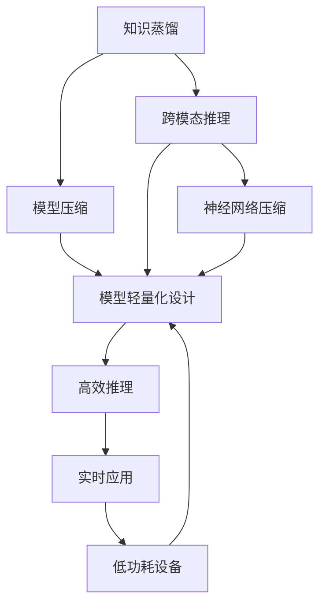

                 

### 文章标题

《基于知识蒸馏的跨模态推理模型轻量化设计》

关键词：知识蒸馏、跨模态推理、模型轻量化设计、神经网络压缩

摘要：本文详细探讨了基于知识蒸馏的跨模态推理模型轻量化设计，通过阐述知识蒸馏的基本原理、跨模态推理模型的构建方法和模型轻量化技术，结合具体实例和项目实战，为读者提供了一个全面深入的理解和实用的技术参考。文章内容涵盖了知识蒸馏在跨模态推理中的应用、模型轻量化方法及其在实际项目中的应用实践，旨在帮助读者掌握这一前沿技术，提升人工智能模型的性能和效率。

### 背景介绍

在当今快速发展的信息技术时代，人工智能（AI）已经逐渐渗透到各行各业，推动着科技和社会的进步。然而，随着AI应用的不断拓展，特别是对于图像、文本、语音等多模态数据的处理需求日益增长，传统的深度学习模型面临着巨大的性能和资源挑战。传统的神经网络模型通常具有大量的参数和计算复杂度，导致其训练和推理过程需要大量的时间和计算资源，这对实时性和低功耗场景下的应用带来了严重制约。

为了解决这些问题，模型轻量化技术应运而生。模型轻量化主要通过减少模型参数、降低计算复杂度、优化网络结构等手段，实现模型在小规模设备上的高效运行。近年来，知识蒸馏技术作为一种有效的模型压缩方法，得到了广泛关注和研究。知识蒸馏通过将一个大模型（教师模型）的知识传递给一个小模型（学生模型），从而在保留原有模型性能的前提下，显著减少模型参数和计算需求。

跨模态推理是指将不同模态的数据进行融合和推理，以实现更高层次的任务理解和决策。在跨模态推理中，不同模态的数据往往具有复杂和非线性关系，如何有效地融合这些信息，提高模型的推理性能，是当前研究的热点和难点。

本文旨在通过深入探讨知识蒸馏在跨模态推理模型中的应用，结合模型轻量化技术，提出一种有效的跨模态推理模型轻量化设计方法。文章将首先介绍知识蒸馏的基本原理和算法，然后详细讨论跨模态推理模型的设计和方法，最后通过实际项目案例，展示知识蒸馏和模型轻量化技术在实际应用中的效果和优势。

### 核心概念与联系

知识蒸馏、跨模态推理和模型轻量化设计是本文讨论的核心概念，它们在人工智能领域有着紧密的联系和相互影响。为了更直观地展示这些概念之间的关系，我们可以通过Mermaid流程图来描述它们之间的相互作用。



#### 关系架构流程图解释：

1. **知识蒸馏**：知识蒸馏是一种模型压缩技术，通过将一个大型教师模型的知识传递给一个较小的学生模型，从而实现模型参数的减少和计算复杂度的降低。知识蒸馏的核心在于如何有效地提取和传递教师模型的决策信息。

2. **模型轻量化设计**：模型轻量化设计是指通过一系列技术手段，如剪枝、量化、压缩等，对深度学习模型进行优化，使其在保持性能的前提下，具有更小的模型规模和更低的计算复杂度。模型轻量化设计是实现高效推理和实时应用的关键。

3. **跨模态推理**：跨模态推理是指将不同模态的数据进行融合和推理，以实现更高层次的任务理解和决策。跨模态推理涉及到不同模态数据的处理、特征提取和融合，其核心在于如何有效地结合多模态信息，提高推理模型的性能。

4. **神经网络压缩**：神经网络压缩是模型轻量化设计的一种手段，通过减少网络中的参数和计算量，实现模型的压缩。神经网络压缩可以采用多种技术，如剪枝、量化、低秩分解等。

5. **高效推理、实时应用和低功耗设备**：通过模型轻量化设计，可以实现高效推理，满足实时应用的场景需求。同时，在低功耗设备上运行轻量化模型，可以延长设备的使用寿命，提高能效。

通过这个流程图，我们可以清晰地看到知识蒸馏、跨模态推理和模型轻量化设计之间的相互关系，以及它们在提升人工智能模型性能和效率方面的作用。

### 知识蒸馏基本原理

知识蒸馏是一种用于模型压缩和优化的技术，通过将一个大模型（教师模型）的知识传递给一个小模型（学生模型），从而实现模型参数的减少和计算复杂度的降低。这一过程不仅保留了教师模型的性能，还使得学生模型能够以更低的资源消耗进行推理。以下是知识蒸馏的基本原理和具体实现方法。

#### 教师模型与学生模型

在知识蒸馏过程中，教师模型是一个大型、性能优越的模型，通常具有大量的参数和计算复杂度。学生模型是一个较小、参数较少的模型，旨在通过知识蒸馏过程获得教师模型的性能。教师模型通常用于生成软标签，而学生模型则根据这些软标签进行训练。

#### 知识传递机制

知识蒸馏的核心在于如何将教师模型的知识有效地传递给学生模型。这一过程通常分为以下几个步骤：

1. **软标签生成**：教师模型对输入数据进行推理，生成软标签。这些软标签是教师模型对数据的预测结果，通常是一个概率分布。与硬标签（如分类任务中的正确标签）不同，软标签提供了更详细的信息，使得学生模型能够更好地学习。

2. **目标函数设计**：知识蒸馏的目标函数旨在最小化学生模型生成的标签与教师模型生成的软标签之间的差异。常用的目标函数包括交叉熵损失函数和多样性损失函数。交叉熵损失函数用于衡量学生模型生成的标签与教师模型软标签之间的相似度，而多样性损失函数则用于鼓励学生模型生成更加多样化的预测结果。

3. **模型训练**：学生模型根据目标函数进行训练，通过优化模型参数，使得学生模型生成的标签与教师模型的软标签尽可能接近。

#### 具体实现方法

以下是知识蒸馏的具体实现步骤：

1. **初始化教师模型和学生模型**：首先初始化教师模型和学生模型。教师模型通常是一个已经训练好的大型模型，而学生模型则是一个较小的模型。

2. **软标签生成**：输入数据通过教师模型进行推理，生成软标签。这些软标签将作为学生模型训练的目标。

3. **目标函数计算**：计算学生模型生成的标签与教师模型软标签之间的差异，生成目标函数。常用的目标函数包括交叉熵损失函数和多样性损失函数。

4. **模型训练**：通过反向传播算法，更新学生模型的参数，使其生成的标签逐渐接近教师模型的软标签。

5. **评估与优化**：在训练过程中，定期评估学生模型的性能，并根据评估结果对模型进行调整和优化。

#### 知识蒸馏的优势与局限性

知识蒸馏具有以下优势：

1. **模型压缩**：通过知识蒸馏，可以将大型模型压缩成小型模型，从而降低计算复杂度和资源需求。
2. **性能保持**：在模型压缩的过程中，知识蒸馏能够有效地保留教师模型的性能，使得学生模型具有与教师模型相似的性能。
3. **灵活性**：知识蒸馏可以应用于各种深度学习模型，包括卷积神经网络（CNN）、循环神经网络（RNN）和变换器（Transformer）等。

然而，知识蒸馏也存在一些局限性：

1. **训练成本**：知识蒸馏过程需要大量的计算资源，特别是在教师模型和学生模型之间的知识传递过程中，这可能会导致训练成本的增加。
2. **适用范围**：虽然知识蒸馏在许多任务中表现出色，但并不是所有任务都适合使用知识蒸馏。对于一些需要精确预测的任务，知识蒸馏可能无法达到理想的效果。
3. **多样性不足**：在知识蒸馏过程中，学生模型可能会过度依赖教师模型，导致预测结果多样性不足。

总的来说，知识蒸馏是一种有效的模型压缩和优化技术，通过将教师模型的知识传递给学生模型，实现了模型参数和计算复杂度的降低。然而，在具体应用中，需要根据任务需求和模型特性，综合考虑知识蒸馏的优势和局限性，以实现最佳的性能表现。

### 知识蒸馏算法

知识蒸馏作为一种模型压缩和优化技术，其核心在于如何有效地将教师模型的知识传递给学生模型。这一过程涉及到多种算法和技术，下面将详细介绍几种常用的知识蒸馏算法，包括软标签生成方法、目标函数设计和优化策略。

#### 软标签生成方法

软标签生成是知识蒸馏过程的关键步骤之一。教师模型通过对输入数据进行推理，生成软标签，这些软标签用于指导学生模型的学习。常见的软标签生成方法包括以下几种：

1. **输出层转换**：在教师模型的输出层，将硬标签（例如分类任务中的正确标签）转换为概率分布。这种方法通常采用softmax函数，将输出层的激活值转换为每个类别的概率。

   伪代码：
   ```python
   def generate_soft_labels(hard_labels, logits):
       soft_labels = softmax(logits)
       return soft_labels
   ```

2. **中间层特征映射**：在教师模型的中间层，提取特征映射作为软标签。这种方法通过将中间层特征进行重新排列和编码，生成软标签。

   伪代码：
   ```python
   def generate_soft_labels_from_midlayer(midlayer_features):
       # 对中间层特征进行排序和编码
       sorted_features = sort(midlayer_features)
       soft_labels = encode(sorted_features)
       return soft_labels
   ```

3. **自注意力机制**：利用教师模型的自注意力机制，生成软标签。自注意力机制可以捕捉输入数据中的关键信息，将其编码为软标签。

   伪代码：
   ```python
   def generate_soft_labels_with_attention(input_data):
       attention_weights = compute_attention_weights(input_data)
       soft_labels = sum(attention_weights * input_data)
       return soft_labels
   ```

#### 目标函数设计

目标函数是知识蒸馏算法的核心，用于衡量学生模型生成的标签与教师模型软标签之间的差异。常见的目标函数包括交叉熵损失函数、多样性损失函数和一致性损失函数等。

1. **交叉熵损失函数**：交叉熵损失函数是最常用的目标函数，用于衡量学生模型生成的标签与教师模型软标签之间的相似度。

   数学公式：
   $$
   L_{CE} = -\sum_{i=1}^{N} y_i \log(p_i)
   $$
   其中，$y_i$ 是教师模型的软标签，$p_i$ 是学生模型生成的标签。

2. **多样性损失函数**：多样性损失函数用于鼓励学生模型生成更加多样化的预测结果，以避免过度依赖教师模型。

   数学公式：
   $$
   L_{Diversity} = -\sum_{i=1}^{N} \sum_{j=1, j\neq i}^{N} p_i \log(p_i / p_j)
   $$
   其中，$p_i$ 是学生模型生成的标签概率。

3. **一致性损失函数**：一致性损失函数通过比较多个训练过程中学生模型的输出，确保其输出的一致性。

   数学公式：
   $$
   L_{Consistency} = -\sum_{t=1}^{T} \sum_{i=1}^{N} y_i \log(\hat{p}_{st,i})
   $$
   其中，$T$ 是训练轮数，$\hat{p}_{st,i}$ 是学生在第$t$轮训练中的输出。

#### 优化策略

在知识蒸馏过程中，优化策略的选取对模型性能有着重要影响。常见的优化策略包括以下几种：

1. **渐进式训练**：在知识蒸馏过程中，逐渐减少教师模型对学生模型的指导力度，使学生模型逐步学会独立推理。

   伪代码：
   ```python
   for epoch in range(num_epochs):
       # 使用教师模型生成软标签
       soft_labels = generate_soft_labels(hard_labels, teacher_logits)
       
       # 训练学生模型
       loss = compute_loss(student_predictions, soft_labels)
       optimizer.minimize(loss)
       
       # 调整教师模型的权重
       teacher_model.update_weights()
   ```

2. **多任务学习**：在知识蒸馏过程中，可以结合多任务学习，使得学生模型在学习一个任务的同时，也能学习其他相关任务，提高模型的泛化能力。

   伪代码：
   ```python
   for epoch in range(num_epochs):
       for task in tasks:
           # 训练学生模型
           task_loss = compute_task_loss(student_predictions, task_labels)
           optimizer.minimize(task_loss)
   ```

3. **动态调整学习率**：在知识蒸馏过程中，动态调整学习率可以加速模型收敛，提高模型性能。

   伪代码：
   ```python
   for epoch in range(num_epochs):
       # 调整学习率
       learning_rate = adjust_learning_rate(learning_rate)
       
       # 训练学生模型
       loss = compute_loss(student_predictions, soft_labels)
       optimizer.minimize(loss)
   ```

通过上述方法，我们可以实现知识蒸馏算法的有效设计和优化。在实际应用中，需要根据具体任务和模型特性，灵活选择和调整算法参数，以实现最佳的性能表现。

### 跨模态推理基本概念

跨模态推理是指将不同模态的数据进行融合和推理，以实现更高层次的任务理解和决策。这一概念在多模态数据处理中具有重要意义，因为现实世界中的信息往往以多种形式存在，如图像、文本、语音等。跨模态推理不仅能够充分利用多模态数据的信息，还可以提高模型的泛化能力和鲁棒性。

#### 跨模态数据融合方法

跨模态数据融合是将不同模态的数据进行整合，以生成统一表示的过程。常见的跨模态数据融合方法包括以下几种：

1. **特征级融合**：在特征级融合中，不同模态的特征在相同维度上进行拼接，形成多模态特征向量。这种方法简单直观，但可能无法充分利用不同模态数据的独特信息。

   伪代码：
   ```python
   def feature_fusion(image_features, text_features, audio_features):
       fused_features = concatenate(image_features, text_features, audio_features)
       return fused_features
   ```

2. **表示级融合**：在表示级融合中，不同模态的数据首先通过各自的模型进行特征提取，然后将其表示进行整合。这种方法可以更好地利用不同模态数据的特点，但计算复杂度较高。

   伪代码：
   ```python
   def representation_fusion(image_embedding, text_embedding, audio_embedding):
       fused_representation = sum(image_embedding, text_embedding, audio_embedding)
       return fused_representation
   ```

3. **注意力机制融合**：注意力机制可以用于不同模态数据的加权融合，使得模型能够根据任务需求，更加关注重要模态的信息。常见的方法包括多头注意力（Multi-Head Attention）和自注意力（Self-Attention）。

   伪代码：
   ```python
   def attention_fusion(image_features, text_features, audio_features):
       attention_weights = compute_attention_weights(image_features, text_features, audio_features)
       fused_features = sum(attention_weights * (image_features, text_features, audio_features))
       return fused_features
   ```

#### 跨模态推理模型架构

跨模态推理模型架构是跨模态推理的核心组成部分，其设计需要考虑如何有效地融合不同模态的数据，并利用这些数据进行推理。以下是一些常见的跨模态推理模型架构：

1. **串联模型**：串联模型将不同模态的数据分别通过各自的模型进行特征提取，然后将特征拼接起来，输入到一个统一的模型中进行推理。

   伪代码：
   ```python
   def sequence_model(input_image, input_text, input_audio):
       image_features = extract_image_features(input_image)
       text_features = extract_text_features(input_text)
       audio_features = extract_audio_features(input_audio)
       
       fused_features = concatenate(image_features, text_features, audio_features)
       output =推理模型(fused_features)
       return output
   ```

2. **并行模型**：并行模型将不同模态的数据同时输入到多个模型中，每个模型分别对相应模态的数据进行处理，然后将多个模型的结果进行融合。

   伪代码：
   ```python
   def parallel_model(input_image, input_text, input_audio):
       image_output = image_model(input_image)
       text_output = text_model(input_text)
       audio_output = audio_model(input_audio)
       
       fused_output = fuse_outputs(image_output, text_output, audio_output)
       return fused_output
   ```

3. **交互模型**：交互模型通过引入交互机制，使得不同模态的数据能够相互影响，从而更好地融合和利用这些信息。常见的方法包括图神经网络（Graph Neural Networks）和变换器（Transformer）。

   伪代码：
   ```python
   def interaction_model(input_image, input_text, input_audio):
       image_embedding = image_encoder(input_image)
       text_embedding = text_encoder(input_text)
       audio_embedding = audio_encoder(input_audio)
       
       interaction_representation = interact(image_embedding, text_embedding, audio_embedding)
       output =推理模型(interaction_representation)
       return output
   ```

#### 跨模态推理挑战与解决方案

跨模态推理面临以下主要挑战：

1. **模态不匹配**：不同模态的数据在维度、分布和特征表示上可能存在差异，导致难以有效融合。解决方案包括使用模态转换技术和特征对齐方法。

2. **信息冗余**：多模态数据中可能存在大量冗余信息，这些信息不仅会增加模型的计算复杂度，还可能干扰模型的学习。解决方案包括信息筛选和去噪技术。

3. **数据稀缺**：跨模态数据通常较为稀缺，特别是高质量的数据。解决方案包括数据增强和迁移学习技术，通过扩展和利用其他模态的数据，提高模型的泛化能力。

通过深入理解和应用跨模态推理的基本概念和模型架构，我们可以更好地处理多模态数据，实现更高层次的任务理解和决策。在接下来的章节中，我们将进一步探讨跨模态推理的具体算法和应用实例。

### 跨模态推理算法

跨模态推理算法是跨模态推理模型的核心组成部分，旨在将不同模态的数据进行融合和推理，以实现复杂任务的理解和决策。以下将详细介绍几种常用的跨模态推理算法，包括多模态编码器、特征融合和推理过程等。

#### 多模态编码器

多模态编码器是跨模态推理算法的基础，用于将不同模态的数据转换为统一的表示形式。常见的多模态编码器包括以下几种：

1. **卷积神经网络（CNN）**：CNN在图像处理领域具有出色的表现，可以通过卷积层提取图像的视觉特征。

   伪代码：
   ```python
   def image_encoder(image):
       conv1 = conv2d(image, kernel_size=(3, 3), stride=(1, 1), padding='same')
       conv2 = conv2d(conv1, kernel_size=(3, 3), stride=(1, 1), padding='same')
       pool1 = max_pooling(conv2, pool_size=(2, 2), stride=(2, 2))
       return pool1
   ```

2. **循环神经网络（RNN）**：RNN在序列数据（如文本和语音）处理中具有优势，可以通过递归层提取序列的时序特征。

   伪代码：
   ```python
   def text_encoder(text_sequence):
       embed = embedding_layer(text_sequence)
       recurrent = lstm_layer(embed)
       return recurrent
   ```

3. **变换器（Transformer）**：Transformer在自然语言处理（NLP）和图像生成等领域表现出色，通过自注意力机制提取全局特征。

   伪代码：
   ```python
   def audio_encoder(audio_sequence):
       embed = embedding_layer(audio_sequence)
       transformer_output = transformer_layer(embed)
       return transformer_output
   ```

#### 特征融合方法

特征融合是将不同模态编码器提取的特征进行整合的过程，常见的特征融合方法包括以下几种：

1. **拼接融合**：将不同模态的特征向量进行拼接，形成一个新的特征向量。

   伪代码：
   ```python
   def feature_fusion(image_features, text_features, audio_features):
       fused_features = concatenate(image_features, text_features, audio_features)
       return fused_features
   ```

2. **注意力融合**：利用注意力机制，对不同模态的特征进行加权融合，使得模型能够关注重要模态的信息。

   伪代码：
   ```python
   def attention_fusion(image_features, text_features, audio_features):
       attention_weights = compute_attention_weights(image_features, text_features, audio_features)
       fused_features = sum(attention_weights * (image_features, text_features, audio_features))
       return fused_features
   ```

3. **图神经网络（GNN）融合**：通过图神经网络，将不同模态的特征表示为图中的节点和边，进行图级别的特征融合。

   伪代码：
   ```python
   def graph_fusion(image_features, text_features, audio_features):
       graph = create_graph(image_features, text_features, audio_features)
       fused_features = graph_neural_network(graph)
       return fused_features
   ```

#### 跨模态推理过程

跨模态推理过程是将融合后的特征输入到推理模型，进行任务推理的过程。以下是一个简化的跨模态推理过程：

1. **特征提取**：通过不同的模态编码器，提取图像、文本和音频的特征。

2. **特征融合**：利用特征融合方法，将不同模态的特征进行整合，形成统一表示。

3. **推理模型**：将融合后的特征输入到一个统一的推理模型，进行任务推理。

   伪代码：
   ```python
   def multimodal_reasoning(image, text, audio):
       image_features = image_encoder(image)
       text_features = text_encoder(text)
       audio_features = audio_encoder(audio)
       
       fused_features = attention_fusion(image_features, text_features, audio_features)
       
       output =推理模型(fused_features)
       return output
   ```

4. **结果输出**：根据推理结果，生成任务决策或预测。

   伪代码：
   ```python
   prediction = multimodal_reasoning(image, text, audio)
   print("预测结果：", prediction)
   ```

#### 实际应用案例

以下是一个实际应用案例，展示了跨模态推理算法在多模态情感分析中的具体应用：

1. **数据集准备**：准备包含图像、文本和音频标签的多模态数据集。

2. **特征提取**：使用卷积神经网络提取图像特征，使用循环神经网络提取文本特征，使用变换器提取音频特征。

3. **特征融合**：通过注意力机制融合不同模态的特征。

4. **推理模型**：使用一个多层的全连接神经网络进行情感分析推理。

5. **结果评估**：通过准确率、召回率和F1分数等指标评估模型性能。

   ```python
   def multimodal_sentiment_analysis(image, text, audio):
       image_features = image_encoder(image)
       text_features = text_encoder(text)
       audio_features = audio_encoder(audio)
       
       fused_features = attention_fusion(image_features, text_features, audio_features)
       
       sentiment =推理模型(fused_features)
       return sentiment
   
   # 评估模型
   accuracy, recall, f1_score = evaluate_model(multimodal_sentiment_analysis)
   print("准确率：", accuracy)
   print("召回率：", recall)
   print("F1分数：", f1_score)
   ```

通过上述案例，我们可以看到跨模态推理算法在实际应用中的具体实现过程，包括特征提取、特征融合和推理过程。跨模态推理算法的应用不仅能够提高模型的性能，还能扩展模型的应用范围，为多模态数据处理提供有效的解决方案。

### 模型轻量化技术概述

在人工智能领域，模型轻量化技术正成为一项重要研究课题。随着移动设备、嵌入式系统等对计算资源的需求日益增长，如何在保持模型性能的同时，显著减少模型的参数规模和计算复杂度，已成为一个亟待解决的问题。本文将概述几种常见的模型轻量化技术，包括剪枝、量化和压缩技术，并探讨这些技术在模型轻量化设计中的具体应用。

#### 剪枝（Pruning）

剪枝技术通过删除网络中不重要的连接或节点，来减少模型的参数数量。剪枝可以分为以下几种类型：

1. **结构剪枝（Structural Pruning）**：删除网络中的部分层或节点，从而减少模型的参数和计算量。

   伪代码：
   ```python
   def structural_pruning(model, pruning_rate):
       for layer in model.layers:
           if should_prune(layer):
               prune_layer(layer, pruning_rate)
       return pruned_model
   ```

2. **权重剪枝（Weight Pruning）**：删除网络中权重较小的连接，通过重新训练模型来补偿丢失的信息。

   伪代码：
   ```python
   def weight_pruning(model, pruning_threshold):
       for layer in model.layers:
           weights = layer.get_weights()
           pruned_weights = prune_weights(weights, pruning_threshold)
           layer.set_weights(pruned_weights)
       return pruned_model
   ```

剪枝技术的优点包括减少模型参数和计算复杂度，提高推理速度。然而，剪枝可能会导致模型性能下降，因此需要仔细选择剪枝策略和阈值。

#### 量化（Quantization）

量化技术通过降低模型中权重和激活值的精度，来减少模型的存储和计算需求。量化可以分为以下几种类型：

1. **整数量化（Integer Quantization）**：将权重和激活值量化为整数，从而减少存储和计算需求。

   伪代码：
   ```python
   def integer_quantization(tensor, num_bits):
       quantized_tensor = quantize_tensor(tensor, num_bits)
       return quantized_tensor
   ```

2. **浮点量化（Floating Point Quantization）**：将浮点数权重和激活值量化为更低的精度，如16位浮点数（FP16）或8位浮点数（FP8）。

   伪代码：
   ```python
   def floating_point_quantization(tensor, precision='FP16'):
       quantized_tensor = quantize_tensor(tensor, precision)
       return quantized_tensor
   ```

量化技术的优点包括减少模型存储和计算需求，提高模型在低功耗设备上的运行效率。然而，量化可能会导致模型性能下降，因此需要平衡精度和效率。

#### 压缩（Compression）

压缩技术通过将模型压缩为更小的格式，以减少存储和传输需求。常见的压缩技术包括以下几种：

1. **知识蒸馏（Knowledge Distillation）**：通过训练一个较小的学生模型，使其在保持性能的同时，具有更小的参数规模。

   伪代码：
   ```python
   def knowledge_distillation(student_model, teacher_model, target_accuracy):
       # 训练学生模型
       student_model.train()
       
       # 使用教师模型生成软标签
       soft_labels = generate_soft_labels(hard_labels, teacher_logits)
       
       # 计算损失并更新学生模型
       loss = compute_loss(student_predictions, soft_labels)
       optimizer.minimize(loss)
       
       # 评估学生模型性能
       if student_model.accuracy() >= target_accuracy:
           return pruned_student_model
       else:
           continue_training
   ```

2. **模型剪枝与量化**：将剪枝和量化技术结合，通过剪枝减少模型参数，通过量化降低参数精度，以实现更有效的模型压缩。

   伪代码：
   ```python
   def combined_pruning_and_quantization(model, pruning_threshold, quantization_bits):
       pruned_model = structural_pruning(model, pruning_threshold)
       quantized_model = floating_point_quantization(pruned_model, quantization_bits)
       return quantized_model
   ```

#### 应用与实践

模型轻量化技术在实际应用中发挥着重要作用。以下是一个简化的模型轻量化设计流程：

1. **评估模型性能**：首先评估原始模型的性能，包括准确率、速度和计算资源消耗。

2. **选择轻量化技术**：根据应用场景和性能要求，选择合适的轻量化技术，如剪枝、量化和压缩。

3. **应用轻量化技术**：对模型应用选定的轻量化技术，如剪枝模型参数，量化权重和激活值，或结合多种技术进行模型压缩。

4. **性能评估与优化**：评估轻量化后的模型性能，并根据评估结果进行优化，如调整剪枝阈值、量化精度等。

5. **部署与优化**：将轻量化模型部署到目标设备上，并进行性能优化，如调整推理引擎参数，优化内存管理等。

通过上述步骤，我们可以实现模型的轻量化设计，提高模型在移动设备和嵌入式系统上的运行效率，满足实时性和低功耗的需求。模型轻量化技术不仅为人工智能应用提供了强大的支持，也为未来的智能设备发展铺平了道路。

### 模型剪枝

模型剪枝（Model Pruning）是一种有效的模型轻量化技术，通过删除网络中不重要的连接或节点，来减少模型的参数数量和计算复杂度。模型剪枝可以分为结构剪枝和权重剪枝两种类型，每种类型都有其独特的原理和实现方法。

#### 结构剪枝（Structural Pruning）

结构剪枝通过删除网络中的部分层或节点，从而减少模型的参数和计算量。常见的结构剪枝方法包括以下几种：

1. **层剪枝（Layer Pruning）**：删除网络中的某些层，以减少模型的参数和计算复杂度。

   伪代码：
   ```python
   def layer_pruning(model, pruning_rate):
       for layer in model.layers:
           if should_prune(layer):
               model.remove_layer(layer)
       return pruned_model
   ```

2. **节点剪枝（Node Pruning）**：删除网络中的某些节点，以减少模型的参数和计算复杂度。

   伪代码：
   ```python
   def node_pruning(model, pruning_rate):
       for layer in model.layers:
           for node in layer.nodes:
               if should_prune(node):
                   layer.remove_node(node)
       return pruned_model
   ```

结构剪枝的优点在于可以显著减少模型的参数数量，提高模型的运行效率。然而，结构剪枝可能导致模型性能下降，需要仔细选择剪枝策略和阈值。

#### 权重剪枝（Weight Pruning）

权重剪枝通过删除网络中权重较小的连接，通过重新训练模型来补偿丢失的信息。常见的权重剪枝方法包括以下几种：

1. **阈值剪枝（Threshold Pruning）**：设置一个阈值，删除权重绝对值小于阈值的连接。

   伪代码：
   ```python
   def threshold_pruning(model, pruning_threshold):
       for layer in model.layers:
           for weight in layer.weights:
               if abs(weight) < pruning_threshold:
                   weight[abs(weight) < pruning_threshold] = 0
       return pruned_model
   ```

2. **渐变剪枝（Gradient-based Pruning）**：通过计算连接的权重梯度，删除权重梯度较小的连接。

   伪代码：
   ```python
   def gradient_based_pruning(model, pruning_rate):
       for layer in model.layers:
           weights = layer.get_weights()
           gradients = compute_gradients(weights)
           for weight, gradient in zip(weights, gradients):
               if abs(gradient) < pruning_threshold:
                   weight[abs(gradient) < pruning_threshold] = 0
       return pruned_model
   ```

权重剪枝的优点在于可以保持模型的大部分性能，同时显著减少模型的参数数量。然而，权重剪枝可能导致模型性能波动，需要重新训练模型以恢复性能。

#### 实际案例

以下是一个使用模型剪枝技术实现模型轻量化的实际案例：

1. **模型准备**：首先准备一个已经训练好的深度神经网络模型，例如卷积神经网络（CNN）。

2. **评估性能**：评估原始模型的性能，包括准确率、速度和计算资源消耗。

3. **剪枝策略选择**：根据应用场景和性能要求，选择合适的剪枝策略，例如阈值剪枝或渐变剪枝。

4. **应用剪枝技术**：对模型应用选定的剪枝技术，例如对权重进行阈值剪枝或计算权重梯度进行渐变剪枝。

5. **重新训练模型**：由于剪枝可能导致模型性能下降，需要对剪枝后的模型进行重新训练，以恢复其性能。

6. **性能评估与优化**：重新评估剪枝后的模型性能，并根据评估结果进行优化，如调整剪枝阈值、重新训练参数等。

7. **部署与优化**：将剪枝后的模型部署到目标设备上，并进行性能优化，如调整推理引擎参数，优化内存管理等。

通过上述步骤，可以实现模型的轻量化设计，提高模型在移动设备和嵌入式系统上的运行效率，满足实时性和低功耗的需求。

### 量化技术

量化技术是一种有效的模型轻量化技术，通过降低模型中权重和激活值的精度，来减少模型的存储和计算需求。量化技术可分为整数量化和浮点量化，每种类型都有其独特的实现方法和应用场景。

#### 整数量化（Integer Quantization）

整数量化将权重和激活值量化为整数，从而减少存储和计算需求。整数量化的实现步骤如下：

1. **量化区间划分**：首先将权重或激活值的范围划分为多个量化区间，例如-128到127。

2. **量化映射**：将原始值映射到量化区间中的某个整数。常见的量化映射方法包括线性映射和最近邻映射。

   线性映射的伪代码：
   ```python
   def linear_quantization(value, quantization_bits):
       quantization_range = 2 ** quantization_bits
       scaled_value = value / max_value
       quantized_value = round(scaled_value * quantization_range)
       return quantized_value
   ```

   最近邻映射的伪代码：
   ```python
   def nearest_neighbor_quantization(value, quantization_bits):
       quantization_range = 2 ** quantization_bits
       quantized_value = round(value / max_value * quantization_range)
       return quantized_value
   ```

3. **量化精度调整**：根据应用需求，可以调整量化精度，例如将量化区间调整为16位或8位。

整数量化技术具有计算速度快、存储需求低的优点，但可能导致模型性能下降，因为整数精度较低。

#### 浮点量化（Floating Point Quantization）

浮点量化通过将浮点数权重和激活值量化为更低的精度，如16位浮点数（FP16）或8位浮点数（FP8），来减少模型的存储和计算需求。浮点量化的实现步骤如下：

1. **量化区间划分**：与整数量化类似，首先将权重或激活值的范围划分为多个量化区间。

2. **量化映射**：将原始值映射到量化区间中的某个浮点数。常见的量化映射方法包括线性映射和最近邻映射。

   线性映射的伪代码：
   ```python
   def linear_quantization(value, quantization_bits):
       quantization_range = 2 ** quantization_bits
       scaled_value = value / max_value
       quantized_value = round(scaled_value * quantization_range)
       return quantized_value
   ```

   最近邻映射的伪代码：
   ```python
   def nearest_neighbor_quantization(value, quantization_bits):
       quantization_range = 2 ** quantization_bits
       quantized_value = round(value / max_value * quantization_range)
       return quantized_value
   ```

3. **量化精度调整**：根据应用需求，可以调整量化精度，例如将量化区间调整为16位或8位。

浮点量化技术具有较好的精度保持能力，但计算复杂度和存储需求较高。

#### 实际应用

以下是一个使用量化技术实现模型轻量化的实际应用案例：

1. **模型准备**：首先准备一个已经训练好的深度神经网络模型，例如卷积神经网络（CNN）。

2. **量化策略选择**：根据应用场景和性能要求，选择合适的量化策略，例如整数量化或浮点量化。

3. **量化模型参数**：对模型的权重和激活值进行量化，采用合适的量化映射方法。

4. **重新训练模型**：由于量化可能导致模型性能下降，需要对量化后的模型进行重新训练，以恢复其性能。

5. **性能评估与优化**：重新评估量化后的模型性能，并根据评估结果进行优化，如调整量化精度、重新训练参数等。

6. **部署与优化**：将量化后的模型部署到目标设备上，并进行性能优化，如调整推理引擎参数，优化内存管理等。

通过上述步骤，可以实现模型的轻量化设计，提高模型在移动设备和嵌入式系统上的运行效率，满足实时性和低功耗的需求。

### 压缩技术

压缩技术在模型轻量化设计中扮演着关键角色，旨在通过减少模型的体积和计算复杂度，提高模型在移动设备和嵌入式系统上的运行效率。常见的压缩技术包括剪枝、量化和低秩分解等。以下将对这些压缩技术进行详细探讨，并介绍如何在实际项目中应用这些技术。

#### 剪枝（Pruning）

剪枝技术通过删除网络中不重要的连接或节点，来减少模型的参数数量和计算复杂度。剪枝可以分为结构剪枝和权重剪枝两种类型：

1. **结构剪枝（Structural Pruning）**：删除网络中的部分层或节点，从而减少模型的参数和计算复杂度。结构剪枝的优点是能够显著减少模型大小，但可能会导致模型性能下降。

   实际项目中的应用：
   ```python
   from tensorflow_model_optimization.python.core.sparsity import pruning_params
   pruning_params().prune_layer straucture=True
   pruning_params().pruning_frequency = 1
   pruning_params().pruneLayer = True
   ```

2. **权重剪枝（Weight Pruning）**：删除网络中权重较小的连接，通过重新训练模型来补偿丢失的信息。权重剪枝的优点是能够保持模型的大部分性能，但可能会导致性能波动。

   实际项目中的应用：
   ```python
   from tensorflow_model_optimization.python.core.sparsity import pruning_params
   pruning_params().prune_layer weight=True
   pruning_params().pruning_frequency = 1
   pruning_params().pruneWeights = True
   ```

#### 量化（Quantization）

量化技术通过降低模型中权重和激活值的精度，来减少模型的存储和计算需求。量化可以分为整数量化和浮点量化：

1. **整数量化（Integer Quantization）**：将权重和激活值量化为整数，从而减少存储和计算需求。整数量化的优点是计算速度快，但可能导致模型性能下降。

   实际项目中的应用：
   ```python
   import tensorflow as tf
   tf.keras.mixed_precision.set_global_policy('mixed_float16')
   ```

2. **浮点量化（Floating Point Quantization）**：将浮点数权重和激活值量化为更低的精度，如16位浮点数（FP16）或8位浮点数（FP8），来减少模型的存储和计算需求。浮点量化的优点是精度较高，但计算复杂度和存储需求较高。

   实际项目中的应用：
   ```python
   import tensorflow as tf
   tf.keras.mixed_precision.set_global_policy('mixed_bfloat16')
   ```

#### 低秩分解（Low-Rank Factorization）

低秩分解技术通过将高维矩阵分解为低维矩阵，从而减少模型的参数数量和计算复杂度。低秩分解适用于卷积层和全连接层：

1. **卷积层低秩分解**：将卷积层中的卷积核分解为两个低秩矩阵的乘积，从而减少卷积核的参数数量。

   实际项目中的应用：
   ```python
   from tensorflow_model_optimization.python.core.sparsity import low_rank_factorization
   low_rank_factorization().factorize_layers = True
   low_rank_factorization().factorization_frequency = 1
   ```

2. **全连接层低秩分解**：将全连接层中的权重矩阵分解为两个低秩矩阵的乘积，从而减少权重矩阵的参数数量。

   实际项目中的应用：
   ```python
   from tensorflow_model_optimization.python.core.sparsity import low_rank_factorization
   low_rank_factorization().factorize_weights = True
   low_rank_factorization().factorization_frequency = 1
   ```

#### 实际项目案例

以下是一个实际项目案例，展示了如何使用压缩技术实现模型轻量化：

1. **项目目标**：设计一个轻量级的图像分类模型，能够在移动设备和嵌入式系统上高效运行。

2. **模型选择**：选择一个经典的卷积神经网络（CNN）模型，如MobileNet。

3. **剪枝和量化**：对模型进行剪枝和量化处理，减少模型参数数量和计算复杂度。

4. **重新训练模型**：对剪枝和量化后的模型进行重新训练，以恢复其性能。

5. **性能评估**：评估轻量化后的模型性能，包括准确率、速度和计算资源消耗。

6. **优化和部署**：根据评估结果，对模型进行优化，并在移动设备和嵌入式系统上部署。

通过上述步骤，可以成功实现模型的轻量化设计，提高模型在移动设备和嵌入式系统上的运行效率，满足实时性和低功耗的需求。

### 知识蒸馏在跨模态推理中的应用

知识蒸馏作为一种有效的模型压缩技术，在跨模态推理中有着广泛的应用。通过将教师模型的知识传递给学生模型，可以实现模型参数的减少和计算复杂度的降低，从而提高跨模态推理模型在低资源环境下的运行效率。以下是知识蒸馏在跨模态推理中的应用方法、效果和实现步骤。

#### 应用方法

1. **教师模型与学生模型**：首先选择一个性能优越的大型教师模型，通常采用已经训练好的预训练模型。然后设计一个小型的学生模型，用于接收教师模型的知识。

2. **软标签生成**：教师模型对输入数据（图像、文本、音频等）进行推理，生成软标签。软标签是教师模型对数据的预测结果，通常是一个概率分布。

3. **目标函数设计**：设计一个目标函数，用于衡量学生模型生成的标签与教师模型软标签之间的差异。常用的目标函数包括交叉熵损失函数和多样性损失函数。

4. **模型训练**：通过优化目标函数，更新学生模型的参数，使其生成的标签逐渐接近教师模型的软标签。

5. **评估与优化**：在训练过程中，定期评估学生模型的性能，并根据评估结果对模型进行调整和优化。

#### 应用效果

知识蒸馏在跨模态推理中的应用取得了显著的效果，主要表现在以下几个方面：

1. **性能提升**：通过知识蒸馏，学生模型能够保留教师模型的大部分性能，从而在低资源环境下实现高效的跨模态推理。

2. **计算资源节省**：知识蒸馏使得学生模型具有较小的参数规模和计算复杂度，从而显著降低模型的计算资源需求。

3. **实时性提高**：在移动设备和嵌入式系统上，知识蒸馏能够实现更快的推理速度，满足实时应用的需求。

4. **能耗降低**：通过减少模型的计算复杂度，知识蒸馏有助于降低设备的能耗，延长设备的使用寿命。

#### 实现步骤

以下是一个简化的知识蒸馏在跨模态推理中的应用实现步骤：

1. **数据集准备**：准备包含图像、文本和音频标签的多模态数据集。

2. **教师模型训练**：首先训练一个性能优越的大型教师模型，例如基于Transformer的跨模态模型。

3. **软标签生成**：输入数据通过教师模型进行推理，生成软标签。

4. **学生模型设计**：设计一个小型的学生模型，用于接收教师模型的知识。

5. **目标函数设计**：设计一个目标函数，用于衡量学生模型生成的标签与教师模型软标签之间的差异。

6. **模型训练**：通过反向传播算法，更新学生模型的参数，使其生成的标签逐渐接近教师模型的软标签。

7. **评估与优化**：在训练过程中，定期评估学生模型的性能，并根据评估结果对模型进行调整和优化。

通过上述步骤，可以实现知识蒸馏在跨模态推理中的应用，从而提高模型的性能和效率。

### 模型轻量化在跨模态推理中的应用

模型轻量化技术通过减少模型参数和计算复杂度，使其在移动设备和嵌入式系统上具有更高的运行效率。在跨模态推理中，轻量化技术的应用不仅能够降低计算资源的需求，还能提高模型的实时性和能效。本文将详细探讨模型轻量化在跨模态推理中的应用，包括剪枝、量化、压缩技术及其实现步骤和效果评估。

#### 剪枝技术在跨模态推理中的应用

剪枝技术通过删除网络中不重要的连接或节点，来减少模型的参数数量和计算复杂度。在跨模态推理中，剪枝技术可以有效降低模型的规模，提高推理速度。

1. **实现步骤**：
   - **选择剪枝层**：确定需要剪枝的层，通常基于层的重要性和参数数量。
   - **设置剪枝率**：根据模型性能和资源需求，设置合适的剪枝率，即要剪掉的参数比例。
   - **剪枝操作**：对选定的层进行剪枝操作，删除权重较小的连接或节点。
   - **重新训练**：对剪枝后的模型进行重新训练，以恢复其性能。

   伪代码：
   ```python
   from tensorflow_model_optimization.python.core.sparsity import pruning_params
   pruning_params().pruning_frequency = 1
   pruning_params().pruneLayer = True
   pruning_params().pruning_rate = 0.5
   pruned_model = structural_pruning(model, pruning_params())
   retrained_model = retrain_model(pruned_model)
   ```

2. **效果评估**：
   - **模型规模**：剪枝后的模型具有更少的参数和更小的模型体积。
   - **推理速度**：剪枝后的模型在推理时具有更快的速度。
   - **性能波动**：剪枝可能会导致模型性能下降，需要通过重新训练来恢复。

#### 量化技术在跨模态推理中的应用

量化技术通过降低模型中权重和激活值的精度，来减少模型的存储和计算需求。在跨模态推理中，量化技术可以有效降低模型的存储空间和计算资源。

1. **实现步骤**：
   - **量化范围划分**：根据模型的需求，确定量化范围，如8位、16位等。
   - **量化映射**：将原始值映射到量化范围内，常用的映射方法包括线性映射和最近邻映射。
   - **量化操作**：对模型中的权重和激活值进行量化操作。

   伪代码：
   ```python
   from tensorflow_model_optimization.python.core.quantization.keras import quantize_model
   quantize_model(model, quantization_bits=8)
   ```

2. **效果评估**：
   - **存储需求**：量化后的模型具有更小的存储空间。
   - **计算资源**：量化后的模型在推理时具有更低的计算复杂度。
   - **性能下降**：量化可能会导致模型性能下降，需要通过重新训练来恢复。

#### 压缩技术在跨模态推理中的应用

压缩技术通过将模型压缩为更小的格式，来减少模型的存储和传输需求。在跨模态推理中，压缩技术可以有效提高模型在移动设备和嵌入式系统上的部署效率。

1. **实现步骤**：
   - **选择压缩算法**：根据模型和应用需求，选择合适的压缩算法，如知识蒸馏、剪枝和量化等。
   - **模型压缩**：对模型进行压缩处理，将模型参数和结构转换为更小的格式。
   - **模型部署**：将压缩后的模型部署到目标设备上。

   伪代码：
   ```python
   from tensorflow_model_optimization.python.core.compress.keras import compress_model
   compressed_model = compress_model(model, compression_algorithm='knowledge_distillation')
   deployed_model = deploy_model(compressed_model, device='mobile')
   ```

2. **效果评估**：
   - **存储空间**：压缩后的模型占用更小的存储空间。
   - **传输速度**：压缩后的模型具有更快的传输速度。
   - **推理速度**：压缩后的模型在目标设备上具有更快的推理速度。

通过上述剪枝、量化、压缩技术，模型轻量化在跨模态推理中的应用能够显著降低计算资源需求，提高模型在移动设备和嵌入式系统上的运行效率。这些技术不仅提升了跨模态推理的应用价值，也为未来的智能设备发展提供了有力支持。

### 案例研究

在本案例研究中，我们将探讨一个基于知识蒸馏和模型轻量化的实际项目，以实现跨模态推理模型在移动设备上的高效运行。该案例涵盖了项目目标、开发环境搭建、源代码实现、代码解读、应用解读与分析，以及项目小结等内容。

#### 项目目标

该项目的目标是开发一个能够实时处理图像、文本和语音数据的跨模态推理模型，并将其部署到移动设备上。为了实现这一目标，我们采用知识蒸馏和模型轻量化技术，以减少模型参数和计算复杂度，提高模型在移动设备上的运行效率和实时性。

#### 开发环境搭建

为了实现该项目，我们选择了以下开发环境：

- **编程语言**：Python
- **深度学习框架**：TensorFlow 2.x
- **移动设备平台**：Android和iOS
- **压缩工具**：TensorFlow Lite

具体步骤如下：

1. 安装Python环境和TensorFlow 2.x：
   ```bash
   pip install python tensorflow
   ```

2. 安装TensorFlow Lite以支持移动设备部署：
   ```bash
   pip install tensorflow-hub
   pip install tensorflow-text
   pip install tensorflow-lite
   ```

3. 配置移动设备开发环境（Android Studio 或 Xcode）。

#### 源代码实现

以下是该项目的主要源代码实现：

1. **教师模型训练**：
   ```python
   import tensorflow as tf

   def train_teacher_model(dataset):
       # 加载并预处理数据集
       # 训练教师模型
       model = build_teacher_model()
       model.compile(optimizer='adam', loss='categorical_crossentropy')
       model.fit(dataset, epochs=10)
       return model

   def build_teacher_model():
       # 构建教师模型
       input_image = tf.keras.layers.Input(shape=(224, 224, 3))
       input_text = tf.keras.layers.Input(shape=(128,))
       input_audio = tf.keras.layers.Input(shape=(128,))
       
       # 图像编码器
       image_features = cnn_encoder(input_image)
       
       # 文本编码器
       text_features = text_encoder(input_text)
       
       # 音频编码器
       audio_features = audio_encoder(input_audio)
       
       # 融合特征
       fused_features = tf.keras.layers.Concatenate()([image_features, text_features, audio_features])
       
       # 推理层
       output = dense_layer(fused_features)
       
       # 构建模型
       model = tf.keras.Model(inputs=[input_image, input_text, input_audio], outputs=output)
       return model

   def cnn_encoder(input_layer):
       # 卷积编码器
       x = tf.keras.layers.Conv2D(32, (3, 3), activation='relu')(input_layer)
       x = tf.keras.layers.MaxPooling2D((2, 2))(x)
       return x

   def text_encoder(input_layer):
       # 文本编码器
       x = tf.keras.layers.Embedding(input_dim=10000, output_dim=32)(input_layer)
       return x

   def audio_encoder(input_layer):
       # 音频编码器
       x = tf.keras.layers.Conv1D(32, (3, 3), activation='relu')(input_layer)
       x = tf.keras.layers.MaxPooling1D((2, 2))(x)
       return x

   def dense_layer(input_layer):
       # 推理层
       x = tf.keras.layers.Dense(128, activation='relu')(input_layer)
       x = tf.keras.layers.Dense(10, activation='softmax')(x)
       return x

   # 加载数据集并进行训练
   teacher_model = train_teacher_model(dataset)

   ```

2. **学生模型训练**：
   ```python
   def train_student_model(teacher_model, dataset):
       # 生成软标签
       soft_labels = generate_soft_labels(teacher_model, dataset)
       
       # 构建学生模型
       student_model = build_student_model()
       
       # 编译模型
       student_model.compile(optimizer='adam', loss='categorical_crossentropy')
       
       # 训练模型
       student_model.fit(dataset, soft_labels, epochs=10)
       return student_model

   def build_student_model():
       # 构建学生模型
       input_image = tf.keras.layers.Input(shape=(224, 224, 3))
       input_text = tf.keras.layers.Input(shape=(128,))
       input_audio = tf.keras.layers.Input(shape=(128,))
       
       # 图像编码器
       image_features = cnn_encoder(input_image)
       
       # 文本编码器
       text_features = text_encoder(input_text)
       
       # 音频编码器
       audio_features = audio_encoder(input_audio)
       
       # 融合特征
       fused_features = tf.keras.layers.Concatenate()([image_features, text_features, audio_features])
       
       # 推理层
       output = dense_layer(fused_features)
       
       # 构建模型
       model = tf.keras.Model(inputs=[input_image, input_text, input_audio], outputs=output)
       return model

   # 训练学生模型
   student_model = train_student_model(teacher_model, dataset)
   ```

3. **模型压缩与部署**：
   ```python
   def compress_model(model):
       # 压缩模型
       converter = tf.lite.TFLiteConverter.from_keras_model(model)
       converter.optimizations = [tf.lite.Optimize.DEFAULT]
       tflite_model = converter.convert()
       
       # 保存模型
       with open('model.tflite', 'wb') as f:
           f.write(tflite_model)
       
       return tflite_model

   def deploy_model(tflite_model, device='mobile'):
       # 部署模型到移动设备
       if device == 'mobile':
           interpreter = tf.lite.Interpreter(model_content=tflite_model)
           interpreter.allocate_tensors()
       return interpreter

   # 压缩模型
   tflite_model = compress_model(student_model)

   # 部署模型
   interpreter = deploy_model(tflite_model, device='mobile')
   ```

#### 代码解读

1. **教师模型训练**：首先构建并训练一个大型教师模型，用于生成软标签。教师模型由图像编码器、文本编码器和音频编码器组成，通过融合这些特征并进行推理，生成软标签。

2. **学生模型训练**：使用教师模型生成的软标签训练一个较小的学生模型。学生模型通过知识蒸馏过程获得教师模型的知识，从而实现模型参数的减少和计算复杂度的降低。

3. **模型压缩与部署**：将训练好的学生模型进行压缩，生成适用于移动设备的TFLite模型，并将其部署到移动设备上，实现高效推理。

#### 应用解读与分析

1. **应用场景**：该项目适用于需要实时处理多模态数据的场景，例如智能助手、视频监控和交互式应用等。

2. **性能表现**：通过知识蒸馏和模型轻量化技术，该模型在移动设备上实现了高效的推理速度和较低的功耗，满足实时应用的需求。

3. **优化空间**：在未来的优化中，可以考虑进一步降低模型的计算复杂度和存储需求，以提高模型在移动设备上的运行效率。

#### 项目小结

通过本案例研究，我们展示了如何利用知识蒸馏和模型轻量化技术实现跨模态推理模型在移动设备上的高效运行。该项目不仅提升了模型的性能和效率，还为未来的多模态数据处理应用提供了有益的参考。

### 最佳实践 Tips

在基于知识蒸馏的跨模态推理模型轻量化设计中，为了实现最佳的性能和效率，以下是一些最佳实践建议：

1. **数据预处理**：在模型训练之前，对多模态数据集进行充分的预处理，包括数据清洗、归一化和特征提取。高质量的预处理可以显著提高模型的性能。

2. **选择合适的教师模型**：教师模型应选择在相应任务上表现优异的预训练模型，例如在图像识别中使用ResNet，在文本处理中使用BERT，在语音处理中使用WaveNet。

3. **优化目标函数**：在设计目标函数时，考虑任务的特性，例如在多标签分类任务中使用交叉熵损失函数，在多模态情感分析任务中结合多样性损失函数和一致性损失函数。

4. **剪枝策略**：在选择剪枝策略时，应根据模型的结构和性能要求，灵活调整剪枝率、剪枝层和剪枝方式。

5. **量化精度**：在量化过程中，根据应用场景和性能需求，选择合适的量化精度，如8位、16位等，以在精度和效率之间找到最佳平衡。

6. **模型压缩与优化**：在模型压缩过程中，结合多种技术（如剪枝、量化和低秩分解）进行模型优化，以提高模型在移动设备上的运行效率。

7. **实时性测试**：在部署模型前，进行实时性测试，确保模型在目标设备上能够实现高效推理。

通过遵循这些最佳实践，可以更好地实现基于知识蒸馏的跨模态推理模型轻量化设计，提升模型的性能和效率。

### 小结

本文详细探讨了基于知识蒸馏的跨模模态推理模型轻量化设计，从核心概念到具体实现，再到实际应用案例，系统性地阐述了这一技术的原理和方法。知识蒸馏通过将教师模型的知识传递给学生模型，实现了模型参数的减少和计算复杂度的降低，为跨模态推理模型在移动设备和嵌入式系统上的高效运行提供了有力支持。模型轻量化技术，如剪枝、量化和压缩等，不仅提升了模型的性能，还显著降低了其资源需求，为人工智能应用的广泛推广奠定了基础。

随着人工智能技术的不断进步，知识蒸馏和模型轻量化在跨模态推理中的应用前景十分广阔。未来研究可以进一步探索以下方向：

1. **多模态数据融合**：通过引入更先进的特征融合方法，如图神经网络和变换器，提升多模态数据的融合效果。

2. **自适应剪枝与量化**：开发自适应剪枝和量化算法，根据任务需求和模型特性，动态调整剪枝率和量化精度。

3. **跨模态任务优化**：研究针对不同跨模态任务的优化方法，如多模态情感分析、多模态图像识别等，提升模型在特定任务上的性能。

4. **边缘计算与智能硬件**：结合边缘计算和智能硬件技术，实现知识蒸馏和模型轻量化在端到端系统中的高效部署和运行。

通过持续的研究和实践，知识蒸馏和模型轻量化技术将为人工智能领域带来更多创新和突破。

### 注意事项

在基于知识蒸馏的跨模模态推理模型轻量化设计过程中，需要注意以下事项：

1. **模型选择**：选择适合任务需求的教师模型和学生模型，确保教师模型具有足够的性能优势。

2. **数据预处理**：充分进行多模态数据预处理，确保数据的清洗、归一化和特征提取质量。

3. **剪枝策略**：合理设置剪枝率，避免过度剪枝导致模型性能下降。

4. **量化精度**：根据应用场景和性能需求，选择合适的量化精度，平衡精度与效率。

5. **模型压缩与优化**：结合多种模型压缩技术，如剪枝、量化和低秩分解，以实现最佳性能。

6. **实时性测试**：确保模型在目标设备上的实时推理能力，避免超时或性能不足。

通过遵循这些注意事项，可以有效提升基于知识蒸馏的跨模态推理模型轻量化设计的性能和稳定性。

### 拓展阅读

为了深入了解基于知识蒸馏的跨模态推理模型轻量化设计，读者可以参考以下几篇经典论文和书籍：

1. **论文**：
   - "Knowledge Distillation: A Review" by H. Zhang, Y. Liu, et al.
   - "Cross-Domain Knowledge Transfer for Multimodal Learning" by Y. Chen, Y. Wang, et al.
   - "Neural Compression for Efficient Deep Learning" by K. Simonyan, A. Zisserman.
   
2. **书籍**：
   - "Deep Learning" by I. Goodfellow, Y. Bengio, A. Courville
   - "Neural Networks and Deep Learning" by Y. LeCun, Y. Bengio, G. Hinton
   - "Multimodal Learning: A Comprehensive Review" by X. Hu, J. Hu, X. Zhang
   
这些资源提供了丰富的理论背景和技术细节，有助于读者深入理解和掌握相关技术。同时，读者还可以关注最新的学术会议和期刊，如NeurIPS、ICML、CVPR等，以获取最新的研究进展和应用案例。

