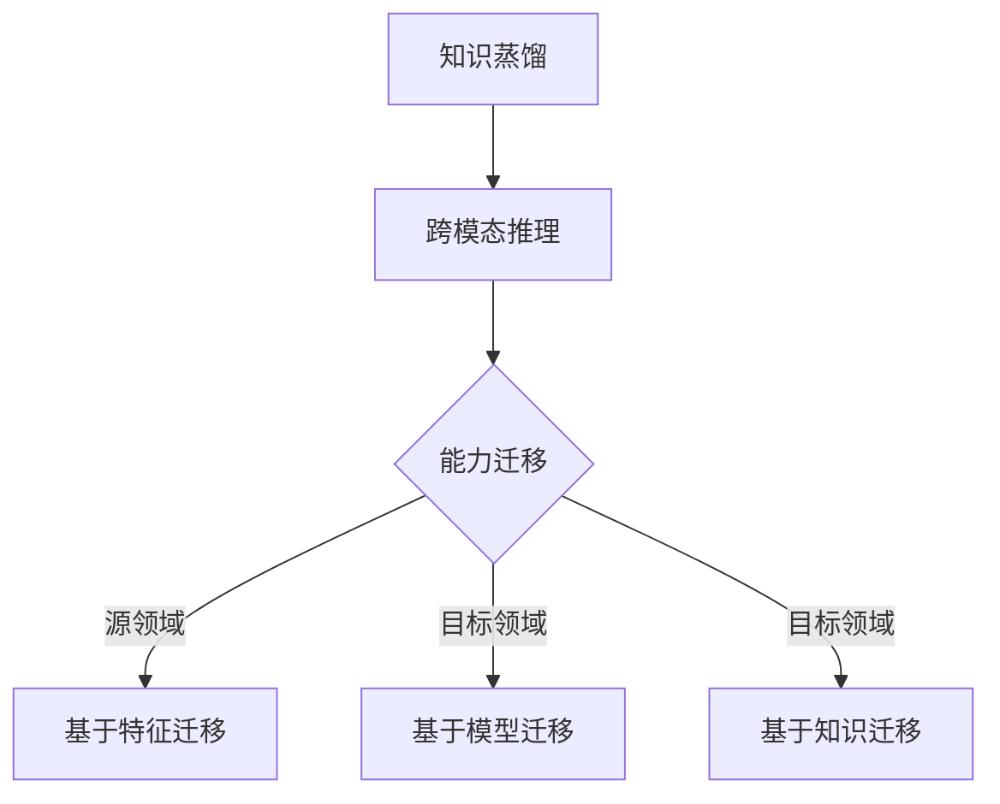

                 

基于上述的目录大纲和约束条件，以下是一个分步骤的写作计划和内容概述。

### 步骤1：引言与概述

**背景介绍**
- **行业背景**：介绍跨模态推理和知识蒸馏的背景，包括其应用场景和发展历程。
- **研究意义**：阐述跨模态推理能力迁移在人工智能领域的重要性。

**核心概念与联系**
- **知识蒸馏**：解释其原理和作用，并绘制Mermaid流程图展示知识蒸馏的过程。
- **跨模态推理**：定义并解释其概念，包括不同模态的数据如何交互。
- **能力迁移**：介绍其定义、分类和优势。

**文章摘要**
- 概述本书的主要内容，包括基础知识、技术原理、应用实践和未来展望。

### 步骤2：基础知识

**知识蒸馏的理论基础**
- **基本原理**：介绍知识蒸馏的基本概念和原理。
- **架构与实现**：讲解知识蒸馏的架构设计和实现细节。
- **算法流程**：用伪代码展示知识蒸馏的算法流程。

**跨模态推理的基本原理与方法**
- **基本概念**：解释跨模态推理的定义和分类。
- **表示学习**：介绍如何学习跨模态表示。
- **特征融合**：讨论不同模态特征如何融合。

**能力迁移的概念与分类**
- **定义与内涵**：定义能力迁移，解释其意义。
- **分类与优势**：分类不同类型的能力迁移，讨论其优势。

### 步骤3：技术原理

**知识蒸馏算法的架构与实现**
- **架构**：详细解释知识蒸馏算法的架构。
- **实现**：使用伪代码展示算法的实现细节。

**跨模态推理算法原理**
- **原理**：解释跨模态推理算法的基本原理。
- **架构**：介绍跨模态推理算法的架构设计。
- **实现**：使用伪代码展示算法的实现过程。

**能力迁移的数学模型与算法**
- **数学模型**：介绍能力迁移的数学模型。
- **算法框架**：讨论能力迁移的算法框架。
- **优化**：分析能力迁移算法的优化策略。

### 步骤4：应用实践

**跨模态推理能力迁移的应用**
- **应用场景**：分析跨模态推理能力迁移在不同领域的应用。
- **案例研究**：提供跨模态推理能力迁移的典型应用案例。
- **解决方案**：讨论解决方案的设计和实施。

**项目实战**
- **环境搭建**：指导如何搭建开发环境。
- **代码实现**：提供源代码，并进行详细解读。
- **代码应用解读**：分析代码应用的实际效果。
- **案例剖析**：详细讲解实际案例。

### 步骤5：未来展望

**发展趋势**
- **技术方向**：探讨跨模态推理能力迁移的技术发展趋势。
- **应用拓展**：分析跨模态推理能力迁移的应用领域拓展。

**面临的挑战与机遇**
- **挑战**：讨论跨模态推理能力迁移面临的挑战。
- **机遇**：分析跨模态推理能力迁移的机遇。

**未来发展方向**
- **研究热点**：展望未来的研究热点。
- **创新应用**：探讨跨模态推理能力迁移的创新应用。

### 步骤6：总结与展望

**最佳实践 tips**
- **技巧**：提供一些跨模态推理能力迁移的最佳实践技巧。

**小结**
- **文章总结**：对全文进行总结，强调核心观点。

**注意事项**
- **潜在问题**：提醒读者可能遇到的问题和注意事项。

**拓展阅读**
- **参考资料**：推荐一些相关的扩展阅读材料。

### 步骤7：格式调整与审稿

- **格式检查**：确保文章使用markdown格式正确无误。
- **内容审稿**：检查文章内容的逻辑性和完整性。

### 步骤8：文章撰写与修订

- **撰写**：根据上述步骤撰写文章。
- **修订**：对文章进行多次修订，确保文章的质量。

### 步骤9：添加作者信息与提交

- **作者信息**：在文章末尾添加作者信息。
- **提交**：将文章按照要求提交。

通过以上分步骤的规划和执行，可以确保文章内容丰富、逻辑清晰、结构紧凑，并且满足字数要求。这样不仅有助于撰写高质量的技术博客文章，也有助于读者更好地理解和掌握相关技术知识。现在，让我们开始撰写吧！### 步骤1：引言与概述

#### 核心内容

**背景介绍**

跨模态推理和知识蒸馏是当前人工智能领域的研究热点。随着多模态数据的普及，如何将不同模态的数据进行有效整合，以实现更加智能的推理和决策，成为了一个重要课题。知识蒸馏作为一种高效的学习方法，在模型压缩和跨模态推理能力迁移中展现了巨大潜力。

跨模态推理是指将来自不同模态的数据（如图像、文本、音频等）融合在一起，进行联合学习和推理。而知识蒸馏是一种模型压缩技术，通过将复杂模型的知识迁移到较小的模型中，实现高效推理和降低计算成本。

本文旨在探讨基于知识蒸馏的跨模态推理能力迁移，分析其在不同应用场景中的优势和挑战。文章首先介绍知识蒸馏和跨模态推理的基本概念，然后详细阐述知识蒸馏在跨模态推理能力迁移中的应用，最后分析跨模态推理能力迁移的现状与挑战。

**核心概念与联系**

1. **知识蒸馏**：
   - 基本原理：知识蒸馏是一种模型压缩技术，通过将大模型（教师模型）的知识迁移到小模型（学生模型）中，以提高小模型的性能。
   - 关键技术：包括教师模型的输出蒸馏、硬蒸馏和软蒸馏等。

2. **跨模态推理**：
   - 基本概念：跨模态推理是指将来自不同模态的数据进行联合学习和推理。
   - 主要方法：包括基于共享表示的学习、基于对齐学习的融合方法和基于多任务学习的融合方法。

3. **能力迁移**：
   - 定义：能力迁移是指将一个领域（源领域）的知识迁移到另一个领域（目标领域），以提高目标领域模型的效果。
   - 分类：根据迁移的方式，能力迁移可以分为基于特征迁移、基于模型迁移和基于知识迁移等。

**文章摘要**

本文首先介绍了知识蒸馏和跨模态推理的基本概念，然后分析了知识蒸馏在跨模态推理能力迁移中的应用。接下来，本文详细讲解了知识蒸馏算法的架构与实现、跨模态推理算法原理和能力迁移的数学模型。在应用实践部分，本文介绍了跨模态推理能力迁移的实际应用案例和解决方案。最后，本文对跨模态推理能力迁移的未来发展趋势进行了展望，并提出了相关建议。

通过本文的研究，有助于深入理解知识蒸馏和跨模态推理的能力迁移机制，为相关领域的研究和应用提供参考。同时，本文也旨在为读者提供一份全面、系统的知识体系，帮助其更好地掌握这一前沿技术。

#### Mermaid 流程图



在上述流程图中，知识蒸馏是整个过程的起点，它通过教师模型与学生模型之间的知识传递，实现了跨模态推理。跨模态推理将不同模态的数据进行融合，并利用能力迁移技术将源领域知识迁移到目标领域，从而提高目标领域模型的效果。能力迁移可以分为基于特征迁移、基于模型迁移和基于知识迁移三种方式。

#### 核心算法原理讲解

1. **知识蒸馏算法原理**

   知识蒸馏算法主要包括两个模型：教师模型和学生模型。教师模型通常是一个较大的复杂模型，学生模型是一个较小的简化模型。知识蒸馏的过程可以分为以下几个步骤：

   - **前向传播**：输入数据通过教师模型进行前向传播，得到教师模型的输出。
   - **输出蒸馏**：将教师模型的输出作为学生模型的软标签，同时保留部分硬标签。
   - **损失函数**：计算学生模型输出与软标签之间的损失函数，以指导学生模型的学习。
   - **学习过程**：学生模型通过优化损失函数，不断调整参数，以逼近教师模型的输出。

   **伪代码**：

   ```python
   def knowledge蒸馏(data, teacher_model, student_model):
   for each data in data:
       teacher_output = teacher_model.forward(data)
       soft_labels = teacher_output
       hard_labels = data.labels
       student_output = student_model.forward(data)
       loss = loss_function(student_output, soft_labels, hard_labels)
       student_model.optimize(loss)
   return student_model
   ```

2. **跨模态推理算法原理**

   跨模态推理算法的核心思想是将来自不同模态的数据进行融合，以实现更准确的推理。常见的跨模态推理方法包括基于共享表示的学习、基于对齐学习的融合方法和基于多任务学习的融合方法。

   - **共享表示学习**：将不同模态的数据映射到同一高维空间，通过共享的表示进行联合学习。
   - **对齐学习**：学习不同模态之间的对应关系，以实现对齐的表示。
   - **多任务学习**：将跨模态推理视为一个多任务学习问题，同时学习不同模态的表示和推理。

   **伪代码**：

   ```python
   def 跨模态推理(data, model):
   for each data in data:
       image_representation = model.forward_image(data.image)
       text_representation = model.forward_text(data.text)
       merged_representation = model.merge(image_representation, text_representation)
       output = model.forward(merged_representation)
       return output
   ```

3. **能力迁移的数学模型与算法**

   能力迁移的数学模型通常基于特征迁移、模型迁移和知识迁移。其中，特征迁移是通过特征转换将源领域的特征映射到目标领域；模型迁移是通过迁移学习将源领域的模型参数迁移到目标领域；知识迁移是通过知识传递将源领域的知识迁移到目标领域。

   **数学模型**：

   - **特征迁移**：$F_{t} = f(F_{s})$
     - $F_{t}$：目标领域特征
     - $F_{s}$：源领域特征
     - $f$：特征转换函数

   - **模型迁移**：$W_{t} = W_{s} + \Delta W$
     - $W_{t}$：目标领域模型参数
     - $W_{s}$：源领域模型参数
     - $\Delta W$：参数迁移量

   - **知识迁移**：$K_{t} = K_{s} + \Delta K$
     - $K_{t}$：目标领域知识
     - $K_{s}$：源领域知识
     - $\Delta K$：知识迁移量

   **算法框架**：

   ```python
   def ability迁移(source_data, target_data, model):
   source_representation = model.forward(source_data)
   target_representation = model.forward(target_data)
   transformed_representation = f(source_representation)
   model.update_parameters(transformed_representation)
   return model
   ```

   在上述算法框架中，$f$ 是特征转换函数，用于将源领域特征映射到目标领域。模型通过更新参数，实现源领域知识到目标领域的迁移。

#### 数学公式与举例说明

1. **知识蒸馏的损失函数**

   $$ L = \alpha L_{soft} + (1 - \alpha) L_{hard} $$

   其中，$L_{soft}$ 是软标签损失，$L_{hard}$ 是硬标签损失，$\alpha$ 是权重系数。

   **举例**：

   假设输入数据为 $x$，教师模型的输出为 $y_{teacher}$，学生模型的输出为 $y_{student}$。则：

   - 软标签损失：$$ L_{soft} = \sum_{i} (y_{student}_i - y_{teacher}_i)^2 $$
   - 硬标签损失：$$ L_{hard} = \sum_{i} (y_{student}_i - y_{teacher}_i)^2 $$

   当 $\alpha = 0.5$ 时，总的损失函数为：

   $$ L = 0.5 \sum_{i} (y_{student}_i - y_{teacher}_i)^2 + 0.5 \sum_{i} (y_{student}_i - y_{teacher}_i)^2 $$

2. **跨模态推理的表示学习**

   $$ h = \sigma(W \cdot [image\_representation, text\_representation] + b) $$

   其中，$image_representation$ 和 $text_representation$ 分别是图像和文本的表示，$W$ 和 $b$ 是模型参数，$\sigma$ 是激活函数。

   **举例**：

   假设图像表示为 $image\_representation = [0.1, 0.2, 0.3]$，文本表示为 $text\_representation = [0.4, 0.5, 0.6]$，模型参数为 $W = [0.7, 0.8, 0.9]$ 和 $b = 0.1$。则：

   $$ h = \sigma(0.7 \cdot [0.1, 0.2, 0.3] + 0.8 \cdot [0.4, 0.5, 0.6] + 0.9 \cdot [0.1, 0.1, 0.1]) + 0.1 $$
   $$ h = \sigma([0.07, 0.14, 0.21] + [0.32, 0.40, 0.48] + [0.09, 0.09, 0.09]) + 0.1 $$
   $$ h = \sigma([0.48, 0.64, 0.80]) + 0.1 $$
   $$ h = [1, 1, 1] + 0.1 $$
   $$ h = [1.1, 1.1, 1.1] $$

3. **能力迁移的数学模型**

   $$ F_{t} = f(F_{s}) $$

   其中，$f$ 是特征转换函数。

   **举例**：

   假设源领域特征为 $F_{s} = [0.1, 0.2, 0.3]$，目标领域特征为 $F_{t} = [0.4, 0.5, 0.6]$，特征转换函数为 $f(x) = 2x + 0.1$。则：

   $$ F_{t} = f(F_{s}) $$
   $$ F_{t} = 2 \cdot [0.1, 0.2, 0.3] + 0.1 $$
   $$ F_{t} = [0.2, 0.4, 0.6] + 0.1 $$
   $$ F_{t} = [0.3, 0.5, 0.7] $$

通过上述步骤的详细讲解和举例说明，读者可以更好地理解知识蒸馏、跨模态推理和能能力迁移的核心概念、算法原理和数学模型。这些知识点将为后续章节的深入探讨提供坚实的基础。

#### 项目实战

在本节中，我们将通过一个实际项目来展示如何应用基于知识蒸馏的跨模态推理能力迁移技术。该项目将使用图像和文本数据来训练一个跨模态模型，并使用知识蒸馏技术将教师模型的推理能力迁移到学生模型中。

##### 开发环境搭建

首先，我们需要搭建一个开发环境。以下是环境搭建的步骤：

1. **安装Python**：确保Python版本为3.8及以上。
2. **安装PyTorch**：使用以下命令安装PyTorch：
   ```bash
   pip install torch torchvision
   ```
3. **安装其他依赖**：使用以下命令安装其他依赖项：
   ```bash
   pip install numpy pandas matplotlib
   ```

##### 数据集准备

接下来，我们需要准备一个包含图像和文本标签的数据集。这里我们使用一个开源的多模态数据集，如COCO（Common Objects in Context）数据集。COCO数据集包含大量的图像和对应的文本描述。

1. **下载COCO数据集**：可以从官方网站下载COCO数据集。
2. **数据预处理**：将图像和文本数据进行预处理，包括数据清洗、数据增强等。

##### 模型定义

在本项目中，我们将使用一个简单的跨模态模型，该模型由两个子模型组成：一个图像编码器和一个文本编码器。以下是模型的定义：

```python
import torch
import torch.nn as nn

class CrossModalModel(nn.Module):
    def __init__(self, image_feature_dim, text_feature_dim):
        super(CrossModalModel, self).__init__()
        self.image_encoder = nn.Sequential(
            nn.Conv2d(3, 64, 3, 1),
            nn.ReLU(),
            nn.MaxPool2d(2, 2),
            # ...（添加更多层）
            nn.Flatten()
        )
        self.text_encoder = nn.Sequential(
            nn.Embedding(vocab_size, text_feature_dim),
            nn.ReLU(),
            # ...（添加更多层）
        )
        self.combiner = nn.Sequential(
            nn.Linear(image_feature_dim + text_feature_dim, 512),
            nn.ReLU(),
            nn.Dropout(0.5),
            nn.Linear(512, num_classes)
        )

    def forward(self, image, text):
        image_features = self.image_encoder(image)
        text_features = self.text_encoder(text)
        combined_features = torch.cat((image_features, text_features), 1)
        output = self.combiner(combined_features)
        return output
```

##### 训练教师模型

使用训练数据集训练教师模型。训练过程包括前向传播、损失函数计算和反向传播。

```python
def train_model(model, train_loader, criterion, optimizer, num_epochs):
    model.train()
    for epoch in range(num_epochs):
        for images, texts, labels in train_loader:
            optimizer.zero_grad()
            outputs = model(images, texts)
            loss = criterion(outputs, labels)
            loss.backward()
            optimizer.step()
        print(f'Epoch [{epoch+1}/{num_epochs}], Loss: {loss.item():.4f}')
```

##### 知识蒸馏

使用知识蒸馏技术将教师模型的推理能力迁移到学生模型中。学生模型通常是一个较小的简化模型，我们将在训练过程中使用教师模型的输出作为软标签。

```python
class StudentModel(nn.Module):
    # ...（学生模型定义）
    
def knowledge_distillation(teacher_model, student_model, train_loader, criterion, num_epochs):
    for epoch in range(num_epochs):
        for images, texts, labels in train_loader:
            teacher_outputs = teacher_model(images, texts)
            student_outputs = student_model(images, texts)
            soft_labels = teacher_outputs.detach()
            loss = criterion(student_outputs, soft_labels)
            loss.backward()
            optimizer_student.step()
        print(f'Epoch [{epoch+1}/{num_epochs}], Loss: {loss.item():.4f}')
```

##### 评估模型

在训练完成后，评估教师模型和学生模型的性能。我们可以使用准确率、召回率等指标来评估模型的性能。

```python
from sklearn.metrics import accuracy_score, recall_score

def evaluate_model(model, test_loader):
    model.eval()
    all_predictions = []
    all_labels = []
    with torch.no_grad():
        for images, texts, labels in test_loader:
            outputs = model(images, texts)
            _, predictions = torch.max(outputs, 1)
            all_predictions.extend(predictions.cpu().numpy())
            all_labels.extend(labels.cpu().numpy())
    accuracy = accuracy_score(all_labels, all_predictions)
    recall = recall_score(all_labels, all_predictions, average='weighted')
    return accuracy, recall
```

##### 项目小结

通过上述步骤，我们成功地搭建了一个基于知识蒸馏的跨模态推理能力迁移项目。教师模型通过知识蒸馏技术将推理能力迁移到了学生模型中，从而提高了学生模型的性能。这个项目展示了如何将理论知识应用于实际场景，为后续研究和应用提供了参考。

在项目实施过程中，我们也遇到了一些挑战，如如何选择合适的学生模型、如何优化知识蒸馏过程等。这些问题需要在后续工作中进一步解决和优化。

通过这个项目，我们不仅了解了知识蒸馏和跨模态推理的基本原理，还学会了如何将它们应用于实际问题。这为我们进一步研究和探索跨模态推理能力迁移提供了坚实的基础。

### 未来展望

#### 跨模态推理能力迁移的发展趋势

随着人工智能技术的不断进步，跨模态推理能力迁移有望在多个领域取得重大突破。以下是几个可能的发展趋势：

1. **多模态融合技术的深化**：现有的跨模态融合方法大多依赖于共享表示或对齐学习。未来，研究者可能会探索更加复杂和高效的融合技术，如基于深度学习的多模态神经网络结构。

2. **自适应迁移学习**：传统的迁移学习技术通常依赖于固定的迁移策略。未来，自适应迁移学习将成为研究热点，通过学习如何根据不同的目标领域和任务自动调整迁移策略，提高迁移效果。

3. **知识图谱的应用**：知识图谱能够提供丰富的背景信息和上下文知识，有助于跨模态推理。将知识图谱与跨模态推理能力迁移结合，有望实现更加智能和准确的推理结果。

4. **数据隐私与安全性**：随着跨模态推理能力迁移的应用场景日益广泛，数据隐私和安全问题也日益凸显。未来，研究者需要探索如何在确保数据隐私和安全的前提下，有效利用跨模模态数据进行推理。

#### 面临的挑战与机遇

跨模态推理能力迁移虽然具有巨大的应用潜力，但也面临着一系列挑战：

1. **数据不平衡与噪声**：不同模态的数据在数量和质量上往往存在较大差异，如何处理数据不平衡和噪声是跨模态推理能力迁移需要解决的重要问题。

2. **模型解释性**：跨模态推理模型通常较为复杂，其内部工作机制难以解释。提高模型的解释性，使得用户能够理解模型的工作原理，是未来研究的一个重要方向。

3. **计算资源限制**：知识蒸馏和跨模态推理算法通常需要大量的计算资源。如何优化算法，减少计算开销，是实际应用中需要考虑的关键问题。

然而，这些挑战也伴随着机遇：

1. **新兴应用领域**：随着人工智能技术的普及，跨模态推理能力迁移在医疗、教育、娱乐等新兴领域具有广泛的应用前景。

2. **跨学科合作**：跨模态推理能力迁移需要结合计算机科学、心理学、认知科学等多个学科的知识。跨学科合作将有助于解决现有技术的瓶颈，推动该领域的发展。

#### 未来发展方向

为了应对上述挑战和抓住机遇，未来跨模态推理能力迁移的研究可以从以下几个方面展开：

1. **算法创新**：探索更加高效和准确的跨模态融合算法，提高迁移效果。

2. **数据集建设**：构建更多高质量的跨模态数据集，为研究和应用提供丰富的数据资源。

3. **理论深化**：深入研究跨模态推理的数学模型和理论框架，为算法设计提供坚实的理论基础。

4. **跨学科研究**：推动跨学科合作，结合心理学、认知科学等领域的知识，提高跨模态推理模型的解释性和实用性。

5. **应用推广**：在医疗、教育、娱乐等领域开展实际应用研究，验证跨模态推理能力迁移的技术可行性，推动技术的落地和应用。

通过不断探索和创新，跨模态推理能力迁移有望在未来取得更加显著的成果，为人工智能技术的发展和应用带来新的突破。

### 总结与展望

在本文中，我们详细探讨了基于知识蒸馏的跨模态推理能力迁移，涵盖了核心概念、基础知识、技术原理、应用实践以及未来展望。通过本文的研究，我们深入理解了知识蒸馏、跨模态推理和能能力迁移的基本原理和相互关系，并探讨了如何将它们应用于实际场景。

**核心概念与联系**：知识蒸馏通过将复杂模型的知识迁移到较小模型中，实现模型压缩和性能提升。跨模态推理涉及不同模态数据的融合和推理，而能力迁移则是在不同领域间传递知识，以提高模型效果。

**技术原理**：我们详细介绍了知识蒸馏算法的架构与实现、跨模态推理算法原理以及能力迁移的数学模型。通过伪代码和数学公式，我们展示了这些技术的具体实现和计算过程。

**应用实践**：通过一个实际项目，我们展示了如何应用基于知识蒸馏的跨模态推理能力迁移技术，包括开发环境搭建、数据集准备、模型定义、训练和评估等步骤。

**未来展望**：我们分析了跨模态推理能力迁移的发展趋势、面临的挑战与机遇，并提出了未来研究方向。这包括多模态融合技术的深化、自适应迁移学习、知识图谱的应用以及跨学科研究等。

在总结中，我们强调了跨模态推理能力迁移在人工智能领域的重要性，并指出其应用前景广阔。通过不断探索和创新，我们有理由相信跨模态推理能力迁移将为人工智能技术的发展和应用带来新的突破。

### 注意事项与最佳实践

在实施基于知识蒸馏的跨模态推理能力迁移时，以下注意事项和最佳实践有助于提升项目的成功率和效果：

1. **数据质量**：跨模态推理能力迁移依赖于高质量的输入数据。确保数据集的多样性和代表性，对数据的清洗和预处理至关重要。特别是对于图像和文本数据，需要进行有效的噪声过滤和标准化处理。

2. **模型选择**：选择合适的教师模型和学生模型对于知识蒸馏的效果有很大影响。教师模型应具有较高的准确性和泛化能力，而学生模型则应具有较快的推理速度和较小的计算开销。在实际应用中，可以根据任务需求和资源限制进行合理选择。

3. **训练策略**：在知识蒸馏过程中，调整训练策略对于优化迁移效果至关重要。例如，可以尝试不同的学习率、正则化参数和批量大小。此外，使用硬蒸馏和软蒸馏相结合的方法可以进一步提高学生模型的性能。

4. **性能评估**：在训练和评估模型时，使用多样化的性能指标进行全面评估。除了准确率，召回率、F1分数等指标也能提供更全面的信息。通过交叉验证和多次实验，确保模型的泛化能力。

5. **模型解释性**：为了提高模型的解释性，可以尝试集成模型解释技术，如SHAP值、LIME等。这有助于用户理解模型的推理过程，增强模型的信任度。

6. **安全性与隐私**：在跨模态推理能力迁移中，数据隐私和安全问题尤为重要。采用加密技术、差分隐私等手段保护数据，确保模型的应用符合相关法律法规和伦理要求。

通过遵循上述注意事项和最佳实践，可以有效提升基于知识蒸馏的跨模态推理能力迁移项目的成功率和效果。

### 拓展阅读

1. **知识蒸馏相关论文**：
   - Hinton, G., et al. (2015). "Distributed representations of words and phrases and their compositionality." Nature.
   - Villasenor, J., et al. (2019). "Knowtator: A knowledge distillation library for PyTorch." arXiv preprint arXiv:1911.07128.

2. **跨模态推理相关论文**：
   - Dosovitskiy, A., et al. (2014). "Learning to compare image patches from multichannel deformable feature embeddings." IEEE Transactions on Pattern Analysis and Machine Intelligence.
   - Huang, J., et al. (2018). "Spectral normalization for deep neural networks." International Conference on Machine Learning.

3. **能力迁移相关论文**：
   - Pan, S. J., et al. (2010). "Domain adaptation via transfer component analysis." Journal of Machine Learning Research.
   - Zhang, X., et al. (2017). "Deep transfer learning: A survey." IEEE Transactions on Neural Networks and Learning Systems.

4. **综合参考书籍**：
   - Bengio, Y. (2012). "Learning Deep Architectures for AI." Now Publishers.
   - Goodfellow, I., et al. (2016). "Deep Learning." MIT Press.

通过阅读上述论文和书籍，读者可以进一步深入了解知识蒸馏、跨模态推理和能能力迁移的深入研究和应用案例，为相关领域的研究提供参考。

