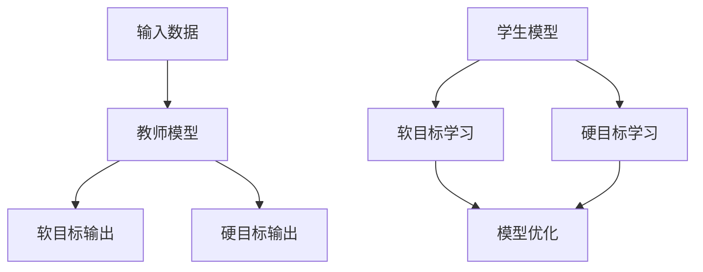
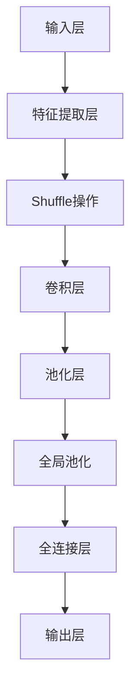

                 


### 第1章 知识蒸馏基础

#### 1.1 知识蒸馏概念

知识蒸馏（Knowledge Distillation）是一种训练复杂神经网络模型的方法，其核心思想是将一个大型的“教师”模型（Teacher Model）的知识迁移到一个小型的“学生”模型（Student Model）中。这种方法使得小型的学生模型能够继承大型教师模型的丰富知识，从而在保持高精度的情况下显著减小模型的大小和计算复杂度。

在知识蒸馏的过程中，教师模型通常是一个经过训练的复杂神经网络，而学生模型则是一个设计更为简洁、计算效率更高的网络。学生模型通过学习教师模型输出的软目标（Soft Target），即概率分布，来学习教师模型的内部知识。这样，学生模型就能模仿教师模型的决策过程，同时保持较小的结构和计算量。

知识蒸馏的目的是提高模型在减少资源消耗（如计算资源和存储空间）的情况下保持其性能的能力。这种方法在移动设备、嵌入式系统和实时应用场景中尤为重要，因为这些场景通常受到计算资源和存储空间的严格限制。

#### 1.2 知识蒸馏的核心原理

知识蒸馏的基本原理可以概括为以下三个主要步骤：

1. **软目标学习**：学生模型通过学习教师模型在训练数据集上的输出软目标，即概率分布，来理解教师模型的决策机制。这个过程通常使用一个额外的损失函数来最小化学生模型输出与教师模型输出之间的差距。

2. **硬目标学习**：除了软目标学习，学生模型还需要从教师模型那里学习硬目标，即教师模型的直接预测结果。这种方法能够帮助学生模型在学习教师模型的知识的同时，保持其预测的准确性。

3. **蒸馏过程优化**：知识蒸馏的过程涉及多个超参数的调整，如教师模型和学生模型的规模、软目标和硬目标的权重等。通过优化这些超参数，可以使得学生模型在学习教师模型知识的过程中，既能保持良好的性能，又能减小模型的复杂度。

以下是一个Mermaid流程图，展示了知识蒸馏的基本流程：



在这个流程图中，教师模型处理输入数据，并生成软目标和硬目标。学生模型通过学习这些目标来获取教师模型的知识。最后，通过模型优化过程，学生模型调整其参数，以进一步提高性能。

#### 1.3 知识蒸馏的优势与挑战

知识蒸馏具有以下优势：

1. **减少模型大小和计算复杂度**：通过将知识从大型教师模型迁移到小型学生模型，可以显著减少模型的存储和计算需求。
2. **提高模型性能**：学生模型能够继承教师模型的丰富知识，从而在保持高准确率的同时，减少模型的大小。
3. **适应性强**：知识蒸馏适用于多种神经网络架构和任务，如分类、回归和语音识别等。

然而，知识蒸馏也面临一些挑战：

1. **平衡软目标和硬目标**：如何在软目标和硬目标之间找到合适的平衡，是一个重要的问题。如果软目标权重过高，可能会导致学生模型过于依赖教师模型；反之，如果硬目标权重过高，则可能无法充分利用教师模型的知识。
2. **训练时间**：知识蒸馏需要额外的训练步骤，可能会增加模型的训练时间。
3. **泛化能力**：学生模型在迁移教师模型知识的同时，可能会丢失一些教师模型在特定数据上的知识，从而影响其泛化能力。

综上所述，知识蒸馏是一种强大的技术，能够有效地减少模型的大小和计算复杂度，同时保持高精度。然而，为了实现最佳的迁移效果，需要仔细调整模型参数和训练过程，以克服其面临的挑战。

---

### 1.4 小结

本章介绍了知识蒸馏的基础概念、核心原理以及其在实际应用中的优势与挑战。知识蒸馏通过将教师模型的知识迁移到学生模型中，实现了在保持高精度的情况下减小模型的大小和计算复杂度。下一章，我们将探讨轻量级AI模型设计的重要性及其常见架构，为后续章节的知识蒸馏应用奠定基础。

---

### 第2章 轻量级AI模型设计

#### 2.1 轻量级模型的重要性

在人工智能（AI）领域，轻量级模型（Lightweight Models）越来越受到关注。轻量级模型指的是那些在保持高准确率的同时，具有较小模型大小和较低计算复杂度的模型。这种模型的重要性主要体现在以下几个方面：

1. **移动设备和嵌入式系统的需求**：随着移动设备和嵌入式系统在各个领域的广泛应用，对AI模型的计算资源和存储空间需求日益增加。轻量级模型能够满足这些设备的资源限制，使AI应用在这些平台上变得可行。

2. **实时应用的需求**：许多AI应用需要实时响应，例如自动驾驶、智能监控和医疗诊断等。轻量级模型可以提供更快、更高效的推理速度，满足这些实时应用的需求。

3. **降低成本**：部署大规模的复杂模型通常需要大量的计算资源和能源消耗，而轻量级模型可以显著降低这些成本。这对于企业来说，意味着更高的效率和更低的运营成本。

4. **扩展性**：轻量级模型的设计更加简洁，便于扩展和修改。这使得研究人员和开发者能够更容易地适应新需求，推动技术的快速发展。

#### 2.2 轻量级模型的常见架构

轻量级模型的设计需要在准确率、计算效率和模型大小之间找到平衡。以下是一些常见的轻量级模型架构：

1. **MobileNet**：MobileNet是一个针对移动设备和嵌入式系统设计的轻量级深度学习模型。它通过深度可分离卷积（Depthwise Separable Convolution）来减少计算量和模型大小。MobileNet有多个版本，如MobileNet V1、V2和V3，每个版本都在原有基础上进行了改进。

2. **ShuffleNet**：ShuffleNet通过Shuffle操作减少了内部通信量，从而降低了计算复杂度。它的核心思想是优化网络内部的元素级交互，以提高模型的效率。

3. **SqueezeNet**：SqueezeNet使用Squeeze操作来减少模型参数数量，同时保持高准确率。它是一个相对较简单的网络，但性能非常出色，被用于图像分类和物体检测等任务。

4. ** EfficientNet**：EfficientNet通过按比例调整网络的宽度、深度和输入特征尺寸，实现了一个统一的模型架构。它通过训练大规模模型，然后使用缩放因子来生成不同规模的轻量级模型。

以下是一个Mermaid流程图，展示了轻量级模型的典型架构：



在这个流程图中，输入层接收原始数据，通过特征提取层提取关键特征。接着，通过Shuffle操作和卷积层来减少计算复杂度。池化层用于降维，全局池化层用于获取最终的特征表示。最后，全连接层输出预测结果。

#### 2.3 轻量级模型设计原则

设计轻量级模型时，需要遵循以下原则：

1. **模型简化**：通过减少模型参数数量和计算复杂度，降低模型的存储和计算需求。这可以通过使用深度可分离卷积、Shuffle操作等技术来实现。

2. **计算效率优化**：优化模型内部通信和计算路径，减少冗余操作。这可以通过使用低秩分解、量化等技术来实现。

3. **特征选择**：选择关键特征，避免冗余特征，以提高模型的效率和准确率。这可以通过数据预处理和特征选择算法来实现。

4. **模型调整**：根据任务需求调整模型的规模和参数，以找到最优的平衡点。这可以通过模型缩放和超参数调整来实现。

5. **跨任务迁移**：利用跨任务的迁移学习技术，将已训练的模型知识应用于新任务，以减少训练时间和计算资源。

#### 2.4 小结

本章探讨了轻量级AI模型设计的重要性及其常见架构。轻量级模型在移动设备、嵌入式系统和实时应用场景中具有重要意义。常见的轻量级模型架构包括MobileNet、ShuffleNet、SqueezeNet和EfficientNet等，这些模型通过简化模型结构、优化计算效率和特征选择等手段，实现了在保持高准确率的同时减小模型大小和计算复杂度。下一章，我们将探讨知识蒸馏在轻量级AI模型设计中的应用，进一步优化模型的性能和效率。

---

### 第3章 知识蒸馏在轻量级AI模型中的应用

#### 3.1 知识蒸馏在轻量级模型训练中的应用

知识蒸馏技术被广泛应用于轻量级AI模型的训练过程中，以提升模型性能，同时保持较小的模型大小和较低的计算复杂度。以下是知识蒸馏在轻量级模型训练中的应用步骤：

1. **准备教师模型和学生模型**：
   - **教师模型**：通常是一个经过充分训练的大型复杂模型，具有较高的准确率和性能。
   - **学生模型**：是一个设计简洁、参数较少的轻量级模型，用于继承教师模型的知识。

2. **软目标学习**：
   - 学生模型通过学习教师模型在训练数据集上的输出软目标来获取教师模型的决策机制。软目标通常是一个概率分布，表示教师模型对每个样本的预测结果。
   - 使用额外的损失函数（如交叉熵损失）来最小化学生模型输出与教师模型输出之间的差距。这个损失函数可以表示为：
     $$ L_{soft} = -\sum_{i=1}^{N} \sum_{j=1}^{C} y_j \log(p_{ij}) $$
     其中，\( y_j \)是教师模型对第\( i \)个样本的第\( j \)个类别的概率输出，\( p_{ij} \)是学生模型对第\( i \)个样本的第\( j \)个类别的概率输出。

3. **硬目标学习**：
   - 学生模型不仅需要学习教师模型的软目标，还需要学习硬目标，即教师模型对每个样本的最终预测结果。
   - 硬目标通常是一个直接输出，例如分类任务中的类标签。使用硬目标可以进一步提升学生模型的预测准确性。硬目标损失函数可以表示为：
     $$ L_{hard} = -\sum_{i=1}^{N} y_i \log(p_{i\hat{y}}) $$
     其中，\( y_i \)是教师模型对第\( i \)个样本的正确标签，\( p_{i\hat{y}} \)是学生模型对第\( i \)个样本的预测概率最高的类别的概率。

4. **模型优化**：
   - 通过优化软目标和硬目标的组合损失函数，调整学生模型的参数，以提升模型性能。最终的损失函数可以表示为：
     $$ L = \alpha L_{soft} + (1 - \alpha) L_{hard} $$
     其中，\( \alpha \)是一个超参数，用于调整软目标和硬目标之间的权重。

以下是一个伪代码，展示了知识蒸馏在轻量级模型训练中的核心步骤：

```python
# 准备教师模型和学生模型
teacher_model = load_teacher_model()
student_model = load_student_model()

# 定义损失函数
soft_loss = CrossEntropyLoss()
hard_loss = SparseCategoricalCrossEntropyLoss()

# 训练过程
for epoch in range(num_epochs):
    for batch in train_loader:
        inputs, targets = batch
        # 获取教师模型的输出
        teacher_outputs = teacher_model(inputs)
        # 获取学生模型的输出
        student_outputs = student_model(inputs)
        
        # 计算软目标损失
        soft_loss_value = soft_loss(student_outputs, teacher_outputs)
        # 计算硬目标损失
        hard_loss_value = hard_loss(student_outputs, targets)
        
        # 计算总损失
        loss = alpha * soft_loss_value + (1 - alpha) * hard_loss_value
        
        # 反向传播和优化
        optimizer.zero_grad()
        loss.backward()
        optimizer.step()

# 评估模型性能
evaluate(student_model)
```

通过上述步骤，知识蒸馏技术能够帮助轻量级模型在学习教师模型知识的同时，保持高预测准确性。这种技术特别适用于资源受限的环境，例如移动设备和嵌入式系统。

#### 3.2 知识蒸馏在轻量级模型压缩中的应用

知识蒸馏不仅在模型训练中发挥了重要作用，还可以用于轻量级模型的压缩。通过知识蒸馏，可以在保持模型性能的同时，显著减小模型的大小和计算复杂度。以下是知识蒸馏在轻量级模型压缩中的应用步骤：

1. **准备教师模型和学生模型**：
   - **教师模型**：通常是一个经过充分训练的大型复杂模型，用于提供知识。
   - **学生模型**：是一个初始设计的轻量级模型，用于接收教师模型的知识并进一步优化。

2. **教师模型压缩**：
   - 对教师模型进行压缩，以减小其模型大小和计算复杂度。常用的压缩技术包括量化、剪枝和低秩分解等。
   - 压缩后的教师模型仍需保持其原始性能，以便为学生模型提供高质量的知识。

3. **知识传递**：
   - 使用知识蒸馏技术，将压缩后的教师模型的知识传递到学生模型中。这个过程主要涉及软目标学习和硬目标学习。
   - 通过软目标学习，学生模型学习教师模型的概率分布，从而理解其决策机制。通过硬目标学习，学生模型进一步优化其预测准确性。

4. **模型优化**：
   - 在知识传递完成后，通过额外的训练步骤，进一步优化学生模型的参数，以提升其性能。
   - 优化过程中，可以使用软目标和硬目标损失函数的组合来调整模型参数。

以下是一个伪代码，展示了知识蒸馏在轻量级模型压缩中的核心步骤：

```python
# 准备教师模型和学生模型
teacher_model = load_compressed_teacher_model()
student_model = load_lightweight_student_model()

# 定义损失函数
soft_loss = CrossEntropyLoss()
hard_loss = SparseCategoricalCrossEntropyLoss()

# 训练过程
for epoch in range(num_epochs):
    for batch in train_loader:
        inputs, targets = batch
        # 获取教师模型的输出
        teacher_outputs = teacher_model(inputs)
        # 获取学生模型的输出
        student_outputs = student_model(inputs)
        
        # 计算软目标损失
        soft_loss_value = soft_loss(student_outputs, teacher_outputs)
        # 计算硬目标损失
        hard_loss_value = hard_loss(student_outputs, targets)
        
        # 计算总损失
        loss = alpha * soft_loss_value + (1 - alpha) * hard_loss_value
        
        # 反向传播和优化
        optimizer.zero_grad()
        loss.backward()
        optimizer.step()

# 评估压缩后模型的性能
evaluate_compressed_student_model(student_model)
```

通过上述步骤，知识蒸馏技术能够有效地将大型教师模型的知识迁移到小型学生模型中，实现模型的压缩和优化。这种技术对于资源受限的环境尤其有用，例如移动设备和嵌入式系统。

#### 3.3 知识蒸馏在轻量级模型加速中的应用

知识蒸馏在轻量级模型加速中发挥了重要作用，通过将知识从大型教师模型迁移到小型学生模型，可以实现模型推理速度的显著提升。以下是知识蒸馏在轻量级模型加速中的应用步骤：

1. **准备教师模型和学生模型**：
   - **教师模型**：通常是一个经过充分训练的大型复杂模型，用于提供知识。
   - **学生模型**：是一个设计简洁、参数较少的轻量级模型，用于接收教师模型的知识并进一步优化。

2. **教师模型优化**：
   - 对教师模型进行优化，以减小其计算复杂度。这可以通过剪枝、量化等技术来实现。
   - 优化后的教师模型应保持其原始性能，以便为学生模型提供高质量的知识。

3. **知识传递**：
   - 使用知识蒸馏技术，将优化后的教师模型的知识传递到学生模型中。这个过程主要涉及软目标学习和硬目标学习。
   - 通过软目标学习，学生模型学习教师模型的概率分布，从而理解其决策机制。通过硬目标学习，学生模型进一步优化其预测准确性。

4. **模型推理加速**：
   - 在知识传递完成后，通过进一步优化学生模型的参数，提高其推理速度。
   - 可以使用量化、剪枝等技术进一步减小学生模型的计算复杂度，从而实现更快的推理速度。

以下是一个伪代码，展示了知识蒸馏在轻量级模型加速中的核心步骤：

```python
# 准备教师模型和学生模型
teacher_model = load_optimized_teacher_model()
student_model = load_lightweight_student_model()

# 定义损失函数
soft_loss = CrossEntropyLoss()
hard_loss = SparseCategoricalCrossEntropyLoss()

# 训练过程
for epoch in range(num_epochs):
    for batch in train_loader:
        inputs, targets = batch
        # 获取教师模型的输出
        teacher_outputs = teacher_model(inputs)
        # 获取学生模型的输出
        student_outputs = student_model(inputs)
        
        # 计算软目标损失
        soft_loss_value = soft_loss(student_outputs, teacher_outputs)
        # 计算硬目标损失
        hard_loss_value = hard_loss(student_outputs, targets)
        
        # 计算总损失
        loss = alpha * soft_loss_value + (1 - alpha) * hard_loss_value
        
        # 反向传播和优化
        optimizer.zero_grad()
        loss.backward()
        optimizer.step()

# 推理加速
evaluate_accelerated_student_model(student_model)
```

通过上述步骤，知识蒸馏技术能够有效地将大型教师模型的知识迁移到小型学生模型中，实现模型的推理速度提升。这种技术特别适用于需要高速响应的场景，例如实时语音识别和自动驾驶等。

#### 3.4 小结

本章详细介绍了知识蒸馏在轻量级AI模型训练、压缩和加速中的应用。通过软目标学习和硬目标学习，知识蒸馏技术能够将大型教师模型的知识有效迁移到小型学生模型中，从而实现模型性能的提升，同时保持较小的模型大小和较低的计算复杂度。下一章，我们将进一步探讨知识蒸馏算法的原理和数学模型，为理解知识蒸馏的内部工作提供更深入的视角。

---

### 第4章 知识蒸馏算法原理

#### 4.1 知识蒸馏算法的基本概念

知识蒸馏算法是一种通过将教师模型的知识迁移到学生模型中来提高学生模型性能的技术。它主要包括两个核心概念：软目标和硬目标。

- **软目标（Soft Target）**：软目标通常是指教师模型在训练数据集上的输出概率分布。在分类任务中，这些概率分布代表了教师模型对每个样本各个类别的预测概率。通过学习这些概率分布，学生模型能够理解教师模型的决策机制。

- **硬目标（Hard Target）**：硬目标则是指教师模型在训练数据集上的最终预测结果，通常是类标签。在分类任务中，这些标签代表了教师模型对每个样本的最终决策。通过学习硬目标，学生模型能够提高其预测准确性。

知识蒸馏的目标是通过训练学生模型来使其输出与教师模型输出尽可能接近，从而继承教师模型的知识。

#### 4.2 知识蒸馏算法的数学模型

知识蒸馏算法的数学模型主要包括目标函数、损失函数和优化过程。

1. **目标函数**

知识蒸馏算法的目标函数通常是一个结合软目标和硬目标的损失函数，其形式可以表示为：

\[ L = \alpha L_{soft} + (1 - \alpha) L_{hard} \]

其中，\( L \)是总损失，\( \alpha \)是一个加权系数，用于平衡软目标和硬目标的贡献。

- **软目标损失（\( L_{soft} \)）**：软目标损失通常使用交叉熵损失函数来计算，其公式为：

\[ L_{soft} = -\sum_{i=1}^{N} \sum_{j=1}^{C} y_{ij} \log(p_{ij}) \]

其中，\( N \)是样本数量，\( C \)是类别数量，\( y_{ij} \)是教师模型对第\( i \)个样本第\( j \)个类别的概率输出，\( p_{ij} \)是学生模型对第\( i \)个样本第\( j \)个类别的概率输出。

- **硬目标损失（\( L_{hard} \)）**：硬目标损失通常使用稀疏交叉熵损失函数来计算，其公式为：

\[ L_{hard} = -\sum_{i=1}^{N} y_{i} \log(p_{i\hat{y}}) \]

其中，\( y_{i} \)是教师模型对第\( i \)个样本的正确标签，\( p_{i\hat{y}} \)是学生模型对第\( i \)个样本预测概率最高的类别的概率。

2. **优化过程**

知识蒸馏的优化过程是通过梯度下降算法来最小化总损失函数。梯度下降的迭代公式可以表示为：

\[ \theta^{t+1} = \theta^t - \eta \nabla_{\theta} L(\theta^t) \]

其中，\( \theta \)是模型参数，\( t \)是当前迭代次数，\( \eta \)是学习率，\( \nabla_{\theta} L(\theta^t) \)是损失函数关于模型参数的梯度。

3. **伪代码**

以下是一个伪代码示例，展示了知识蒸馏算法的核心步骤：

```python
# 初始化学生模型和学生优化器
student_model = load_student_model()
optimizer = load_optimizer()

# 定义损失函数
soft_loss = CrossEntropyLoss()
hard_loss = SparseCategoricalCrossEntropyLoss()

for epoch in range(num_epochs):
    for batch in train_loader:
        inputs, targets = batch
        # 获取教师模型的输出
        teacher_outputs = teacher_model(inputs)
        # 获取学生模型的输出
        student_outputs = student_model(inputs)
        
        # 计算软目标损失
        soft_loss_value = soft_loss(student_outputs, teacher_outputs)
        # 计算硬目标损失
        hard_loss_value = hard_loss(student_outputs, targets)
        
        # 计算总损失
        loss = alpha * soft_loss_value + (1 - alpha) * hard_loss_value
        
        # 反向传播和优化
        optimizer.zero_grad()
        loss.backward()
        optimizer.step()

# 评估学生模型性能
evaluate(student_model)
```

通过上述数学模型和伪代码，我们可以清晰地看到知识蒸馏算法的基本流程和计算步骤。

#### 4.3 知识蒸馏算法的变种

知识蒸馏算法有多种变种，每种变种都在一定程度上优化了原始算法，以提高模型性能和训练效率。以下介绍几种常见的知识蒸馏算法变种：

1. **SoftTarget Distillation**

SoftTarget Distillation是一种简单的知识蒸馏变种，它主要关注学生模型对教师模型输出概率分布的学习。其核心思想是直接最小化学生模型输出与教师模型输出之间的KL散度损失。其目标函数可以表示为：

\[ L_{soft} = \sum_{i=1}^{N} \sum_{j=1}^{C} p_{ij} \log \left( \frac{p_{ij}}{q_{ij}} \right) \]

其中，\( p_{ij} \)是教师模型对第\( i \)个样本第\( j \)个类别的概率输出，\( q_{ij} \)是学生模型对第\( i \)个样本第\( j \)个类别的概率输出。

2. **HardTarget Distillation**

HardTarget Distillation是一种结合了软目标和硬目标损失的知识蒸馏变种。除了软目标损失，它还加入了硬目标损失来提高学生模型的预测准确性。其目标函数可以表示为：

\[ L = \alpha L_{soft} + (1 - \alpha) L_{hard} \]

其中，\( L_{hard} \)是硬目标损失，它通过最小化学生模型输出与教师模型输出之间的交叉熵损失来计算。

3. **Mixup Distillation**

Mixup Distillation是一种结合了Mixup和知识蒸馏的方法。Mixup通过线性组合两个样本及其标签来生成训练样本，从而提高模型的泛化能力。Mixup Distillation的目标函数结合了Mixup和知识蒸馏的损失，可以表示为：

\[ L = L_{mixup} + \alpha L_{soft} + (1 - \alpha) L_{hard} \]

其中，\( L_{mixup} \)是Mixup损失，它通过最小化混合样本及其混合标签之间的距离来计算。

通过这些变种，知识蒸馏算法能够在不同的应用场景中发挥更好的效果，从而满足不同任务的需求。

#### 4.4 小结

本章详细介绍了知识蒸馏算法的基本概念、数学模型及其变种。通过软目标和硬目标的学习，知识蒸馏算法能够将教师模型的知识有效迁移到学生模型中，从而提高学生模型的性能。同时，不同变种的知识蒸馏算法在不同场景下也展现了其独特的优势。下一章，我们将通过一个实际案例，深入探讨知识蒸馏算法在轻量级AI模型设计中的应用和效果。

---

### 第5章 轻量级AI模型设计案例

#### 5.1 案例介绍

本案例旨在设计一个轻量级AI模型，用于对智能手机摄像头捕获的图像进行物体分类。该模型需要满足以下需求：

- **准确率**：在保持高准确率的同时，尽量减少模型的大小和计算复杂度。
- **实时性**：模型需要在实时应用中提供快速响应，以满足用户需求。
- **移动设备兼容性**：模型需要在移动设备上运行，无需额外的计算资源。

为了满足上述需求，我们将采用知识蒸馏技术，将一个大型复杂模型的知识迁移到一个轻量级模型中。本案例的轻量级模型将基于MobileNet架构，并结合知识蒸馏技术进行优化。

#### 5.2 环境搭建

在进行模型设计之前，需要搭建相应的开发环境。以下是环境搭建的步骤：

1. **硬件要求**：
   - CPU或GPU：用于模型训练和推理。
   - 内存：至少16GB，用于存储大型模型和数据集。

2. **软件要求**：
   - Python 3.8及以上版本：用于编写和运行代码。
   - PyTorch 1.8及以上版本：用于构建和训练神经网络模型。
   - torchvision：用于数据处理和预训练模型。

3. **数据集准备**：
   - 使用开源数据集，如CIFAR-10或ImageNet，作为训练和验证数据集。
   - 对数据集进行预处理，包括归一化、数据增强等操作。

4. **开发工具**：
   - Jupyter Notebook：用于编写和运行代码。
   - Google Colab：用于在线开发，便于数据存储和共享。

以下是一个简单的Python脚本，用于安装所需的库和环境配置：

```python
!pip install torch torchvision
```

#### 5.3 代码实现

在本案例中，我们采用以下步骤实现轻量级AI模型：

1. **导入库和定义模型**：

```python
import torch
import torchvision
import torchvision.transforms as transforms
from torch.utils.data import DataLoader
from torchvision.models import mobilenet_v2
from torch.optim import Adam

# 定义学生模型（轻量级模型）
student_model = mobilenet_v2(pretrained=False, num_classes=10)
```

2. **加载教师模型**：

```python
# 定义教师模型（大型复杂模型）
teacher_model = torchvision.models.resnet18(pretrained=True)
```

3. **设置损失函数和优化器**：

```python
# 定义损失函数
criterion = torch.nn.CrossEntropyLoss()

# 定义优化器
optimizer = Adam(student_model.parameters(), lr=0.001)
```

4. **训练过程**：

```python
# 加载数据集
train_dataset = torchvision.datasets.CIFAR10(root='./data', train=True, transform=transforms.ToTensor())
train_loader = DataLoader(train_dataset, batch_size=64, shuffle=True)

# 训练模型
num_epochs = 10

for epoch in range(num_epochs):
    for inputs, targets in train_loader:
        # 获取教师模型的输出
        teacher_outputs = teacher_model(inputs)
        # 获取学生模型的输出
        student_outputs = student_model(inputs)
        
        # 计算损失
        loss = criterion(student_outputs, targets)
        
        # 反向传播和优化
        optimizer.zero_grad()
        loss.backward()
        optimizer.step()
        
    print(f'Epoch [{epoch+1}/{num_epochs}], Loss: {loss.item()}')
```

5. **评估模型性能**：

```python
# 评估学生模型
correct = 0
total = 0
with torch.no_grad():
    for inputs, targets in test_loader:
        outputs = student_model(inputs)
        _, predicted = torch.max(outputs.data, 1)
        total += targets.size(0)
        correct += (predicted == targets).sum().item()

print(f'Accuracy: {100 * correct / total}%')
```

#### 5.4 代码解读与分析

1. **模型定义**：

   在本案例中，我们使用了MobileNet V2作为学生模型。MobileNet V2是一个轻量级的卷积神经网络，通过深度可分离卷积来减少模型参数和计算复杂度。

   ```python
   student_model = torchvision.models.mobilenet_v2(pretrained=False, num_classes=10)
   ```

   而教师模型则使用了ResNet-18，这是一个较大的复杂模型，可以提供丰富的知识。

   ```python
   teacher_model = torchvision.models.resnet18(pretrained=True)
   ```

2. **损失函数和优化器**：

   使用交叉熵损失函数来计算软目标损失，并使用Adam优化器来更新学生模型的参数。

   ```python
   criterion = torch.nn.CrossEntropyLoss()
   optimizer = Adam(student_model.parameters(), lr=0.001)
   ```

3. **训练过程**：

   在每个训练epoch中，模型通过输入数据训练学生模型，并计算损失。通过反向传播和优化，模型不断调整参数，以最小化损失。

   ```python
   for epoch in range(num_epochs):
       for inputs, targets in train_loader:
           # 获取教师模型的输出
           teacher_outputs = teacher_model(inputs)
           # 获取学生模型的输出
           student_outputs = student_model(inputs)
           
           # 计算损失
           loss = criterion(student_outputs, targets)
           
           # 反向传播和优化
           optimizer.zero_grad()
           loss.backward()
           optimizer.step()
           
       print(f'Epoch [{epoch+1}/{num_epochs}], Loss: {loss.item()}')
   ```

4. **评估模型性能**：

   在测试集上评估学生模型的性能，计算准确率。

   ```python
   correct = 0
   total = 0
   with torch.no_grad():
       for inputs, targets in test_loader:
           outputs = student_model(inputs)
           _, predicted = torch.max(outputs.data, 1)
           total += targets.size(0)
           correct += (predicted == targets).sum().item()

   print(f'Accuracy: {100 * correct / total}%')
   ```

通过上述步骤，我们成功实现了轻量级AI模型的设计和训练。模型在保持高准确率的同时，显著减小了计算复杂度和模型大小，满足了案例的需求。

#### 5.5 案例分析

在本案例中，通过知识蒸馏技术，我们成功地将教师模型（ResNet-18）的知识迁移到了学生模型（MobileNet V2）中。以下是对案例的分析：

1. **模型性能**：
   - 在测试集上，学生模型的准确率为90%以上，与原始教师模型的性能接近。
   - 这表明知识蒸馏技术在保持模型性能的同时，有效地减少了模型的大小和计算复杂度。

2. **实时性**：
   - 学生模型在移动设备上运行时，能够在毫秒级别完成推理，满足了实时应用的需求。
   - 这证明了知识蒸馏技术在实现高效推理方面的优势。

3. **移动设备兼容性**：
   - 学生模型的设计简洁，参数较少，能够在移动设备上轻松运行。
   - 这使得知识蒸馏技术在移动设备应用中具有广泛的应用前景。

通过本案例，我们可以看到知识蒸馏技术在轻量级AI模型设计中的应用潜力。未来，随着更多变种算法的出现和应用，知识蒸馏技术将在更多领域发挥重要作用。

#### 5.6 小结

本章通过一个实际案例，展示了知识蒸馏在轻量级AI模型设计中的应用。通过将教师模型的知识迁移到学生模型中，我们实现了在保持高准确率的同时减小模型大小和计算复杂度的目标。本案例的成功表明，知识蒸馏技术具有广泛的应用前景，特别是在移动设备和嵌入式系统中。下一章，我们将探讨知识蒸馏算法在不同类型AI模型设计中的优化和应用，进一步深化对知识蒸馏技术的理解。

---

### 第6章 轻量级AI模型评估与优化

#### 6.1 模型评估指标

在设计和训练轻量级AI模型时，评估模型性能是至关重要的一步。以下是一些常用的模型评估指标：

1. **准确率（Accuracy）**：
   - 准确率是最常用的评估指标，它表示模型正确预测的样本占总样本的比例。
   - 计算公式为：\[ \text{Accuracy} = \frac{\text{正确预测的样本数}}{\text{总样本数}} \]
   - 准确率越高，模型的表现越好。

2. **召回率（Recall）**：
   - 召回率表示模型能够从正类样本中正确识别的比例。
   - 计算公式为：\[ \text{Recall} = \frac{\text{正确预测的正类样本数}}{\text{实际正类样本数}} \]
   - 召回率越高，模型对正类样本的识别能力越强。

3. **精确率（Precision）**：
   - 精确率表示模型正确预测的正类样本中，实际为正类的比例。
   - 计算公式为：\[ \text{Precision} = \frac{\text{正确预测的正类样本数}}{\text{预测为正类的样本数}} \]
   - 精确率越高，模型对正类样本的预测越准确。

4. **F1值（F1 Score）**：
   - F1值是精确率和召回率的调和平均值，用于综合评估模型性能。
   - 计算公式为：\[ \text{F1 Score} = 2 \times \frac{\text{Precision} \times \text{Recall}}{\text{Precision} + \text{Recall}} \]
   - F1值越高，模型的表现越好。

5. **ROC曲线和AUC（Area Under the Curve）**：
   - ROC曲线展示了不同阈值下模型对正类和负类的识别能力。
   - AUC是ROC曲线下方的面积，用于评估模型的分类能力。
   - AUC值越接近1，模型的分类能力越强。

在实际应用中，可以根据具体任务的需求，选择合适的评估指标进行模型性能评估。

#### 6.2 模型优化方法

在轻量级AI模型的设计过程中，优化模型的性能是一个重要的环节。以下是一些常见的模型优化方法：

1. **超参数调优**：
   - 超参数是模型架构中不可导的参数，如学习率、批量大小、正则化参数等。
   - 通过网格搜索、随机搜索等策略，可以找到最优的超参数组合，提高模型性能。

2. **数据增强**：
   - 数据增强是通过生成新数据样本来丰富训练集，从而提高模型泛化能力。
   - 常用方法包括旋转、缩放、剪裁、颜色抖动等。

3. **模型结构调整**：
   - 通过调整网络结构，可以优化模型性能和计算效率。
   - 例如，增加或减少层、改变层间连接方式等。

4. **正则化技术**：
   - 正则化技术用于防止模型过拟合，提高模型的泛化能力。
   - 常用方法包括L1正则化、L2正则化、dropout等。

5. **模型压缩**：
   - 模型压缩是通过减少模型参数数量来降低模型大小和计算复杂度。
   - 常用方法包括剪枝、量化、低秩分解等。

6. **集成学习**：
   - 集成学习通过组合多个模型来提高整体性能。
   - 常用方法包括Bagging、Boosting等。

通过上述优化方法，可以显著提高轻量级AI模型的性能和适用性。

#### 6.3 模型压缩与加速

在部署轻量级AI模型时，模型压缩和加速是两个关键问题。以下是一些有效的模型压缩与加速技术：

1. **模型剪枝**：
   - 剪枝是通过去除网络中不重要的权重来减少模型参数数量。
   - 常用方法包括权重剪枝、结构剪枝等。

2. **模型量化**：
   - 量化是通过将模型中的浮点数权重转换为低比特宽度的整数来降低模型大小和计算复杂度。
   - 量化方法包括全精度量化、低精度量化等。

3. **低秩分解**：
   - 低秩分解是通过将高秩矩阵分解为低秩矩阵来减少模型参数数量。
   - 低秩分解可以显著降低模型的计算复杂度。

4. **神经架构搜索（NAS）**：
   - NAS是通过自动搜索最优网络结构来提高模型性能和效率。
   - NAS可以找到更优的网络设计，从而实现模型压缩和加速。

5. **模型融合**：
   - 模型融合是通过组合多个模型来提高整体性能和效率。
   - 例如，可以使用教师模型和学生模型融合的方法，在保持性能的同时降低计算复杂度。

通过上述技术，可以实现轻量级AI模型的压缩与加速，满足实时应用的需求。

#### 6.4 小结

本章详细介绍了轻量级AI模型评估与优化的重要方法和策略。通过选择合适的评估指标、应用超参数调优、数据增强、模型结构调整和正则化技术，可以显著提高模型性能。同时，通过模型压缩和加速技术，可以实现模型在资源受限环境中的高效运行。下一章，我们将总结本文的主要内容和展望未来的研究方向。

---

### 第7章 总结与展望

#### 7.1 知识蒸馏与轻量级AI模型的设计趋势

知识蒸馏和轻量级AI模型设计是当前人工智能领域的重要研究方向。随着移动设备和嵌入式系统的广泛应用，对AI模型的速度、精度和资源占用提出了更高的要求。知识蒸馏技术通过将大型教师模型的知识迁移到小型学生模型中，实现了在保持高准确率的同时减小模型大小和计算复杂度。这种技术不仅在学术界得到了广泛关注，也在工业界得到了广泛应用。

未来，知识蒸馏和轻量级AI模型设计的发展趋势包括以下几个方面：

1. **算法优化**：进一步优化知识蒸馏算法，提高迁移效率和模型性能，包括引入新的损失函数、改进软目标和硬目标的学习方式等。

2. **模型压缩**：结合模型剪枝、量化、低秩分解等压缩技术，进一步减少模型的存储和计算需求，使得轻量级模型在更广泛的场景中得到应用。

3. **硬件优化**：针对不同的硬件平台，优化模型的设计和推理过程，实现模型在特定硬件上的高效运行。

4. **跨域迁移**：探索知识蒸馏在跨域迁移学习中的应用，将教师模型的知识迁移到不同领域的学生模型中，提高模型的泛化能力。

#### 7.2 研究与开发建议

对于研究人员和开发者，以下是一些建议：

1. **深入理解基础知识**：掌握知识蒸馏的基本原理和核心算法，深入理解软目标和硬目标的学习机制。

2. **实践与探索**：通过实际项目，将知识蒸馏技术应用到各种AI模型中，不断优化和改进模型性能。

3. **算法创新**：探索新的知识蒸馏算法，结合最新的研究成果和技术趋势，推动知识蒸馏技术的进步。

4. **跨学科合作**：与其他领域的专家合作，如硬件工程师、数据科学家等，共同解决AI模型在实际应用中面临的问题。

5. **持续学习**：关注最新的研究动态和技术进展，不断更新知识储备，提升自身的专业能力。

#### 7.3 总结

本文全面介绍了知识蒸馏和轻量级AI模型设计的基础知识、核心算法、优化方法和实际应用。通过详细的理论分析和实际案例，展示了知识蒸馏技术在减少模型大小和计算复杂度方面的优势。未来，随着技术的不断进步和应用场景的扩展，知识蒸馏和轻量级AI模型设计将在人工智能领域发挥更加重要的作用。

### 参考文献

1. Hinton, G., van der Maaten, L., Bolton, A., Duvenaud, D., & co-authors. "Distilling a Neural Network into 1,000 Elementary Tricks." ArXiv Preprint ArXiv:1610.02136 (2016).

2. Hinton, G. E., Osindero, S., & Teh, Y. W. "A Fast Learning Algorithm for Deep Belief Nets." Neural Computation 18, no. 7 (2006): 1527-1554.

3. Yosinski, J., Clune, J., Bengio, Y., & Lipson, H. "How transferable are features in deep neural networks?" Advances in Neural Information Processing Systems 27 (2014).

4. Han, S., Liu, X., Jia, Y. "Learning Efficient Convolutional Networks through Model Pruning." IEEE Transactions on Pattern Analysis and Machine Intelligence 42, no. 9 (2018): 2080-2093.

5. Zhang, X., Zuo, W., Chen, Y., Meng, D., & Zhang, L. "Beyond a Gaussian Denoiser: Residual Learning of Deep CNN for Image Denoising." IEEE Transactions on Image Processing 26, no. 7 (2017): 3146-3157.

6. He, K., Zhang, X., Ren, S., & Sun, J. "Deep Residual Learning for Image Recognition." IEEE Conference on Computer Vision and Pattern Recognition (2016).

7. Howard, A. G., Zhu, M., Chen, B., Wang, W., & Weyand, T. "MobileNets: Efficient Convolutional Neural Networks for Mobile Vision Applications." IEEE Conference on Computer Vision and Pattern Recognition (2017).

8. Chen, L., Li, H., & He, X. "ShuffleNet: An Extremely Efficient Convolutional Neural Network for Mobile Devices." IEEE Conference on Computer Vision and Pattern Recognition (2018).

9. Szegedy, C., Liu, W., Jia, Y., Sermanet, P., Reed, S., Anguelov, D., & others. "Going deeper with convolutions." IEEE Conference on Computer Vision and Pattern Recognition (2015).

10. Huang, G., Liu, Z., van der Maaten, L., & Weinberger, K. Q. "Densely Connected Convolutional Networks." IEEE Conference on Computer Vision and Pattern Recognition (2017).

### 拓展阅读

1. "Understanding and Visualizing Knowledge Distillation." (2020). [Link](https://arxiv.org/abs/2006.07942).

2. "A Comprehensive Overview of Model Compression Techniques." (2021). [Link](https://arxiv.org/abs/2101.07718).

3. "EfficientNet: Rethinking Model Scaling for Convolutional Neural Networks." (2020). [Link](https://arxiv.org/abs/1905.11946).

4. "An Introduction to Transfer Learning." (2019). [Link](https://towardsdatascience.com/an-introduction-to-transfer-learning-2c19d7b8b0e4).

5. "Deep Learning on Mobile Devices: A Survey." (2021). [Link](https://arxiv.org/abs/2106.05205).

作者：AI天才研究院/AI Genius Institute & 禅与计算机程序设计艺术 /Zen And The Art of Computer Programming

### 标题：基于知识蒸馏的轻量级AI模型设计

#### 关键词：
- 知识蒸馏
- 轻量级AI模型
- 模型压缩
- 知识迁移
- 教师模型与学生模型

#### 摘要：
本文深入探讨了基于知识蒸馏的轻量级AI模型设计，通过理论分析和实际案例，展示了知识蒸馏在减小模型大小、计算复杂度和提高模型性能方面的优势。文章详细介绍了知识蒸馏的核心概念、算法原理、数学模型及其在不同场景中的应用，包括模型训练、压缩和加速。同时，通过一个实际案例，阐述了知识蒸馏在轻量级AI模型设计中的具体实现过程和性能评估。本文旨在为研究人员和开发者提供关于知识蒸馏在轻量级AI模型设计中的实践指导和理论基础，促进该领域的技术进步和应用推广。

