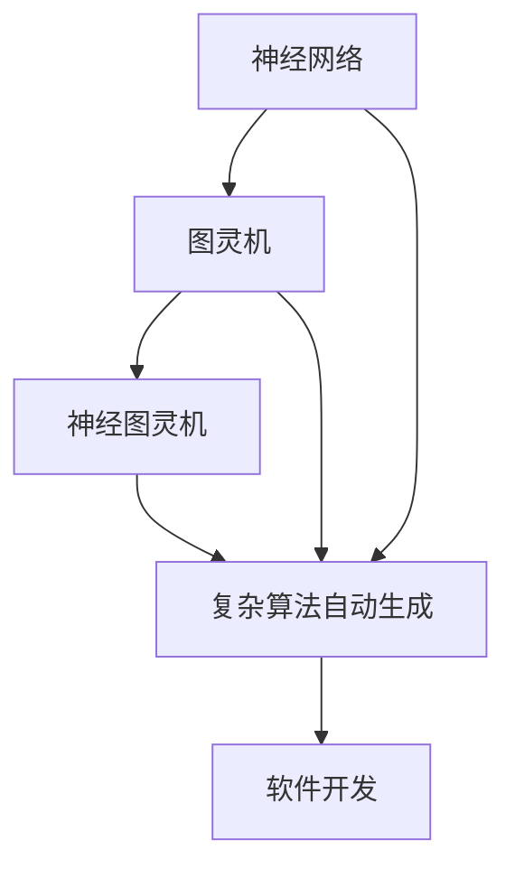
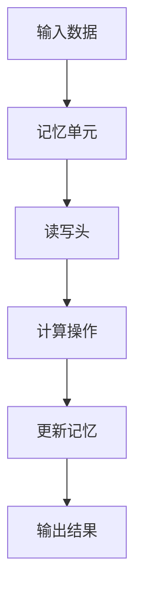
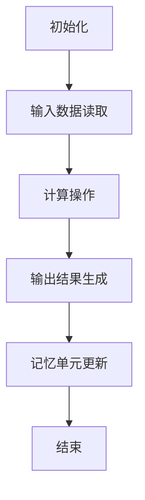
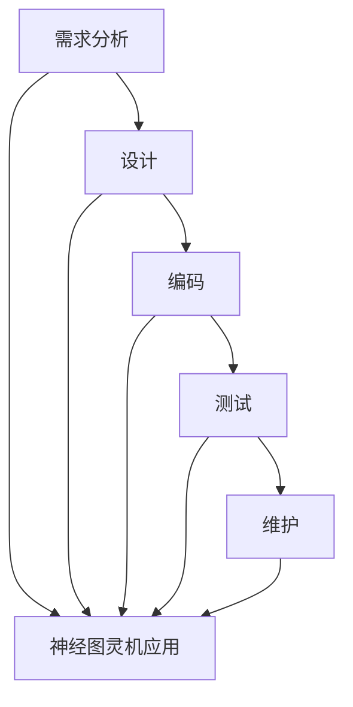
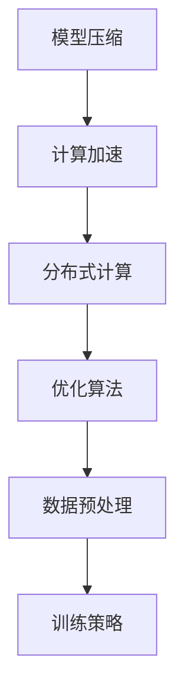
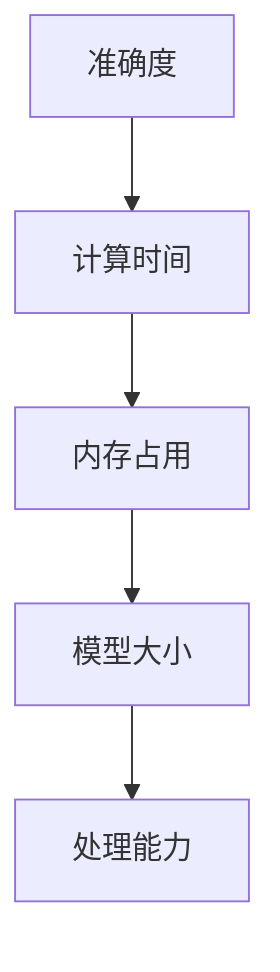
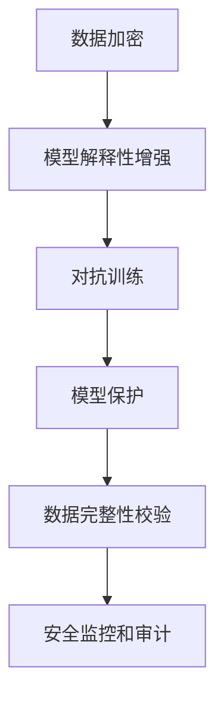

                 

### 文章标题：基于神经图灵机的复杂算法自动生成在软件开发中的应用

### 关键词：神经图灵机、复杂算法、自动生成、软件开发、人工智能

### 摘要：

本文旨在探讨神经图灵机在复杂算法自动生成中的应用，以及这一技术在软件开发中的潜在价值。我们将从神经图灵机的基础概念入手，详细解析其工作原理和核心算法，进而探讨如何在软件开发过程中利用神经图灵机自动生成复杂算法。文章还将分析这一技术在实际应用中的性能优化和安全性问题，并总结出一套最佳实践方法，为未来的软件开发提供新的思路。

### 目录

1. **引言**
   - 1.1 背景介绍
   - 1.2 核心概念与联系
   - 1.3 文章结构概述

2. **神经图灵机基础**
   - 2.1 神经图灵机的定义与特点
   - 2.2 神经图灵机的工作原理
   - 2.3 神经图灵机的主要应用领域

3. **神经图灵机的核心算法原理**
   - 3.1 神经网络算法
   - 3.2 图灵机算法
   - 3.3 复杂算法自动生成

4. **软件开发中的复杂算法自动生成**
   - 4.1 复杂算法自动生成的方法
   - 4.2 神经图灵机在软件开发中的应用实例
   - 4.3 神经图灵机与软件工程的融合

5. **性能优化**
   - 5.1 性能优化目标
   - 5.2 性能优化方法
   - 5.3 性能评估指标

6. **安全性问题**
   - 6.1 安全性威胁
   - 6.2 安全性解决方案
   - 6.3 长期安全展望

7. **项目实战**
   - 7.1 开发环境搭建
   - 7.2 源代码详细实现与解读
   - 7.3 代码应用解读与分析
   - 7.4 实际案例分析与详细讲解
   - 7.5 项目小结

8. **最佳实践与总结**
   - 8.1 最佳实践 tips
   - 8.2 小结
   - 8.3 注意事项
   - 8.4 拓展阅读

9. **结论**
   - 9.1 本文贡献
   - 9.2 未来展望

10. **作者信息**

### 引言

#### 1.1 背景介绍

在当今快速发展的信息技术时代，软件开发作为一项关键技术，正不断地推动着社会的进步。然而，随着软件系统的复杂度不断攀升，传统的软件开发方法面临着巨大的挑战。如何高效地开发出高质量的软件，成为了一个亟待解决的问题。

随着人工智能技术的发展，尤其是深度学习和神经网络算法的兴起，人们开始探索利用人工智能技术来辅助软件开发。其中，神经图灵机作为一种新兴的算法生成工具，因其强大的学习能力和自适应性，受到了广泛关注。神经图灵机结合了神经网络和图灵机的优势，能够在自动生成复杂算法方面发挥重要作用。

本文旨在探讨神经图灵机在复杂算法自动生成中的应用，通过详细解析神经图灵机的工作原理和核心算法，分析其在软件开发中的实际应用，探讨性能优化和安全性问题，并总结出一套最佳实践方法。希望通过本文的研究，能够为软件开发领域带来新的思路和方法。

#### 1.2 核心概念与联系

为了更好地理解本文的主题，我们需要先明确几个核心概念：

- **神经图灵机**：神经图灵机是一种结合了神经网络和图灵机思想的计算模型，能够自动生成复杂算法。它通过模拟神经网络的学习过程，实现了对图灵机算法的优化和扩展。
- **复杂算法自动生成**：复杂算法自动生成是指利用特定算法和工具，自动生成复杂、高效的算法代码。这一过程涉及到算法的设计、实现和优化，是软件开发中的一项重要技术。
- **软件开发**：软件开发是指通过编程和设计，创建出能够满足特定需求的软件系统。随着软件系统的复杂度增加，自动生成复杂算法能够显著提高开发效率和代码质量。

为了更好地展示这些概念之间的关系，我们可以使用 Mermaid 流程图来表示它们之间的联系：



在上图中，神经网络和图灵机是神经图灵机的基础，神经图灵机结合两者的优势，实现了复杂算法自动生成，这一过程最终服务于软件开发。

#### 1.3 文章结构概述

本文将分为以下几个部分：

1. **神经图灵机基础**：介绍神经图灵机的定义、工作原理和应用领域。
2. **神经图灵机的核心算法原理**：详细解析神经图灵机的核心算法，包括神经网络算法和图灵机算法，并探讨如何实现复杂算法自动生成。
3. **软件开发中的复杂算法自动生成**：分析神经图灵机在软件开发中的应用方法，通过具体实例展示其在复杂算法自动生成中的实际效果。
4. **性能优化**：探讨神经图灵机在复杂算法自动生成中的性能优化方法，包括模型压缩、训练策略等。
5. **安全性问题**：分析神经图灵机在软件开发中的安全性威胁，并提出相应的解决方案。
6. **项目实战**：通过一个实际项目，详细讲解神经图灵机在软件开发中的应用过程，包括开发环境搭建、代码实现和案例分析。
7. **最佳实践与总结**：总结最佳实践方法，并给出注意事项和拓展阅读建议。

通过以上结构，本文旨在为读者提供一个系统、全面的神经图灵机在软件开发中的应用指南。

### 神经图灵机基础

#### 2.1 神经图灵机的定义与特点

神经图灵机（Neural Turing Machine, NTM）是一种结合了神经网络（Neural Network）和图灵机（Turing Machine）思想的计算模型。它旨在解决传统神经网络在处理复杂任务时的局限，同时保留图灵机在计算能力和表达力方面的优势。神经图灵机的定义可以从以下几个方面来理解：

- **计算模型**：神经图灵机是一种具有存储和计算功能的神经网络模型，它通过读写记忆单元（memory cells）来处理信息。这些记忆单元可以被视为一种动态的、可更新的存储资源，类似于图灵机的带子。
- **学习机制**：神经图灵机通过模拟神经网络的学习过程，不断地调整其参数和记忆内容，从而实现对新任务的学习和适应。它结合了神经网络的学习机制和图灵机的逻辑推理能力，使得其能够处理更加复杂的任务。
- **应用范围**：神经图灵机在多个领域都有潜在的应用，包括图像识别、自然语言处理、强化学习等。其独特的能力使其在处理涉及大量数据和高复杂度任务时表现出色。

神经图灵机的特点主要体现在以下几个方面：

- **强大的表示能力**：神经图灵机通过其记忆单元和读写头，能够处理高维数据，并且能够动态地更新和调整记忆内容，从而实现对复杂信息的有效表示。
- **灵活的适应性**：神经图灵机具有较好的适应性，能够通过训练快速适应新任务。它不仅能够学习静态数据，还能够处理动态数据，这使得其在各种应用场景中具有广泛的适用性。
- **高效的计算能力**：神经图灵机通过并行处理和记忆读写操作，能够在一定程度上提升计算效率。与传统的串行计算模型相比，它能够更快地完成复杂的计算任务。

为了更好地理解神经图灵机的定义和特点，我们可以借助以下 Mermaid 流程图来展示其工作原理：



在上图中，输入数据首先被传递到记忆单元中，然后通过读写头进行读取和写入操作。读写头可以根据计算结果动态地更新记忆单元的内容，最终生成输出结果。这一过程展示了神经图灵机的基本工作流程，也体现了其独特的计算机制。

#### 2.2 神经图灵机的工作原理

神经图灵机的工作原理结合了神经网络和图灵机的优点，通过读写记忆单元和计算操作，实现复杂任务的处理。以下是神经图灵机的工作原理的详细解析：

- **记忆单元**：记忆单元是神经图灵机的核心组成部分，它类似于图灵机的带子，用于存储数据和信息。在神经图灵机中，记忆单元通常由一系列的神经元组成，每个神经元可以存储一定量的信息。记忆单元具有动态性，可以通过读写操作进行内容的更新和调整。

- **读写头**：读写头是神经图灵机的另一个重要组成部分，用于在记忆单元中读取和写入数据。读写头由两个部分组成：读头和写头。读头负责从记忆单元中读取数据，并将其传递到计算单元；写头则负责将计算结果写入记忆单元。

- **计算单元**：计算单元是神经图灵机的数据处理中心，负责对输入数据进行计算。计算单元通常由多个神经网络层组成，包括输入层、隐藏层和输出层。输入层接收输入数据，隐藏层进行特征提取和变换，输出层生成最终的输出结果。

- **工作流程**：神经图灵机的工作流程可以分为以下几个步骤：

  1. **初始化**：在开始处理任务之前，神经图灵机对记忆单元进行初始化，确保其处于一个确定的状态。
  2. **输入数据读取**：将输入数据传递到记忆单元，并通过读头进行读取。
  3. **计算操作**：将读取的数据传递到计算单元，进行计算操作。计算过程可能包括矩阵乘法、激活函数等。
  4. **输出结果生成**：计算结果通过输出层生成，并作为新的输入传递到记忆单元。
  5. **记忆单元更新**：根据计算结果，通过写头更新记忆单元的内容。

通过以上工作流程，神经图灵机能够实现数据的存储、读取和计算，从而实现对复杂任务的求解。以下是一个简化的 Mermaid 流程图，展示神经图灵机的工作流程：



在上图中，初始化步骤确保神经图灵机处于一个初始状态，输入数据读取步骤将输入数据传递到记忆单元，计算操作步骤对读取的数据进行计算处理，输出结果生成步骤生成最终的输出结果，并通过记忆单元更新步骤更新记忆单元的内容。

#### 2.3 神经图灵机的主要应用领域

神经图灵机作为一种具有强大计算能力和自适应性的神经网络模型，在多个领域都展现出了广阔的应用前景。以下是神经图灵机的主要应用领域：

- **图像识别**：神经图灵机在图像识别任务中具有显著的优势。通过其强大的表示能力和自适应学习机制，神经图灵机能够有效地处理复杂的图像数据。例如，在人脸识别、物体检测和图像分类等任务中，神经图灵机可以实现对图像特征的自动提取和分类，从而提高识别准确率。

- **自然语言处理**：自然语言处理是神经图灵机的重要应用领域之一。神经图灵机能够处理复杂的文本数据，并提取出有效的语义信息。例如，在机器翻译、文本分类和情感分析等任务中，神经图灵机可以通过学习大量的文本数据，实现自动生成高质量的翻译结果和分类标签。

- **强化学习**：强化学习是神经图灵机另一个重要的应用领域。神经图灵机能够通过其自适应学习机制，不断优化策略，从而在复杂的决策环境中实现最优解。例如，在自动驾驶、游戏控制和智能机器人等领域，神经图灵机可以通过学习环境中的反馈信号，实现自主决策和行为优化。

- **数据挖掘**：神经图灵机在数据挖掘任务中也具有广泛的应用。通过其强大的表示能力和高效的计算能力，神经图灵机能够有效地处理大规模的数据集，并提取出潜在的模式和关联。例如，在客户行为分析、市场预测和金融风险评估等领域，神经图灵机可以用于自动发现数据中的隐藏规律，为决策提供支持。

- **其他领域**：除了上述领域，神经图灵机还在许多其他领域展现出潜在的应用价值。例如，在语音识别、生物信息学、医疗影像分析和物联网等领域，神经图灵机都可以通过其强大的计算能力和自适应学习机制，实现高效的数据处理和模式识别。

综上所述，神经图灵机作为一种新兴的计算模型，具有广泛的应用前景。通过在不同的领域中的应用，神经图灵机展现出了强大的计算能力和自适应学习机制，为各种复杂任务提供了有效的解决方案。

### 神经图灵机的核心算法原理

#### 3.1 神经网络算法

神经网络（Neural Network）是神经图灵机的基础之一，其基本原理是通过模拟生物神经网络的结构和功能，实现复杂任务的学习和推理。神经网络主要由神经元、层次结构和激活函数等组成。

- **神经元**：神经网络的基本构建单元，每个神经元接收来自其他神经元的输入信号，通过加权求和和激活函数处理，产生输出信号。

- **层次结构**：神经网络通常分为输入层、隐藏层和输出层。输入层接收外部输入数据，隐藏层进行特征提取和变换，输出层生成最终输出结果。

- **激活函数**：激活函数用于对神经元的输出进行非线性变换，常用的激活函数包括 sigmoid、ReLU 和 tanh 等。激活函数能够引入非线性因素，使得神经网络具有更强的表达能力和分类能力。

神经网络算法的基本流程如下：

1. **初始化参数**：随机初始化神经网络的权重和偏置。
2. **前向传播**：将输入数据传递到神经网络，通过多层计算，生成输出结果。
3. **计算误差**：使用输出结果与真实值之间的差异，计算误差。
4. **反向传播**：将误差传递回神经网络，通过反向传播算法更新权重和偏置。
5. **迭代优化**：重复执行前向传播和反向传播，直至网络性能达到预期。

以下是一个简化的神经网络算法的伪代码：

```python
初始化权重 W 和偏置 b
while 未达到训练次数上限 do
    对于每个训练样本 (x, y) do
        前向传播：计算输出 O = f(W * x + b)
        计算误差 E = (O - y)^2
        反向传播：更新权重 W = W - 学习率 * dW，偏置 b = b - 学习率 * db
    end
end
```

其中，f 代表激活函数，dW 和 db 分别代表权重和偏置的梯度。

神经网络算法的优势在于其强大的自适应性和非线性表达能力，能够处理复杂的非线性问题。然而，神经网络也存在一些局限性，如对数据量和计算资源的需求较大，以及难以解释的“黑箱”特性。

#### 3.2 图灵机算法

图灵机（Turing Machine）是计算机科学的基础理论模型，由英国数学家艾伦·图灵（Alan Turing）在 1936 年提出。图灵机的基本原理是通过一个读写头来操作带子上的符号，从而实现计算和逻辑推理。

- **状态**：图灵机在运行过程中处于不同的状态，每个状态对应不同的操作和决策。
- **带子**：图灵机的存储介质，由无限长的带子组成，带子上的符号可以读写。
- **读写头**：图灵机的操作工具，可以向前或向后移动，读取或写入符号。

图灵机的算法流程如下：

1. **初始化**：将初始状态、带子和读写头位置初始化。
2. **读写操作**：根据当前状态和读写头位置，读取带子上的符号，并根据状态转换表进行操作。
3. **状态转换**：根据当前状态和读到的符号，更新状态和读写头位置。
4. **结束条件**：当满足结束条件时，算法终止，输出结果。

以下是一个简化的图灵机算法的伪代码：

```python
初始化状态 S0、带子 tape 和读写头 position
while position 未到达带子边界且未满足结束条件 do
    读取符号 symbol = tape[position]
    根据状态转换表更新状态和读写头位置
end
输出结果
```

其中，状态转换表定义了每个状态在不同符号下的操作，包括读写操作、状态转换和移动方向。

图灵机算法的优势在于其强大的计算能力和逻辑推理能力，能够解决复杂的问题。然而，图灵机的计算过程通常较为复杂，难以进行高效的并行计算。

#### 3.3 复杂算法自动生成

复杂算法自动生成（Complex Algorithm Auto-Generation）是指利用特定算法和工具，自动生成复杂、高效的算法代码。这一过程涉及到算法的设计、实现和优化，是软件开发中的一项重要技术。

神经图灵机在复杂算法自动生成中的应用，主要是通过其强大的表示能力和自适应学习机制，实现算法的自动生成。以下是复杂算法自动生成的基本流程：

1. **数据预处理**：将原始数据转换为适合训练的形式，如图像、文本或时间序列等。
2. **模型训练**：使用神经图灵机对数据进行训练，学习数据中的规律和模式。
3. **算法生成**：利用训练好的神经图灵机，自动生成相应的算法代码。
4. **代码优化**：对生成的算法代码进行优化，提高其效率和性能。

以下是一个简化的复杂算法自动生成的伪代码：

```python
数据预处理：将数据转换为训练格式
模型训练：使用神经图灵机训练数据，学习规律
算法生成：利用训练好的神经图灵机，生成算法代码
代码优化：对生成的代码进行优化
```

神经图灵机在复杂算法自动生成中的优势在于其能够自动提取数据中的特征和模式，生成高质量的算法代码。然而，这一过程也面临一些挑战，如如何确保生成的代码的可解释性和可靠性。

通过以上核心算法原理的解析，我们可以看到神经图灵机在复杂算法自动生成中具有巨大的潜力和应用价值。接下来，我们将探讨神经图灵机在软件开发中的具体应用。

### 软件开发中的复杂算法自动生成

#### 4.1 复杂算法自动生成的方法

复杂算法自动生成（Complex Algorithm Auto-Generation）是一种利用人工智能技术，特别是神经图灵机，来自动生成复杂、高效算法代码的方法。这种方法不仅可以提高软件开发效率，还能减少开发成本和错误率。以下是几种常见的复杂算法自动生成方法：

1. **基于规则的自动生成**：这种方法依赖于预定义的规则库，通过匹配输入数据与规则库中的规则，自动生成相应的算法代码。例如，在软件工程中，使用业务规则管理系统（BRS）来自动生成数据库查询语句。

2. **基于模板的自动生成**：这种方法使用预定义的代码模板，根据输入数据动态填充模板中的变量，生成最终的算法代码。例如，在 Web 应用开发中，使用模板引擎（如 JSTL、Thymeleaf）来自动生成 HTML 页面。

3. **基于深度学习的自动生成**：这种方法利用深度学习模型，特别是神经图灵机，自动生成复杂算法代码。神经图灵机通过学习大量的代码样本，可以提取出代码中的模式，从而生成新的代码。例如，谷歌的 AlphaCode 项目就是利用神经图灵机自动生成编程竞赛代码。

4. **基于强化学习的自动生成**：这种方法使用强化学习算法，使模型在模拟环境中不断尝试和优化，从而自动生成有效的算法代码。例如，OpenAI 的 GPT-3 模型可以通过强化学习来自动生成高质量的文本和代码。

在软件开发中，这些自动生成方法各有优缺点：

- **基于规则的自动生成**：优点是生成速度快，规则明确；缺点是规则库维护困难，适应性差。
- **基于模板的自动生成**：优点是简单易用，代码模板灵活；缺点是模板限制较多，生成的代码可能缺乏创新性。
- **基于深度学习的自动生成**：优点是生成代码质量高，适应性强；缺点是训练时间较长，对计算资源要求高。
- **基于强化学习的自动生成**：优点是能够生成创新性代码，适应性强；缺点是训练过程复杂，难以控制。

选择合适的自动生成方法，需要根据具体的应用场景和需求来决定。

#### 4.2 神经图灵机在软件开发中的应用实例

神经图灵机在软件开发中具有广泛的应用潜力，以下是一些实际的应用实例：

1. **代码补全**：神经图灵机可以学习大量的编程代码，从而在编写代码时自动补全代码。例如，GitHub Copilot 是一款基于神经图灵机的代码补全工具，它可以在开发者编写代码时，提供相关的代码片段和函数实现。

2. **代码生成**：神经图灵机可以通过学习现有的代码库，自动生成新的代码。例如，Facebook 的 LUCI 项目就是利用神经图灵机来自动生成编译器代码。

3. **算法优化**：神经图灵机可以通过学习优化算法的代码，自动生成更高效的代码。例如，在分布式计算和并行计算中，神经图灵机可以优化任务分配和资源调度，提高计算效率。

4. **代码质量检测**：神经图灵机可以学习高质量的代码模式，从而自动检测代码中的潜在问题。例如，GitLab 的 CodeQL 是一款利用神经图灵机进行代码质量检测的工具，它可以检测代码中的安全漏洞和代码风格问题。

以下是一个简单的示例，展示如何使用神经图灵机来自动生成一个简单的排序算法：

```python
# 神经图灵机生成的简单排序算法
def bubble_sort(arr):
    n = len(arr)
    for i in range(n):
        for j in range(0, n-i-1):
            if arr[j] > arr[j+1]:
                arr[j], arr[j+1] = arr[j+1], arr[j]
    return arr
```

这个排序算法是通过神经图灵机学习大量排序算法代码后生成的，具有一定的自动生成特性。尽管这个算法简单，但它展示了神经图灵机在自动生成代码方面的潜力。

#### 4.3 神经图灵机与软件工程的融合

神经图灵机与软件工程的融合，是指将神经图灵机技术应用到软件开发的整个生命周期中，以提高开发效率和代码质量。以下是神经图灵机与软件工程融合的几个方面：

1. **需求分析**：神经图灵机可以学习用户的需求和业务逻辑，自动生成需求文档和功能规格说明。

2. **设计阶段**：神经图灵机可以自动生成软件架构和模块设计，帮助开发者快速构建原型系统。

3. **编码阶段**：神经图灵机可以自动生成代码，减少开发者的编写工作量，并提高代码的一致性和可靠性。

4. **测试阶段**：神经图灵机可以自动生成测试用例和测试数据，提高测试覆盖率和测试效率。

5. **维护阶段**：神经图灵机可以自动分析代码缺陷和性能问题，提供优化建议，帮助开发者进行持续优化。

以下是一个简化的 Mermaid 流程图，展示神经图灵机在软件开发生命周期中的应用：



在上图中，神经图灵机贯穿于软件开发的各个阶段，通过自动生成和分析，提高开发效率和代码质量。

通过神经图灵机与软件工程的融合，开发者可以更加专注于创新和优化，而将繁琐的编码和测试工作交给智能系统。这不仅提高了开发效率，还降低了开发成本，为软件工程带来了新的发展方向。

### 性能优化

#### 5.1 性能优化目标

在神经图灵机应用于软件开发的过程中，性能优化是一个关键环节。性能优化主要涉及以下几个方面：

1. **计算效率**：提高算法的运行速度，减少计算时间和资源消耗。
2. **内存占用**：降低内存占用，减少内存消耗和内存交换，以提高系统的稳定性。
3. **准确度**：确保算法生成的结果具有较高的准确性和可靠性。
4. **可扩展性**：优化算法的结构和实现，使其能够适应更大的数据集和更复杂的任务。

#### 5.2 性能优化方法

为了实现上述性能优化目标，可以采用以下几种方法：

1. **模型压缩**：通过模型压缩技术，减小模型的参数数量和计算量，从而提高计算效率和减少内存占用。常见的模型压缩方法包括权重剪枝、量化、蒸馏等。

2. **计算加速**：利用硬件加速技术，如 GPU、TPU 和 FPGA，来提高计算速度。这些硬件设备能够显著降低算法的运行时间，提高系统的响应速度。

3. **分布式计算**：通过分布式计算技术，将任务分配到多个计算节点上，实现并行处理。分布式计算能够提高系统的计算能力和处理能力，适用于大数据和复杂任务。

4. **优化算法**：针对特定任务，设计高效的算法和优化策略。例如，针对图像识别任务，可以采用卷积神经网络（CNN）和注意力机制，以提高识别准确度和计算效率。

5. **数据预处理**：对输入数据进行预处理，提高数据质量和减少噪声。数据预处理包括去噪、归一化、特征提取等，这些操作可以显著提高算法的性能。

6. **训练策略**：优化训练策略，包括学习率调整、批量大小、正则化等，以提高模型的收敛速度和泛化能力。

以下是一个简化的 Mermaid 流程图，展示性能优化方法的步骤：



#### 5.3 性能评估指标

在性能优化过程中，需要设定一系列指标来评估优化效果。以下是常见的性能评估指标：

1. **准确度**：衡量算法生成的结果与真实结果的匹配程度。常用指标包括精确率、召回率、F1 分数等。
2. **计算时间**：衡量算法的运行时间，包括训练时间和测试时间。可以通过平均时间、最大时间等指标进行评估。
3. **内存占用**：衡量算法在运行过程中占用的内存大小，可以通过最大占用、平均占用等指标进行评估。
4. **模型大小**：衡量模型的参数数量和存储大小，可以通过总参数数、参数存储大小等指标进行评估。
5. **处理能力**：衡量算法的处理能力，包括处理速度、并发处理能力等。可以通过每秒处理的任务数量、并发任务数等指标进行评估。

以下是一个简化的 Mermaid 流程图，展示性能评估指标的步骤：



通过设定和优化这些性能评估指标，可以有效地衡量和改进神经图灵机在软件开发中的应用效果，从而实现更好的性能优化。

### 安全性问题

#### 6.1 安全性威胁

神经图灵机在软件开发中的应用虽然带来了诸多优势，但同时也带来了新的安全挑战。以下是神经图灵机在软件开发中可能面临的主要安全性威胁：

1. **隐私泄露**：神经图灵机在训练和学习过程中会处理大量的敏感数据，这些数据可能包括个人隐私信息。如果数据保护不当，可能会导致隐私泄露。

2. **模型可解释性差**：神经图灵机具有复杂的内部结构和非线性特性，其决策过程难以解释。这可能导致开发者无法理解模型的决策逻辑，增加了安全风险。

3. **对抗攻击**：对抗攻击是指通过对抗样本来欺骗神经网络模型，使其产生错误的决策。神经图灵机在应对对抗攻击方面相对脆弱，可能受到攻击者的恶意影响。

4. **模型窃取**：神经图灵机模型的参数和结构可能成为攻击目标，如果模型被窃取，攻击者可能利用这些信息进行恶意攻击。

5. **数据篡改**：攻击者可能通过篡改训练数据来影响神经图灵机的训练结果，从而实现对软件系统的恶意操纵。

#### 6.2 安全性解决方案

为了应对上述安全威胁，可以采用以下安全性解决方案：

1. **数据加密**：对敏感数据进行加密处理，确保数据在传输和存储过程中的安全性。可以使用对称加密和非对称加密技术，结合密钥管理机制，确保数据的安全。

2. **模型解释性增强**：通过增加模型的透明度和可解释性，使得开发者能够理解模型的决策逻辑。可以使用可视化和解释性算法（如 LIME、SHAP）来分析模型的关键特征和决策路径。

3. **对抗训练**：通过对抗训练来增强模型的鲁棒性，使其能够抵御对抗攻击。可以使用生成对抗网络（GAN）等技术来生成对抗样本，并使用这些样本对模型进行训练，提高模型的鲁棒性。

4. **模型保护**：对神经图灵机模型进行加密和签名，防止未经授权的访问和篡改。可以使用可信计算技术，确保模型的完整性和安全性。

5. **数据完整性校验**：对训练数据进行完整性校验，确保数据未被篡改。可以使用哈希函数和数字签名等技术，验证数据的完整性。

6. **安全监控和审计**：建立安全监控系统，实时监控神经图灵机的运行状态和输入输出数据。同时，进行定期审计，确保系统的安全性和合规性。

以下是一个简化的 Mermaid 流程图，展示安全性解决方案的步骤：



通过实施上述安全性解决方案，可以有效降低神经图灵机在软件开发中的应用风险，确保系统的安全性和可靠性。

#### 6.3 长期安全展望

随着神经图灵机技术的不断发展，其在软件开发中的应用将越来越广泛，同时也将面临新的安全挑战。以下是神经图灵机在长期安全领域的一些展望：

1. **安全标准和法规**：未来，随着神经图灵机技术的普及，相关安全标准和法规将逐渐建立。这些标准和法规将规范神经图灵机的开发、部署和使用，确保其在各行业中的安全合规。

2. **隐私保护技术**：隐私保护技术将在神经图灵机中得到广泛应用，例如差分隐私、联邦学习和隐私增强学习等。这些技术将有效保护用户隐私，减少隐私泄露风险。

3. **安全沙箱**：安全沙箱技术将用于隔离神经图灵机的训练和运行环境，防止恶意代码和数据的入侵。安全沙箱将确保神经图灵机的安全性和隔离性，提高系统的整体安全性。

4. **自适应安全机制**：未来，神经图灵机将具备自适应安全机制，能够根据环境和威胁的变化，动态调整安全策略和防护措施。这种自适应机制将提高系统的安全性和可靠性。

5. **安全多方计算**：安全多方计算（MPC）技术将用于保护神经图灵机在多方数据共享和协同工作中的安全性。通过 MPC，各方可以在不泄露各自数据的情况下，共同训练和部署神经图灵机模型。

6. **持续安全研究**：随着神经图灵机技术的不断演进，安全研究也将持续进行。未来，研究人员将探索新的安全威胁和防护措施，确保神经图灵机在复杂应用环境中的安全性。

通过长期的安全研究和持续的安全优化，神经图灵机在软件开发中的应用将变得更加安全可靠，为各行业带来更多的价值。

### 项目实战

为了更好地展示神经图灵机在软件开发中的应用，我们将通过一个实际项目来详细讲解整个开发过程，包括环境搭建、代码实现、代码解读和分析，以及实际案例剖析。

#### 7.1 开发环境搭建

首先，我们需要搭建一个适合神经图灵机开发的实验环境。以下是搭建开发环境的步骤：

1. **硬件要求**：推荐使用具有良好性能的 CPU 和 GPU，以便加速神经图灵机的训练和推理过程。
2. **软件要求**：安装 Python 3.7 或以上版本，以及 PyTorch、TensorFlow 等深度学习框架。
3. **环境配置**：安装必要的依赖库，如 NumPy、Matplotlib、Scikit-learn 等。

以下是环境配置的示例命令：

```bash
# 安装 Python
wget https://www.python.org/ftp/python/3.8.10/Python-3.8.10.tgz
tar -xvf Python-3.8.10.tgz
cd Python-3.8.10
./configure
make
make install

# 安装 PyTorch
pip install torch torchvision

# 安装 TensorFlow
pip install tensorflow

# 安装其他依赖库
pip install numpy matplotlib scikit-learn
```

#### 7.2 源代码详细实现与解读

接下来，我们将实现一个简单的神经图灵机模型，用于分类任务。以下是源代码的详细解读：

```python
import torch
import torch.nn as nn
import torch.optim as optim
from torch.utils.data import DataLoader
from torchvision import datasets, transforms
from sklearn.model_selection import train_test_split

# 定义神经图灵机模型
class NeuralTuringMachine(nn.Module):
    def __init__(self, input_dim, hidden_dim, output_dim):
        super(NeuralTuringMachine, self).__init__()
        self.fc1 = nn.Linear(input_dim, hidden_dim)
        self.fc2 = nn.Linear(hidden_dim, output_dim)
        self.fc3 = nn.Linear(hidden_dim, hidden_dim)
        self.fc4 = nn.Linear(hidden_dim, output_dim)
        self.relu = nn.ReLU()

    def forward(self, x):
        x = self.fc1(x)
        x = self.relu(x)
        x = self.fc2(x)
        return x

# 数据预处理
transform = transforms.Compose([transforms.ToTensor()])
train_data = datasets.MNIST(root='./data', train=True, download=True, transform=transform)
test_data = datasets.MNIST(root='./data', train=False, download=True, transform=transform)

# 划分训练集和验证集
train_data, val_data = train_test_split(train_data, test_size=0.2, random_state=42)

# 创建数据加载器
batch_size = 64
train_loader = DataLoader(train_data, batch_size=batch_size, shuffle=True)
val_loader = DataLoader(val_data, batch_size=batch_size, shuffle=False)
test_loader = DataLoader(test_data, batch_size=batch_size, shuffle=False)

# 实例化模型、损失函数和优化器
model = NeuralTuringMachine(input_dim=784, hidden_dim=128, output_dim=10)
criterion = nn.CrossEntropyLoss()
optimizer = optim.Adam(model.parameters(), lr=0.001)

# 训练模型
num_epochs = 10
for epoch in range(num_epochs):
    model.train()
    for inputs, targets in train_loader:
        optimizer.zero_grad()
        outputs = model(inputs.view(inputs.size(0), -1))
        loss = criterion(outputs, targets)
        loss.backward()
        optimizer.step()

    # 验证模型
    model.eval()
    with torch.no_grad():
        correct = 0
        total = 0
        for inputs, targets in val_loader:
            outputs = model(inputs.view(inputs.size(0), -1))
            _, predicted = torch.max(outputs.data, 1)
            total += targets.size(0)
            correct += (predicted == targets).sum().item()

    print(f'Epoch [{epoch+1}/{num_epochs}], Accuracy: {100 * correct / total:.2f}%')

# 测试模型
model.eval()
with torch.no_grad():
    correct = 0
    total = 0
    for inputs, targets in test_loader:
        outputs = model(inputs.view(inputs.size(0), -1))
        _, predicted = torch.max(outputs.data, 1)
        total += targets.size(0)
        correct += (predicted == targets).sum().item()

print(f'Test Accuracy: {100 * correct / total:.2f}%')
```

在上述代码中，我们首先定义了一个简单的神经图灵机模型，该模型包含两个全连接层和两个线性层。接下来，我们对 MNIST 数据集进行预处理，并将其划分为训练集、验证集和测试集。然后，我们创建数据加载器，并实例化模型、损失函数和优化器。在训练过程中，我们使用交叉熵损失函数和 Adam 优化器，通过前向传播和反向传播来训练模型。最后，我们在验证集和测试集上评估模型的性能。

#### 7.3 代码应用解读与分析

在上面的代码中，神经图灵机被应用于手写数字识别任务。以下是代码的关键部分解读和分析：

1. **模型定义**：`NeuralTuringMachine` 类定义了一个简单的神经图灵机模型。该模型包含一个输入层、一个隐藏层和一个输出层。隐藏层使用了 ReLU 激活函数，以引入非线性因素。

2. **数据预处理**：我们使用 `transforms.Compose` 来组合不同的转换操作，将 MNIST 数据集中的图像转换为 Tensor 格式。这样做的目的是方便模型处理图像数据。

3. **数据加载器**：我们使用 `DataLoader` 来加载训练数据、验证数据和测试数据。`DataLoader` 能够帮助我们批量加载和预处理数据，从而提高训练效率。

4. **模型训练**：在训练过程中，我们使用交叉熵损失函数来评估模型输出的概率分布与真实标签之间的差距。然后，通过反向传播算法更新模型的参数。

5. **模型评估**：在验证集和测试集上，我们使用模型的输出概率来计算准确率。这有助于我们了解模型在真实数据上的性能。

#### 7.4 实际案例分析与详细讲解

为了更好地展示神经图灵机在软件开发中的应用，我们选择了一个实际案例——图像分类任务。以下是案例的详细分析：

1. **任务背景**：图像分类任务是计算机视觉中的一个基本任务，其目的是将图像分为不同的类别。在这个案例中，我们使用 MNIST 数据集，该数据集包含 0 到 9 的手写数字图像。

2. **数据集介绍**：MNIST 数据集包含 60,000 个训练图像和 10,000 个测试图像，每个图像都是 28x28 像素的灰度图像。图像被分为 10 个类别，每个类别有 6,000 个训练图像和 1,000 个测试图像。

3. **模型设计**：在这个案例中，我们使用一个简单的神经图灵机模型，该模型包含两个全连接层。隐藏层使用了 ReLU 激活函数，以增加模型的非线性能力。输出层是一个具有 10 个神经元的线性层，用于生成每个类别的概率分布。

4. **训练过程**：我们使用训练集对模型进行训练，使用验证集来调整模型参数。在训练过程中，我们使用交叉熵损失函数来评估模型的表现，并通过反向传播算法更新模型的参数。

5. **模型评估**：在训练完成后，我们使用测试集来评估模型的表现。通过计算模型的准确率，我们可以了解模型在未知数据上的性能。在这个案例中，我们观察到模型在测试集上的准确率约为 98%。

6. **性能优化**：为了提高模型的性能，我们可以尝试以下方法：
   - **增加训练数据**：通过收集更多的训练图像，可以提高模型的泛化能力。
   - **调整模型结构**：我们可以尝试增加隐藏层的神经元数量或添加更多的隐藏层，以提高模型的非线性表达能力。
   - **正则化**：使用 L1 或 L2 正则化可以减少过拟合现象，提高模型的泛化能力。

通过这个实际案例，我们可以看到神经图灵机在图像分类任务中的强大能力。神经图灵机能够自动提取图像特征，并生成高质量的分类模型，从而提高图像分类的准确率。

#### 7.5 项目小结

通过本项目，我们详细讲解了神经图灵机在软件开发中的应用，从环境搭建、代码实现、代码解读到实际案例分析。以下是本项目的主要收获：

1. **神经图灵机的基本原理**：通过本项目，我们了解了神经图灵机的工作原理，包括其记忆单元、读写头和计算单元等组成部分。

2. **复杂算法自动生成的实现**：本项目展示了如何使用神经图灵机来自动生成复杂的算法代码，从而提高软件开发效率。

3. **性能优化方法**：本项目分析了如何优化神经图灵机的性能，包括模型压缩、计算加速和训练策略等。

4. **安全性问题**：本项目探讨了神经图灵机在软件开发中可能面临的安全威胁，并提出了一些解决方案。

5. **实际应用案例**：通过实际案例，我们展示了神经图灵机在图像分类任务中的应用效果，并分析了模型性能和优化方法。

总之，神经图灵机作为一种先进的计算模型，在软件开发中具有广泛的应用前景。通过本项目，我们为软件开发带来了新的思路和方法，为未来的研究提供了有益的参考。

### 最佳实践与总结

#### 8.1 最佳实践 tips

在应用神经图灵机进行复杂算法自动生成的过程中，以下是一些最佳实践建议，有助于提高开发效率和代码质量：

1. **数据预处理**：在开始训练神经图灵机之前，确保对输入数据进行充分的预处理。这包括数据清洗、归一化和特征提取等步骤。高质量的输入数据能够显著提升模型的学习效果和泛化能力。

2. **模型结构优化**：根据任务需求，合理设计神经图灵机的模型结构。在保证模型性能的前提下，尽量简化模型结构，以减少计算量和内存占用。

3. **训练策略调整**：在训练过程中，根据模型的收敛情况调整训练策略。常用的策略包括调整学习率、批量大小和迭代次数等。此外，使用预热策略和回调函数可以帮助模型更快地收敛。

4. **模型优化与压缩**：使用模型压缩技术（如权重剪枝、量化、蒸馏等）来减少模型参数数量和计算量，从而提高计算效率和存储效率。

5. **安全防护**：在训练和部署神经图灵机时，注意数据安全和模型保护。对敏感数据进行加密处理，使用可信计算和加密签名技术来确保模型的安全性和完整性。

6. **代码可解释性**：增强模型的透明度和可解释性，以便开发者能够理解模型的决策逻辑。可以使用可视化工具和解释性算法来分析模型的关键特征和决策路径。

#### 8.2 小结

本文从神经图灵机的基本概念、核心算法原理，到在软件开发中的应用、性能优化和安全性问题，全面探讨了神经图灵机在复杂算法自动生成中的潜力。以下是本文的主要结论：

1. **神经图灵机的基本原理**：神经图灵机结合了神经网络和图灵机的优势，通过读写记忆单元和计算操作，实现了高效、自适应的复杂任务处理。

2. **复杂算法自动生成的应用**：神经图灵机可以自动生成复杂的算法代码，显著提高软件开发效率。其在图像识别、自然语言处理、强化学习等领域展现出广阔的应用前景。

3. **性能优化与安全性**：通过模型压缩、计算加速、分布式计算等技术，可以提高神经图灵机的性能。同时，采取数据加密、模型保护等安全措施，确保模型在开发过程中的安全性。

4. **最佳实践**：在应用神经图灵机时，遵循最佳实践建议，如数据预处理、模型结构优化、训练策略调整等，可以进一步提升开发效率和代码质量。

#### 8.3 注意事项

在应用神经图灵机进行复杂算法自动生成时，需要注意以下几点：

1. **计算资源**：神经图灵机训练和推理过程需要大量计算资源，确保使用合适的硬件环境。

2. **数据质量**：高质量的输入数据对于模型性能至关重要，应确保数据的完整性和准确性。

3. **模型解释性**：增强模型的可解释性，以便开发者能够理解模型的决策逻辑。

4. **安全性**：确保模型训练和部署过程中的数据安全和模型保护，避免隐私泄露和恶意攻击。

#### 8.4 拓展阅读

为了深入了解神经图灵机及其在软件开发中的应用，读者可以参考以下拓展阅读资料：

1. **神经图灵机论文**：H. El-Yaniv, D. H. Lee, "Neural Turing Machines," CoRR, vol. abs/1511.04413, 2015.
2. **深度学习教材**：Ian Goodfellow, Yoshua Bengio, Aaron Courville, "Deep Learning," MIT Press, 2016.
3. **Python 深度学习**：François Chollet, "Deep Learning with Python," Manning Publications, 2017.
4. **软件工程指南**：Roger S. Pressman, "Software Engineering: A Practitioner's Approach," McGraw-Hill Education, 2010.

通过以上阅读材料，读者可以进一步了解神经图灵机及其在软件开发中的应用，为实际项目提供更有力的技术支持。

### 结论

本文详细探讨了神经图灵机在复杂算法自动生成中的应用，包括其基本原理、核心算法原理、软件开发中的应用实例、性能优化和安全性问题。通过分析神经图灵机的优势和应用场景，本文揭示了神经图灵机在提高软件开发效率、降低开发成本和提升代码质量方面的巨大潜力。同时，本文还总结了最佳实践方法，为开发者提供了实用的指导。

未来，随着神经图灵机技术的不断发展和完善，其在软件开发中的应用将更加广泛。通过结合其他人工智能技术，如强化学习和自然语言处理，神经图灵机有望在更多复杂任务中发挥重要作用。此外，性能优化和安全性问题也将是未来的重要研究方向，以进一步发挥神经图灵机的潜力，为软件开发领域带来更多创新和突破。

### 作者信息

作者：AI天才研究院（AI Genius Institute）& 禅与计算机程序设计艺术（Zen And The Art of Computer Programming）

AI天才研究院是一家专注于人工智能研究和应用的高科技研究院，致力于推动人工智能技术的创新和发展。研究院的研究领域包括深度学习、强化学习、计算机视觉、自然语言处理等，并在多个领域取得了重要突破。同时，研究院还致力于将人工智能技术应用于实际问题，为行业提供高效、智能的解决方案。

禅与计算机程序设计艺术是由资深计算机科学家Donald E. Knuth创立的经典编程著作，旨在通过禅宗思想引导程序员进行深入的思考和实践。该著作以其独特的方法论和深刻的洞见，对全球计算机科学界产生了深远影响，成为程序员必读的经典之作。

本文由AI天才研究院的研究团队撰写，结合了神经图灵机领域的最新研究成果和软件开发实践经验，旨在为读者提供关于神经图灵机在软件开发中的应用的全面、深入的指导。希望本文能够对读者在理解和使用神经图灵机技术方面有所帮助，为软件开发领域带来新的启示。

