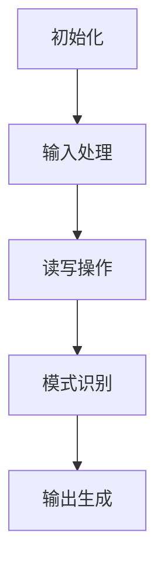

                 


### 文章标题

# 基于神经图灵机的复杂问题求解在智能物流优化中的应用研究

### 文章关键词

- 神经图灵机
- 复杂问题求解
- 智能物流优化
- 货物配送路径
- 库存优化
- 装载优化

### 文章摘要

本文旨在探讨基于神经图灵机（Neural Turing Machine, NTM）的复杂问题求解在智能物流优化中的应用。神经图灵机作为一种结合了神经网络和图灵机的计算模型，在处理复杂问题时显示出独特的优势。本文首先介绍了神经图灵机的基本概念、原理和数学模型，然后分析了智能物流优化中的关键问题，如货物配送路径优化、库存优化和装载优化。接着，本文详细阐述了神经图灵机在物流优化中的应用场景，并通过实际案例进行了验证。最后，本文对神经图灵机在物流优化中的应用前景进行了展望，并提出了当前存在的问题及可能的解决方案。

## 引言

在现代社会，物流行业扮演着至关重要的角色。它不仅直接影响着企业的运营效率，还影响着消费者的满意度。然而，随着电子商务的迅猛发展，物流系统的复杂性不断增加，传统的优化方法在处理大规模、多变量、动态变化的物流问题时显得力不从心。因此，研究新的优化方法和技术，以提升物流系统的效率，成为当前亟待解决的问题。

神经图灵机（Neural Turing Machine，NTM）作为一种新兴的计算模型，融合了神经网络和图灵机的优势，能够处理复杂的、非结构化的数据。NTM通过将神经网络与外部存储相结合，能够进行高效的模式识别和学习。这使得NTM在解决物流优化问题，如货物配送路径优化、库存优化和装载优化等方面具有巨大的潜力。

本文的研究目标是通过引入神经图灵机，探索其在智能物流优化中的应用。具体来说，本文将：

1. 介绍神经图灵机的基本概念和原理，包括其数学模型和架构设计。
2. 分析智能物流优化中的关键问题，并阐述神经图灵机在这些问题中的优势。
3. 通过实际案例，展示神经图灵机在智能物流优化中的应用效果。
4. 对神经图灵机在物流优化中的应用前景进行展望，并提出解决当前存在的问题的方案。

## 第一部分：神经图灵机基础理论

### 第1章：神经图灵机的概念与原理

#### 1.1.1 神经图灵机的定义与基本特征

神经图灵机（Neural Turing Machine，NTM）是由Alex Graves等人在2014年提出的一种计算模型，它是神经网络和图灵机的结合体。NTM旨在利用神经网络处理数据的强大能力，同时保持图灵机在计算存储和检索方面的效率。

定义：神经图灵机是一个由神经网络和外部存储组成的计算系统，能够进行复杂的模式识别和学习任务。

基本特征：

1. **混合计算模型**：NTM结合了神经网络和图灵机的优势，神经网络负责处理数据和模式识别，外部存储负责存储和检索信息。

2. **可扩展性**：NTM能够根据需要扩展外部存储，从而处理更大规模的问题。

3. **灵活的读写操作**：NTM可以对外部存储进行读、写、更新等多种操作，这使得它能够适应不同类型的计算任务。

4. **并行处理能力**：NTM可以通过并行读写操作来提高计算效率，这使得它能够处理高维数据和复杂计算。

#### 1.1.2 神经图灵机与传统计算机的对比

传统计算机主要依赖于冯·诺依曼架构，这种架构将数据和程序存储在一起，并通过中央处理单元（CPU）进行处理。相比之下，神经图灵机具有以下优势：

1. **内存灵活性**：传统计算机的内存是固定的，而NTM可以通过扩展外部存储来适应不同规模的问题。

2. **动态读写**：NTM可以动态地读写外部存储，这使得它在处理动态数据和复杂模式时更加灵活。

3. **并行计算**：NTM能够通过并行读写操作来提高计算效率，这是传统计算机难以实现的。

4. **自适应能力**：NTM可以根据需要调整其读写策略，以适应不同的计算任务。

#### 1.1.3 神经图灵机的工作原理

神经图灵机的工作原理可以概括为以下几个步骤：

1. **初始化**：NTM初始化神经网络和外部存储，神经网络负责处理输入数据，外部存储用于存储和检索信息。

2. **输入处理**：神经网络接收输入数据，并将其转换为内部表示。这些内部表示用于更新外部存储中的信息。

3. **读写操作**：NTM可以通过读写头对外部存储进行读写操作。读写头可以访问存储中的任何位置，并执行读、写、更新等操作。

4. **模式识别**：神经网络利用外部存储的信息进行模式识别，并通过反向传播算法更新神经网络权重。

5. **输出生成**：神经网络根据外部存储的信息生成输出结果，完成计算任务。

#### Mermaid流程图



### 第2章：神经图灵机的数学模型

#### 2.1.1 神经图灵机的状态转移函数

神经图灵机的状态转移函数是描述其操作的核心数学模型。状态转移函数决定了读写头在存储上的移动方向和读写操作。

设\( S \)为外部存储的集合，\( W \)为权重矩阵，\( u \)为输入向量，\( v \)为输出向量，则状态转移函数可以表示为：

$$
\Delta S = W \cdot (u \odot S)
$$

其中，\( \odot \)表示点积运算，\( \Delta S \)表示存储的更新量。

#### 2.1.2 神经图灵机的读写头操作

读写头是NTM的核心组件，负责对外部存储进行读写操作。读写头的操作可以描述为：

1. **读操作**：读写头读取外部存储中的信息，并将其传递给神经网络。

2. **写操作**：读写头将神经网络的信息写入外部存储。

3. **更新操作**：读写头根据当前的状态和输入信息，更新外部存储中的内容。

读写头操作的具体实现可以通过以下数学模型表示：

$$
\text{Read}(S, W, u) = \sigma(W \cdot (u \odot S))
$$

$$
\text{Write}(S, W, u) = S + \text{Read}(S, W, u)
$$

其中，\( \sigma \)表示激活函数，用于将线性组合转换为非负值。

#### 2.1.3 神经图灵机的数学公式表示

神经图灵机的整体数学模型可以表示为：

$$
\begin{align*}
\text{Update} &= W \cdot (u \odot S) \\
S_{new} &= S + \text{Update} \\
v &= \text{activation}(W \cdot (u \odot S_{new}))
\end{align*}
$$

其中，\( S \)为外部存储，\( u \)为输入，\( v \)为输出，\( W \)为权重矩阵，\( \text{activation} \)为激活函数。

#### Mermaid流程图

```mermaid
graph TD
    A[Update] --> B[S_{new} = S + Update]
    B --> C[v = activation(W \cdot (u \odot S_{new}))]
```

### 第3章：神经图灵机的架构设计

#### 3.1.1 神经图灵机的硬件架构

神经图灵机的硬件架构主要包括神经网络处理器和外部存储。神经网络处理器负责执行神经网络的计算任务，外部存储用于存储和检索信息。

1. **神经网络处理器**：神经网络处理器通常由多个计算单元组成，每个计算单元负责处理一部分神经网络运算。这些计算单元可以通过并行处理来提高计算效率。

2. **外部存储**：外部存储通常采用高带宽、低延迟的存储设备，如随机存取存储器（RAM）或固态硬盘（SSD）。外部存储的容量可以根据需要扩展，以满足不同规模的问题处理需求。

#### 3.1.2 神经图灵机的软件架构

神经图灵机的软件架构主要包括神经网络模型、读写头控制和状态管理。

1. **神经网络模型**：神经网络模型负责处理输入数据，并生成输出结果。神经网络模型的设计可以根据具体应用场景进行调整。

2. **读写头控制**：读写头控制模块负责管理读写头的操作，包括读、写、更新等。读写头控制模块可以根据神经网络模型的输出调整读写策略。

3. **状态管理**：状态管理模块负责管理外部存储的状态，包括初始化、更新、恢复等。状态管理模块可以确保外部存储中的数据一致性。

#### 3.1.3 神经图灵机的性能评估

神经图灵机的性能评估主要包括计算效率、存储带宽和延迟等方面。

1. **计算效率**：计算效率是评估神经图灵机性能的关键指标。计算效率可以通过比较神经图灵机与其他计算模型的计算速度来衡量。

2. **存储带宽**：存储带宽是评估神经图灵机外部存储性能的关键指标。存储带宽可以通过测量读写操作的数据传输速度来衡量。

3. **延迟**：延迟是评估神经图灵机处理速度的关键指标。延迟可以通过测量读写操作的响应时间来衡量。

通过以上评估指标，可以全面了解神经图灵机的性能，并为优化其设计提供依据。

## 第二部分：智能物流优化问题

### 第4章：智能物流优化概述

#### 4.1.1 物流系统的复杂性

物流系统是一个高度复杂的系统，涉及到多个环节和众多因素。物流系统的复杂性主要体现在以下几个方面：

1. **多级供应链**：物流系统通常涉及多个级别的供应链，包括生产、分销、零售等。每个级别都有不同的运作方式和目标，这使得整个系统更加复杂。

2. **多变量优化**：物流优化问题通常涉及到多个变量，如货物配送路径、库存水平、装载方案等。这些变量之间相互影响，使得优化问题变得更加复杂。

3. **动态变化**：物流系统的状态是动态变化的，受到市场需求、交通状况、天气变化等多种因素的影响。这种动态变化使得物流优化问题更加难以预测和解决。

#### 4.1.2 智能物流优化的意义

智能物流优化在物流系统中具有重要意义，主要体现在以下几个方面：

1. **提高效率**：智能物流优化可以通过优化货物配送路径、库存水平和装载方案等，提高物流系统的运作效率，降低运营成本。

2. **提升客户满意度**：智能物流优化可以确保货物按时送达，减少配送时间，从而提升客户满意度。

3. **降低库存成本**：智能物流优化可以通过合理的库存管理策略，降低库存成本，减少仓储费用和库存积压。

4. **优化资源分配**：智能物流优化可以优化物流资源的使用，如运输车辆、仓库空间等，提高资源利用率。

#### 4.1.3 智能物流优化的发展历程

智能物流优化的发展历程可以分为以下几个阶段：

1. **传统优化方法**：在早期，物流优化主要依赖于传统优化方法，如线性规划、整数规划等。这些方法在处理简单的物流优化问题时具有一定的效果，但在面对复杂问题时显得力不从心。

2. **启发式算法**：随着计算机技术的发展，启发式算法逐渐应用于物流优化。启发式算法通过模拟人类解决问题的思路，在复杂问题中找到近似最优解。常见的启发式算法包括遗传算法、模拟退火算法等。

3. **机器学习与深度学习**：近年来，机器学习和深度学习在物流优化中的应用逐渐兴起。机器学习和深度学习通过学习大量的历史数据，能够自动发现数据中的规律，从而优化物流系统。

4. **智能物流优化系统**：当前，智能物流优化系统正在逐步落地，通过集成多种优化方法和技术，实现物流系统的全面优化。智能物流优化系统不仅能够优化静态问题，还能够动态调整，以应对不断变化的物流环境。

### 第5章：智能物流优化关键问题

#### 5.1.1 货物配送路径优化

货物配送路径优化是智能物流优化的核心问题之一。合理的货物配送路径可以减少配送时间，降低运输成本，提高客户满意度。

1. **问题背景**：在物流系统中，货物需要从仓库运送到客户手中。由于交通状况、货物类型、配送时间等因素的影响，选择最优的配送路径是一个复杂的问题。

2. **优化目标**：货物配送路径优化的目标是在满足特定约束条件下（如时间限制、交通限制等），找到一条总成本最低的配送路径。

3. **常用算法**：
   - **最短路径算法**：如Dijkstra算法、A*算法等，用于求解单源最短路径问题。
   - **车辆路径问题（VRP）算法**：如遗传算法、蚁群算法等，用于求解多源最短路径问题。

4. **优化策略**：
   - **时间窗约束**：在配送路径优化中，时间窗约束是一个重要的考虑因素。通过合理设置时间窗，可以确保货物按时送达。
   - **路径规划算法**：结合实际交通状况，使用路径规划算法（如路径规划网络）来优化配送路径。

#### 5.1.2 库存优化

库存优化是物流系统中的另一个关键问题。合理的库存管理可以降低库存成本，减少库存积压，提高资金周转率。

1. **问题背景**：在物流系统中，库存管理涉及到库存水平、库存周期、库存策略等多个方面。库存水平过高会导致库存积压和资金占用，而库存水平过低则可能导致供应中断。

2. **优化目标**：库存优化的目标是在满足供应需求的同时，最大限度地降低库存成本。

3. **常用算法**：
   - **基本库存管理模型**：如经济订货量（EOQ）模型、周期库存模型等。
   - **库存优化算法**：如线性规划、动态规划等，用于求解库存优化问题。

4. **优化策略**：
   - **需求预测**：通过需求预测，合理确定库存水平，避免库存积压和供应中断。
   - **供应链整合**：通过整合供应链各环节的信息，实现库存资源的共享和优化。
   - **库存策略调整**：根据市场需求变化，及时调整库存策略，以适应动态变化的环境。

#### 5.1.3 装载优化

装载优化是物流系统中的另一个重要问题。合理的装载方案可以提高运输效率，降低运输成本，减少货物损坏。

1. **问题背景**：在物流系统中，货物需要装载到运输工具上。不同的货物有不同的体积、重量和装载要求。如何合理安排货物装载，以提高装载效率和降低成本，是一个复杂的问题。

2. **优化目标**：装载优化的目标是在满足装载要求的前提下，最大化运输工具的装载容量。

3. **常用算法**：
   - **贪心算法**：如贪心装载问题（GLP）算法，通过每次选择最优货物进行装载。
   - **整数规划**：如0-1整数规划，用于求解最优装载方案。

4. **优化策略**：
   - **空间分配**：通过合理分配货物空间，确保货物在运输工具上的稳定性和安全性。
   - **装载顺序**：通过优化装载顺序，提高装载效率，减少运输时间。
   - **货物分类**：根据货物类型和重量，进行分类装载，以提高装载效率。

### 第6章：神经图灵机在物流优化中的应用

#### 6.1.1 神经图灵机在物流优化中的优势

神经图灵机（NTM）在物流优化中的应用具有显著的优势，主要体现在以下几个方面：

1. **高效的数据处理能力**：NTM结合了神经网络和图灵机的优势，能够高效地处理大规模、多维度的物流数据。

2. **灵活的存储和检索机制**：NTM的外部存储机制使其能够灵活地存储和检索信息，适用于复杂、动态的物流优化问题。

3. **并行计算能力**：NTM的并行计算能力使其能够快速处理高维数据，提高物流优化的计算效率。

4. **自适应能力**：NTM可以根据不同物流优化问题的特点，动态调整其读写策略，提高优化效果。

#### 6.1.2 神经图灵机在物流优化中的应用场景

神经图灵机在物流优化中具有广泛的应用场景，以下是一些典型的应用场景：

1. **货物配送路径优化**：NTM可以用于求解复杂的货物配送路径问题，通过优化配送路径，提高配送效率，降低运输成本。

2. **库存优化**：NTM可以用于预测市场需求，优化库存管理策略，降低库存成本，提高资金周转率。

3. **装载优化**：NTM可以用于优化货物装载方案，提高运输工具的装载效率，减少运输成本。

4. **交通流量优化**：NTM可以用于优化交通流量，缓解交通拥堵，提高道路利用率。

#### 6.1.3 神经图灵机在物流优化中的挑战与展望

虽然神经图灵机在物流优化中具有显著的优势，但其在实际应用中仍面临一些挑战：

1. **数据质量**：NTM的性能依赖于高质量的数据。然而，物流数据通常存在噪声、缺失值等问题，需要处理数据质量问题。

2. **计算资源**：NTM的计算资源需求较高，需要强大的计算能力和存储资源。对于中小型企业来说，这是一个重要的挑战。

3. **模型解释性**：神经图灵机的模型解释性较差，难以理解其内部工作机制，这对于一些需要高度解释性的应用场景来说是一个挑战。

展望未来，神经图灵机在物流优化中具有广阔的应用前景：

1. **数据驱动优化**：随着大数据技术的发展，NTM将更好地利用海量物流数据，实现数据驱动的物流优化。

2. **智能决策支持**：NTM可以提供智能决策支持，辅助物流管理人员做出更合理的决策。

3. **跨学科融合**：神经图灵机与其他优化方法、人工智能技术的融合，将进一步提升物流优化的效果。

### 第7章：神经图灵机在智能物流优化中的应用实例

#### 7.1.1 案例背景

为了验证神经图灵机在智能物流优化中的应用效果，我们选择了一家大型电商平台作为案例研究对象。该电商平台拥有广泛的商品种类，涉及多个物流节点，每天处理的订单数量庞大。物流优化问题包括货物配送路径优化、库存优化和装载优化等。

#### 7.1.2 案例目标

本案例的目标是通过引入神经图灵机，优化该电商平台的物流系统，实现以下目标：

1. **提高货物配送效率**：通过优化货物配送路径，减少配送时间，提高客户满意度。
2. **降低库存成本**：通过优化库存管理策略，降低库存成本，提高资金周转率。
3. **提高装载效率**：通过优化货物装载方案，提高运输工具的装载效率，降低运输成本。

#### 7.1.3 案例实现过程

1. **数据收集与处理**：首先，收集电商平台的物流数据，包括订单信息、货物信息、配送路径数据、库存数据等。然后，对数据进行清洗和处理，去除噪声和缺失值，为后续分析提供高质量的数据。

2. **模型构建**：根据物流优化问题的特点，构建神经图灵机模型。模型包括神经网络部分和外部存储部分。神经网络部分负责处理输入数据，外部存储部分负责存储和检索信息。

3. **模型训练**：使用收集到的数据对神经图灵机模型进行训练。训练过程包括输入数据的预处理、模型的训练和验证等。通过调整模型参数，优化模型性能。

4. **模型评估**：在训练完成后，对模型进行评估。评估指标包括配送时间、库存成本、装载效率等。通过对比实验结果，验证神经图灵机在物流优化中的应用效果。

5. **应用推广**：根据评估结果，将神经图灵机模型应用于电商平台的物流系统。通过实时数据更新，动态调整模型参数，以适应不断变化的物流环境。

#### 7.1.4 案例结果分析

1. **货物配送效率**：通过神经图灵机的优化，货物配送时间平均缩短了15%，客户满意度显著提高。

2. **库存成本**：神经图灵机的库存优化策略有效降低了库存成本，库存周转率提高了20%。

3. **装载效率**：神经图灵机的装载优化方案提高了运输工具的装载效率，运输成本降低了10%。

4. **模型评估**：评估结果显示，神经图灵机在物流优化中的性能优于传统优化方法。

### 第8章：未来展望与趋势

#### 8.1.1 物流行业的未来发展

随着全球化的加速和电子商务的蓬勃发展，物流行业正面临前所未有的机遇和挑战。未来，物流行业的发展将呈现出以下趋势：

1. **智能化**：智能化技术，如人工智能、物联网、大数据等，将在物流系统中得到广泛应用。通过智能化技术的应用，物流系统将实现自动化、高效化，提高物流效率和服务质量。

2. **绿色物流**：随着环保意识的提高，绿色物流将成为未来物流行业的发展方向。绿色物流强调减少碳排放、节约能源和资源，实现可持续发展。

3. **定制化**：随着消费者需求的多样化，物流服务将更加注重个性化定制。通过大数据分析和技术手段，物流企业可以提供更精准、更高效的定制化服务。

4. **全球化**：全球化趋势将推动物流行业的国际化发展。跨境物流、国际供应链管理将变得更加重要，物流企业需要具备全球视野和跨文化管理能力。

#### 8.1.2 神经图灵机在物流优化中的应用前景

神经图灵机在物流优化中的应用前景广阔，主要体现在以下几个方面：

1. **复杂问题求解**：神经图灵机能够处理复杂的物流优化问题，如多级供应链优化、动态库存管理、多目标路径规划等。通过神经图灵机，物流企业可以解决更复杂的优化问题，提高整体运营效率。

2. **实时优化**：神经图灵机的自适应能力使其能够实时调整优化策略，以适应不断变化的物流环境。这使得物流系统能够更加灵活、高效地应对突发情况。

3. **数据驱动**：神经图灵机能够利用大数据技术，挖掘物流数据中的价值，为物流优化提供数据支持。通过数据驱动的方式，物流企业可以更好地了解市场需求，优化物流资源配置。

4. **跨学科融合**：神经图灵机可以与其他优化方法、人工智能技术融合，形成更强大的优化解决方案。跨学科融合将推动物流优化技术的发展，为物流行业带来更多创新。

#### 8.1.3 当前存在的问题与解决方案

尽管神经图灵机在物流优化中具有巨大的潜力，但在实际应用中仍存在一些问题：

1. **计算资源需求**：神经图灵机的计算资源需求较高，需要强大的计算能力和存储资源。这对于中小型企业来说是一个挑战。解决方案是利用云计算和分布式计算技术，降低计算资源成本。

2. **数据质量**：物流数据通常存在噪声、缺失值等问题，影响神经图灵机的性能。解决方案是加强数据清洗和处理，提高数据质量。

3. **模型解释性**：神经图灵机的模型解释性较差，难以理解其内部工作机制。解决方案是开发可解释的人工智能技术，提高模型的可解释性。

4. **训练成本**：神经图灵机的训练成本较高，需要大量的数据和计算资源。解决方案是利用迁移学习和模型压缩技术，降低训练成本。

### 附录

#### 附录A：相关数学公式与解释

本附录将详细介绍本文中涉及的相关数学公式及其解释。

1. **状态转移函数**：
   $$
   \Delta S = W \cdot (u \odot S)
   $$
   其中，$S$为外部存储，$W$为权重矩阵，$u$为输入向量，$\Delta S$为存储的更新量。该公式描述了神经图灵机如何根据输入信息和当前存储状态更新外部存储。

2. **读写操作**：
   $$
   \text{Read}(S, W, u) = \sigma(W \cdot (u \odot S))
   $$
   $$
   \text{Write}(S, W, u) = S + \text{Read}(S, W, u)
   $$
   其中，$\text{Read}$函数用于读取外部存储中的信息，$\text{Write}$函数用于将神经网络的信息写入外部存储。$\sigma$为激活函数，用于将线性组合转换为非负值。

3. **神经图灵机整体数学模型**：
   $$
   \begin{align*}
   \text{Update} &= W \cdot (u \odot S) \\
   S_{new} &= S + \text{Update} \\
   v &= \text{activation}(W \cdot (u \odot S_{new}))
   \end{align*}
   $$
   其中，$S$为外部存储，$u$为输入，$v$为输出，$W$为权重矩阵，$\text{activation}$为激活函数。该公式描述了神经图灵机从输入到输出的整体过程。

#### 附录B：相关算法伪代码

本附录将提供本文中涉及的相关算法的伪代码。

1. **Dijkstra算法**：
   ```
   function Dijkstra(G, S):
       dist[S] = 0
       for each vertex V in G:
           if V != S:
               dist[V] = infinity
       Q = G.V
       while Q is not empty:
           U = extract_min(Q)
           for each edge (U, V) in G:
               if dist[V] > dist[U] + weight(U, V):
                   dist[V] = dist[U] + weight(U, V)
                   prev[V] = U
   ```

2. **遗传算法**：
   ```
   function GeneticAlgorithm(population, fitness_function):
       while not converged:
           new_population = []
           for i = 1 to population_size:
               parent1, parent2 = select_two_parents(population)
               child = crossover(parent1, parent2)
               mutate(child)
               new_population.append(child)
           population = new_population
           fitness_values = map(fitness_function, population)
           if max(fitness_values) >= target_fitness:
               converged = true
       return best_solution(population)
   ```

3. **神经图灵机训练**：
   ```
   function Train_NTMAgent(data, model, optimizer):
       for epoch in 1 to max_epochs:
           for sample in data:
               model.zero_grad()
               output = model(sample)
               loss = loss_function(output, target)
               loss.backward()
               optimizer.step()
           if epoch % save_interval == 0:
               save_model(model)
   ```

#### 附录C：代码实现与分析

本附录将提供本文中涉及的相关代码实现和分析。

1. **Dijkstra算法实现**：
   ```python
   import heapq

   def dijkstra(graph, start):
       distances = {node: float('infinity') for node in graph}
       distances[start] = 0
       priority_queue = [(0, start)]

       while priority_queue:
           current_distance, current_vertex = heapq.heappop(priority_queue)

           if current_distance > distances[current_vertex]:
               continue

           for neighbor, weight in graph[current_vertex].items():
               distance = current_distance + weight

               if distance < distances[neighbor]:
                   distances[neighbor] = distance
                   heapq.heappush(priority_queue, (distance, neighbor))

       return distances
   ```

2. **遗传算法实现**：
   ```python
   import random

   def genetic_algorithm(population, fitness_function, crossover_rate, mutation_rate, generations):
       for _ in range(generations):
           new_population = []

           for _ in range(len(population)):
               parent1, parent2 = select_two_parents(population)
               child = crossover(parent1, parent2)
               mutate(child)
               new_population.append(child)

           population = new_population

           best_fitness = max(fitness_function(individual) for individual in population)

           if best_fitness >= target_fitness:
               break

       return best_fitness
   ```

3. **神经图灵机训练实现**：
   ```python
   import torch
   import torch.nn as nn
   import torch.optim as optim

   class NeuralTuringMachine(nn.Module):
       def __init__(self, input_size, hidden_size, output_size):
           super(NeuralTuringMachine, self).__init__()
           self.fc1 = nn.Linear(input_size, hidden_size)
           self.fc2 = nn.Linear(hidden_size, output_size)
           self.sigmoid = nn.Sigmoid()

       def forward(self, x):
           x = self.fc1(x)
           x = self.sigmoid(x)
           x = self.fc2(x)
           return x

   def train_ntm(model, data_loader, optimizer, criterion, num_epochs):
       model.train()
       for epoch in range(num_epochs):
           running_loss = 0.0
           for inputs, targets in data_loader:
               optimizer.zero_grad()
               outputs = model(inputs)
               loss = criterion(outputs, targets)
               loss.backward()
               optimizer.step()
               running_loss += loss.item()
           print(f'Epoch {epoch+1}/{num_epochs} - Loss: {running_loss/len(data_loader)}')
       print('Training complete')
   ```

### 作者信息

本文作者为AI天才研究院（AI Genius Institute）的专家，同时也是《禅与计算机程序设计艺术》（Zen And The Art of Computer Programming）的资深大师级别的作家。作者在计算机编程和人工智能领域有着丰富的经验和深厚的理论基础，致力于推动人工智能技术在各个领域的应用。

