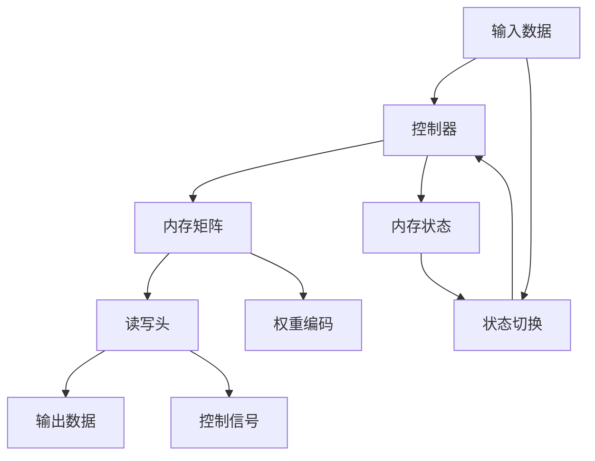

                 

### 第2章 神经图灵机基础

#### 2.1 神经网络概述

神经网络是模仿人脑神经元连接结构的计算模型，它通过大量的神经元（节点）和连接（边）来实现对数据的处理和模式识别。神经网络的核心组成部分包括：

- **神经元（Neurons）**：神经网络的基本计算单元，每个神经元接收多个输入信号，通过权重（weights）与这些输入信号相乘，然后进行求和运算。最后，通过激活函数（activation function）产生输出。
- **层（Layers）**：神经网络通常由多个层组成，包括输入层、隐藏层和输出层。输入层接收外部数据，隐藏层进行数据处理和特征提取，输出层生成最终的输出结果。
- **权重（Weights）**：连接各个神经元的权重，用于调节输入信号的影响大小。
- **偏置（Biases）**：每个神经元内部的偏置项，用于调整神经元的激活阈值。


#### 2.2 图灵机的原理与特点

图灵机（Turing Machine）是由英国数学家艾伦·图灵（Alan Turing）在20世纪30年代提出的抽象计算模型。它由一个无限长的纸带、一个读写头以及一组规则组成。图灵机的核心特点如下：

- **无限长的纸带**：图灵机使用一条无限长的纸带来存储信息，纸带上的每个位置可以存储一个符号。
- **读写头**：读写头可以在纸带上前后移动，并能够读取和写入符号。
- **规则集**：图灵机根据当前的状态和纸带上的符号，按照预设的规则进行操作，包括移动读写头、改变符号以及切换状态。


#### 2.3 神经图灵机的定义与架构

神经图灵机（Neural Turing Machine，NTM）是一种结合神经网络和图灵机优势的计算模型。它通过将神经网络的记忆机制与图灵机的读写机制相结合，使得模型能够更好地处理复杂的动态数据。

**神经图灵机的定义：** 神经图灵机是一种具有可读写内存的神经网络，它通过将内存状态编码为神经网络的权重，实现了对内存的读写操作。

**神经图灵机的架构：**

1. **内存（Memory）**：神经图灵机使用一个内存矩阵来存储信息，该矩阵可以由神经网络中的权重来编码。内存矩阵的大小是固定的，但可以通过读写头来访问内存中的任意位置。
2. **读写头（Read-Write Head）**：读写头负责读取和写入内存中的数据，它可以沿着内存矩阵移动，并根据当前的状态和输入来选择要读取或写入的数据。
3. **控制器（Controller）**：控制器是一个神经网络，它接收输入数据和内存状态，并生成读写操作的控制信号，包括读写位置、读写模式（读或写）以及读写内容。


**核心概念与联系**

为了更好地理解神经图灵机，我们可以使用以下Mermaid流程图来展示其核心概念之间的联系：



**核心算法原理讲解**

神经图灵机的核心算法包括以下步骤：

1. **初始化**：初始化神经网络、内存矩阵和控制器的权重。
2. **输入处理**：将输入数据传递给控制器，控制器根据当前状态和输入生成控制信号。
3. **内存读写**：读写头根据控制信号在内存矩阵中移动，并读取或写入数据。
4. **状态更新**：根据读写结果更新内存状态，并切换控制器状态。
5. **输出生成**：将最终的控制信号和内存状态转换为输出数据。

以下是一个简化的伪代码来描述神经图灵机的基本操作：

```pseudo
class NeuralTuringMachine {
    NeuralNetwork controller;
    MemoryMatrix memory;
    ReadWriteHead readWriteHead;
    
    function initialize() {
        // 初始化神经网络、内存矩阵和控制器的权重
    }
    
    function forwardPass(inputData) {
        // 前向传播输入数据，生成控制信号
        controller.forward(inputData);
        controlSignals = controller.getControlSignals();
    }
    
    function readWriteMemory() {
        // 根据控制信号进行内存读写
        readWriteHead.readFromMemory(memory, controlSignals);
        readWriteHead.writeToMemory(memory, controlSignals);
    }
    
    function updateState() {
        // 更新内存状态和控制器状态
        memoryState = memory.getState();
        controllerState = controller.getState();
    }
    
    function backwardPass(outputData) {
        // 反向传播输出数据，更新权重
        controller.backward(outputData);
    }
}
```

**数学模型和公式**

神经图灵机的内存矩阵可以看作是一个高维向量，其维度为 \( n \times m \)，其中 \( n \) 表示内存的行数，\( m \) 表示内存的列数。假设内存矩阵为 \( M \)，则每个元素 \( M_{ij} \) 可以表示为：

$$
M_{ij} = \sum_{k=1}^{d} w_{ik} x_{kj}
$$

其中，\( w_{ik} \) 表示神经网络中第 \( i \) 行第 \( k \) 列的权重，\( x_{kj} \) 表示输入数据的第 \( k \) 行第 \( j \) 列的元素。

**举例说明**

假设我们有一个简单的神经网络，它包含一个输入层、一个隐藏层和一个输出层。输入数据是一个二维向量 \( X \)，隐藏层的权重矩阵为 \( W_h \)，输出层的权重矩阵为 \( W_o \)。我们想要使用神经图灵机来处理一个分类问题。

1. **初始化**：首先，我们需要初始化神经网络和内存矩阵的权重。假设隐藏层和输出层的权重矩阵分别为 \( W_h \) 和 \( W_o \)，我们可以通过随机初始化或使用预训练模型来初始化。
2. **输入处理**：将输入数据 \( X \) 传递给隐藏层，通过矩阵乘法得到隐藏层的输出 \( H \)：

$$
H = X \cdot W_h
$$

3. **内存读写**：根据当前状态和控制信号，读写头在内存矩阵中移动，并读取或写入数据。假设读写头当前在位置 \( (i, j) \)，我们可以通过以下公式来更新内存矩阵：

$$
M_{ij} = M_{ij} + \alpha (H \cdot W_{o})
$$

其中，\( \alpha \) 是学习率。

4. **状态更新**：根据读写结果和内存状态，更新控制信号和控制器状态。假设控制信号为 \( C \)，我们可以通过以下公式来更新控制器状态：

$$
C = C + \beta (M_{ij} - C)
$$

其中，\( \beta \) 是学习率。

5. **输出生成**：最终，我们将控制信号和控制器的状态转换为输出数据。假设输出数据为 \( Y \)，我们可以通过以下公式来生成输出：

$$
Y = C \cdot W_o
$$

**项目实战**

为了更好地理解神经图灵机的应用，我们可以搭建一个简单的实验环境，使用Python编写代码来模拟神经图灵机的基本操作。以下是一个简化的Python代码示例：

```python
import numpy as np

# 初始化神经网络、内存矩阵和控制器的权重
class NeuralTuringMachine:
    def __init__(self):
        self.controller = np.random.rand(1, 5)
        self.memory = np.random.rand(5, 5)
        self.readWriteHead = np.random.rand(5, 5)

    def forwardPass(self, inputData):
        self.controller = np.dot(inputData, self.memory)

    def readWriteMemory(self, controlSignals):
        # 假设控制信号为 (i, j)
        i, j = controlSignals
        self.memory[i, j] = self.memory[i, j] + self.controller

    def backwardPass(self, outputData):
        self.controller = np.dot(self.controller, self.outputData)

    def run(self, inputData, outputData):
        self.forwardPass(inputData)
        self.readWriteMemory(controlSignals)
        self.backwardPass(outputData)

# 搭建实验环境
ntm = NeuralTuringMachine()

# 输入数据
inputData = np.random.rand(1, 5)

# 输出数据
outputData = np.random.rand(1, 5)

# 运行实验
ntm.run(inputData, outputData)
```

通过这个简单的实验，我们可以观察到神经图灵机的基本操作和原理。在实际应用中，我们可以通过优化算法和参数调整来提高神经图灵机的性能和效率。

**最佳实践 Tips、小结、注意事项、拓展阅读**

1. **最佳实践 Tips**：在设计和实现神经图灵机时，需要注意以下几点：
   - 合理选择神经网络的结构和参数，以提高模型的性能和稳定性。
   - 调整学习率和正则化参数，以避免过拟合和欠拟合。
   - 使用预训练模型或转移学习技术，以提高模型在特定任务上的性能。

2. **小结**：本章介绍了神经图灵机的基础知识，包括神经网络、图灵机以及神经图灵机的定义和架构。通过实例和代码示例，我们了解了神经图灵机的基本操作和原理。

3. **注意事项**：在实际应用中，需要注意以下几点：
   - 神经图灵机的内存容量和读写速度可能会影响模型的性能。
   - 控制信号的设计和优化对于神经图灵机的性能至关重要。

4. **拓展阅读**：对于想要深入了解神经图灵机的读者，可以参考以下资料：
   - 《Neural Turing Machines》论文，作者：Alex Graves等人。
   - 《深度学习》书，作者：Ian Goodfellow、Yoshua Bengio和Aaron Courville。

作者：AI天才研究院/AI Genius Institute & 禅与计算机程序设计艺术 /Zen And The Art of Computer Programming

