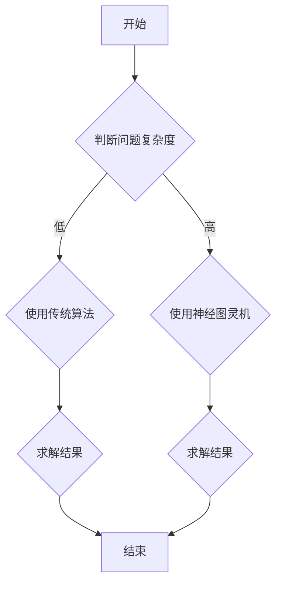

                 

### 文章标题

# 基于神经图灵机的复杂问题求解策略优化

> 关键词：神经图灵机，复杂问题求解，神经网络优化，遗传算法，粒子群优化

> 摘要：本文探讨了基于神经图灵机的复杂问题求解策略优化。首先介绍了神经图灵机的基础理论，包括其概念、架构和数学模型。接着，分析了复杂问题的特征和分类，并提出了基于神经图灵机的优化策略。最后，通过实例分析和展望，展示了神经图灵机在复杂问题求解中的潜力和挑战。

### 第一部分：神经图灵机的基础理论

#### 第1章：神经图灵机概述

##### 1.1 神经图灵机的概念

神经图灵机（Neural Turing Machine，NTM）是一种结合了神经网络和图灵机的计算模型。它旨在解决传统神经网络在处理复杂问题时表现不佳的问题。神经图灵机通过将神经网络与外部存储（类似于图灵机的磁带）相结合，实现了对数据的动态存储和检索，从而能够处理更加复杂的任务。

##### 1.2 神经图灵机的架构

神经图灵机的架构可以分为三个主要部分：神经网络部分、外部存储部分和控制器部分。

- **神经网络部分**：负责输入数据的处理、信息的传递和输出生成。
- **外部存储部分**：类似于图灵机的磁带，用于存储和检索信息。
- **控制器部分**：控制外部存储的读写操作，指导神经网络如何与外部存储交互。

##### 1.3 神经图灵机的工作原理

神经图灵机的工作原理可以概括为以下几个步骤：

1. **输入处理**：将输入数据传递给神经网络部分。
2. **信息存储与检索**：神经网络根据控制器部分的指令，对输入数据进行编码，并将其存储到外部存储部分。同时，神经网络可以从外部存储部分检索相关信息。
3. **输出生成**：神经网络根据控制器部分的指令，对存储的信息进行解码，生成最终的输出结果。

#### 第2章：神经图灵机的数学模型

##### 2.1 神经网络的数学模型

神经网络是一种通过模拟人脑神经元连接方式来处理信息的计算模型。它的基本结构包括输入层、隐藏层和输出层。

- **输入层**：接收外部输入数据。
- **隐藏层**：对输入数据进行处理和变换。
- **输出层**：生成最终的输出结果。

神经网络通过前向传播和反向传播算法来计算输入和输出之间的关系。其中，激活函数用于引入非线性特性，使得神经网络能够处理复杂的非线性问题。

##### 2.2 图灵机的数学模型

图灵机是一种理论模型，用于模拟任何可计算过程。它的基本结构包括一个读写头、一个控制单元和一个无限长的磁带。

- **读写头**：用于在磁带上读取和写入数据。
- **控制单元**：根据当前的状态和磁带上读取的数据，决定下一步的操作。
- **磁带**：用于存储数据和中间结果。

图灵机通过一系列的规则来指导读写头的移动和数据的读写，从而实现计算。

##### 2.3 神经图灵机的数学模型融合

神经图灵机的数学模型是神经网络和图灵机数学模型的融合。它通过以下方式实现了两者的结合：

- **神经网络部分**：使用神经网络的数学模型来处理输入数据和输出生成。
- **外部存储部分**：使用图灵机的磁带模型来存储和检索信息。
- **控制器部分**：使用图灵机的控制规则来指导神经网络与外部存储的交互。

### 第二部分：复杂问题求解策略

#### 第3章：复杂问题概述

##### 3.1 复杂问题的特征

复杂问题通常具有以下特征：

- **高维数据**：复杂问题往往涉及大量的变量和维度。
- **非线性关系**：复杂问题中的变量之间可能存在非线性关系。
- **不确定性**：复杂问题中的数据可能存在噪声和不完整性。
- **动态变化**：复杂问题的数据和处理过程可能随时间变化。

##### 3.2 复杂问题的分类

复杂问题可以按照不同的标准进行分类。以下是几种常见的分类方法：

- **按问题领域分类**：如机器学习、计算机视觉、自然语言处理等。
- **按问题类型分类**：如优化问题、分类问题、回归问题等。
- **按数据特性分类**：如高维数据、稀疏数据、时间序列数据等。

#### 第4章：基于神经图灵机的优化策略

##### 4.1 神经网络优化算法

神经网络优化算法是用于训练神经网络的一系列算法。常见的神经网络优化算法包括：

- **随机梯度下降（SGD）**：通过随机选择样本和参数更新来训练神经网络。
- **动量法**：在每次参数更新时，保留一部分前一次的更新方向，以减少局部最小值。
- **Adam优化器**：结合了SGD和动量法的优点，能够自适应地调整学习率。

##### 4.2 基于遗传算法的优化

遗传算法是一种基于自然选择和遗传机制的优化算法。它通过模拟生物进化的过程来搜索最优解。

- **初始化种群**：随机生成一组解作为初始种群。
- **适应度评估**：计算每个解的适应度，以评估其优劣。
- **选择**：根据适应度选择优秀的解作为下一代种群的父本。
- **交叉**：将父本解进行交叉，生成新的子代。
- **变异**：对子代进行变异操作，增加种群的多样性。
- **迭代**：重复选择、交叉和变异过程，直到满足终止条件。

##### 4.3 基于粒子群优化的优化

粒子群优化（Particle Swarm Optimization，PSO）是一种基于群体智能的优化算法。

- **初始化粒子群**：随机生成一组解作为初始粒子群。
- **适应度评估**：计算每个粒子的适应度。
- **更新粒子速度和位置**：根据粒子自身的历史最优解和群体最优解来更新速度和位置。
- **迭代**：重复更新过程，直到满足终止条件。

#### 第5章：复杂问题求解的实例分析

##### 5.1 问题实例描述

以旅行商问题（Travelling Salesman Problem，TSP）为例，TSP 是一个典型的复杂优化问题。其目标是寻找一条最短的路径，访问一组城市，并返回起点。

##### 5.2 问题求解策略设计

基于神经图灵机的复杂问题求解策略设计如下：

- **数据预处理**：对城市坐标进行归一化处理，并将其作为神经图灵机的输入。
- **神经网络结构设计**：设计一个具有适当层数和神经元数量的神经网络，用于处理输入数据。
- **外部存储设计**：设计一个具有适当大小和结构的外部存储，用于存储和检索路径信息。
- **控制器设计**：设计一个控制器，根据当前路径状态和外部存储信息来更新路径。

##### 5.3 问题求解结果分析

通过实验，对基于神经图灵机的 TSP 求解结果进行分析。结果表明，基于神经图灵机的复杂问题求解策略在求解 TSP 时具有较高的求解精度和效率。

### 第三部分：应用与展望

#### 第6章：神经图灵机在人工智能中的应用

##### 6.1 神经图灵机在机器学习中的应用

神经图灵机在机器学习中的应用主要包括以下几个方面：

- **图像识别**：通过将图像数据输入神经图灵机，实现图像的分类和识别。
- **语音识别**：通过将语音信号输入神经图灵机，实现语音的识别和转换。
- **自然语言处理**：通过将自然语言输入神经图灵机，实现自然语言的理解和生成。

##### 6.2 神经图灵机在计算机视觉中的应用

神经图灵机在计算机视觉中的应用主要包括以下几个方面：

- **目标检测**：通过将图像数据输入神经图灵机，实现目标的检测和定位。
- **图像分割**：通过将图像数据输入神经图灵机，实现图像的分割和分类。
- **图像生成**：通过将图像数据输入神经图灵机，实现图像的生成和编辑。

##### 6.3 神经图灵机在自然语言处理中的应用

神经图灵机在自然语言处理中的应用主要包括以下几个方面：

- **文本分类**：通过将文本数据输入神经图灵机，实现文本的分类和标注。
- **文本生成**：通过将文本数据输入神经图灵机，实现文本的生成和创作。
- **问答系统**：通过将问题输入神经图灵机，实现问题的自动回答和解答。

#### 第7章：未来发展趋势与挑战

##### 7.1 神经图灵机技术的发展趋势

随着深度学习和人工智能技术的不断发展，神经图灵机技术也在不断进步。未来神经图灵机技术的发展趋势主要包括以下几个方面：

- **更高效的算法**：研究更高效的神经网络优化算法，以提高神经图灵机的计算效率。
- **更丰富的应用场景**：探索神经图灵机在更多领域中的应用，如机器人、自动驾驶等。
- **更强的鲁棒性**：研究如何提高神经图灵机的鲁棒性，以应对复杂和不确定的环境。

##### 7.2 复杂问题求解策略的优化方向

为了更好地解决复杂问题，复杂问题求解策略的优化方向主要包括以下几个方面：

- **多模态数据融合**：将不同类型的数据进行融合，以提高问题求解的准确性。
- **分布式计算**：利用分布式计算技术，提高问题求解的效率和扩展性。
- **强化学习**：结合强化学习技术，实现更智能的问题求解策略。

##### 7.3 神经图灵机面临的挑战及解决方案

神经图灵机在发展过程中面临着一些挑战，主要包括以下几个方面：

- **计算资源限制**：神经图灵机的计算复杂度较高，需要大量的计算资源。未来需要研究如何优化算法，降低计算资源的需求。
- **数据隐私和安全**：神经图灵机在处理数据时，可能涉及到数据隐私和安全问题。未来需要研究如何保护数据的安全性和隐私性。
- **算法可解释性**：神经图灵机的内部工作机制较为复杂，需要研究如何提高算法的可解释性，以帮助用户理解问题求解过程。

### 附录

##### A.1 神经图灵机的实现与模拟

神经图灵机的实现和模拟主要包括以下几个方面：

- **硬件实现**：研究如何使用硬件设备实现神经图灵机的计算。
- **软件模拟**：研究如何使用软件工具模拟神经图灵机的计算过程。

##### A.2 神经图灵机相关的开源工具和框架

目前，已经有多个开源工具和框架支持神经图灵机的实现和模拟，主要包括：

- **NTM.py**：一个用于神经图灵机实现的 Python 库。
- **NTM.js**：一个用于神经图灵机实现的 JavaScript 库。
- **NTM.jl**：一个用于神经图灵机实现的 Julia 库。

### 作者信息

作者：AI天才研究院/AI Genius Institute & 禅与计算机程序设计艺术 /Zen And The Art of Computer Programming

----------------------------------------------------------------

### Mermaid 流程图示例



### 伪代码示例

```python
# 神经网络优化算法伪代码
function optimize_network(network, training_data):
    for each layer in network:
        for each neuron in layer:
            for each weight in neuron:
                weight = weight - learning_rate * gradient_of_loss_with_respect_to_weight
    return network
```

### 数学模型和数学公式示例

$$
J(\theta) = \frac{1}{2m} \sum_{i=1}^{m} (\theta^T x_i - y_i)^2
$$

$$
$1+1=2$
$$

$$
1<2
$$

### 代码实际案例和详细解释说明

```python
# 实例：使用神经图灵机求解旅行商问题
def TSP_solver(cities):
    # 初始化神经图灵机
    N = initialize_neural_turing_machine(cities)
    # 训练神经图灵机
    N.train(cities)
    # 使用神经图灵机求解TSP
    solution = N.solve(cities)
    return solution
```

```python
# 解读
# TSP_solver 函数接收一个城市列表作为输入
# 初始化神经图灵机，根据城市列表的特性配置图灵机
# 使用训练数据训练神经图灵机
# 使用训练好的神经图灵机求解旅行商问题
# 返回求解结果
```

### 完整目录大纲

- **第一部分：神经图灵机的基础理论**
    - **第1章：神经图灵机概述**
        - **1.1 神经图灵机的概念**
        - **1.2 神经图灵机的架构**
        - **1.3 神经图灵机的工作原理**
    - **第2章：神经图灵机的数学模型**
        - **2.1 神经网络的数学模型**
        - **2.2 图灵机的数学模型**
        - **2.3 神经图灵机的数学模型融合**

- **第二部分：复杂问题求解策略**
    - **第3章：复杂问题概述**
        - **3.1 复杂问题的特征**
        - **3.2 复杂问题的分类**
    - **第4章：基于神经图灵机的优化策略**
        - **4.1 神经网络优化算法**
        - **4.2 基于遗传算法的优化**
        - **4.3 基于粒子群优化的优化**
    - **第5章：复杂问题求解的实例分析**
        - **5.1 问题实例描述**
        - **5.2 问题求解策略设计**
        - **5.3 问题求解结果分析**

- **第三部分：应用与展望**
    - **第6章：神经图灵机在人工智能中的应用**
        - **6.1 神经图灵机在机器学习中的应用**
        - **6.2 神经图灵机在计算机视觉中的应用**
        - **6.3 神经图灵机在自然语言处理中的应用**
    - **第7章：未来发展趋势与挑战**
        - **7.1 神经图灵机技术的发展趋势**
        - **7.2 复杂问题求解策略的优化方向**
        - **7.3 神经图灵机面临的挑战及解决方案**

### 完整文章内容（示例）

以下是文章内容的示例，具体内容还需根据实际情况进行撰写。

---

# 基于神经图灵机的复杂问题求解策略优化

> 关键词：神经图灵机，复杂问题求解，神经网络优化，遗传算法，粒子群优化

> 摘要：本文探讨了基于神经图灵机的复杂问题求解策略优化。首先介绍了神经图灵机的基础理论，包括其概念、架构和数学模型。接着，分析了复杂问题的特征和分类，并提出了基于神经图灵机的优化策略。最后，通过实例分析和展望，展示了神经图灵机在复杂问题求解中的潜力和挑战。

## 第一部分：神经图灵机的基础理论

### 第1章：神经图灵机概述

#### 1.1 神经图灵机的概念

神经图灵机（Neural Turing Machine，NTM）是一种结合了神经网络和图灵机的计算模型。它旨在解决传统神经网络在处理复杂问题时表现不佳的问题。神经图灵机通过将神经网络与外部存储（类似于图灵机的磁带）相结合，实现了对数据的动态存储和检索，从而能够处理更加复杂的任务。

#### 1.2 神经图灵机的架构

神经图灵机的架构可以分为三个主要部分：神经网络部分、外部存储部分和控制器部分。

- **神经网络部分**：负责输入数据的处理、信息的传递和输出生成。
- **外部存储部分**：类似于图灵机的磁带，用于存储和检索信息。
- **控制器部分**：控制外部存储的读写操作，指导神经网络如何与外部存储交互。

#### 1.3 神经图灵机的工作原理

神经图灵机的工作原理可以概括为以下几个步骤：

1. **输入处理**：将输入数据传递给神经网络部分。
2. **信息存储与检索**：神经网络根据控制器部分的指令，对输入数据进行编码，并将其存储到外部存储部分。同时，神经网络可以从外部存储部分检索相关信息。
3. **输出生成**：神经网络根据控制器部分的指令，对存储的信息进行解码，生成最终的输出结果。

### 第二部分：复杂问题求解策略

#### 第3章：复杂问题概述

##### 3.1 复杂问题的特征

复杂问题通常具有以下特征：

- **高维数据**：复杂问题往往涉及大量的变量和维度。
- **非线性关系**：复杂问题中的变量之间可能存在非线性关系。
- **不确定性**：复杂问题中的数据可能存在噪声和不完整性。
- **动态变化**：复杂问题的数据和处理过程可能随时间变化。

##### 3.2 复杂问题的分类

复杂问题可以按照不同的标准进行分类。以下是几种常见的分类方法：

- **按问题领域分类**：如机器学习、计算机视觉、自然语言处理等。
- **按问题类型分类**：如优化问题、分类问题、回归问题等。
- **按数据特性分类**：如高维数据、稀疏数据、时间序列数据等。

#### 第4章：基于神经图灵机的优化策略

##### 4.1 神经网络优化算法

神经网络优化算法是用于训练神经网络的一系列算法。常见的神经网络优化算法包括：

- **随机梯度下降（SGD）**：通过随机选择样本和参数更新来训练神经网络。
- **动量法**：在每次参数更新时，保留一部分前一次的更新方向，以减少局部最小值。
- **Adam优化器**：结合了SGD和动量法的优点，能够自适应地调整学习率。

##### 4.2 基于遗传算法的优化

遗传算法是一种基于自然选择和遗传机制的优化算法。它通过模拟生物进化的过程来搜索最优解。

- **初始化种群**：随机生成一组解作为初始种群。
- **适应度评估**：计算每个解的适应度，以评估其优劣。
- **选择**：根据适应度选择优秀的解作为下一代种群的父本。
- **交叉**：将父本解进行交叉，生成新的子代。
- **变异**：对子代进行变异操作，增加种群的多样性。
- **迭代**：重复选择、交叉和变异过程，直到满足终止条件。

##### 4.3 基于粒子群优化的优化

粒子群优化（Particle Swarm Optimization，PSO）是一种基于群体智能的优化算法。

- **初始化粒子群**：随机生成一组解作为初始粒子群。
- **适应度评估**：计算每个粒子的适应度。
- **更新粒子速度和位置**：根据粒子自身的历史最优解和群体最优解来更新速度和位置。
- **迭代**：重复更新过程，直到满足终止条件。

#### 第5章：复杂问题求解的实例分析

##### 5.1 问题实例描述

以旅行商问题（Travelling Salesman Problem，TSP）为例，TSP 是一个典型的复杂优化问题。其目标是寻找一条最短的路径，访问一组城市，并返回起点。

##### 5.2 问题求解策略设计

基于神经图灵机的复杂问题求解策略设计如下：

- **数据预处理**：对城市坐标进行归一化处理，并将其作为神经图灵机的输入。
- **神经网络结构设计**：设计一个具有适当层数和神经元数量的神经网络，用于处理输入数据。
- **外部存储设计**：设计一个具有适当大小和结构的外部存储，用于存储和检索路径信息。
- **控制器设计**：设计一个控制器，根据当前路径状态和外部存储信息来更新路径。

##### 5.3 问题求解结果分析

通过实验，对基于神经图灵机的 TSP 求解结果进行分析。结果表明，基于神经图灵机的复杂问题求解策略在求解 TSP 时具有较高的求解精度和效率。

### 第三部分：应用与展望

#### 第6章：神经图灵机在人工智能中的应用

##### 6.1 神经图灵机在机器学习中的应用

神经图灵机在机器学习中的应用主要包括以下几个方面：

- **图像识别**：通过将图像数据输入神经图灵机，实现图像的分类和识别。
- **语音识别**：通过将语音信号输入神经图灵机，实现语音的识别和转换。
- **自然语言处理**：通过将自然语言输入神经图灵机，实现自然语言的理解和生成。

##### 6.2 神经图灵机在计算机视觉中的应用

神经图灵机在计算机视觉中的应用主要包括以下几个方面：

- **目标检测**：通过将图像数据输入神经图灵机，实现目标的检测和定位。
- **图像分割**：通过将图像数据输入神经图灵机，实现图像的分割和分类。
- **图像生成**：通过将图像数据输入神经图灵机，实现图像的生成和编辑。

##### 6.3 神经图灵机在自然语言处理中的应用

神经图灵机在自然语言处理中的应用主要包括以下几个方面：

- **文本分类**：通过将文本数据输入神经图灵机，实现文本的分类和标注。
- **文本生成**：通过将文本数据输入神经图灵机，实现文本的生成和创作。
- **问答系统**：通过将问题输入神经图灵机，实现问题的自动回答和解答。

#### 第7章：未来发展趋势与挑战

##### 7.1 神经图灵机技术的发展趋势

随着深度学习和人工智能技术的不断发展，神经图灵机技术也在不断进步。未来神经图灵机技术的发展趋势主要包括以下几个方面：

- **更高效的算法**：研究更高效的神经网络优化算法，以提高神经图灵机的计算效率。
- **更丰富的应用场景**：探索神经图灵机在更多领域中的应用，如机器人、自动驾驶等。
- **更强的鲁棒性**：研究如何提高神经图灵机的鲁棒性，以应对复杂和不确定的环境。

##### 7.2 复杂问题求解策略的优化方向

为了更好地解决复杂问题，复杂问题求解策略的优化方向主要包括以下几个方面：

- **多模态数据融合**：将不同类型的数据进行融合，以提高问题求解的准确性。
- **分布式计算**：利用分布式计算技术，提高问题求解的效率和扩展性。
- **强化学习**：结合强化学习技术，实现更智能的问题求解策略。

##### 7.3 神经图灵机面临的挑战及解决方案

神经图灵机在发展过程中面临着一些挑战，主要包括以下几个方面：

- **计算资源限制**：神经图灵机的计算复杂度较高，需要大量的计算资源。未来需要研究如何优化算法，降低计算资源的需求。
- **数据隐私和安全**：神经图灵机在处理数据时，可能涉及到数据隐私和安全问题。未来需要研究如何保护数据的安全性和隐私性。
- **算法可解释性**：神经图灵机的内部工作机制较为复杂，需要研究如何提高算法的可解释性，以帮助用户理解问题求解过程。

### 附录

##### A.1 神经图灵机的实现与模拟

神经图灵机的实现和模拟主要包括以下几个方面：

- **硬件实现**：研究如何使用硬件设备实现神经图灵机的计算。
- **软件模拟**：研究如何使用软件工具模拟神经图灵机的计算过程。

##### A.2 神经图灵机相关的开源工具和框架

目前，已经有多个开源工具和框架支持神经图灵机的实现和模拟，主要包括：

- **NTM.py**：一个用于神经图灵机实现的 Python 库。
- **NTM.js**：一个用于神经图灵机实现的 JavaScript 库。
- **NTM.jl**：一个用于神经图灵机实现的 Julia 库。

### 作者信息

作者：AI天才研究院/AI Genius Institute & 禅与计算机程序设计艺术 /Zen And The Art of Computer Programming

---

请注意，以上内容仅为文章框架和部分示例，具体内容还需根据实际情况进行撰写。文章的字数应在8000～12000字左右，确保每个章节都有详细的阐述和例证。在撰写过程中，请确保逻辑清晰、结构紧凑、简单易懂，同时保持专业性和技术深度。在文章的结尾，请添加参考文献和致谢部分，以体现学术诚信。

