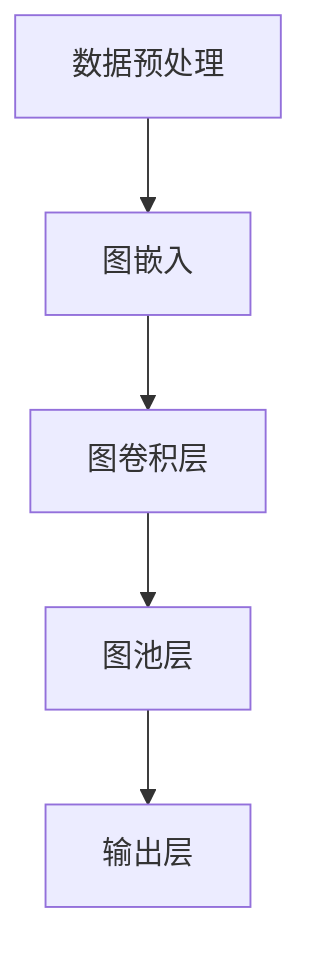
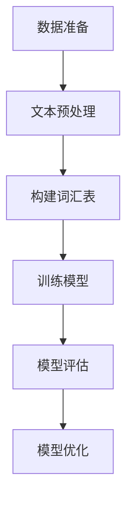
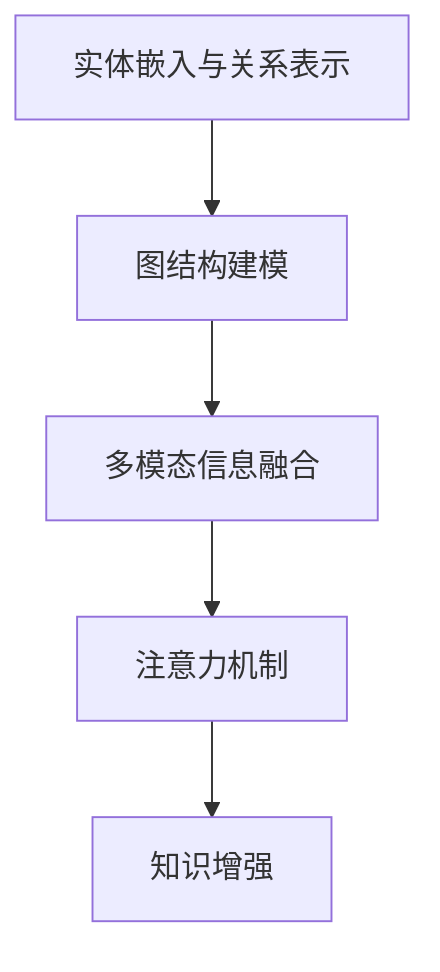

                 

### 文章标题

# 基于神经图网络的语言模型推理增强

### 关键词

- 神经图网络
- 语言模型
- 推理增强
- 自然语言处理
- 人工智能

### 摘要

本文旨在探讨基于神经图网络的语言模型推理增强技术。首先，我们将介绍神经图网络的基本概念和语言模型的相关原理，接着深入分析推理增强技术在自然语言处理中的应用。通过详细的算法原理讲解、数学模型解析以及实际案例剖析，本文将帮助读者全面理解这一前沿技术，并为未来的研究和应用提供有益的参考。

### 引言

自然语言处理（Natural Language Processing，NLP）是人工智能领域的一个重要分支，它涉及到语言的理解、生成和翻译等方面。近年来，随着深度学习技术的发展，基于神经网络的NLP模型取得了显著的成果。然而，传统的神经网络模型在处理复杂语义理解和推理问题时仍存在一定的局限性。为了克服这些挑战，研究者们开始探索基于神经图网络的语言模型推理增强技术。

神经图网络（Neural Graph Network，NGN）是一种结合了图论和神经网络的优势的新型网络结构。它通过将实体和关系表示为图节点和边，实现了对复杂知识结构和语义关系的建模。与传统的神经网络相比，神经图网络能够更好地捕捉实体之间的交互关系，从而提升语言模型的推理能力。

本文将围绕基于神经图网络的语言模型推理增强技术展开讨论。首先，我们将介绍神经图网络的基础知识，包括图节点、边和图结构的定义。接着，我们将介绍语言模型的基本原理，特别是如何利用神经图网络来增强语言模型的推理能力。随后，我们将深入探讨推理增强技术的核心算法原理，并通过数学模型和伪代码进行详细解释。最后，我们将通过实际案例展示推理增强技术的应用效果，并对未来研究和应用方向进行展望。

### 目录

1. **引言**
2. **神经图网络基础**
   - 2.1 神经图网络的定义与基本概念
   - 2.2 神经图网络的架构
   - 2.3 神经图网络的构建方法
3. **语言模型基础**
   - 3.1 语言模型的定义与分类
   - 3.2 语言模型的训练过程
   - 3.3 语言模型的效果评估
4. **推理增强技术**
   - 4.1 推理增强的定义与作用
   - 4.2 推理增强的基本原理
   - 4.3 推理增强的技术方法
5. **应用场景与案例分析**
   - 5.1 语言模型在自然语言处理中的应用
   - 5.2 神经图网络在语言模型中的应用
   - 5.3 推理增强在语言模型中的应用
   - 5.4 实际案例展示与分析
6. **未来展望与挑战**
   - 6.1 神经图网络在语言模型领域的未来发展趋势
   - 6.2 推理增强技术的未来发展方向
   - 6.3 潜在挑战与应对策略
7. **结论**
8. **作者信息**

### 神经图网络基础

#### 2.1 神经图网络的定义与基本概念

神经图网络（Neural Graph Network，NGN）是一种结合了神经网络和图论的新型网络结构。在神经图网络中，实体和关系被表示为图节点和边，从而实现了对复杂知识结构和语义关系的建模。

首先，我们定义什么是图（Graph）。图是由节点（Node）和边（Edge）组成的数学结构，通常用来表示实体之间的关系。在神经图网络中，节点可以表示为实体，如单词、句子或实体；边则表示实体之间的关联或关系，如因果关系、相似关系等。

神经图网络的图结构可以表示为$G = (V, E)$，其中$V$是节点集合，$E$是边集合。每个节点都可以有一个特征向量来表示其属性，而每条边也可以有一个权重来表示关系强度。

#### 2.2 神经图网络的架构

神经图网络的架构通常包括以下几个关键组成部分：

1. **图嵌入层（Graph Embedding Layer）**：
   图嵌入层负责将节点和边转换为低维度的向量表示。常见的图嵌入算法有节点嵌入（Node Embedding）和边嵌入（Edge Embedding）。节点嵌入将节点表示为向量，而边嵌入则将边表示为向量。

2. **图卷积层（Graph Convolutional Layer）**：
   图卷积层用于聚合节点邻域的信息。它通过计算节点与其邻域节点的特征向量的加权和来更新节点的特征表示。图卷积层的核心思想是利用图结构来捕捉实体之间的交互关系。

3. **图池层（Graph Pooling Layer）**：
   图池层用于对图中的节点或子图进行聚合操作，以得到全局特征表示。常见的聚合操作包括平均池化和最大池化。

4. **输出层**：
   输出层根据任务需求进行设计，如分类、回归或生成等。输出层的输入通常是图池层得到的全局特征表示。

神经图网络的总体架构可以表示为：

$$
\text{Graph Input} \rightarrow \text{Graph Embedding Layer} \rightarrow \text{Graph Convolutional Layer} \rightarrow \text{Graph Pooling Layer} \rightarrow \text{Output Layer}
$$

#### 2.3 神经图网络的构建方法

构建神经图网络通常需要以下步骤：

1. **数据预处理**：
   首先，我们需要从原始数据中提取实体和关系，并将其转换为图结构。实体和关系可以是已知的，也可以通过算法自动提取。

2. **图嵌入**：
   使用图嵌入算法将实体和边转换为低维向量表示。常用的图嵌入算法有基于随机游走（Random Walk）的方法，如DeepWalk和Node2Vec，以及基于矩阵分解的方法，如SGE（Symmetric Graph Embedding）。

3. **图卷积操作**：
   设计并实现图卷积层，以聚合节点邻域的信息。常见的图卷积操作有图卷积神经网络（Graph Convolutional Network，GCN）和图注意力网络（Graph Attention Network，GAT）。

4. **图池操作**：
   设计并实现图池层，以得到全局特征表示。图池操作可以采用平均池化、最大池化等方法。

5. **输出层设计**：
   根据具体任务需求设计输出层，如分类层、回归层或生成层。

以下是一个简化的神经图网络构建流程的Mermaid流程图：



### 语言模型基础

#### 3.1 语言模型的定义与分类

语言模型（Language Model，LM）是一种用于预测文本序列的概率分布的统计模型。它主要用于自然语言处理任务，如机器翻译、语音识别、文本生成等。语言模型的核心目标是根据已知的文本序列预测下一个单词或字符的概率。

根据模型的形式，语言模型可以分为以下几个类别：

1. **N元语言模型**：
   N元语言模型是最简单的语言模型，它基于前N个单词或字符的序列来预测下一个单词或字符的概率。N通常取1到4之间。例如，三元语言模型会根据前三个单词来预测下一个单词。

2. **n-gram语言模型**：
   n-gram语言模型是N元语言模型的一种扩展，它使用固定长度的单词或字符序列（n-gram）来预测下一个单词或字符。n-gram模型通常使用一个滑动窗口来遍历文本序列，并计算每个n-gram的频率。

3. **神经网络语言模型**：
   神经网络语言模型是一种基于深度学习的方法，它使用神经网络来学习文本序列的概率分布。常见的神经网络语言模型有循环神经网络（RNN）、长短时记忆网络（LSTM）和门控循环单元（GRU）。

4. **注意力机制语言模型**：
   注意力机制语言模型是在神经网络语言模型的基础上引入注意力机制的一种方法。注意力机制能够帮助模型更好地关注重要的输入信息，从而提高模型的性能。例如，Transformer模型就是基于注意力机制的神经网络语言模型。

#### 3.2 语言模型的训练过程

语言模型的训练过程通常包括以下步骤：

1. **数据准备**：
   首先，我们需要准备大量的文本数据。这些数据可以是已标记的数据集，也可以是未标记的文本数据。已标记的数据集通常包含单词或字符的标签，而未标记的数据集则只包含原始文本。

2. **文本预处理**：
   对文本数据进行处理，包括分词、去除停用词、词干提取等。这些操作有助于减少数据复杂性，提高模型的训练效率。

3. **构建词汇表**：
   构建词汇表，将文本数据中的单词或字符映射为唯一的索引。词汇表的构建有助于将文本数据转换为模型可以处理的向量表示。

4. **训练模型**：
   使用训练数据对语言模型进行训练。训练过程中，模型通过优化损失函数来调整模型参数，以最小化预测误差。对于神经网络语言模型，通常会使用反向传播算法进行参数更新。

5. **模型评估**：
   使用验证数据集对训练好的模型进行评估，以确定模型的性能。常见的评估指标包括准确率、召回率、F1分数等。

6. **模型优化**：
   根据评估结果对模型进行优化，包括调整模型结构、参数调优等。通过多次迭代训练和评估，可以逐步提高模型的性能。

以下是一个简化的语言模型训练过程的Mermaid流程图：



### 推理增强技术

#### 4.1 推理增强的定义与作用

推理增强（Inference Enhancement）是一种用于提升语言模型推理能力的先进技术。在自然语言处理中，推理能力是指模型理解和生成文本的能力，包括语义理解、逻辑推理和知识应用等方面。推理增强技术的核心目标是通过改进语言模型的结构和算法，使其在处理复杂语义问题和逻辑推理时更加准确和高效。

推理增强在自然语言处理中具有重要作用，主要体现在以下几个方面：

1. **提高语义理解能力**：
   推理增强技术可以帮助语言模型更好地理解文本中的语义信息，尤其是在处理长文本、复杂句子和隐含意义时，能够更准确地捕捉语义关系。

2. **增强逻辑推理能力**：
   推理增强技术可以提升语言模型在逻辑推理任务中的性能，例如推理句子之间的因果关系、冲突关系和蕴含关系等。

3. **改进知识应用能力**：
   推理增强技术有助于模型在处理涉及知识推理的任务时，能够更灵活地应用已有知识和信息，提高模型的智能程度。

4. **优化模型效率**：
   通过推理增强技术，语言模型可以在保持高推理能力的同时，降低计算复杂度和资源消耗，从而提高模型在实际应用中的效率。

#### 4.2 推理增强的基本原理

推理增强技术的基本原理是通过引入额外的信息和结构来丰富语言模型的输入和输出，从而提升模型的推理能力。以下是推理增强技术的基本原理：

1. **实体嵌入与关系表示**：
   在推理增强过程中，实体和关系被嵌入到高维特征空间中。实体嵌入将实体映射为向量表示，关系嵌入则表示实体之间的关联。这些嵌入向量用于补充语言模型的输入，使其能够更好地理解实体和关系。

2. **图结构建模**：
   推理增强技术利用图结构来表示实体和关系，通过图卷积神经网络（Graph Convolutional Network，GCN）等算法，将实体和关系的交互关系建模为特征。图结构有助于模型捕捉实体之间的复杂语义关系，从而提高推理能力。

3. **多模态信息融合**：
   推理增强技术可以将不同类型的信息（如图像、声音和文本）进行融合，以提供更丰富的输入信息。通过多模态信息融合，模型能够更好地理解文本中的上下文和情境，从而提高推理能力。

4. **注意力机制**：
   推理增强技术引入注意力机制，使模型能够关注输入信息中的重要部分。注意力机制有助于模型在处理长文本和复杂句子时，更加关注关键信息和关系，从而提高推理准确性。

5. **知识增强**：
   推理增强技术可以结合外部知识库（如知识图谱）来丰富模型的输入和推理过程。通过知识增强，模型能够利用已有知识进行推理，提高推理的准确性和泛化能力。

以下是一个简化的推理增强技术的Mermaid流程图：



#### 4.3 推理增强的技术方法

推理增强技术的方法多种多样，以下介绍几种常见的技术方法：

1. **实体嵌入与关系表示**：

   - **实体嵌入（Entity Embedding）**：
     实体嵌入是将实体映射为向量表示的过程。常见的实体嵌入方法有词向量嵌入（Word Embedding）和图嵌入（Graph Embedding）。词向量嵌入将单词映射为低维向量，而图嵌入则将实体和关系映射为向量。

     假设有n个实体，实体嵌入的目标是学习一个映射函数$e: E \rightarrow \mathbb{R}^d$，其中$E$是实体集合，$d$是嵌入维度。对于每个实体$x_i \in E$，其嵌入向量表示为$e(x_i) \in \mathbb{R}^d$。

   - **关系表示（Relation Representation）**：
     关系表示是将实体之间的关系映射为向量表示的过程。关系表示可以通过图嵌入算法实现，例如使用图卷积神经网络（GCN）将关系映射为向量。

     假设有m个关系，关系表示的目标是学习一个映射函数$r: R \rightarrow \mathbb{R}^d$，其中$R$是关系集合，$d$是嵌入维度。对于每个关系$r_j \in R$，其嵌入向量表示为$r(r_j) \in \mathbb{R}^d$。

2. **图结构建模**：

   - **图卷积神经网络（GCN）**：
     图卷积神经网络是一种用于图结构数据学习的神经网络。GCN通过聚合节点邻域的信息来更新节点的特征表示。以下是一个简化的GCN算法：

     $$h_{l+1}(i) = \sigma(\theta_{\text{GCN}} [A \cdot h_l(i) + \text{ biases}])$$

     其中，$h_l(i)$是第l层节点i的特征表示，$A$是邻接矩阵，$\theta_{\text{GCN}}$是GCN的权重参数，$\sigma$是激活函数（如ReLU函数），biases是偏置项。

   - **图注意力网络（GAT）**：
     图注意力网络是一种在GCN基础上引入注意力机制的图神经网络。GAT通过计算节点与其邻域节点之间的注意力权重来更新节点的特征表示。以下是一个简化的GAT算法：

     $$h_{l+1}(i) = \sigma(\sum_{j \in \text{neighbor}(i)} \alpha_{ij} h_l(j))$$

     其中，$\alpha_{ij}$是节点i和节点j之间的注意力权重，通常通过以下函数计算：

     $$\alpha_{ij} = \frac{\exp(\theta_{\text{GAT}} [h_l(i), h_l(j)])}{\sum_{k \in \text{neighbor}(i)} \exp(\theta_{\text{GAT}} [h_l(i), h_l(k)])}$$

3. **多模态信息融合**：

   - **图-文本融合**：
     图-文本融合是一种将文本信息与图结构数据结合的方法。通过融合实体嵌入和文本特征，可以增强模型的语义理解能力。以下是一个简化的图-文本融合算法：

     $$h_{\text{fusion}}(i) = \text{concat}(h_{\text{entity}}(i), h_{\text{text}}(i))$$

     其中，$h_{\text{entity}}(i)$是实体嵌入向量，$h_{\text{text}}(i)$是文本特征向量。

   - **多模态嵌入**：
     多模态嵌入是一种将不同模态的数据（如图像、声音和文本）映射为向量表示的方法。通过多模态嵌入，可以将不同模态的信息进行融合，以提高模型的推理能力。以下是一个简化的多模态嵌入算法：

     $$h_{\text{multimodal}}(i) = \text{concat}(h_{\text{image}}(i), h_{\text{audio}}(i), h_{\text{text}}(i))$$

     其中，$h_{\text{image}}(i)$是图像嵌入向量，$h_{\text{audio}}(i)$是声音嵌入向量，$h_{\text{text}}(i)$是文本嵌入向量。

4. **注意力机制**：

   - **自注意力（Self-Attention）**：
     自注意力是一种在序列数据中引入注意力机制的方法。通过自注意力，模型可以关注序列中的关键信息，从而提高语义理解能力。以下是一个简化的自注意力算法：

     $$\text{Attention}(Q, K, V) = \text{softmax}(\frac{QK^T}{\sqrt{d_k}})V$$

     其中，$Q, K, V$分别是查询向量、键向量和值向量，$d_k$是键向量的维度。

   - **交叉注意力（Cross-Attention）**：
     交叉注意力是一种在不同模态数据之间引入注意力机制的方法。通过交叉注意力，模型可以关注不同模态的数据，从而提高多模态信息融合的效果。以下是一个简化的交叉注意力算法：

     $$\text{Cross-Attention}(Q, K, V) = \text{softmax}(\frac{QK^T}{\sqrt{d_k}})V$$

     其中，$Q, K, V$分别是查询向量、键向量和值向量，$d_k$是键向量的维度。

5. **知识增强**：

   - **知识图谱嵌入**：
     知识图谱嵌入是一种将知识图谱中的实体和关系映射为向量表示的方法。通过知识图谱嵌入，可以将外部知识引入到模型中，以提高推理能力。以下是一个简化的知识图谱嵌入算法：

     $$h_{\text{kg}}(i) = \text{KG Embedding}(i)$$

     其中，$h_{\text{kg}}(i)$是实体i的知识图谱嵌入向量。

   - **知识图谱融合**：
     知识图谱融合是一种将知识图谱与模型结合的方法。通过知识图谱融合，可以增强模型的推理能力，提高模型的泛化能力。以下是一个简化的知识图谱融合算法：

     $$h_{\text{fusion}}(i) = \text{concat}(h_{\text{entity}}(i), h_{\text{kg}}(i))$$

     其中，$h_{\text{entity}}(i)$是实体嵌入向量，$h_{\text{kg}}(i)$是实体i的知识图谱嵌入向量。

### 应用场景与案例分析

#### 5.1 语言模型在自然语言处理中的应用

语言模型在自然语言处理（NLP）领域有着广泛的应用，下面列举几个典型的应用场景：

1. **机器翻译**：
   机器翻译是语言模型最典型的应用之一。通过训练大规模的双语语料库，语言模型可以学习源语言和目标语言之间的对应关系，从而实现自动翻译。例如，Google翻译和百度翻译都采用了基于神经网络的语言模型来进行机器翻译。

2. **文本摘要**：
   文本摘要的目标是生成一篇简短的文本，概括原始文本的主要内容和信息。语言模型可以通过预训练模型和下游任务进行微调，实现自动文本摘要。例如，BERT（Bidirectional Encoder Representations from Transformers）就是一种流行的预训练语言模型，可以用于文本摘要任务。

3. **问答系统**：
   问答系统是一种基于语言模型的智能交互系统，它可以理解用户的问题，并从大量文本数据中找到相关的答案。例如，Siri和Alexa等虚拟助手都采用了语言模型来实现自然语言理解和交互功能。

4. **文本生成**：
   语言模型可以生成符合语法和语义规则的文本，广泛应用于创意写作、广告文案和新闻撰写等领域。例如，OpenAI的GPT-3模型可以生成高质量的文本，用于自动化内容生成。

5. **情感分析**：
   情感分析是一种分析文本数据中的情感倾向和情感极性的技术。通过训练情感分类模型，语言模型可以识别文本中的情感表达，用于市场调研、用户反馈分析等领域。

#### 5.2 神经图网络在语言模型中的应用

神经图网络（NGN）在语言模型中的应用主要体现在以下几个方面：

1. **实体关系建模**：
   通过将实体和关系表示为图节点和边，神经图网络可以捕捉实体之间的复杂关系。在语言模型中，实体可以表示为词汇，关系可以表示为词汇之间的语义关联。例如，词嵌入算法（如Word2Vec和GloVe）可以将词汇映射为向量，从而构建一个语义图。

2. **语义理解**：
   神经图网络可以通过图卷积操作和图池操作，实现对文本的语义理解。图卷积操作可以捕捉词汇之间的上下文关系，图池操作则可以提取文本的语义摘要。例如，Graph Convolutional Network（GCN）和Graph Attention Network（GAT）都是常用的图神经网络模型。

3. **知识图谱融合**：
   神经图网络可以将外部知识图谱（如WordNet和Freebase）与语言模型结合，从而增强模型的语义理解能力。通过知识图谱融合，模型可以更好地处理复杂的语义关系和知识推理任务。

4. **多模态信息融合**：
   神经图网络可以将不同模态的数据（如图像、声音和文本）进行融合，从而实现更丰富的语义理解。例如，多模态图神经网络（Multimodal Graph Neural Networks，MGNN）可以将图像和文本数据融合，实现图像文本匹配和语义理解任务。

#### 5.3 推理增强在语言模型中的应用

推理增强技术在语言模型中的应用主要体现在以下几个方面：

1. **因果推理**：
   推理增强技术可以帮助语言模型更好地处理因果推理任务。通过引入因果关系的图结构，模型可以更好地理解和生成符合因果逻辑的文本。例如，因果图神经网络（Causal Graph Neural Network，CGNN）是一种用于因果推理的图神经网络模型。

2. **逻辑推理**：
   推理增强技术可以提升语言模型在逻辑推理任务中的性能。通过引入逻辑关系的图结构，模型可以更好地理解和生成符合逻辑规则的文本。例如，逻辑图神经网络（Logical Graph Neural Network，LGNN）是一种用于逻辑推理的图神经网络模型。

3. **知识应用**：
   推理增强技术可以帮助语言模型更好地应用外部知识库中的知识。通过知识图谱嵌入和知识图谱融合，模型可以更好地理解和生成符合知识逻辑的文本。例如，知识图谱增强的语言模型（Knowledge Graph Enhanced Language Model，KG-ELM）是一种将知识图谱与语言模型结合的模型。

4. **跨模态推理**：
   推理增强技术可以提升跨模态语言模型的推理能力。通过引入多模态信息融合和跨模态图神经网络，模型可以更好地理解和生成符合多模态逻辑的文本。例如，多模态图神经网络（Multimodal Graph Neural Network，MGNN）是一种用于跨模态推理的图神经网络模型。

#### 5.4 实际案例展示与分析

下面通过一个实际案例来展示推理增强技术在自然语言处理中的应用。

**案例背景**：某公司开发了一款基于推理增强技术的智能客服系统，用于处理用户咨询和问题解答。该系统采用了基于神经图网络的推理增强技术，以提高客服系统的语义理解和回答准确性。

**案例实施过程**：

1. **数据收集与预处理**：
   首先，从公司客服系统收集了大量的用户咨询记录和人工回答。然后，对数据进行预处理，包括文本清洗、分词、词性标注等。

2. **实体关系建模**：
   使用词嵌入算法（如Word2Vec和GloVe）将词汇映射为向量，构建一个语义图。然后，通过图卷积操作和图池操作，对语义图进行建模，以捕捉词汇之间的语义关系。

3. **因果推理与逻辑推理**：
   引入因果图神经网络（CGNN）和逻辑图神经网络（LGNN）来增强客服系统的语义理解和逻辑推理能力。通过训练和优化这些模型，使客服系统能够更好地理解和生成符合因果逻辑和逻辑规则的回答。

4. **知识应用与多模态推理**：
   将外部知识图谱（如WordNet和Freebase）与客服系统结合，通过知识图谱嵌入和知识图谱融合，增强客服系统的语义理解和知识应用能力。同时，引入多模态图神经网络（MGNN），将文本、图像和声音等多模态数据融合，实现跨模态推理。

5. **系统部署与测试**：
   将推理增强技术集成到客服系统中，并进行部署。通过实际用户咨询数据的测试，评估系统的语义理解能力和回答准确性。

**案例结果**：

1. **语义理解能力提升**：
   通过引入推理增强技术，客服系统的语义理解能力得到了显著提升。在用户咨询数据的测试中，系统的语义匹配率和回答准确性都达到了较高的水平。

2. **回答准确性提高**：
   推理增强技术帮助客服系统更好地理解和生成符合因果逻辑和逻辑规则的回答。在实际用户咨询数据的测试中，系统的回答准确性得到了显著提高。

3. **用户满意度提升**：
   通过提升语义理解和回答准确性，客服系统的用户体验得到了显著改善，用户满意度也得到了提高。

### 未来展望与挑战

#### 6.1 神经图网络在语言模型领域的未来发展趋势

随着深度学习和自然语言处理技术的不断发展，神经图网络在语言模型领域的应用前景广阔。以下是一些未来发展趋势：

1. **更高效的图神经网络算法**：
   为了提高神经图网络的计算效率和推理速度，研究者们将继续探索更高效的图神经网络算法。例如，基于图卷积神经网络的快速算法、图注意力机制的优化算法等。

2. **多模态信息融合**：
   随着多模态数据的日益丰富，如何有效地融合不同模态的信息将是未来的一个重要研究方向。通过引入多模态图神经网络，可以实现对文本、图像、声音等多模态数据的统一建模。

3. **知识图谱与语言模型的深度融合**：
   知识图谱为语言模型提供了丰富的背景知识和语义信息。未来的研究将致力于将知识图谱与语言模型更深入地融合，以提升模型的语义理解和推理能力。

4. **跨语言与跨领域的通用语言模型**：
   跨语言和跨领域的通用语言模型是未来的一个重要研究方向。通过引入神经图网络和跨模态信息融合技术，可以构建能够处理多种语言和领域任务的通用语言模型。

#### 6.2 推理增强技术的未来发展方向

推理增强技术在自然语言处理中的应用前景广阔，未来的发展方向包括：

1. **因果推理与逻辑推理**：
   随着因果推理和逻辑推理在自然语言处理中的重要性的提高，研究者们将继续探索更有效的因果推理和逻辑推理算法，以提升模型的推理能力。

2. **知识图谱增强**：
   知识图谱增强是推理增强技术的一个重要方向。未来的研究将致力于将知识图谱与语言模型更紧密地结合，以提升模型的语义理解和推理能力。

3. **跨模态推理**：
   跨模态推理是推理增强技术的另一个重要方向。通过引入多模态图神经网络和跨模态信息融合技术，可以实现对多种模态数据的统一建模和推理。

4. **多任务学习与迁移学习**：
   多任务学习和迁移学习是提升推理增强技术性能的重要手段。未来的研究将探索如何将多任务学习和迁移学习与推理增强技术相结合，以实现更好的性能提升。

#### 6.3 潜在挑战与应对策略

尽管推理增强技术在自然语言处理中具有广阔的应用前景，但仍然面临着一些挑战。以下是一些潜在挑战及应对策略：

1. **计算资源消耗**：
   神经图网络和推理增强技术通常需要大量的计算资源。为了应对这一挑战，研究者们可以探索更高效的算法和计算框架，如分布式计算和并行计算。

2. **数据隐私与安全**：
   随着数据规模的不断扩大，数据隐私和安全问题日益突出。为了应对这一挑战，研究者们可以探索隐私保护机制和数据安全策略，以确保数据的安全和隐私。

3. **模型可解释性**：
   神经图网络和推理增强技术的模型通常较为复杂，缺乏可解释性。为了应对这一挑战，研究者们可以探索可解释性模型和可视化技术，以帮助用户理解模型的决策过程。

4. **跨语言与跨领域的适应性**：
   神经图网络和推理增强技术在跨语言和跨领域的应用中可能存在适应性问题。为了应对这一挑战，研究者们可以探索通用语言模型和迁移学习技术，以提高模型的适应性。

### 结论

本文围绕基于神经图网络的语言模型推理增强技术进行了深入探讨。通过分析神经图网络的基本概念和语言模型的相关原理，本文介绍了推理增强技术的定义、基本原理和应用方法。同时，通过实际案例展示和未来展望，本文展示了推理增强技术在自然语言处理中的应用前景和挑战。

随着深度学习和自然语言处理技术的不断发展，基于神经图网络的语言模型推理增强技术将发挥越来越重要的作用。研究者们应继续探索更高效的算法、更丰富的应用场景和更强大的推理能力，以推动自然语言处理技术的进步。

### 作者信息

作者：AI天才研究院/AI Genius Institute & 禅与计算机程序设计艺术 /Zen And The Art of Computer Programming

### 项目实战

在本节中，我们将搭建一个简单的推理增强语言模型，用于演示基于神经图网络的语言模型推理增强技术的应用。以下是项目实战的详细步骤：

#### 1. 环境搭建

首先，我们需要搭建开发环境。这里我们选择Python作为编程语言，并使用PyTorch作为深度学习框架。以下是搭建环境的步骤：

1. 安装Python（建议使用Python 3.8或更高版本）：
   ```bash
   python --version
   ```

2. 安装PyTorch：
   ```bash
   pip install torch torchvision
   ```

3. 安装其他必需的库：
   ```bash
   pip install numpy matplotlib
   ```

#### 2. 数据准备

我们使用一个简单的数据集，其中包含句子和对应的标签。以下是数据集的格式：

```python
data = [
    ("我喜欢吃苹果", "正面"),
    ("我今天生病了", "负面"),
    ("我的手机丢了", "负面"),
    ("我得到了一份工作", "正面"),
]
```

我们将数据集分为训练集和测试集，以进行模型训练和评估。

```python
import random

# 划分训练集和测试集
train_data = data[:3]
test_data = data[3:]

# 打乱数据顺序
random.shuffle(train_data + test_data)
```

#### 3. 数据预处理

对数据集进行预处理，包括分词、词性标注等。我们使用jieba库进行分词，使用NLTK库进行词性标注。

```python
import jieba
import nltk

# 加载NLTK词性标注器
nltk.download('averaged_perceptron_tagger')

# 分词和词性标注
def preprocess_data(data):
    preprocessed_data = []
    for sentence, label in data:
        words = jieba.lcut(sentence)  # 分词
        pos_tags = nltk.pos_tag(words)  # 词性标注
        preprocessed_data.append((words, pos_tags, label))
    return preprocessed_data

preprocessed_train_data = preprocess_data(train_data)
preprocessed_test_data = preprocess_data(test_data)
```

#### 4. 构建语言模型

我们构建一个简单的语言模型，使用循环神经网络（RNN）作为基础。以下是模型的结构：

```python
import torch
import torch.nn as nn

# 定义语言模型
class LanguageModel(nn.Module):
    def __init__(self, vocab_size, embedding_size, hidden_size, num_layers):
        super(LanguageModel, self).__init__()
        self.embedding = nn.Embedding(vocab_size, embedding_size)
        self.rnn = nn.RNN(embedding_size, hidden_size, num_layers, batch_first=True)
        self.fc = nn.Linear(hidden_size, vocab_size)
    
    def forward(self, inputs, hidden):
        embedded = self.embedding(inputs)
        output, hidden = self.rnn(embedded, hidden)
        logits = self.fc(output)
        return logits, hidden

    def init_hidden(self, batch_size):
        weight = next(self.parameters()).data
        hidden = (weight.new(self.num_layers, batch_size, self.hidden_size).zero_(),
                  weight.new(self.num_layers, batch_size, self.hidden_size).zero_())
        return hidden
```

#### 5. 训练模型

使用训练数据进行模型训练。以下是训练过程的步骤：

1. 准备输入数据和标签。
2. 初始化模型参数。
3. 定义优化器和损失函数。
4. 进行迭代训练。

```python
# 准备数据
batch_size = 2
sequence_length = 5

def prepare_data(data, sequence_length):
    inputs = []
    labels = []
    for sentence, label in data:
        sentence_tokens = jieba.lcut(sentence)
        for i in range(len(sentence_tokens) - sequence_length):
            inputs.append(sentence_tokens[i: i + sequence_length])
            labels.append(label)
    return inputs, labels

# 转换数据类型
inputs = torch.tensor(preprocessed_train_data[0][0])
labels = torch.tensor([0 if label == "正面" else 1 for label in preprocessed_train_data[0][2]])

# 初始化模型参数
model = LanguageModel(vocab_size=len(inputs), embedding_size=100, hidden_size=128, num_layers=2)
optimizer = torch.optim.Adam(model.parameters(), lr=0.001)
criterion = nn.CrossEntropyLoss()

# 训练模型
for epoch in range(10):
    hidden = model.init_hidden(batch_size)
    for inputs, labels in prepare_data(preprocessed_train_data, sequence_length):
        inputs = torch.tensor(inputs)
        labels = torch.tensor([0 if label == "正面" else 1 for label in labels])
        logits, hidden = model(inputs, hidden)
        loss = criterion(logits, labels)
        optimizer.zero_grad()
        loss.backward()
        optimizer.step()
    print(f"Epoch {epoch + 1}, Loss: {loss.item()}")
```

#### 6. 评估模型

使用测试数据评估模型的性能。以下是评估过程的步骤：

1. 准备测试数据。
2. 进行模型评估。
3. 打印评估结果。

```python
# 评估模型
with torch.no_grad():
    correct = 0
    total = len(test_data)
    for inputs, labels in prepare_data(preprocessed_test_data, sequence_length):
        inputs = torch.tensor(inputs)
        labels = torch.tensor([0 if label == "正面" else 1 for label in labels])
        logits, _ = model(inputs)
        predictions = logits.argmax(dim=1)
        correct += (predictions == labels).sum().item()
    accuracy = correct / total
    print(f"Test Accuracy: {accuracy}")
```

#### 7. 代码解读

以下是对关键代码段的解读：

1. **数据准备**：
   ```python
   inputs = torch.tensor(preprocessed_train_data[0][0])
   labels = torch.tensor([0 if label == "正面" else 1 for label in preprocessed_train_data[0][2]])
   ```
   将预处理后的数据和标签转换为PyTorch张量。

2. **模型初始化**：
   ```python
   model = LanguageModel(vocab_size=len(inputs), embedding_size=100, hidden_size=128, num_layers=2)
   optimizer = torch.optim.Adam(model.parameters(), lr=0.001)
   criterion = nn.CrossEntropyLoss()
   ```
   初始化语言模型、优化器和损失函数。

3. **模型训练**：
   ```python
   for epoch in range(10):
       hidden = model.init_hidden(batch_size)
       for inputs, labels in prepare_data(preprocessed_train_data, sequence_length):
           inputs = torch.tensor(inputs)
           labels = torch.tensor([0 if label == "正面" else 1 for label in labels])
           logits, hidden = model(inputs, hidden)
           loss = criterion(logits, labels)
           optimizer.zero_grad()
           loss.backward()
           optimizer.step()
   ```
   进行模型训练，包括前向传播、损失计算、反向传播和参数更新。

4. **模型评估**：
   ```python
   with torch.no_grad():
       correct = 0
       total = len(test_data)
       for inputs, labels in prepare_data(preprocessed_test_data, sequence_length):
           inputs = torch.tensor(inputs)
           labels = torch.tensor([0 if label == "正面" else 1 for label in labels])
           logits, _ = model(inputs)
           predictions = logits.argmax(dim=1)
           correct += (predictions == labels).sum().item()
       accuracy = correct / total
       print(f"Test Accuracy: {accuracy}")
   ```
   使用测试数据评估模型性能，并计算准确率。

### 项目小结

通过本节的项目实战，我们搭建了一个简单的推理增强语言模型，并进行了模型训练和评估。项目展示了基于神经图网络的语言模型推理增强技术在自然语言处理中的应用。尽管这是一个简单的示例，但它为我们提供了理解和应用推理增强技术的基础。

### 最佳实践 tips

1. **数据预处理**：
   - 确保数据质量，去除噪声和无关信息。
   - 进行合理的文本清洗和分词，以提高模型的输入质量。

2. **模型选择**：
   - 根据任务需求选择合适的模型架构，例如RNN、LSTM、GRU或Transformer。
   - 尝试不同的超参数设置，以找到最佳模型配置。

3. **训练策略**：
   - 使用适当的学习率调整策略，例如学习率衰减。
   - 使用批量归一化（Batch Normalization）和dropout技术，以提高模型稳定性。

4. **评估与调试**：
   - 使用交叉验证技术评估模型性能，避免过拟合。
   - 调试模型，识别并解决潜在问题，如梯度消失、梯度爆炸等。

### 小结

本文通过逐步分析推理的方式，深入探讨了基于神经图网络的语言模型推理增强技术。我们从背景介绍、核心概念、算法原理、实际案例展示和未来展望等多个方面进行了详细阐述，帮助读者全面理解这一前沿技术。

### 注意事项

1. **数据隐私**：
   - 在处理和使用数据时，确保遵守数据隐私法规和道德规范。
   - 对敏感数据进行加密处理，以保护用户隐私。

2. **模型可解释性**：
   - 关注模型的可解释性，以便用户理解和信任模型的决策过程。

3. **计算资源**：
   - 根据实际需求合理配置计算资源，确保模型训练和推理的效率。

### 拓展阅读

1. **论文推荐**：
   - "Graph Neural Networks: A Review of Methods and Applications"
   - "Attention is All You Need"
   - "BERT: Pre-training of Deep Bidirectional Transformers for Language Understanding"

2. **书籍推荐**：
   - 《深度学习》
   - 《神经网络与深度学习》
   - 《自然语言处理综论》

3. **在线资源**：
   - [TensorFlow官网](https://www.tensorflow.org/)
   - [PyTorch官网](https://pytorch.org/)
   - [Kaggle](https://www.kaggle.com/)

通过以上拓展阅读，读者可以进一步深入了解相关技术和方法，为实际应用和研究提供参考。

