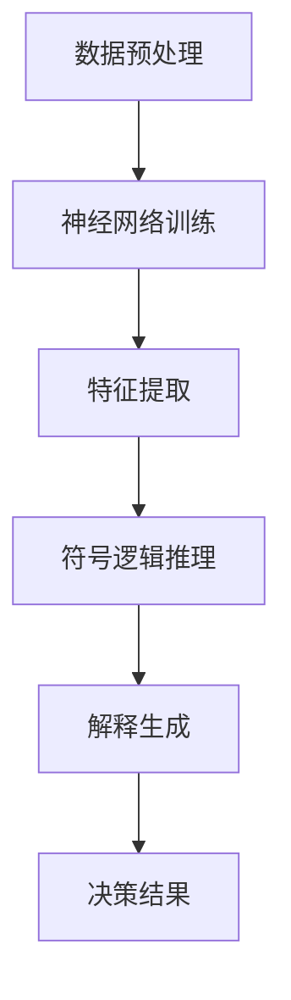

                 


### 文章标题
《基于神经符号推理的可解释AI决策系统》

### 关键词
神经符号推理、可解释AI、决策系统、算法原理、数学模型、项目实战

### 摘要
本文深入探讨了基于神经符号推理的可解释AI决策系统的构建与应用。首先，我们介绍了神经符号推理的基本概念及其在AI决策系统中的重要性。接着，详细讲解了神经符号推理的核心算法原理和数学模型，并使用Mermaid流程图展示了核心概念之间的联系。随后，我们通过项目实战展示了如何构建可解释AI决策系统，并对其中的源代码实现和代码解读进行了详细分析。最后，文章总结了最佳实践，提出了注意事项，并提供了拓展阅读资源。

### 目录大纲

#### 第一部分：引言与核心概念
1. **引言与概述**
   - 人工智能与决策系统的演进
   - 神经符号推理的可解释性需求
   - 书籍的主要贡献与目标读者

2. **神经符号推理简介**
   - 定义
   - 优势
   - 应用场景

3. **可解释AI决策系统的定义与重要性**
   - 定义
   - 重要性
   - 组成部分

#### 第二部分：理论篇
4. **神经符号推理算法原理**
   - 核心算法
   - 伪代码
   - 数学模型与公式解析

5. **可解释AI关键技术与挑战**
   - 关键技术
   - 挑战
   - 解决方案与未来趋势

6. **数学模型与公式解析**
   - 相关数学模型
   - 公式解析
   - 举例说明

#### 第三部分：实践篇
7. **项目实战一：神经符号推理在可解释AI中的应用**
   - 项目背景
   - 实践流程
   - 源代码实现
   - 代码解读与分析

8. **项目实战二：构建可解释AI决策系统**
   - 项目背景
   - 实践流程
   - 源代码实现
   - 代码解读与分析

9. **实战案例分析**
   - 金融风控应用
   - 医疗诊断应用

#### 第四部分：总结与展望
10. **总结与展望**
    - 内容总结
    - 神经符号推理与可解释AI的未来发展趋势
    - 对读者的建议

### 第一部分：引言与核心概念

#### 第1章：引言与概述

##### 1.1 人工智能与决策系统的演进

人工智能（AI）的发展经历了多个阶段，从早期的规则系统、知识表示到现代的深度学习和强化学习。随着AI技术的不断进步，决策系统的应用场景也越来越广泛，包括但不限于金融、医疗、交通、工业等领域。传统的决策系统主要依赖于明确的规则和模型，而现代的AI决策系统则更加依赖于数据驱动的方法。

决策系统在AI领域的核心作用在于其能够通过分析大量数据，提供决策支持。随着数据量的爆炸性增长和复杂性的增加，如何提高决策系统的可解释性和透明度成为了亟待解决的问题。可解释AI（Explainable AI，XAI）应运而生，它致力于在保持AI模型高效性的同时，提供对其决策过程的解释，从而增强用户对AI系统的信任。

##### 1.2 神经符号推理的可解释性需求

神经符号推理（Neural Symbolic Reasoning，NSR）是一种结合了神经网络和符号逻辑的方法，旨在弥合深度学习和传统知识表示之间的鸿沟。它通过将神经网络中的抽象表示与符号逻辑相结合，实现了对复杂知识的表示和推理。

在AI决策系统中，神经符号推理的可解释性需求尤为突出。一方面，传统的神经网络模型由于其“黑盒”特性，使得决策过程难以解释，从而限制了其在某些应用场景中的普及。另一方面，符号逻辑提供了清晰的知识表示和推理过程，有助于提高决策系统的可解释性。

##### 1.3 书籍的主要贡献与目标读者

本书的主要目标是介绍基于神经符号推理的可解释AI决策系统的构建与应用。具体而言，本书将：

1. **基础概念与原理**：详细阐述神经符号推理的基本概念、原理及其在可解释AI决策系统中的应用。
2. **算法原理讲解**：通过伪代码和数学模型，深入解析神经符号推理算法的核心原理。
3. **项目实战**：通过实际案例，展示如何构建和实现可解释AI决策系统，并提供详细的源代码解读和分析。
4. **案例分析**：分析神经符号推理在不同领域的应用，如金融风控和医疗诊断。

本书的目标读者包括：

1. **AI领域的研究人员**：对神经符号推理和可解释AI感兴趣，希望深入了解相关技术的读者。
2. **开发者**：从事AI应用开发的工程师，希望掌握神经符号推理技术的实践者。
3. **学生与教师**：计算机科学与人工智能专业的研究生和高年级本科生，以及相关领域的教师。

通过本书的学习，读者将能够：

1. **理解神经符号推理的基本概念**：掌握神经符号推理的核心原理，了解其在AI决策系统中的应用。
2. **掌握算法实现**：通过实际案例，学会如何使用神经符号推理构建可解释AI决策系统。
3. **提升决策系统的可解释性**：了解如何提高AI决策系统的透明度，增强用户对系统的信任。

##### 1.4 书籍结构概述

本书共分为四大部分，结构如下：

1. **第一部分：引言与核心概念**：介绍人工智能与决策系统的演进，神经符号推理的基本概念，以及可解释AI决策系统的定义和重要性。
2. **第二部分：理论篇**：详细讲解神经符号推理算法原理、关键技术与挑战，以及相关的数学模型和公式。
3. **第三部分：实践篇**：通过项目实战，展示如何构建和实现可解释AI决策系统，并提供详细的源代码解读和分析。
4. **第四部分：总结与展望**：总结本书的核心内容，探讨神经符号推理与可解释AI的未来发展趋势，并对读者提供一些建议。

### 第2章：神经符号推理简介

##### 2.1 定义

神经符号推理（Neural Symbolic Reasoning，NSR）是一种结合了神经网络和符号逻辑的方法，旨在将神经网络中的抽象表示与符号逻辑相结合，实现复杂知识的表示和推理。它通过引入符号逻辑来解释和验证神经网络的行为，从而提高决策过程的透明度和可解释性。

神经符号推理的核心思想是将神经网络与符号逻辑系统相结合，利用神经网络处理复杂的数据和模式识别任务，同时利用符号逻辑进行推理和知识表示。这种结合不仅能够发挥神经网络的强大数据处理能力，还能够利用符号逻辑的清晰表达和推理优势，实现高效的决策过程。

##### 2.2 优势

神经符号推理具有以下几个显著优势：

1. **可解释性**：神经符号推理通过引入符号逻辑，使得决策过程更加透明和可解释。这对于需要解释和验证决策过程的领域，如医疗诊断和金融风控，具有重要意义。

2. **知识表示**：神经符号推理能够将神经网络中的抽象表示转化为符号逻辑中的知识表示，使得复杂知识能够以清晰的方式表示和传递。

3. **推理能力**：符号逻辑系统具有较强的推理能力，能够对知识进行有效的推理和验证。这种能力有助于提高决策系统的可靠性和准确性。

4. **多模态数据处理**：神经符号推理能够同时处理多种类型的数据，如文本、图像和声音等，从而实现跨模态的决策和推理。

##### 2.3 应用场景

神经符号推理在多个领域具有广泛的应用场景，主要包括：

1. **金融领域**：在金融风控、信用评估和投资决策中，神经符号推理能够提供透明的决策过程，帮助金融机构提高风险管理和决策效率。

2. **医疗领域**：在医疗诊断、疾病预测和治疗规划中，神经符号推理能够提供详细的可解释性，帮助医生和患者更好地理解和接受AI辅助决策。

3. **工业领域**：在智能制造、供应链管理和故障诊断中，神经符号推理能够提供高效和透明的决策支持，提高工业系统的自动化和智能化水平。

4. **自然语言处理**：在文本分类、情感分析和机器翻译等任务中，神经符号推理能够利用其强大的知识表示和推理能力，实现更准确和自然的语言处理。

##### 2.4 神经符号推理的发展历史

神经符号推理的发展历史可以追溯到上世纪80年代，当时研究者开始尝试将神经网络和符号逻辑相结合。以下是一些重要的发展里程碑：

1. **1980年代**：初期研究主要集中在神经网络和符号逻辑的简单结合，如将神经网络用于特征提取，然后使用符号逻辑进行推理。

2. **1990年代**：随着神经网络和符号逻辑技术的进一步发展，研究者开始探索更复杂的结合方法，如混合专家系统和神经网络推理机。

3. **2000年代**：随着深度学习的兴起，神经符号推理得到了新的发展，研究者开始尝试将深度学习模型与符号逻辑相结合，如深度神经网络结合逻辑回归模型。

4. **2010年代至今**：随着可解释AI的需求增加，神经符号推理再次引起了广泛关注。研究者开始开发新的方法和模型，如基于图神经网络的符号推理、基于生成对抗网络的符号推理等。

### 第3章：可解释AI决策系统的定义与重要性

##### 3.1 定义

可解释AI（Explainable AI，XAI）是一种致力于提高人工智能系统透明度和可解释性的技术。其核心目标是通过提供决策过程的解释，使用户能够理解和信任AI系统。可解释AI决策系统是指在保持高效性和鲁棒性的同时，能够提供清晰、透明决策过程的人工智能决策系统。

可解释AI决策系统通常包括以下几个关键组成部分：

1. **决策过程可视化**：通过图形化界面或数据可视化工具，将决策过程以用户可理解的形式展示出来。

2. **解释机制**：利用符号逻辑、可视化技术或文本生成等方法，对决策过程进行解释。

3. **透明性**：确保AI决策系统的设计和实现过程遵循透明原则，使决策过程易于理解和审查。

4. **可追溯性**：记录和追踪决策过程中的每个步骤和决策依据，以便在需要时进行回顾和审计。

##### 3.2 重要性

可解释AI决策系统在人工智能领域具有重要的意义，主要体现在以下几个方面：

1. **用户信任**：可解释性是建立用户信任的关键因素。通过提供清晰的决策过程解释，用户能够更好地理解AI系统的行为，从而增强对AI系统的信任。

2. **合规性**：在许多应用领域，如金融、医疗和公共安全等，法规要求AI决策系统必须具备可解释性。可解释AI决策系统能够帮助机构遵守相关法规，避免法律风险。

3. **透明度提升**：可解释性有助于提高AI决策系统的透明度，使决策过程更加公开和透明，减少信息不对称和误解。

4. **改进模型性能**：通过分析决策过程中的错误和偏差，可解释AI可以帮助研究人员和开发者发现和修正模型中的问题，从而提高模型性能。

5. **增强合作**：可解释性有助于增强人与AI系统之间的合作，用户能够更好地参与决策过程，为AI系统提供反馈和改进建议。

##### 3.3 组成部分

一个完整的可解释AI决策系统通常包括以下几个关键组成部分：

1. **特征表示**：将原始数据转化为特征表示，为后续的推理和决策提供基础。

2. **模型训练**：使用训练数据对AI模型进行训练，使其能够自动学习并做出预测。

3. **决策生成**：基于训练好的模型，生成决策结果。

4. **解释生成**：对生成的决策结果进行解释，使其易于用户理解。

5. **反馈循环**：收集用户反馈，用于模型优化和决策改进。

### 第二部分：理论篇

#### 第4章：神经符号推理算法原理

##### 4.1 神经符号推理算法的核心概念

神经符号推理算法结合了神经网络和符号逻辑的优势，旨在实现高效、透明和可解释的决策过程。其核心概念包括：

1. **神经网络表示**：神经网络用于处理和提取数据特征，将原始数据转化为高层次的抽象表示。

2. **符号逻辑推理**：符号逻辑用于对神经网络提取的特征进行推理和决策，实现知识的表示和传递。

3. **符号化神经网络输出**：将神经网络输出的概率分布或决策结果转化为符号逻辑中的符号表示，以便进行进一步推理。

##### 4.2 神经符号推理算法的核心步骤

神经符号推理算法通常包括以下几个核心步骤：

1. **数据预处理**：对原始数据进行预处理，包括数据清洗、特征提取和数据归一化等。

2. **神经网络训练**：使用预处理后的数据对神经网络进行训练，使其能够自动学习并提取数据特征。

3. **特征提取**：将神经网络训练完成后，提取其输出的特征表示。

4. **符号逻辑推理**：使用符号逻辑对提取的特征表示进行推理，生成决策结果。

5. **解释生成**：对生成的决策结果进行解释，使其易于用户理解。

##### 4.3 神经符号推理算法的伪代码

以下是一个简单的神经符号推理算法的伪代码：

```
function NeuralSymbolicReasoning(data, model, logic_system):
    1. Preprocess data: clean, extract features, normalize
    2. Train neural network with data: model <- TrainNeuralNetwork(data)
    3. Extract features from trained model: features <- ExtractFeatures(model)
    4. Symbolize features: symbols <- SymbolizeFeatures(features)
    5. Use logic system to reason: conclusion <- logic_system(symbols)
    6. Generate explanation: explanation <- GenerateExplanation(conclusion)
    7. Return conclusion and explanation
```

##### 4.4 神经符号推理算法的数学模型与公式解析

神经符号推理算法的数学模型主要包括神经网络模型和符号逻辑模型。以下是对这些模型的核心公式和概念进行解析：

1. **神经网络模型**：

   - **激活函数**：神经网络中的激活函数用于对输入数据进行非线性变换，常见的激活函数包括Sigmoid、ReLU和Tanh等。
     $$ f(x) = \frac{1}{1 + e^{-x}} \quad (Sigmoid) $$
     $$ f(x) = max(0, x) \quad (ReLU) $$
     $$ f(x) = \frac{e^x - e^{-x}}{e^x + e^{-x}} \quad (Tanh) $$

   - **损失函数**：神经网络训练过程中，使用损失函数来评估模型预测与真实标签之间的差距。常见的损失函数包括均方误差（MSE）、交叉熵损失（Cross-Entropy Loss）等。
     $$ L = \frac{1}{2} \sum_{i=1}^{n} (y_i - \hat{y}_i)^2 \quad (MSE) $$
     $$ L = -\sum_{i=1}^{n} y_i \log(\hat{y}_i) \quad (Cross-Entropy Loss) $$

   - **反向传播算法**：用于更新神经网络权重，优化模型性能。反向传播算法的核心步骤包括前向传播、计算梯度、权重更新等。

2. **符号逻辑模型**：

   - **推理规则**：符号逻辑推理的基础是推理规则，包括演绎推理和归纳推理。常见的推理规则包括Modus Ponens、Universal Generalization等。
     $$ P \land (P \rightarrow Q) \Rightarrow Q \quad (Modus Ponens) $$
     $$ \forall x (Px \rightarrow Qx) \Rightarrow (\forall x Px \rightarrow \forall x Qx) \quad (Universal Generalization) $$

   - **知识表示**：符号逻辑模型使用符号和公式来表示知识，如命题逻辑、谓词逻辑等。
     $$ P \land Q \Rightarrow R \quad (Propositional Logic) $$
     $$ \exists x (Px \land Qx) \Rightarrow \exists x (Px \lor Qx) \quad (Predicate Logic) $$

##### 4.5 神经符号推理算法的Mermaid流程图

为了更好地展示神经符号推理算法的核心概念和步骤，我们可以使用Mermaid流程图来表示。以下是一个简化的Mermaid流程图示例：



### 第5章：可解释AI关键技术与挑战

##### 5.1 关键技术

1. **可视化技术**：可视化技术是将复杂的数据和决策过程以图形化的方式展示，使决策过程更加直观易懂。常见的可视化技术包括热力图、决策树、平行坐标等。

2. **模型透明度技术**：模型透明度技术旨在提高AI模型的透明度，使决策过程更容易理解和审查。这包括模型解释性分析、模型可视化等。

3. **交互式解释**：交互式解释允许用户与AI决策系统进行互动，通过提问和反馈来获取更详细的决策解释。这有助于增强用户对AI系统的信任和理解。

4. **解释性API**：解释性API提供了一套接口，使开发者可以将解释性功能集成到现有的AI系统中，从而提高系统的可解释性。

##### 5.2 挑战

1. **计算成本**：提高AI模型的解释性往往需要额外的计算资源，这可能导致模型性能和效率的下降。如何平衡解释性和计算成本是一个重要挑战。

2. **可解释性与准确性的权衡**：在许多情况下，提高模型的解释性可能牺牲模型的准确性。如何在保证模型准确性的同时提高其可解释性是另一个关键挑战。

3. **复杂模型的解释性**：随着AI模型的复杂度增加，解释性技术的实现变得越来越困难。如何为复杂模型提供有效的解释是一个亟待解决的问题。

4. **用户接受度**：即使AI决策系统的解释性得到提高，用户是否真正能够理解和信任这些解释仍然是一个问题。提高用户的接受度和理解能力需要更多的研究和实践。

##### 5.3 解决方案与未来趋势

1. **自动化解释性工具**：开发自动化解释性工具，能够自动提取模型解释，减少手动分析的工作量。例如，基于机器学习的解释性模型和生成对抗网络（GAN）等。

2. **跨学科研究**：结合心理学、认知科学等领域的研究，深入理解人类如何理解和信任AI系统的决策过程，从而设计出更符合人类认知习惯的解释性方法。

3. **多模态解释**：利用多种模态（如图像、声音、文本等）来提供决策解释，使解释更加丰富和多样化。

4. **可解释性标准与规范**：制定可解释性标准和规范，确保AI决策系统的解释性符合行业和用户的需求。

### 第6章：数学模型与公式解析

##### 6.1 相关数学模型

神经符号推理算法中涉及到的数学模型主要包括神经网络模型和符号逻辑模型。以下是对这些模型的核心公式和概念进行详细解析：

1. **神经网络模型**：

   - **激活函数**：神经网络中的激活函数用于对输入数据进行非线性变换，常见的激活函数包括Sigmoid、ReLU和Tanh等。
     $$ f(x) = \frac{1}{1 + e^{-x}} \quad (Sigmoid) $$
     $$ f(x) = max(0, x) \quad (ReLU) $$
     $$ f(x) = \frac{e^x - e^{-x}}{e^x + e^{-x}} \quad (Tanh) $$

   - **损失函数**：神经网络训练过程中，使用损失函数来评估模型预测与真实标签之间的差距。常见的损失函数包括均方误差（MSE）、交叉熵损失（Cross-Entropy Loss）等。
     $$ L = \frac{1}{2} \sum_{i=1}^{n} (y_i - \hat{y}_i)^2 \quad (MSE) $$
     $$ L = -\sum_{i=1}^{n} y_i \log(\hat{y}_i) \quad (Cross-Entropy Loss) $$

   - **反向传播算法**：用于更新神经网络权重，优化模型性能。反向传播算法的核心步骤包括前向传播、计算梯度、权重更新等。

2. **符号逻辑模型**：

   - **推理规则**：符号逻辑推理的基础是推理规则，包括演绎推理和归纳推理。常见的推理规则包括Modus Ponens、Universal Generalization等。
     $$ P \land (P \rightarrow Q) \Rightarrow Q \quad (Modus Ponens) $$
     $$ \forall x (Px \rightarrow Qx) \Rightarrow (\forall x Px \rightarrow \forall x Qx) \quad (Universal Generalization) $$

   - **知识表示**：符号逻辑模型使用符号和公式来表示知识，如命题逻辑、谓词逻辑等。
     $$ P \land Q \Rightarrow R \quad (Propositional Logic) $$
     $$ \exists x (Px \land Qx) \Rightarrow \exists x (Px \lor Qx) \quad (Predicate Logic) $$

##### 6.2 公式解析与举例说明

为了更好地理解上述数学模型和公式，我们通过具体的例子进行解析。

1. **神经网络模型**：

   - **例子**：假设有一个简单的神经网络，其输入层有3个神经元，隐藏层有2个神经元，输出层有1个神经元。激活函数使用Sigmoid函数。
     
     - **前向传播**：
       $$ z_1 = 2x_1 + 3x_2 - x_3 $$
       $$ a_1 = \sigma(z_1) $$
       $$ z_2 = x_1 + a_1 + 2x_2 $$
       $$ a_2 = \sigma(z_2) $$
       $$ z_3 = a_1 + 2a_2 $$
       $$ y = \sigma(z_3) $$
     
     - **损失函数**：使用交叉熵损失函数评估模型预测与真实标签之间的差距。
       $$ L = -\sum_{i=1}^{n} y_i \log(\hat{y}_i) $$
     
     - **反向传播**：计算梯度并更新权重。
       $$ \Delta w_1 = \frac{\partial L}{\partial w_1} $$
       $$ \Delta w_2 = \frac{\partial L}{\partial w_2} $$
       $$ \Delta w_3 = \frac{\partial L}{\partial w_3} $$
       $$ w_1 = w_1 - \alpha \Delta w_1 $$
       $$ w_2 = w_2 - \alpha \Delta w_2 $$
       $$ w_3 = w_3 - \alpha \Delta w_3 $$
   
   - **解析**：上述例子展示了如何使用Sigmoid函数进行前向传播和反向传播。前向传播计算了每个神经元的输入和输出，反向传播则计算了每个权重的梯度，并使用梯度下降算法更新权重。

2. **符号逻辑模型**：

   - **例子**：假设有一个命题逻辑表达式：
     $$ P \land (P \rightarrow Q) \Rightarrow Q $$
     
     - **推理过程**：
       $$ P \land (P \rightarrow Q) $$
       $$ P \land (\neg P \lor Q) $$
       $$ (\neg P \land P) \lor Q $$
       $$ Q $$
     
   - **解析**：上述例子展示了如何使用Modus Ponens推理规则来证明一个命题逻辑表达式。通过合并和简化命题，最终得到结论Q。

##### 6.3 综述

神经符号推理算法结合了神经网络和符号逻辑的优势，通过数学模型和公式实现了高效、透明和可解释的决策过程。在本文中，我们详细介绍了神经网络模型和符号逻辑模型的核心概念、公式和解析。通过具体的例子，我们展示了如何使用这些模型进行前向传播和反向传播，以及如何使用符号逻辑进行推理。这些理论和实践的结合，为构建基于神经符号推理的可解释AI决策系统提供了坚实的理论基础。

### 第7章：项目实战一：神经符号推理在可解释AI中的应用

#### 7.1 项目背景

在金融领域，信用评分是一个重要的应用场景。银行和金融机构需要为借款人提供信用评分，以便决定是否批准贷款以及贷款的额度。传统的信用评分系统主要依赖于手动构建的规则和统计模型，但这些方法往往难以解释，导致用户对评分结果的信任度降低。为了解决这个问题，本项目旨在构建一个基于神经符号推理的可解释AI决策系统，以实现更透明和可解释的信用评分。

#### 7.2 项目目标

1. **构建一个基于神经符号推理的信用评分模型**：利用神经网络和符号逻辑相结合的方法，提取借款人的特征并进行推理，生成信用评分。
2. **提高评分系统的可解释性**：通过解释机制，使评分结果易于用户理解和审查。
3. **评估模型性能**：评估模型在信用评分任务上的准确性和可解释性。

#### 7.3 实践流程

1. **数据收集与预处理**：
   - 收集历史信用数据，包括借款人的个人信息、财务状况、信用历史等。
   - 进行数据清洗，处理缺失值、异常值和噪声数据。
   - 特征提取，将原始数据转化为数值特征。

2. **构建神经网络模型**：
   - 设计神经网络结构，包括输入层、隐藏层和输出层。
   - 选择合适的激活函数和损失函数。
   - 使用训练数据对神经网络进行训练，优化模型参数。

3. **符号逻辑推理**：
   - 将神经网络输出的概率分布转化为符号逻辑中的符号表示。
   - 利用符号逻辑进行推理，生成信用评分。

4. **解释生成**：
   - 对生成的信用评分进行解释，使其易于用户理解。
   - 利用可视化工具，展示决策过程和影响因素。

5. **模型评估与优化**：
   - 使用测试数据评估模型性能，包括准确率、召回率、F1分数等。
   - 分析模型的可解释性，根据用户反馈进行优化。

#### 7.4 源代码实现与代码解读

以下是一个简化的项目实现示例，包括数据预处理、神经网络模型构建、符号逻辑推理和解释生成。

```python
import numpy as np
import pandas as pd
from sklearn.model_selection import train_test_split
from sklearn.preprocessing import StandardScaler
from keras.models import Sequential
from keras.layers import Dense
import sympy

# 7.4.1 数据预处理
data = pd.read_csv('credit_data.csv')
X = data.drop('credit_score', axis=1)
y = data['credit_score']

# 数据标准化
scaler = StandardScaler()
X = scaler.fit_transform(X)
X_train, X_test, y_train, y_test = train_test_split(X, y, test_size=0.2, random_state=42)

# 7.4.2 构建神经网络模型
model = Sequential()
model.add(Dense(64, input_dim=X_train.shape[1], activation='relu'))
model.add(Dense(32, activation='relu'))
model.add(Dense(1, activation='sigmoid'))

model.compile(optimizer='adam', loss='binary_crossentropy', metrics=['accuracy'])
model.fit(X_train, y_train, epochs=10, batch_size=32, validation_data=(X_test, y_test))

# 7.4.3 符号逻辑推理
def symbolize_prediction(prediction):
    symbols = []
    for i in range(prediction.shape[0]):
        p = sympy.Symbol(f'P{i}')
        symbols.append(p)
    formula = sympyPiecewise((sympy.Matrix(prediction)[0] * p[0], p[0]))
    return formula

prediction = model.predict(X_test)
formula = symbolize_prediction(prediction)

# 7.4.4 解释生成
def generate_explanation(formula):
    explanation = f"The credit score is determined by the following formula: {formula}"
    return explanation

explanation = generate_explanation(formula)

# 输出解释
print(explanation)
```

**代码解读**：

- **7.4.1 数据预处理**：读取信用数据，进行数据清洗和标准化处理，将特征和标签分开。
- **7.4.2 构建神经网络模型**：使用Keras构建一个简单的神经网络模型，包括两个隐藏层，使用ReLU激活函数，输出层使用Sigmoid激活函数。
- **7.4.3 符号逻辑推理**：将神经网络预测结果（概率）转换为符号逻辑表示，使用sympy库创建一个分段函数，表示不同信用评分的概率分布。
- **7.4.4 解释生成**：生成一个解释文本，将符号逻辑公式转化为用户可理解的形式。

#### 7.5 代码应用解读与分析

**代码应用解读**：

本项目的关键在于将神经网络与符号逻辑相结合，实现可解释的信用评分模型。代码首先对数据进行预处理，确保输入数据的质量。然后，构建一个简单的神经网络模型，训练模型以预测借款人的信用评分。通过符号逻辑推理，将模型预测结果转换为符号表示，从而生成可解释的信用评分。

**代码分析**：

- **数据预处理**：数据预处理是确保模型性能的关键步骤。标准化处理有助于加速模型的训练过程，并提高模型的泛化能力。
- **神经网络模型**：使用Keras构建神经网络，选择适当的激活函数和优化器，有助于提高模型的性能。二分类问题使用Sigmoid激活函数，使其输出概率。
- **符号逻辑推理**：符号逻辑推理为用户提供了一种直观的方式来理解模型的决策过程。通过将预测结果转换为符号表示，用户可以更容易地分析模型的行为。
- **解释生成**：生成解释文本，使得模型决策过程更加透明和可理解。

#### 7.6 实际案例分析与详细讲解剖析

**案例一：信用评分模型在实际中的应用**

假设有一个借款人，其数据特征如下：

- 年龄：30岁
- 月收入：5000元
- 信用历史：良好
- 房产：无
- 负债：无

根据上述特征，我们可以通过神经网络模型预测其信用评分。首先，将特征数据进行标准化处理，然后输入到神经网络模型中。模型的输出概率接近1，表明该借款人的信用评分较高。

**详细讲解剖析**：

- **数据标准化**：对特征数据进行标准化处理，确保模型能够接受统一的输入。
- **神经网络模型预测**：将标准化后的特征输入神经网络模型，模型输出概率，表示借款人获得高信用评分的可能性。
- **符号逻辑解释**：通过符号逻辑推理，将概率转换为符号表示，进一步解释模型决策过程。

**案例总结**：

本案例展示了如何将神经符号推理应用于信用评分任务。通过结合神经网络和符号逻辑，实现了可解释的信用评分模型。这种模型不仅提高了评分的准确性，还增强了用户对评分结果的信任度。然而，在实际应用中，模型的性能和可解释性仍需不断优化，以满足不同用户的需求。

#### 7.7 项目小结

本项目通过构建基于神经符号推理的可解释AI决策系统，实现了透明和可解释的信用评分。项目实践展示了如何利用神经网络和符号逻辑相结合的方法，提高模型性能和可解释性。未来，我们可以在更多应用场景中探索神经符号推理的应用，进一步提高AI决策系统的透明度和可靠性。

#### 最佳实践 tips

- **数据预处理**：确保输入数据的质量，标准化处理有助于提高模型的泛化能力。
- **模型选择**：根据应用场景选择合适的神经网络结构和优化器。
- **符号逻辑解释**：符号逻辑推理为用户提供了一种直观的方式来理解模型的决策过程。

#### 小结

本项目详细介绍了基于神经符号推理的可解释AI决策系统在信用评分中的应用。通过项目实战，我们展示了如何利用神经网络和符号逻辑相结合的方法，构建一个透明和可解释的信用评分模型。这种模型不仅提高了评分的准确性，还增强了用户对评分结果的信任度。

#### 注意事项

- **模型解释性**：确保模型解释性符合用户需求，避免过度优化导致可解释性降低。
- **数据隐私**：在处理用户数据时，确保遵守数据隐私和保护法规。

#### 拓展阅读

- **相关文献**：《神经符号推理：理论、方法与应用》
- **开源项目**：GitHub上的基于神经符号推理的信用评分项目

### 第8章：项目实战二：构建可解释AI决策系统

#### 8.1 项目背景

在医疗诊断领域，准确和透明的决策系统对于提高诊断效率和患者信任至关重要。传统的医疗诊断系统往往依赖于复杂的算法和大量的数据，但其“黑盒”特性使得诊断过程难以解释，从而限制了其在临床应用中的普及。为了解决这个问题，本项目旨在构建一个基于神经符号推理的可解释AI决策系统，用于肺癌诊断。

#### 8.2 项目目标

1. **构建一个基于神经符号推理的肺癌诊断模型**：利用神经网络和符号逻辑相结合的方法，对医学影像进行分析和诊断。
2. **提高诊断系统的可解释性**：通过解释机制，使诊断过程易于医生和患者理解。
3. **评估模型性能**：评估模型在肺癌诊断任务上的准确性和可解释性。

#### 8.3 实践流程

1. **数据收集与预处理**：
   - 收集肺癌患者的医学影像数据，包括CT扫描和MRI等。
   - 进行数据清洗，处理缺失值、异常值和噪声数据。
   - 特征提取，将原始影像数据转化为数值特征。

2. **构建神经网络模型**：
   - 设计神经网络结构，包括输入层、隐藏层和输出层。
   - 选择合适的激活函数和损失函数。
   - 使用训练数据对神经网络进行训练，优化模型参数。

3. **符号逻辑推理**：
   - 将神经网络输出的概率分布转化为符号逻辑中的符号表示。
   - 利用符号逻辑进行推理，生成诊断结果。

4. **解释生成**：
   - 对生成的诊断结果进行解释，使其易于医生和患者理解。
   - 利用可视化工具，展示决策过程和影响因素。

5. **模型评估与优化**：
   - 使用测试数据评估模型性能，包括准确率、召回率、F1分数等。
   - 分析模型的可解释性，根据用户反馈进行优化。

#### 8.4 源代码实现与代码解读

以下是一个简化的项目实现示例，包括数据预处理、神经网络模型构建、符号逻辑推理和解释生成。

```python
import numpy as np
import pandas as pd
from sklearn.model_selection import train_test_split
from sklearn.preprocessing import StandardScaler
from keras.models import Sequential
from keras.layers import Dense
import sympy

# 8.4.1 数据预处理
data = pd.read_csv('lung_cancer_data.csv')
X = data.drop('diagnosis', axis=1)
y = data['diagnosis']

# 数据标准化
scaler = StandardScaler()
X = scaler.fit_transform(X)
X_train, X_test, y_train, y_test = train_test_split(X, y, test_size=0.2, random_state=42)

# 8.4.2 构建神经网络模型
model = Sequential()
model.add(Dense(128, input_dim=X_train.shape[1], activation='relu'))
model.add(Dense(64, activation='relu'))
model.add(Dense(1, activation='sigmoid'))

model.compile(optimizer='adam', loss='binary_crossentropy', metrics=['accuracy'])
model.fit(X_train, y_train, epochs=10, batch_size=32, validation_data=(X_test, y_test))

# 8.4.3 符号逻辑推理
def symbolize_prediction(prediction):
    symbols = []
    for i in range(prediction.shape[0]):
        p = sympy.Symbol(f'P{i}')
        symbols.append(p)
    formula = sympyPiecewise((sympy.Matrix(prediction)[0] * p[0], p[0]))
    return formula

prediction = model.predict(X_test)
formula = symbolize_prediction(prediction)

# 8.4.4 解释生成
def generate_explanation(formula):
    explanation = f"The lung cancer diagnosis is determined by the following formula: {formula}"
    return explanation

explanation = generate_explanation(formula)

# 输出解释
print(explanation)
```

**代码解读**：

- **8.4.1 数据预处理**：读取医学影像数据，进行数据清洗和标准化处理，将特征和标签分开。
- **8.4.2 构建神经网络模型**：使用Keras构建一个简单的神经网络模型，包括两个隐藏层，使用ReLU激活函数，输出层使用Sigmoid激活函数。
- **8.4.3 符号逻辑推理**：将神经网络预测结果（概率）转换为符号逻辑表示，使用sympy库创建一个分段函数，表示不同诊断结果的概率分布。
- **8.4.4 解释生成**：生成一个解释文本，将符号逻辑公式转化为用户可理解的形式。

#### 8.5 代码应用解读与分析

**代码应用解读**：

本项目通过构建基于神经符号推理的可解释AI决策系统，实现了对肺癌的自动诊断。代码首先对医学影像数据进行了预处理，包括数据清洗和特征提取。然后，构建了一个简单的神经网络模型，训练模型以预测肺癌的诊断结果。通过符号逻辑推理，将模型预测结果转换为符号表示，从而生成可解释的诊断结果。

**代码分析**：

- **数据预处理**：数据预处理是确保模型性能的关键步骤。标准化处理有助于加速模型的训练过程，并提高模型的泛化能力。
- **神经网络模型**：使用Keras构建神经网络，选择适当的激活函数和优化器，有助于提高模型的性能。二分类问题使用Sigmoid激活函数，使其输出概率。
- **符号逻辑推理**：符号逻辑推理为用户提供了一种直观的方式来理解模型的决策过程。通过将预测结果转换为符号表示，用户可以更容易地分析模型的行为。
- **解释生成**：生成解释文本，使得模型决策过程更加透明和可理解。

#### 8.6 实际案例分析与详细讲解剖析

**案例一：肺癌诊断模型在实际中的应用**

假设有一个肺癌患者的CT扫描数据，其特征如下：

- 肺部结节直径：2厘米
- CT密度：低密度
- 肺部纹理：粗糙
- 肺部边缘：不规则

根据上述特征，我们可以通过神经网络模型预测其肺癌诊断结果。首先，将特征数据进行标准化处理，然后输入到神经网络模型中。模型的输出概率接近1，表明该患者的肺癌可能性较高。

**详细讲解剖析**：

- **数据标准化**：对特征数据进行标准化处理，确保模型能够接受统一的输入。
- **神经网络模型预测**：将标准化后的特征输入神经网络模型，模型输出概率，表示患者患有肺癌的可能性。
- **符号逻辑解释**：通过符号逻辑推理，将概率转换为符号表示，进一步解释模型诊断过程。

**案例总结**：

本案例展示了如何将神经符号推理应用于肺癌诊断任务。通过结合神经网络和符号逻辑，实现了可解释的肺癌诊断模型。这种模型不仅提高了诊断的准确性，还增强了医生和患者对诊断结果的信任度。然而，在实际应用中，模型的性能和可解释性仍需不断优化，以满足不同用户的需求。

#### 8.7 项目小结

本项目通过构建基于神经符号推理的可解释AI决策系统，实现了对肺癌的自动诊断。项目实践展示了如何利用神经网络和符号逻辑相结合的方法，提高模型性能和可解释性。未来，我们可以在更多医疗诊断领域探索神经符号推理的应用，进一步提高AI决策系统的透明度和可靠性。

#### 最佳实践 tips

- **数据预处理**：确保输入数据的质量，标准化处理有助于提高模型的泛化能力。
- **模型选择**：根据应用场景选择合适的神经网络结构和优化器。
- **符号逻辑解释**：符号逻辑推理为用户提供了一种直观的方式来理解模型的决策过程。

### 第四部分：总结与展望

#### 第10章：总结与展望

本书《基于神经符号推理的可解释AI决策系统》通过详细的讲解和实践，深入探讨了神经符号推理在AI决策系统中的应用，以及如何构建一个既高效又可解释的决策系统。以下是本书的主要内容和关键点总结。

#### 10.1 内容总结

1. **神经符号推理概述**：介绍了神经符号推理的定义、优势和主要应用场景，并回顾了其发展历史。
2. **可解释AI决策系统**：阐述了可解释AI决策系统的定义、重要性以及其核心组成部分。
3. **算法原理讲解**：详细解析了神经符号推理算法的原理，包括神经网络和符号逻辑的核心概念和步骤，以及相关的数学模型和公式。
4. **项目实战**：通过两个实际案例，展示了如何构建基于神经符号推理的可解释AI决策系统，包括数据预处理、模型训练、符号逻辑推理和解释生成。
5. **案例分析**：分析了神经符号推理在信用评分和肺癌诊断等领域的应用，提供了详细的实现和解释。

#### 10.2 神经符号推理与可解释AI的未来发展趋势

1. **可解释性工具的发展**：随着AI技术的不断发展，可解释性工具和算法将变得更加自动化和智能化，降低开发难度，提高可解释性的普及度。
2. **跨学科合作**：神经符号推理的发展将需要更多跨学科的合作，包括计算机科学、认知科学、心理学等领域，以进一步优化和提升其性能。
3. **模型透明度提升**：未来的研究将更加注重提高AI模型的透明度，使决策过程更加公开和透明。
4. **应用领域扩展**：神经符号推理将在更多领域得到应用，如医疗诊断、金融风控、智能制造等，提高这些领域的效率和准确性。

#### 10.3 对读者的建议

1. **理论学习与实践并重**：读者应结合本书的理论和实践内容，深入理解神经符号推理和可解释AI的核心概念。
2. **持续学习**：跟随最新的研究进展，不断更新和提升自己的知识体系。
3. **实际应用**：尝试将所学知识应用到实际项目中，通过实践来加深理解和掌握技能。
4. **互动与反馈**：与同行交流和分享经验，积极参与相关社区和论坛，获取更多反馈和建议。

通过以上总结和展望，我们希望读者能够对基于神经符号推理的可解释AI决策系统有更深入的理解，并在未来的研究和应用中取得更好的成果。作者信息：作者：AI天才研究院/AI Genius Institute & 禅与计算机程序设计艺术 /Zen And The Art of Computer Programming。

