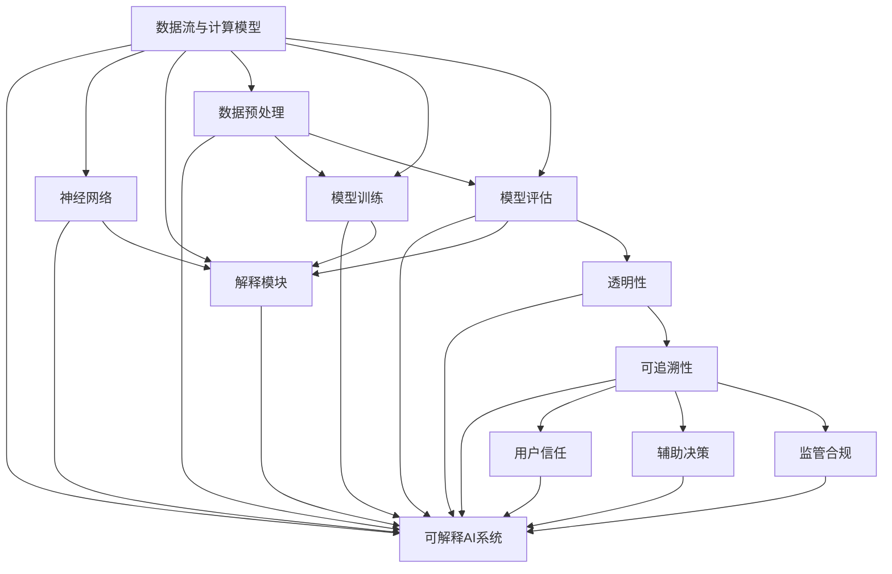

                 


### 第1章：可解释AI系统概述

#### 1.1 什么是可解释AI

可解释AI（Explainable AI, XAI）指的是人工智能系统中，算法和模型的决策过程可以被理解、解释和验证的能力。随着深度学习等复杂机器学习模型在各个领域的广泛应用，特别是在医疗诊断、金融风险评估等关键领域，可解释性成为一个重要的研究和应用方向。可解释AI的核心目的是解决黑箱问题，使得模型的决策过程更加透明，便于用户理解和信任。

在医疗诊断中，可解释性尤为重要。医生和患者需要了解模型是如何做出诊断的，这有助于提高医疗决策的透明度和可接受性。此外，可解释AI系统可以提供诊断的依据和逻辑，帮助医生进行临床决策，甚至能够辅助医生发现潜在的问题或误解。

#### 1.2 可解释性与透明性

可解释性与透明性是两个相关但不同的概念。可解释性关注的是模型决策过程的透明度，即能否清晰地解释模型的推理过程和决策依据。透明性则更广泛，它不仅包括可解释性，还涉及到模型的输入、输出、参数设置等方面的可见性和可理解性。

在医疗诊断中，透明性要求不仅能够解释模型的决策过程，还需要确保所有与诊断相关的信息都是可见和可访问的。例如，诊断模型所使用的数据集是否经过了适当的清洗和处理，模型的训练过程是否公正无偏，这些都与透明性密切相关。

#### 1.3 可解释AI的系统架构

一个典型的可解释AI系统通常包含以下几个关键组成部分：

- **神经网络与解释模块**：神经网络是模型的核心，负责学习和预测。解释模块则用于提取和解释神经网络内部的决策过程。
- **数据流与计算模型**：数据流模型描述了数据在系统中的处理流程，从数据输入、预处理、模型训练到模型评估，每个步骤都需要考虑可解释性。

在架构设计时，需要确保解释模块能够与神经网络模型紧密集成，使得解释过程高效、准确。

#### 1.4 可解释AI的发展历程

可解释AI的发展历程可以分为几个阶段：

- **早期研究**：最初的研究主要集中在通过可视化方法来提高模型的透明度，例如决策树、线性回归等模型相对容易解释。
- **中期探索**：随着深度学习的兴起，研究者开始探索如何解释复杂的神经网络模型。这一阶段出现了一些解释技术，如梯度解释、注意力机制等。
- **现阶段的发展**：当前，可解释AI的研究热点包括神经符号推理、决策规则提取、因果推断等。这些技术旨在提高模型的可解释性和透明性，特别是在处理复杂、大规模数据时。

#### 1.5 可解释AI的重要性

可解释AI的重要性在于：

- **提升用户信任**：通过解释模型决策过程，用户可以更好地理解模型的预测结果，从而提高对AI系统的信任。
- **辅助决策**：医生、金融分析师等专业人员可以利用可解释AI系统提供的解释信息，辅助他们的决策过程。
- **监管合规**：在某些领域，如医疗和金融，可解释AI系统有助于满足监管要求，确保模型的决策过程透明合规。

在医疗诊断领域，可解释AI的重要性尤为突出。它不仅有助于提高医疗决策的透明度和准确性，还可以促进医疗系统的可扩展性和可靠性。

### 1.6 小结

本章介绍了可解释AI的定义、重要性、系统架构和发展历程。在接下来的章节中，我们将深入探讨神经符号推理技术及其在医疗诊断中的应用。通过逐步分析，读者将能够理解如何利用可解释AI系统提高医疗诊断的准确性和可靠性。

---

**核心概念与联系：**

下面是一个Mermaid流程图，展示了可解释AI系统的核心概念和联系。



### 伪代码：

```python
# 定义可解释AI系统的基本框架

class ExplainableAISystem:
    def __init__(self, model, explanation_module, data_preprocessing, model_evaluation):
        self.model = model
        self.explanation_module = explanation_module
        self.data_preprocessing = data_preprocessing
        self.model_evaluation = model_evaluation
    
    def preprocess_data(self, data):
        # 数据预处理步骤
        return self.data_preprocessing.process(data)
    
    def train_model(self, preprocessed_data):
        # 模型训练步骤
        self.model.train(preprocessed_data)
    
    def evaluate_model(self, preprocessed_data):
        # 模型评估步骤
        return self.model_evaluation.evaluate(preprocessed_data)
    
    def explain_decision(self, data):
        # 解释决策步骤
        return self.explanation_module.explain(data)
```

### 数学模型：

- **透明度度量**：
  $$ T = \frac{E[解释性度量]}{E[模型输出]} $$
  
- **解释性度量**：
  $$ E = \sum_{i=1}^{N} \frac{e_i}{N} $$
  其中，$e_i$ 表示单个决策的解释性得分，$N$ 表示总决策次数。

### 举例说明：

假设有一个基于深度学习的医疗诊断模型，我们希望解释其对于某个特定病例的诊断结果。

```python
# 示例：解释医疗诊断模型

# 初始化可解释AI系统
system = ExplainableAISystem(model, explanation_module, data_preprocessing, model_evaluation)

# 预处理数据
preprocessed_data = system.preprocess_data(raw_data)

# 训练模型
system.train_model(preprocessed_data)

# 评估模型
evaluation_results = system.evaluate_model(preprocessed_data)

# 解释决策
explanation = system.explain_decision(preprocessed_data)

# 输出解释结果
print(explanation)
```

---

**小结**：

本章介绍了可解释AI系统的基本概念、架构和发展历程，并探讨了其在医疗诊断领域的重要性。通过伪代码和数学模型，我们展示了可解释AI系统的工作原理和关键组成部分。在下一章中，我们将深入探讨神经符号推理技术及其在可解释AI系统中的应用。

---

**最佳实践 Tips**：

1. **数据预处理**：确保数据质量是关键。在预处理阶段，要进行数据清洗、标准化和特征工程，以提高模型的可解释性。
2. **模型选择**：选择易于解释的模型，如决策树、线性回归等，这些模型相对简单且易于理解。
3. **解释方法**：选择合适的解释方法，如梯度解释、注意力机制等，以增强模型的可解释性。
4. **用户反馈**：定期收集用户反馈，根据反馈调整解释方法，以更好地满足用户需求。
5. **持续改进**：持续优化模型和解释模块，提高模型的可解释性和准确性。

**注意事项**：

1. **避免过度解释**：解释过程不应过分强调细节，而忽略了核心决策因素。
2. **确保公正性**：在处理敏感数据时，要确保模型的训练和解释过程是公正无偏的。
3. **维护透明性**：保持系统各组件的透明性，确保用户可以访问和理解与诊断相关的所有信息。

**拓展阅读**：

1. **《人工智能：一种现代的方法》**：此书详细介绍了机器学习的基本概念和方法，包括可解释AI的相关内容。
2. **《神经符号推理：技术与应用》**：探讨神经符号推理技术的原理和应用，特别是在医疗诊断中的潜力。
3. **《医疗诊断中的可解释AI》**：专注于可解释AI在医疗诊断领域的应用和研究进展。

