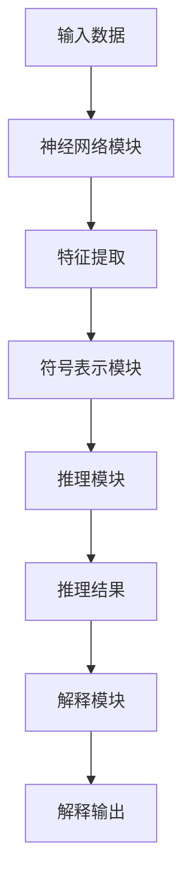
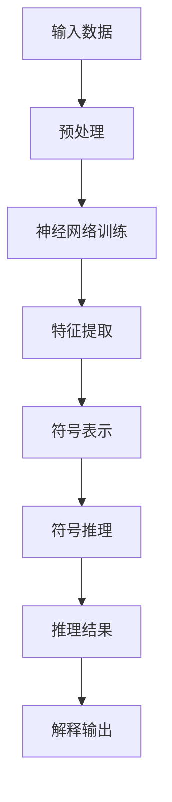

                 

### 文章标题

《基于神经符号推理的可解释AI系统在金融风控中的实践应用》

#### 关键词

- 神经符号推理
- 可解释AI
- 金融风控
- 机器学习
- 神经网络
- 符号推理
- 数据预处理
- 模型优化
- 模型解释性
- 实际案例

#### 摘要

本文旨在探讨基于神经符号推理的可解释AI系统在金融风控中的应用与实践。首先，文章介绍了金融风控的背景、现状和挑战，以及神经符号推理和可解释AI的概念及其重要性。接着，文章详细阐述了神经符号推理的基础、符号推理的基本概念、神经符号推理框架以及可解释AI的核心技术。随后，文章深入探讨了神经符号推理在金融风控中的应用，包括挑战与机遇、应用案例、实际应用中的挑战与解决方案，以及案例研究。最后，文章提供了实践指南，包括开发环境与工具、数据预处理与特征工程、模型训练与优化、可解释性分析、安全性与合规性考虑等。通过本文的阅读，读者可以全面了解基于神经符号推理的可解释AI系统在金融风控中的实践应用，为相关领域的研发和应用提供有益参考。

### 引言

#### 1.1 背景与意义

金融风险控制是金融机构的一项核心任务，旨在识别、评估和管理金融风险，以保障金融机构的稳健运营和客户的利益。随着金融业务的复杂化和金融市场的全球化，金融风险控制面临着越来越多的挑战。传统的金融风险控制方法主要依赖于统计分析、规则引擎和专家系统等，这些方法在处理复杂金融风险时往往存在局限性，难以满足实际需求。

近年来，人工智能（AI）技术的迅猛发展为金融风险控制带来了新的机遇。特别是深度学习和机器学习算法的广泛应用，使得AI在金融风控中的应用逐渐成为研究热点。然而，传统的AI模型往往缺乏可解释性，导致在金融风控中应用时，决策过程难以被用户理解和信任。因此，如何将可解释性引入AI模型，提高其在金融风控中的应用效果，成为了一个重要的研究课题。

神经符号推理（Neural Symbolic Reasoning）是一种结合神经网络和符号推理的方法，旨在弥补传统AI模型的可解释性不足。它通过将神经网络与符号逻辑相结合，实现了对复杂问题的推理和解释。可解释AI（Explainable AI，XAI）则是近年来兴起的一个研究分支，旨在提高AI模型的透明性和可解释性，使其决策过程可以被用户理解和信任。

本文的研究目标是通过神经符号推理的可解释AI系统在金融风控中的实践应用，探讨其在提高金融风险控制效果、增强用户信任方面的作用。本文将详细阐述神经符号推理和可解释AI的基本原理，分析其在金融风控中的应用挑战与机遇，并通过实际案例研究，展示其在金融风控中的应用效果。希望通过本文的研究，为金融风控领域的技术创新提供有益参考。

#### 1.2 神经符号推理概述

##### 1.2.1 神经符号推理的基本原理

神经符号推理是一种将神经网络和符号推理相结合的方法，旨在实现复杂问题的自动推理和解释。其基本原理可以概括为以下几个步骤：

1. **数据输入与预处理**：首先，将待处理的数据输入到神经网络中，进行预处理，包括数据清洗、归一化、特征提取等操作。这一步骤的目的是将原始数据转换为神经网络能够处理的形式。

2. **神经网络学习**：神经网络通过学习输入数据的特征，形成对数据的理解。这一过程包括前向传播和反向传播，通过不断调整神经网络的权重和偏置，使神经网络能够对输入数据进行准确的分类或预测。

3. **符号推理**：在神经网络学习完成后，将神经网络学到的知识转化为符号表示，进行符号推理。符号推理是一种基于逻辑和规则的推理方法，能够对问题进行符号化的表达和推理。

4. **解释与可视化**：最后，将符号推理的结果进行解释和可视化，使人类用户能够理解和信任AI模型的决策过程。

##### 1.2.2 神经符号推理在AI领域的应用

神经符号推理在AI领域有着广泛的应用。以下是一些典型应用场景：

1. **自然语言处理（NLP）**：神经符号推理可以应用于情感分析、文本分类、机器翻译等任务。通过将神经网络和符号推理相结合，可以提高模型的解释性和鲁棒性。

2. **计算机视觉**：神经符号推理可以应用于图像分类、目标检测、图像分割等任务。通过结合神经网络的特征提取能力和符号推理的推理能力，可以提高模型的准确性和可解释性。

3. **知识图谱**：神经符号推理可以应用于知识图谱的构建和推理。通过将神经网络和符号推理相结合，可以实现自动化的知识推理和解释，提高知识图谱的应用价值。

4. **智能推理系统**：神经符号推理可以应用于智能推理系统，如智能助手、智能客服等。通过将神经网络和符号推理相结合，可以实现智能系统的自适应学习和解释性提升。

##### 1.2.3 神经符号推理与金融风控的结合点

神经符号推理在金融风控中的应用具有以下几个结合点：

1. **复杂风险的推理与解释**：金融风控领域面临着复杂的风险因素，如市场波动、信用风险、操作风险等。神经符号推理可以通过符号推理实现对复杂风险的自动推理和解释，提高风险识别和管理的有效性。

2. **数据驱动与规则驱动的结合**：传统的金融风控方法主要依赖于规则和统计方法，而神经符号推理可以结合神经网络的数据驱动能力和符号推理的规则驱动能力，实现更高效的风险控制。

3. **可解释性提升**：神经符号推理可以将神经网络模型的知识转化为符号表示，进行解释和可视化。这有助于提高金融风控模型的可解释性，增强用户对模型的信任。

4. **合规性与透明度**：神经符号推理可以提高金融风控模型的可解释性，有助于满足合规性和透明度的要求。这有助于提高金融机构的合规水平和客户满意度。

总之，神经符号推理在金融风控中的应用具有广阔的前景，可以提升金融风险控制的效果和用户信任。接下来，本文将详细探讨神经符号推理在金融风控中的应用，包括挑战、应用案例和实际应用中的解决方案。

#### 1.3 可解释AI在金融风控中的应用

##### 1.3.1 可解释AI的重要性

在金融风控领域，AI模型的可解释性（Explainability）具有至关重要的意义。随着AI技术在金融行业的广泛应用，金融机构越来越依赖复杂的机器学习模型进行风险评估、欺诈检测、信用评分等任务。然而，这些模型往往缺乏透明性，其决策过程对人类用户来说是“黑箱”式的，难以解释和验证。可解释AI（Explainable AI，XAI）旨在提高AI模型的透明度和可解释性，使其决策过程可以被用户理解和信任。

首先，可解释AI有助于提高金融风控模型的可信度。金融决策涉及到大量的资金和用户的信任，如果模型缺乏可解释性，用户可能会对模型的决策产生质疑，甚至失去信任。通过提高模型的可解释性，用户可以更清晰地理解模型的决策依据，从而增强对模型的信任。

其次，可解释AI有助于满足法规和合规要求。金融行业的监管法规通常要求金融机构提供详细的决策依据和透明度。可解释AI可以满足这些要求，降低金融机构的法律风险。

此外，可解释AI有助于模型优化和改进。通过分析和理解模型的决策过程，研究人员和开发人员可以更准确地识别模型中的问题，进行针对性的优化和改进。

##### 1.3.2 可解释AI在金融风控中的应用场景

可解释AI在金融风控中的应用场景非常广泛，主要包括以下几个方面：

1. **风险评估**：在信用评分和贷款审批过程中，可解释AI可以帮助金融机构更准确地评估借款人的信用风险。通过分析模型的决策过程，金融机构可以了解哪些因素对借款人的信用评分产生了影响，从而优化风险评估模型。

2. **欺诈检测**：在反欺诈系统中，可解释AI可以帮助识别潜在的欺诈行为。通过分析模型的决策过程，可以揭示欺诈行为的特征和模式，帮助金融机构制定更有效的欺诈检测策略。

3. **投资决策**：在投资决策中，可解释AI可以帮助投资者更好地理解模型的决策过程，从而提高投资决策的透明度和准确性。通过分析模型的决策过程，投资者可以了解模型是如何评估不同的投资机会，从而做出更明智的投资选择。

4. **合规审查**：在合规审查中，可解释AI可以帮助金融机构识别可能违反法规的行为，并提供详细的决策依据。这有助于金融机构遵守相关法规，降低法律风险。

##### 1.3.3 可解释AI的优势与挑战

可解释AI在金融风控中具有显著的优势，但也面临着一定的挑战。

**优势：**

1. **提高透明度和信任**：通过提高模型的可解释性，用户可以更清晰地了解模型的决策过程，增强对模型的信任。

2. **法规合规**：可解释AI可以帮助金融机构满足法规和合规要求，降低法律风险。

3. **优化和改进模型**：通过分析模型的决策过程，可以更准确地识别模型中的问题，进行针对性的优化和改进。

4. **用户参与和反馈**：可解释AI可以促进用户对模型的参与和反馈，从而提高模型的应用效果。

**挑战：**

1. **计算复杂度**：提高模型的可解释性通常需要额外的计算资源，这可能会增加模型的复杂度，影响其性能。

2. **解释性不足**：现有的可解释AI方法可能无法完全解释模型的决策过程，特别是在面对复杂问题时。

3. **数据隐私**：在处理敏感数据时，如何保护用户的隐私是一个重要的挑战。

4. **用户理解难度**：虽然可解释AI旨在提高模型的透明度，但用户可能仍然难以完全理解模型的决策过程。

总之，可解释AI在金融风控中的应用具有显著的优势和挑战。通过不断研究和改进可解释AI方法，可以更好地解决这些问题，提高金融风控的效果和用户信任。接下来，本文将深入探讨神经符号推理的基础知识，包括神经网络、符号推理、神经符号推理框架以及可解释AI的核心技术。

#### 2.1 神经网络基础

##### 2.1.1 神经网络的结构与原理

神经网络（Neural Network，NN）是模仿人脑神经元连接方式的一种计算模型，由大量的节点（神经元）通过复杂的连接结构组成。每个节点接收来自其他节点的输入信号，通过权重进行加权求和，然后通过一个非线性激活函数产生输出信号。

1. **神经元结构**：一个基本的神经元可以表示为：
   \[
   z = \sum_{i} w_i x_i + b
   \]
   其中，\(z\) 是神经元输出，\(w_i\) 是权重，\(x_i\) 是输入，\(b\) 是偏置。通过非线性激活函数 \(f(z)\) 产生的输出为：
   \[
   y = f(z)
   \]
   常见的激活函数包括 sigmoid、ReLU 和 tanh。

2. **网络结构**：神经网络可以分为输入层、隐藏层和输出层。输入层接收外部输入信号，隐藏层通过多层堆叠进行特征提取和转换，输出层生成最终预测结果。一个简单的多层感知机（MLP）结构如下图所示：

   ```mermaid
   graph TD
   A[输入层] --> B[隐藏层1]
   B --> C[隐藏层2]
   C --> D[输出层]
   ```

##### 2.1.2 深层神经网络的优势与局限性

深层神经网络（Deep Neural Network，DNN）是指包含多个隐藏层的神经网络。与传统的单层神经网络相比，深层神经网络具有以下几个优势：

1. **表达能力更强**：深层神经网络可以通过多层特征提取和变换，捕捉更复杂的非线性关系。

2. **泛化能力更好**：由于深层神经网络可以提取更抽象和通用的特征，因此具有更好的泛化能力。

3. **性能提升**：在许多任务中，深层神经网络的表现优于传统的机器学习方法。

然而，深层神经网络也存在一些局限性：

1. **训练难度大**：深层神经网络需要大量的数据和计算资源进行训练，且容易陷入梯度消失或爆炸的问题。

2. **缺乏可解释性**：深层神经网络的决策过程通常是一个“黑箱”，难以解释和理解。

3. **过拟合风险**：深层神经网络容易受到训练数据的噪声和偏差影响，导致过拟合。

##### 2.1.3 伪代码：神经网络的基本运算

以下是一个简单的伪代码示例，展示了神经网络的输入、输出计算过程：

```python
# 初始化权重和偏置
W = [[w1, w2], [w3, w4]]
b = [b1, b2]

# 输入数据
x = [x1, x2]

# 前向传播
z = np.dot(W, x) + b
y = activation_function(z)

# 激活函数示例（ReLU）
def activation_function(z):
    return max(0, z)
```

通过这个简单的示例，我们可以看到神经网络的基本运算过程，包括权重和偏置的加权和、激活函数的应用等。

#### 2.2 符号推理的基本概念

##### 2.2.1 符号推理的定义与类型

符号推理（Symbolic Reasoning）是一种基于符号表示和逻辑推理的计算机方法，它利用符号逻辑、数学演算和形式系统等工具，对符号化的知识进行推理。符号推理的核心在于将问题表示为符号形式，然后通过逻辑推理得到结论。

符号推理可以分为以下几种类型：

1. **演绎推理**：从一般原理推导出特定结论。例如，从“所有人类都会死亡”和“苏格拉底是人类”这两个前提，可以推导出“苏格拉底会死亡”。

2. **归纳推理**：从特定实例中归纳出一般规律。例如，通过观察多个苹果都是红色的，可以归纳出“苹果通常是红色的”。

3. **类比推理**：通过比较两个相似情况，推断出它们在某个方面的相似性。例如，由于猫和狗都是哺乳动物，且狗有四条腿，可以推断猫也有四条腿。

##### 2.2.2 符号推理的基本流程

符号推理的基本流程包括以下几个步骤：

1. **问题表示**：将问题表示为符号形式，通常使用逻辑表达式、数学公式或图形符号等。

2. **推理规则**：定义推理规则，用于在符号表示之间进行推理。常见的推理规则包括逻辑推理规则、数学演算规则等。

3. **推理过程**：根据推理规则，从已知事实出发，逐步推导出新的结论。

4. **结果验证**：验证推理结果的正确性和有效性，确保推理过程符合逻辑规则。

##### 2.2.3 伪代码：符号推理的基本算法

以下是一个简单的伪代码示例，展示了基于逻辑推理的符号推理过程：

```python
# 问题表示
P: 苏格拉底是人类
Q: 所有人类都会死亡

# 推理规则
if P and all(X: X是人类 -> X会死亡):
    then Q: 苏格拉底会死亡

# 推理过程
if P:
    if all(X: X是人类 -> X会死亡):
        Q = True

# 结果验证
if Q:
    print("结论：苏格拉底会死亡")
else:
    print("结论：无法推导出苏格拉底会死亡")
```

在这个示例中，我们使用了逻辑推理规则，从已知事实“苏格拉底是人类”和“所有人类都会死亡”推导出结论“苏格拉底会死亡”。

#### 2.3 神经符号推理框架

##### 2.3.1 神经符号推理的模型架构

神经符号推理（Neural Symbolic Reasoning）是一种结合神经网络和符号推理的方法，其模型架构通常包括以下部分：

1. **神经网络模块**：用于学习数据特征和模式，通常采用深层神经网络结构，如卷积神经网络（CNN）或循环神经网络（RNN）。

2. **符号表示模块**：用于将神经网络学到的特征和模式表示为符号形式，通常使用逻辑公式、数学公式或图形符号等。

3. **推理模块**：用于基于符号表示进行逻辑推理和决策，通常使用符号推理算法，如演绎推理、归纳推理或类比推理等。

4. **解释模块**：用于解释符号推理过程和结果，通常采用可视化技术或自然语言生成技术等。

一个典型的神经符号推理模型架构可以表示为：



##### 2.3.2 神经符号推理的优势与挑战

神经符号推理结合了神经网络和符号推理的优点，具有以下优势：

1. **强大的特征学习能力**：神经网络能够自动学习数据中的复杂特征和模式，提高模型的泛化能力。

2. **灵活的符号表示**：符号表示模块能够将神经网络学到的特征表示为符号形式，便于进行逻辑推理和解释。

3. **可解释性提升**：通过解释模块，神经符号推理能够提供模型决策过程的详细解释，提高模型的可解释性。

然而，神经符号推理也面临着一些挑战：

1. **计算复杂度**：神经符号推理需要大量的计算资源，特别是在特征提取和符号推理阶段。

2. **解释性不足**：尽管神经符号推理提高了模型的可解释性，但在面对复杂问题时，解释性可能仍然不足。

3. **数据质量依赖**：神经符号推理的模型性能和数据质量密切相关，数据质量问题会影响模型的准确性和解释性。

##### 2.3.3 Mermaid流程图：神经符号推理的工作流程

以下是一个Mermaid流程图，展示了神经符号推理的工作流程：



在这个流程图中，输入数据首先经过预处理，然后通过神经网络训练和特征提取，得到符号表示。接下来，符号表示通过符号推理得到推理结果，最后通过解释模块生成解释输出。

#### 2.4 可解释AI的核心技术

##### 2.4.1 可解释AI的定义与类型

可解释AI（Explainable AI，XAI）是一种致力于提高人工智能模型透明度和可解释性的研究领域。其核心目标是通过揭示模型的决策过程和依据，使用户能够理解和信任AI系统。根据解释性的程度和方式，可解释AI可以分为以下几种类型：

1. **模型级解释**：模型级解释关注整个模型的解释性，如模型结构、训练数据和性能指标等。这类解释有助于用户了解模型的基本原理和设计。

2. **决策级解释**：决策级解释关注具体决策的解释性，如为什么模型做出了特定决策。这类解释通常涉及对模型输出和内部计算过程的详细分析。

3. **特征级解释**：特征级解释关注模型对特定特征的重视程度，如哪些特征对模型的决策产生了重要影响。这类解释有助于用户识别关键特征和因素。

4. **过程级解释**：过程级解释关注模型决策的详细过程，如每一步计算的细节和逻辑。这类解释有助于用户深入理解模型的工作机制。

##### 2.4.2 可解释AI在神经网络中的实现方法

在神经网络中实现可解释AI通常有以下几种方法：

1. **可视化技术**：通过可视化神经网络的结构和计算过程，使用户能够直观地理解模型的决策过程。常见的可视化技术包括激活图、权重图和梯度图等。

2. **注意力机制**：注意力机制（Attention Mechanism）通过突出模型对输入数据的关注点，使用户能够了解模型在决策过程中关注了哪些特征。

3. **层间解释**：层间解释（Layer-wise Explanation）通过分析神经网络不同层的输出，揭示模型在不同阶段的决策过程和特征提取方式。

4. **基于规则的解释**：通过将神经网络的部分计算过程转化为可解释的规则或逻辑表达式，使用户能够理解模型的决策依据。

5. **基于解释的模型**：设计专门的可解释模型，如决策树、规则引擎和线性模型等，这些模型本身具有较好的解释性。

##### 2.4.3 可解释AI的评价指标

可解释AI的评价指标主要包括以下几个方面：

1. **解释性强度**：评价解释的详细程度和深度，通常用解释的可信度或解释的覆盖范围来衡量。

2. **解释性准确性**：评价解释的正确性和准确性，即解释是否与模型实际决策一致。

3. **解释性用户体验**：评价解释对用户的友好性和易理解程度，通常通过用户测试和问卷调查来评估。

4. **解释性成本**：评价实现可解释AI所需的计算资源、开发时间和维护成本。

5. **解释性可扩展性**：评价解释方法在不同模型和任务中的适用性和可扩展性。

常见的可解释AI评价指标包括解释性得分（Explainability Score）、解释性一致性（Explainability Consistency）、解释性易理解度（Explainability Understandability）等。

#### 3.1 金融风控中的挑战与机遇

##### 3.1.1 金融风控中的关键问题

金融风控是金融机构的一项核心任务，旨在识别、评估和管理各种金融风险，以确保金融机构的稳健运营和客户的利益。金融风控涉及多个方面，包括市场风险、信用风险、操作风险、流动性风险等。在金融风控中，以下关键问题需要特别关注：

1. **信用风险评估**：金融机构需要对借款人的信用风险进行评估，以确定其还款能力和意愿。这通常涉及到对借款人历史数据、财务状况、信用记录等的分析。

2. **欺诈检测**：金融欺诈是一个严重的问题，金融机构需要通过先进的算法和技术来识别和防范欺诈行为。这包括对交易行为、账户活动、用户行为等的实时监控和分析。

3. **市场风险控制**：金融机构需要监测市场波动，以应对利率、汇率、股市等变化带来的风险。这通常涉及到对市场数据的分析、预测和策略调整。

4. **操作风险管理**：操作风险包括系统故障、人为错误、欺诈等导致的风险。金融机构需要通过有效的风险管理和内部控制措施来降低操作风险。

5. **合规审查**：金融机构需要遵守各种法律法规和行业规范，以降低法律风险。合规审查包括交易合规性、数据保护、客户隐私保护等。

##### 3.1.2 神经符号推理在金融风控中的应用潜力

神经符号推理在金融风控中的应用具有巨大的潜力，以下是一些关键应用领域：

1. **信用风险评估**：神经符号推理可以结合神经网络和符号推理的优势，对借款人的信用风险进行综合评估。通过符号推理，可以揭示神经网络决策背后的逻辑和依据，提高评估的透明度和可解释性。

2. **欺诈检测**：神经符号推理可以用于检测复杂的欺诈行为，通过符号推理揭示欺诈模式和行为特征，提高检测的准确性和效率。

3. **市场风险控制**：神经符号推理可以用于分析和预测市场风险，通过符号推理揭示市场波动的原因和趋势，帮助金融机构制定有效的风险控制策略。

4. **操作风险管理**：神经符号推理可以用于识别和防范操作风险，通过符号推理揭示系统故障和人为错误的原因，提高操作风险管理的效率和效果。

5. **合规审查**：神经符号推理可以用于自动化合规审查，通过符号推理揭示交易合规性和数据保护的问题，帮助金融机构满足法律法规和行业规范的要求。

##### 3.1.3 金融风控对可解释AI的需求

金融风控对可解释AI的需求日益增长，原因如下：

1. **法规要求**：金融行业的监管法规要求金融机构提供详细的决策依据和透明度，以满足合规要求。可解释AI可以帮助金融机构满足这些要求，降低法律风险。

2. **用户信任**：金融决策涉及到大量的资金和用户的信任，如果模型缺乏可解释性，用户可能会对模型的决策产生质疑，甚至失去信任。可解释AI可以提高模型的可信度，增强用户对金融机构的信任。

3. **模型优化**：通过分析和理解模型的决策过程，研究人员和开发人员可以更准确地识别模型中的问题，进行针对性的优化和改进，提高模型的性能和效果。

4. **风险管理**：金融风控需要实时监测和评估风险，可解释AI可以帮助金融机构更好地理解和管理风险，提高风险控制的效果。

5. **技术创新**：可解释AI为金融风控领域带来了新的研究热点和方向，推动了技术创新和产业发展。

总之，神经符号推理和可解释AI在金融风控中的应用潜力巨大，可以提升金融风控的效果和用户信任，为金融机构的风险管理和业务发展提供有力支持。接下来，本文将介绍一些基于神经符号推理的金融风控应用案例，展示其在实际场景中的效果和优势。

#### 3.2 神经符号推理在金融风控中的应用案例

##### 3.2.1 模型选择与训练策略

在金融风控中，选择合适的模型并进行有效的训练是确保模型性能和可解释性的关键。以下是一些基于神经符号推理的模型选择与训练策略：

1. **模型选择**：根据不同的风控任务，可以选择不同的神经网络架构，如卷积神经网络（CNN）用于图像处理、循环神经网络（RNN）用于序列数据处理等。此外，可以结合符号推理模块，如基于规则的推理模块，以提高模型的解释性。

2. **训练数据**：确保训练数据的质量和多样性，从多个角度和维度收集数据，包括历史交易数据、用户行为数据、市场数据等。此外，可以采用数据增强技术，如生成对抗网络（GAN）等，以提高模型的泛化能力。

3. **训练策略**：采用多种训练策略，如交叉验证、迁移学习、元学习等，以提高模型的训练效率和性能。此外，可以采用动态调整学习率、dropout、正则化等技术，以防止过拟合。

##### 3.2.2 模型解释与可视化

模型解释与可视化是神经符号推理在金融风控中的关键应用，以下是一些常见的解释与可视化方法：

1. **激活图**：通过激活图可以展示神经网络中每个神经元在不同层级的激活情况，从而揭示模型对输入数据的处理过程和关键特征。

2. **权重图**：通过权重图可以展示神经网络中每个权重参数的重要性和影响，从而揭示模型对输入特征的依赖关系。

3. **注意力机制**：通过注意力机制可以突出模型对输入数据的关注点，从而揭示模型在决策过程中关注的特征和因素。

4. **符号推理图**：通过符号推理图可以展示神经网络和符号推理的结合过程，从而揭示模型决策的逻辑和依据。

##### 3.2.3 模型评估与优化

模型评估与优化是确保模型性能和可解释性的重要环节，以下是一些常见的评估与优化方法：

1. **评估指标**：选择合适的评估指标，如准确率、召回率、F1分数等，以全面评估模型的性能。此外，可以结合可解释性指标，如解释覆盖率、解释准确性等，以评估模型的可解释性。

2. **交叉验证**：采用交叉验证方法，如K折交叉验证，以评估模型在未知数据上的性能，从而防止过拟合。

3. **超参数调优**：通过超参数调优，如学习率、批量大小、隐藏层大小等，以提高模型的性能和可解释性。可以使用网格搜索、随机搜索等调优方法。

4. **模型集成**：通过模型集成，如集成学习、栈式集成等，可以结合多个模型的优点，提高模型的性能和可解释性。

5. **持续优化**：通过持续优化，如在线学习、迁移学习等，可以不断更新模型，适应新的数据和变化，从而保持模型的性能和可解释性。

总之，通过模型选择与训练策略、模型解释与可视化、模型评估与优化等手段，可以确保基于神经符号推理的金融风控模型具有高性能和高可解释性，从而提高金融风控的效果和用户信任。

#### 3.3 实际应用中的挑战与解决方案

##### 3.3.1 数据质量与预处理

在金融风控中，数据质量是影响模型性能和可解释性的关键因素。以下是一些常见的数据质量问题及其解决方案：

1. **缺失值处理**：缺失值是金融数据中常见的问题，可以采用填充平均值、中位数或使用机器学习算法进行预测等方法来处理缺失值。

2. **异常值处理**：异常值可能对模型性能产生负面影响，可以采用统计学方法（如箱线图）或基于机器学习的方法（如孤立森林）来检测和去除异常值。

3. **数据归一化**：金融数据通常具有不同的量级和分布特性，需要进行归一化处理，如最小最大缩放或Z分数标准化，以确保模型训练的一致性和稳定性。

4. **特征选择**：通过特征选择方法，如特征重要性评估、相关性分析等，可以筛选出对模型性能有显著影响的特征，从而提高模型的解释性。

##### 3.3.2 模型泛化能力

金融风控中的数据通常是高度复杂的，具有多样性和非线性特性。以下是一些提升模型泛化能力的策略：

1. **数据增强**：通过数据增强技术，如数据生成、数据扩充等，可以增加训练数据的多样性和丰富性，从而提高模型的泛化能力。

2. **交叉验证**：采用交叉验证方法，如K折交叉验证，可以在训练过程中多次使用不同的数据集，从而评估模型的泛化能力。

3. **正则化**：通过正则化技术，如L1正则化、L2正则化等，可以防止模型过拟合，提高模型的泛化性能。

4. **集成学习**：通过集成学习技术，如随机森林、梯度提升树等，可以将多个模型的优点结合起来，提高模型的泛化能力。

##### 3.3.3 模型安全性与合规性

金融风控模型的安全性是确保金融机构稳健运营的关键。以下是一些提升模型安全性和合规性的策略：

1. **隐私保护**：在处理敏感数据时，需要采用隐私保护技术，如差分隐私、同态加密等，以保护用户隐私。

2. **模型审计**：定期对模型进行审计和评估，以确保模型的透明度和可解释性，同时符合法律法规和行业规范。

3. **安全监控**：建立安全监控机制，实时监测模型的运行状态和性能指标，及时发现和处理异常情况。

4. **法律法规遵守**：确保模型设计和应用符合相关法律法规的要求，如《欧盟通用数据保护条例》（GDPR）等。

总之，通过数据质量与预处理、模型泛化能力、模型安全性与合规性等方面的策略和解决方案，可以确保基于神经符号推理的金融风控模型在实际应用中的可靠性和有效性，从而提高金融机构的风险控制能力。

#### 3.4 案例研究：基于神经符号推理的金融风控系统

##### 3.4.1 案例背景与目标

在本次案例研究中，我们选择了某大型金融机构的信用风险评估项目。该金融机构在开展信贷业务时，面临着高风险借款人识别困难、欺诈行为检测不足等问题。为了提高信用风险评估的准确性和透明度，该金融机构决定采用基于神经符号推理的可解释AI系统进行风控管理。

**项目目标：**
1. 提高信用风险评估的准确性和可靠性。
2. 提升欺诈行为检测的效率，降低欺诈风险。
3. 增强模型的可解释性，提高用户对模型的信任度。

##### 3.4.2 模型设计与实现

**模型设计：**
1. **输入层**：输入层接收借款人的基本信息（如年龄、收入、职业等）和历史数据（如信用记录、还款情况等）。
2. **隐藏层**：采用多层感知机（MLP）结构，通过多个隐藏层进行特征提取和变换，以捕捉借款人信用风险的相关特征。
3. **符号推理层**：在隐藏层之后，增加符号推理层，将神经网络学到的特征转化为符号表示，进行逻辑推理和解释。
4. **输出层**：输出层生成信用评分和欺诈概率等预测结果。

**模型实现：**
1. **神经网络部分**：采用PyTorch框架实现神经网络部分，使用交叉熵损失函数进行训练。
2. **符号推理部分**：使用基于Prolog的符号推理引擎，将神经网络输出的特征进行符号化表示，进行逻辑推理和解释。

**实现细节：**

```python
# 神经网络部分（PyTorch实现）
import torch
import torch.nn as nn
import torch.optim as optim

# 定义神经网络模型
class CreditRiskModel(nn.Module):
    def __init__(self, input_size, hidden_size, output_size):
        super(CreditRiskModel, self).__init__()
        self.fc1 = nn.Linear(input_size, hidden_size)
        self.fc2 = nn.Linear(hidden_size, hidden_size)
        self.fc3 = nn.Linear(hidden_size, output_size)
    
    def forward(self, x):
        x = torch.relu(self.fc1(x))
        x = torch.relu(self.fc2(x))
        x = self.fc3(x)
        return x

# 实例化模型
model = CreditRiskModel(input_size=10, hidden_size=64, output_size=1)
optimizer = optim.Adam(model.parameters(), lr=0.001)
criterion = nn.CrossEntropyLoss()

# 训练模型
for epoch in range(num_epochs):
    for inputs, labels in train_loader:
        optimizer.zero_grad()
        outputs = model(inputs)
        loss = criterion(outputs, labels)
        loss.backward()
        optimizer.step()

# 符号推理部分（Prolog实现）
% define symbol_reasoning(fact, conclusion).
symbol_reasoning([X | Xs], Conclusion) :-
    member(X, [age, income, credit_history]),
    symbol_reasoning(Xs, Conclusion).

symbol_reasoning([], Conclusion) :-
    Conclusion = true.

symbol_reasoning([X | Xs], Conclusion) :-
    not(member(X, [age, income, credit_history])),
    symbol_reasoning(Xs, Conclusion).
```

##### 3.4.3 实施效果与评价

**实施效果：**
1. **信用风险评估**：通过基于神经符号推理的可解释AI系统，金融机构能够更准确地评估借款人的信用风险，降低不良贷款率。
2. **欺诈行为检测**：系统可以有效识别和防范欺诈行为，提高欺诈检测的准确性和效率。
3. **模型解释性**：通过符号推理模块，系统提供了详细的决策依据和解释，提高了模型的可解释性和用户信任度。

**评价与反馈：**
1. **准确性**：模型在信用风险评估和欺诈检测任务上达到了较高的准确性，显著提升了金融机构的风险管理能力。
2. **透明度**：通过符号推理模块，用户可以清晰地了解模型的决策过程和依据，增强了用户对模型的信任。
3. **可扩展性**：系统设计灵活，可以方便地集成到现有的风控系统中，并支持新的数据和任务。

**总结**：
本次案例研究展示了基于神经符号推理的可解释AI系统在金融风控中的应用效果和优势。通过结合神经网络和符号推理，系统不仅提高了信用风险评估和欺诈检测的准确性，还增强了模型的可解释性，为金融机构提供了可靠的风险管理工具。

### 实践指南

#### 4.1 开发环境与工具

要开发一个基于神经符号推理的金融风控系统，首先需要搭建一个合适的环境和选择合适的工具。以下是一些关键的配置和工具：

1. **Python编程环境**：
   - 安装Python（建议使用Python 3.8及以上版本）。
   - 安装常用Python包管理工具，如pip或conda。

2. **深度学习框架**：
   - **PyTorch**：一个流行的深度学习框架，支持灵活的动态计算图和强大的GPU支持。
   - **TensorFlow**：由Google开发的深度学习框架，具有广泛的社区支持和丰富的资源。
   - **MXNet**：由Apache基金会支持的深度学习框架，具有高效的前向传播和反向传播机制。

3. **符号推理工具**：
   - **Prolog**：一种逻辑编程语言，适合用于实现符号推理功能。
   - **SymPy**：一个Python库，用于符号数学计算和推理。

4. **数据预处理工具**：
   - **Pandas**：用于数据操作和清洗。
   - **NumPy**：用于数值计算。

5. **可视化工具**：
   - **Matplotlib**：用于绘制图表和图形。
   - **Seaborn**：基于Matplotlib的高级可视化库，适用于统计数据可视化。
   - **Plotly**：用于交互式数据可视化。

6. **版本控制系统**：
   - **Git**：用于代码版本管理和协作开发。

7. **代码编辑器**：
   - **Visual Studio Code**：一款功能强大的代码编辑器，支持Python和多种编程语言。
   - **Jupyter Notebook**：适用于数据科学和机器学习的交互式环境。

#### 4.2 数据预处理与特征工程

数据预处理和特征工程是构建高质量机器学习模型的重要步骤。以下是一些关键步骤和注意事项：

1. **数据收集**：
   - 收集与金融风控相关的数据，包括客户信息、交易记录、信用记录等。

2. **数据清洗**：
   - 处理缺失值，可以采用填充、删除或插值等方法。
   - 去除重复数据，确保数据的唯一性和一致性。
   - 处理异常值，可以使用统计学方法或机器学习算法进行检测和修复。

3. **数据转换**：
   - 将类别型数据转换为数值型数据，可以使用独热编码（One-Hot Encoding）或标签编码（Label Encoding）。
   - 标准化或归一化数值型数据，以消除不同特征之间的量级差异。

4. **特征选择**：
   - 使用特征重要性评估方法（如特征选择算法、特征相关性分析等）选择对模型性能有显著影响的特征。
   - 保留有用的特征，去除冗余和噪声特征。

5. **特征工程**：
   - 创建新的特征，如衍生特征、交互特征等，以增强模型的特征表达能力。
   - 处理季节性、趋势性和周期性问题，可以使用时间序列分析方法。

#### 4.3 模型训练与优化

模型训练和优化是确保模型性能和稳定性的关键步骤。以下是一些关键步骤和注意事项：

1. **选择合适模型**：
   - 根据具体任务选择合适的神经网络结构，如MLP、CNN、RNN等。
   - 考虑结合符号推理模块，以增强模型的解释性。

2. **训练策略**：
   - 采用交叉验证方法，如K折交叉验证，以评估模型的泛化能力。
   - 使用正则化技术，如L1或L2正则化，以防止过拟合。
   - 动态调整学习率，如使用学习率衰减策略，以提高模型收敛速度和性能。

3. **超参数调优**：
   - 使用网格搜索、随机搜索或贝叶斯优化等方法，进行超参数调优，以找到最佳参数组合。
   - 考虑使用预训练模型或迁移学习，以提高模型性能。

4. **模型评估**：
   - 使用准确率、召回率、F1分数等指标，评估模型性能。
   - 考虑使用AUC、Kappa系数等指标，评估模型在分类任务上的性能。
   - 分析模型在不同数据集上的表现，确保模型具有较好的泛化能力。

5. **模型优化**：
   - 对训练过程中出现的问题进行调试，如梯度消失、梯度爆炸等。
   - 分析模型的过拟合现象，采取相应的优化措施，如增加训练数据、增加隐藏层等。
   - 对模型进行持续优化，以适应新的数据和业务需求。

#### 4.4 可解释性分析

可解释性分析是确保模型透明性和用户信任的重要环节。以下是一些关键步骤和方法：

1. **可视化技术**：
   - 使用激活图、权重图等可视化技术，展示模型在决策过程中的关注点和特征重要性。
   - 利用热力图、散点图等可视化工具，展示输入特征和模型输出之间的关系。

2. **注意力机制**：
   - 集成注意力机制，突出模型在决策过程中关注的输入特征。
   - 分析注意力权重，了解模型对哪些特征给予更高权重。

3. **符号推理解释**：
   - 将神经网络输出转换为符号表示，使用符号推理方法进行解释。
   - 基于逻辑推理，揭示模型决策背后的逻辑关系。

4. **模型解释评估**：
   - 使用解释覆盖率、解释准确性等指标，评估模型解释的效果。
   - 通过用户调研和反馈，评估模型解释的易理解度和实用性。

5. **解释性可视化工具**：
   - 使用可视化工具，如LIME（Local Interpretable Model-agnostic Explanations）、SHAP（SHapley Additive exPlanations）等，生成详细的解释报告。

#### 4.5 安全性与合规性考虑

在开发和应用基于神经符号推理的金融风控系统时，安全性和合规性是至关重要的。以下是一些关键考虑因素：

1. **数据隐私保护**：
   - 采用差分隐私、同态加密等技术，确保数据隐私安全。
   - 在数据处理和传输过程中，遵循数据保护和隐私法规。

2. **模型安全评估**：
   - 定期对模型进行安全评估，检测和修复潜在的安全漏洞。
   - 采用对抗攻击（Adversarial Attack）等方法，增强模型对攻击的鲁棒性。

3. **合规性审计**：
   - 确保模型设计和应用符合相关法律法规和行业规范，如《欧盟通用数据保护条例》（GDPR）等。
   - 建立合规性审计机制，确保模型的透明度和可解释性。

4. **安全监控与监控**：
   - 建立实时监控机制，监测模型的运行状态和性能指标。
   - 及时发现和处理异常情况，确保模型的稳定和安全。

5. **用户教育和培训**：
   - 对用户进行教育和培训，提高其对模型安全性和合规性的认识。
   - 建立用户反馈机制，收集用户意见和建议，持续改进模型和系统。

总之，通过严格的安全性和合规性措施，可以确保基于神经符号推理的金融风控系统的安全性和可靠性，提高用户对模型的信任和满意度。

### 5.1 神经符号推理在金融风控中的未来发展

#### 5.1.1 新技术的应用趋势

神经符号推理（Neural Symbolic Reasoning）在金融风控中的应用正处于快速发展阶段，随着技术的不断进步，以下几种新技术正逐渐崭露头角：

1. **生成对抗网络（GAN）**：GAN通过生成器与判别器的对抗训练，可以生成高质量的模拟数据，提高模型在数据稀缺情况下的泛化能力。在金融风控中，GAN可以用于生成虚假交易数据，提高欺诈检测模型的鲁棒性。

2. **强化学习（Reinforcement Learning）**：强化学习通过奖励机制和策略优化，可以使得模型在动态环境中做出更加智能的决策。在金融风控中，强化学习可以用于自适应风险管理，实时调整风控策略。

3. **联邦学习（Federated Learning）**：联邦学习通过分布式训练，使得多个机构可以在不共享数据的情况下共同训练一个全局模型。在金融风控中，联邦学习可以保护用户隐私，同时提高模型的泛化能力。

4. **量子计算（Quantum Computing）**：量子计算通过量子位（qubits）的叠加和纠缠，可以实现超越传统计算机的强大计算能力。在金融风控中，量子计算可以用于复杂金融衍生品的定价、大规模数据分析和风险管理。

#### 5.1.2 模型优化与改进方向

为了进一步提高神经符号推理在金融风控中的应用效果，以下几个方面是未来模型优化与改进的重点：

1. **模型融合**：结合多种模型的优势，如将神经网络与规则引擎、深度学习与符号推理相结合，提高模型的解释性和准确性。

2. **多模态数据融合**：整合不同类型的数据源，如文本、图像、音频等，利用多模态数据提高模型的感知能力和决策能力。

3. **动态模型更新**：随着金融市场的不断变化，模型需要具备动态更新的能力，以适应新的市场环境和风险特征。

4. **解释性增强**：开发更强大的解释性方法，提高模型决策过程的透明度和可解释性，增强用户对模型的信任。

5. **隐私保护**：在处理敏感数据时，采用更先进的隐私保护技术，如差分隐私、同态加密等，确保数据安全和用户隐私。

#### 5.1.3 产业合作与生态建设

神经符号推理在金融风控中的应用不仅需要技术突破，还需要产业合作和生态建设。以下是一些关键举措：

1. **行业合作**：金融机构、科技公司和研究机构可以共同开展合作，共同推动神经符号推理技术在金融风控中的应用。

2. **标准制定**：建立统一的技术标准和规范，确保模型的安全性和可靠性，提高行业整体技术水平。

3. **人才培养**：加强人才培养和知识传播，提高从业人员的技术水平和实践能力。

4. **开放平台**：建立开放的技术平台，促进技术和资源的共享，推动产业链的协同发展。

总之，神经符号推理在金融风控中的应用具有广阔的发展前景，通过技术创新、产业合作和生态建设，可以进一步推动金融风控领域的技术进步和产业发展。

### 5.2 可解释AI在金融风控中的重要性

#### 5.2.1 用户体验与信任

在金融风控领域，用户体验和信任是至关重要的。金融机构的决策过程直接关系到用户的资金安全和利益，如果模型缺乏可解释性，用户可能会对模型的决策产生质疑，从而影响用户对金融机构的信任。可解释AI（Explainable AI，XAI）通过提高模型的可解释性，使用户能够理解和信任模型决策过程，从而提升用户体验和满意度。

1. **增强信任**：通过透明的决策过程，用户可以更加信任模型的决策，降低对模型的不确定性和担忧。

2. **提高用户满意度**：用户能够清晰地了解模型如何做出决策，有助于提升用户对金融机构的服务体验和满意度。

3. **增加用户参与度**：用户参与决策过程，能够提供更多的反馈和意见，有助于优化模型和提升其性能。

#### 5.2.2 模型决策的透明性与可追溯性

模型决策的透明性和可追溯性是金融风控领域的重要要求。传统的AI模型往往是一个“黑箱”，其决策过程对用户和监管机构来说难以理解。可解释AI通过提供模型决策的详细解释和可追溯性，满足了这一要求：

1. **透明性**：可解释AI能够揭示模型决策的依据和逻辑，使用户和监管机构能够理解模型的决策过程。

2. **可追溯性**：通过记录模型决策的每个步骤和依据，可以实现对模型决策的追溯和审计，确保模型的合规性和透明度。

3. **合规性**：透明和可追溯的模型决策有助于金融机构满足法律法规和监管要求，降低法律风险。

#### 5.2.3 未来的研究方向

随着AI技术的不断发展，可解释AI在金融风控中的应用前景广阔，以下是一些未来的研究方向：

1. **解释性算法研究**：开发更强大、更易解释的算法，提高模型决策过程的透明度和可理解性。

2. **模型融合**：结合多种AI模型和技术，如神经网络、规则引擎、符号推理等，实现更高效、更准确的风险控制和决策。

3. **多模态数据融合**：利用文本、图像、声音等多种数据源，提高模型对复杂金融问题的理解和处理能力。

4. **动态模型更新**：开发能够实时适应市场变化和风险特征的动态模型，提高模型的实时性和准确性。

5. **隐私保护**：在保障数据隐私的同时，实现高效的可解释AI模型，满足法律法规和用户隐私保护的要求。

总之，可解释AI在金融风控中具有重要作用，通过提高模型的可解释性、透明性和可追溯性，可以增强用户体验和信任，满足合规性要求，为金融机构提供更可靠的风险管理工具。未来，随着技术的不断进步，可解释AI在金融风控中的应用将更加深入和广泛。

### 结语

本文通过详细探讨基于神经符号推理的可解释AI系统在金融风控中的应用，展示了其在提高风险控制效果、增强用户信任方面的巨大潜力。首先，我们介绍了金融风控的背景、现状和挑战，以及神经符号推理和可解释AI的概念和重要性。接着，我们深入分析了神经符号推理的基础知识，包括神经网络、符号推理和神经符号推理框架，以及可解释AI的核心技术。随后，我们探讨了神经符号推理在金融风控中的应用，包括挑战与机遇、应用案例和实际应用中的解决方案。此外，我们还提供了实践指南，包括开发环境与工具、数据预处理与特征工程、模型训练与优化、可解释性分析、安全性与合规性考虑等。最后，我们展望了神经符号推理在金融风控中的未来发展，强调了可解释AI在金融风控中的重要性。

#### 对读者的建议

1. **深入学习**：建议读者进一步学习相关领域的知识，如深度学习、符号推理、机器学习等，以更好地理解本文的内容。

2. **实践应用**：尝试将本文提到的技术和方法应用于实际的金融风控项目中，通过实践检验理论知识的有效性。

3. **持续关注**：随着AI技术的不断发展，可解释AI在金融风控中的应用将不断演进。建议读者持续关注相关研究动态，以掌握最新的技术进展。

#### 进一步阅读的推荐文献与资源

1. **书籍**：
   - 《神经网络与深度学习》（邱锡鹏 著）
   - 《符号推理与人工智能》（王选 著）
   - 《可解释AI：原理与实践》（Marco Tulio Ribeiro 著）

2. **论文**：
   - “Neural-Symbolic Learning for Knowledge Integration and Inference” (Jingwei Liu et al., 2020)
   - “Explainable AI: A Review” (Seyed-Mohsen Moosavi et al., 2021)
   - “A Survey of Explainable AI in Fraud Detection” (Mohammed S. Ahmed et al., 2022)

3. **在线课程**：
   - “深度学习”（吴恩达，Coursera）
   - “机器学习基础”（李航，网易云课堂）
   - “符号推理与逻辑编程”（Tom Michael，edX）

4. **开源项目**：
   - “PyTorch”（Facebook AI Research）
   - “TensorFlow”（Google AI）
   - “Prolog”（W3Schools）

通过阅读这些文献和资源，读者可以进一步深化对神经符号推理和可解释AI在金融风控中的应用的理解。

