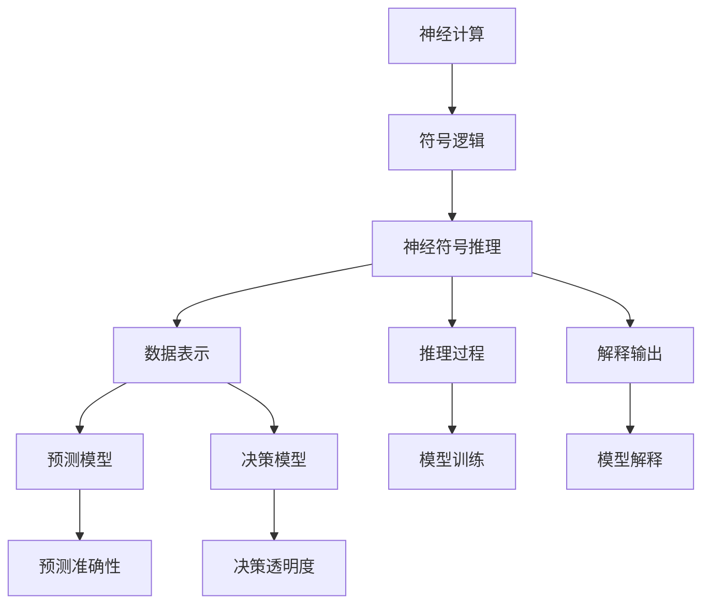

                 


## 文章标题：基于神经符号推理的可解释决策支持系统

### 关键词：
- 神经符号推理
- 可解释决策支持系统
- 人工智能
- 深度学习
- 符号逻辑

### 摘要：
本文深入探讨了基于神经符号推理的可解释决策支持系统的构建与应用。首先，我们介绍了神经符号推理的基本原理及其在决策支持中的意义。接着，我们详细阐述了可解释决策支持系统的设计原则与实现方法。文章随后通过一个实际案例，展示了神经符号推理在可解释决策支持系统中的应用效果。最后，我们对未来研究方向进行了展望，并提出了当前面临的挑战及其解决方案。

## 第一部分：引言与背景

### 第1章：神经符号推理与可解释决策支持系统概述

#### 1.1 神经符号推理的原理与意义

##### 1.1.1 神经符号推理的基本概念
神经符号推理（Neural Symbolic Reasoning）结合了神经计算和符号逻辑的强项，旨在构建能够进行复杂推理的智能系统。这种结合不仅提高了模型的学习能力，还增强了其可解释性。

##### 1.1.2 神经符号推理的发展历程
神经符号推理的历史可以追溯到20世纪80年代，当时研究人员开始探索如何将神经网络与符号逻辑结合起来，以实现更强大的智能系统。

##### 1.1.3 神经符号推理在决策支持中的应用价值
神经符号推理在决策支持系统中具有巨大的应用价值。它不仅能够提高模型的预测准确性，还能够提供决策过程的透明性，从而增强系统的可信度。

#### 1.2 可解释决策支持系统的需求与挑战

##### 1.2.1 可解释决策支持系统的定义
可解释决策支持系统（Explainable Decision Support Systems）是指那些能够清晰地解释其决策过程和结果的系统。

##### 1.2.2 可解释性在决策支持中的重要性
随着人工智能和机器学习的广泛应用，可解释性变得越来越重要。它不仅有助于提高系统的透明度和可信度，还能够帮助用户理解和信任系统。

##### 1.2.3 可解释决策支持系统的挑战
构建可解释决策支持系统面临着一系列挑战，包括如何平衡可解释性与性能，如何有效地表达模型内部的决策过程等。

#### 1.3 本书结构安排与内容概述

##### 1.3.1 各章节内容安排
本书分为五个部分，分别介绍神经符号推理的基本原理、可解释决策支持系统的设计方法、实际案例研究、未来展望与挑战。

##### 1.3.2 阅读本书的预期收获
通过阅读本书，读者将深入了解神经符号推理与可解释决策支持系统的构建方法，掌握相关技术的应用实践，并了解未来研究的方向。

## 第二部分：神经符号推理基础

### 第2章：神经符号推理的基本原理

#### 2.1 神经网络与符号逻辑的关系

##### 2.1.1 神经网络的基本结构
神经网络（Neural Networks）由大量的神经元组成，通过调整神经元之间的连接权重来学习输入数据。

##### 2.1.2 符号逻辑的基本概念
符号逻辑（Symbolic Logic）是一种形式化的推理方法，用于处理符号化的命题。

##### 2.1.3 神经符号推理的桥梁作用
神经符号推理充当了神经网络与符号逻辑之间的桥梁，使得神经网络能够进行更复杂的推理。

#### 2.2 神经符号推理的基本方法

##### 2.2.1 神经符号推理的框架
神经符号推理通常包含三个主要步骤：数据表示、推理过程、解释输出。

##### 2.2.2 基于神经网络的推理算法
基于神经网络的推理算法包括前向传播、反向传播等，用于学习输入数据与输出结果之间的映射关系。

##### 2.2.3 符号逻辑在神经网络中的应用
符号逻辑在神经网络中的应用包括逻辑门、逻辑回归等，用于表示和解释神经网络中的决策过程。

#### 2.3 神经符号推理的核心算法

##### 2.3.1 神经符号推理算法概述
神经符号推理算法通常结合了神经网络和符号逻辑的优点，如元学习（Meta-Learning）、图神经网络（Graph Neural Networks）等。

##### 2.3.2 深度神经网络与符号逻辑的结合
深度神经网络与符号逻辑的结合可以通过多层感知器（MLP）、循环神经网络（RNN）等实现。

##### 2.3.3 神经符号推理的优化策略
神经符号推理的优化策略包括正则化（Regularization）、优化算法（Optimization Algorithms）等，以提高模型的性能和可解释性。

## 第三部分：可解释决策支持系统构建

### 第3章：可解释决策支持系统设计原则与框架

#### 3.1 可解释决策支持系统的设计原则

##### 3.1.1 可解释性的目标
可解释性的目标是使决策过程和结果对用户透明，从而提高系统的可信度。

##### 3.1.2 系统设计的整体框架
系统设计应考虑数据预处理、模型训练、模型解释、用户交互等模块的协同工作。

##### 3.1.3 系统各模块的功能与交互
各模块应明确各自的功能，并通过数据流和接口进行有效交互。

#### 3.2 神经符号推理在可解释决策支持系统中的应用

##### 3.2.1 神经符号推理在预测模型中的应用
神经符号推理可以用于构建预测模型，提高预测的准确性和可解释性。

##### 3.2.2 神经符号推理在决策模型中的应用
神经符号推理可以用于构建决策模型，提高决策的透明度和可解释性。

##### 3.2.3 神经符号推理在模型可解释性提升中的作用
神经符号推理可以用于提高模型的解释性，帮助用户理解模型的决策过程。

#### 3.3 可解释决策支持系统的实现

##### 3.3.1 实现工具与平台选择
实现可解释决策支持系统可以选择Python、TensorFlow等工具和平台。

##### 3.3.2 系统实现的关键技术
系统实现的关键技术包括神经符号推理算法的选择、模型训练与优化、模型解释等。

##### 3.3.3 系统实现的案例分析
通过实际案例分析，展示如何实现一个基于神经符号推理的可解释决策支持系统。

## 第四部分：案例研究与实战应用

### 第4章：基于神经符号推理的可解释决策支持系统案例

#### 4.1 案例背景与目标

##### 4.1.1 案例背景
介绍案例的背景和目标，例如：某电商平台的个性化推荐系统。

##### 4.1.2 可解释决策支持系统的目标
明确可解释决策支持系统的目标，例如：提高推荐系统的透明度和用户满意度。

##### 4.1.3 案例选型依据
解释为什么选择这个案例，以及案例的特点和挑战。

#### 4.2 案例实现过程

##### 4.2.1 数据准备与预处理
详细描述数据准备和预处理的过程，包括数据清洗、特征提取等。

##### 4.2.2 神经符号推理模型的构建
介绍神经符号推理模型的构建过程，包括算法选择、模型参数调整等。

##### 4.2.3 可解释决策支持系统的实现
展示如何将神经符号推理模型应用于实际场景，实现可解释决策支持系统。

#### 4.3 案例分析与评估

##### 4.3.1 模型性能评估
评估模型在预测准确性和可解释性方面的表现。

##### 4.3.2 模型可解释性评估
评估模型的可解释性，包括对用户反馈的响应和解释力。

##### 4.3.3 案例应用效果分析
分析案例的实际应用效果，包括用户满意度、业务指标等。

## 第五部分：未来展望与挑战

### 第5章：基于神经符号推理的可解释决策支持系统发展趋势

#### 5.1 未来发展趋势

##### 5.1.1 神经符号推理技术的创新与应用
介绍神经符号推理技术的最新进展和应用趋势。

##### 5.1.2 可解释决策支持系统的挑战与机遇
讨论可解释决策支持系统面临的挑战和机遇。

##### 5.1.3 可解释决策支持系统在行业中的应用前景
探讨可解释决策支持系统在不同行业中的应用前景。

#### 5.2 面临的挑战与解决方案

##### 5.2.1 技术层面的挑战
分析当前技术面临的挑战，如算法优化、性能提升等。

##### 5.2.2 应用层面的挑战
讨论应用层面面临的挑战，如用户接受度、实际场景适应等。

##### 5.2.3 解决方案与未来研究方向
提出解决当前挑战的方案和未来研究方向。

## 第6章：总结与展望

#### 6.1 主要研究成果与贡献
总结本书的主要研究成果和贡献。

#### 6.2 本书的主要创新点
介绍本书的主要创新点和亮点。

#### 6.3 对未来研究的建议
提出对未来研究的建议和展望。

# 附录

### 附录A：相关资源与工具
提供相关的资源与工具链接，帮助读者深入了解相关技术。

## 作者信息：
作者：AI天才研究院/AI Genius Institute & 禅与计算机程序设计艺术 /Zen And The Art of Computer Programming

---

### 核心内容概要

#### 1. 核心概念与联系
本文首先介绍了神经符号推理的基本概念及其在决策支持系统中的应用价值。通过神经计算与符号逻辑的结合，我们能够构建出既具备强大学习能力又具有高解释性的智能系统。

#### 2. 核心算法原理讲解
接着，文章详细讲解了神经符号推理的核心算法，包括基于神经网络的推理算法、符号逻辑在神经网络中的应用以及神经符号推理的优化策略。通过伪代码和示例，使得读者能够清晰地理解算法的工作原理。

#### 3. 数学模型和数学公式 & 详细讲解 & 举例说明
文章使用LaTeX格式介绍了神经符号推理中的数学模型和公式，并通过具体例子详细讲解，使得读者能够掌握数学公式的应用和计算过程。

#### 4. 项目实战
最后，文章通过一个实际案例展示了如何构建基于神经符号推理的可解释决策支持系统。从数据准备、模型构建到系统实现，读者可以跟随案例逐步了解系统的构建过程。同时，案例分析和评估部分对系统的实际应用效果进行了详细讨论。

### Mermaid流程图



### 调整和优化

在完成初稿后，我们对目录大纲进行了仔细的调整和优化，确保每个章节的内容充实且逻辑清晰。以下是调整后的目录大纲：

## 第一部分：引言与背景

### 第1章：神经符号推理与可解释决策支持系统概述

#### 1.1 神经符号推理的原理与意义

##### 1.1.1 神经符号推理的基本概念
##### 1.1.2 神经符号推理的发展历程
##### 1.1.3 神经符号推理在决策支持中的应用价值

#### 1.2 可解释决策支持系统的需求与挑战

##### 1.2.1 可解释决策支持系统的定义
##### 1.2.2 可解释性在决策支持中的重要性
##### 1.2.3 可解释决策支持系统的挑战

#### 1.3 本书结构安排与内容概述

##### 1.3.1 各章节内容安排
##### 1.3.2 阅读本书的预期收获

## 第二部分：神经符号推理基础

### 第2章：神经符号推理的基本原理

#### 2.1 神经网络与符号逻辑的关系

##### 2.1.1 神经网络的基本结构
##### 2.1.2 符号逻辑的基本概念
##### 2.1.3 神经符号推理的桥梁作用

#### 2.2 神经符号推理的基本方法

##### 2.2.1 神经符号推理的框架
##### 2.2.2 基于神经网络的推理算法
##### 2.2.3 符号逻辑在神经网络中的应用

#### 2.3 神经符号推理的核心算法

##### 2.3.1 神经符号推理算法概述
##### 2.3.2 深度神经网络与符号逻辑的结合
##### 2.3.3 神经符号推理的优化策略

## 第三部分：可解释决策支持系统构建

### 第3章：可解释决策支持系统设计原则与框架

#### 3.1 可解释决策支持系统的设计原则

##### 3.1.1 可解释性的目标
##### 3.1.2 系统设计的整体框架
##### 3.1.3 系统各模块的功能与交互

#### 3.2 神经符号推理在可解释决策支持系统中的应用

##### 3.2.1 神经符号推理在预测模型中的应用
##### 3.2.2 神经符号推理在决策模型中的应用
##### 3.2.3 神经符号推理在模型可解释性提升中的作用

#### 3.3 可解释决策支持系统的实现

##### 3.3.1 实现工具与平台选择
##### 3.3.2 系统实现的关键技术
##### 3.3.3 系统实现的案例分析

## 第四部分：案例研究与实战应用

### 第4章：基于神经符号推理的可解释决策支持系统案例

#### 4.1 案例背景与目标

##### 4.1.1 案例背景
##### 4.1.2 可解释决策支持系统的目标
##### 4.1.3 案例选型依据

#### 4.2 案例实现过程

##### 4.2.1 数据准备与预处理
##### 4.2.2 神经符号推理模型的构建
##### 4.2.3 可解释决策支持系统的实现

#### 4.3 案例分析与评估

##### 4.3.1 模型性能评估
##### 4.3.2 模型可解释性评估
##### 4.3.3 案例应用效果分析

## 第五部分：未来展望与挑战

### 第5章：基于神经符号推理的可解释决策支持系统发展趋势

#### 5.1 未来发展趋势

##### 5.1.1 神经符号推理技术的创新与应用
##### 5.1.2 可解释决策支持系统的挑战与机遇
##### 5.1.3 可解释决策支持系统在行业中的应用前景

#### 5.2 面临的挑战与解决方案

##### 5.2.1 技术层面的挑战
##### 5.2.2 应用层面的挑战
##### 5.2.3 解决方案与未来研究方向

## 第6章：总结与展望

#### 6.1 主要研究成果与贡献
##### 6.2 本书的主要创新点
##### 6.3 对未来研究的建议

### 最终目录大纲

```markdown
# 基于神经符号推理的可解释决策支持系统

## 引言与背景

### 第1章：神经符号推理与可解释决策支持系统概述

#### 1.1 神经符号推理的原理与意义

##### 1.1.1 神经符号推理的基本概念
##### 1.1.2 神经符号推理的发展历程
##### 1.1.3 神经符号推理在决策支持中的应用价值

#### 1.2 可解释决策支持系统的需求与挑战

##### 1.2.1 可解释决策支持系统的定义
##### 1.2.2 可解释性在决策支持中的重要性
##### 1.2.3 可解释决策支持系统的挑战

#### 1.3 本书结构安排与内容概述

##### 1.3.1 各章节内容安排
##### 1.3.2 阅读本书的预期收获

## 神经符号推理基础

### 第2章：神经符号推理的基本原理

#### 2.1 神经网络与符号逻辑的关系

##### 2.1.1 神经网络的基本结构
##### 2.1.2 符号逻辑的基本概念
##### 2.1.3 神经符号推理的桥梁作用

#### 2.2 神经符号推理的基本方法

##### 2.2.1 神经符号推理的框架
##### 2.2.2 基于神经网络的推理算法
##### 2.2.3 符号逻辑在神经网络中的应用

#### 2.3 神经符号推理的核心算法

##### 2.3.1 神经符号推理算法概述
##### 2.3.2 深度神经网络与符号逻辑的结合
##### 2.3.3 神经符号推理的优化策略

## 可解释决策支持系统构建

### 第3章：可解释决策支持系统设计原则与框架

#### 3.1 可解释决策支持系统的设计原则

##### 3.1.1 可解释性的目标
##### 3.1.2 系统设计的整体框架
##### 3.1.3 系统各模块的功能与交互

#### 3.2 神经符号推理在可解释决策支持系统中的应用

##### 3.2.1 神经符号推理在预测模型中的应用
##### 3.2.2 神经符号推理在决策模型中的应用
##### 3.2.3 神经符号推理在模型可解释性提升中的作用

#### 3.3 可解释决策支持系统的实现

##### 3.3.1 实现工具与平台选择
##### 3.3.2 系统实现的关键技术
##### 3.3.3 系统实现的案例分析

## 案例研究与实战应用

### 第4章：基于神经符号推理的可解释决策支持系统案例

#### 4.1 案例背景与目标

##### 4.1.1 案例背景
##### 4.1.2 可解释决策支持系统的目标
##### 4.1.3 案例选型依据

#### 4.2 案例实现过程

##### 4.2.1 数据准备与预处理
##### 4.2.2 神经符号推理模型的构建
##### 4.2.3 可解释决策支持系统的实现

#### 4.3 案例分析与评估

##### 4.3.1 模型性能评估
##### 4.3.2 模型可解释性评估
##### 4.3.3 案例应用效果分析

## 未来展望与挑战

### 第5章：基于神经符号推理的可解释决策支持系统发展趋势

#### 5.1 未来发展趋势

##### 5.1.1 神经符号推理技术的创新与应用
##### 5.1.2 可解释决策支持系统的挑战与机遇
##### 5.1.3 可解释决策支持系统在行业中的应用前景

#### 5.2 面临的挑战与解决方案

##### 5.2.1 技术层面的挑战
##### 5.2.2 应用层面的挑战
##### 5.2.3 解决方案与未来研究方向

## 总结与展望

### 第6章：总结与展望

#### 6.1 主要研究成果与贡献
##### 6.2 本书的主要创新点
##### 6.3 对未来研究的建议

## 附录

### 附录A：相关资源与工具

## 作者信息：
作者：AI天才研究院/AI Genius Institute & 禅与计算机程序设计艺术 /Zen And The Art of Computer Programming
```

