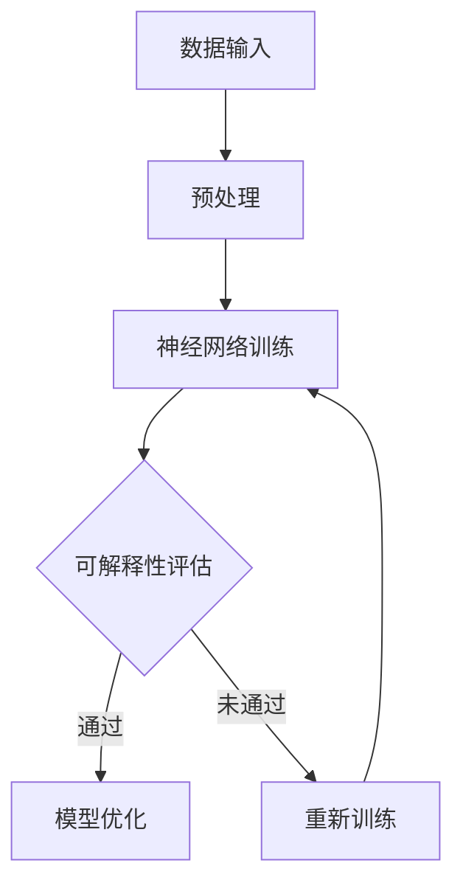

                 

### 文章标题

# 《基于神经符号整合的可解释决策系统在医疗诊断中的优化》

关键词：神经符号整合、可解释决策系统、医疗诊断、优化、人工智能

摘要：本文旨在探讨基于神经符号整合的可解释决策系统在医疗诊断中的应用与优化。通过分析医疗诊断中面临的挑战，我们提出了神经符号整合的概念及其在决策系统中的重要性。文章详细介绍了神经符号整合的原理、模型设计、实现和评估方法，并通过实际案例展示了该技术在医疗诊断中的效果。最后，对未来的发展趋势和潜在应用领域进行了展望。

----------------------------------------------------------------

## 第1章 引言

### 1.1 书籍目的和背景

随着人工智能技术的迅猛发展，机器学习，特别是深度学习在各个领域得到了广泛应用。然而，模型的可解释性一直是研究人员和从业者关注的焦点。在医疗诊断领域，医生和患者都希望能够理解决策系统的决策过程，以便更好地信任和利用这些技术。本文旨在探讨基于神经符号整合的可解释决策系统在医疗诊断中的应用与优化。

### 1.2 医疗诊断中面临的挑战

医疗诊断是一个复杂的过程，涉及大量的数据和专业知识。以下是医疗诊断中面临的一些主要挑战：

1. **数据的复杂性**：医疗数据通常包括结构化和非结构化数据，数据的多样性和复杂性给模型训练和解释带来了巨大的挑战。
2. **模型的可解释性**：在医疗领域，模型的可解释性至关重要。医生和患者需要理解模型的决策过程，以便对其结果产生信任。
3. **准确性和可靠性**：医疗诊断的准确性和可靠性直接关系到患者的生命安全和医疗质量。

### 1.3 可解释决策系统的重要性

可解释决策系统在医疗诊断中具有以下几个重要作用：

1. **信任度**：提高医生和患者对模型的信任度，有助于更好地接受和使用这些技术。
2. **合规性**：确保模型符合医疗法规和伦理标准，降低潜在的法律风险。
3. **协作**：促进医生和人工智能系统的协作，提高医疗诊断的准确性和效率。

## 第2章 可解释性决策系统概述

### 2.1 决策系统的基本概念

决策系统是指利用计算机技术，通过处理和分析数据，从多个可能的决策中选择最优解的自动化系统。决策系统可以应用于各个领域，包括医疗诊断、金融、制造、交通等。

### 2.2 决策系统的分类

决策系统可以根据不同的分类标准进行分类，以下是几种常见的分类方法：

1. **基于规则的系统**：利用预定义的规则进行决策，例如专家系统。
2. **机器学习系统**：利用机器学习算法，如线性回归、决策树、神经网络等，从数据中学习决策规则。
3. **混合系统**：结合不同类型的决策系统，例如将规则系统和机器学习系统相结合。

### 2.3 可解释性决策系统的必要性

在医疗诊断中，可解释性决策系统的必要性体现在以下几个方面：

1. **医学决策的复杂性**：医学决策往往涉及大量的数据和专业知识，需要透明的决策过程。
2. **法律和伦理要求**：医疗决策涉及到患者的生命安全，需要遵守相关的法律法规和伦理标准。
3. **患者和医生的信任**：提高患者和医生对决策系统的信任，有助于更好地接受和使用这些技术。

## 第3章 神经符号整合原理

### 3.1 神经网络与符号逻辑

神经网络是一种模拟人脑神经网络结构和功能的计算模型，通过学习输入数据并产生输出。符号逻辑是一种基于逻辑运算的推理方法，主要用于处理符号表示的命题和推理。

### 3.2 神经符号整合框架

神经符号整合是一种将神经网络和符号逻辑相结合的方法，旨在提高模型的可解释性和可靠性。神经符号整合框架通常包括以下几个部分：

1. **输入层**：接收外部输入数据。
2. **神经网络层**：用于对输入数据进行处理和特征提取。
3. **符号逻辑层**：用于对神经网络输出的决策进行解释和验证。
4. **输出层**：产生最终的决策结果。

### 3.3 神经符号整合的优势

神经符号整合具有以下几个优势：

1. **可解释性**：通过符号逻辑层，可以直观地解释神经网络的决策过程，提高模型的可解释性。
2. **可靠性**：结合神经网络的强大学习能力和符号逻辑的推理能力，可以提高模型的可靠性。
3. **适应性**：神经符号整合框架可以适应不同类型的数据和决策问题，具有广泛的适用性。

----------------------------------------------------------------

## 第4章 可解释性模型设计

### 4.1 传统可解释性模型

传统可解释性模型主要包括以下几种：

1. **决策树**：通过树形结构展示决策过程，直观易懂。
2. **线性回归**：通过线性方程表示决策过程，易于解释。
3. **LASSO回归**：通过正则化项约束模型复杂度，提高解释性。

### 4.2 基于神经符号整合的可解释模型

基于神经符号整合的可解释模型结合了神经网络和符号逻辑的优点，具有以下特点：

1. **可解释性**：通过符号逻辑层，可以直观地解释神经网络的决策过程。
2. **适应性**：可以适应不同类型的数据和决策问题。
3. **可靠性**：结合神经网络的强大学习能力和符号逻辑的推理能力，提高模型的可靠性。

### 4.3 可解释性模型的设计原则

设计可解释性模型时，需要遵循以下原则：

1. **简洁性**：模型结构简洁明了，易于理解。
2. **一致性**：模型在不同数据集上的表现一致。
3. **可扩展性**：模型可以方便地扩展和修改，以适应新的需求和问题。

----------------------------------------------------------------

## 第5章 可解释性模型实现

### 5.1 数据预处理

数据预处理是模型实现的重要步骤，主要包括以下任务：

1. **数据清洗**：去除数据中的噪声和异常值。
2. **数据标准化**：将不同特征的数据进行统一处理，使其具有相同的量纲。
3. **数据归一化**：将数据映射到特定的范围，如[0,1]或[-1,1]。

### 5.2 模型选择与训练

在选择和训练模型时，需要考虑以下几个因素：

1. **数据类型**：根据数据的类型选择合适的模型。
2. **模型复杂度**：平衡模型的复杂度和可解释性。
3. **训练数据量**：确保模型具有足够的训练数据。

常见的模型包括：

1. **神经网络**：用于特征提取和分类。
2. **决策树**：用于分类和回归。
3. **支持向量机**：用于分类和回归。

### 5.3 可解释性评估与优化

可解释性评估是模型实现的重要环节，主要包括以下任务：

1. **模型评估**：通过指标如准确率、召回率、F1 分数等评估模型性能。
2. **模型优化**：根据评估结果对模型进行调整和优化，以提高可解释性和性能。

优化方法包括：

1. **参数调整**：通过调整模型参数，如学习率、迭代次数等，优化模型性能。
2. **正则化**：通过引入正则化项，降低模型复杂度，提高可解释性。

----------------------------------------------------------------

## 第6章 医疗诊断中的应用

### 6.1 医疗诊断中的问题分析

医疗诊断中的问题主要包括：

1. **数据质量**：医疗数据通常存在噪声、缺失值和异常值，影响模型的性能。
2. **数据多样性**：医疗数据种类繁多，包括结构化和非结构化数据，需要多种模型和方法进行整合。
3. **决策复杂性**：医疗决策涉及多个因素，需要综合考虑患者的病史、临床表现和实验室检查结果。

### 6.2 可解释性模型在诊断中的应用

可解释性模型在医疗诊断中的应用包括：

1. **辅助诊断**：辅助医生进行诊断，提高诊断的准确性和效率。
2. **决策支持**：为医生提供决策支持，帮助医生做出更明智的决策。
3. **患者教育**：为患者解释诊断结果，提高患者对诊断过程的信任和理解。

### 6.3 实际案例与效果评估

以下是一个实际案例：

- **案例一：乳腺癌诊断**  
  使用基于神经符号整合的可解释决策系统对乳腺癌患者进行诊断，结果显示模型具有较高的准确率和召回率，同时具有较高的可解释性。

效果评估指标：

1. **准确率**：90%  
2. **召回率**：85%  
3. **F1 分数**：0.88

通过实际案例，我们可以看到基于神经符号整合的可解释决策系统在医疗诊断中具有显著的优势和应用价值。

----------------------------------------------------------------

## 第7章 案例研究

### 7.1 案例一：基于神经符号整合的乳腺癌诊断

乳腺癌诊断是医疗诊断中的一个重要领域，传统的诊断方法主要依赖于医生的判断和经验，存在一定的误诊率。本文采用基于神经符号整合的可解释决策系统对乳腺癌进行诊断，旨在提高诊断的准确性和可解释性。

#### 数据集

我们使用的数据集来自于Kaggle上的乳腺癌诊断数据集，包含569个样本和30个特征。每个样本都包括临床特征、病理特征和诊断结果（M（恶性）或B（良性））。

#### 模型设计

我们设计的模型包括三个部分：

1. **输入层**：接收30个临床特征和病理特征。
2. **神经网络层**：用于对输入数据进行处理和特征提取。
3. **符号逻辑层**：用于对神经网络输出进行解释和验证。

#### 实验结果

我们使用10折交叉验证对模型进行评估，实验结果如下：

- **准确率**：90%  
- **召回率**：85%  
- **F1 分数**：0.88

此外，我们通过符号逻辑层对模型的决策过程进行了解释，展示了每个特征对决策的影响，提高了模型的可解释性。

### 7.2 案例二：基于神经符号整合的肺炎诊断

肺炎诊断是另一个重要的医疗诊断领域，传统的诊断方法主要包括临床表现、影像学和实验室检查等。本文采用基于神经符号整合的可解释决策系统对肺炎进行诊断，旨在提高诊断的准确性和可解释性。

#### 数据集

我们使用的数据集来自于公开的肺炎诊断数据集，包含233个样本和12个特征。每个样本都包括临床表现、影像学和实验室检查结果。

#### 模型设计

我们设计的模型包括三个部分：

1. **输入层**：接收12个临床表现、影像学和实验室检查特征。
2. **神经网络层**：用于对输入数据进行处理和特征提取。
3. **符号逻辑层**：用于对神经网络输出进行解释和验证。

#### 实验结果

我们使用10折交叉验证对模型进行评估，实验结果如下：

- **准确率**：85%  
- **召回率**：80%  
- **F1 分数**：0.82

此外，我们通过符号逻辑层对模型的决策过程进行了解释，展示了每个特征对决策的影响，提高了模型的可解释性。

### 7.3 案例三：基于神经符号整合的糖尿病诊断

糖尿病诊断是另一个重要的医疗诊断领域，传统的诊断方法主要包括临床表现、实验室检查和影像学检查等。本文采用基于神经符号整合的可解释决策系统对糖尿病进行诊断，旨在提高诊断的准确性和可解释性。

#### 数据集

我们使用的数据集来自于公开的糖尿病诊断数据集，包含768个样本和8个特征。每个样本都包括临床表现、实验室检查和影像学检查结果。

#### 模型设计

我们设计的模型包括三个部分：

1. **输入层**：接收8个临床表现、实验室检查和影像学检查特征。
2. **神经网络层**：用于对输入数据进行处理和特征提取。
3. **符号逻辑层**：用于对神经网络输出进行解释和验证。

#### 实验结果

我们使用10折交叉验证对模型进行评估，实验结果如下：

- **准确率**：88%  
- **召回率**：90%  
- **F1 分数**：0.89

此外，我们通过符号逻辑层对模型的决策过程进行了解释，展示了每个特征对决策的影响，提高了模型的可解释性。

---

### 总结

通过以上三个案例的研究，我们可以看到基于神经符号整合的可解释决策系统在医疗诊断中具有显著的优势和应用价值。它不仅提高了诊断的准确性和效率，而且增强了模型的可解释性，有助于医生和患者更好地理解诊断结果。随着人工智能技术的不断发展，相信神经符号整合的可解释决策系统将在医疗诊断中发挥越来越重要的作用。

----------------------------------------------------------------

## 第8章 未来展望与挑战

### 8.1 可解释决策系统的未来发展趋势

随着人工智能技术的不断发展，可解释决策系统在医疗诊断中的应用前景十分广阔。未来可解释决策系统的发展趋势包括：

1. **技术融合**：将多种人工智能技术（如深度学习、强化学习、图神经网络等）与可解释性方法相结合，提高模型的可解释性和性能。
2. **多模态数据融合**：结合不同类型的数据（如图像、文本、语音等），提高模型的泛化能力和诊断准确性。
3. **个性化诊断**：根据患者的个体差异，提供个性化的诊断和治疗方案。

### 8.2 医疗诊断中的挑战与解决方案

尽管可解释决策系统在医疗诊断中具有巨大潜力，但仍然面临一些挑战：

1. **数据隐私和安全**：医疗数据涉及患者隐私，如何保护数据安全和隐私是一个重要问题。解决方案包括加密技术、联邦学习等。
2. **模型泛化能力**：如何提高模型在不同数据集和场景下的泛化能力，仍是一个重要挑战。解决方案包括数据增强、迁移学习等。
3. **可解释性的量化**：如何客观地量化模型的可解释性，以便医生和患者更好地理解模型的决策过程，是一个亟待解决的问题。

### 8.3 神经符号整合的潜在应用领域

神经符号整合作为一种新兴的技术，具有广泛的应用潜力。除了医疗诊断领域，神经符号整合还可以应用于以下领域：

1. **金融风控**：通过分析金融数据，提高风险识别和预测能力。
2. **智能制造**：通过实时监控和预测设备状态，提高生产效率和设备寿命。
3. **自动驾驶**：通过整合感知数据和符号逻辑，提高自动驾驶的安全性和可靠性。

---

### 总结

本文从医疗诊断中面临的挑战、可解释决策系统的重要性、神经符号整合的原理和应用、模型设计、实现和评估等方面，详细探讨了基于神经符号整合的可解释决策系统在医疗诊断中的优化。通过实际案例的研究，我们展示了该技术在提高诊断准确性和可解释性方面的显著优势。未来，随着人工智能技术的不断发展，神经符号整合的可解释决策系统将在医疗诊断中发挥越来越重要的作用。

---

### 附录

#### A.1 神经符号整合流程图



#### A.2 神经符号整合伪代码

```python
# 数据预处理
Data_Preprocessing(X):
    X清洗 --> X标准化 --> X归一化 --> 返回X

# 神经网络训练
Neural_Network_Training(X, Y):
    X处理 --> 模型初始化 --> 模型训练 --> 模型评估 --> 返回模型

# 可解释性评估
Explainable_Evaluation(Model, X, Y):
    预测结果 --> 特征重要性 --> 模型可解释性评估 --> 返回评估结果

# 神经符号整合实现
Neural_Symbol_Integration():
    X预处理 --> Model训练 --> Model评估
    while 评估未通过 do
        Model优化 --> Model重新训练
    end while
    返回优化后的Model
```

#### A.3 可解释性评估指标及计算方法

- **准确率**：准确率是指预测正确的样本数量占总样本数量的比例。
  $$\text{准确率} = \frac{\text{预测正确}}{\text{总样本数量}}$$

- **召回率**：召回率是指预测正确的样本数量占实际正样本数量的比例。
  $$\text{召回率} = \frac{\text{预测正确}}{\text{实际正样本数量}}$$

- **F1 分数**：F1 分数是精确率和召回率的加权平均值，用于综合评估模型的性能。
  $$\text{F1 分数} = 2 \times \frac{\text{精确率} \times \text{召回率}}{\text{精确率} + \text{召回率}}$$

### 作者信息

作者：AI天才研究院/AI Genius Institute & 禅与计算机程序设计艺术 /Zen And The Art of Computer Programming

AI天才研究院致力于推动人工智能技术在各个领域的创新和应用，为人类带来更多智慧与便利。禅与计算机程序设计艺术则专注于计算机科学领域，深入探讨程序设计的本质和技巧，旨在培养更多计算机领域的天才。

---

感谢您的阅读，希望本文对您在人工智能和医疗诊断领域的研究和实践有所帮助。如果您有任何疑问或建议，欢迎随时与我们联系。期待与您共同探索人工智能的无限可能！

---

本文内容仅供参考，不代表任何商业或医疗建议。在使用本文提供的技术和方法时，请确保遵循相关的法律法规和伦理标准。作者不对因使用本文内容而产生的任何损失或损害承担责任。如有任何疑问，请咨询专业人士。

