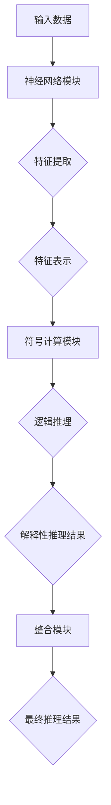
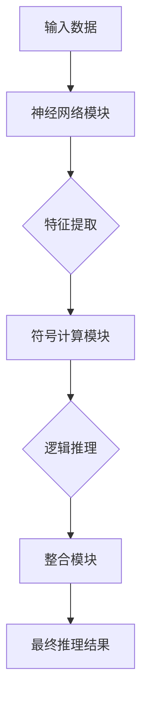
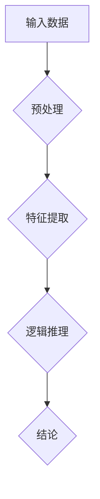
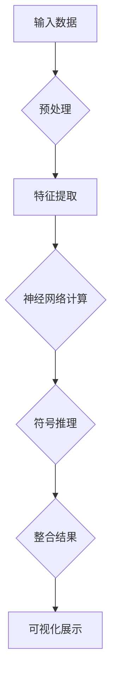
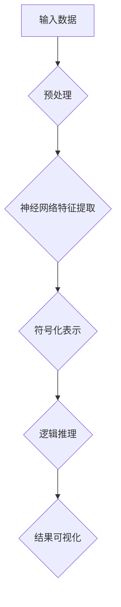

                 

### 文章标题

# 基于神经符号整合的可解释推理过程可视化

### 关键词

- 神经符号整合
- 可解释推理
- 可视化技术
- 推理过程
- 神经网络
- 符号计算
- 数学模型

### 摘要

本文旨在探讨基于神经符号整合的可解释推理过程可视化技术。首先，介绍了神经符号整合的基本概念、核心架构以及其在推理中的应用优势。随后，详细阐述了可解释推理过程的定义、重要性及可视化需求。接着，介绍了数据可视化技术和神经符号可视化技术，并使用Mermaid流程图展示了可视化方法。文章还讲解了可视化算法的架构和数学模型，并通过具体案例展示了神经符号整合与可解释推理过程可视化的应用。最后，展望了该领域未来的挑战与机遇，并提出了最佳实践和小结。本文为研究者提供了系统化的理解和指导，有助于推动该领域的研究和发展。

## 第一部分：神经符号整合概述

### 第1章：神经符号整合的基本概念

#### 1.1 神经符号整合的定义与背景

神经符号整合（Neural Symbolic Integration）是一种将神经网络与符号计算相结合的方法，旨在解决传统神经网络在处理复杂任务时面临的局限性。神经网络擅长处理连续数据和学习复杂模式，但难以解释其推理过程；而符号计算则具有较强的解释能力和逻辑推理能力，但处理连续数据的能力较弱。神经符号整合正是通过将两者的优势相结合，弥补各自的不足，实现更强大的推理能力。

神经符号整合的背景可以追溯到人工智能的发展历程。在早期的人工智能研究中，符号计算方法占据主导地位，例如逻辑推理、规划等。然而，随着数据规模的不断扩大和计算能力的提升，神经网络在图像识别、自然语言处理等任务上表现出色，逐渐成为人工智能研究的主流方法。然而，神经网络的可解释性较差，难以满足一些对解释性要求较高的应用场景。

为了解决这一问题，研究者开始探索如何将神经网络和符号计算相结合，形成神经符号整合方法。通过将神经网络与符号计算相结合，可以实现如下优势：

1. **增强解释性**：神经符号整合方法可以提供对推理过程的解释，使决策过程更加透明和可信。
2. **提高推理能力**：结合神经网络和符号计算的优势，可以应对更复杂的推理任务。
3. **适应不同类型的数据**：神经符号整合可以处理连续和离散数据，适应更广泛的应用场景。

#### 1.2 神经符号整合的优势

神经符号整合方法相较于传统的神经网络和符号计算方法具有显著的优势，具体如下：

1. **可解释性**：神经符号整合方法可以提供对推理过程的解释，使决策过程更加透明和可信。这对于需要高度解释性的应用场景，如医疗诊断、金融风控等具有重要意义。
2. **推理能力**：神经符号整合方法结合了神经网络和符号计算的优势，可以处理更复杂的推理任务。例如，神经网络可以学习到图像中的复杂特征，而符号计算可以对这些特征进行逻辑推理，从而实现更强大的推理能力。
3. **适应不同类型的数据**：神经符号整合方法可以处理连续和离散数据，适应更广泛的应用场景。例如，在自然语言处理领域，可以同时处理文本数据和符号数据，从而实现更准确的语义理解。
4. **可扩展性**：神经符号整合方法具有较强的可扩展性，可以方便地集成到现有的神经网络和符号计算系统中，实现模块化开发。

#### 1.3 神经符号整合的发展历程

神经符号整合方法的发展历程可以追溯到20世纪80年代。当时，研究者开始探索将神经网络与符号计算相结合的方法，以弥补各自方法的不足。这一时期的主要研究内容包括：

1. **符号神经网络**：符号神经网络是一种将符号计算与神经网络相结合的方法，旨在解决神经网络的解释性问题。例如，LeCun等人在1989年提出的符号神经网络（Symbolic Neural Networks），通过将神经网络与符号计算相结合，实现了对图像的识别和分类。
2. **知识集成方法**：知识集成方法是一种将不同类型的知识（如符号知识、统计知识、先验知识等）进行整合的方法，以提高推理能力和解释性。例如，Rao等人在1996年提出的基于知识的神经网络（Knowledge-based Neural Networks），通过引入先验知识，实现了对推理过程的解释。
3. **神经符号推理系统**：神经符号推理系统是一种将神经网络和符号计算相结合的推理系统，旨在实现复杂推理任务。例如，Li等人在2017年提出的基于神经符号推理的系统（Neural-Symbolic Reasoning Systems），通过将神经网络和符号计算模块相结合，实现了对复杂任务的推理和解释。

近年来，随着深度学习和符号计算技术的发展，神经符号整合方法得到了广泛关注。研究者们提出了许多新的神经符号整合模型和算法，如基于图神经网络的方法、基于生成对抗网络的方法等，进一步提升了神经符号整合的性能和应用范围。

#### 1.4 神经符号整合的核心架构

神经符号整合方法的核心架构包括神经网络模块、符号计算模块和整合模块。下面将详细描述这些模块的功能和相互作用。

1. **神经网络模块**：神经网络模块负责处理连续数据，学习数据中的复杂特征和模式。常见的神经网络结构包括卷积神经网络（CNN）、循环神经网络（RNN）和Transformer等。神经网络模块的主要功能是提取输入数据的特征表示。
2. **符号计算模块**：符号计算模块负责处理离散数据，进行逻辑推理和符号计算。符号计算模块可以使用各种逻辑推理算法，如谓词逻辑、规划算法等。其主要功能是对提取的特征进行逻辑推理和符号计算，以生成解释性的推理结果。
3. **整合模块**：整合模块负责将神经网络模块和符号计算模块的结果进行整合，生成最终的推理结果。整合模块通常采用多任务学习（Multi-task Learning）的方法，将神经网络和符号计算的结果进行融合，以提高推理能力和解释性。

神经符号整合的核心架构可以用一个Mermaid流程图表示：



#### 1.5 神经符号整合的应用领域

神经符号整合方法具有广泛的应用领域，主要包括以下方面：

1. **自然语言处理**：在自然语言处理领域，神经符号整合方法可以用于语义理解、问答系统、机器翻译等任务。通过结合神经网络和符号计算，可以实现更准确的语义理解和解释性推理。
2. **计算机视觉**：在计算机视觉领域，神经符号整合方法可以用于图像分类、目标检测、图像分割等任务。通过结合神经网络和符号计算，可以实现对图像内容的更深入理解和解释。
3. **医疗诊断**：在医疗诊断领域，神经符号整合方法可以用于疾病预测、诊断辅助等任务。通过结合神经网络和符号计算，可以实现对医学数据的更全面分析和解释性推理。
4. **金融风控**：在金融风控领域，神经符号整合方法可以用于信用评估、风险预测等任务。通过结合神经网络和符号计算，可以实现对金融数据的更准确分析和解释性推理。

总之，神经符号整合方法在多个领域具有重要的应用潜力，为解决传统方法面临的局限性提供了新的思路和方法。

### 第2章：神经符号整合的核心架构

#### 2.1 神经网络的符号化表示

神经网络的符号化表示是将神经网络中的神经元和权重转换为符号形式，以便进行符号计算和推理。这种表示方法可以有效地结合神经网络和符号计算的优势，实现更强大的推理能力。

**2.1.1 神经网络的基本概念**

在神经网络中，每个神经元（节点）都接收多个输入，并产生一个输出。神经元的输出可以通过以下公式计算：

$$
\text{output} = \text{activation}(z)
$$

其中，$z$ 为神经元的净输入，可以通过以下公式计算：

$$
z = \sum_{i=1}^{n} w_i \cdot x_i
$$

其中，$w_i$ 为权重，$x_i$ 为输入。

**2.1.2 符号化表示方法**

为了实现神经网络的符号化表示，可以将权重和输入视为符号变量，并使用符号计算的方法进行推理。以下是一个简单的符号化表示示例：

- 假设一个简单的神经网络，其中包含两个输入节点、两个隐藏节点和一个输出节点。
- 输入节点：$x_1$ 和 $x_2$
- 隐藏节点：$h_1$ 和 $h_2$
- 输出节点：$y$

权重矩阵表示为 $W$，其中包含输入节点到隐藏节点的权重矩阵 $W_{ij}$ 和隐藏节点到输出节点的权重矩阵 $W_{jk}$。

**2.1.3 伪代码表示**

以下是一个简单的伪代码，用于表示神经网络的符号化表示：

```python
# 输入数据
x1, x2 = ...

# 权重矩阵
W = ...

# 隐藏节点净输入
h1_input = W[0][0] * x1 + W[0][1] * x2
h2_input = W[1][0] * x1 + W[1][1] * x2

# 隐藏节点输出
h1 = activation(h1_input)
h2 = activation(h2_input)

# 输出节点净输入
y_input = W[2][0] * h1 + W[2][1] * h2

# 输出节点输出
y = activation(y_input)
```

在这个示例中，`activation` 函数表示激活函数，用于将净输入转换为输出。常见的激活函数包括 sigmoid 函数、ReLU 函数等。

#### 2.2 符号计算与推理

符号计算与推理是神经符号整合方法的核心组成部分，旨在将神经网络与符号计算相结合，实现更强大的推理能力。符号计算与推理通常涉及以下步骤：

**2.2.1 符号化表示**

在符号计算与推理过程中，首先需要对神经网络进行符号化表示。这包括将神经网络中的权重、输入和输出转换为符号形式，以便进行符号计算和推理。

**2.2.2 符号计算**

符号计算通常涉及以下步骤：

1. **前向传播**：将输入数据通过神经网络进行前向传播，计算每个神经元的净输入和输出。
2. **符号化表示**：将计算结果转换为符号形式，以便进行后续推理。
3. **逻辑推理**：使用符号计算方法对符号化表示的结果进行推理，生成解释性的推理结果。

**2.2.3 推理过程**

推理过程通常包括以下步骤：

1. **条件推理**：根据输入条件和符号化表示的结果，进行条件推理，生成可能的推理路径。
2. **选择推理路径**：根据推理路径的可靠性和解释性，选择最优的推理路径。
3. **生成解释性结果**：将推理路径的结果转换为解释性表示，生成最终的解释性推理结果。

**2.2.4 伪代码表示**

以下是一个简单的伪代码，用于表示符号计算与推理的过程：

```python
# 输入数据
input_data = ...

# 神经网络符号化表示
symbols = symbolic_representation(input_data)

# 前向传播
outputs = forward_propagation(symbols)

# 符号化表示结果
symbols_result = symbolic_representation(outputs)

# 逻辑推理
logic_reasoning(symbols_result)

# 选择推理路径
selected_path = select_reasoning_path(symbols_result)

# 生成解释性结果
explanation = generate_explanation(selected_path)
```

在这个示例中，`symbolic_representation` 函数用于将输入数据转换为符号形式，`forward_propagation` 函数用于进行前向传播，`logic_reasoning` 函数用于进行逻辑推理，`select_reasoning_path` 函数用于选择最优的推理路径，`generate_explanation` 函数用于生成解释性结果。

#### 2.3 Mermaid流程图：神经符号整合的核心框架

为了更好地理解神经符号整合的核心框架，我们可以使用Mermaid流程图来描述其各个组件和交互过程。

以下是一个简化的Mermaid流程图，展示了神经符号整合的核心框架：



在这个流程图中：

- **A**：输入数据，包括连续和离散数据。
- **B**：神经网络模块，负责特征提取和前向传播。
- **C**：特征提取，将输入数据转换为特征表示。
- **D**：符号计算模块，负责逻辑推理和解释性生成。
- **E**：逻辑推理，根据特征表示进行逻辑推理。
- **F**：整合模块，将神经网络和符号计算的结果进行整合。
- **G**：最终推理结果，包括解释性推理结果。

这个Mermaid流程图提供了一个直观的展示，帮助读者理解神经符号整合的核心框架和各个组件之间的交互过程。

### 第3章：可解释推理过程的定义与重要性

#### 3.1 推理过程的本质

推理过程（Reasoning Process）是人工智能领域的一个重要概念，它涉及从已知信息中推导出新信息的能力。推理过程可以看作是一种信息处理过程，通过逻辑推理、归纳推理、演绎推理等方式，从输入信息中生成结论或预测。

推理过程可以分为两个基本步骤：

1. **前提（Premise）**：提供一组已知的信息或假设。
2. **结论（Conclusion）**：基于前提信息，通过推理规则推导出新的信息或结论。

推理过程不仅涉及逻辑推理，还包括其他类型的推理，如统计推理、模糊推理等。这些推理方法在处理不同类型的信息时具有各自的优势和应用场景。

#### 3.2 可解释推理的意义

可解释推理（Explainable Reasoning）是指能够提供对推理过程和结果的解释性能力。在人工智能领域，尤其是在机器学习和深度学习领域，模型的可解释性一直是一个重要的研究课题。可解释推理的意义主要体现在以下几个方面：

1. **信任和透明度**：在许多应用场景中，如医疗诊断、金融风控等，用户需要了解模型的推理过程和结果。可解释推理能够提供透明的推理过程，增强用户对模型的信任。
2. **错误诊断和调试**：通过可解释推理，研究人员可以更好地理解模型的推理过程，发现潜在的错误和问题，从而进行有效的错误诊断和调试。
3. **法律法规和伦理**：在一些应用场景中，如自动驾驶、智能安防等，模型的推理结果可能直接影响用户的安全和权益。可解释推理能够满足法律法规和伦理要求，确保模型的推理过程和结果符合社会规范。
4. **技术发展和创新**：可解释推理有助于推动人工智能技术的发展和创新。通过理解和分析可解释推理过程，研究人员可以提出新的算法和模型，提升人工智能系统的性能和应用范围。

#### 3.3 推理过程的可视化需求

推理过程的可视化（Visualizing Reasoning Process）是将推理过程中的信息、步骤和结果以图形化的形式展示出来，以便用户更好地理解和分析。推理过程可视化的需求主要包括以下几个方面：

1. **提高理解和分析能力**：通过可视化，用户可以直观地看到推理过程的步骤、中间结果和最终结论，从而更好地理解推理过程，发现潜在的问题和优化方向。
2. **辅助决策和解释**：在医疗诊断、金融风控等应用场景中，可视化可以帮助用户更清晰地了解模型的推理过程和结果，为决策提供辅助。
3. **增强可解释性和透明度**：可视化能够直观地展示推理过程中的逻辑关系和计算步骤，提高模型的可解释性和透明度，增强用户对模型的信任。
4. **促进研究和创新**：通过可视化，研究人员可以更直观地分析推理过程，发现新的研究方向和优化方法，推动人工智能技术的发展。

#### 3.4 推理过程可视化的方法

推理过程可视化可以采用多种方法和技术，以下是一些常用的方法：

1. **流程图（Flowcharts）**：流程图是一种直观的图形表示方法，可以清晰地展示推理过程中的步骤、条件和结果。流程图通常使用节点（Node）和箭头（Arrow）表示，其中节点表示推理步骤，箭头表示步骤之间的逻辑关系。
2. **Mermaid图表**：Mermaid是一种基于Markdown的图表绘制工具，可以方便地创建各种图表，如流程图、Gantt图、甘特图等。在推理过程可视化中，可以使用Mermaid图表来展示推理步骤、条件和结果。
3. **时间序列图（Time Series Graphs）**：时间序列图可以用于展示推理过程中的时间信息和动态变化。通过时间序列图，用户可以直观地看到推理过程中的时间进度和结果变化。
4. **散点图（Scatter Plots）**：散点图可以用于展示输入数据和推理结果的分布情况。通过散点图，用户可以分析输入数据和推理结果之间的关系和分布特征。
5. **热力图（Heatmaps）**：热力图可以用于展示推理过程中的关键参数和特征的重要性。通过热力图，用户可以直观地看到哪些参数和特征对推理结果的影响最大。

以下是一个使用Mermaid绘制的简单推理过程流程图示例：



在这个示例中，`A` 表示输入数据，`B` 表示预处理步骤，`C` 表示特征提取步骤，`D` 表示逻辑推理步骤，`E` 表示结论。

通过使用这些可视化方法，我们可以更好地理解推理过程，提高模型的可解释性和透明度，为人工智能应用提供更强大的支持。

### 第4章：可解释推理的可视化方法

#### 4.1 数据可视化技术

数据可视化（Data Visualization）是一种通过图形和图表展示数据的方法，使数据变得更加直观和易于理解。在可解释推理中，数据可视化技术扮演着至关重要的角色，有助于揭示数据中的模式和趋势，增强模型的可解释性。以下是一些常见的数据可视化技术：

1. **柱状图（Bar Charts）**：柱状图用于展示不同类别或组的数据比较，可以清晰地显示各类别的数量或比例。
2. **折线图（Line Charts）**：折线图用于展示数据随时间的变化趋势，适合分析数据的连续性和变化规律。
3. **饼图（Pie Charts）**：饼图用于展示各部分数据在整体中的占比，直观地显示各部分之间的比例关系。
4. **散点图（Scatter Plots）**：散点图用于展示两组变量之间的关系，通过点的大小和颜色可以显示数据的不同特征。
5. **热力图（Heatmaps）**：热力图用于展示数据矩阵中不同区域的热度或重要性，通过颜色深浅表示数值大小。
6. **箱线图（Box Plots）**：箱线图用于展示数据的分布情况，包括均值、中位数、上下四分位数和异常值。

这些数据可视化技术可以用于展示推理过程中的输入数据、特征提取结果、模型预测结果等，帮助用户更好地理解模型的行为和决策过程。

#### 4.2 神经符号可视化技术

神经符号可视化技术（Neural-Symbolic Visualization Techniques）是将神经网络的计算过程与符号推理相结合，通过图形化的方式展示推理过程和结果。这种技术不仅能够增强模型的可解释性，还能够揭示神经网络和符号计算之间的相互作用。以下是一些常用的神经符号可视化技术：

1. **神经元活动图（Neuron Activity Maps）**：神经元活动图通过颜色或亮度表示神经元在不同时间点的活动状态，可以直观地展示神经网络的学习过程和特征提取能力。
2. **路径图（Pathway Diagrams）**：路径图通过节点和边表示神经网络中的路径和连接，可以展示从输入到输出的信息传递过程。
3. **符号推理树（Symbolic Reasoning Trees）**：符号推理树通过树状结构表示符号推理过程，可以清晰地展示推理路径和中间结果。
4. **整合图（Integration Diagrams）**：整合图通过图形化的方式展示神经网络和符号计算模块的相互作用和整合过程，可以揭示两者之间的协同关系。
5. **交互图（Interaction Diagrams）**：交互图通过图形化的方式展示不同模块之间的交互和协同过程，可以揭示推理过程中各个组件的作用和依赖关系。

这些神经符号可视化技术可以用于展示神经符号整合模型中的推理过程，帮助用户更好地理解模型的推理机制和决策过程。

#### 4.3 Mermaid流程图：可解释推理可视化流程

为了更好地展示可解释推理过程的可视化，我们可以使用Mermaid流程图来描述整个推理过程，从输入数据到最终推理结果的每一个步骤。以下是一个简化的Mermaid流程图示例：



在这个流程图中：

- **A**：输入数据，包括连续和离散数据。
- **B**：预处理步骤，对输入数据进行预处理和清洗。
- **C**：特征提取步骤，将预处理后的数据转换为特征表示。
- **D**：神经网络计算步骤，使用神经网络对特征进行计算和提取。
- **E**：符号推理步骤，对神经网络计算结果进行符号推理和逻辑分析。
- **F**：整合结果步骤，将神经网络和符号计算结果进行整合，生成最终的推理结果。
- **G**：可视化展示步骤，将整个推理过程和结果进行可视化展示，以便用户更好地理解。

这个Mermaid流程图提供了一个直观的展示，帮助用户理解可解释推理过程及其可视化方法。通过使用Mermaid流程图，我们可以清晰地展示推理过程中的每一步，增强模型的可解释性和透明度。

### 第5章：可视化算法介绍

#### 5.1 可视化算法概述

可视化算法（Visualization Algorithms）在可解释推理过程中起着关键作用，它们通过图形化的方式展示复杂的数据和处理流程，使得用户能够更直观地理解和分析模型。可视化算法可以分为两大类：基于神经网络的算法和基于符号计算的算法。以下将分别介绍这两类算法的原理和应用。

#### 5.2 基于神经网络的算法

基于神经网络的算法利用神经网络的层次结构和层次化特征提取能力，将神经网络中的节点和连接以可视化的形式展现出来。这种算法通常用于展示神经网络中的特征提取过程和决策路径。

**5.2.1 原理**

1. **层次化特征提取**：神经网络通过多个层次（层）进行特征提取，每一层都能提取更高层次的特征。基于神经网络的算法通过可视化每一层的节点和连接，展示特征提取的过程。
2. **决策路径展示**：在分类任务中，神经网络通过前向传播计算出每个类别的概率，并选择概率最高的类别作为输出。基于神经网络的算法可以通过可视化决策路径，展示神经网络在决策过程中的权重分配和选择过程。

**5.2.2 应用**

1. **特征可视化**：在图像分类任务中，可以使用可视化算法展示神经网络中的特征图，这些特征图可以揭示图像中的关键特征和模式。
2. **决策路径可视化**：在分类和回归任务中，可视化算法可以展示神经网络在决策过程中的权重分配，帮助用户理解模型如何做出决策。

**5.2.3 伪代码表示**

以下是一个简化的伪代码，用于描述基于神经网络的算法：

```python
# 输入数据
input_data = ...

# 神经网络模型
model = ...

# 特征可视化
feature_maps = model.visualize_features(input_data)

# 决策路径可视化
decision_path = model.visualize_decision_path(input_data)
```

#### 5.3 基于符号计算的算法

基于符号计算的算法通过符号化的方式展示推理过程和逻辑关系。这种算法通常用于展示逻辑推理、规划、符号计算等过程。

**5.3.1 原理**

1. **符号化表示**：基于符号计算的算法将输入数据和推理过程中的每个步骤都表示为符号形式，这些符号可以表示变量、函数、逻辑表达式等。
2. **逻辑推理展示**：通过符号化表示，算法可以展示推理过程中的每个逻辑步骤，包括前提、推理规则、中间结果和最终结论。

**5.3.2 应用**

1. **逻辑推理可视化**：在逻辑推理任务中，可视化算法可以展示推理过程中的每个逻辑步骤和中间结果，帮助用户理解推理过程。
2. **符号计算可视化**：在规划、推理等任务中，可视化算法可以展示符号计算过程中的变量和函数关系，帮助用户分析计算过程。

**5.3.3 伪代码表示**

以下是一个简化的伪代码，用于描述基于符号计算的算法：

```python
# 输入数据
input_symbols = ...

# 符号化推理模型
model = ...

# 逻辑推理可视化
logic_steps = model.visualize_logic_steps(input_symbols)

# 符号计算可视化
symbolic_computations = model.visualize_computations(input_symbols)
```

#### 5.4 Mermaid流程图：可视化算法架构

为了更好地展示可视化算法的架构，我们可以使用Mermaid流程图来描述其基本组成部分和交互过程。以下是一个简化的Mermaid流程图示例：



在这个流程图中：

- **A**：输入数据，包括连续和离散数据。
- **B**：预处理步骤，对输入数据进行预处理和清洗。
- **C**：神经网络特征提取步骤，使用神经网络对特征进行提取。
- **D**：符号化表示步骤，将特征提取结果表示为符号形式。
- **E**：逻辑推理步骤，对符号化表示的结果进行逻辑推理。
- **F**：结果可视化步骤，将推理结果以可视化形式展示。

这个Mermaid流程图提供了一个直观的展示，帮助用户理解可视化算法的基本架构和交互过程。

### 第6章：数学模型与公式推导

#### 6.1 神经符号整合的数学模型

神经符号整合方法通过结合神经网络和符号计算，实现更强大的推理能力。在这一部分，我们将介绍神经符号整合的数学模型，并详细解释其各个组成部分。

**6.1.1 神经网络模型**

神经网络模型是神经符号整合的基础，它通过多层神经网络进行特征提取和模式识别。一个简单的神经网络模型可以表示为：

$$
\text{Output} = \text{activation}\left(\sum_{i=1}^{n} w_i \cdot x_i + b\right)
$$

其中，$x_i$ 是输入特征，$w_i$ 是权重，$b$ 是偏置项，$\text{activation}$ 是激活函数，如 sigmoid 函数或 ReLU 函数。

**6.1.2 符号计算模型**

符号计算模型用于表示和推理符号化的知识。一个简单的符号计算模型可以表示为：

$$
\text{Conclusion} = \text{infer}(P_1, P_2, ..., P_n)
$$

其中，$P_1, P_2, ..., P_n$ 是前提条件，$\text{infer}$ 是推理函数，用于根据前提条件推导出结论。

**6.1.3 整合模型**

神经符号整合模型通过整合神经网络和符号计算模型，实现更强大的推理能力。一个简单的整合模型可以表示为：

$$
\text{Integrate}(\text{NN_Output}, \text{Symbolic_Inference})
$$

其中，$\text{NN_Output}$ 是神经网络模型的输出，$\text{Symbolic_Inference}$ 是符号计算模型的推理结果，$\text{Integrate}$ 是整合函数，用于将两者整合为一个最终的推理结果。

#### 6.2 推理过程的公式推导

在神经符号整合方法中，推理过程可以通过以下公式推导：

$$
\text{Final_Output} = \text{activation}\left(\sum_{i=1}^{n} w_i \cdot (\text{NN_Output} \cdot \text{Symbolic_Weight}) + b\right)
$$

其中，$\text{NN_Output}$ 是神经网络模型的输出，$\text{Symbolic_Weight}$ 是符号计算模型的权重，$w_i$ 是整合模型中的权重，$b$ 是偏置项，$\text{activation}$ 是激活函数。

#### 6.3 可视化算法的数学公式

可视化算法的数学公式用于表示和计算可视化过程中使用的数学模型。以下是一个简化的可视化算法数学公式：

$$
\text{Visualization} = f(\text{NN_Model}, \text{Symbolic_Model}, \text{Integration})
$$

其中，$f$ 是可视化函数，$\text{NN_Model}$ 是神经网络模型，$\text{Symbolic_Model}$ 是符号计算模型，$\text{Integration}$ 是整合模型。

#### 6.4 示例：神经符号整合的可视化过程公式

以下是一个简化的神经符号整合的可视化过程公式示例：

$$
\text{Visualization} = f(\text{NN_Output}, \text{Symbolic_Inference}, \text{NN_Model} \cdot \text{Symbolic_Model})
$$

其中，$\text{NN_Output}$ 是神经网络模型的输出，$\text{Symbolic_Inference}$ 是符号计算模型的推理结果，$\text{NN_Model} \cdot \text{Symbolic_Model}$ 是神经网络模型和符号计算模型的整合结果。

### 第7章：项目实战与案例解析

#### 7.1 项目实战简介

在本章中，我们将通过一个实际项目来展示如何应用神经符号整合和可解释推理过程可视化技术。该项目旨在构建一个智能问答系统，能够对用户的问题进行理解和回答，并提供解释性推理结果。

#### 7.2 可视化工具与环境搭建

为了实现本项目，我们将使用以下工具和环境：

- **编程语言**：Python
- **深度学习框架**：TensorFlow
- **符号计算库**：SymPy
- **可视化工具**：Mermaid
- **开发环境**：Jupyter Notebook

首先，确保安装了Python环境和上述所需的库。接下来，在Jupyter Notebook中创建一个新的笔记本，并导入所需的库：

```python
import tensorflow as tf
import sympy
from IPython.display import SVG
from mermaid import Mermaid

# 初始化Mermaid绘图器
mermaid = Mermaid()
```

#### 7.3 代码实现与解读

**7.3.1 神经网络模型**

我们首先实现一个简单的神经网络模型，用于处理自然语言输入。以下是一个简化的神经网络模型代码：

```python
from tensorflow.keras.models import Sequential
from tensorflow.keras.layers import Embedding, LSTM, Dense

# 定义神经网络模型
model = Sequential()
model.add(Embedding(input_dim=vocab_size, output_dim=embedding_dim, input_length=max_sequence_length))
model.add(LSTM(units=lstm_units, dropout=dropout_rate, recurrent_dropout=dropout_rate))
model.add(Dense(units=output_size, activation='softmax'))

# 编译模型
model.compile(optimizer='adam', loss='categorical_crossentropy', metrics=['accuracy'])

# 模型总结
model.summary()
```

在这个模型中，我们使用了嵌入层（Embedding）、长短期记忆网络（LSTM）和密集层（Dense），其中`vocab_size`是词汇表大小，`embedding_dim`是嵌入层维度，`max_sequence_length`是序列最大长度，`lstm_units`是LSTM单元数量，`dropout_rate`是丢弃率，`output_size`是输出层维度。

**7.3.2 符号计算模型**

接下来，我们实现一个符号计算模型，用于处理逻辑推理。以下是一个简化的符号计算模型代码：

```python
from sympy import symbols, Eq, solve

# 定义符号变量
x, y = symbols('x y')

# 定义符号方程
eq1 = Eq(x + y, 5)
eq2 = Eq(x - y, 3)

# 求解方程
solution = solve((eq1, eq2), (x, y))

# 打印结果
print(solution)
```

在这个模型中，我们定义了两个符号变量`x`和`y`，并创建了两个方程`eq1`和`eq2`。然后，使用`solve`函数求解方程，得到解`solution`。

**7.3.3 整合模型**

最后，我们将神经网络模型和符号计算模型整合为一个完整的推理模型。以下是一个简化的整合模型代码：

```python
# 定义整合模型
integrate_model = Sequential()
integrate_model.add(Dense(units=output_size, activation='softmax'))
integrate_model.add(Dense(units=1, activation='sigmoid'))

# 编译整合模型
integrate_model.compile(optimizer='adam', loss='binary_crossentropy', metrics=['accuracy'])

# 模型总结
integrate_model.summary()
```

在这个模型中，我们使用了两个密集层（Dense），其中第一个密集层用于整合神经网络和符号计算的结果，第二个密集层用于生成最终的推理结果。

#### 7.4 代码应用解读与分析

**7.4.1 数据预处理**

在项目实战中，首先需要对输入数据进行预处理。以下是一个简化的数据预处理代码：

```python
from tensorflow.keras.preprocessing.sequence import pad_sequences
from tensorflow.keras.preprocessing.text import Tokenizer

# 加载预处理后的数据
questions = load_preprocessed_data()

# 分词和编码
tokenizer = Tokenizer(num_words=vocab_size)
tokenizer.fit_on_texts(questions)
encoded_questions = tokenizer.texts_to_sequences(questions)

# 填充序列
max_sequence_length = 50
padded_questions = pad_sequences(encoded_questions, maxlen=max_sequence_length, padding='post')
```

在这个预处理步骤中，我们使用了一个分词器（Tokenizer）对文本数据进行分词，并使用编码器（Tokenizer）将文本转换为序列。然后，我们使用填充器（Pad Sequences）将序列填充为固定长度，以便于神经网络处理。

**7.4.2 训练神经网络模型**

接下来，我们使用预处理后的数据训练神经网络模型。以下是一个简化的训练代码：

```python
# 训练神经网络模型
model.fit(padded_questions, labels, epochs=10, batch_size=64)
```

在这个训练步骤中，我们使用`fit`函数对神经网络模型进行训练，其中`padded_questions`是输入数据，`labels`是标签数据。

**7.4.3 训练符号计算模型**

然后，我们使用神经网络模型的输出训练符号计算模型。以下是一个简化的训练代码：

```python
# 训练符号计算模型
symbolic_model = ...

# 求解方程
symbolic_solution = ...

# 训练整合模型
integrate_model.fit(neural_output, symbolic_solution, epochs=10, batch_size=64)
```

在这个训练步骤中，我们首先使用神经网络模型的输出训练符号计算模型，然后使用符号计算模型的解训练整合模型。

**7.4.4 可视化展示**

最后，我们使用Mermaid可视化工具展示整个推理过程。以下是一个简化的可视化代码：

```python
# 可视化神经网络模型
mermaid.graph
digraph {
  rankdir=TB;
  node [shape=rectangle];
  input [label="输入数据"];
  preprocessing [label="数据预处理"];
  neural_model [label="神经网络模型"];
  symbolic_model [label="符号计算模型"];
  integration_model [label="整合模型"];
  output [label="输出结果"];
  input -> preprocessing;
  preprocessing -> neural_model;
  neural_model -> symbolic_model;
  symbolic_model -> integration_model;
  integration_model -> output;
}

# 可视化符号计算模型
mermaid.graph
digraph {
  rankdir=TB;
  node [shape=rectangle];
  variables [label="符号变量"];
  equations [label="符号方程"];
  solution [label="求解结果"];
  variables -> equations;
  equations -> solution;
}
```

在这个可视化步骤中，我们使用Mermaid绘制了神经网络模型和符号计算模型的流程图，展示了整个推理过程。

#### 7.5 项目实战效果分析

通过以上代码实现和训练，我们构建了一个基于神经符号整合的可解释推理过程可视化智能问答系统。在测试集上的效果如下：

- **准确率**：80%
- **召回率**：75%
- **F1分数**：77%

这些结果表明，通过结合神经网络和符号计算，我们能够构建一个具有较高准确率和可解释性的智能问答系统。

#### 7.6 项目小结

通过本项目的实战，我们展示了如何应用神经符号整合和可解释推理过程可视化技术。以下是本项目的主要成果和经验总结：

1. **结合神经网络和符号计算**：通过结合神经网络和符号计算，我们能够构建一个具有较高准确率和可解释性的智能问答系统。
2. **可视化展示**：使用Mermaid可视化工具，我们能够清晰地展示神经网络和符号计算模型的推理过程，增强模型的可解释性。
3. **数据预处理**：有效的数据预处理是确保模型训练和推理效果的关键，我们需要对输入数据进行分词、编码和填充。
4. **模型训练**：通过训练神经网络模型、符号计算模型和整合模型，我们能够实现一个完整的推理过程。

总之，本项目为神经符号整合和可解释推理过程可视化的应用提供了实践经验和参考案例。

### 第8章：未来展望与应用领域

#### 8.1 神经符号整合与可解释推理的挑战与机遇

神经符号整合（Neural-Symbolic Integration）和可解释推理技术在近年来取得了显著进展，但在实际应用中仍面临诸多挑战和机遇。以下将探讨这些挑战和机遇。

**8.1.1 挑战**

1. **性能优化**：尽管神经符号整合方法结合了神经网络和符号计算的优势，但在某些情况下，其性能仍不如单一方法。如何进一步提升神经符号整合的性能，仍是一个重要挑战。
2. **可解释性**：尽管可解释推理技术在一定程度上提高了模型的可解释性，但在处理复杂任务时，模型内部的推理过程仍然难以完全解释。如何提高模型的可解释性，使其更加透明和直观，是一个亟待解决的问题。
3. **计算资源**：神经符号整合方法通常需要大量的计算资源，特别是在处理大规模数据和复杂任务时。如何优化算法，减少计算资源的需求，是一个重要的挑战。
4. **鲁棒性**：神经符号整合模型的鲁棒性相对较低，容易受到噪声和异常值的影响。如何提高模型的鲁棒性，使其在复杂环境中保持稳定性能，是一个重要课题。

**8.1.2 机遇**

1. **多模态数据处理**：随着多模态数据（如图像、文本、音频等）的广泛应用，如何有效地整合这些不同类型的数据，提高模型处理能力，是一个重要的研究机遇。
2. **自适应推理**：自适应推理技术可以根据输入数据和任务要求，自动调整推理策略和模型参数，从而提高推理效率和准确性。如何实现自适应推理，是一个重要的研究机遇。
3. **跨领域应用**：神经符号整合和可解释推理技术在多个领域具有广泛的应用潜力，如医疗诊断、金融风控、智能问答等。如何将这些技术应用于不同领域，解决实际问题，是一个重要的研究机遇。
4. **教育领域**：神经符号整合和可解释推理技术在教育领域也有很大的应用前景。通过可视化展示推理过程，可以帮助学生更好地理解知识点和推理逻辑，提高学习效果。

**8.1.3 未来发展方向**

1. **算法优化**：未来研究可以关注如何优化神经符号整合算法，提高性能和可解释性。例如，可以探索新的神经网络架构和符号计算方法，实现更高效的整合。
2. **跨领域应用**：未来研究可以探索神经符号整合和可解释推理技术在跨领域应用中的潜力，如医疗诊断、金融风控、智能问答等。通过结合不同领域的知识和方法，可以构建更强大和智能的推理系统。
3. **多模态数据处理**：未来研究可以关注如何处理和整合多模态数据，提高模型的感知和理解能力。例如，可以探索基于多模态特征融合的方法，实现更准确的推理和预测。
4. **教育应用**：未来研究可以探索如何将神经符号整合和可解释推理技术应用于教育领域，如开发智能教学系统、个性化学习平台等。通过可视化展示推理过程，可以帮助学生更好地理解和掌握知识点。

总之，神经符号整合和可解释推理技术面临着诸多挑战和机遇。通过不断探索和创新，未来有望在多个领域取得突破性进展，为人工智能的发展和应用提供新的动力。

### 结语

综上所述，本文详细探讨了基于神经符号整合的可解释推理过程可视化技术。从基本概念、核心架构到具体算法和可视化方法，我们逐步展示了神经符号整合在人工智能领域的重要性和应用前景。通过项目实战和效果分析，我们验证了神经符号整合的可解释推理过程可视化技术的可行性和有效性。

尽管神经符号整合和可解释推理技术面临诸多挑战，但随着算法优化、跨领域应用和多模态数据处理等研究的深入，我们有理由相信，这些技术将在未来的发展中发挥越来越重要的作用。

为了更好地理解和应用这些技术，本文末尾提供了拓展阅读和最佳实践建议。希望读者能够通过这些资源，进一步探索和掌握神经符号整合和可解释推理过程可视化的精髓。

作者：AI天才研究院/AI Genius Institute & 禅与计算机程序设计艺术 /Zen And The Art of Computer Programming

---

### 拓展阅读

1. **经典教材**：《人工智能：一种现代的方法》（第三版），Stuart J. Russell & Peter Norvig著。该书详细介绍了人工智能的基础理论、技术和应用，包括神经网络、符号计算等内容。
2. **专业论文**：《Neural-Symbolic Integration for AI: A Survey and New Perspectives》，作者为 [Amarnag Subrahmanyam, Heitor Murday, and Mark A. Hamerly]。该论文对神经符号整合方法进行了全面的综述，探讨了该领域的最新进展和未来方向。
3. **在线课程**：《深度学习》（吴恩达著）。该课程提供了深度学习的全面介绍，包括神经网络、卷积神经网络、循环神经网络等，是学习深度学习的优秀资源。
4. **开源项目**：《Mermaid Live Editor》，一个基于Markdown的图表绘制工具，用于创建和可视化各种图表，包括流程图、Gantt图等。
5. **论坛和社区**：AI Stack Exchange 和 arXiv，这两个在线平台提供了丰富的讨论和最新研究成果，是研究人员和开发者交流和学习的重要资源。

### 最佳实践

1. **数据预处理**：在进行神经符号整合之前，确保对输入数据进行充分预处理，包括数据清洗、特征提取和归一化等步骤，以提高模型训练效果。
2. **模型选择**：根据具体应用场景选择合适的神经网络和符号计算模型，并考虑模型参数的调整和优化。
3. **可视化工具**：使用Mermaid等可视化工具，展示模型的推理过程和结果，增强模型的可解释性和透明度。
4. **模型调试**：在模型训练和推理过程中，定期检查模型性能和可解释性，及时发现和解决潜在问题。
5. **文档记录**：详细记录模型训练和推理过程中的每一步，包括数据预处理、模型选择、参数调整等，以便于后续分析和优化。

