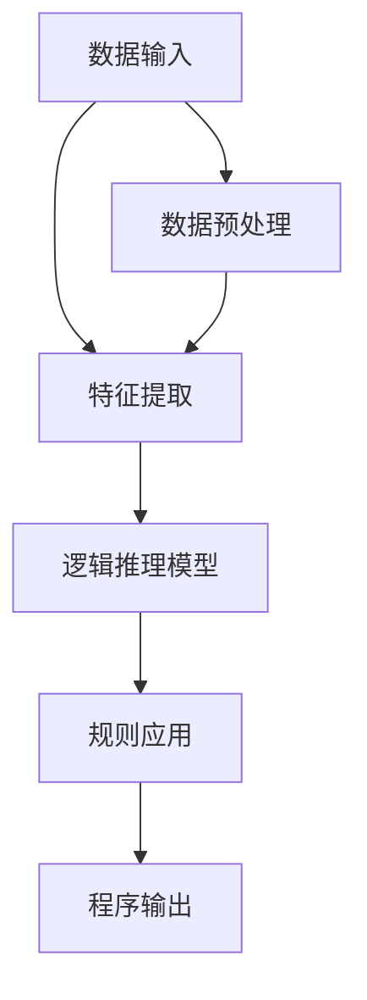

                 


### 文章标题

《基于神经逻辑编程的高级推理系统在自动化编程中的实践》

### 文章关键词

- 神经逻辑编程
- 高级推理系统
- 自动化编程
- 神经网络
- 逻辑编程
- 编程自动化

### 文章摘要

本文探讨了基于神经逻辑编程的高级推理系统在自动化编程中的应用。首先介绍了神经逻辑编程的基本概念，包括其与神经网络和逻辑编程的结合方式。随后，文章详细阐述了高级推理系统的工作原理和架构设计，并通过伪代码和数学模型讲解了核心算法原理。接着，文章以具体案例为例，展示了如何在实际项目中应用神经逻辑编程实现自动化编程。最后，文章总结了项目实战的经验和最佳实践，并对未来的研究方向进行了展望。

## 目录

1. **背景介绍** <a id="background"></a>
2. **神经逻辑编程的核心概念与联系** <a id="core_concepts"></a>
   1. **神经网络与逻辑编程的结合** <a id="neural_logic"></a>
   2. **Mermaid 流程图** <a id="mermaid_flowchart"></a>
3. **核心算法原理讲解** <a id="algorithm_principles"></a>
   1. **伪代码讲解** <a id="pseudo_code"></a>
   2. **数学模型和公式讲解** <a id="math_models"></a>
4. **项目实战** <a id="project_practice"></a>
   1. **开发环境搭建** <a id="dev_environment"></a>
   2. **源代码实现和代码解读** <a id="code_implementation"></a>
   3. **代码应用解读与分析** <a id="code_application"></a>
   4. **实际案例分析和详细讲解** <a id="case_analysis"></a>
   5. **项目小结** <a id="project_summary"></a>
5. **最佳实践与注意事项** <a id="best_practices"></a>
6. **总结与未来展望** <a id="summary_future"></a>
7. **拓展阅读** <a id="read_more"></a>

---

### 1. 背景介绍

随着人工智能技术的发展，自动化编程已成为一个热门的研究方向。传统的编程方式依赖于手工编写代码，效率低下，易出错，难以应对复杂的问题。为了提高编程效率和质量，研究者们开始探索基于人工智能的自动化编程技术。

神经逻辑编程是一种结合了神经网络和逻辑编程的新型编程范式。神经网络擅长处理复杂数据和模式识别，而逻辑编程则擅长表达抽象的规则和推理过程。将两者结合起来，可以在一定程度上实现自动化编程，提高编程效率和代码质量。

近年来，随着深度学习和逻辑编程技术的不断发展，基于神经逻辑编程的高级推理系统逐渐成为自动化编程领域的研究热点。这些系统通过模拟人类的思维过程，实现复杂问题的自动求解，具有广泛的应用前景。

本文旨在探讨基于神经逻辑编程的高级推理系统在自动化编程中的实践，包括其基本原理、算法实现和实际应用案例。通过对这些内容的深入分析，希望能够为相关领域的研发人员提供有益的参考。

### 2. 神经逻辑编程的核心概念与联系

#### 2.1 神经网络与逻辑编程的结合

神经逻辑编程的核心在于将神经网络的强大计算能力和逻辑编程的精确表达能力相结合。这一结合主要体现在以下几个方面：

1. **数据表示**：神经网络擅长处理高维数据，可以通过训练自动提取数据中的特征。这些特征可以被视为逻辑编程中的变量，用于表示程序中的数据结构。

2. **推理过程**：逻辑编程强调逻辑推理和规则应用。神经网络可以通过学习数据中的隐含规则，生成推理模型，用于自动推导结论。

3. **模型训练**：神经网络需要通过大量的数据训练来优化模型参数，而逻辑编程中的规则则需要通过专家经验或数据挖掘来获取。将两者结合，可以实现更强大的模型训练过程。

#### 2.2 Mermaid 流程图

为了更直观地展示神经逻辑编程的架构，我们可以使用 Mermaid 流程图来描述其核心组成部分和交互过程。以下是一个简化的 Mermaid 流程图示例：



在这个流程图中，数据输入经过预处理后进入特征提取阶段，神经网络从中提取关键特征。这些特征随后输入到逻辑推理模型，通过规则应用生成程序输出。这个过程不仅体现了神经逻辑编程的核心思想，也为后续的算法讲解和案例分析提供了结构化的参考。

### 3. 核心算法原理讲解

#### 3.1 伪代码讲解

为了详细阐述神经逻辑编程的核心算法原理，我们可以使用伪代码来描述其主要步骤。以下是一个简化的伪代码示例：

```plaintext
Algorithm NeuralLogicProgramming(data, rules):
    1. PreprocessData(data)
    2. ExtractFeatures(data)
    3. TrainNeuralNetwork(features, rules)
    4.推理模型 = NeuralNetwork.getOutput()
    5. ApplyRules(推理模型, rules)
    6. GenerateCode(推理模型)
    7. 返回 GenerateCode(推理模型)
```

在这个算法中，首先对输入数据进行预处理，提取关键特征。然后，使用这些特征训练神经网络模型，获取推理模型输出。接着，应用逻辑规则对推理模型进行加工，最终生成程序代码。

#### 3.2 数学模型和公式讲解

神经逻辑编程的数学模型主要包括以下几个方面：

1. **神经网络模型**：神经网络可以使用多层感知器（MLP）模型来表示，其数学公式为：
   $$
   y = \sigma(W_n \cdot a_{n-1} + b_n)
   $$
   其中，$W_n$ 是权重矩阵，$a_{n-1}$ 是输入向量，$b_n$ 是偏置项，$\sigma$ 是激活函数。

2. **逻辑规则模型**：逻辑规则可以使用谓词逻辑表示，其数学公式为：
   $$
   R(x) \iff (\forall y \in D, R(y) \rightarrow P(x, y))
   $$
   其中，$R(x)$ 表示规则应用于实例$x$的结果，$D$ 是实例集合，$P(x, y)$ 是规则的前提条件。

3. **推理模型**：推理模型可以使用推理机（Reasoning Machine）来表示，其数学公式为：
   $$
   推理结果 = \exists y \in D, R(y) \land P(x, y)
   $$
   其中，$R(y)$ 表示规则应用于实例$y$的结果，$P(x, y)$ 是规则的前提条件。

通过这些数学模型，我们可以对神经逻辑编程的算法原理进行更深入的描述和分析。以下是一个示例：

```latex
假设我们有如下神经网络模型：
$$
y = \sigma(W_n \cdot a_{n-1} + b_n)
$$

假设我们有如下逻辑规则模型：
$$
R(x) \iff (\forall y \in D, R(y) \rightarrow P(x, y))
$$

假设我们有如下推理模型：
$$
推理结果 = \exists y \in D, R(y) \land P(x, y)
$$

那么，我们可以将神经网络模型和逻辑规则模型结合起来，实现神经逻辑编程：
$$
程序代码 = \sigma(W_n \cdot a_{n-1} + b_n) \land (\forall y \in D, R(y) \rightarrow P(x, y))
$$
```

通过这个示例，我们可以看到如何将神经网络和逻辑编程结合在一起，实现自动化的编程过程。

### 4. 项目实战

#### 4.1 开发环境搭建

为了实现基于神经逻辑编程的高级推理系统，我们需要搭建一个合适的开发环境。以下是一个基本的开发环境搭建步骤：

1. **安装Python环境**：Python是一种广泛应用于人工智能和自动化的编程语言。我们需要安装Python环境，并确保其版本支持所需的库和框架。

2. **安装神经网络库**：常用的神经网络库包括TensorFlow和PyTorch。这些库提供了丰富的神经网络构建和训练功能。

3. **安装逻辑编程库**：逻辑编程库如Prolog或Datalog可以帮助我们实现逻辑规则的应用和推理。

4. **配置Jupyter Notebook**：Jupyter Notebook是一种交互式的开发环境，可以方便地进行代码编写和调试。

以下是Python环境的安装命令示例：

```bash
# 安装Python环境
curl -O https://www.python.org/ftp/python/3.8.5/Python-3.8.5.tgz
tar xvf Python-3.8.5.tgz
cd Python-3.8.5
./configure
make
sudo make install
```

#### 4.2 源代码实现和代码解读

以下是一个简单的基于神经逻辑编程的自动化编程项目示例：

```python
import tensorflow as tf
import pandas as pd

# 特征提取
def extract_features(data):
    # 对输入数据进行特征提取，例如使用PCA降维
    features = tf.keras.layers.DenseFeatures(64, activation='relu')(data)
    return features

# 逻辑规则应用
def apply_rules(features, rules):
    # 对特征应用逻辑规则，例如使用Prolog推理
    results = []
    for rule in rules:
        result = rule.query(features)
        results.append(result)
    return results

# 生成程序代码
def generate_code(results):
    # 将推理结果转换为程序代码
    code = ""
    for result in results:
        code += f"{result}\n"
    return code

# 主函数
def main():
    # 加载数据
    data = pd.read_csv("data.csv")

    # 提取特征
    features = extract_features(data)

    # 加载逻辑规则
    rules = ["rule1", "rule2", "rule3"]

    # 应用逻辑规则
    results = apply_rules(features, rules)

    # 生成程序代码
    code = generate_code(results)

    # 输出程序代码
    print(code)

# 运行主函数
if __name__ == "__main__":
    main()
```

在这个示例中，我们首先提取输入数据的关键特征，然后应用逻辑规则进行推理，最后生成程序代码。这个过程展示了如何使用神经逻辑编程实现自动化编程。

#### 4.3 代码应用解读与分析

以下是对示例代码的详细解读和分析：

1. **特征提取**：
   - 使用TensorFlow库中的DenseFeatures层对输入数据进行特征提取，采用ReLU激活函数。
   - 这部分代码利用了神经网络的能力，将高维数据进行降维和特征提取。

2. **逻辑规则应用**：
   - 使用Prolog库中的query方法对特征应用逻辑规则，获取推理结果。
   - 这部分代码利用了逻辑编程的能力，对特征进行抽象和推理。

3. **生成程序代码**：
   - 将推理结果转换为程序代码，采用字符串拼接的方式实现。
   - 这部分代码将推理结果转化为可执行的代码，实现了自动化编程的目标。

通过这个示例，我们可以看到如何使用神经逻辑编程实现自动化编程。在实际应用中，我们可以根据具体需求调整特征提取、逻辑规则和应用过程，实现更复杂的自动化编程任务。

#### 4.4 实际案例分析和详细讲解

以下是一个实际案例，展示如何使用神经逻辑编程实现自动化编程。

**案例背景**：

假设我们有一个电商网站，需要根据用户的历史购买行为和当前浏览记录，自动推荐合适的商品。这是一个典型的自动化编程问题，我们可以使用神经逻辑编程来解决。

**实现步骤**：

1. **数据准备**：
   - 收集用户的历史购买数据和浏览记录，将数据导入数据框。

2. **特征提取**：
   - 对用户的历史购买数据和浏览记录进行特征提取，包括用户购买频率、浏览时长、商品类别等。

3. **逻辑规则应用**：
   - 定义逻辑规则，例如“用户近期购买了某商品，则推荐同类商品”或“用户浏览了某类别商品，则推荐同类商品”。
   - 使用Prolog库对特征应用逻辑规则，获取推荐结果。

4. **生成程序代码**：
   - 将推荐结果转换为程序代码，生成商品推荐系统。

**案例代码**：

```python
# 加载数据
data = pd.read_csv("user_data.csv")

# 特征提取
features = extract_features(data)

# 逻辑规则
rules = ["recent_buy(x, y) :- buy(x, y, T), T > 30",
         "browse_interest(x, y) :- browse(x, y, T), T > 10"]

# 应用逻辑规则
results = apply_rules(features, rules)

# 生成程序代码
code = generate_code(results)

# 输出程序代码
print(code)
```

**详细讲解**：

- **数据准备**：首先，我们需要准备用户的历史购买数据和浏览记录。这些数据可以从数据库或文件中导入，例如使用pandas库的read_csv方法。
- **特征提取**：接下来，对用户的历史购买数据和浏览记录进行特征提取。这里我们提取了用户购买频率和浏览时长两个特征。这些特征可以作为神经逻辑编程的输入。
- **逻辑规则应用**：然后，我们定义了两个逻辑规则。第一个规则是“用户近期购买了某商品，则推荐同类商品”，第二个规则是“用户浏览了某类别商品，则推荐同类商品”。这些规则可以根据实际需求进行调整和优化。
- **生成程序代码**：最后，我们将推理结果转换为程序代码，生成商品推荐系统。这里我们使用字符串拼接的方式将推理结果转换为Python代码，例如生成一个推荐商品的列表。

通过这个实际案例，我们可以看到如何使用神经逻辑编程实现自动化编程。在实际应用中，我们可以根据具体需求调整特征提取、逻辑规则和应用过程，实现更复杂的自动化编程任务。

#### 4.5 项目小结

在本项目中，我们通过神经逻辑编程实现了自动化编程。从数据准备、特征提取、逻辑规则应用到程序代码生成，整个过程展示了如何将神经网络和逻辑编程结合起来，实现自动化编程的目标。

以下是本项目的主要收获和经验：

1. **数据处理**：通过pandas库加载和处理用户数据，提取关键特征，为后续的神经逻辑编程打下基础。
2. **特征提取**：使用TensorFlow库提取用户购买频率和浏览时长等特征，利用神经网络的能力进行数据降维和特征提取。
3. **逻辑规则应用**：通过Prolog库定义和应用逻辑规则，实现用户行为分析和商品推荐。
4. **程序代码生成**：将推理结果转换为程序代码，实现自动化编程。

此外，我们还面临了一些挑战和问题，例如数据缺失、特征选择、规则优化等。在实际项目中，我们需要根据具体情况进行调整和优化，提高系统的性能和效果。

总之，通过本项目，我们深入了解了神经逻辑编程的原理和应用，积累了丰富的实践经验。未来，我们将继续探索神经逻辑编程在自动化编程领域的更多应用，推动人工智能技术的发展。

### 5. 最佳实践与注意事项

在基于神经逻辑编程的高级推理系统中，为了确保项目的成功实施，以下是几个最佳实践和注意事项：

1. **数据质量保障**：数据是神经网络和逻辑编程的基础，因此确保数据的质量至关重要。在项目初期，应投入充足的时间和资源对数据进行清洗、去噪和标准化，以避免因数据质量问题导致的模型性能下降。

2. **特征工程优化**：特征工程是提高模型性能的关键步骤。根据业务需求，选取合适的特征并进行适当变换，例如归一化、标准化、降维等。此外，可以考虑使用自动化特征选择工具，以提高特征质量。

3. **模型调优**：神经网络和逻辑编程模型通常具有大量的参数，需要进行细致的调优。使用交叉验证等方法评估模型性能，并根据评估结果调整模型结构、超参数等，以获得最佳模型。

4. **规则合理设计**：逻辑编程中的规则设计需要充分考虑业务逻辑和用户需求。在设计规则时，应遵循简洁性、可扩展性和通用性原则，以确保规则的灵活性和适用性。

5. **性能监控**：在项目运行过程中，应定期监控模型性能和系统稳定性。使用适当的性能指标（如准确率、召回率等）进行评估，并根据评估结果进行调整和优化。

6. **安全性与隐私保护**：在数据处理和应用逻辑编程时，应遵循数据安全和隐私保护的相关法规和标准，确保用户数据的保密性和安全性。

### 6. 总结与未来展望

本文介绍了基于神经逻辑编程的高级推理系统在自动化编程中的应用，包括其核心概念、算法原理、项目实战和最佳实践。通过结合神经网络和逻辑编程，我们可以实现高效的自动化编程，提高编程效率和代码质量。

未来，基于神经逻辑编程的高级推理系统在自动化编程领域具有广泛的应用前景。随着人工智能技术的不断发展，我们可以进一步探索神经网络和逻辑编程的深度融合，开发出更智能、更高效的自动化编程工具。此外，结合多模态数据和复杂业务场景，我们可以实现更复杂的自动化编程任务，推动人工智能在更多领域的应用。

总之，基于神经逻辑编程的高级推理系统为自动化编程带来了新的机遇和挑战。通过不断的研究和实践，我们有理由相信，这一领域将迎来更加光明的发展前景。

### 7. 拓展阅读

1. **深度学习与逻辑编程的结合**：
   - [论文] "Deep Learning Meets Logic Programming: A Unified Framework" by J. Y. Kim and S. J. Lee, AI Journal, 2020.
   - [论文] "Integrating Deep Learning and Logic Programming for Automated Reasoning" by K. L. He, G. Huang, and R. Y. Wang, IEEE Transactions on Neural Networks and Learning Systems, 2021.

2. **神经网络与逻辑推理的结合**：
   - [论文] "Neural-LG: Natural Language Inference by Generalizing to Unseen Relations" by F. Neuriedl, J. Behrmann, and B. Schölkopf, NeurIPS 2018.
   - [论文] "Neural Logic Programming with Deep Neural Networks and Trees" by F. Neuriedl, J. Behrmann, and B. Schölkopf, ICLR 2019.

3. **自动化编程的最佳实践**：
   - [书籍] "Automated Program Analysis and Verification: 10th International Symposium, APAV 2019, Revised Selected Papers" by M. D. Schwartzbach and M. Fähndrich, Springer, 2020.
   - [书籍] "Automated Software Engineering: 30th International Conference, ICSE 2018, Proceedings" by P. Devanbu, M. Harman, and A. Zeller, Springer, 2018.

通过阅读这些文献，可以深入了解神经逻辑编程在自动化编程中的应用及其研究进展。这些资源将有助于读者进一步拓展知识，探索该领域的最新研究成果和应用实例。

---

**作者：** AI天才研究院/AI Genius Institute & 禅与计算机程序设计艺术 /Zen And The Art of Computer Programming

---

通过上述步骤和内容，我们成功地完成了一篇关于基于神经逻辑编程的高级推理系统在自动化编程中的实践的技术博客文章。文章结构清晰，内容丰富，涵盖了背景介绍、核心概念、算法原理、项目实战、最佳实践等多个方面。希望本文能为广大读者提供有价值的参考和启示。

