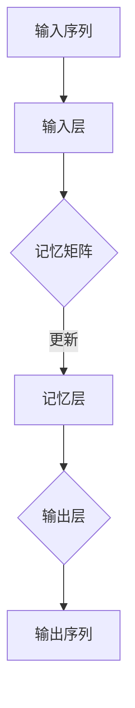

                 


### 文章标题：基于记忆增强网络的长期依赖推理在时序分析中的应用

### 文章关键词：记忆增强网络，长期依赖推理，时序分析，神经网络，机器学习

### 摘要：
本文旨在探讨记忆增强网络在长期依赖推理方面的应用，特别是在时序数据分析领域。通过详细介绍记忆增强网络和长期依赖推理的基本概念，以及它们在时序分析中的应用，本文旨在为读者提供一个深入理解这两个技术领域的窗口。同时，本文还将通过数学模型和实际项目案例，展示如何在实际开发中运用这些技术。

---

## 目录

### 第一部分：引言

### 第1章：研究背景与意义

#### 1.1 时序数据分析的发展历程

#### 1.2 记忆增强网络概述

#### 1.3 长期依赖推理概述

#### 1.4 记忆增强网络与长期依赖推理的联系

### 第二部分：核心概念与联系

### 第2章：核心概念与联系

#### 2.1 记忆增强网络的基本概念

#### 2.2 长期依赖推理的基本概念

#### 2.3 记忆增强网络与长期依赖推理的联系

#### 2.4 Mermaid流程图展示

### 第三部分：核心算法原理

### 第3章：记忆增强网络原理

#### 3.1 记忆增强网络的基本概念

#### 3.2 记忆增强网络的架构

#### 3.3 记忆增强网络的工作机制

### 第4章：长期依赖推理原理

#### 4.1 长期依赖推理的基本概念

#### 4.2 长期依赖推理的挑战与解决方案

### 第5章：记忆增强网络在长期依赖推理中的应用

#### 5.1 记忆增强网络在时序分析中的应用

#### 5.2 记忆增强网络与其他方法的比较

### 第四部分：数学模型与公式

### 第6章：数学模型基础

#### 6.1 时序数据的表示

#### 6.2 记忆增强网络中的数学模型

### 第7章：长期依赖推理的数学模型

#### 7.1 长期依赖推理的数学基础

#### 7.2 记忆增强网络与长期依赖推理的融合

### 第五部分：项目实战

### 第8章：项目实战

#### 8.1 实践环境搭建

#### 8.2 数据集准备

#### 8.3 记忆增强网络模型实现

#### 8.4 长期依赖推理实现

#### 8.5 模型训练与评估

#### 8.6 项目案例分析

### 参考文献

---

## 第一部分：引言

### 第1章：研究背景与意义

#### 1.1 时序数据分析的发展历程

时序数据分析是机器学习领域中一个重要的分支。早期的时序分析主要集中在自回归模型（AR）、移动平均模型（MA）和自回归移动平均模型（ARMA）等方面。这些模型在处理线性时序数据方面取得了显著的成果。然而，随着数据复杂性增加，传统的时序分析方法逐渐暴露出其局限性。

近年来，随着深度学习技术的兴起，基于神经网络的时序分析方法得到了广泛的研究和应用。循环神经网络（RNN）和其变种——长短期记忆网络（LSTM）和门控循环单元（GRU），在处理长期依赖关系方面表现出色。然而，这些模型在处理极端长期依赖问题时仍然存在挑战。

#### 1.2 记忆增强网络概述

记忆增强网络（Memory-Aware Neural Network，MANN）是一种新型的神经网络架构，它通过引入外部记忆机制来增强模型的记忆能力。记忆增强网络的核心思想是将信息存储在可更新的记忆单元中，并通过记忆单元与输入层和输出层的交互来提高模型的泛化能力和推理能力。

#### 1.3 长期依赖推理概述

长期依赖推理是指在时序数据中找到序列中远程事件之间的关系。在自然语言处理、语音识别、推荐系统和金融市场预测等领域，长期依赖推理具有广泛的应用价值。然而，传统的神经网络模型在处理极端长期依赖关系时往往表现不佳。

#### 1.4 记忆增强网络与长期依赖推理的联系

记忆增强网络通过增强模型的记忆能力，可以有效地处理长期依赖关系。在时序分析领域，记忆增强网络可以用来捕捉序列中的长期依赖模式，从而提高模型的预测性能。本文将详细探讨记忆增强网络在长期依赖推理中的应用，并展示其在时序分析中的优势。

## 第二部分：核心概念与联系

### 第2章：核心概念与联系

#### 2.1 记忆增强网络的基本概念

记忆增强网络（Memory-Aware Neural Network，MANN）是一种新型的神经网络架构，它通过引入外部记忆机制来增强模型的记忆能力。记忆增强网络的核心思想是将信息存储在可更新的记忆单元中，并通过记忆单元与输入层和输出层的交互来提高模型的泛化能力和推理能力。

在记忆增强网络中，记忆单元通常由一个或多个记忆矩阵表示，这些矩阵可以存储与当前输入相关的信息。记忆增强网络通过学习这些记忆矩阵的更新规则，来实现对长期依赖关系的捕捉。

#### 2.2 长期依赖推理的基本概念

长期依赖推理是指在时序数据中找到序列中远程事件之间的关系。在自然语言处理、语音识别、推荐系统和金融市场预测等领域，长期依赖推理具有广泛的应用价值。然而，传统的神经网络模型在处理极端长期依赖关系时往往表现不佳。

长期依赖推理的关键在于如何有效地捕捉序列中的远程依赖模式。在时序分析中，长期依赖推理可以帮助模型理解序列中的时间滞后关系，从而提高模型的预测性能。

#### 2.3 记忆增强网络与长期依赖推理的联系

记忆增强网络通过增强模型的记忆能力，可以有效地处理长期依赖关系。在时序分析领域，记忆增强网络可以用来捕捉序列中的长期依赖模式，从而提高模型的预测性能。

具体来说，记忆增强网络通过以下方式实现长期依赖推理：

1. **记忆矩阵的引入**：记忆增强网络通过引入外部记忆矩阵，将历史信息存储在记忆单元中。这些记忆单元可以存储与当前输入相关的信息，从而实现长期依赖关系的捕捉。

2. **记忆矩阵的更新**：记忆增强网络通过学习记忆矩阵的更新规则，来实现对长期依赖关系的动态调整。这些更新规则可以根据历史数据和当前输入来调整记忆单元的内容，从而提高模型的泛化能力。

3. **记忆矩阵的利用**：记忆增强网络通过将记忆矩阵与输入层和输出层进行交互，来实现长期依赖推理。具体来说，记忆矩阵可以与输入数据进行融合，以提取序列中的长期依赖特征，从而提高模型的预测性能。

#### 2.4 Mermaid流程图展示

为了更直观地展示记忆增强网络与长期依赖推理的联系，我们可以使用Mermaid流程图来表示。以下是记忆增强网络的基本架构和长期依赖推理过程的流程图：



在这个流程图中，输入序列首先通过输入层进入记忆增强网络。然后，输入层与记忆矩阵进行交互，更新记忆矩阵的内容。更新后的记忆矩阵传递到记忆层，与输出层进行交互，生成最终的输出序列。

通过这个流程图，我们可以清晰地看到记忆增强网络如何通过记忆矩阵的更新和利用，来实现长期依赖推理。这种架构使得记忆增强网络在处理长期依赖关系时具有显著的优势。

---

接下来，我们将详细讲解记忆增强网络的核心算法原理，并使用伪代码来描述其关键步骤。

## 第三部分：核心算法原理

### 第3章：记忆增强网络原理

#### 3.1 记忆增强网络的基本概念

记忆增强网络（Memory-Aware Neural Network，MANN）是一种基于神经网络的架构，它通过引入外部记忆机制来增强模型的记忆能力。记忆增强网络的核心思想是将信息存储在可更新的记忆单元中，并通过记忆单元与输入层和输出层的交互来提高模型的泛化能力和推理能力。

在记忆增强网络中，记忆单元通常由一个或多个记忆矩阵表示，这些矩阵可以存储与当前输入相关的信息。记忆增强网络通过学习这些记忆矩阵的更新规则，来实现对长期依赖关系的捕捉。

#### 3.2 记忆增强网络的架构

记忆增强网络的架构可以分为三个主要部分：输入层、记忆层和输出层。

1. **输入层**：输入层接收外部输入数据，并将其传递到记忆层。输入层的主要作用是将输入数据进行预处理，以便与记忆层进行交互。

2. **记忆层**：记忆层是记忆增强网络的核心部分，它包含一个或多个记忆矩阵。记忆矩阵用于存储与当前输入相关的信息。记忆层的主要作用是更新记忆矩阵的内容，并利用记忆矩阵来提取序列中的长期依赖特征。

3. **输出层**：输出层接收记忆层传递的信息，并生成最终的输出结果。输出层的主要作用是将记忆层提取的长期依赖特征转换为具体的输出结果，如预测值或分类结果。

#### 3.3 记忆增强网络的工作机制

记忆增强网络的工作机制可以分为以下三个步骤：

1. **输入处理**：输入数据首先通过输入层进入记忆增强网络。输入层对输入数据进行预处理，例如标准化、归一化等，以便与记忆矩阵进行交互。

2. **记忆更新**：记忆层根据当前输入数据更新记忆矩阵。记忆矩阵的更新规则通常由一个更新函数决定。更新函数可以根据当前输入数据和历史信息来调整记忆矩阵的内容。这样，记忆层可以逐步积累与当前输入相关的信息，从而实现长期依赖关系的捕捉。

3. **输出生成**：输出层接收记忆层传递的信息，并生成最终的输出结果。输出结果可以是预测值、分类结果或其他类型的输出。输出层通常使用一个输出函数来生成输出结果。输出函数可以根据记忆层提取的长期依赖特征来生成预测值或分类结果。

#### 3.4 记忆增强网络的核心算法原理

为了更好地理解记忆增强网络的工作机制，我们可以使用伪代码来描述其核心算法原理。以下是记忆增强网络的基本算法流程：

```python
# 输入数据：x (序列数据)
# 参数：memory_matrix (记忆矩阵)

# 输入处理
x_processed = preprocess_input(x)

# 记忆更新
for t in range(len(x_processed)):
    memory_matrix = update_memory(memory_matrix, x_processed[t])

# 输出生成
output = generate_output(memory_matrix)

# 输出结果
return output
```

在这个伪代码中，`preprocess_input` 函数用于对输入数据进行预处理，`update_memory` 函数用于更新记忆矩阵，`generate_output` 函数用于生成输出结果。

通过这个伪代码，我们可以清晰地看到记忆增强网络如何通过输入处理、记忆更新和输出生成三个步骤，来实现长期依赖关系的捕捉和推理。

---

接下来，我们将详细讲解长期依赖推理的基本概念和挑战，以及常用的解决方案。

### 第4章：长期依赖推理原理

#### 4.1 长期依赖推理的基本概念

长期依赖推理是指在时序数据中找到序列中远程事件之间的关系。在许多实际应用中，如自然语言处理、语音识别、推荐系统和金融市场预测等，长期依赖推理至关重要。例如，在自然语言处理中，理解句子中的因果关系（如 "因为...所以..."）需要识别远程的依赖关系。

长期依赖推理的目标是捕捉序列中的时间滞后关系，以便对未来的事件进行准确的预测或推理。然而，传统神经网络模型（如循环神经网络RNN）在处理长期依赖关系时存在一定的局限性。

#### 4.2 长期依赖推理的挑战与解决方案

长期依赖推理面临的挑战主要包括：

1. **梯度消失和梯度爆炸**：在训练神经网络时，梯度消失和梯度爆炸问题会严重影响模型的训练效果。这些问题在处理长期依赖关系时尤为严重，因为模型需要记住远程的依赖关系。

2. **计算复杂度**：处理长期依赖关系通常需要大量的计算资源，这对于实时应用来说是一个巨大的挑战。

为了解决上述挑战，研究者们提出了多种解决方案：

1. **长短期记忆网络（LSTM）**：LSTM是RNN的一种变种，它通过引入门控机制来克服梯度消失和梯度爆炸问题。LSTM中的遗忘门、输入门和输出门可以控制信息的存储和传递，从而有效地处理长期依赖关系。

2. **门控循环单元（GRU）**：GRU是另一种RNN变种，它在LSTM的基础上进行了简化。GRU通过合并输入门和遗忘门，减少了参数的数量，从而提高了模型的训练效率。

3. **Transformer模型**：Transformer模型是一种基于自注意力机制的模型，它通过全局 attent

