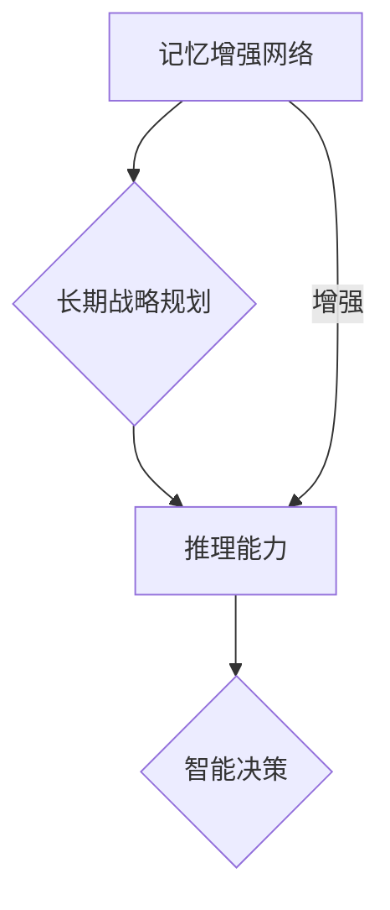
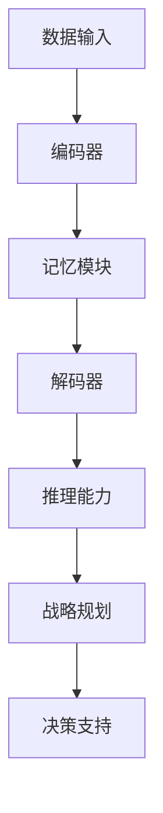

                 

### 引言：核心概念与联系

#### 核心概念介绍

在现代人工智能领域，记忆增强网络（Memory-Augmented Neural Networks，简称MemNN）作为一种新兴的神经网络结构，已经引起了广泛的关注。记忆增强网络通过将外部记忆模块集成到神经网络中，增强了模型的记忆能力和长期依赖处理能力，使其在许多任务中表现出色。

长期战略规划（Long-Term Strategic Planning）是企业或组织在长期内（通常为数年或更长时间）制定的总体目标和行动方案。它涉及多个方面的决策，包括目标设定、资源分配、风险评估等，旨在确保组织在竞争激烈的市场环境中持续发展。

推理能力（Reasoning Ability）是指系统在处理信息时，根据已知事实推断出未知信息的能力。推理能力对于人工智能系统至关重要，因为它是实现智能行为和决策的基础。

为了更好地理解这些核心概念，我们可以使用Mermaid流程图来展示它们之间的联系。

在上述流程图中，记忆增强网络通过增强系统的记忆能力，直接提升了推理能力，进而支持更智能的决策。

#### 核心概念与联系

记忆增强网络（MemNN）的核心在于其能够利用外部记忆模块来存储和检索信息。这种网络结构通常包括编码器、记忆模块和解码器三个主要部分。编码器负责将输入数据转换为编码向量，记忆模块用于存储这些编码向量，并允许根据查询信息进行快速检索，解码器则负责将检索到的编码向量解码为输出结果。

长期战略规划（Long-Term Strategic Planning）则是一个涉及多个阶段和步骤的复杂过程。它通常包括以下几个关键组成部分：

1. **目标设定**：明确组织在长期内希望实现的愿景和具体目标。
2. **资源分配**：确定为实现目标所需的资源和预算，并进行合理的分配。
3. **风险评估**：评估可能面临的风险，并制定相应的应对措施。
4. **执行与监控**：确保战略规划的执行，并通过定期监控评估其效果。

推理能力（Reasoning Ability）是人工智能系统的重要特征，它涵盖了多种推理类型，如演绎推理、归纳推理和类比推理等。这些推理类型使系统能够从已知信息中推断出新的知识或解决方案。

记忆增强网络、长期战略规划和推理能力之间的联系在于，记忆增强网络能够为长期战略规划提供更强的记忆和推理支持，从而帮助组织更有效地制定和实施战略规划。具体来说，记忆增强网络可以通过以下方式提升长期战略规划的效率：

1. **记忆能力增强**：通过外部记忆模块，系统能够存储大量的历史数据和相关信息，为战略规划提供丰富的背景信息。
2. **推理能力提升**：记忆增强网络增强了系统的推理能力，使其能够更好地处理长期战略规划中的复杂问题和依赖关系。
3. **决策支持**：基于记忆和推理能力，系统能够提供更准确的决策支持，帮助组织在战略规划过程中做出更明智的选择。

为了更好地理解这些概念之间的联系，我们可以绘制一个简化的Mermaid流程图。

在这个流程图中，数据输入首先通过编码器进行编码，然后存储到记忆模块中。解码器根据查询信息从记忆模块中检索相关数据，并通过推理能力进行进一步的加工，最终为战略规划提供决策支持。

### 摘要

本文深入探讨了记忆增强网络、长期战略规划和推理能力这三个核心概念，并详细分析了它们之间的联系和相互作用。记忆增强网络通过增强记忆和推理能力，为长期战略规划提供了强大的支持。本文首先介绍了记忆增强网络的基本原理和结构，然后阐述了长期战略规划的理论基础，最后探讨了推理能力的定义和分类。通过实际项目案例，本文展示了记忆增强网络在长期战略规划中的应用，并分析了其带来的实际效益。总结而言，记忆增强网络在长期战略规划推理中具有重要价值，有助于提高组织的战略决策效率和准确性。未来，随着人工智能技术的不断发展，记忆增强网络在长期战略规划领域的应用前景将更加广阔。

