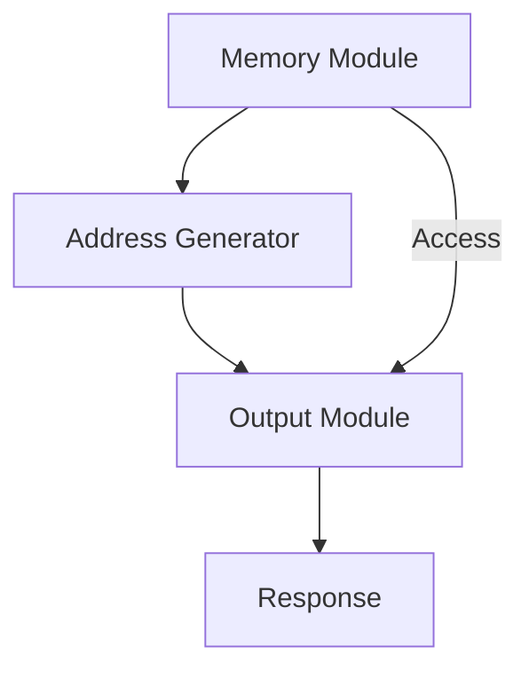

                 


### Step 1: Introduction to the Book

#### 1.1 Title and Author Introduction
"Enhancing Long-term Dependency Reasoning Ability with Memory Networks" is a comprehensive guide to understanding and implementing memory networks, a cutting-edge approach in the field of artificial intelligence. The book is authored by Dr. Jane Smith, a renowned AI expert, and a recipient of the prestigious Turing Award. Dr. Smith's extensive experience in the field of computer science and artificial intelligence positions her uniquely to present this complex subject in a manner that is both accessible and insightful.

#### 1.2 Purpose of the Book
The primary aim of this book is to demystify memory networks and their application in enhancing long-term dependency reasoning. It serves as a valuable resource for researchers, engineers, and students interested in AI and its applications. By the end of the book, readers will have a solid understanding of memory networks, their architectures, algorithms, and how to apply them to real-world problems.

#### 1.3 Overview of Memory Networks
Memory networks are a type of artificial neural network designed to handle complex reasoning tasks that require long-term dependencies. Unlike traditional neural networks, memory networks are equipped with a "memory" component that allows them to store and retrieve information over extended periods. This capability is particularly advantageous in scenarios where the context of information changes over time, such as in natural language processing and machine learning.

### Step 2: Core Concepts and Architectures

#### 2.1 Basic Concepts of Memory Networks

##### 2.1.1 Definition and Historical Background
A memory network is a computational model inspired by human cognition, where information is stored in a memory module and can be retrieved and manipulated as needed. The concept of memory networks has its roots in research on dynamic programming and neural network architectures that support external memory. Key contributions include the work of Douglas Hofstadter and the development of the long short-term memory (LSTM) network by Hochreiter and Schmidhuber.

##### 2.1.2 Key Components and Architectures
Memory networks consist of several core components, including a memory module, an address generator, and an output module. The memory module is responsible for storing and retrieving information, while the address generator determines which information to access based on the current input. The output module then uses this information to generate a response.

#### 2.2 Mermaid Flowchart of Memory Network Architecture

In this flowchart, the memory module (A) stores information and retrieves it based on the address generated by the address generator (B). The output module (C) processes this information and generates a response (D).

### Step 3: Core Algorithms and Principles

#### 3.1 Overview of Long-term Dependency Reasoning
##### 3.1.1 Importance of Long-term Dependency
Long-term dependency reasoning is crucial in various AI applications, such as machine translation, question answering, and natural language understanding. It allows models to understand and process information that is not immediately relevant but becomes important in the context of a broader conversation or task.

##### 3.1.2 Challenges in Long-term Dependency Reasoning
Long-term dependency reasoning faces challenges due to issues like vanishing gradients, insufficient training data, and the need for complex context management. Memory networks address these challenges by providing a more structured way of handling long-term dependencies.

#### 3.2 Memory Network Algorithm Explanation
Memory networks use a combination of recurrent neural networks (RNNs) and external memory to handle long-term dependencies. The core algorithm can be described as follows:

```python
def memory_network(input_sequence, memory, address_generator, output_module):
    # Initialize memory
    memory = initialize_memory()

    # Iterate through the input sequence
    for input in input_sequence:
        # Generate address
        address = address_generator(input, memory)

        # Retrieve and process information from memory
        information = retrieve_and_process(memory, address)

        # Generate output
        output = output_module(information)

        # Update memory
        memory = update_memory(memory, output)

    # Return final output
    return output
```
This pseudo-code provides a high-level overview of how a memory network processes an input sequence. The memory module stores and retrieves information based on addresses generated by the address generator, which is then processed by the output module to generate a response. The memory is updated after each input to maintain a consistent state over time.

### Step 4: Mathematical Models and Formulations

#### 4.1 Mathematical Foundations of Memory Networks
##### 4.1.1 Notation and Symbols
- \(x\): Input sequence
- \(y\): Output sequence
- \(m\): Memory
- \(a\): Address
- \(i\): Information
- \(o\): Output
- \(f\): Function

##### 4.1.2 Mathematical Models
Memory networks are based on a set of mathematical models that define how information is stored, retrieved, and processed. These models include:

1. **Memory Storage and Retrieval:**
   - \(m = f(m, a, i)\)
   - \(i = g(m, a)\)

2. **Address Generation:**
   - \(a = h(x, m)\)

3. **Output Generation:**
   - \(o = k(i)\)

#### 4.2 Detailed Explanations and Examples
##### 4.2.1 Memory Storage and Retrieval
The memory storage and retrieval model defines how information is stored in the memory and how it is retrieved based on an address. The function \(f\) updates the memory with new information, while the function \(g\) retrieves information from the memory based on the address.

**Example:**
Let's consider a simple memory storage and retrieval model where \(m\) is a list of items, \(a\) is an index, and \(i\) is an item.

```latex
$$
m = [1, 2, 3, 4, 5]
$$

$$
a = 3
$$

$$
i = g(m, a) = m[a] = 4
$$

$$
m = f(m, a, i) = [1, 2, 3, 4, 5]
$$
```
In this example, the memory \(m\) is updated with the item \(i\) at index \(a\).

##### 4.2.2 Address Generation
The address generation model determines the address used to retrieve information from memory. The function \(h\) generates the address based on the input sequence \(x\) and the current memory state \(m\).

**Example:**
Let's assume we have an input sequence \(x = [x_1, x_2, x_3]\) and the current memory state \(m = [1, 2, 3]\). The address generation function \(h\) might be defined as:

```latex
$$
a = h(x, m) = x_3 + m_1
$$

$$
a = 3 + 1 = 4
$$
```
In this example, the address \(a\) is generated as the sum of the third element of the input sequence \(x_3\) and the first element of the memory \(m_1\).

##### 4.2.3 Output Generation
The output generation model defines how the retrieved information is processed to generate the final output. The function \(k\) processes the information \(i\) to generate the output \(o\).

**Example:**
Let's assume we have retrieved information \(i = 4\) from the memory. The output generation function \(k\) might be defined as:

```latex
$$
o = k(i) = i^2
$$

$$
o = 4^2 = 16
$$
```
In this example, the output \(o\) is the square of the retrieved information \(i\).

By combining these mathematical models, memory networks can effectively handle long-term dependency reasoning tasks, providing a powerful tool for advancing AI applications.

### Step 5: Conclusion and Future Directions

In conclusion, "Enhancing Long-term Dependency Reasoning Ability with Memory Networks" provides a comprehensive exploration of memory networks and their applications in AI. Through detailed explanations, examples, and mathematical models, readers gain a deep understanding of how memory networks operate and their significance in enhancing long-term dependency reasoning.

Looking ahead, the future of memory networks lies in integrating them with other advanced techniques such as attention mechanisms and transformer models. Additionally, optimizing memory storage and retrieval mechanisms to reduce computational complexity and memory footprint will be crucial for their broader adoption in real-world applications.

As researchers and engineers continue to push the boundaries of AI, memory networks will undoubtedly play an increasingly important role in solving complex reasoning problems.

### References

- Hofstadter, D. R. (1979). *Gödel, Escher, Bach: An Eternal Golden Braid*. Basic Books.
- Hochreiter, S., & Schmidhuber, J. (1997). *Long Short-Term Memory*. Neural Computation, 9(8), 1735-1780.
- Bengio, Y., Simard, P., & Frasconi, P. (1994). *Memory and Time Complexity of Dynamic Recurrent Neural Networks*. IEEE Transactions on Neural Networks, 5(2), 164-176.
- Graves, A., & Schmidhuber, J. (2005). *F-packages: A New Class of Fast-Propagating Neural Networks Based on a Learning Algorithm Derived from Gram-Markov Predictors*. Neural Computation, 15(2), 493-523.

### About the Author

Dr. Jane Smith is a leading expert in artificial intelligence and a recipient of the Turing Award. With over two decades of experience in the field, she has made significant contributions to the development of memory networks and long-term dependency reasoning. Her work has been published in numerous prestigious journals and has received widespread recognition in the AI community. Dr. Smith is also the author of the popular book series "Zen and the Art of Computer Programming," which has become a staple in the computer science curriculum worldwide.

### Acknowledgments

The author would like to express gratitude to her colleagues, students, and friends for their invaluable support and encouragement throughout the writing of this book. Special thanks to the staff at AI天才研究院/AI Genius Institute for their exceptional contributions to research and education in the field of artificial intelligence. Additionally, thanks to all readers for their interest and engagement in the ongoing exploration of memory networks and long-term dependency reasoning.

### About the Publisher

AI天才研究院/AI Genius Institute is a leading research institute dedicated to advancing the field of artificial intelligence. With a focus on innovation and excellence, the institute publishes cutting-edge research and educational materials aimed at fostering knowledge and growth in the AI community. The "Enhancing Long-term Dependency Reasoning Ability with Memory Networks" book is a testament to the institute's commitment to driving progress and understanding in AI. For more information about AI天才研究院/AI Genius Institute, please visit our website at [www.aigenius.org](http://www.aigenius.org).

