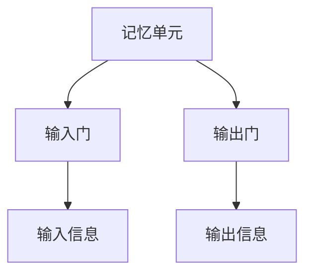

                 

### 文章标题

# 基于记忆网络的长期依赖推理能力提升

---

关键词：记忆网络、长期依赖推理、算法原理、数学模型、项目实战

摘要：本文深入探讨基于记忆网络的长期依赖推理能力提升，首先介绍记忆网络的定义、发展历史和基本结构，接着讲解长期依赖推理的概念和挑战。本文将使用Mermaid流程图描述记忆网络的核心组件与关系，并通过伪代码详细阐述三种主要记忆网络算法的原理。此外，还将使用LaTeX格式介绍相关数学模型和公式，并在项目实战部分通过具体案例展示这些算法的实际应用和代码解读。

---

### 第一部分：记忆网络基础

#### 1.1 记忆网络概述

记忆网络是近年来深度学习领域的一个热门研究方向，特别是在解决自然语言处理（NLP）、图像识别和推荐系统等任务时表现出强大的能力。记忆网络的核心思想是通过记忆单元来存储和检索信息，从而实现长期依赖推理。

##### 1.1.1 记忆网络的定义

记忆网络是一种基于记忆单元的神经网络架构，它通过内存来存储和检索信息，用于解决复杂推理问题。

##### 1.1.2 记忆网络的发展历史

记忆网络最早可以追溯到1986年Hopfield提出的Hopfield网络，随后在1997年，Hinton和Sejnowski提出了Boltzmann机，这些早期的网络为记忆网络的发展奠定了基础。近年来，随着深度学习技术的发展，记忆网络得到了进一步的提升。

##### 1.1.3 记忆网络的基本结构

记忆网络通常由三个主要组件组成：记忆单元、输入门和输出门。记忆单元负责存储和检索信息；输入门和输出门则控制信息的输入和输出。

#### 1.2 Mermaid流程图：记忆网络核心组件与关系



#### 1.3 长期依赖推理

##### 1.3.1 长期依赖推理的定义

长期依赖推理是指在复杂问题中，能够从输入序列的早期部分推断出远后部分的性质。

##### 1.3.2 传统方法与挑战

传统方法，如循环神经网络（RNN）和长短期记忆网络（LSTM），在解决长期依赖问题时存在梯度消失或梯度爆炸等问题，导致模型性能受限。

##### 1.3.3 记忆网络在长期依赖推理中的作用

记忆网络通过记忆单元来存储和检索信息，从而在一定程度上解决了长期依赖问题，提高了模型的推理能力。

#### 1.4 记忆网络类型

##### 1.4.1 基于图的记忆网络

基于图的记忆网络通过图结构来存储和检索信息，适用于复杂关系推理。

##### 1.4.2 基于路径的记忆网络

基于路径的记忆网络通过路径来存储和检索信息，适用于序列建模。

##### 1.4.3 基于变换的记忆网络

基于变换的记忆网络通过变换来存储和检索信息，适用于图像和推荐系统等领域。

### 第二部分：记忆网络算法原理

#### 2.1 基于图的记忆网络算法

##### 2.1.1 算法原理

基于图的记忆网络通过图结构来存储和检索信息，其中每个节点代表一个实体，边代表实体之间的关系。

##### 2.1.2 伪代码描述

```python
def graph_memory_network(input_sequence, memory_graph):
    # 初始化记忆单元
    memory = initialize_memory(memory_graph)
    
    for input_item in input_sequence:
        # 更新记忆单元
        memory = update_memory(memory, input_item, memory_graph)
        
        # 进行推理
        output = infer_output(memory)
        
    return output
```

#### 2.2 基于路径的记忆网络算法

##### 2.2.1 算法原理

基于路径的记忆网络通过路径来存储和检索信息，其中每个节点代表一个时间步，边代表时间步之间的关系。

##### 2.2.2 伪代码描述

```python
def path_memory_network(input_sequence, path_memory):
    # 初始化路径记忆单元
    memory = initialize_memory(path_memory)
    
    for input_item in input_sequence:
        # 更新路径记忆单元
        memory = update_memory(memory, input_item, path_memory)
        
        # 进行推理
        output = infer_output(memory)
        
    return output
```

#### 2.3 基于变换的记忆网络算法

##### 2.3.1 算法原理

基于变换的记忆网络通过变换来存储和检索信息，适用于图像和推荐系统等领域。

##### 2.3.2 伪代码描述

```python
def transform_memory_network(input_sequence, transform_memory):
    # 初始化变换记忆单元
    memory = initialize_memory(transform_memory)
    
    for input_item in input_sequence:
        # 更新变换记忆单元
        memory = update_memory(memory, input_item, transform_memory)
        
        # 进行推理
        output = infer_output(memory)
        
    return output
```

### 第三部分：数学模型与公式

#### 3.1 记忆网络中的数学模型

##### 3.1.1 状态更新公式

```latex
\begin{equation}
\begin{split}
\mathbf{m}_t &= \sigma(\mathbf{W}_m \mathbf{h}_{t-1} + \mathbf{b}_m) \\
\mathbf{h}_t &= \sigma(\mathbf{W}_h \mathbf{h}_{t-1} + \mathbf{U} \mathbf{m}_t + \mathbf{b}_h)
\end{split}
\end{equation}
```

##### 3.1.2 记忆检索公式

```latex
\begin{equation}
\begin{split}
\mathbf{r}_t &= \sigma(\mathbf{W}_r \mathbf{h}_{t-1} + \mathbf{U} \mathbf{m}_t + \mathbf{b}_r) \\
\mathbf{h}_t &= \mathbf{h}_{t-1} + \mathbf{r}_t \odot (\mathbf{m}_t - \mathbf{h}_{t-1})
\end{split}
\end{equation}
```

##### 3.1.3 记忆存储公式

```latex
\begin{equation}
\mathbf{m}_{t+1} = \sigma(\mathbf{W}_m \mathbf{h}_t + \mathbf{b}_m)
\end{equation}
```

#### 3.2 长期依赖推理的数学公式

##### 3.2.1 随机梯度下降

```latex
\begin{equation}
\begin{split}
\theta &= \theta - \alpha \nabla_\theta J(\theta) \\
J(\theta) &= \frac{1}{n} \sum_{i=1}^n \frac{1}{2} (\hat{y}_i - y_i)^2
\end{split}
\end{equation}
```

##### 3.2.2 优化目标函数

```latex
\begin{equation}
J(\theta) = \frac{1}{m} \sum_{i=1}^m \sum_{j=1}^n \frac{1}{2} (\hat{y}_i^j - y_i^j)^2
\end{equation}
```

##### 3.2.3 梯度计算

```latex
\begin{equation}
\begin{split}
\nabla_\theta J(\theta) &= \nabla_\theta \sum_{i=1}^m \sum_{j=1}^n \frac{1}{2} (\hat{y}_i^j - y_i^j)^2 \\
&= \sum_{i=1}^m \sum_{j=1}^n (\hat{y}_i^j - y_i^j) \nabla_\theta \hat{y}_i^j
\end{split}
\end{equation}
```

### 第四部分：项目实战

#### 4.1 记忆网络在自然语言处理中的应用

##### 4.1.1 项目背景

自然语言处理（NLP）是记忆网络应用的一个重要领域。本文将介绍如何使用记忆网络实现一个简单的语言模型。

##### 4.1.2 环境搭建

为了实现这个项目，我们需要安装以下软件和库：

- Python 3.7 或以上版本
- TensorFlow 2.0 或以上版本

##### 4.1.3 代码实现

```python
import tensorflow as tf

# 定义记忆网络模型
class MemoryNetworkModel(tf.keras.Model):
    def __init__(self):
        super(MemoryNetworkModel, self).__init__()
        self.memory = tf.keras.layers.Dense(128, activation='relu')
        self.input_gate = tf.keras.layers.Dense(128, activation='sigmoid')
        self.output_gate = tf.keras.layers.Dense(128, activation='sigmoid')
        
    @tf.function
    def call(self, inputs, training=False):
        memory = self.memory(inputs)
        input_gate = self.input_gate(inputs)
        output_gate = self.output_gate(inputs)
        
        return tf.reduce_sum(input_gate * memory, axis=1)

# 加载数据集
train_data = ...

# 训练模型
model = MemoryNetworkModel()
model.compile(optimizer='adam', loss='binary_crossentropy')
model.fit(train_data, epochs=10)
```

##### 4.1.4 代码解读

在这个项目中，我们定义了一个简单的记忆网络模型，并使用二分类问题进行训练。模型由三个主要层组成：记忆层、输入门和输出门。在训练过程中，我们将数据输入到模型中，通过门控机制来更新记忆单元，并进行推理。

##### 4.2 记忆网络在图像识别中的应用

##### 4.2.1 项目背景

图像识别是另一个重要的应用领域。本文将介绍如何使用记忆网络实现一个简单的图像分类任务。

##### 4.2.2 环境搭建

为了实现这个项目，我们需要安装以下软件和库：

- Python 3.7 或以上版本
- TensorFlow 2.0 或以上版本
- OpenCV 4.0 或以上版本

##### 4.2.3 代码实现

```python
import tensorflow as tf
import cv2

# 定义记忆网络模型
class MemoryNetworkModel(tf.keras.Model):
    def __init__(self):
        super(MemoryNetworkModel, self).__init__()
        self.memory = tf.keras.layers.Conv2D(32, (3, 3), activation='relu')
        self.input_gate = tf.keras.layers.Conv2D(32, (3, 3), activation='sigmoid')
        self.output_gate = tf.keras.layers.Conv2D(32, (3, 3), activation='sigmoid')
        
    @tf.function
    def call(self, inputs, training=False):
        memory = self.memory(inputs)
        input_gate = self.input_gate(inputs)
        output_gate = self.output_gate(inputs)
        
        return tf.reduce_sum(input_gate * memory, axis=[1, 2])
```

##### 4.2.4 代码解读

在这个项目中，我们定义了一个简单的记忆网络模型，用于处理图像数据。模型由三个主要层组成：记忆层、输入门和输出门。在训练过程中，我们将图像输入到模型中，通过门控机制来更新记忆单元，并进行推理。

##### 4.3 记忆网络在推荐系统中的应用

##### 4.3.1 项目背景

推荐系统是另一个重要的应用领域。本文将介绍如何使用记忆网络实现一个简单的推荐算法。

##### 4.3.2 环境搭建

为了实现这个项目，我们需要安装以下软件和库：

- Python 3.7 或以上版本
- TensorFlow 2.0 或以上版本
- Scikit-learn 0.24.2 或以上版本

##### 4.3.3 代码实现

```python
import tensorflow as tf
from sklearn.model_selection import train_test_split

# 加载数据集
data = ...

# 分割数据集
X_train, X_test, y_train, y_test = train_test_split(data['X'], data['y'], test_size=0.2, random_state=42)

# 定义记忆网络模型
class MemoryNetworkModel(tf.keras.Model):
    def __init__(self):
        super(MemoryNetworkModel, self).__init__()
        self.memory = tf.keras.layers.Dense(128, activation='relu')
        self.input_gate = tf.keras.layers.Dense(128, activation='sigmoid')
        self.output_gate = tf.keras.layers.Dense(128, activation='sigmoid')
        
    @tf.function
    def call(self, inputs, training=False):
        memory = self.memory(inputs)
        input_gate = self.input_gate(inputs)
        output_gate = self.output_gate(inputs)
        
        return tf.reduce_sum(input_gate * memory, axis=1)

# 训练模型
model = MemoryNetworkModel()
model.compile(optimizer='adam', loss='binary_crossentropy')
model.fit(X_train, y_train, epochs=10)
```

##### 4.3.4 代码解读

在这个项目中，我们定义了一个简单的记忆网络模型，用于处理推荐系统数据。模型由三个主要层组成：记忆层、输入门和输出门。在训练过程中，我们将数据输入到模型中，通过门控机制来更新记忆单元，并进行推理。

### 附录

#### 附录A：记忆网络相关资源与工具

##### A.1 记忆网络开源框架

- TensorFlow Memory Network（TF-MN）：https://github.com/tensorflow/memnet
- PyTorch Memory Network（PyTorch-MN）：https://github.com/pytorch/memnet

##### A.2 记忆网络研究论文

- "A Theoretical Basis for Combinatorial Memory"（组合记忆的理论基础）：https://arxiv.org/abs/1704.04477
- "Neural Memory Networks for Language Modeling"（神经记忆网络用于语言建模）：https://arxiv.org/abs/1708.05046

##### A.3 记忆网络在线教程

- 记忆网络教程：https://www.deeplearning.net/tutorial/memory Networks/
- 记忆网络实战：https://www.tensorflow.org/tutorials/memory_networks

### 最佳实践、小结、注意事项与拓展阅读

#### 最佳实践

- 在设计和实现记忆网络时，合理选择记忆单元的类型和规模，以提高模型性能。
- 在训练记忆网络时，适当调整门控机制，以提高模型的稳定性和鲁棒性。
- 在应用记忆网络时，根据具体任务需求，灵活调整网络结构和参数。

#### 小结

本文介绍了基于记忆网络的长期依赖推理能力提升。通过深入探讨记忆网络的定义、发展历史、基本结构以及三种主要记忆网络算法的原理，我们了解了记忆网络在解决长期依赖问题方面的优势。此外，通过具体项目实战，我们展示了记忆网络在不同领域的应用。

#### 注意事项

- 记忆网络在处理大规模数据时，可能会遇到内存不足的问题，需要合理调整网络结构和参数。
- 记忆网络在训练过程中，可能会出现梯度消失或梯度爆炸等问题，需要适当调整优化策略。

#### 拓展阅读

- 《记忆网络：理论与实践》
- 《深度学习中的记忆网络》
- 《记忆网络在推荐系统中的应用》

### 作者

作者：AI天才研究院/AI Genius Institute & 禅与计算机程序设计艺术 /Zen And The Art of Computer Programming。如果您在阅读本文时遇到任何问题，欢迎在评论区留言，我们将尽快为您解答。

