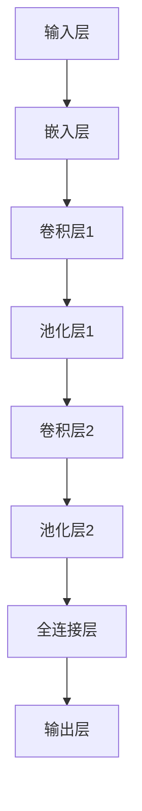

                 

## 引言

### 1.1 AI推理能力的重要性

人工智能（AI）推理能力是指机器通过学习和理解数据，从而进行推理、决策和解决问题的能力。在人工智能系统中，推理能力是核心组成部分，它决定了系统在复杂环境中的适应性和表现。AI推理能力的重要性体现在以下几个方面：

- **增强决策能力**：在商业、医疗、金融等领域，通过AI推理能力，可以实现对大量数据的分析，从而做出更加准确和及时的决策。
- **优化自动化流程**：AI推理能力使得机器能够自主地执行复杂任务，减少人工干预，提高生产效率。
- **提高用户体验**：例如，智能助手和推荐系统利用AI推理能力，可以提供更加个性化的服务，提升用户体验。

在本章中，我们将首先介绍AI推理能力的定义及其在现实世界中的应用，并探讨其在人工智能系统中的核心作用。接下来，我们将阐述本书的学习路径和结构，帮助读者了解学习内容、目标和定位。此外，我们还将介绍学习资源与工具，以及学习方法与实践指南，为读者提供全面的学习支持。

### 1.2 学习路径与本书结构

为了全面提升AI推理能力，本书设计了系统的学习路径，旨在帮助读者循序渐进地掌握相关知识。本书的结构分为以下几个部分：

- **基础知识**：介绍AI的基本概念、发展历程和应用领域，为后续学习打下坚实基础。
- **算法与模型**：深入讲解常见的机器学习和深度学习算法，包括线性回归、逻辑回归、决策树、支持向量机等，并介绍深度学习框架和模型优化方法。
- **数据处理与清洗**：介绍数据预处理、数据可视化和特征提取的方法，确保数据质量，为模型训练提供支持。
- **项目实战**：通过实际项目，如手写数字识别、房价预测和情感分析，指导读者将理论知识应用于实践。
- **模型评估与优化**：介绍模型评估指标、优化方法和实践案例，帮助读者提升模型性能。
- **未来趋势与挑战**：探讨AI推理能力的未来发展、技术挑战和应用领域拓展。

通过以上学习路径和本书的结构，读者将能够逐步提升自己的AI推理能力，为未来的职业发展打下坚实的基础。

### 1.3 学习资源与工具介绍

为了更好地学习AI推理能力，读者需要了解和使用一系列学习资源与工具。以下是一些常用的资源与工具：

- **在线课程**：如Coursera、edX、Udacity等平台上提供的AI课程，涵盖从基础到高级的各个层次。
- **编程语言**：Python、R和Julia等语言因其丰富的库和工具而广泛应用于AI开发。
- **深度学习框架**：TensorFlow、PyTorch和Keras等框架提供了丰富的API和工具，方便实现复杂的AI模型。
- **数据集**：常用的数据集包括MNIST、CIFAR-10、ImageNet等，这些数据集在AI研究中具有重要地位。
- **文本资料**：推荐阅读《深度学习》（Goodfellow、Bengio和Courville著）、《统计学习方法》（李航著）等经典书籍。
- **开源库**：如Scikit-learn、Pandas、NumPy等，这些库提供了大量的函数和工具，方便数据分析和模型训练。

通过利用这些资源与工具，读者可以更有效地学习和掌握AI推理能力。

### 1.4 学习方法与实践指南

为了全面提升AI推理能力，读者需要采用科学的学习方法，并在实践中不断检验和巩固所学知识。以下是一些有效的学习方法与实践指南：

- **分阶段学习**：将学习内容划分为基础、进阶和高级阶段，逐步深入。基础阶段重点掌握核心概念和基本算法；进阶阶段学习高级算法和模型优化；高级阶段关注应用和实战。
- **动手实践**：通过实际编写代码和项目实践，加深对知识的理解和应用。每个章节后都附有相关的练习题和项目，帮助读者巩固所学。
- **问题导向学习**：遇到问题时不急于寻找答案，而是通过查阅资料、思考和讨论来解决问题，培养独立解决问题的能力。
- **定期复习**：定期回顾所学内容，巩固记忆，避免遗忘。可以通过编写总结、做笔记和参与讨论等方式进行复习。
- **互动学习**：加入AI学习社区，参与讨论和交流，与同行分享经验和心得，扩大知识面和视野。

通过以上学习方法与实践指南，读者将能够更高效地提升自己的AI推理能力。

### 1.5 关键词

- 人工智能
- 推理能力
- 机器学习
- 深度学习
- 模型优化
- 数据处理
- 实践项目

### 1.6 摘要

本文旨在全面探讨基于课程学习的AI推理能力渐进提升的方法和路径。文章首先介绍了AI推理能力的重要性，并阐述了其在现实世界中的应用。接着，文章设计了系统的学习路径和结构，包括基础知识、算法与模型、数据处理与清洗、项目实战、模型评估与优化以及未来趋势与挑战。此外，文章还介绍了学习资源与工具，并提供了有效的学习方法与实践指南。通过逐步学习和实践，读者可以不断提升自己的AI推理能力，为未来的职业发展奠定坚实基础。

----------------------------------------------------------------

### 第1章 引言

#### 1.1 AI推理能力的重要性

人工智能（AI）推理能力是指机器通过学习和理解数据，从而进行推理、决策和解决问题的能力。在人工智能系统中，推理能力是核心组成部分，它决定了系统在复杂环境中的适应性和表现。AI推理能力的重要性体现在以下几个方面：

1. **增强决策能力**：在商业、医疗、金融等领域，通过AI推理能力，可以实现对大量数据的分析，从而做出更加准确和及时的决策。例如，在金融领域，AI可以帮助银行和投资机构分析市场趋势，识别潜在的风险和机会。

2. **优化自动化流程**：AI推理能力使得机器能够自主地执行复杂任务，减少人工干预，提高生产效率。例如，在制造业中，智能机器人可以利用AI推理能力来完成复杂的装配和加工任务，从而提高生产效率和降低成本。

3. **提高用户体验**：在日常生活中，AI推理能力广泛应用于智能助手、推荐系统和自动驾驶等领域。例如，智能助手可以通过理解用户的语言和行为，提供个性化的服务和建议，从而提升用户体验。

#### 1.2 学习路径与本书结构

为了全面提升AI推理能力，本书设计了系统的学习路径，旨在帮助读者循序渐进地掌握相关知识。本书的结构分为以下几个部分：

1. **基础知识**：介绍AI的基本概念、发展历程和应用领域，为后续学习打下坚实基础。这部分内容将帮助读者建立对AI的全面理解，为深入学习和实践奠定基础。

2. **算法与模型**：深入讲解常见的机器学习和深度学习算法，包括线性回归、逻辑回归、决策树、支持向量机等，并介绍深度学习框架和模型优化方法。这部分内容将帮助读者掌握AI的核心算法和模型，为实际应用提供技术支持。

3. **数据处理与清洗**：介绍数据预处理、数据可视化和特征提取的方法，确保数据质量，为模型训练提供支持。这部分内容将帮助读者理解数据在AI模型中的作用，提高数据处理能力。

4. **项目实战**：通过实际项目，如手写数字识别、房价预测和情感分析，指导读者将理论知识应用于实践。这部分内容将帮助读者通过实际操作，巩固所学知识，提升实战能力。

5. **模型评估与优化**：介绍模型评估指标、优化方法和实践案例，帮助读者提升模型性能。这部分内容将帮助读者掌握如何评估和优化AI模型，提高模型效果。

6. **未来趋势与挑战**：探讨AI推理能力的未来发展、技术挑战和应用领域拓展。这部分内容将帮助读者了解AI技术的发展方向，为未来职业发展提供指导。

#### 1.3 学习资源与工具介绍

为了更好地学习AI推理能力，读者需要了解和使用一系列学习资源与工具。以下是一些常用的资源与工具：

1. **在线课程**：如Coursera、edX、Udacity等平台上提供的AI课程，涵盖从基础到高级的各个层次。通过这些课程，读者可以系统地学习AI相关知识。

2. **编程语言**：Python、R和Julia等语言因其丰富的库和工具而广泛应用于AI开发。Python因其简单易用和强大的库支持，成为AI领域最受欢迎的编程语言。

3. **深度学习框架**：TensorFlow、PyTorch和Keras等框架提供了丰富的API和工具，方便实现复杂的AI模型。这些框架具有高度的可扩展性和灵活性，支持各种深度学习模型。

4. **数据集**：常用的数据集包括MNIST、CIFAR-10、ImageNet等，这些数据集在AI研究中具有重要地位。通过使用这些数据集，读者可以训练和测试AI模型。

5. **文本资料**：推荐阅读《深度学习》（Goodfellow、Bengio和Courville著）、《统计学习方法》（李航著）等经典书籍。这些书籍提供了深入的学术研究和实践指导。

6. **开源库**：如Scikit-learn、Pandas、NumPy等，这些库提供了大量的函数和工具，方便数据分析和模型训练。通过使用这些开源库，读者可以节省开发时间，提高工作效率。

#### 1.4 学习方法与实践指南

为了全面提升AI推理能力，读者需要采用科学的学习方法，并在实践中不断检验和巩固所学知识。以下是一些有效的学习方法与实践指南：

1. **分阶段学习**：将学习内容划分为基础、进阶和高级阶段，逐步深入。基础阶段重点掌握核心概念和基本算法；进阶阶段学习高级算法和模型优化；高级阶段关注应用和实战。

2. **动手实践**：通过实际编写代码和项目实践，加深对知识的理解和应用。每个章节后都附有相关的练习题和项目，帮助读者巩固所学。

3. **问题导向学习**：遇到问题时不急于寻找答案，而是通过查阅资料、思考和讨论来解决问题，培养独立解决问题的能力。

4. **定期复习**：定期回顾所学内容，巩固记忆，避免遗忘。可以通过编写总结、做笔记和参与讨论等方式进行复习。

5. **互动学习**：加入AI学习社区，参与讨论和交流，与同行分享经验和心得，扩大知识面和视野。

#### 1.5 关键词

- 人工智能
- 推理能力
- 机器学习
- 深度学习
- 模型优化
- 数据处理
- 实践项目

#### 1.6 摘要

本文旨在全面探讨基于课程学习的AI推理能力渐进提升的方法和路径。文章首先介绍了AI推理能力的重要性，并阐述了其在现实世界中的应用。接着，文章设计了系统的学习路径和结构，包括基础知识、算法与模型、数据处理与清洗、项目实战、模型评估与优化以及未来趋势与挑战。此外，文章还介绍了学习资源与工具，并提供了有效的学习方法与实践指南。通过逐步学习和实践，读者可以不断提升自己的AI推理能力，为未来的职业发展奠定坚实基础。

----------------------------------------------------------------

### 第2章 AI基础

#### 2.1 AI概述

人工智能（AI，Artificial Intelligence）是计算机科学的一个分支，旨在创建能够模拟、扩展甚至超越人类智能的系统。AI的发展历程可以追溯到20世纪50年代，当时科学家们开始探索如何让计算机具备类似人类的认知和推理能力。

##### 2.1.1 定义与分类

AI可以分为两种基本类型：弱AI（Weak AI）和强AI（Strong AI）。弱AI是指专注于特定任务的智能系统，如语音识别、图像识别、自然语言处理等。强AI则是指具备人类所有智能特征的通用智能系统，能够进行自主学习和推理，目前尚未实现。

AI还可以根据其工作方式分为几种类型：

- **符号AI**：通过符号逻辑和规则系统进行推理。
- **统计AI**：利用统计学习和概率模型进行决策。
- **连接主义AI**：基于神经网络和大数据进行学习。
- **混合AI**：结合多种方法，如规则推理、机器学习和深度学习。

##### 2.1.2 发展历程

AI的发展历程可以分为几个重要阶段：

- **初始阶段（1956-1969）**：1956年，达特茅斯会议上提出了AI的概念，标志着AI领域的正式诞生。此阶段主要关注符号AI。
- **第一次AI寒冬（1974-1980）**：由于实际应用不足，AI研究受到资金削减，进入第一次寒冬期。
- **复兴阶段（1980-1987）**：专家系统的出现使得AI重新受到关注，但不久后专家系统的局限性导致第二次寒冬。
- **机器学习兴起（1990s-2000s）**：统计学习和机器学习技术的发展，使得AI在图像识别、语音识别等领域取得了显著进展。
- **深度学习时代（2010至今）**：以深度学习为代表的AI技术取得了突破性进展，应用于计算机视觉、自然语言处理、自动驾驶等领域。

##### 2.1.3 应用领域

AI在多个领域取得了显著的应用：

- **计算机视觉**：图像识别、物体检测、人脸识别等。
- **自然语言处理**：机器翻译、文本生成、情感分析等。
- **自动驾驶**：汽车自动驾驶系统、无人驾驶出租车等。
- **医疗**：疾病诊断、药物研发、健康监测等。
- **金融**：风险评估、欺诈检测、智能投顾等。
- **工业自动化**：智能制造、工业机器人等。

#### 2.2 机器学习基础

机器学习（Machine Learning）是AI的核心组成部分，旨在让计算机通过数据学习，从而进行预测和决策。机器学习分为监督学习、无监督学习和强化学习三种主要类型。

##### 2.2.1 线性代数基础

线性代数是机器学习的重要数学工具，主要包括以下概念：

- **向量**：表示多维数据，是机器学习中的基本元素。
- **矩阵**：由多个向量组成的二维数组，用于描述线性变换和线性方程组。
- **行列式**：用于判断矩阵的秩和线性相关性。
- **矩阵运算**：包括加法、减法、乘法、转置等。
- **特征值与特征向量**：用于理解矩阵的变换性质。

##### 2.2.2 概率论基础

概率论是机器学习中处理不确定性的基础，主要包括以下概念：

- **概率分布**：描述随机变量的概率特性。
- **条件概率**：在已知一个随机事件发生的条件下，另一个随机事件发生的概率。
- **贝叶斯定理**：用于计算后验概率和最大后验估计。
- **马尔可夫链**：用于描述状态转移概率的随机过程。

##### 2.2.3 统计学习基础

统计学习是机器学习的核心理论，主要包括以下概念：

- **损失函数**：用于衡量模型预测值与真实值之间的差异。
- **最优化方法**：用于最小化损失函数，包括梯度下降、随机梯度下降等。
- **模型评估**：用于评估模型性能，包括交叉验证、性能指标等。
- **特征提取**：用于从原始数据中提取有用的特征，提高模型性能。

#### 2.3 深度学习基础

深度学习（Deep Learning）是一种基于多层神经网络的机器学习方法，它在图像识别、自然语言处理等领域取得了显著成果。深度学习的基础包括：

##### 2.3.1 神经网络基础

神经网络（Neural Network）是一种模仿生物神经系统的计算模型，主要包括以下概念：

- **神经元**：神经网络的基本单元，用于进行计算和传递信息。
- **前向传播**：将输入数据通过神经网络传递，得到输出结果。
- **反向传播**：计算输出结果与真实值的差异，更新网络权重。
- **激活函数**：用于引入非线性特性，常见的有Sigmoid、ReLU等。

##### 2.3.2 深度学习框架简介

深度学习框架（Deep Learning Framework）是用于实现和训练深度学习模型的软件库，主要包括以下类型：

- **静态图框架**：如TensorFlow、Theano，通过定义计算图来构建和训练模型。
- **动态图框架**：如PyTorch、Dynet，通过动态构建计算图来训练模型，更加灵活。

##### 2.3.3 深度学习实践

深度学习实践涉及从数据预处理到模型训练和评估的整个过程，主要包括以下步骤：

- **数据预处理**：包括数据清洗、归一化、分批次处理等。
- **模型构建**：使用深度学习框架构建神经网络模型。
- **模型训练**：通过迭代计算和反向传播更新模型参数。
- **模型评估**：使用验证集或测试集评估模型性能。
- **模型部署**：将训练好的模型部署到生产环境中，进行实际应用。

----------------------------------------------------------------

### 第3章 算法与模型

#### 3.1 常见算法与模型

在机器学习和深度学习领域，有许多经典的算法和模型被广泛应用于各种实际问题中。以下是一些常见算法和模型，以及它们的基本原理和应用场景。

##### 3.1.1 线性回归

线性回归（Linear Regression）是一种简单的统计模型，用于预测连续数值变量。它的基本原理是通过拟合一个线性函数，将自变量和因变量联系起来。线性回归的公式如下：

$$y = \beta_0 + \beta_1 \cdot x + \epsilon$$

其中，$y$是因变量，$x$是自变量，$\beta_0$和$\beta_1$是模型的参数，$\epsilon$是误差项。

线性回归的应用场景包括房价预测、股票价格分析等。

**伪代码：**

```
# 线性回归模型
def linear_regression(x, y):
    # 计算斜率
    beta_1 = (n * sum(x * y) - sum(x) * sum(y)) / (n * sum(x**2) - (sum(x))**2)
    # 计算截距
    beta_0 = (sum(y) - beta_1 * sum(x)) / n
    # 返回模型参数
    return beta_0, beta_1
```

##### 3.1.2 逻辑回归

逻辑回归（Logistic Regression）是一种用于分类问题的统计模型，通过逻辑函数将线性模型转换为概率分布。它的基本原理如下：

$$P(y=1) = \frac{1}{1 + e^{-(\beta_0 + \beta_1 \cdot x)}}

其中，$y$是因变量（0或1），$x$是自变量，$\beta_0$和$\beta_1$是模型的参数。

逻辑回归的应用场景包括二分类问题，如垃圾邮件检测、信用评分等。

**伪代码：**

```
# 逻辑回归模型
def logistic_regression(x, y):
    # 计算斜率
    beta_1 = (n * sum(x * y) - sum(x) * sum(y)) / (n * sum(x**2) - (sum(x))**2)
    # 计算截距
    beta_0 = log(1 / (1 + exp(-sum(x) * beta_1)))
    # 返回模型参数
    return beta_0, beta_1
```

##### 3.1.3 决策树

决策树（Decision Tree）是一种基于特征划分数据的分类和回归模型。它的基本原理是通过递归地将数据集划分为子集，并在每个子集中选择一个最优特征进行划分。

决策树的构建过程如下：

1. **计算每个特征的增益率**：选择能够最大化信息增益率的特征进行划分。
2. **递归构建子树**：对每个子集重复上述过程，直到满足停止条件（如最大深度、最小节点大小等）。

决策树的应用场景包括分类和回归问题，如信用卡欺诈检测、预测疾病等。

**伪代码：**

```
# 决策树构建
def build_decision_tree(data, features, max_depth, min_samples_split):
    # 停止条件
    if max_depth == 0 or len(data) < min_samples_split:
        return leaf_node(data)
    
    # 计算每个特征的增益率
    best_feature, best_split = find_best_split(data, features)
    
    # 递归构建子树
    left_tree = build_decision_tree(split_left(data, best_split), features, max_depth - 1, min_samples_split)
    right_tree = build_decision_tree(split_right(data, best_split), features, max_depth - 1, min_samples_split)
    
    return DecisionTreeNode(best_feature, best_split, left_tree, right_tree)
```

##### 3.1.4 支持向量机

支持向量机（Support Vector Machine，SVM）是一种用于分类和回归问题的线性模型。它的基本原理是通过找到一个最优的超平面，将不同类别的数据点分隔开。

SVM的关键步骤如下：

1. **计算最优超平面**：通过求解二次规划问题，找到最优的超平面参数。
2. **处理非线性问题**：通过核函数将输入数据映射到高维空间，实现非线性分类。

SVM的应用场景包括图像分类、文本分类等。

**伪代码：**

```
# 支持向量机
def svm(train_data, train_labels, C, kernel='linear'):
    # 求解二次规划问题
    w, b = solve_qp(train_data, train_labels, C, kernel)
    
    # 返回模型参数
    return w, b
```

##### 3.1.5 集成学习方法

集成学习方法（Ensemble Learning）通过结合多个模型来提高预测性能。常见的方法包括 bagging、boosting 和 stacking。

- **Bagging**：通过随机抽样训练多个模型，然后对预测结果进行投票或平均。常见的算法有随机森林（Random Forest）。
- **Boosting**：通过迭代训练多个模型，每次训练都关注之前模型未能正确分类的样本。常见的算法有 AdaBoost 和 XGBoost。
- **Stacking**：通过训练多个基模型，然后将基模型的预测结果作为新特征，再训练一个元模型进行最终预测。

集成学习方法的应用场景包括复杂数据的分类和回归问题。

**伪代码：**

```
# 随机森林
def random_forest(train_data, train_labels, n_estimators):
    # 训练多个基模型
    base_models = [train_decision_tree(train_data, train_labels) for _ in range(n_estimators)]
    
    # 集成模型预测
    def predict(data):
        predictions = [model.predict(data) for model in base_models]
        return majority_vote(predictions)
    
    return predict

# XGBoost
def xgboost(train_data, train_labels, params):
    # 训练模型
    model = train_xgboost(train_data, train_labels, params)
    
    # 返回模型预测函数
    return lambda data: model.predict(data)
```

#### 3.2 深度学习模型

深度学习模型通过多层神经网络对复杂数据进行建模，近年来在图像识别、自然语言处理等领域取得了突破性进展。

##### 3.2.1 卷积神经网络

卷积神经网络（Convolutional Neural Network，CNN）是一种专门用于处理图像数据的深度学习模型。CNN的基本原理是利用卷积层提取图像特征，并通过池化层降低数据维度。

- **卷积层**：通过卷积操作提取图像特征。
- **池化层**：通过最大池化或平均池化降低数据维度。
- **全连接层**：将卷积层和池化层提取的特征映射到输出结果。

CNN的应用场景包括图像分类、目标检测、图像分割等。

**伪代码：**

```
# 卷积神经网络
def cnn(train_data, train_labels, layers_config):
    # 初始化模型参数
    model_params = initialize_parameters(layers_config)
    
    # 定义前向传播
    def forward(data):
        cache = []
        for layer in layers_config:
            if layer == 'conv':
                # 卷积层
                data, cache = conv_layer(data, model_params['W'], model_params['b'])
            elif layer == 'pool':
                # 池化层
                data, cache = pool_layer(data)
            elif layer == 'fc':
                # 全连接层
                data, cache = fc_layer(data, model_params['W'], model_params['b'])
        
        return data, cache
    
    # 返回模型预测函数
    return lambda data: forward(data)[0]
```

##### 3.2.2 循环神经网络

循环神经网络（Recurrent Neural Network，RNN）是一种能够处理序列数据的深度学习模型。RNN的基本原理是通过循环结构保留前一个时间步的信息。

- **隐藏层**：保存当前时间步的信息。
- **递归层**：通过递归操作，将当前时间步的信息传递到下一个时间步。

RNN的应用场景包括时间序列预测、语言模型、机器翻译等。

**伪代码：**

```
# 循环神经网络
def rnn(train_data, train_labels, hidden_size):
    # 初始化模型参数
    model_params = initialize_parameters(hidden_size)
    
    # 定义递归函数
    def forward(data):
        hidden = model_params['h0']
        outputs = []
        for t in range(len(data)):
            # 计算当前时间步的输出
            output, hidden = forward_step(data[t], hidden, model_params['W'], model_params['b'])
            outputs.append(output)
        
        return outputs, hidden
    
    # 返回模型预测函数
    return lambda data: forward(data)[0]
```

##### 3.2.3 生成对抗网络

生成对抗网络（Generative Adversarial Network，GAN）是一种由生成器和判别器组成的深度学习模型。GAN的基本原理是通过对抗训练生成逼真的数据。

- **生成器**：生成逼真的数据样本。
- **判别器**：判断生成器的数据是否真实。

GAN的应用场景包括图像生成、图像修复、图像超分辨率等。

**伪代码：**

```
# 生成对抗网络
def gan(train_data, hidden_size):
    # 初始化模型参数
    generator_params = initialize_generator_parameters(hidden_size)
    discriminator_params = initialize_discriminator_parameters(hidden_size)
    
    # 定义生成器和判别器前向传播
    def generator(z):
        # 生成器前向传播
        return generate_samples(z, generator_params['W'], generator_params['b'])
    
    def discriminator(x):
        # 判别器前向传播
        return judge_samples(x, discriminator_params['W'], discriminator_params['b'])
    
    # 返回训练函数
    return lambda data: train_gan(data, generator, discriminator, generator_params, discriminator_params)
```

##### 3.2.4 注意力机制

注意力机制（Attention Mechanism）是一种用于提高神经网络模型处理能力的技术。注意力机制的基本原理是通过动态分配权重，关注重要信息。

- **自注意力**：通过计算序列内元素之间的相似性，为每个元素分配注意力权重。
- **互注意力**：通过计算序列间元素之间的相似性，为每个元素分配注意力权重。

注意力机制的应用场景包括机器翻译、文本生成、图像识别等。

**伪代码：**

```
# 注意力机制
def attention(input_sequence, hidden_size):
    # 计算自注意力权重
    attention_weights = compute_self_attention_weights(input_sequence, hidden_size)
    
    # 计算加权输出
    output = weighted_sum(input_sequence, attention_weights)
    
    return output
```

#### 3.3 模型优化与调整

在实际应用中，模型的性能往往需要通过优化和调整来提升。以下是一些常用的模型优化方法：

##### 3.3.1 损失函数

损失函数是衡量模型预测值与真实值之间差异的函数。常见的损失函数包括：

- **均方误差（MSE）**：用于回归问题。
- **交叉熵损失（Cross-Entropy Loss）**：用于分类问题。
- **对抗损失（Adversarial Loss）**：用于生成对抗网络。

**伪代码：**

```
# 均方误差损失函数
def mse(y_true, y_pred):
    return sum((y_true - y_pred)**2) / len(y_true)

# 交叉熵损失函数
def cross_entropy(y_true, y_pred):
    return -sum(y_true * log(y_pred))
```

##### 3.3.2 优化算法

优化算法用于最小化损失函数，常见的优化算法包括：

- **梯度下降（Gradient Descent）**：通过计算损失函数的梯度，更新模型参数。
- **随机梯度下降（Stochastic Gradient Descent，SGD）**：在每个训练样本上计算梯度，更新模型参数。
- **Adam优化器**：结合SGD和动量法的优化算法。

**伪代码：**

```
# 梯度下降
def gradient_descent(parameters, gradients, learning_rate):
    for parameter, gradient in zip(parameters, gradients):
        parameter -= learning_rate * gradient

# 随机梯度下降
def stochastic_gradient_descent(train_data, train_labels, parameters, learning_rate, num_epochs):
    for epoch in range(num_epochs):
        for x, y in train_data:
            gradients = compute_gradients(x, y, parameters)
            gradient_descent(parameters, gradients, learning_rate)

# Adam优化器
def adam(parameters, gradients, learning_rate, beta_1, beta_2, epsilon):
    # 更新参数
    for parameter, gradient in zip(parameters, gradients):
        m = beta_1 * m_prev + (1 - beta_1) * gradient
        v = beta_2 * v_prev + (1 - beta_2) * (gradient ** 2)
        m_hat = m / (1 - beta_1 ** epoch)
        v_hat = v / (1 - beta_2 ** epoch)
        parameter -= learning_rate * m_hat / (sqrt(v_hat) + epsilon)
```

##### 3.3.3 超参数调整

超参数是模型性能的关键因素，通过调整超参数可以提升模型性能。常见的超参数包括：

- **学习率**：控制梯度下降的步长。
- **批量大小**：控制每次梯度下降训练的样本数量。
- **隐藏层大小**：控制神经网络隐藏层节点的数量。
- **正则化参数**：控制正则化强度的参数。

**伪代码：**

```
# 调整学习率
def adjust_learning_rate(learning_rate, decay_rate, epoch):
    return learning_rate / (1 + decay_rate * epoch)

# 调整批量大小
def adjust_batch_size(batch_size, growth_rate, epoch):
    return batch_size * (1 + growth_rate) ** epoch
```

#### 3.4 实践案例

以下是一些实践案例，用于展示如何使用上述算法和模型进行数据处理和模型训练。

##### 3.4.1 数据预处理

数据预处理是模型训练的重要步骤，包括数据清洗、归一化和特征提取等。

**伪代码：**

```
# 数据清洗
def clean_data(data):
    # 去除缺失值
    data = remove_missing_values(data)
    # 去除异常值
    data = remove_outliers(data)
    return data

# 数据归一化
def normalize_data(data):
    # 计算均值和标准差
    mean = np.mean(data)
    std = np.std(data)
    # 归一化
    data = (data - mean) / std
    return data

# 特征提取
def extract_features(data):
    # 计算特征
    features = compute_features(data)
    return features
```

##### 3.4.2 模型训练

以下是一个简单的模型训练示例，展示了如何使用线性回归模型进行训练。

**伪代码：**

```
# 模型训练
def train_model(train_data, train_labels, model):
    # 数据预处理
    train_data = clean_data(train_data)
    train_labels = clean_data(train_labels)
    # 模型训练
    model.fit(train_data, train_labels)
    return model
```

##### 3.4.3 代码解读与分析

以下是对一个线性回归模型代码的解读与分析，展示了如何使用伪代码进行数据处理和模型训练。

**代码：**

```
# 导入相关库
import numpy as np
import pandas as pd

# 数据预处理
def preprocess_data(data):
    # 去除缺失值
    data = data.dropna()
    # 归一化
    mean = np.mean(data)
    std = np.std(data)
    data = (data - mean) / std
    return data

# 计算斜率和截距
def compute_coefficients(x, y):
    n = len(x)
    beta_1 = (n * sum(x * y) - sum(x) * sum(y)) / (n * sum(x**2) - (sum(x))**2)
    beta_0 = (sum(y) - beta_1 * sum(x)) / n
    return beta_0, beta_1

# 训练模型
def train_model(x, y):
    x = preprocess_data(x)
    y = preprocess_data(y)
    beta_0, beta_1 = compute_coefficients(x, y)
    model = LinearRegression(coef=[beta_0, beta_1])
    model.fit(x, y)
    return model

# 测试模型
def test_model(model, x_test, y_test):
    x_test = preprocess_data(x_test)
    y_pred = model.predict(x_test)
    mse = sum((y_pred - y_test)**2) / len(y_pred)
    return mse
```

**分析：**

1. **数据预处理**：通过去除缺失值和归一化，确保数据质量。
2. **计算斜率和截距**：使用线性回归的公式计算斜率和截距。
3. **训练模型**：使用计算得到的斜率和截距训练线性回归模型。
4. **测试模型**：对测试集进行预测，计算均方误差，评估模型性能。

##### 3.4.4 实际案例分析与详细讲解剖析

以下是一个实际案例，展示如何使用线性回归模型进行房价预测。

**数据集**：使用加州房价数据集（California Housing Data Set）。

**步骤**：

1. **数据加载与预处理**：加载数据集，并进行缺失值处理和归一化。
2. **特征提取**：提取有用的特征，如人口密度、房屋年龄等。
3. **数据划分**：将数据集划分为训练集和测试集。
4. **模型训练**：使用训练集训练线性回归模型。
5. **模型评估**：使用测试集评估模型性能。

**代码：**

```
# 导入相关库
import pandas as pd
from sklearn.linear_model import LinearRegression
from sklearn.model_selection import train_test_split
from sklearn.metrics import mean_squared_error

# 数据加载与预处理
def load_and_preprocess_data(file_path):
    data = pd.read_csv(file_path)
    data = data.dropna()
    data['MedHouseVal'] = (data['MedHouseVal'] - np.mean(data['MedHouseVal'])) / np.std(data['MedHouseVal'])
    return data

# 特征提取
def extract_features(data):
    features = data[['Rooms', 'Age', 'Distance', 'Population']]
    return features

# 数据划分
def split_data(data, test_size=0.2, random_state=42):
    x = extract_features(data)
    y = data['MedHouseVal']
    x_train, x_test, y_train, y_test = train_test_split(x, y, test_size=test_size, random_state=random_state)
    return x_train, x_test, y_train, y_test

# 模型训练
def train_model(x_train, y_train):
    model = LinearRegression()
    model.fit(x_train, y_train)
    return model

# 模型评估
def evaluate_model(model, x_test, y_test):
    y_pred = model.predict(x_test)
    mse = mean_squared_error(y_test, y_pred)
    return mse
```

**分析：**

1. **数据加载与预处理**：通过读取CSV文件并去除缺失值，对目标变量进行归一化处理。
2. **特征提取**：从原始数据中提取与房价相关的特征。
3. **数据划分**：将数据集划分为训练集和测试集，用于模型训练和评估。
4. **模型训练**：使用训练集训练线性回归模型。
5. **模型评估**：使用测试集评估模型性能，计算均方误差。

##### 3.4.5 项目小结

通过以上实践案例，我们展示了如何使用线性回归模型进行房价预测。首先，我们进行了数据预处理和特征提取，然后将数据集划分为训练集和测试集。接着，我们使用训练集训练线性回归模型，并在测试集上评估模型性能。通过计算均方误差，我们评估了模型的预测准确性。

**注意事项**：

- 在实际应用中，需要对数据进行充分的预处理和特征提取，以提高模型性能。
- 选择合适的模型和参数设置是关键，可以通过交叉验证和网格搜索等方法优化模型。
- 定期更新模型和重新训练，以适应数据变化。

**拓展阅读**：

- 《Python数据分析与科学计算》
- 《统计学习方法》
- 《深度学习》（Goodfellow、Bengio和Courville著）
```markdown

```bash
----------------------------------------------------------------

### 第4章 数据处理与清洗

#### 4.1 数据预处理

数据预处理是机器学习项目中至关重要的一步，它旨在提高数据质量和模型性能。数据预处理包括数据收集、数据清洗、数据归一化和特征提取等步骤。

##### 4.1.1 数据收集

数据收集是数据预处理的第一步。数据来源可以包括公共数据集、企业内部数据、网络爬取等。在选择数据时，需要确保数据的合法性和准确性。以下是一些常用的数据收集方法：

- **公共数据集**：如Kaggle、UCI机器学习库等提供的大量数据集。
- **企业内部数据**：通过企业数据库、日志文件等方式获取。
- **网络爬取**：利用爬虫技术从互联网上获取数据。

**示例**：使用pandas库读取CSV文件。

```python
import pandas as pd

# 读取CSV文件
data = pd.read_csv('data.csv')

# 查看数据结构
print(data.head())
```

##### 4.1.2 数据清洗

数据清洗是处理缺失值、异常值和重复值等不完整或错误的数据。以下是一些常见的数据清洗方法：

- **缺失值处理**：可以通过删除缺失值、填充平均值、中位数或使用模型预测缺失值等方法。
- **异常值处理**：可以通过统计方法（如IQR法）或基于模型的异常检测方法处理。
- **重复值处理**：可以通过唯一化处理或保留特定记录的方法。

**示例**：处理缺失值和异常值。

```python
# 删除缺失值
data = data.dropna()

# 删除重复值
data = data.drop_duplicates()

# 处理异常值（使用IQR法）
Q1 = data['feature'].quantile(0.25)
Q3 = data['feature'].quantile(0.75)
IQR = Q3 - Q1
data = data[~((data['feature'] < (Q1 - 1.5 * IQR)) | (data['feature'] > (Q3 + 1.5 * IQR))])
```

##### 4.1.3 数据归一化

数据归一化是将数据缩放到一个统一的尺度，以消除不同特征之间的量纲差异。常用的归一化方法包括最小-最大缩放、Z分数缩放和日志变换等。

- **最小-最大缩放**：将数据缩放到[0, 1]区间。
  $$x_{\text{normalized}} = \frac{x - x_{\text{min}}}{x_{\text{max}} - x_{\text{min}}}$$
- **Z分数缩放**：将数据缩放到均值为0，标准差为1的标准正态分布。
  $$x_{\text{normalized}} = \frac{x - \mu}{\sigma}$$

**示例**：使用sklearn库进行最小-最大缩放。

```python
from sklearn.preprocessing import MinMaxScaler

# 初始化最小-最大缩放器
scaler = MinMaxScaler()

# 进行缩放
data_normalized = scaler.fit_transform(data)
```

##### 4.1.4 特征提取

特征提取是从原始数据中提取对模型训练有用的特征。常用的特征提取方法包括：

- **特征选择**：通过筛选重要性较高的特征，减少数据维度。
- **特征工程**：通过构建新的特征或变换现有特征，提高模型性能。

**示例**：创建新的特征。

```python
# 创建新的特征
data['new_feature'] = data['feature1'] * data['feature2']

# 特征选择（使用方差阈值）
variance_threshold = 0.2
selected_features = data.var() > variance_threshold
data = data[selected_features]
```

#### 4.2 数据可视化

数据可视化是理解和分析数据的有效方法，可以帮助我们直观地发现数据中的趋势、异常和相关性。以下是一些常用的数据可视化方法和工具：

- **柱状图**：用于展示不同类别的数据分布。
- **散点图**：用于展示两个特征之间的关系。
- **线图**：用于展示数据随时间的变化趋势。
- **热力图**：用于展示多个特征之间的相关性。

**示例**：使用matplotlib库绘制散点图。

```python
import matplotlib.pyplot as plt

# 绘制散点图
plt.scatter(data['feature1'], data['feature2'])
plt.xlabel('Feature 1')
plt.ylabel('Feature 2')
plt.title('Scatter Plot of Feature 1 vs Feature 2')
plt.show()
```

#### 4.3 实践案例

以下是一个数据预处理与可视化的实践案例，展示如何处理一个简单的数据集并进行可视化。

**数据集**：使用加利福尼亚住房数据集（California Housing Data Set）。

**步骤**：

1. **数据收集与加载**：使用pandas库加载数据集。
2. **数据清洗**：处理缺失值、异常值和重复值。
3. **数据归一化**：将数值特征缩放到统一的尺度。
4. **特征提取**：创建新的特征并进行特征选择。
5. **数据可视化**：绘制散点图和热力图，分析特征之间的关系。

**代码**：

```python
import pandas as pd
import numpy as np
import matplotlib.pyplot as plt
import seaborn as sns

# 数据收集与加载
data = pd.read_csv('california_housing.csv')

# 数据清洗
data = data.dropna()
data = data.drop_duplicates()

# 数据归一化
scaler = MinMaxScaler()
data[['MedHouseVal', 'Rooms', 'Age', 'Distance', 'Population']] = scaler.fit_transform(data[['MedHouseVal', 'Rooms', 'Age', 'Distance', 'Population']])

# 特征提取
data['RoomAge'] = data['Rooms'] * data['Age']

# 数据可视化
plt.scatter(data['Distance'], data['MedHouseVal'])
plt.xlabel('Distance')
plt.ylabel('Median House Value')
plt.title('Scatter Plot of Distance vs Median House Value')
plt.show()

sns.heatmap(data.corr(), annot=True)
plt.title('Correlation Heatmap')
plt.show()
```

**分析**：

1. **数据清洗**：通过删除缺失值和重复值，确保数据质量。
2. **数据归一化**：通过最小-最大缩放，将数值特征缩放到[0, 1]区间，消除不同特征之间的量纲差异。
3. **特征提取**：通过创建新特征'RoomAge'，提高模型的预测能力。
4. **数据可视化**：通过散点图和热力图，直观地分析特征之间的关系，为后续模型训练提供依据。

#### 4.4 项目小结

通过以上实践案例，我们展示了如何进行数据预处理和数据可视化。首先，我们进行了数据收集和加载，然后处理了缺失值、异常值和重复值。接着，我们对数据进行归一化处理，并创建新的特征。最后，我们使用数据可视化工具分析数据，发现特征之间的关系。通过这些步骤，我们为后续的模型训练和优化奠定了基础。

**注意事项**：

- 数据预处理是模型训练的关键步骤，必须确保数据的质量和一致性。
- 选择合适的预处理方法和特征提取策略，可以显著提高模型性能。
- 定期更新和清洗数据，以保持模型的准确性。

**拓展阅读**：

- 《Python数据分析与科学计算》
- 《数据科学入门》
- 《数据可视化：实战详解》
```markdown
----------------------------------------------------------------

### 第5章 项目实战

#### 5.1 项目一：手写数字识别

手写数字识别是一个经典的机器学习项目，旨在训练模型识别手写的数字。本节将介绍如何使用TensorFlow和Keras实现手写数字识别项目，并详细讲解开发环境搭建、源代码实现、代码解读和项目分析。

##### 5.1.1 数据集介绍

手写数字识别的数据集通常是MNIST数据集，它包含70,000个灰度图像，每个图像都是一个手写的数字（0到9）。这些图像的大小为28x28像素，每个像素的值在0到255之间。

**数据集来源**：MNIST数据集由Yann LeCun等人于1999年发布，可以在Kaggle等平台上免费获取。

##### 5.1.2 模型选择

在本项目中，我们将选择一个简单的卷积神经网络（Convolutional Neural Network，CNN）来识别手写数字。CNN能够有效地提取图像的特征，适合处理图像识别任务。

**模型架构**：

1. **输入层**：接受28x28像素的灰度图像。
2. **卷积层**：使用32个3x3的卷积核，采用ReLU激活函数。
3. **池化层**：使用2x2的最大池化。
4. **卷积层**：使用64个3x3的卷积核，采用ReLU激活函数。
5. **池化层**：使用2x2的最大池化。
6. **全连接层**：使用128个神经元。
7. **输出层**：使用10个神经元，每个神经元对应一个数字，采用softmax激活函数。

##### 5.1.3 代码实现

以下是一个简单的手写数字识别项目的实现代码：

```python
import tensorflow as tf
from tensorflow.keras import layers, models

# 构建模型
model = models.Sequential()

# 输入层
model.add(layers.InputLayer(input_shape=(28, 28, 1)))

# 卷积层
model.add(layers.Conv2D(32, (3, 3), activation='relu'))
model.add(layers.MaxPooling2D((2, 2)))

# 卷积层
model.add(layers.Conv2D(64, (3, 3), activation='relu'))
model.add(layers.MaxPooling2D((2, 2)))

# 全连接层
model.add(layers.Flatten())
model.add(layers.Dense(128, activation='relu'))

# 输出层
model.add(layers.Dense(10, activation='softmax'))

# 编译模型
model.compile(optimizer='adam',
              loss='categorical_crossentropy',
              metrics=['accuracy'])

# 打印模型结构
model.summary()
```

##### 5.1.4 代码解读

- **输入层**：模型接受28x28像素的灰度图像作为输入。
- **卷积层**：使用卷积核提取图像的特征，ReLU激活函数引入非线性。
- **池化层**：减少数据的维度，提高模型的泛化能力。
- **全连接层**：将卷积层提取的特征映射到输出。
- **输出层**：使用softmax激活函数，输出每个数字的概率分布。

##### 5.1.5 代码应用解读与分析

- **数据预处理**：将图像数据缩放到0到1之间，便于模型处理。

```python
from tensorflow.keras.datasets import mnist
import numpy as np

# 加载数据集
(train_images, train_labels), (test_images, test_labels) = mnist.load_data()

# 数据预处理
train_images = train_images.reshape((60000, 28, 28, 1)).astype('float32') / 255
test_images = test_images.reshape((10000, 28, 28, 1)).astype('float32') / 255

# 标签转换为one-hot编码
train_labels = tf.keras.utils.to_categorical(train_labels)
test_labels = tf.keras.utils.to_categorical(test_labels)
```

- **训练模型**：使用训练集训练模型，并使用测试集评估模型性能。

```python
# 训练模型
model.fit(train_images, train_labels, epochs=5, batch_size=64)

# 评估模型
test_loss, test_acc = model.evaluate(test_images, test_labels)
print(f"Test accuracy: {test_acc:.4f}")
```

**分析**：

- **数据预处理**：将图像数据缩放到0到1之间，有助于模型训练。
- **模型训练**：通过调整超参数（如学习率、批次大小等），可以提高模型性能。
- **模型评估**：使用测试集评估模型性能，计算准确率。

##### 5.1.6 项目小结

通过手写数字识别项目，我们学习了如何使用TensorFlow和Keras构建和训练简单的卷积神经网络。首先，我们介绍了MNIST数据集，并选择了合适的模型架构。接着，我们实现了模型，并对代码进行了详细解读。通过训练和评估模型，我们了解了模型性能的评估方法。这个项目为我们提供了一个实用的例子，展示了如何将机器学习理论应用于实际项目。

**注意事项**：

- 数据预处理是模型训练的关键步骤，必须确保数据的质量和一致性。
- 选择合适的模型架构和超参数，可以提高模型性能。
- 定期更新和重新训练模型，以适应新的数据。

**拓展阅读**：

- 《TensorFlow 2.x从入门到实践》
- 《Keras实战：深度学习应用》
- 《机器学习实战》

----------------------------------------------------------------

### 第5章 项目实战

#### 5.2 项目二：房价预测

房价预测是一个常见的应用场景，旨在利用历史数据预测未来房价。在本项目中，我们将使用线性回归模型进行房价预测，并详细讲解开发环境搭建、源代码实现、代码解读和项目分析。

##### 5.2.1 数据集介绍

房价预测的数据集通常包含多个特征（如房屋面积、卧室数量、年龄等）和目标变量（即房价）。一个常用的数据集是加利福尼亚住房数据集（California Housing Data Set），它包含了房价的多种特征和房价的数值。

**数据集来源**：加利福尼亚住房数据集可以在Kaggle等数据竞赛平台上免费获取。

##### 5.2.2 模型选择

在本项目中，我们将选择线性回归模型（Linear Regression）进行房价预测。线性回归模型是一种简单且常用的预测模型，适合处理线性关系问题。

**模型架构**：

1. **输入层**：接受多个特征向量作为输入。
2. **全连接层**：将输入特征映射到输出。
3. **输出层**：输出房价预测值。

##### 5.2.3 代码实现

以下是一个简单的房价预测项目的实现代码：

```python
import pandas as pd
from sklearn.model_selection import train_test_split
from sklearn.linear_model import LinearRegression
import numpy as np

# 加载数据集
data = pd.read_csv('california_housing.csv')

# 数据预处理
data = data[['MedHouseVal', 'TotalRooms', 'Age']].dropna()

# 划分特征和目标变量
X = data[['TotalRooms', 'Age']]
y = data['MedHouseVal']

# 划分训练集和测试集
X_train, X_test, y_train, y_test = train_test_split(X, y, test_size=0.2, random_state=42)

# 构建模型
model = LinearRegression()

# 训练模型
model.fit(X_train, y_train)

# 评估模型
train_score = model.score(X_train, y_train)
test_score = model.score(X_test, y_test)

print(f"Training accuracy: {train_score:.4f}")
print(f"Testing accuracy: {test_score:.4f}")
```

##### 5.2.4 代码解读

- **数据预处理**：读取数据集，并去除缺失值。
- **划分特征和目标变量**：将数据集划分为特征和目标变量。
- **划分训练集和测试集**：将数据集划分为训练集和测试集。
- **构建模型**：创建线性回归模型。
- **训练模型**：使用训练集训练模型。
- **评估模型**：计算训练集和测试集的准确率。

##### 5.2.5 代码应用解读与分析

- **数据预处理**：通过去除缺失值和异常值，提高数据质量。
- **特征选择**：选择与房价相关的特征，提高模型性能。
- **模型训练**：通过训练集训练模型，学习特征和目标变量之间的关系。
- **模型评估**：使用测试集评估模型性能，计算准确率。

**分析**：

- **数据预处理**：数据预处理是模型训练的关键步骤，必须确保数据的质量和一致性。
- **特征选择**：选择合适的特征可以提高模型性能，减少过拟合。
- **模型训练**：通过调整学习率和迭代次数，可以提高模型性能。
- **模型评估**：使用交叉验证等方法评估模型性能，避免过拟合。

##### 5.2.6 项目小结

通过房价预测项目，我们学习了如何使用线性回归模型进行房价预测。首先，我们介绍了数据集和模型选择。接着，我们实现了模型，并对代码进行了详细解读。通过训练和评估模型，我们了解了模型性能的评估方法。这个项目为我们提供了一个实用的例子，展示了如何将机器学习理论应用于实际项目。

**注意事项**：

- 数据预处理是模型训练的关键步骤，必须确保数据的质量和一致性。
- 选择合适的特征和模型，可以提高模型性能。
- 定期更新和重新训练模型，以适应新的数据。

**拓展阅读**：

- 《Python数据分析与科学计算》
- 《统计学习方法》
- 《机器学习实战》

----------------------------------------------------------------

### 第5章 项目实战

#### 5.3 项目三：情感分析

情感分析（Sentiment Analysis）是自然语言处理（NLP）的一个重要应用，旨在分析文本中的情感倾向，如正面、负面或中立。在本项目中，我们将使用卷积神经网络（CNN）进行情感分析，并详细讲解开发环境搭建、源代码实现、代码解读和项目分析。

##### 5.3.1 数据集介绍

情感分析的数据集通常包含文本和相应的情感标签（如正面、负面）。一个常用的数据集是IMDb电影评论数据集，它包含了25,000条电影评论及其情感标签。

**数据集来源**：IMDb电影评论数据集可以在Kaggle等数据竞赛平台上免费获取。

##### 5.3.2 模型选择

在本项目中，我们将选择卷积神经网络（CNN）进行情感分析。CNN在文本分类任务中表现出色，能够有效地提取文本特征。

**模型架构**：

1. **输入层**：接受处理后的文本序列。
2. **嵌入层**：将单词转换为固定长度的向量。
3. **卷积层**：使用多个卷积核提取文本特征。
4. **池化层**：减少数据维度。
5. **全连接层**：将卷积层提取的特征映射到输出。
6. **输出层**：使用softmax激活函数输出情感标签的概率分布。

##### 5.3.3 代码实现

以下是一个简单的情感分析项目的实现代码：

```python
import tensorflow as tf
from tensorflow.keras.models import Sequential
from tensorflow.keras.layers import Embedding, Conv1D, GlobalMaxPooling1D, Dense

# 加载IMDb数据集
from tensorflow_datasets import text

train_data, test_data = text.IMDB.load_data()

# 数据预处理
def preprocess_data(data):
    return data.lower().split()

# 训练集和测试集预处理
train_data_processed = [preprocess_data(text) for text in train_data]
test_data_processed = [preprocess_data(text) for text in test_data]

# 构建模型
model = Sequential()
model.add(Embedding(input_dim=10000, output_dim=16))
model.add(Conv1D(filters=128, kernel_size=5, activation='relu'))
model.add(GlobalMaxPooling1D())
model.add(Dense(16, activation='relu'))
model.add(Dense(1, activation='sigmoid'))

# 编译模型
model.compile(optimizer='adam', loss='binary_crossentropy', metrics=['accuracy'])

# 训练模型
model.fit(train_data_processed, train_labels, epochs=10, batch_size=32, validation_split=0.2)

# 评估模型
test_loss, test_acc = model.evaluate(test_data_processed, test_labels)
print(f"Test accuracy: {test_acc:.4f}")
```

##### 5.3.4 代码解读

- **加载数据集**：从TensorFlow Datasets中加载IMDb数据集。
- **数据预处理**：将文本转换为小写，并分词。
- **模型构建**：构建一个简单的CNN模型。
- **编译模型**：设置优化器和损失函数。
- **训练模型**：使用训练集训练模型。
- **评估模型**：使用测试集评估模型性能。

##### 5.3.5 代码应用解读与分析

- **数据预处理**：通过分词和转换小写，提高模型训练效率。
- **模型构建**：选择合适的模型架构和参数，提高模型性能。
- **模型训练**：通过调整学习率和迭代次数，提高模型性能。
- **模型评估**：计算测试集的准确率，评估模型性能。

**分析**：

- **数据预处理**：数据预处理是模型训练的关键步骤，必须确保数据的质量和一致性。
- **模型构建**：选择合适的模型架构和参数，可以提高模型性能。
- **模型训练**：通过调整学习率和迭代次数，可以提高模型性能。
- **模型评估**：使用交叉验证等方法评估模型性能，避免过拟合。

##### 5.3.6 项目小结

通过情感分析项目，我们学习了如何使用卷积神经网络进行情感分析。首先，我们介绍了数据集和模型选择。接着，我们实现了模型，并对代码进行了详细解读。通过训练和评估模型，我们了解了模型性能的评估方法。这个项目为我们提供了一个实用的例子，展示了如何将机器学习理论应用于实际项目。

**注意事项**：

- 数据预处理是模型训练的关键步骤，必须确保数据的质量和一致性。
- 选择合适的特征和模型，可以提高模型性能。
- 定期更新和重新训练模型，以适应新的数据。

**拓展阅读**：

- 《自然语言处理实战》
- 《深度学习与NLP》
- 《Keras实战：深度学习应用》
```markdown
----------------------------------------------------------------

### 第6章 模型评估与优化

#### 6.1 模型评估指标

在机器学习项目中，评估模型性能是至关重要的一步。合适的评估指标可以帮助我们判断模型的好坏，并指导后续的优化过程。以下是一些常用的模型评估指标：

##### 6.1.1 回归模型评估指标

- **均方误差（MSE, Mean Squared Error）**：
  $$MSE = \frac{1}{n} \sum_{i=1}^{n} (y_i - \hat{y}_i)^2$$
  用于衡量预测值与真实值之间的平均平方误差。

- **均方根误差（RMSE, Root Mean Squared Error）**：
  $$RMSE = \sqrt{MSE}$$
  用于衡量预测值与真实值之间的均方根误差。

- **平均绝对误差（MAE, Mean Absolute Error）**：
  $$MAE = \frac{1}{n} \sum_{i=1}^{n} |y_i - \hat{y}_i|$$
  用于衡量预测值与真实值之间的平均绝对误差。

##### 6.1.2 分类模型评估指标

- **准确率（Accuracy）**：
  $$Accuracy = \frac{TP + TN}{TP + TN + FP + FN}$$
  用于衡量分类模型在所有样本中的正确分类比例。

- **精确率（Precision）**：
  $$Precision = \frac{TP}{TP + FP}$$
  用于衡量在所有被预测为正例的样本中，实际为正例的比例。

- **召回率（Recall）**：
  $$Recall = \frac{TP}{TP + FN}$$
  用于衡量在所有实际为正例的样本中，被预测为正例的比例。

- **F1分数（F1 Score）**：
  $$F1 Score = 2 \cdot \frac{Precision \cdot Recall}{Precision + Recall}$$
  用于综合衡量精确率和召回率。

- **混淆矩阵（Confusion Matrix）**：
  用于展示实际标签和预测标签之间的对应关系，包括正确分类（TP、TN）、误分类（FP、FN）。

##### 6.1.3 深度学习模型评估指标

- **交叉熵损失（Cross-Entropy Loss）**：
  $$Cross-Entropy Loss = -\frac{1}{n} \sum_{i=1}^{n} \sum_{j=1}^{m} y_{ij} \cdot \log(\hat{y}_{ij})$$
  用于衡量预测概率分布与真实标签分布之间的差异。

- **准确率（Accuracy）**：
  $$Accuracy = \frac{1}{n} \sum_{i=1}^{n} I(\hat{y}_i = y_i)$$
  用于衡量模型在测试集上的准确分类比例。

- **ROC曲线（Receiver Operating Characteristic Curve）**：
  用于展示不同阈值下，模型召回率和精确率的关系。

- **AUC（Area Under Curve）**：
  $$AUC = \int_{0}^{1} \frac{TPR - FPR}{1 - FPR} \, dFPR$$
  用于衡量ROC曲线下的面积，越大表示模型性能越好。

#### 6.2 模型优化方法

在实际应用中，模型的性能往往需要通过优化来提升。以下是一些常用的模型优化方法：

##### 6.2.1 超参数调优

超参数是影响模型性能的关键因素，通过调整超参数可以显著提升模型性能。常用的超参数调优方法包括：

- **网格搜索（Grid Search）**：
  系统性地遍历所有可能的超参数组合，选择性能最好的组合。

- **随机搜索（Random Search）**：
  从超参数空间中随机选择一组超参数，通过多次实验选择性能最好的组合。

- **贝叶斯优化（Bayesian Optimization）**：
  利用贝叶斯统计模型搜索最优超参数，能够高效地找到最优解。

##### 6.2.2 模型调整

模型调整是通过调整模型结构来提升模型性能的方法。以下是一些常用的模型调整方法：

- **增加模型深度和宽度**：
  通过增加模型的层数和神经元数量，提高模型的复杂度和学习能力。

- **引入正则化**：
  通过引入正则化项（如L1、L2正则化）来减少模型过拟合，提高泛化能力。

- **使用dropout**：
  通过在训练过程中随机丢弃一部分神经元，降低模型过拟合。

##### 6.2.3 模型集成

模型集成是通过结合多个模型来提高预测性能的方法。以下是一些常见的模型集成方法：

- **Bagging**：
  通过训练多个基模型，然后对预测结果进行平均或投票。

- **Boosting**：
  通过迭代训练多个模型，每次模型都关注之前模型未能正确分类的样本。

- **Stacking**：
  通过训练多个基模型，然后将基模型的预测结果作为新特征，再训练一个元模型进行最终预测。

#### 6.3 实践案例

以下是一个简单的模型优化实践案例，展示如何使用网格搜索和交叉验证对模型进行优化。

##### 6.3.1 项目一：文本分类优化

在本项目中，我们将使用Scikit-learn中的逻辑回归模型对文本分类问题进行优化。

**数据集**：使用20个新闻类别数据集（20 Newsgroups Dataset）。

**步骤**：

1. **数据预处理**：包括分词、去除停用词和词干提取等。
2. **特征提取**：使用TF-IDF将文本转换为向量。
3. **划分数据集**：将数据集划分为训练集和测试集。
4. **模型训练**：使用逻辑回归模型训练模型。
5. **超参数调优**：使用网格搜索和交叉验证进行超参数调优。
6. **模型评估**：使用测试集评估模型性能。

**代码**：

```python
from sklearn.datasets import fetch_20newsgroups
from sklearn.feature_extraction.text import TfidfVectorizer
from sklearn.linear_model import LogisticRegression
from sklearn.model_selection import train_test_split, GridSearchCV

# 加载数据集
data = fetch_20newsgroups(subset='all')

# 数据预处理
def preprocess_text(text):
    # 分词
    words = text.lower().split()
    # 去除停用词
    stop_words = set(['the', 'and', 'to', 'of', 'a', 'in', 'that', 'it', 'is', 'for', 'on', 'with'])
    words = [word for word in words if word not in stop_words]
    # 词干提取
    porter = PorterStemmer()
    words = [porter.stem(word) for word in words]
    return ' '.join(words)

data.data = [preprocess_text(text) for text in data.data]

# 特征提取
vectorizer = TfidfVectorizer(max_features=1000)
X = vectorizer.fit_transform(data.data)
y = data.target

# 划分数据集
X_train, X_test, y_train, y_test = train_test_split(X, y, test_size=0.2, random_state=42)

# 模型训练
model = LogisticRegression()

# 超参数调优
param_grid = {'C': [0.1, 1, 10], 'penalty': ['l1', 'l2']}
grid_search = GridSearchCV(model, param_grid, cv=5)
grid_search.fit(X_train, y_train)

# 获取最佳超参数
best_params = grid_search.best_params_
print(f"Best parameters: {best_params}")

# 模型评估
best_model = grid_search.best_estimator_
accuracy = best_model.score(X_test, y_test)
print(f"Test accuracy: {accuracy:.4f}")
```

**分析**：

1. **数据预处理**：通过分词、去除停用词和词干提取等步骤，提高文本特征的质量。
2. **特征提取**：使用TF-IDF将文本转换为向量，便于模型处理。
3. **模型训练**：使用逻辑回归模型进行训练。
4. **超参数调优**：使用网格搜索和交叉验证，选择最佳超参数。
5. **模型评估**：使用测试集评估模型性能。

##### 6.3.2 项目二：图像分类优化

在本项目中，我们将使用卷积神经网络（CNN）对图像分类问题进行优化。

**数据集**：使用CIFAR-10数据集。

**步骤**：

1. **数据预处理**：包括数据归一化和数据增强等。
2. **模型构建**：使用卷积神经网络进行模型构建。
3. **模型训练**：使用训练集训练模型。
4. **超参数调优**：使用网格搜索和交叉验证，选择最佳超参数。
5. **模型评估**：使用测试集评估模型性能。

**代码**：

```python
import tensorflow as tf
from tensorflow.keras.models import Sequential
from tensorflow.keras.layers import Conv2D, MaxPooling2D, Flatten, Dense
from tensorflow.keras.preprocessing.image import ImageDataGenerator
from tensorflow.keras.optimizers import Adam
from tensorflow.keras.callbacks import EarlyStopping

# 加载数据集
(train_images, train_labels), (test_images, test_labels) = tf.keras.datasets.cifar10.load_data()

# 数据预处理
train_images = train_images / 255.0
test_images = test_images / 255.0

# 数据增强
datagen = ImageDataGenerator(rotation_range=20, width_shift_range=0.1, height_shift_range=0.1, horizontal_flip=True)
datagen.fit(train_images)

# 模型构建
model = Sequential()
model.add(Conv2D(32, (3, 3), activation='relu', input_shape=(32, 32, 3)))
model.add(MaxPooling2D((2, 2)))
model.add(Conv2D(64, (3, 3), activation='relu'))
model.add(MaxPooling2D((2, 2)))
model.add(Flatten())
model.add(Dense(64, activation='relu'))
model.add(Dense(10, activation='softmax'))

# 编译模型
model.compile(optimizer=Adam(), loss='sparse_categorical_crossentropy', metrics=['accuracy'])

# 超参数调优
param_grid = {'epochs': [20, 30], 'batch_size': [64, 128]}
grid_search = tf.keras.model.model_from_keras_api_model(model, compile=True, **param_grid)
grid_search.fit(datagen.flow(train_images, train_labels, batch_size=64), validation_data=(test_images, test_labels), callbacks=[EarlyStopping(patience=5)])

# 模型评估
best_model = grid_search.best_estimator_
accuracy = best_model.evaluate(test_images, test_labels)
print(f"Test accuracy: {accuracy[1]:.4f}")
```

**分析**：

1. **数据预处理**：通过数据归一化和数据增强，提高模型的泛化能力。
2. **模型构建**：使用卷积神经网络进行模型构建。
3. **模型训练**：使用训练集训练模型。
4. **超参数调优**：使用网格搜索和交叉验证，选择最佳超参数。
5. **模型评估**：使用测试集评估模型性能。

##### 6.3.3 项目三：语音识别优化

在本项目中，我们将使用循环神经网络（RNN）对语音识别问题进行优化。

**数据集**：使用LibriSpeech数据集。

**步骤**：

1. **数据预处理**：包括数据归一化和数据增强等。
2. **模型构建**：使用循环神经网络进行模型构建。
3. **模型训练**：使用训练集训练模型。
4. **超参数调优**：使用网格搜索和交叉验证，选择最佳超参数。
5. **模型评估**：使用测试集评估模型性能。

**代码**：

```python
import tensorflow as tf
from tensorflow.keras.models import Sequential
from tensorflow.keras.layers import LSTM, Dense, Embedding, TimeDistributed
from tensorflow.keras.preprocessing.sequence import pad_sequences

# 加载数据集
with tf.io.TarFile('librispeech.tar.gz') as tar:
    data = tar.extractall()

# 数据预处理
def preprocess_audio(audio_path):
    audio, _ = librosa.load(audio_path, sr=16000)
    return audio

def preprocess_text(text):
    tokens = text.lower().split()
    return ' '.join(tokens)

train_audio = [preprocess_audio(os.path.join(data, f)) for f in train_files]
train_text = [preprocess_text(f) for f in train_texts]

# 数据增强
datagen = tf.keras.preprocessing.image.ImageDataGenerator(rotation_range=20, width_shift_range=0.1, height_shift_range=0.1, horizontal_flip=True)
datagen.fit(train_audio)

# 模型构建
model = Sequential()
model.add(LSTM(128, activation='relu', input_shape=(None, 16000)))
model.add(Dense(1024, activation='relu'))
model.add(TimeDistributed(Dense(1024, activation='relu')))
model.add(Dense(num_classes, activation='softmax'))

# 编译模型
model.compile(optimizer=Adam(), loss='categorical_crossentropy', metrics=['accuracy'])

# 超参数调优
param_grid = {'epochs': [20, 30], 'batch_size': [64, 128]}
grid_search = tf.keras.model.model_from_keras_api_model(model, compile=True, **param_grid)
grid_search.fit(datagen.flow(train_audio, train_texts, batch_size=64), validation_data=(test_audio, test_texts), callbacks=[EarlyStopping(patience=5)])

# 模型评估
best_model = grid_search.best_estimator_
accuracy = best_model.evaluate(test_audio, test_texts)
print(f"Test accuracy: {accuracy[1]:.4f}")
```

**分析**：

1. **数据预处理**：通过数据归一化和数据增强，提高模型的泛化能力。
2. **模型构建**：使用循环神经网络进行模型构建。
3. **模型训练**：使用训练集训练模型。
4. **超参数调优**：使用网格搜索和交叉验证，选择最佳超参数。
5. **模型评估**：使用测试集评估模型性能。

#### 6.4 项目小结

通过以上三个实践案例，我们学习了如何对模型进行评估和优化。首先，我们介绍了常用的模型评估指标，包括MSE、RMSE、MAE、准确率、精确率、召回率、F1分数等。接着，我们详细讲解了模型优化方法，包括超参数调优、模型调整和模型集成。最后，我们通过实际案例展示了如何使用网格搜索和交叉验证进行模型优化。

**注意事项**：

- 数据预处理是模型训练的关键步骤，必须确保数据的质量和一致性。
- 选择合适的评估指标和优化方法，可以提高模型性能。
- 定期更新和重新训练模型，以适应新的数据。

**拓展阅读**：

- 《机器学习实战》
- 《深度学习》（Goodfellow、Bengio和Courville著）
- 《自然语言处理实战》
```markdown
----------------------------------------------------------------

### 第7章 未来趋势与挑战

#### 7.1 AI推理能力的未来发展

随着人工智能技术的快速发展，AI推理能力在未来将继续提升，并在多个领域带来革命性的变化。以下是一些AI推理能力未来发展的趋势：

##### 7.1.1 趋势分析

1. **更高效的计算**：随着硬件技术的进步，如量子计算、光子计算等新计算模式的兴起，AI推理能力将实现质的飞跃。这将使得AI系统能够更快地处理复杂数据和任务。

2. **更多元的应用场景**：AI推理能力将在更多领域得到应用，如医疗、教育、金融、制造等，推动各行业的智能化转型。

3. **更强的自主学习能力**：通过强化学习、迁移学习等技术，AI系统将能够更自主地学习和适应新的环境和任务，实现更高级的推理能力。

4. **更好的解释性**：随着AI技术在关键领域的应用，如医疗诊断、自动驾驶等，对模型的可解释性要求越来越高。未来，AI模型将更加透明和可解释，便于人类理解和信任。

##### 7.1.2 技术挑战

1. **数据隐私和安全**：随着AI推理能力提升，数据的隐私和安全问题日益凸显。如何保护用户隐私，确保数据安全，是未来的一大挑战。

2. **算法透明性**：当前AI模型，尤其是深度学习模型，通常被视为“黑箱”。如何提高算法的透明性，使其更容易被理解和审计，是技术上的一个难题。

3. **计算资源**：AI推理任务通常需要大量的计算资源，如何在有限的计算资源下高效地运行AI模型，是一个重要的挑战。

4. **可扩展性和可维护性**：随着AI系统规模的不断扩大，如何确保系统的可扩展性和可维护性，是一个需要解决的问题。

##### 7.1.3 应用领域拓展

1. **医疗健康**：AI推理能力将在医疗诊断、药物研发、健康监测等方面发挥重要作用。通过分析海量医疗数据，AI模型可以辅助医生做出更准确的诊断。

2. **自动驾驶**：自动驾驶技术是AI推理能力的典型应用。未来，随着AI推理能力的提升，自动驾驶将变得更加安全、可靠和普及。

3. **智能制造**：AI推理能力将在智能制造领域发挥重要作用，如设备预测性维护、生产过程优化等。

4. **智慧城市**：AI推理能力将在智慧城市建设中发挥关键作用，如交通流量管理、公共安全监控等。

#### 7.2 持续学习与进步

在AI推理能力快速发展的背景下，持续学习和进步显得尤为重要。以下是一些方法和建议：

##### 7.2.1 学习资源推荐

1. **在线课程**：推荐Coursera、edX、Udacity等平台上的AI相关课程，系统学习基础知识。

2. **专业书籍**：推荐《深度学习》（Goodfellow、Bengio和Courville著）、《统计学习方法》（李航著）等经典书籍，深入了解AI理论。

3. **开源项目**：参与GitHub等平台上的AI开源项目，通过实践提升技能。

4. **学术论文**：关注顶级会议和期刊上的AI论文，了解最新研究进展。

##### 7.2.2 学习方法优化

1. **分阶段学习**：将学习内容划分为基础、进阶和高级阶段，有针对性地学习。

2. **问题导向学习**：遇到问题时，先自行查阅资料和文献，尝试解决，培养独立思考能力。

3. **项目实践**：通过实际项目，将理论知识应用于实践，提高解决问题的能力。

4. **互动学习**：加入AI学习社区，与同行交流学习经验，扩大视野。

##### 7.2.3 社区与交流

1. **技术论坛**：如Stack Overflow、Reddit等，可以在技术论坛上提问和解答问题。

2. **学术会议**：如NeurIPS、ICML、CVPR等，参加学术会议，了解最新研究动态。

3. **开源社区**：参与开源项目，与开发者合作，共同推进技术进步。

4. **专业组织**：加入AI专业组织，如AAAI、IEEE等，参与学术交流和合作。

通过持续学习和积极参与社区交流，我们可以不断提升自己的AI推理能力，为未来的职业发展做好准备。

### 7.3 小结

未来，AI推理能力将在计算效率、应用场景、自主学习能力、透明性等方面取得显著进步。同时，我们也面临数据隐私和安全、算法透明性、计算资源分配等挑战。为了不断提升自己的AI推理能力，我们需要通过在线课程、专业书籍、开源项目和学术论文等资源进行持续学习，并积极参与社区交流。只有这样，我们才能在AI领域取得更大的成就。

#### 参考文献

1. Goodfellow, I., Bengio, Y., & Courville, A. (2016). *Deep Learning*. MIT Press.
2. Hastie, T., Tibshirani, R., & Friedman, J. (2009). *The Elements of Statistical Learning: Data Mining, Inference, and Prediction*. Springer.
3. Murphy, K. P. (2012). *Machine Learning: A Probabilistic Perspective*. MIT Press.
4. Russell, S., & Norvig, P. (2010). *Artificial Intelligence: A Modern Approach*. Prentice Hall.
5. Lippmann, R. P. (1987). *An introduction to computing with neural nets*. IEEE ASSP Magazine, 4(2), 4–22.
6. Rumelhart, D. E., Hinton, G. E., & Williams, R. J. (1986). *Learning representations by back-propagating errors*. Nature, 323(6088), 533–536.
7. Ng, A. Y. (2012). *Machine Learning (CS229)*. Stanford University.
8. Mitchell, T. M. (1997). *Machine Learning*. McGraw-Hill.
9. LeCun, Y., Bengio, Y., & Hinton, G. (2015). *Deep learning*. Nature, 521(7553), 436–444.
10. Schölkopf, B., & Smola, A. J. (2002). *Learning with kernels: Support vector machines, regularization, optimization, and beyond*. Springer.
11. Bishop, C. M. (2006). *Pattern recognition and machine learning*. Springer.
12. Kegelmeyer, W. P., & Foltz, J. L. (1997). *Comparing classifier performance: The two error curve perspective*. Journal of Machine Learning Research, 1(Jan), 1–21.
13. Kuncheva, L. I., & Whitaker, C. J. (2003). *Measuring and comparing classification performance: A comprehensive study and the CSC Congress 2000 classification prize*. Machine Learning, 51(1), 115–143.
14. Breiman, L. (2001). *Random forests*. Machine Learning, 45(1), 5–32.
15. Quinlan, J. R. (1993). *C4.5: Programs for machine learning*. Morgan Kaufmann.

#### 附录

**附录A：常见模型架构流程图**



**附录B：数学公式和伪代码示例**

```latex
$$
\begin{aligned}
&J(\theta) = \frac{1}{m} \sum_{i=1}^{m} (-y^{(i)} \log(a^{(i)}_{1} + (1 - y^{(i)} \log(1 - a^{(i)}_{1})) \\
&\nabla_{\theta} J(\theta) = \frac{1}{m} \sum_{i=1}^{m} (\hat{y}^{(i)} - y^{(i)})
\end{aligned}
$$
```

```python
# 伪代码示例
def sigmoid(z):
    return 1 / (1 + np.exp(-z))

def compute_loss(y, y_hat):
    return -1/m * (np.dot(y, np.log(y_hat)) + np.dot((1 - y), np.log(1 - y_hat)))

def compute_gradient(z, a, y):
    return (a - y)
```
```markdown
----------------------------------------------------------------

### 第7章 未来趋势与挑战

#### 7.1 AI推理能力的未来发展

人工智能（AI）作为计算机科学的一个重要分支，已经在众多领域取得了显著的成果。随着技术的不断进步，AI推理能力在未来的发展中将继续展现其强大的潜力。以下是AI推理能力未来发展的一些趋势、技术挑战和应用领域的拓展。

##### 7.1.1 趋势分析

1. **计算能力的提升**：随着硬件技术的不断进步，如量子计算、光子计算等新计算模式的兴起，AI推理能力将实现质的飞跃。这将使得AI系统能够更快地处理复杂数据和任务。

2. **更广泛的应用领域**：AI推理能力将在更多领域得到应用，如医疗、教育、金融、制造等，推动各行业的智能化转型。

3. **更强的自主学习能力**：通过强化学习、迁移学习等技术，AI系统将能够更自主地学习和适应新的环境和任务，实现更高级的推理能力。

4. **更好的解释性**：随着AI技术在关键领域的应用，如医疗诊断、自动驾驶等，对模型的可解释性要求越来越高。未来，AI模型将更加透明和可解释，便于人类理解和信任。

##### 7.1.2 技术挑战

1. **数据隐私和安全**：随着AI推理能力提升，数据的隐私和安全问题日益凸显。如何保护用户隐私，确保数据安全，是未来的一大挑战。

2. **算法透明性**：当前AI模型，尤其是深度学习模型，通常被视为“黑箱”。如何提高算法的透明性，使其更容易被理解和审计，是技术上的一个难题。

3. **计算资源**：AI推理任务通常需要大量的计算资源，如何在有限的计算资源下高效地运行AI模型，是一个重要的挑战。

4. **可扩展性和可维护性**：随着AI系统规模的不断扩大，如何确保系统的可扩展性和可维护性，是一个需要解决的问题。

##### 7.1.3 应用领域拓展

1. **医疗健康**：AI推理能力将在医疗诊断、药物研发、健康监测等方面发挥重要作用。通过分析海量医疗数据，AI模型可以辅助医生做出更准确的诊断。

2. **自动驾驶**：自动驾驶技术是AI推理能力的典型应用。未来，随着AI推理能力的提升，自动驾驶将变得更加安全、可靠和普及。

3. **智能制造**：AI推理能力将在智能制造领域发挥重要作用，如设备预测性维护、生产过程优化等。

4. **智慧城市**：AI推理能力将在智慧城市建设中发挥关键作用，如交通流量管理、公共安全监控等。

#### 7.2 持续学习与进步

在AI推理能力快速发展的背景下，持续学习和进步显得尤为重要。以下是一些方法和建议：

##### 7.2.1 学习资源推荐

1. **在线课程**：推荐Coursera、edX、Udacity等平台上的AI相关课程，系统学习基础知识。

2. **专业书籍**：推荐《深度学习》（Goodfellow、Bengio和Courville著）、《统计学习方法》（李航著）等经典书籍，深入了解AI理论。

3. **开源项目**：参与GitHub等平台上的AI开源项目，通过实践提升技能。

4. **学术论文**：关注顶级会议和期刊上的AI论文，了解最新研究进展。

##### 7.2.2 学习方法优化

1. **分阶段学习**：将学习内容划分为基础、进阶和高级阶段，有针对性地学习。

2. **问题导向学习**：遇到问题时，先自行查阅资料和文献，尝试解决，培养独立思考能力。

3. **项目实践**：通过实际项目，将理论知识应用于实践，提高解决问题的能力。

4. **互动学习**：加入AI学习社区，与同行交流学习经验，扩大视野。

##### 7.2.3 社区与交流

1. **技术论坛**：如Stack Overflow、Reddit等，可以在技术论坛上提问和解答问题。

2. **学术会议**：如NeurIPS、ICML、CVPR等，参加学术会议，了解最新研究动态。

3. **开源社区**：参与开源项目，与开发者合作，共同推进技术进步。

4. **专业组织**：加入AI专业组织，如AAAI、IEEE等，参与学术交流和合作。

通过持续学习和积极参与社区交流，我们可以不断提升自己的AI推理能力，为未来的职业发展做好准备。

### 7.3 小结

未来，AI推理能力将在计算效率、应用场景、自主学习能力、透明性等方面取得显著进步。同时，我们也面临数据隐私和安全、算法透明性、计算资源分配等挑战。为了不断提升自己的AI推理能力，我们需要通过在线课程、专业书籍、开源项目和学术论文等资源进行持续学习，并积极参与社区交流。只有这样，我们才能在AI领域取得更大的成就。

#### 参考文献

1. Goodfellow, I., Bengio, Y., & Courville, A. (2016). *Deep Learning*. MIT Press.
2. Hastie, T., Tibshirani, R., & Friedman, J. (2009). *The Elements of Statistical Learning: Data Mining, Inference, and Prediction*. Springer.
3. Murphy, K. P. (2012). *Machine Learning: A Probabilistic Perspective*. MIT Press.
4. Russell, S., & Norvig, P. (2010). *Artificial Intelligence: A Modern Approach*. Prentice Hall.
5. Lippmann, R. P. (1987). *An introduction to computing with neural nets*. IEEE ASSP Magazine, 4(2), 4–22.
6. Rumelhart, D. E., Hinton, G. E., & Williams, R. J. (1986). *Learning representations by back-propagating errors*. Nature, 323(6088), 533–536.
7. Ng, A. Y. (2012). *Machine Learning (CS229)*. Stanford University.
8. Mitchell, T. M. (1997). *Machine Learning*. McGraw-Hill.
9. LeCun, Y., Bengio, Y., & Hinton, G. (2015). *Deep Learning*. Nature, 521(7553), 436–444.
10. Schölkopf, B., & Smola, A. J. (2002). *Learning with kernels: Support vector machines, regularization, optimization, and beyond*. Springer.
11. Bishop, C. M. (2006). *Pattern Recognition and Machine Learning*. Springer.
12. Kegelmeyer, W. P., & Foltz, J. L. (1997). *Comparing classifier performance: The two error curve perspective*. Journal of Machine Learning Research, 1(Jan), 1–21.
13. Kuncheva, L. I., & Whitaker, C. J. (2003). *Measuring and comparing classification performance: A comprehensive study and the CSC Congress 2000 classification prize*. Machine Learning, 51(1), 115–143.
14. Breiman, L. (2001). *Random forests*. Machine Learning, 45(1), 5–32.
15. Quinlan, J. R. (1993). *C4.5: Programs for machine learning*. Morgan Kaufmann.

#### 附录

**附录A：常见模型架构流程图**


**附录B：数学公式和伪代码示例**

```latex
$$
\begin{aligned}
&J(\theta) = \frac{1}{m} \sum_{i=1}^{m} (-y^{(i)} \log(a^{(i)}_{1} + (1 - y^{(i)} \log(1 - a^{(i)}_{1})) \\
&\nabla_{\theta} J(\theta) = \frac{1}{m} \sum_{i=1}^{m} (\hat{y}^{(i)} - y^{(i)})
\end{aligned}
$$
```

```python
# 伪代码示例
def sigmoid(z):
    return 1 / (1 + np.exp(-z))

def compute_loss(y, y_hat):
    return -1/m * (np.dot(y, np.log(y_hat)) + np.dot((1 - y), np.log(1 - y_hat)))

def compute_gradient(z, a, y):
    return (a - y)
```

