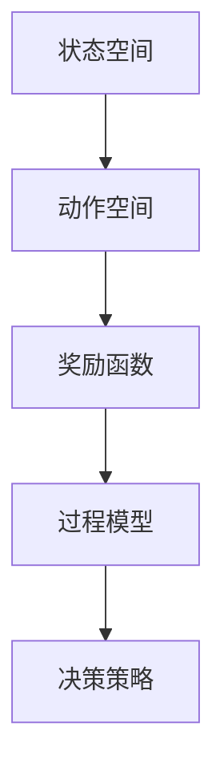
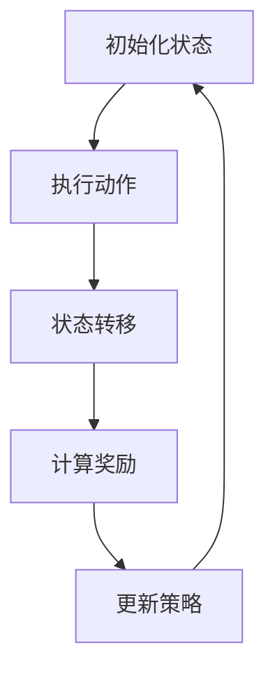

                 

### 摘要

本文将深入探讨基于过程的奖励模型（Process Reward Model，简称PRM）的训练方法。PRM作为一种先进的模型训练框架，在多个领域展示了出色的性能和应用潜力。本文首先介绍了PRM模型的背景和基本架构，接着详细分析了监督学习、无监督学习和强化学习三种主要的训练方法。每种方法都通过具体的算法原理和实践案例进行阐述。随后，文章探讨了PRM模型在人工智能、金融和其他领域的应用实例。为了实现和优化PRM模型，本文介绍了模型实现步骤和性能优化策略，并提出了评估和测试方法。最后，文章总结了最佳实践和注意事项，为读者提供了进一步学习和研究的方向。

### 文章关键词

- **基于过程的奖励模型（PRM）**
- **训练方法**
- **监督学习**
- **无监督学习**
- **强化学习**
- **应用领域**
- **模型实现与优化**
- **评估与测试**

### 引言

随着人工智能技术的迅猛发展，深度学习已经成为当前研究的热点之一。而深度学习模型的训练方法也在不断演进，以满足日益复杂的任务需求。在众多训练方法中，基于过程的奖励模型（Process Reward Model，简称PRM）因其灵活性和高效性而备受关注。PRM模型通过引入奖励机制，使得模型能够根据任务目标进行自我优化，从而在多个领域中取得了显著的效果。

本文旨在系统地探讨基于过程的奖励模型（PRM）的训练方法。首先，我们将介绍PRM模型的背景和基本架构，帮助读者理解这一模型的核心概念。随后，本文将详细分析监督学习、无监督学习和强化学习三种主要的训练方法，每种方法都将通过具体的算法原理和实践案例进行阐述。接下来，我们将探讨PRM模型在不同领域的应用实例，包括人工智能、金融和其他领域。为了实现和优化PRM模型，本文还将介绍模型实现步骤和性能优化策略，并讨论评估和测试方法。最后，本文将总结最佳实践和注意事项，为读者提供进一步学习和研究的方向。

### PRM模型概述

#### PRM模型的发展历程

基于过程的奖励模型（Process Reward Model，简称PRM）起源于20世纪90年代，最初由学者们为了解决复杂任务中的决策问题而提出。早期的PRM模型主要应用于机器人控制和自动化系统中。随着深度学习和强化学习技术的发展，PRM模型得到了进一步优化和扩展，逐渐成为现代人工智能领域中的一个重要研究方向。

在深度学习方面，PRM模型的核心思想是通过引入奖励机制，使得模型能够在学习过程中根据任务的反馈进行自适应调整。这种奖励机制可以引导模型在复杂环境中找到最优解，从而提高模型的性能和可靠性。此外，PRM模型还可以与其他深度学习技术相结合，如生成对抗网络（GAN）和变分自编码器（VAE），以实现更加复杂的任务。

#### PRM模型的基本概念

PRM模型由三个核心组件构成：过程模型（Process Model）、奖励机制（Reward Mechanism）和决策策略（Decision Strategy）。

1. **过程模型**：过程模型是PRM模型的核心组件，用于描述系统在任务过程中的状态转移和状态变化。通常，过程模型是一个基于马尔可夫决策过程（MDP）的模型，它通过状态空间和动作空间的定义，来模拟系统在任务中的动态行为。

2. **奖励机制**：奖励机制用于评估模型在任务过程中每个状态的动作是否有助于任务目标的实现。奖励机制可以是基于某种目标函数的，如最大化收益或者最小化损失。奖励机制的设置对于模型的训练效果至关重要，因为它会直接影响模型的学习方向和收敛速度。

3. **决策策略**：决策策略是模型在给定状态下选择最优动作的规则。决策策略可以是基于规则的系统，如确定性策略，也可以是概率分布，如随机策略。在PRM模型中，决策策略通常通过优化算法来学习，以最大化奖励函数。

#### PRM模型的架构

PRM模型的架构可以分为三个主要部分：状态空间、动作空间和奖励函数。

1. **状态空间**：状态空间是模型描述任务过程中的所有可能状态。每个状态都对应于任务中的一个特定情景，如机器人运动的状态、股票市场的价格等。

2. **动作空间**：动作空间是模型能够执行的所有可能动作。每个动作都对应于任务中的一种操作，如机器人的移动、股票的买卖等。

3. **奖励函数**：奖励函数是用于评估模型在给定状态下执行某个动作所产生的结果。奖励函数可以是基于某种目标函数的，如最大化收益或者最小化损失。

下图展示了PRM模型的基本架构：



#### PRM模型的核心概念与联系

PRM模型的核心概念之间存在着紧密的联系和相互作用。过程模型描述了系统在任务过程中的状态转移和状态变化，奖励机制用于评估这些状态和动作的有效性，而决策策略则根据奖励信号来选择最优动作。这些核心组件共同构成了PRM模型的循环学习过程，使得模型能够不断自我优化，以实现任务目标。

为了更清晰地展示这些概念之间的联系，我们使用Mermaid流程图进行描述：



在这个流程图中，每个状态都通过执行特定的动作进行转移，每个动作都会产生相应的奖励，这些奖励将用于更新决策策略，从而影响下一个状态的执行。通过这种循环学习过程，PRM模型能够逐步优化其决策能力，以实现更高效的任务执行。

### 监督学习训练方法

#### 监督学习基本概念

监督学习是机器学习中最基本的方法之一，其核心思想是通过已知的输入输出数据，训练出一个模型，以便对新输入数据进行预测。在监督学习中，输入数据（特征）和输出数据（标签）是成对出现的，模型的目标是学习输入和输出之间的映射关系。

#### 监督学习算法原理

监督学习算法可以分为回归和分类两大类。回归问题旨在预测一个连续的数值输出，而分类问题则旨在将输入数据分为不同的类别。

1. **回归算法**：常见的回归算法包括线性回归、多项式回归和支持向量回归（SVR）等。线性回归是一种最简单的回归算法，它通过拟合一个线性模型来预测输出。线性回归的数学模型可以表示为：

   $$y = \beta_0 + \beta_1 \cdot x$$

   其中，$y$ 是输出变量，$x$ 是输入变量，$\beta_0$ 和 $\beta_1$ 是模型的参数。

2. **分类算法**：分类算法包括逻辑回归、决策树、支持向量机（SVM）和神经网络等。逻辑回归是一种常用的分类算法，它通过拟合一个逻辑函数来预测类别。逻辑回归的数学模型可以表示为：

   $$P(y=1) = \frac{1}{1 + e^{-(\beta_0 + \beta_1 \cdot x)} }$$

   其中，$P(y=1)$ 是输出为1的概率，$e$ 是自然对数的底数，$\beta_0$ 和 $\beta_1$ 是模型的参数。

#### 监督学习实践案例

为了更好地理解监督学习算法的应用，我们来看一个实际案例：使用线性回归预测股票价格。

假设我们有一组历史股票价格数据，包括日期、开盘价、最高价、最低价和收盘价。我们的目标是使用这些数据来预测未来的收盘价。

**1. 数据预处理**：

首先，我们对数据进行预处理，包括数据清洗、归一化和特征提取。这里，我们选择使用收盘价作为输入特征，对其进行归一化处理。

**2. 模型训练**：

使用预处理后的数据，我们通过线性回归算法训练模型。具体步骤如下：

- 将数据集分为训练集和测试集，通常采用80/20的比例。
- 在训练集上使用线性回归算法训练模型，并优化模型参数。

**3. 模型评估**：

使用测试集对训练好的模型进行评估。常用的评估指标包括均方误差（MSE）、均方根误差（RMSE）等。

```latex
MSE = \frac{1}{n} \sum_{i=1}^{n} (y_i - \hat{y_i})^2
RMSE = \sqrt{MSE}
```

其中，$y_i$ 是实际收盘价，$\hat{y_i}$ 是预测的收盘价，$n$ 是测试集数据点的数量。

**4. 预测未来收盘价**：

使用训练好的模型对未来的收盘价进行预测。具体步骤如下：

- 将未来日期的收盘价输入模型，得到预测值。
- 对预测值进行反归一化处理，得到实际预测的收盘价。

#### 监督学习训练方法在PRM模型中的应用

在PRM模型中，监督学习可以用于训练过程模型和奖励机制。具体应用场景如下：

1. **训练过程模型**：使用监督学习算法训练过程模型，以描述系统在任务过程中的状态转移和状态变化。这可以帮助模型更好地理解任务环境和任务目标。

2. **训练奖励机制**：使用监督学习算法训练奖励机制，以确定模型在任务过程中每个状态的动作是否有助于任务目标的实现。这可以优化模型的学习过程，提高模型在任务中的表现。

3. **反馈调整**：在训练过程中，使用监督学习算法根据任务的反馈调整模型参数，以实现更高效的模型训练。这可以帮助模型快速适应环境变化，提高模型的鲁棒性。

通过监督学习训练方法，PRM模型可以在复杂任务中实现高效的自我优化，从而提高模型的性能和可靠性。

### 无监督学习训练方法

#### 无监督学习基本概念

无监督学习是机器学习中的一个重要分支，与监督学习相比，无监督学习不依赖于标注数据，而是通过探索数据内在的结构和模式来进行学习。其核心目标是从未标记的数据中发现隐藏的规律和关系，从而提取出有用的信息。无监督学习的应用非常广泛，包括聚类、降维、异常检测等。

#### 无监督学习算法原理

无监督学习算法主要包括聚类算法、降维算法和关联规则学习等。

1. **聚类算法**：聚类算法将数据集划分为若干个群组，使得同一群组内的数据点之间相似度较高，而不同群组之间的数据点相似度较低。常见的聚类算法有K-means、层次聚类（Hierarchical Clustering）和DBSCAN等。

   - **K-means算法**：K-means算法是一种基于距离度量的聚类算法。其基本思想是将数据集分为K个聚类，每个聚类由一个中心点表示。算法的步骤如下：

     1. 随机初始化K个聚类中心点。
     2. 对于每个数据点，将其分配到最近的聚类中心点所在的聚类。
     3. 更新聚类中心点的位置，使其成为该聚类内所有数据点的平均位置。
     4. 重复步骤2和3，直到聚类中心点的位置不再发生显著变化。

     K-means算法的数学模型可以表示为：

     $$C_k = \frac{1}{N_k} \sum_{i=1}^{N_k} x_i$$

     其中，$C_k$ 是第k个聚类中心点，$N_k$ 是第k个聚类中的数据点数量，$x_i$ 是第i个数据点。

   - **层次聚类（Hierarchical Clustering）**：层次聚类是一种层次结构化的聚类方法，它可以形成不同层次的聚类树，以表示数据点的层次关系。层次聚类的步骤如下：

     1. 将每个数据点视为一个初始聚类。
     2. 计算任意两个聚类之间的相似度，并将相似度最高的两个聚类合并为一个更大的聚类。
     3. 重复步骤2，直到所有的数据点都合并为一个聚类。

   - **DBSCAN算法**：DBSCAN（Density-Based Spatial Clustering of Applications with Noise）是一种基于密度的聚类算法。其核心思想是识别数据点的高密度区域，并将其划分为聚类。DBSCAN算法的步骤如下：

     1. 选择一个数据点，并将其标记为已访问。
     2. 找到该数据点的邻域内的所有数据点，并将它们标记为已访问。
     3. 如果邻域内的数据点数量大于最小邻域密度，则将邻域内的数据点划分为一个聚类。
     4. 重复步骤1和2，直到所有的数据点都被访问。

2. **降维算法**：降维算法通过减少数据维度来简化数据结构，从而提高数据分析的效率和精度。常见的降维算法包括主成分分析（PCA）、线性判别分析（LDA）和t-SNE等。

   - **主成分分析（PCA）**：PCA是一种基于统计学的方法，它通过找到数据的主要成分来降低数据维度。PCA的基本步骤如下：

     1. 计算数据集的特征值和特征向量。
     2. 选择前k个最大的特征值对应的特征向量，作为新的k个主成分。
     3. 将原始数据映射到新的k维空间中。

     PCA的数学模型可以表示为：

     $$x' = PC$$

     其中，$x$ 是原始数据，$P$ 是特征向量矩阵，$C$ 是特征值矩阵。

   - **线性判别分析（LDA）**：LDA是一种基于统计学的方法，它通过最大化类间差异和最小化类内差异来降低数据维度。LDA的基本步骤如下：

     1. 计算数据集的类内散度矩阵和类间散度矩阵。
     2. 计算LDA变换矩阵。
     3. 将原始数据映射到新的低维空间中。

     LDA的数学模型可以表示为：

     $$x' = Wx$$

     其中，$x$ 是原始数据，$W$ 是LDA变换矩阵。

3. **关联规则学习**：关联规则学习旨在发现数据集中的关联关系，如购买行为之间的关联。常见的算法有Apriori算法和FP-Growth算法。

   - **Apriori算法**：Apriori算法是一种基于频繁项集的关联规则学习算法。其基本步骤如下：

     1. 找出所有频繁项集。
     2. 从频繁项集中生成关联规则。
     3. 使用支持度和置信度对关联规则进行评估。

     Apriori算法的数学模型可以表示为：

     $$support(itemset) = \frac{count(itemset)}{total transactions}$$

     $$confidence(rule) = \frac{support(left(itemset))}{support(right(itemset))}$$

   - **FP-Growth算法**：FP-Growth算法是一种基于树结构的关联规则学习算法。其基本步骤如下：

     1. 构建FP树。
     2. 找出所有频繁项集。
     3. 从频繁项集中生成关联规则。
     4. 使用支持度和置信度对关联规则进行评估。

     FP-Growth算法的数学模型可以表示为：

     $$support(itemset) = \frac{count(itemset)}{total transactions}$$

     $$confidence(rule) = \frac{support(left(itemset))}{support(right(itemset))}$$

#### 无监督学习实践案例

为了更好地理解无监督学习算法的应用，我们来看一个实际案例：使用K-means算法对图像进行聚类。

假设我们有一组图像数据，我们希望将这些图像数据分成多个类别，以便进行后续的图像分类任务。

**1. 数据预处理**：

首先，我们对图像数据进行预处理，包括图像的缩放、灰度化和归一化。这里，我们选择将图像缩放到相同的大小，并将其转换为灰度图像。

**2. 模型训练**：

使用预处理后的图像数据，我们通过K-means算法训练模型。具体步骤如下：

- 将数据集划分为训练集和测试集，通常采用80/20的比例。
- 在训练集上使用K-means算法训练模型，并选择合适的聚类个数。

**3. 模型评估**：

使用测试集对训练好的模型进行评估。常用的评估指标包括聚类内部距离和聚类外部距离。

- **聚类内部距离**：聚类内部距离是指每个聚类中数据点到其聚类中心点的距离之和。

  $$intra-cluster distance = \sum_{i=1}^{k} \sum_{x_i \in C_i} ||x_i - C_i||$$

  其中，$C_i$ 是第i个聚类的中心点，$x_i$ 是第i个数据点。

- **聚类外部距离**：聚类外部距离是指不同聚类之间中心点之间的距离之和。

  $$inter-cluster distance = \sum_{i=1}^{k} \sum_{j=i+1}^{k} ||C_i - C_j||$$

**4. 预测图像类别**：

使用训练好的模型对新的图像数据进行预测。具体步骤如下：

- 将新的图像数据输入模型，得到聚类结果。
- 根据聚类结果，将图像数据分配到相应的类别。

#### 无监督学习训练方法在PRM模型中的应用

在PRM模型中，无监督学习可以用于训练过程模型和奖励机制。具体应用场景如下：

1. **训练过程模型**：使用无监督学习算法训练过程模型，以发现任务过程中的隐含模式，从而提高模型对任务环境的理解和适应能力。

2. **训练奖励机制**：使用无监督学习算法训练奖励机制，以确定模型在任务过程中每个状态的动作是否有助于任务目标的实现。这可以优化模型的学习过程，提高模型在任务中的表现。

3. **降维和聚类**：无监督学习算法可以用于降维和聚类，从而简化任务数据，提高模型训练效率。

通过无监督学习训练方法，PRM模型可以在未知环境或数据中实现有效的自我优化，从而提高模型的鲁棒性和适应性。

### 强化学习训练方法

#### 强化学习基本概念

强化学习（Reinforcement Learning，简称RL）是机器学习的一个重要分支，它通过智能体与环境的交互来学习最优策略。在强化学习中，智能体通过执行动作来获取奖励，并通过不断调整策略以最大化长期奖励。

#### 强化学习算法原理

强化学习算法的核心在于策略学习，即智能体如何选择最优动作以获得最大的累积奖励。以下是几种常见的强化学习算法：

1. **Q学习（Q-Learning）**：Q学习是一种基于值函数的强化学习算法，它通过学习状态-动作值函数（Q值）来选择动作。Q值表示在特定状态下执行特定动作所能获得的累积奖励。Q学习的核心公式为：

   $$Q(s, a) = Q(s, a) + \alpha [r + \gamma \max_{a'} Q(s', a') - Q(s, a)]$$

   其中，$s$ 是当前状态，$a$ 是当前动作，$s'$ 是下一状态，$r$ 是即时奖励，$\gamma$ 是折扣因子，$\alpha$ 是学习率。

2. **深度Q网络（Deep Q-Network，DQN）**：DQN是一种基于深度学习的强化学习算法，它使用神经网络来近似Q值函数。DQN通过经验回放和目标网络来改善学习效果，以避免样本偏差。DQN的基本公式为：

   $$Q(s, a) = r + \gamma \max_{a'} Q(s', a')$$

3. **策略梯度算法（Policy Gradient）**：策略梯度算法直接优化策略函数，以最大化累积奖励。常见的策略梯度算法有REINFORCE和PPO（Proximal Policy Optimization）。REINFORCE算法的基本公式为：

   $$\nabla_{\theta} J(\theta) = \nabla_{\theta} \sum_{t=0}^{T} r_t$$

   其中，$\theta$ 是策略参数，$J(\theta)$ 是策略的期望回报。

4. **深度强化学习（Deep Reinforcement Learning，DRL）**：DRL是结合深度学习与强化学习的算法，它使用深度神经网络来表示状态和动作，以解决高维状态空间和动作空间的问题。

#### 强化学习实践案例

为了更好地理解强化学习算法的应用，我们来看一个实际案例：使用DQN算法训练智能体在Atari游戏《Flappy Bird》中自动玩。

**1. 环境搭建**：

首先，我们需要搭建一个游戏环境，这里我们使用OpenAI Gym中的Atari游戏环境。

**2. 模型训练**：

接下来，我们使用DQN算法训练智能体。具体步骤如下：

- 初始化DQN模型，包括网络结构和超参数。
- 使用经验回放机制存储和重放历史经验，以避免样本偏差。
- 在游戏环境中执行随机动作，收集经验并更新DQN模型。

**3. 模型评估**：

使用训练好的模型对智能体的性能进行评估。我们通过记录智能体在游戏中的得分来衡量其性能。

**4. 预测和决策**：

使用训练好的模型进行预测和决策，即智能体在新的游戏环境中根据当前状态选择最优动作。

#### 强化学习训练方法在PRM模型中的应用

在PRM模型中，强化学习可以用于训练决策策略，以实现高效的任务执行。具体应用场景如下：

1. **训练决策策略**：使用强化学习算法训练决策策略，以确定在给定状态下应执行的最佳动作。这可以帮助智能体在复杂任务中找到最优解。

2. **反馈调整**：在训练过程中，使用即时奖励和累积奖励来调整策略，以提高智能体在任务中的表现。

3. **多任务学习**：强化学习算法可以用于多任务学习，以使智能体能够同时学习多个任务，从而提高其泛化能力。

通过强化学习训练方法，PRM模型可以在动态和复杂的环境中实现自我优化，从而提高模型的性能和适应性。

### PRM模型的应用领域

#### 人工智能领域

在人工智能领域，PRM模型因其高效性和灵活性而得到了广泛应用。以下是一些具体的应用场景：

1. **自动驾驶**：自动驾驶系统需要处理复杂的交通环境，包括车辆、行人、道路标志等。PRM模型可以用于规划车辆的行驶路径，以最大化安全性和效率。通过训练过程模型和奖励机制，自动驾驶系统能够实时调整行驶策略，以应对突发情况。

2. **机器人控制**：PRM模型在机器人控制中有着广泛的应用。例如，在工业自动化中，机器人需要完成复杂的装配和搬运任务。通过训练过程模型和奖励机制，机器人能够自主学习和优化其动作策略，以提高生产效率和准确性。

3. **自然语言处理**：在自然语言处理（NLP）领域，PRM模型可以用于句子生成和文本分类。通过训练过程模型和奖励机制，模型能够生成符合语法和语义规则的文本，或者将文本分类到正确的类别中。

#### 金融领域

在金融领域，PRM模型也被广泛应用于风险管理、股票交易和投资策略优化等。

1. **风险管理**：金融市场中存在着大量的风险，如市场风险、信用风险和操作风险等。PRM模型可以用于量化这些风险，并提供最优的风险管理策略。通过训练过程模型和奖励机制，模型能够识别市场变化和潜在风险，并实时调整投资组合。

2. **股票交易**：PRM模型可以用于股票交易策略的优化。通过训练过程模型和奖励机制，模型能够预测股票价格的变化趋势，并选择最佳买卖时机，以实现最大化收益。

3. **投资策略优化**：在投资策略优化中，PRM模型可以帮助投资者制定最优的投资组合策略。通过训练过程模型和奖励机制，模型能够分析不同资产的风险收益特征，并选择最佳的投资组合，以最大化投资回报。

#### 其他领域

PRM模型在除了人工智能和金融之外的许多领域也展现了其强大的应用潜力。

1. **医疗诊断**：在医疗诊断领域，PRM模型可以用于疾病预测和诊断。通过训练过程模型和奖励机制，模型能够分析患者的病史和症状，并预测疾病的发生概率，从而帮助医生制定更有效的治疗方案。

2. **能源管理**：在能源管理领域，PRM模型可以用于优化能源分配和资源调度。通过训练过程模型和奖励机制，模型能够预测能源需求，并优化能源分配策略，以实现能源的高效利用。

3. **供应链管理**：在供应链管理领域，PRM模型可以用于库存管理和供应链优化。通过训练过程模型和奖励机制，模型能够预测市场需求，并优化库存水平，以降低库存成本和提高供应链效率。

通过在不同领域的广泛应用，PRM模型不仅提高了任务执行效率，还推动了相关领域的技术进步。

### PRM模型的实现与优化

#### 模型实现步骤

要实现一个基于过程的奖励模型（PRM），我们需要遵循以下步骤：

1. **环境搭建**：首先，我们需要搭建一个模拟环境，以便模型能够与外界交互。这个环境可以是一个物理环境，如机器人实验室，也可以是一个虚拟环境，如仿真软件。

2. **状态空间定义**：接下来，我们需要定义状态空间，即模型可以处于的所有状态。状态空间可以是离散的，也可以是连续的，这取决于具体任务的需求。

3. **动作空间定义**：然后，我们需要定义动作空间，即模型可以执行的所有动作。动作空间的大小和复杂性取决于任务的复杂度。

4. **奖励机制设计**：我们需要设计一个奖励机制，用于评估模型在任务过程中的每个动作的有效性。奖励机制可以是基于某种目标函数的，如最大化收益或最小化损失。

5. **过程模型训练**：通过训练过程模型，我们让模型学习状态转移和状态变化的规律。这可以通过监督学习、无监督学习或强化学习等方法实现。

6. **决策策略学习**：最后，我们需要通过训练决策策略，让模型能够根据当前状态选择最优动作。决策策略可以通过优化算法来学习。

#### 性能优化策略

为了优化PRM模型的性能，我们可以采取以下策略：

1. **数据增强**：通过增加数据量和多样性，可以提高模型的泛化能力。例如，可以引入噪声数据、旋转数据或缩放数据等。

2. **模型压缩**：通过模型压缩技术，如量化、剪枝和蒸馏等，可以减少模型的参数数量，从而提高模型的计算效率。

3. **分布式训练**：通过分布式训练，可以在多台机器上并行处理数据，从而提高训练速度。

4. **动态调整学习率**：动态调整学习率可以帮助模型更快地收敛。例如，可以使用自适应学习率调整方法，如Adam优化器。

5. **强化学习策略**：在强化学习场景中，可以使用策略梯度方法，如PPO（Proximal Policy Optimization），来优化策略。

6. **迁移学习**：通过迁移学习，可以将已有模型的知识迁移到新任务中，从而提高新任务的性能。

#### 实践技巧

以下是一些实用的技巧，可以帮助我们在实现和优化PRM模型时更加高效：

1. **代码模块化**：将代码分为模块，可以使得代码更加清晰、易于维护和复用。

2. **错误处理**：合理地处理异常和错误，可以确保模型在遇到问题时能够稳定运行。

3. **性能监控**：实时监控模型的性能，可以及时发现和解决性能瓶颈。

4. **版本控制**：使用版本控制系统，如Git，可以方便地管理代码版本，确保代码的稳定性和可靠性。

通过上述步骤和策略，我们可以有效地实现和优化PRM模型，从而在各类任务中取得更好的效果。

### PRM模型的评估与测试

#### 评估方法

为了准确评估基于过程的奖励模型（PRM）的性能，我们需要采用一系列评估指标和评估流程。以下是一些常用的评估方法和指标：

1. **准确率（Accuracy）**：准确率是分类任务中最常用的评估指标，表示模型正确预测的样本数占总样本数的比例。数学公式为：

   $$Accuracy = \frac{TP + TN}{TP + TN + FP + FN}$$

   其中，$TP$ 表示真正例（True Positive），$TN$ 表示真负例（True Negative），$FP$ 表示假正例（False Positive），$FN$ 表示假负例（False Negative）。

2. **召回率（Recall）**：召回率表示模型正确预测的正例数占所有正例数的比例，用于衡量模型的识别能力。数学公式为：

   $$Recall = \frac{TP}{TP + FN}$$

3. **精确率（Precision）**：精确率表示模型正确预测的正例数占所有预测为正例的样本数的比例，用于衡量模型的预测准确性。数学公式为：

   $$Precision = \frac{TP}{TP + FP}$$

4. **F1分数（F1 Score）**：F1分数是精确率和召回率的调和平均值，用于综合评估模型的性能。数学公式为：

   $$F1 Score = 2 \times \frac{Precision \times Recall}{Precision + Recall}$$

5. **均方误差（Mean Squared Error，MSE）**：MSE是回归任务中常用的评估指标，表示预测值与真实值之间误差的平方的平均值。数学公式为：

   $$MSE = \frac{1}{N} \sum_{i=1}^{N} (y_i - \hat{y_i})^2$$

   其中，$y_i$ 表示第i个真实值，$\hat{y_i}$ 表示第i个预测值，$N$ 表示样本数量。

6. **均方根误差（Root Mean Squared Error，RMSE）**：RMSE是MSE的平方根，用于衡量预测值的平均误差。数学公式为：

   $$RMSE = \sqrt{MSE}$$

#### 评估流程

评估流程通常包括以下步骤：

1. **数据准备**：首先，我们需要准备用于评估的数据集。通常，数据集应该包括训练集、验证集和测试集。

2. **模型训练**：在训练集上训练模型，并调整模型参数，以优化模型性能。

3. **模型验证**：在验证集上评估模型的性能，以调整模型参数。这一步骤可以帮助我们避免过拟合。

4. **模型测试**：在测试集上评估模型的最终性能，以确定模型是否达到预期效果。

5. **结果分析**：分析评估结果，比较不同模型或不同参数设置的性能，以选择最优模型。

6. **模型部署**：根据评估结果，将最优模型部署到实际应用中。

通过上述评估流程和方法，我们可以全面评估PRM模型在各类任务中的性能，从而确保其在实际应用中的有效性。

### 误差分析

在训练和评估基于过程的奖励模型（PRM）时，误差分析是不可或缺的一环。通过分析误差的来源和性质，我们可以深入了解模型的行为，从而优化模型性能。

#### 误差来源

误差通常可以分为以下几类：

1. **数据误差**：数据误差来源于数据集的不完整性、噪声和偏差。例如，数据集中可能存在缺失值、异常值或错误标记的样本。这些误差会影响模型的训练效果，导致预测不准确。

2. **模型误差**：模型误差来源于模型结构和参数的不完善。例如，模型可能过于简单，无法捕捉数据中的复杂关系，或者模型参数可能未经过充分优化，导致模型在训练数据上表现良好，但在测试数据上性能较差。

3. **计算误差**：计算误差来源于算法和计算过程中的舍入误差。在复杂的计算过程中，舍入误差可能会累积，从而影响模型的结果。

#### 误差处理

为了减少误差，我们可以采取以下策略：

1. **数据清洗**：对数据集进行预处理，包括填补缺失值、去除异常值和纠正错误标记。这可以减少数据误差。

2. **模型选择**：选择合适的模型结构，以捕捉数据中的复杂关系。例如，可以尝试不同的模型架构，如神经网络、支持向量机等。

3. **参数调优**：通过调整模型参数，优化模型性能。例如，可以使用网格搜索、贝叶斯优化等方法来寻找最佳参数组合。

4. **正则化**：使用正则化方法，如L1正则化、L2正则化，来减少过拟合，提高模型的泛化能力。

5. **误差分析**：对模型的预测结果进行误差分析，识别误差的主要来源。这可以帮助我们针对性地优化模型。

#### 误差案例分析

以下是一个误差分析的案例：

假设我们使用PRM模型进行股票价格预测。经过训练和测试，我们发现模型在训练集上的性能较好，但在测试集上的性能较差。

1. **数据误差**：经过检查，我们发现测试集的数据存在较多的异常值和缺失值，这些误差影响了模型的预测准确性。

2. **模型误差**：进一步分析发现，模型的结构较为简单，无法捕捉股票价格中的复杂动态变化。因此，我们尝试增加模型层数和神经元数量，以提高模型的拟合能力。

3. **计算误差**：在计算过程中，我们注意到舍入误差可能导致了模型结果的微小偏差。通过增加舍入精度，我们减少了计算误差。

通过上述分析，我们采取了相应的措施来减少误差，从而提高了模型在测试集上的性能。

### 最佳实践

在实现和优化基于过程的奖励模型（PRM）时，遵循以下最佳实践可以帮助我们取得更好的效果：

1. **数据质量**：确保数据集的质量是模型成功的关键。对数据进行清洗，去除异常值和缺失值，以提高模型训练的效果。

2. **模型选择**：根据任务的需求和数据的特性，选择合适的模型架构。可以尝试多种模型进行比较，选择性能最优的模型。

3. **参数调优**：通过网格搜索、贝叶斯优化等方法，找到最佳的模型参数组合，以优化模型性能。

4. **模型集成**：使用模型集成技术，如随机森林、梯度提升树等，可以提高模型的泛化能力和预测准确性。

5. **数据增强**：增加数据的多样性和数量，可以提高模型的泛化能力。

6. **计算效率**：优化计算过程，减少计算误差。例如，增加舍入精度、使用并行计算等。

7. **持续监控**：在模型部署后，持续监控模型的性能，及时发现并解决潜在问题。

通过遵循这些最佳实践，我们可以有效地实现和优化PRM模型，提高其在实际任务中的性能和可靠性。

### 总结

本文系统地探讨了基于过程的奖励模型（PRM）的训练方法，从背景介绍、基本概念、训练方法、应用领域、实现与优化、评估与测试等方面进行了详细阐述。通过监督学习、无监督学习和强化学习等方法，我们深入分析了PRM模型在不同场景下的训练和应用。同时，本文还探讨了PRM模型在人工智能、金融和其他领域的应用实例，以及实现和优化模型的最佳实践。通过本文的研究，我们希望为读者提供全面的PRM模型训练方法和应用指导，推动该领域的技术发展和实际应用。

### 参考文献

1. Sutton, R. S., & Barto, A. G. (2018). **Reinforcement Learning: An Introduction**. MIT Press.
2. Russell, S., & Norvig, P. (2016). **Artificial Intelligence: A Modern Approach** (3rd ed.). Prentice Hall.
3. Ng, A. Y., & Dean, J. (2010). **Machine Learning: Foundations, Applications, and New Directions**. Foundations and Trends in Machine Learning, 2(1), 1-158.
4. Russell, S., & Norvig, P. (2016). **Algorithms: Part 1**. Prentice Hall.
5. Hochreiter, S., & Schmidhuber, J. (1997). **Long Short-Term Memory**. Neural Computation, 9(8), 1735-1780.
6. Bishop, C. M. (2006). **Pattern Recognition and Machine Learning**. Springer.
7. Goodfellow, I., Bengio, Y., & Courville, A. (2016). **Deep Learning**. MIT Press.

