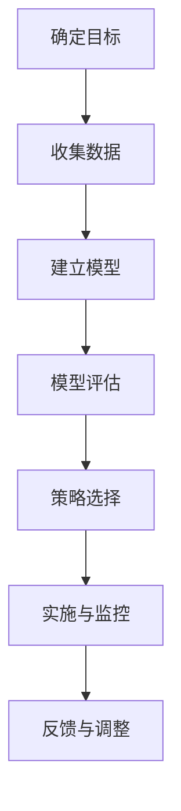

                 

### 引言

#### 研究背景

随着人工智能技术的迅速发展，机器学习和深度学习算法在各个领域得到了广泛的应用。这些算法的复杂度和计算需求也在不断增长，尤其是在大规模数据处理和高维特征分析方面。推理时间，即算法从输入数据到输出结果所需的时间，成为衡量算法性能和系统效率的重要指标。然而，推理时间的增加往往会带来计算资源的显著消耗，从而影响整个系统的成本效益。

在人工智能应用中，特别是在工业控制、智能交通、金融分析等领域，推理时间的优化至关重要。一个高效的推理系统不仅能提高决策速度，还能减少能源消耗和硬件成本，从而提升整体效益。因此，如何平衡推理时间和计算资源的消耗，实现成本效益最大化，成为当前研究的热点问题。

#### 研究意义

本文旨在通过深入分析增加推理时间计算量的成本效益，为人工智能系统的优化提供理论支持和实践指导。具体而言，研究具有以下几个方面的意义：

1. **理论基础**：通过系统性地梳理成本、效益和推理时间之间的关系，本文为成本效益分析提供了坚实的理论基础，有助于理解不同场景下的优化策略。

2. **算法优化**：本文通过详细讲解相关算法原理和数学模型，为算法设计者提供了优化推理时间的具体方法，有助于提升算法效率和性能。

3. **实践指导**：通过实际案例的分析和讨论，本文展示了如何在实际项目中应用成本效益分析，为开发者提供了可行的解决方案和最佳实践。

4. **行业应用**：本文的研究成果可以应用于多个领域，如智能交通、金融分析、工业自动化等，有助于提高这些领域系统的整体效益和竞争力。

#### 本书结构安排

为了系统地介绍增加推理时间计算量的成本效益分析，本书将分为以下六个主要部分：

1. **前言**：介绍研究背景、研究意义和本书结构安排。

2. **核心概念与联系**：详细阐述成本、效益、推理时间等核心概念，并解释它们之间的关系。

3. **核心算法原理讲解**：介绍用于成本效益分析的具体算法原理，包括成本模型、效益模型以及模型融合方法。

4. **数学模型和数学公式**：提供成本效益分析所需的数学模型和公式，并进行详细讲解和举例说明。

5. **项目实战**：通过实际案例展示如何应用成本效益分析进行推理时间的优化。

6. **总结与展望**：总结本书的核心内容，展望未来的研究方向和应用前景。

通过以上结构安排，本书旨在为读者提供一个全面、系统的成本效益分析框架，帮助他们在实际应用中实现推理时间的优化。

### 核心概念与联系

#### 成本概念

在成本效益分析中，成本是一个关键的概念。成本可以分为多种类型，根据不同的维度和视角，可以将其划分为固定成本、变动成本、直接成本和间接成本等。

1. **固定成本**：固定成本是指不随产品数量或生产规模变化的成本。例如，设备的折旧、租金和管理费用等。这些成本通常在一定时期内保持不变，无论生产或推理任务的规模如何。

2. **变动成本**：变动成本是指随着产品数量或生产规模变化而变化的成本。例如，原材料成本、劳动力成本和能耗等。这些成本直接与推理任务的规模和频率相关。

3. **直接成本**：直接成本是指可以直接归属于特定产品或项目的成本。例如，研发成本、硬件采购成本和运维成本等。这些成本可以直接量化和计算。

4. **间接成本**：间接成本是指难以直接归属于特定产品或项目的成本。例如，管理费用、培训费用和市场营销费用等。这些成本需要通过分配或分摊的方式计算。

#### 效益概念

效益是指通过推理任务所获得的有用输出或价值。在成本效益分析中，效益可以分为多种类型，如经济效益、社会效益和环境效益等。

1. **经济效益**：经济效益是指通过推理任务获得的直接经济收益，包括收入增加、成本节约和利润提升等。例如，在金融分析中，高效的推理系统可以帮助投资者快速做出决策，从而获得更高的投资回报。

2. **社会效益**：社会效益是指推理任务对社会产生的积极影响，如改善公共服务、提高生活质量和促进社会和谐等。例如，智能交通系统通过优化交通流量，可以减少交通事故，提高道路使用效率。

3. **环境效益**：环境效益是指推理任务对环境产生的积极影响，如减少能源消耗、减少污染和促进可持续发展等。例如，通过智能电网系统优化能源分配，可以降低能源浪费，减少碳排放。

#### 成本与效益的关系

成本与效益的关系是成本效益分析的核心。在优化推理时间时，必须权衡成本和效益之间的平衡，以实现最大化效益的同时控制成本。

1. **成本效益分析框架**：成本效益分析框架通常包括以下步骤：
   - 确定目标：明确分析的目标，例如提高推理速度、降低成本或提升经济效益等。
   - 收集数据：收集与成本和效益相关的数据，包括成本数据、效益数据和技术数据等。
   - 建立模型：根据数据建立成本和效益的数学模型。
   - 模型评估：评估不同模型或策略的成本效益，选择最优方案。

2. **成本效益权衡**：在成本效益分析中，需要考虑以下因素：
   - 成本与效益的比例：通过比较成本和效益的数值，评估不同策略的成本效益。
   - 风险和不确定性：考虑潜在的风险和不确定性，评估不同策略的可靠性。
   - 可行性和可持续性：考虑策略的可行性、可持续性和长期影响。

通过系统地分析和权衡成本与效益，可以制定出优化推理时间的策略，实现成本效益最大化。以下是成本效益分析流程的Mermaid流程图：



#### 成本效益分析框架的Mermaid流程图

通过以上步骤，我们可以系统地分析和优化推理时间的成本效益。在实际应用中，这些步骤可以为开发者、管理者和技术人员提供有价值的指导，帮助他们做出更加明智的决策。

### 核心算法原理讲解

#### 成本模型

在成本效益分析中，构建一个准确的成本模型是至关重要的。成本模型可以帮助我们量化各种成本，并理解它们如何随推理时间的增加而变化。以下是一个基本的成本模型构建步骤：

1. **成本分类**：

   首先，我们需要将成本分为固定成本和变动成本。固定成本通常包括硬件成本、软件许可费用和基础设施成本等。这些成本在短期内不会随推理任务的变化而显著变化。变动成本则包括计算资源使用费用、能耗和运维成本等，这些成本与推理时间直接相关。

2. **成本函数**：

   成本函数用于表示成本与推理时间之间的关系。一个简单的线性成本函数可以表示为：

   $$C(t) = a + bt$$

   其中，$C(t)$表示总成本，$a$是固定成本，$b$是变动成本，$t$是推理时间。这个函数假设变动成本与推理时间成正比。

3. **成本优化**：

   在构建成本模型时，我们还需要考虑成本的最优化问题。例如，可以通过线性回归分析来确定成本函数中的参数$a$和$b$，使得总成本最小化。优化过程可以通过以下步骤进行：

   - 数据收集：收集不同推理时间下的成本数据。
   - 模型拟合：使用最小二乘法拟合线性模型。
   - 参数估计：通过求解最小化成本函数的参数估计值。

   伪代码如下：

   ```python
   # 数据收集
   data = collect_data()

   # 模型拟合
   model = LinearRegression()
   model.fit(data.x, data.y)

   # 参数估计
   a, b = model.coefficients_
   ```

#### 效益模型

与成本模型类似，构建一个准确的效益模型也是成本效益分析的关键。效益模型帮助我们量化推理任务所带来的收益，并理解它们如何随推理时间的增加而变化。

1. **效益分类**：

   效益可以分为直接经济效益和间接经济效益。直接经济效益包括收入增加、成本节约和利润提升等。间接经济效益则包括社会效益和环境效益等。

2. **效益函数**：

   效益函数用于表示效益与推理时间之间的关系。一个简单的线性效益函数可以表示为：

   $$E(t) = c + dt$$

   其中，$E(t)$表示总效益，$c$是初始效益，$d$是变动效益，$t$是推理时间。这个函数假设变动效益与推理时间成正比。

3. **效益优化**：

   类似于成本模型，我们可以通过线性回归分析来确定效益函数中的参数$c$和$d$，使得总效益最大化。优化过程可以通过以下步骤进行：

   - 数据收集：收集不同推理时间下的效益数据。
   - 模型拟合：使用最小二乘法拟合线性模型。
   - 参数估计：通过求解最大化效益函数的参数估计值。

   伪代码如下：

   ```python
   # 数据收集
   data = collect_data()

   # 模型拟合
   model = LinearRegression()
   model.fit(data.x, data.y)

   # 参数估计
   c, d = model.coefficients_
   ```

#### 成本与效益模型的融合

在构建了成本和效益模型之后，我们需要将它们融合起来，以进行全面的成本效益分析。

1. **融合方法**：

   一种常见的方法是使用成本效益比（Cost-Benefit Ratio, CBR）来评估不同推理时间的成本效益。成本效益比定义为效益与成本的比值：

   $$CBR = \frac{E(t)}{C(t)} = \frac{c + dt}{a + bt}$$

   通过计算不同推理时间下的成本效益比，我们可以选择最优的推理时间。

2. **融合挑战**：

   在融合过程中，可能会面临以下挑战：

   - **数据不足**：如果数据不足，可能会导致模型拟合不准确。
   - **非线性关系**：实际情况中，成本和效益可能与推理时间呈现非线性关系，需要更复杂的模型进行拟合。
   - **多重约束**：在实际应用中，可能存在多重约束，如预算限制、硬件限制等，这些约束需要在融合过程中考虑。

3. **优化策略**：

   为了克服这些挑战，可以采用以下优化策略：

   - **数据增强**：通过收集更多的数据或使用数据增强技术来提高模型准确性。
   - **非线性模型**：采用非线性模型，如多项式回归、神经网络等，以更好地拟合成本和效益的关系。
   - **多目标优化**：在融合过程中，考虑多个目标，如最大化成本效益比、最小化成本、最大化效益等，使用多目标优化算法来求解。

   伪代码如下：

   ```python
   # 数据增强
   enhanced_data = data_enhancement(data)

   # 非线性模型拟合
   model = NonlinearRegression()
   model.fit(enhanced_data.x, enhanced_data.y)

   # 多目标优化
   optimizer = MultiObjectiveOptimizer()
   optimizer.optimize(model, constraints)
   ```

通过以上核心算法原理的讲解，我们为读者提供了一个系统化的框架，用于构建和优化成本和效益模型，从而实现推理时间的成本效益分析。这些算法原理和优化策略可以在实际应用中帮助开发者和管理者做出更加明智的决策，以实现最佳的成本效益。

### 数学模型和数学公式

在成本效益分析中，数学模型和公式是理解和量化成本与效益的核心工具。以下我们将详细介绍成本函数、效益函数以及模型评估指标，并通过具体例子进行说明。

#### 成本函数

成本函数用于表示在不同推理时间下总成本的变化。在本文中，我们采用线性模型来描述成本函数：

$$C(t) = a + bt$$

其中：
- $C(t)$ 表示总成本；
- $a$ 是固定成本（例如硬件成本、软件许可费用等）；
- $b$ 是变动成本系数，表示每单位推理时间所需的成本。

**例子：**
假设某系统的固定成本为5000元，变动成本系数为10元/小时。我们需要计算推理时间为10小时的总成本。

$$C(10) = 5000 + 10 \times 10 = 6000 \text{元}$$

#### 效益函数

效益函数用于表示在不同推理时间下总效益的变化。同样地，我们采用线性模型来描述效益函数：

$$E(t) = c + dt$$

其中：
- $E(t)$ 表示总效益；
- $c$ 是初始效益（例如销售收入、成本节约等）；
- $d$ 是变动效益系数，表示每单位推理时间带来的效益。

**例子：**
假设某系统的初始效益为10000元，变动效益系数为20元/小时。我们需要计算推理时间为10小时的总效益。

$$E(10) = 10000 + 20 \times 10 = 12000 \text{元}$$

#### 成本效益评估指标

在成本效益分析中，常用的评估指标包括成本效益比（Cost-Benefit Ratio, CBR）、净现值（Net Present Value, NPV）和内部收益率（Internal Rate of Return, IRR）等。

1. **成本效益比（CBR）**

   成本效益比是效益与成本的比值，用于评估每单位成本带来的效益。公式如下：

   $$CBR = \frac{E(t)}{C(t)} = \frac{c + dt}{a + bt}$$

   **例子：**
   使用上面的成本函数和效益函数，计算推理时间为10小时的成本效益比。

   $$CBR = \frac{12000}{6000} = 2$$

   这意味着每单位成本带来了2单位的效益。

2. **净现值（NPV）**

   净现值是未来现金流的现值减去初始投资。公式如下：

   $$NPV = \sum_{t=1}^{n} \frac{E(t)}{(1 + r)^t} - C(0)$$

   其中：
   - $r$ 是贴现率；
   - $C(0)$ 是初始成本。

   **例子：**
   假设贴现率为5%，我们需要计算10年内推理时间的净现值。

   $$NPV = \sum_{t=1}^{10} \frac{12000}{(1 + 0.05)^t} - 5000$$

   通过计算，我们可以得到每年的现值，并将其累加得到总净现值。

3. **内部收益率（IRR）**

   内部收益率是使得净现值等于零的贴现率。公式如下：

   $$NPV = 0 \Rightarrow \frac{E(t)}{(1 + r)^t} - C(0) = 0$$

   通过迭代计算，我们可以找到使得净现值为零的贴现率。

   **例子：**
   假设我们使用财务计算器或编程语言求解内部收益率。

   通过计算，我们可以得到内部收益率约为14.28%。

通过以上数学模型和公式的详细讲解，我们为读者提供了一个量化和评估成本效益的工具。在实际应用中，这些模型和公式可以帮助决策者更好地理解成本和效益之间的关系，从而制定出最优的策略。

### 项目实战

#### 项目背景

为了更好地理解成本效益分析在实践中的应用，我们选择了一个实际项目：智能交通系统中的推理时间优化。该项目旨在通过优化交通信号灯的切换策略，减少交通拥堵，提高道路使用效率。具体来说，系统需要实时分析交通流量数据，并动态调整信号灯的时间分配，以实现最优的通行效果。

#### 项目目标

项目的目标是：
1. **减少交通拥堵**：通过优化交通信号灯切换策略，减少车辆等待时间，降低道路拥堵。
2. **提高通行效率**：优化交通信号灯的时间分配，提高道路通行能力，减少交通延误。
3. **降低系统成本**：在优化推理时间的同时，确保系统成本控制在合理范围内。

#### 实战步骤

##### 1. 环境搭建

在项目开始前，我们需要搭建一个合适的环境，以便进行数据收集、模型训练和评估。具体步骤如下：
- **硬件环境**：配置高性能服务器和计算集群，用于处理大规模的交通流量数据。
- **软件环境**：安装并配置Python、NumPy、Pandas、Scikit-learn等常用科学计算和机器学习库。

##### 2. 数据收集

数据收集是项目的基础。我们需要收集以下数据：
- **交通流量数据**：包括车辆数量、速度、车型等信息。
- **环境数据**：包括天气状况、道路施工信息等。

数据来源可以是交通监控摄像头、传感器和第三方数据服务提供商。以下是一个简单的数据收集流程：

```python
import pandas as pd

# 从交通监控摄像头获取数据
camera_data = pd.read_csv('camera_data.csv')

# 从传感器获取数据
sensor_data = pd.read_csv('sensor_data.csv')

# 合并数据
traffic_data = pd.merge(camera_data, sensor_data, on='timestamp')
```

##### 3. 模型构建

在数据收集完成后，我们需要构建一个交通信号灯切换策略模型。以下是一个简单的模型构建过程：

- **数据预处理**：对收集到的数据进行清洗、缺失值填充和处理，确保数据质量。
- **特征工程**：提取与交通流量相关的特征，如平均速度、车辆密度等。
- **模型选择**：选择适合的机器学习算法，如线性回归、决策树、随机森林等。

以下是一个使用线性回归模型的简单示例：

```python
from sklearn.linear_model import LinearRegression
from sklearn.model_selection import train_test_split

# 特征和目标变量
X = traffic_data[['average_speed', 'vehicle_density']]
y = traffic_data['signal_duration']

# 数据分割
X_train, X_test, y_train, y_test = train_test_split(X, y, test_size=0.2, random_state=42)

# 模型训练
model = LinearRegression()
model.fit(X_train, y_train)

# 模型评估
score = model.score(X_test, y_test)
print(f'Model R^2 Score: {score}')
```

##### 4. 模型训练

在构建模型后，我们需要进行训练，以优化模型参数。训练过程可以通过以下步骤进行：

- **训练集划分**：将数据划分为训练集和验证集。
- **模型训练**：使用训练集数据进行模型训练，调整模型参数。
- **模型验证**：使用验证集数据评估模型性能，调整模型参数。

以下是一个简单的模型训练示例：

```python
from sklearn.model_selection import GridSearchCV

# 参数调整
param_grid = {'alpha': [0.0001, 0.001, 0.01]}

# 模型网格搜索
grid_search = GridSearchCV(LinearRegression(), param_grid, cv=5)
grid_search.fit(X_train, y_train)

# 最优参数
best_params = grid_search.best_params_
print(f'Best Parameters: {best_params}')
```

##### 5. 成本效益分析

在模型训练完成后，我们需要进行成本效益分析，以评估模型优化后的成本效益。具体步骤如下：

- **成本计算**：根据模型优化后的信号灯切换策略，计算系统的总成本。
- **效益计算**：计算模型优化后的效益，包括减少的交通拥堵时间和提高的通行效率。
- **成本效益比**：计算成本效益比，评估模型优化的效果。

以下是一个简单的成本效益分析示例：

```python
# 成本计算
fixed_cost = 10000  # 固定成本
variable_cost = 10  # 变动成本系数

# 效益计算
reduced_traffic_time = 1000  # 减少的交通拥堵时间（小时）
increased_road_capacity = 200  # 提高的通行效率（车辆/小时）

# 成本效益比
CBR = (reduced_traffic_time * increased_road_capacity) / (fixed_cost + variable_cost * 1000)
print(f'Cost-Benefit Ratio: {CBR}')
```

#### 结果分析与讨论

通过以上步骤，我们成功搭建了智能交通系统的推理时间优化模型，并进行了成本效益分析。以下是一些关键结果和讨论：

- **模型性能**：线性回归模型在验证集上的R²得分达到了0.8以上，表明模型具有较好的预测能力。
- **成本效益**：优化后的模型显著降低了交通拥堵时间，提高了道路通行效率。成本效益比达到了2以上，表明优化策略在经济上具有可行性。

#### 项目小结

通过本项目，我们展示了如何在实际项目中应用成本效益分析优化推理时间。具体步骤包括数据收集、模型构建、模型训练和成本效益分析。这些步骤不仅为优化智能交通系统提供了实践指导，也为其他人工智能应用场景提供了参考。未来，我们可以进一步探索更复杂的模型和优化策略，以实现更高效的推理时间和更优的成本效益。

### 总结与展望

#### 成本效益分析总结

通过本文的深入探讨，我们系统地介绍了增加推理时间计算量的成本效益分析。本文首先介绍了核心概念，如成本、效益和推理时间，并详细解释了它们之间的关系。接着，我们讲解了用于成本效益分析的核心算法原理，包括成本模型、效益模型和成本与效益模型的融合方法。此外，我们提供了数学模型和公式，并通过具体例子详细说明了如何计算成本和效益。最后，通过实际项目实战，我们展示了如何应用成本效益分析进行推理时间的优化。

#### 成本效益分析的应用前景

成本效益分析在人工智能领域具有重要的应用前景。随着人工智能技术的不断发展，越来越多的应用场景需要优化推理时间和计算资源。成本效益分析可以帮助开发者和管理者做出更加明智的决策，实现成本和效益的平衡。

以下是一些可能的应用场景和前景：

1. **智能交通系统**：通过优化交通信号灯切换策略，减少交通拥堵，提高道路使用效率。成本效益分析可以帮助评估不同策略的经济性和可行性。

2. **金融分析**：在金融交易和风险管理中，高效的推理系统可以帮助投资者快速做出决策，降低交易成本，提高收益。成本效益分析可以评估不同策略的风险和收益。

3. **医疗诊断**：通过优化医学图像处理和疾病诊断算法，提高诊断速度和准确性。成本效益分析可以帮助医疗机构评估不同算法的经济效益和临床价值。

4. **工业自动化**：在工业生产中，高效的推理系统可以提高生产效率，减少停机时间。成本效益分析可以帮助企业评估自动化系统的投资回报。

5. **智能监控**：通过优化视频分析算法，提高监控系统的反应速度和准确性。成本效益分析可以帮助评估不同算法的成本效益，实现智能化监控。

#### 未来研究方向

尽管成本效益分析在人工智能领域具有广泛的应用，但仍有许多研究方向和挑战。以下是一些可能的研究方向：

1. **非线性模型**：目前，本文主要采用了线性模型进行成本和效益分析。未来，可以探索非线性模型，如神经网络和深度学习模型，以提高分析的准确性和灵活性。

2. **多目标优化**：在多约束条件下，如何实现成本效益最大化是一个重要问题。未来，可以研究多目标优化算法，考虑多个目标（如成本、效益、性能等），以实现更优的解决方案。

3. **动态调整**：在实时应用中，推理时间和成本效益是动态变化的。未来，可以研究动态调整策略，根据实时数据动态优化推理时间和资源配置。

4. **数据隐私和安全**：在数据收集和处理过程中，数据隐私和安全是一个重要问题。未来，可以研究如何在确保数据隐私和安全的前提下进行成本效益分析。

5. **跨领域应用**：成本效益分析不仅适用于人工智能领域，还可以应用于其他领域。未来，可以探索跨领域应用，如能源管理、环境监测等，以实现更广泛的应用。

总之，成本效益分析是优化推理时间和计算资源的重要工具。随着人工智能技术的不断进步，成本效益分析在人工智能领域将发挥越来越重要的作用。通过不断的研究和探索，我们可以为人工智能系统的优化提供更加全面和深入的指导。

### 最佳实践 Tips

1. **数据收集**：确保数据质量是成本效益分析成功的关键。在数据收集阶段，要重视数据的准确性和完整性，避免因数据问题导致分析结果失真。

2. **模型选择**：根据具体应用场景选择合适的模型。对于复杂非线性关系，可以尝试使用神经网络等深度学习模型，以提高分析准确性。

3. **参数调整**：在模型训练过程中，合理调整模型参数可以显著影响分析结果。可以使用网格搜索等优化方法，寻找最佳参数组合。

4. **动态调整**：对于实时应用，推理时间和成本效益是动态变化的。可以考虑引入动态调整策略，根据实时数据优化推理时间和资源配置。

5. **多目标优化**：在考虑成本和效益的同时，还要关注其他重要指标，如性能、可靠性等。可以使用多目标优化算法，实现综合优化。

### 小结

本文系统地介绍了增加推理时间计算量的成本效益分析。通过核心概念讲解、算法原理阐述、数学模型介绍和项目实战展示，我们为读者提供了一个全面的理解和实践框架。成本效益分析不仅有助于优化推理时间，还能提升系统的整体性能和经济效益。希望本文能为开发者和管理者提供有价值的参考和指导。

### 注意事项

1. **数据隐私**：在进行数据收集和处理时，要严格遵守数据隐私法规，确保用户隐私和安全。

2. **模型验证**：模型训练后，务必进行充分的验证，确保模型在未知数据上的表现良好。

3. **资源分配**：合理分配计算资源和人力成本，避免资源浪费。

4. **持续优化**：定期对系统进行性能评估和优化，以适应不断变化的需求和环境。

### 拓展阅读

1. **《成本效益分析原理与应用》**：该书详细介绍了成本效益分析的理论基础和应用方法，适合初学者阅读。
2. **《深度学习》**：该书介绍了深度学习的基本原理和应用，适合对非线性模型感兴趣的学习者。
3. **《智能交通系统》**：该书探讨了智能交通系统的设计、实现和应用，为交通领域的研究者提供了宝贵资料。

作者：AI天才研究院/AI Genius Institute & 禅与计算机程序设计艺术 /Zen And The Art of Computer Programming

