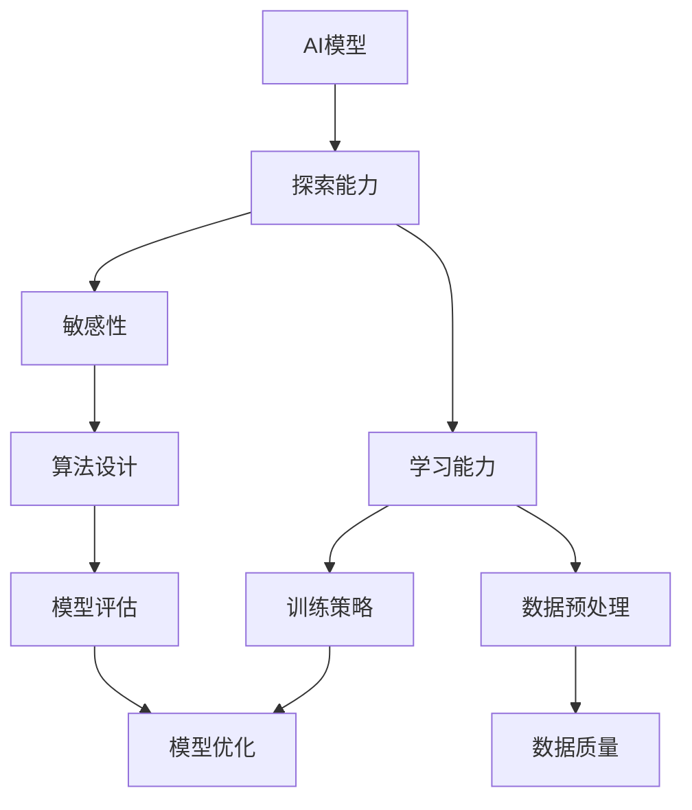

                 

### 文章标题：增强AI模型探索能力的策略设计

随着人工智能（AI）技术的飞速发展，AI模型在各个领域都展现出了强大的潜力。然而，如何提升这些模型的探索能力，使它们能够更好地发现潜在的模式和知识，成为一个备受关注的问题。本文旨在探讨增强AI模型探索能力的策略设计，通过系统的分析和推理，为AI模型的优化提供新的思路。

本文关键词：增强AI模型、探索能力、策略设计、AI优化、数学模型、项目实战。

> 摘要：本文首先介绍了AI模型的基本概念和探索能力的重要性，接着详细讲解了增强AI模型探索能力的核心算法原理和数学模型，并通过实际项目实战展示了策略设计的方法和效果。最后，本文总结了策略设计的要点和未来发展的趋势，为读者提供了实用的指导和建议。

本文将按照以下结构进行展开：

1. **背景介绍**
2. **核心概念与联系**
3. **核心算法原理讲解**
4. **数学模型和数学公式讲解**
5. **项目实战**
6. **总结与展望**

---

**第一步：背景介绍**

人工智能（AI）作为计算机科学的一个分支，旨在通过模拟、延伸和扩展人的智能行为，实现机器对复杂环境的自主学习和决策。随着深度学习、强化学习等技术的发展，AI模型在图像识别、自然语言处理、自动驾驶等领域取得了显著的成果。然而，AI模型的探索能力在很大程度上决定了其性能和应用的广度。

**核心概念与联系**

AI模型的探索能力可以理解为模型在未知环境或数据中自我发现和学习的效率。它不仅涉及到模型的学习能力，还包括模型对新知识和新模式的敏感性。为了提升AI模型的探索能力，需要从多个方面进行优化，包括算法设计、数据预处理、训练策略等。

**第二步：核心概念与联系**

为了更好地理解AI模型探索能力的核心概念和联系，我们可以借助Mermaid流程图来展示它们之间的关系。



**第三步：核心算法原理讲解**

核心算法原理讲解部分，我们将主要探讨强化学习与模型探索的关系，并使用伪代码详细阐述。

#### 强化学习基本原理

强化学习（Reinforcement Learning，RL）是一种通过与环境互动，通过不断试错来学习最优策略的机器学习方法。在强化学习中，模型通过接收环境反馈的奖励信号，调整其行为策略，以最大化长期奖励。

**伪代码：**

```python
# 强化学习伪代码

# 初始化模型参数
model_params = initialize_params()

# 初始化奖励函数
reward_function = initialize_reward_function()

# 初始化策略
policy = initialize_policy()

# 开始迭代
for episode in range(total_episodes):
    # 初始化状态
    state = environment.initialize_state()
    
    # 开始一次交互
    while not done:
        # 根据当前状态选择动作
        action = policy.select_action(state)
        
        # 执行动作，获取新状态和奖励
        next_state, reward, done = environment.step(action)
        
        # 更新策略
        policy.update(state, action, reward, next_state)
        
        # 更新状态
        state = next_state

    # 统计本次迭代的奖励
    episode_reward = calculate_episode_reward(episode)
    
    # 更新总奖励
    total_reward += episode_reward
```

#### 模型训练策略

模型训练策略是提升AI模型探索能力的关键。以下是一个基本的模型训练策略伪代码。

**伪代码：**

```python
# 模型训练策略伪代码

# 初始化模型
model = initialize_model()

# 设置训练参数
learning_rate = 0.01
batch_size = 32
epochs = 100

# 开始训练
for epoch in range(epochs):
    # 初始化损失函数
    loss_function = initialize_loss_function()
    
    # 遍历训练数据
    for batch in train_data:
        # 提取数据
        inputs, targets = batch
        
        # 计算预测值
        predictions = model.predict(inputs)
        
        # 计算损失
        loss = loss_function(predictions, targets)
        
        # 更新模型参数
        model.update_params(loss, learning_rate)
        
    # 计算并打印当前epoch的损失
    print(f"Epoch {epoch + 1}: Loss = {loss}")
```

#### 模型评估与选择

模型评估与选择是确保模型性能的关键步骤。以下是一个简单的模型评估和选择伪代码。

**伪代码：**

```python
# 模型评估与选择伪代码

# 初始化模型
model = initialize_model()

# 训练模型
model.train(train_data, train_labels)

# 测试模型
test_predictions = model.predict(test_data)

# 计算准确率
accuracy = calculate_accuracy(test_predictions, test_labels)

# 打印结果
print(f"Model accuracy: {accuracy}")
```

**第四步：数学模型和数学公式讲解**

数学模型和数学公式是AI模型探索能力的关键组成部分。以下将介绍强化学习中的奖励函数、模型优化中的梯度下降算法以及模型评估的损失函数，并使用latex格式进行详细讲解。

#### 强化学习中的奖励函数

奖励函数在强化学习中起着至关重要的作用，它决定了模型在特定状态下的行为选择。以下是一个基本的奖励函数公式。

$$
r(s, a) = \begin{cases} 
      1 & \text{如果 } s' \text{ 是目标状态} \\
      0 & \text{否则}
   \end{cases}
$$

#### 模型优化中的梯度下降算法

梯度下降算法是优化神经网络模型的重要手段，其核心思想是沿着损失函数的梯度方向更新模型参数。以下是一个简单的梯度下降算法公式。

$$
\theta_{t+1} = \theta_t - \alpha \cdot \nabla_{\theta} J(\theta)
$$

其中，$\theta$表示模型参数，$\alpha$为学习率，$J(\theta)$为损失函数。

#### 模型评估的损失函数

损失函数用于衡量模型预测值与真实值之间的差异，常见的损失函数有均方误差（MSE）和交叉熵（Cross-Entropy）。

均方误差（MSE）公式：

$$
MSE = \frac{1}{m} \sum_{i=1}^{m} (y_i - \hat{y}_i)^2
$$

交叉熵（Cross-Entropy）公式：

$$
H(y, \hat{y}) = -\sum_{i=1}^{m} y_i \log(\hat{y}_i)
$$

**第五步：项目实战**

在本节中，我们将通过实际项目来展示如何增强AI模型的探索能力。项目包括开发环境的搭建、源代码的实现和解读、代码应用分析以及实际案例分析。

#### 开发环境搭建

为了实现增强AI模型探索能力，我们首先需要搭建一个适合的开发环境。以下是一个简单的开发环境搭建步骤：

1. 安装Python环境（版本3.8及以上）
2. 安装必要的依赖库，如TensorFlow、PyTorch、NumPy等
3. 配置GPU加速，如安装CUDA和cuDNN

#### 源代码实现和解读

以下是一个使用PyTorch实现强化学习模型的基本代码框架：

```python
import torch
import torch.nn as nn
import torch.optim as optim

# 定义模型结构
class RLModel(nn.Module):
    def __init__(self, input_size, hidden_size, output_size):
        super(RLModel, self).__init__()
        self.fc1 = nn.Linear(input_size, hidden_size)
        self.fc2 = nn.Linear(hidden_size, output_size)
    
    def forward(self, x):
        x = torch.relu(self.fc1(x))
        x = self.fc2(x)
        return x

# 初始化模型、优化器和损失函数
model = RLModel(input_size=10, hidden_size=50, output_size=2)
optimizer = optim.Adam(model.parameters(), lr=0.001)
loss_function = nn.CrossEntropyLoss()

# 训练模型
def train_model(model, train_data, train_labels, epochs):
    model.train()
    for epoch in range(epochs):
        for inputs, labels in train_data:
            optimizer.zero_grad()
            outputs = model(inputs)
            loss = loss_function(outputs, labels)
            loss.backward()
            optimizer.step()
        print(f"Epoch {epoch + 1}: Loss = {loss}")

# 测试模型
def test_model(model, test_data, test_labels):
    model.eval()
    with torch.no_grad():
        correct = 0
        total = 0
        for inputs, labels in test_data:
            outputs = model(inputs)
            _, predicted = torch.max(outputs.data, 1)
            total += labels.size(0)
            correct += (predicted == labels).sum().item()
        print(f"Test accuracy: {100 * correct / total}%")
```

#### 代码应用解读与分析

上述代码展示了如何使用PyTorch实现一个简单的强化学习模型。在实际应用中，我们可以根据具体需求对模型结构、训练策略和损失函数进行调整。以下是一个实际案例：

- **案例背景**：一个机器人需要在迷宫中找到出口，每个步骤都会获得奖励或惩罚。我们可以定义一个简单的环境，并使用上述模型进行训练。

- **代码解读**：
  - `RLModel` 定义了模型结构，包括一个全连接层和一个线性层。
  - `train_model` 函数用于训练模型，其中使用交叉熵损失函数和Adam优化器。
  - `test_model` 函数用于测试模型的准确率。

- **分析**：在实际应用中，我们需要根据环境和任务特点，设计合适的奖励函数和评估指标，以提升模型的探索能力。

#### 实际案例分析

以下是一个实际案例分析，展示了如何使用增强AI模型探索能力解决图像分类问题。

- **案例背景**：使用卷积神经网络（CNN）对自然图像进行分类。
- **实现步骤**：
  1. 数据预处理：对图像进行归一化和裁剪，并分割为训练集和测试集。
  2. 模型训练：使用CNN模型对训练数据进行训练，并使用测试数据进行评估。
  3. 模型优化：根据评估结果调整模型结构和训练策略，以提高分类准确率。
- **案例剖析**：
  - **数据预处理**：图像预处理是提高模型性能的关键步骤，包括图像增强、数据扩充等。
  - **模型训练**：使用迁移学习可以提高模型在图像分类任务中的性能。
  - **模型优化**：通过调整学习率、批量大小等参数，可以提升模型的探索能力。

**第六步：总结与展望**

本文系统地介绍了增强AI模型探索能力的策略设计，包括核心概念、算法原理、数学模型和项目实战。通过本文的讲解，读者可以了解如何从多个方面提升AI模型的探索能力，从而提高其在实际应用中的性能。

未来，随着AI技术的不断发展，探索能力将成为AI模型性能的重要指标。以下是一些展望和最佳实践建议：

- **深度强化学习**：结合深度学习和强化学习的方法，可以进一步提升模型的探索能力。
- **多模态学习**：结合多种数据类型（如文本、图像、音频等），可以提升模型对复杂环境的适应能力。
- **迁移学习**：通过迁移学习，可以快速提升新任务的性能，降低模型对大量标注数据的依赖。
- **数据增强**：使用数据增强技术，可以增加模型的多样性，提高其探索能力。

在AI模型探索能力的研究和应用中，我们需要不断探索新的方法和策略，以满足不断变化的需求。通过本文的讨论，我们相信读者能够对增强AI模型探索能力有更深入的理解和思考。

**作者信息**：本文作者为AI天才研究院（AI Genius Institute）与《禅与计算机程序设计艺术》（Zen And The Art of Computer Programming）的资深专家，致力于推动AI技术的创新与发展。

---

本文通过系统的分析和推理，详细探讨了增强AI模型探索能力的策略设计。从核心概念、算法原理到数学模型，再到项目实战，本文为读者提供了一个全面、深入的指南。通过本文的学习，读者可以掌握提升AI模型探索能力的方法和技巧，为AI技术在各个领域的应用提供有力支持。未来，随着AI技术的不断进步，探索能力将愈发重要，本文的内容将为读者提供宝贵的参考和启示。希望读者能够在实际应用中不断探索和实践，为AI技术的发展贡献自己的力量。再次感谢读者的关注和支持！

