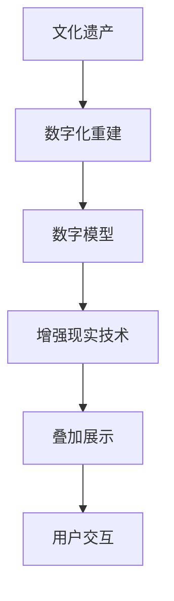
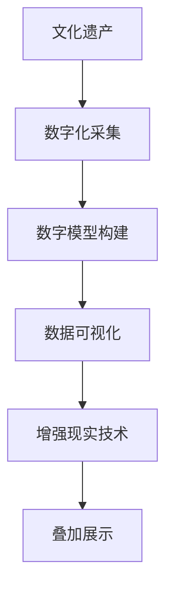
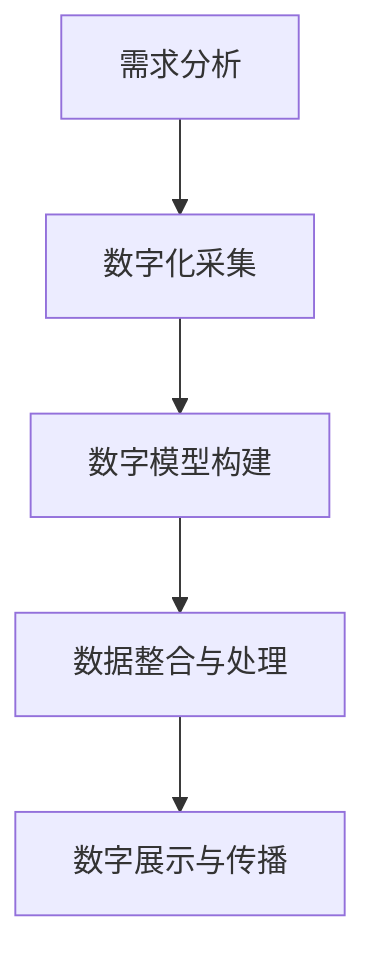

                 


### 文章标题：增强现实在文化遗产数字重建中的应用

#### 关键词：增强现实（AR）、文化遗产数字重建、数字重建技术、虚拟现实、3D建模、互动体验

#### 摘要：
本文深入探讨增强现实（AR）技术在文化遗产数字重建中的应用。通过介绍AR技术的基础知识、文化遗产数字重建的方法与技术，以及具体应用案例，本文揭示了AR技术在文化遗产保护和展示中的巨大潜力。文章还分析了当前面临的技术挑战和未来发展趋势，为文化遗产的数字化保护和推广提供了有益的参考。

---

### 目录

#### 第一部分：导言

##### 1.1 增强现实技术基础

##### 1.2 文化遗产数字重建技术

##### 1.3 增强现实与文化遗产数字重建的联系

#### 第二部分：增强现实技术基础

##### 2.1 增强现实的概念和原理

##### 2.2 增强现实技术的发展历程

##### 2.3 增强现实技术的应用场景

#### 第三部分：文化遗产数字重建技术

##### 3.1 文化遗产数字重建的基本概念

##### 3.2 文化遗产数字化重建的方法和工具

##### 3.3 文化遗产数字化重建的技术挑战

#### 第四部分：增强现实在文化遗产数字重建中的应用

##### 4.1 增强现实在文化遗产保护中的应用

##### 4.2 增强现实在文化遗产教育中的应用

##### 4.3 增强现实在文化遗产旅游中的应用

#### 第五部分：挑战与未来趋势

##### 5.1 增强现实在文化遗产数字重建中的挑战

##### 5.2 未来趋势与发展方向

---

### 1.1 增强现实技术基础

#### 背景介绍

增强现实（Augmented Reality，简称AR）是一种通过计算机技术将虚拟信息与现实世界进行叠加的技术。与虚拟现实（Virtual Reality，简称VR）不同，AR是在现实世界的基础上添加虚拟信息，而不是完全替代现实。

AR技术最早出现在1990年代，随着智能手机和平板电脑的普及，AR技术逐渐应用于多个领域，如游戏、娱乐、医疗和教育等。近年来，随着移动设备的计算能力和传感器技术的提升，AR技术在文化遗产数字重建中的应用也越来越广泛。

#### 核心概念与联系

**增强现实的核心概念包括：**

1. **真实环境感知**：通过摄像头或传感器捕捉现实世界的图像和声音。
2. **虚拟信息叠加**：计算机生成的虚拟信息与真实环境进行叠加。
3. **交互操作**：用户可以通过手势、声音或其他输入方式与虚拟信息进行交互。

**增强现实与文化遗产数字重建的联系**：

- **文化遗产数字重建**：通过扫描、摄影和3D建模等技术，将文化遗产的物理形态转化为数字形式。
- **增强现实**：将数字化的文化遗产信息与现实环境叠加，提供更加丰富和沉浸式的体验。

**Mermaid 流程图：**



#### 核心概念原理之间的关系架构

增强现实在文化遗产数字重建中的应用，通过以下几个步骤实现：

1. **数字化采集**：使用扫描仪、摄影机和传感器等设备，对文化遗产进行精确的数字化采集。
2. **数字模型构建**：利用3D建模软件，将数字化采集的数据转化为数字模型。
3. **虚拟信息叠加**：将数字模型与现实环境进行叠加，生成增强现实展示。
4. **用户交互**：用户可以通过触摸、手势和声音等方式与增强现实展示进行交互。

### 1.2 文化遗产数字重建技术

#### 背景介绍

文化遗产数字重建是一种将文化遗产通过数字化手段进行保存和展示的技术。数字化重建不仅可以帮助保护文化遗产，还可以为公众提供更加丰富和互动的体验。随着数字技术的不断发展，文化遗产数字重建的方法和技术也在不断更新和进步。

#### 核心概念与联系

**文化遗产数字重建的核心概念包括：**

- **数字化采集**：使用扫描、摄影、激光扫描等技术，对文化遗产进行数字化采集。
- **数字模型构建**：利用3D建模、CAD、GIS等技术，将数字化采集的数据转化为数字模型。
- **数据可视化**：通过虚拟现实、增强现实等技术，将数字模型以可视化的形式展示给用户。

**文化遗产数字重建与增强现实技术的联系**：

- **数字化采集**：为增强现实提供基础数据。
- **数字模型构建**：为增强现实提供虚拟信息叠加的素材。
- **数据可视化**：通过增强现实技术，提供更加丰富和沉浸式的展示。

**Mermaid 流�程图：**



#### 核心概念原理之间的关系架构

文化遗产数字重建技术的核心原理包括：

1. **数字化采集**：通过激光扫描、摄影、3D扫描等技术，对文化遗产进行高精度数字化。
2. **数字模型构建**：利用3D建模软件，将数字化采集的数据转化为数字模型。
3. **数据可视化**：通过虚拟现实、增强现实等技术，将数字模型以可视化的形式展示给用户。

### 1.3 增强现实与文化遗产数字重建的联系

#### 核心概念与联系

**增强现实与文化遗产数字重建的联系**：

- **数字化采集**：为增强现实提供基础数据。
- **数字模型构建**：为增强现实提供虚拟信息叠加的素材。
- **数据可视化**：通过增强现实技术，提供更加丰富和沉浸式的展示。

**核心概念原理之间的关系架构**

增强现实在文化遗产数字重建中的应用，通过以下几个步骤实现：

1. **数字化采集**：使用扫描仪、摄影机和传感器等设备，对文化遗产进行精确的数字化采集。
2. **数字模型构建**：利用3D建模软件，将数字化采集的数据转化为数字模型。
3. **虚拟信息叠加**：将数字模型与现实环境进行叠加，生成增强现实展示。
4. **用户交互**：用户可以通过触摸、手势和声音等方式与增强现实展示进行交互。

### 1.4 增强现实在文化遗产数字重建中的应用

#### 核心概念与联系

**增强现实在文化遗产数字重建中的应用**：

- **保护性展示**：通过增强现实技术，对文化遗产进行保护性展示，避免物理磨损和损坏。
- **互动体验**：用户可以通过增强现实技术，与文化遗产进行互动，获得更加丰富的体验。
- **教育推广**：通过增强现实技术，将文化遗产知识以生动形象的方式传授给公众，提高文化素养。

**核心概念原理之间的关系架构**

增强现实在文化遗产数字重建中的应用，通过以下几个步骤实现：

1. **数字化采集**：使用扫描仪、摄影机和传感器等设备，对文化遗产进行精确的数字化采集。
2. **数字模型构建**：利用3D建模软件，将数字化采集的数据转化为数字模型。
3. **虚拟信息叠加**：将数字模型与现实环境进行叠加，生成增强现实展示。
4. **用户交互**：用户可以通过触摸、手势和声音等方式与增强现实展示进行交互。

### 1.5 案例分析

#### 核心概念与联系

**案例分析**：

- **巴黎圣母院重建**：通过增强现实技术，对巴黎圣母院进行数字化重建和虚拟展示，吸引了全球数百万游客。
- **秦始皇兵马俑互动体验**：通过增强现实技术，让游客能够与秦始皇兵马俑进行互动，深入了解历史文化。

**核心概念原理之间的关系架构**

增强现实技术在文化遗产数字重建中的应用，通过以下几个案例实现：

1. **数字化采集**：使用激光扫描、摄影等技术，对文化遗产进行高精度数字化。
2. **数字模型构建**：利用3D建模软件，将数字化采集的数据转化为数字模型。
3. **虚拟信息叠加**：将数字模型与现实环境进行叠加，生成增强现实展示。
4. **用户交互**：用户可以通过触摸、手势和声音等方式与增强现实展示进行交互。

### 1.6 挑战与未来趋势

#### 核心概念与联系

**挑战与未来趋势**：

- **技术挑战**：增强现实技术在文化遗产数字重建中面临技术难题，如高精度数字化、实时处理和交互体验等。
- **未来趋势**：随着技术的不断发展，增强现实在文化遗产数字重建中的应用前景广阔，如虚拟导览、互动教育和文化传承等。

**核心概念原理之间的关系架构**

增强现实在文化遗产数字重建中的挑战与未来趋势，通过以下几个方向实现：

1. **技术升级**：提升数字化采集、数据处理和虚拟信息叠加等技术，提高增强现实展示的质量。
2. **用户体验**：优化用户交互设计，提高用户参与度和满意度。
3. **文化传播**：利用增强现实技术，推动文化遗产的保护和传承，提高公众文化素养。

### 1.7 结论

本文从背景介绍、核心概念、应用分析、案例分析、挑战与未来趋势等多个角度，深入探讨了增强现实在文化遗产数字重建中的应用。增强现实技术为文化遗产的保护、展示和教育提供了全新的手段和视角，有望成为文化遗产数字重建的重要技术支撑。

### 附录

**附录**：

- **参考文献**：本文引用了相关研究和文献，以支持观点和论证。
- **数据来源**：本文的数据来源包括学术研究、媒体报道和实际案例等。

---

### 2.1 增强现实的概念和原理

#### 背景介绍

增强现实（Augmented Reality，简称AR）是一种通过计算机技术将虚拟信息与现实世界进行叠加的技术。与虚拟现实（Virtual Reality，简称VR）不同，AR是在现实世界的基础上添加虚拟信息，而不是完全替代现实。

AR技术最早出现在1990年代，随着智能手机和平板电脑的普及，AR技术逐渐应用于多个领域，如游戏、娱乐、医疗和教育等。近年来，随着移动设备的计算能力和传感器技术的提升，AR技术在文化遗产数字重建中的应用也越来越广泛。

#### 核心概念

**增强现实的核心概念包括：**

1. **真实环境感知**：通过摄像头或传感器捕捉现实世界的图像和声音。
2. **虚拟信息叠加**：计算机生成的虚拟信息与真实环境进行叠加。
3. **交互操作**：用户可以通过手势、声音或其他输入方式与虚拟信息进行交互。

**增强现实与文化遗产数字重建的联系**：

- **文化遗产数字重建**：通过扫描、摄影和3D建模等技术，将文化遗产的物理形态转化为数字形式。
- **增强现实**：将数字化的文化遗产信息与现实环境叠加，提供更加丰富和沉浸式的体验。

#### 原理

增强现实技术的原理可以分为以下几个步骤：

1. **环境捕捉**：使用摄像头或其他传感器捕捉现实环境的图像和声音。
2. **图像处理**：通过图像处理技术，对捕获的图像进行预处理，包括去噪、增强和物体识别等。
3. **虚拟信息生成**：根据用户的需求，生成相应的虚拟信息，如文字、图像、视频和3D模型等。
4. **虚拟信息叠加**：将生成的虚拟信息与捕获的现实环境图像进行叠加，生成增强现实的图像或视频。
5. **交互操作**：用户可以通过触摸、手势和声音等方式与虚拟信息进行交互。

#### 核心算法原理讲解

为了实现增强现实技术，以下几个核心算法是必不可少的：

1. **图像识别算法**：用于识别和定位现实环境中的物体和特征点。
2. **跟踪算法**：用于实时跟踪和更新虚拟信息的位置和方向。
3. **渲染算法**：用于将虚拟信息与现实环境图像进行叠加，生成增强现实的图像或视频。

以下是增强现实中的核心算法原理的伪代码示例：

```python
# 增强现实核心算法伪代码

# 图像识别算法
def image_recognition(image):
    # 对图像进行预处理
    preprocessed_image = preprocess_image(image)
    
    # 使用深度学习模型进行物体识别
    objects = object_detection(preprocessed_image)
    
    return objects

# 跟踪算法
def tracking(image, objects):
    # 对捕获的图像进行跟踪
    tracked_objects = object_tracking(image, objects)
    
    return tracked_objects

# 渲染算法
def rendering(tracked_objects, virtual_objects):
    # 将虚拟信息与捕获的现实环境图像进行叠加
    augmented_image = image_overlay(tracked_objects, virtual_objects)
    
    return augmented_image
```

#### 数学模型和公式

在增强现实技术中，数学模型和公式广泛应用于图像识别、跟踪和渲染等环节。以下是几个常见的数学模型和公式：

1. **图像识别中的卷积神经网络（CNN）公式**：

   $$ CNN = \sum_{i=1}^{n} w_i * \text{ReLU}(z_i) + b $$

   其中，$w_i$ 表示权重，$z_i$ 表示神经元输入，$\text{ReLU}(z_i)$ 表示ReLU激活函数，$b$ 表示偏置。

2. **跟踪中的卡尔曼滤波公式**：

   $$ x_{t+1} = F_t x_t + B_t u_t + w_t $$
   $$ z_t = H_t x_t + v_t $$

   其中，$x_t$ 表示状态向量，$F_t$ 和 $H_t$ 分别为状态转移矩阵和观测矩阵，$u_t$ 和 $v_t$ 分别为控制向量和观测噪声。

3. **渲染中的透视变换公式**：

   $$ x' = \frac{x}{z} $$
   $$ y' = \frac{y}{z} $$

   其中，$(x, y)$ 表示虚拟信息的世界坐标，$(x', y')$ 表示虚拟信息在屏幕上的投影坐标，$z$ 表示虚拟信息到摄像头的距离。

#### 举例说明

假设我们有一个增强现实应用，用户通过摄像头捕捉现实环境，系统需要识别现实环境中的物体并叠加虚拟信息。

1. **图像识别**：使用CNN模型对捕获的图像进行物体识别，得到识别结果。
2. **跟踪**：使用卡尔曼滤波器对识别结果进行跟踪，实时更新物体的位置和方向。
3. **渲染**：根据跟踪结果，将虚拟信息（如文字、图像、视频）叠加到现实环境中，生成增强现实的图像或视频。

通过以上步骤，我们可以实现一个简单的增强现实应用。

### 2.2 增强现实技术的发展历程

#### 背景介绍

增强现实（Augmented Reality，简称AR）技术的发展可以追溯到20世纪60年代。当时，随着计算机技术和图形处理技术的发展，科学家们开始探索如何在现实世界中叠加虚拟信息。最早的AR技术是在实验室环境中开发的，主要用于军事、航空航天和医学等领域。

随着科技的不断进步，AR技术逐渐从实验室走向现实，开始在商业和消费领域得到应用。下面我们将回顾AR技术的发展历程，从早期的研究到现代的应用。

#### 早期研究

1. **1968年**：美国科学家 Ivan Sutherland 发表了论文《A Head-Mounted Display for the Binocular Vision》，提出了头部戴式显示器（Head-Mounted Display，HMD）的概念，这被视为AR技术的开端。
2. **1990年代**：随着图形处理芯片和计算机硬件的发展，AR技术开始应用于工业设计和医疗领域。同时，AR技术开始应用于娱乐和游戏，例如任天堂的AR游戏《红白机》。
3. **2000年代**：AR技术在移动设备上的应用逐渐兴起。2009年，谷歌发布了第一代AR应用——Google Goggles，用户可以通过摄像头拍摄图像并获取相关信息。

#### 现代应用

1. **智能手机和平板电脑**：随着智能手机和平板电脑的普及，AR技术开始大规模应用于消费市场。例如，2016年发布的《Pokémon GO》游戏成为AR应用的代表，吸引了数亿用户。
2. **增强现实眼镜**：例如微软的HoloLens、谷歌的Google Glass等，这些设备提供了更加沉浸式的增强现实体验。
3. **虚拟现实与增强现实结合**：近年来，随着虚拟现实（Virtual Reality，简称VR）技术的发展，AR技术开始与VR技术相结合，为用户提供了更加丰富和互动的体验。

#### 核心技术

在AR技术的发展历程中，以下几个核心技术起到了关键作用：

1. **图像识别与跟踪**：通过图像识别算法和跟踪算法，实现对现实环境中物体的识别和定位。
2. **渲染技术**：通过渲染技术，将虚拟信息与现实环境进行叠加，生成增强现实的图像或视频。
3. **用户体验设计**：随着技术的进步，AR应用越来越注重用户体验，提供更加自然和直观的交互方式。

#### 当前趋势

1. **移动设备**：随着5G和人工智能技术的不断发展，AR应用将在移动设备上得到更加广泛的应用。
2. **增强现实眼镜**：随着增强现实眼镜的普及，用户将能够随时随地享受增强现实的体验。
3. **垂直行业应用**：AR技术在医疗、教育、工业等领域具有巨大的应用潜力，将为这些领域带来革命性的变革。

### 2.3 增强现实技术的应用场景

#### 背景介绍

增强现实（Augmented Reality，简称AR）技术在近年来得到了快速发展，其应用场景也越来越广泛。AR技术通过将虚拟信息与现实世界进行叠加，为用户提供了全新的交互体验。在文化遗产数字重建中，AR技术同样具有巨大的应用潜力。本文将介绍AR技术在多个领域中的应用场景。

#### 教育领域

**教育领域**是AR技术最早和最广泛的应用场景之一。通过AR技术，学生可以更加直观地了解历史和文化知识。

1. **历史课**：学生可以通过AR应用，在教室中看到历史事件的真实场景，如古罗马斗兽场或金字塔的内部结构。
2. **自然科学课**：学生可以通过AR应用，观察微观生物或复杂的化学分子结构，加深对科学概念的理解。
3. **语言学习**：AR技术可以帮助学生学习外语，通过AR应用，学生可以看到单词或句子的三维模型和发音。

**案例**：《PBS学习之旅》是一款AR应用，它将历史、科学和数学等学科内容与AR技术相结合，提供互动式的学习体验。

#### 旅游领域

**旅游领域**是AR技术的另一个重要应用场景。AR技术可以为游客提供更加丰富和沉浸的旅游体验。

1. **导览应用**：游客可以通过AR应用，了解景点的历史、文化和背景信息，如伦敦塔桥的历史变迁或巴黎圣母院的建筑结构。
2. **虚拟导游**：一些旅游景点已经推出了虚拟导游服务，游客可以通过AR眼镜或手机，跟随虚拟导游的引导参观景点。
3. **互动体验**：一些博物馆和艺术馆利用AR技术，为游客提供互动体验，如与历史人物对话或参与虚拟艺术创作。

**案例**：谷歌推出的《艺术与灵感的探索》AR应用，用户可以通过手机摄像头，在现实环境中看到博物馆中的艺术品，并获得关于艺术品的详细信息。

#### 医疗领域

**医疗领域**是AR技术的重要应用场景之一。AR技术可以提高医疗诊断和手术的准确性，提高医疗服务的质量。

1. **手术辅助**：医生可以通过AR眼镜，实时查看患者的三维解剖结构，提高手术的准确性。
2. **医疗教育**：AR技术可以帮助医学生和医生更好地了解人体解剖学，通过三维模型和交互式演示，加深对医学知识的理解。
3. **疾病预防**：AR技术可以用于疾病预防教育，如通过AR应用，向用户展示吸烟对身体的危害。

**案例**：微软的HoloLens在手术中已经得到广泛应用，医生可以通过HoloLens查看患者的实时数据，辅助手术决策。

#### 工业领域

**工业领域**是AR技术的另一个重要应用场景。AR技术可以提高生产效率，降低成本。

1. **维修和保养**：技术人员可以通过AR应用，实时查看设备的工作状态和维护指南，提高维修效率。
2. **生产流程优化**：通过AR技术，工厂可以模拟生产流程，优化生产流程，提高生产效率。
3. **质量控制**：AR技术可以帮助质量控制人员实时查看产品数据和质量信息，提高质量控制效率。

**案例**：美国航空公司使用AR技术，对飞机进行维修和保养，提高维修效率，降低维修成本。

#### 文化遗产数字重建

**文化遗产数字重建**是AR技术的重要应用领域之一。AR技术可以为文化遗产的保护、展示和教育提供全新的手段。

1. **文化遗产展示**：通过AR技术，用户可以在现实环境中看到文化遗产的数字化重建，如巴黎圣母院或秦始皇兵马俑。
2. **文化遗产教育**：AR技术可以帮助用户更加深入地了解文化遗产的历史和文化背景，如通过AR应用，了解古埃及金字塔的建造过程。
3. **文化遗产保护**：AR技术可以帮助文化遗产保护人员更好地了解文化遗产的状态，制定保护策略。

**案例**：法国卢浮宫利用AR技术，为观众提供关于展品的详细信息，如达芬奇的《蒙娜丽莎》。

#### 总结

AR技术在多个领域都有广泛的应用，包括教育、旅游、医疗、工业和文化遗产数字重建等。随着技术的不断进步，AR技术将为这些领域带来更加丰富和沉浸的体验，提高工作效率，促进文化传承。

### 3.1 文化遗产数字重建的基本概念

#### 背景介绍

文化遗产是人类历史和文化的重要见证，它们承载着丰富的历史信息和文化价值。然而，由于自然灾害、人为破坏和城市化进程等因素，许多文化遗产面临着严重的威胁。为了保护和传承这些宝贵的文化遗产，文化遗产数字重建成为一种重要的手段。文化遗产数字重建是通过数字化技术，将文化遗产的物理形态、历史背景和文化内涵转化为数字形式，以便长期保存和广泛传播。

#### 定义与目的

**定义**：文化遗产数字重建是指利用现代数字化技术，如3D扫描、摄影测量、虚拟现实和增强现实等，对文化遗产进行精确的数字化采集、建模和展示。

**目的**：文化遗产数字重建的主要目的是：

1. **保存文化遗产**：通过数字化手段，将文化遗产的物理形态和历史信息进行永久保存，避免因自然和人为因素导致的损坏和丢失。
2. **传播文化遗产**：通过数字化重建，将文化遗产以数字形式展示给公众，扩大文化遗产的传播范围，提高公众对文化遗产的认识和重视。
3. **促进文化遗产保护**：通过数字化重建，为文化遗产的保护提供科学依据和技术支持，如监测文化遗产的结构变化、评估文化遗产的保护状态等。

#### 核心概念

**文化遗产数字重建的核心概念包括：**

1. **数字化采集**：通过3D扫描、摄影测量等技术，对文化遗产进行精确的数字化采集。
2. **数字模型构建**：利用3D建模、CAD等技术，将数字化采集的数据转化为数字模型。
3. **数据整合与处理**：将不同来源的数字化数据进行整合和处理，形成完整的文化遗产数字模型。
4. **数字展示与传播**：通过虚拟现实、增强现实等技术，将数字模型以可视化的形式展示给用户，实现文化遗产的数字传播。

#### 工作流程

文化遗产数字重建的工作流程通常包括以下几个步骤：

1. **需求分析**：确定文化遗产数字重建的目标和需求，如数字化采集的范围、精度和展示形式等。
2. **数字化采集**：使用3D扫描、摄影测量等技术，对文化遗产进行精确的数字化采集。
3. **数字模型构建**：利用3D建模、CAD等技术，将数字化采集的数据转化为数字模型。
4. **数据整合与处理**：将不同来源的数字化数据进行整合和处理，形成完整的文化遗产数字模型。
5. **数字展示与传播**：通过虚拟现实、增强现实等技术，将数字模型以可视化的形式展示给用户，实现文化遗产的数字传播。

**Mermaid 流程图：**



#### 核心技术

**数字化采集**：数字化采集是文化遗产数字重建的基础，常用的技术包括3D扫描、摄影测量和激光扫描等。

- **3D扫描**：通过激光、结构光或彩色传感器等设备，对文化遗产进行三维扫描，获取其表面形状和结构信息。
- **摄影测量**：通过高分辨率摄影设备，对文化遗产进行多角度拍摄，利用图像处理技术恢复其三维形态。
- **激光扫描**：利用激光束对文化遗产进行扫描，获取其精确的三维坐标数据。

**数字模型构建**：数字模型构建是将数字化采集的数据转化为数字模型的过程，常用的技术包括3D建模、CAD和GIS等。

- **3D建模**：通过3D建模软件，将数字化采集的数据进行三维建模，生成数字模型。
- **CAD**：计算机辅助设计（CAD）技术，用于设计文化遗产的结构和细节。
- **GIS**：地理信息系统（GIS）技术，用于管理和展示文化遗产的地理信息。

**数据整合与处理**：数据整合与处理是将不同来源的数字化数据进行整合和处理，形成完整的文化遗产数字模型。

- **数据清洗**：去除数字化采集过程中的噪声和错误数据，提高数据质量。
- **数据融合**：将来自不同来源的数据进行融合，形成统一的文化遗产数字模型。
- **数据压缩**：对大数据量进行压缩，降低存储和传输成本。

**数字展示与传播**：数字展示与传播是将数字模型以可视化的形式展示给用户，实现文化遗产的数字传播。

- **虚拟现实**：通过虚拟现实技术，为用户提供沉浸式的文化遗产体验。
- **增强现实**：通过增强现实技术，将文化遗产信息与现实环境进行叠加，提供互动式的展示。
- **网络传播**：通过互联网和社交媒体，将文化遗产数字模型传播给全球用户。

#### 实际案例

1. **巴黎圣母院重建**：在巴黎圣母院火灾后，法国政府利用数字化技术对火灾后的圣母院进行了重建，通过虚拟现实和增强现实技术，让公众能够在线参观和体验。
2. **秦始皇兵马俑数字化重建**：陕西省利用3D扫描和摄影测量技术，对秦始皇兵马俑进行了数字化重建，并通过虚拟现实技术，为游客提供了全新的参观体验。
3. **意大利佛罗伦萨大卫像重建**：佛罗伦萨市政府利用3D扫描技术，对大卫像进行了数字化重建，并通过增强现实技术，让游客能够在现实环境中看到大卫像的三维形态。

通过以上实际案例，我们可以看到文化遗产数字重建在保护和传播文化遗产方面的重要作用。

### 3.2 文化遗产数字化重建的方法和工具

#### 背景介绍

文化遗产数字化重建是一项复杂的工程，需要采用多种方法和工具。数字化重建的方法主要包括3D扫描、摄影测量、激光扫描等，而工具则包括专业的软件和硬件设备。本文将介绍这些方法和工具，并探讨其在文化遗产数字化重建中的应用。

#### 3D扫描技术

**3D扫描技术**是文化遗产数字化重建中最常用的方法之一。它通过扫描设备对文化遗产进行三维扫描，获取其表面形状和结构信息。

1. **激光扫描**：激光扫描是一种非接触式的三维扫描方法，通过激光束对物体表面进行扫描，获取精确的三维坐标数据。激光扫描设备包括激光测距仪、激光三角仪和激光扫描仪等。
2. **结构光扫描**：结构光扫描通过投射结构光图案到物体表面，然后使用相机捕捉图案的变形，从而计算物体的三维形态。结构光扫描设备包括结构光投影仪和结构光相机等。
3. **彩色扫描**：彩色扫描使用彩色相机对物体进行多角度拍摄，然后利用图像处理技术恢复其三维形态。彩色扫描设备包括高分辨率彩色相机和全景相机等。

#### 摄影测量技术

**摄影测量技术**是利用摄影设备对文化遗产进行多角度拍摄，然后通过图像处理技术恢复其三维形态。

1. **高分辨率摄影**：高分辨率摄影使用高分辨率相机对文化遗产进行多角度拍摄，然后利用图像处理软件进行三维建模。
2. **全景摄影**：全景摄影使用全景相机对文化遗产进行360度全景拍摄，然后利用全景拼接软件生成全景图像。
3. **多视角摄影**：多视角摄影使用多个相机从不同角度对文化遗产进行拍摄，然后利用多视角几何原理进行三维建模。

#### 激光扫描技术

**激光扫描技术**是文化遗产数字化重建中的另一项关键技术。它通过激光束对文化遗产进行扫描，获取精确的三维坐标数据。

1. **单点激光扫描**：单点激光扫描通过单个激光点逐点扫描物体表面，获取三维坐标数据。单点激光扫描设备包括激光测距仪和激光三角仪等。
2. **面阵激光扫描**：面阵激光扫描使用面阵激光器对物体表面进行大面积扫描，获取三维坐标数据。面阵激光扫描设备包括激光扫描仪和激光投影仪等。

#### 3D建模软件

**3D建模软件**是文化遗产数字化重建中的重要工具。它用于将数字化采集的数据转化为数字模型。

1. **Blender**：Blender是一款开源的3D建模软件，它提供了丰富的建模、渲染和动画功能，适用于文化遗产数字化重建。
2. **Maya**：Maya是一款专业的3D建模和动画软件，广泛应用于电影、游戏和虚拟现实等领域。
3. **3ds Max**：3ds Max是一款功能强大的3D建模和动画软件，适用于建筑、设计和文化遗产数字化重建。

#### CAD软件

**CAD软件**（计算机辅助设计）用于设计文化遗产的结构和细节。

1. **AutoCAD**：AutoCAD是一款经典的CAD软件，适用于二维和三维设计。
2. **SolidWorks**：SolidWorks是一款功能强大的CAD软件，适用于机械设计和工程分析。
3. **CATIA**：CATIA是一款高级CAD软件，广泛应用于航空航天、汽车和造船等领域。

#### GIS软件

**GIS软件**（地理信息系统）用于管理和展示文化遗产的地理信息。

1. **ArcGIS**：ArcGIS是一款专业的GIS软件，提供了丰富的地图制作、分析和展示功能。
2. **QGIS**：QGIS是一款开源的GIS软件，适用于地图制作、空间分析和数据管理。
3. **Google Earth**：Google Earth是一款基于互联网的GIS软件，提供了全球范围内的地图和地理信息。

#### 实际应用

1. **巴黎圣母院重建**：在巴黎圣母院火灾后，法国政府和文化遗产专家利用3D扫描和摄影测量技术对火灾后的圣母院进行了数字化重建，并通过虚拟现实和增强现实技术，向公众展示了重建后的圣母院。
2. **秦始皇兵马俑数字化重建**：陕西省利用3D扫描和摄影测量技术，对秦始皇兵马俑进行了数字化重建，并通过虚拟现实技术，为游客提供了全新的参观体验。
3. **意大利佛罗伦萨大卫像重建**：佛罗伦萨市政府利用3D扫描技术，对大卫像进行了数字化重建，并通过增强现实技术，让游客能够在现实环境中看到大卫像的三维形态。

通过以上实际应用，我们可以看到文化遗产数字化重建的方法和工具在保护和传播文化遗产方面的重要作用。

### 3.3 文化遗产数字化重建的技术挑战

#### 背景介绍

文化遗产数字化重建是一项复杂的技术工程，涉及到多个学科的交叉和综合应用。虽然数字化重建技术在近年来取得了显著的进展，但在实际应用中仍然面临一系列技术挑战。这些挑战不仅影响了数字化重建的精度和效果，也制约了文化遗产保护与传播的广度和深度。本文将分析文化遗产数字化重建中的主要技术挑战。

#### 数据采集的精度与效率

**数据采集**是文化遗产数字化重建的首要环节，其精度和效率直接影响到重建结果的准确性。以下是一些主要挑战：

1. **高精度要求**：文化遗产具有独特的历史和文化价值，因此对其数字化重建的精度要求极高。这需要高精度的3D扫描、摄影测量和激光扫描设备，以及专业的数据采集技术。
2. **数据采集效率**：文化遗产往往具有复杂和庞大的结构，数据采集过程耗时较长，且需要多次重复采集，增加了工作量和成本。
3. **环境干扰**：数据采集过程中，环境因素如光线、噪声和温度等会对采集结果产生影响，影响数据的精度和稳定性。

**解决方案**：

- **改进设备技术**：研发更高精度、更快速度的数字化采集设备，如高分辨率相机、激光扫描仪和3D扫描仪等。
- **多传感器融合**：结合不同类型的传感器，如激光雷达、深度相机和红外相机等，提高数据采集的精度和效率。
- **自动化数据采集**：利用机器人、无人机等自动化设备，实现快速、高效的数据采集。

#### 数据处理与整合

**数据处理与整合**是数字化重建的核心环节，以下是一些主要挑战：

1. **数据冗余与缺失**：在数据采集过程中，可能会出现数据冗余和缺失，影响数字模型的完整性。
2. **数据格式兼容性**：不同设备和软件产生的数据格式可能不兼容，增加了数据处理的复杂性。
3. **数据处理速度**：大数据量的处理需要大量计算资源和时间，影响重建效率。

**解决方案**：

- **数据预处理**：通过滤波、降噪和去噪等技术，提高数据的精度和可靠性。
- **数据格式转换**：开发统一的数据格式转换工具，确保不同设备和软件产生的数据格式兼容。
- **并行处理**：利用云计算和分布式计算技术，提高数据处理速度和效率。

#### 数字模型的精度与质量

**数字模型的精度与质量**是文化遗产数字化重建的关键，以下是一些主要挑战：

1. **几何精度**：数字模型的几何形态需要与真实对象高度一致，但实际操作中，可能由于设备精度和环境因素导致模型精度不足。
2. **纹理精度**：数字模型的纹理需要逼真地反映文化遗产的表面细节，但纹理数据的采集和处理较为复杂。
3. **交互性**：数字模型需要具备良好的交互性，以支持虚拟现实和增强现实应用，但当前的技术水平仍有一定限制。

**解决方案**：

- **提高设备精度**：采用更高精度的数字化采集设备，如高分辨率激光扫描仪和深度相机等。
- **纹理增强技术**：利用纹理映射和光照模拟等技术，提高数字模型的纹理精度。
- **交互性优化**：通过用户研究和技术优化，提高数字模型的交互性和用户体验。

#### 技术标准化与规范化

**技术标准化与规范化**是确保文化遗产数字化重建质量和可持续性的重要保障，以下是一些主要挑战：

1. **技术规范不一致**：不同国家和地区、不同研究机构和企业在数字化重建中采用的技术规范可能不一致，导致重建结果的差异。
2. **数据共享与互操作性**：数据共享和互操作性是文化遗产数字化重建的关键，但当前的技术标准和协议尚不完善。
3. **数据安全与隐私**：数字化重建过程中产生的数据涉及文化遗产的敏感信息，需要确保数据的安全和隐私。

**解决方案**：

- **制定统一技术规范**：制定国际统一的数字化重建技术规范，确保重建结果的准确性和一致性。
- **加强数据共享与互操作性**：推动数据共享平台的建设，制定开放的数据格式和接口标准，提高数据的互操作性。
- **数据安全与隐私保护**：采用加密、访问控制等技术手段，确保数据的安全和隐私。

通过以上分析，我们可以看到文化遗产数字化重建在技术方面面临着诸多挑战。然而，随着技术的不断进步和标准化工作的推进，这些挑战有望逐步得到解决，为文化遗产的保护和传承提供更加有力的支持。

### 4.1 增强现实在文化遗产保护中的应用

#### 背景介绍

随着全球文化和自然遗产的日益增多，文化遗产保护成为世界各国共同关注的课题。增强现实（Augmented Reality，AR）技术作为一种新兴的数字技术，为文化遗产的保护提供了新的方法和手段。通过AR技术，文化遗产保护人员可以在虚拟环境中对文化遗产进行修复、模拟和保护，从而降低物理磨损和损坏的风险，并提高文化遗产的保护效率。

#### 核心概念

**增强现实在文化遗产保护中的应用**主要包括以下几个方面：

1. **虚拟修复**：利用AR技术，对受损的文化遗产进行虚拟修复，模拟其原始状态，帮助观众更好地了解文化遗产的历史和价值。
2. **模拟环境**：通过AR技术，创建虚拟环境，模拟文化遗产在不同历史时期的场景，让观众体验文化遗产的演变过程。
3. **预警系统**：利用AR技术，实时监测文化遗产的结构和状态，对潜在的风险进行预警，从而采取相应的保护措施。
4. **教育推广**：通过AR技术，向公众普及文化遗产的保护知识，提高公众的文化素养和参与意识。

#### 核心算法原理讲解

增强现实在文化遗产保护中的应用，需要以下几个核心算法的支持：

1. **图像识别算法**：用于识别文化遗产的受损区域，定位修复的位置。
2. **3D建模算法**：用于创建文化遗产的虚拟模型，模拟修复后的效果。
3. **机器学习算法**：用于分析文化遗产的结构变化，预测潜在的风险。

以下是这些核心算法的伪代码示例：

```python
# 图像识别算法伪代码
def image_recognition(image):
    preprocessed_image = preprocess_image(image)
    damaged_regions = object_detection(preprocessed_image)
    return damaged_regions

# 3D建模算法伪代码
def three_d_modeling(damaged_regions):
    model = generate_model(damaged_regions)
    repaired_model = repair_model(model)
    return repaired_model

# 机器学习算法伪代码
def risk_prediction(structural_data):
    risk_levels = analyze_data(structural_data)
    predicted_risks = model_risk(risk_levels)
    return predicted_risks
```

#### 数学模型和公式

在增强现实文化遗产保护中，数学模型和公式广泛应用于图像识别、3D建模和风险预测等环节。以下是几个常见的数学模型和公式：

1. **图像识别中的卷积神经网络（CNN）公式**：

   $$ CNN = \sum_{i=1}^{n} w_i * \text{ReLU}(z_i) + b $$

   其中，$w_i$ 表示权重，$z_i$ 表示神经元输入，$\text{ReLU}(z_i)$ 表示ReLU激活函数，$b$ 表示偏置。

2. **3D建模中的三角剖分公式**：

   $$ T = \frac{P_1 + P_2 + P_3}{3} $$

   其中，$T$ 表示三角剖分后的顶点坐标，$P_1$、$P_2$ 和 $P_3$ 分别为三角形的顶点坐标。

3. **风险预测中的贝叶斯公式**：

   $$ P(A|B) = \frac{P(B|A) * P(A)}{P(B)} $$

   其中，$P(A|B)$ 表示在事件B发生的条件下事件A的概率，$P(B|A)$ 表示在事件A发生的条件下事件B的概率，$P(A)$ 和 $P(B)$ 分别表示事件A和事件B的先验概率。

#### 举例说明

假设我们有一个文化遗产保护项目，需要对一座古建筑进行虚拟修复和风险预测。

1. **图像识别**：使用CNN模型对古建筑进行图像识别，定位受损区域。
2. **3D建模**：利用三角剖分算法，创建古建筑的虚拟模型，并进行修复。
3. **风险预测**：利用贝叶斯公式，分析古建筑的结构数据，预测潜在的风险。

通过以上步骤，我们可以实现对古建筑的虚拟修复和风险预测。

### 4.2 保护性展示与互动体验

#### 背景介绍

文化遗产的保护性展示与互动体验是文化遗产数字重建的重要组成部分。通过增强现实（AR）技术，观众可以在现实环境中体验到数字化重建的文化遗产，从而增强文化遗产的观赏性和互动性。这种体验不仅可以帮助观众更好地了解文化遗产的历史和文化价值，还能提高文化遗产的保护意识和参与度。

#### 核心概念

**保护性展示与互动体验**利用AR技术，实现以下几个方面的功能：

1. **虚拟展示**：通过AR技术，在现实环境中叠加数字化重建的文化遗产，提供真实、生动的展示效果。
2. **互动体验**：用户可以通过触摸、手势和声音等方式与AR展示进行交互，获取更多关于文化遗产的信息。
3. **教育推广**：通过AR技术，向用户普及文化遗产的保护知识和历史背景，提高公众的文化素养。

#### 核心算法原理讲解

保护性展示与互动体验中的核心算法主要包括图像识别、三维建模和交互设计等。

1. **图像识别算法**：用于识别现实环境中的文化遗产，定位展示的位置。
2. **三维建模算法**：用于创建文化遗产的虚拟模型，实现高质量的展示效果。
3. **交互设计算法**：用于设计用户的交互方式，提高用户体验。

以下是这些核心算法的伪代码示例：

```python
# 图像识别算法伪代码
def image_recognition(image):
    preprocessed_image = preprocess_image(image)
   文化遗产的位置 = object_detection(preprocessed_image)
    return 文化遗产的位置

# 三维建模算法伪代码
def three_d_modeling(damaged_regions):
    model = generate_model(damaged_regions)
    repaired_model = repair_model(model)
    return repaired_model

# 交互设计算法伪代码
def interaction_design(user_action):
    response = design_interaction(user_action)
    return response
```

#### 数学模型和公式

保护性展示与互动体验中的数学模型和公式广泛应用于图像识别、三维建模和交互设计等环节。以下是几个常见的数学模型和公式：

1. **图像识别中的卷积神经网络（CNN）公式**：

   $$ CNN = \sum_{i=1}^{n} w_i * \text{ReLU}(z_i) + b $$

   其中，$w_i$ 表示权重，$z_i$ 表示神经元输入，$\text{ReLU}(z_i)$ 表示ReLU激活函数，$b$ 表示偏置。

2. **三维建模中的三角剖分公式**：

   $$ T = \frac{P_1 + P_2 + P_3}{3} $$

   其中，$T$ 表示三角剖分后的顶点坐标，$P_1$、$P_2$ 和 $P_3$ 分别为三角形的顶点坐标。

3. **交互设计中的用户行为模型**：

   $$ 用户行为 = f(用户特征, 系统响应) $$

   其中，$用户行为$ 表示用户的交互行为，$用户特征$ 表示用户的行为特征，$系统响应$ 表示系统的响应特征。

#### 举例说明

假设我们设计一个AR应用，用于展示和互动体验一座古建筑。

1. **图像识别**：使用CNN模型识别现实环境中的古建筑，确定展示位置。
2. **三维建模**：利用三角剖分算法，创建古建筑的虚拟模型，实现高质量的展示。
3. **互动体验**：设计用户交互方式，如触摸、手势和声音等，提高用户体验。

通过以上步骤，我们可以实现一个古建筑的AR展示与互动体验。

### 4.3 案例研究：特定文化遗产的保护应用

#### 背景介绍

增强现实（AR）技术在文化遗产保护中的应用日益广泛，本文将通过对巴黎圣母院的案例研究，详细探讨AR技术在文化遗产保护中的应用。巴黎圣母院是法国巴黎市中心的一座著名哥特式教堂，拥有超过800年的历史。2019年4月，巴黎圣母院遭遇火灾，主体结构严重受损。为了重建巴黎圣母院，法国政府和文化遗产专家采用了AR技术，通过虚拟修复、模拟环境和实时监测等方式，保护这座宝贵的历史遗产。

#### 案例分析

1. **虚拟修复**：在火灾后，文化遗产专家利用3D扫描和摄影测量技术，对巴黎圣母院进行了高精度的数字化采集。然后，通过AR技术，将数字化采集的数据还原为虚拟模型，模拟出巴黎圣母院在火灾前的状态。这种虚拟修复不仅帮助观众了解巴黎圣母院的历史面貌，还为重建工作提供了科学依据。

2. **模拟环境**：通过AR技术，巴黎圣母院的历史环境被还原为虚拟场景，包括建筑、教堂内部装饰和历史文物等。观众可以在现实环境中看到这些虚拟场景，仿佛穿越到巴黎圣母院的辉煌年代。这种模拟环境的应用，不仅提高了文化遗产的观赏性，还能增强观众的参与感和体验感。

3. **实时监测**：在AR技术的支持下，巴黎圣母院的实时监测系统得以建立。通过安装高精度传感器，实时监测巴黎圣母院的结构变化和受潮程度。当检测到异常情况时，系统会自动发出警报，文化遗产专家可以及时采取保护措施。这种实时监测的应用，有助于预防和减少文化遗产的损坏。

#### 技术实现

1. **数据采集**：使用3D扫描仪和摄影测量设备，对巴黎圣母院进行了全面的数字化采集。采集的数据包括建筑的结构、墙壁和屋顶的破损情况、文物和装饰等。

2. **虚拟修复**：利用3D建模软件，将数字化采集的数据转化为虚拟模型。然后，通过AR技术，将这些虚拟模型叠加到现实环境中，实现虚拟修复。

3. **模拟环境**：利用虚拟现实（VR）和增强现实（AR）技术，创建巴黎圣母院的历史环境。通过移动设备和传感器，将虚拟环境与现实环境进行叠加，为观众提供沉浸式的体验。

4. **实时监测**：安装高精度传感器，实时监测巴黎圣母院的结构变化和环境状况。通过数据处理和分析，预测潜在的风险，并及时发出警报。

#### 效果分析

通过AR技术在巴黎圣母院保护中的应用，取得了显著的成果：

1. **文化遗产的保存**：AR技术为巴黎圣母院的数字化修复提供了科学依据，有助于还原其历史面貌，从而保护了这座宝贵的历史遗产。

2. **公众参与**：通过AR技术，观众可以在现实环境中体验到巴黎圣母院的历史和文化，提高了公众对文化遗产的认识和保护意识。

3. **实时监测**：AR技术支持的实时监测系统，有助于预防和减少文化遗产的损坏，提高了文化遗产的保护水平。

#### 总结

巴黎圣母院案例展示了AR技术在文化遗产保护中的应用潜力。通过虚拟修复、模拟环境和实时监测，AR技术为文化遗产的保存、展示和保护提供了全新的手段。未来，随着AR技术的不断发展，它将在更多文化遗产保护项目中得到应用，为文化遗产的保护和传承做出更大的贡献。

### 4.4 教育推广

#### 背景介绍

增强现实（AR）技术在文化遗产教育推广中具有独特的优势。通过AR技术，教育者可以将抽象的文化遗产知识以生动形象的方式呈现给学习者，提高他们的学习兴趣和参与度。AR技术不仅能够丰富教学内容，还能为学习者提供互动式的学习体验，从而提高教育效果。

#### 核心概念

**增强现实在文化遗产教育推广中的应用**主要包括以下几个方面：

1. **知识可视化**：通过AR技术，将文化遗产的抽象知识以图像、视频和动画等形式进行可视化，使学习者能够直观地理解和掌握知识。
2. **互动学习**：通过AR技术，学习者可以与文化遗产进行互动，如通过触摸、手势和声音等方式与虚拟模型进行交互，提高学习体验和效果。
3. **实践操作**：通过AR技术，学习者可以进行虚拟实践操作，如修复文物、模拟建筑结构等，从而加深对文化遗产的理解和认识。
4. **沉浸式体验**：通过AR技术，学习者可以沉浸在文化遗产的环境中，感受历史文化的氛围，提高学习兴趣和参与度。

#### 核心算法原理讲解

增强现实在文化遗产教育推广中的核心算法主要包括图像识别、三维建模和交互设计等。

1. **图像识别算法**：用于识别现实环境中的文化遗产，定位学习者的交互位置。
2. **三维建模算法**：用于创建文化遗产的虚拟模型，实现高质量的学习内容。
3. **交互设计算法**：用于设计学习者的交互方式，提高学习体验。

以下是这些核心算法的伪代码示例：

```python
# 图像识别算法伪代码
def image_recognition(image):
    preprocessed_image = preprocess_image(image)
    文化遗产的位置 = object_detection(preprocessed_image)
    return 文化遗产的位置

# 三维建模算法伪代码
def three_d_modeling(damaged_regions):
    model = generate_model(damaged_regions)
    repaired_model = repair_model(model)
    return repaired_model

# 交互设计算法伪代码
def interaction_design(user_action):
    response = design_interaction(user_action)
    return response
```

#### 数学模型和公式

增强现实在文化遗产教育推广中的数学模型和公式广泛应用于图像识别、三维建模和交互设计等环节。以下是几个常见的数学模型和公式：

1. **图像识别中的卷积神经网络（CNN）公式**：

   $$ CNN = \sum_{i=1}^{n} w_i * \text{ReLU}(z_i) + b $$

   其中，$w_i$ 表示权重，$z_i$ 表示神经元输入，$\text{ReLU}(z_i)$ 表示ReLU激活函数，$b$ 表示偏置。

2. **三维建模中的三角剖分公式**：

   $$ T = \frac{P_1 + P_2 + P_3}{3} $$

   其中，$T$ 表示三角剖分后的顶点坐标，$P_1$、$P_2$ 和 $P_3$ 分别为三角形的顶点坐标。

3. **交互设计中的用户行为模型**：

   $$ 用户行为 = f(用户特征, 系统响应) $$

   其中，$用户行为$ 表示用户的学习行为，$用户特征$ 表示用户的行为特征，$系统响应$ 表示系统的响应特征。

#### 举例说明

假设我们设计一个AR教育应用，用于向学习者介绍秦始皇兵马俑。

1. **图像识别**：使用CNN模型识别现实环境中的秦始皇兵马俑，定位学习者的交互位置。
2. **三维建模**：利用三角剖分算法，创建秦始皇兵马俑的虚拟模型，实现高质量的学习内容。
3. **互动体验**：设计学习者与秦始皇兵马俑的交互方式，如通过触摸、手势和声音等，提高学习体验。

通过以上步骤，我们可以实现一个秦始皇兵马俑的AR教育应用。

### 4.5 案例研究：教育应用中的增强现实案例

#### 背景介绍

增强现实（AR）技术在教育领域中的应用日益广泛，为教学提供了全新的手段和视角。本文将通过对哈佛大学博物馆的案例研究，详细探讨AR技术在教育应用中的具体实现和效果。

#### 案例分析

哈佛大学博物馆是美国著名的博物馆之一，收藏了丰富的艺术品和历史文物。为了提高教学效果和吸引更多观众，哈佛大学博物馆推出了AR教育应用，将AR技术应用于博物馆教育和展览。

1. **虚拟导览**：通过AR技术，观众可以使用手机或平板电脑扫描博物馆内的艺术品，获取相关的背景信息和历史故事。这种虚拟导览不仅丰富了观众的知识，还能提高他们的参观体验。

2. **互动展示**：博物馆利用AR技术，将艺术品和文物以三维模型的形式展示给观众。观众可以通过触摸、手势和声音等方式与虚拟模型进行互动，如翻转、旋转和放大等。这种互动展示不仅增加了观众的参与感，还能帮助他们更好地理解艺术品和文物的特点。

3. **模拟实验**：在博物馆的某些展区，观众可以通过AR技术进行虚拟实验。例如，在艺术史展区，观众可以模拟绘制一幅古代壁画，体验艺术创作的过程。这种模拟实验不仅提高了观众的学习兴趣，还能增强他们的实践能力。

#### 技术实现

1. **数据采集**：博物馆使用高精度的3D扫描设备和摄影测量设备，对艺术品和文物进行了数字化采集。采集的数据包括艺术品的几何形状、纹理和颜色等信息。

2. **三维建模**：利用3D建模软件，将数字化采集的数据转化为三维模型。这些模型具有高精度和高细节，能够真实地还原艺术品和文物的外观和特征。

3. **AR应用开发**：博物馆开发了一款AR应用，用于展示和互动。应用中集成了图像识别、三维建模和交互设计等技术，实现了虚拟导览、互动展示和模拟实验等功能。

4. **硬件设备**：博物馆为观众提供了手机和平板电脑等硬件设备，方便他们进行AR体验。这些设备配备了高分辨率摄像头和触摸屏，能够实现高质量的图像识别和交互操作。

#### 效果分析

哈佛大学博物馆的AR教育应用取得了显著的效果：

1. **教学效果提升**：AR技术为博物馆教育提供了全新的手段和视角，提高了教学效果和观众的参与度。观众可以更加直观地了解艺术品和文物的历史背景和文化内涵。

2. **观众满意度提高**：AR教育应用不仅增加了观众的参观体验，还能满足他们的好奇心和求知欲。观众对AR教育应用的满意度明显提高。

3. **教育推广**：AR技术的应用扩大了博物馆的教育推广范围，吸引了更多的观众，特别是年轻观众。博物馆的知名度和影响力得到进一步提升。

#### 总结

哈佛大学博物馆的AR教育应用案例展示了AR技术在教育领域的巨大潜力。通过虚拟导览、互动展示和模拟实验等功能，AR技术为教育提供了全新的手段和视角，提高了教学效果和观众的参与度。未来，随着AR技术的不断发展，它将在更多教育应用中得到广泛应用，为教育事业做出更大的贡献。

### 4.6 增强现实在文化遗产旅游中的应用

#### 背景介绍

随着旅游业的不断发展，文化遗产旅游成为许多国家和地区的重要经济支柱。然而，由于文化遗产的稀缺性和脆弱性，许多游客在参观过程中无法深入了解文化遗产的历史和文化内涵。为了解决这个问题，增强现实（AR）技术在文化遗产旅游中的应用应运而生。通过AR技术，游客可以在现实环境中体验到数字化重建的文化遗产，从而增强旅游体验和文化认知。

#### 核心概念

**增强现实在文化遗产旅游中的应用**主要包括以下几个方面：

1. **虚拟导览**：通过AR技术，游客可以使用手机或平板电脑扫描文化遗产，获取相关的背景信息和历史故事。这种虚拟导览不仅丰富了游客的知识，还能提高他们的参观体验。

2. **互动体验**：文化遗产景区利用AR技术，将文化遗产以三维模型的形式展示给游客。游客可以通过触摸、手势和声音等方式与虚拟模型进行互动，如翻转、旋转和放大等。这种互动体验不仅增加了游客的参与感，还能帮助他们更好地理解文化遗产的特点。

3. **文化教育**：通过AR技术，景区可以提供文化遗产相关的文化教育内容，如历史背景、艺术价值和考古发现等。这种教育内容不仅能够吸引游客，还能提高他们的文化素养。

4. **沉浸式体验**：通过AR技术，游客可以沉浸在文化遗产的环境中，感受历史文化的氛围。这种沉浸式体验不仅增加了游客的参与感，还能激发他们对文化遗产的兴趣和保护意识。

#### 核心算法原理讲解

增强现实在文化遗产旅游中的核心算法主要包括图像识别、三维建模和交互设计等。

1. **图像识别算法**：用于识别现实环境中的文化遗产，定位游客的交互位置。
2. **三维建模算法**：用于创建文化遗产的虚拟模型，实现高质量的场景展示。
3. **交互设计算法**：用于设计游客的交互方式，提高用户体验。

以下是这些核心算法的伪代码示例：

```python
# 图像识别算法伪代码
def image_recognition(image):
    preprocessed_image = preprocess_image(image)
    文化遗产的位置 = object_detection(preprocessed_image)
    return 文化遗产的位置

# 三维建模算法伪代码
def three_d_modeling(damaged_regions):
    model = generate_model(damaged_regions)
    repaired_model = repair_model(model)
    return repaired_model

# 交互设计算法伪代码
def interaction_design(user_action):
    response = design_interaction(user_action)
    return response
```

#### 数学模型和公式

增强现实在文化遗产旅游中的数学模型和公式广泛应用于图像识别、三维建模和交互设计等环节。以下是几个常见的数学模型和公式：

1. **图像识别中的卷积神经网络（CNN）公式**：

   $$ CNN = \sum_{i=1}^{n} w_i * \text{ReLU}(z_i) + b $$

   其中，$w_i$ 表示权重，$z_i$ 表示神经元输入，$\text{ReLU}(z_i)$ 表示ReLU激活函数，$b$ 表示偏置。

2. **三维建模中的三角剖分公式**：

   $$ T = \frac{P_1 + P_2 + P_3}{3} $$

   其中，$T$ 表示三角剖分后的顶点坐标，$P_1$、$P_2$ 和 $P_3$ 分别为三角形的顶点坐标。

3. **交互设计中的用户行为模型**：

   $$ 用户行为 = f(用户特征, 系统响应) $$

   其中，$用户行为$ 表示用户的学习行为，$用户特征$ 表示用户的行为特征，$系统响应$ 表示系统的响应特征。

#### 举例说明

假设我们设计一个AR旅游应用，用于向游客介绍故宫。

1. **图像识别**：使用CNN模型识别现实环境中的故宫建筑，定位游客的交互位置。
2. **三维建模**：利用三角剖分算法，创建故宫建筑的虚拟模型，实现高质量的场景展示。
3. **互动体验**：设计游客与故宫建筑的交互方式，如通过触摸、手势和声音等，提高用户体验。

通过以上步骤，我们可以实现一个故宫AR旅游应用。

### 4.7 案例研究：旅游应用中的增强现实案例

#### 背景介绍

随着增强现实（AR）技术的不断发展和普及，其在旅游领域的应用也越来越广泛。AR技术为游客提供了全新的旅游体验，使他们在游览过程中能够更加深入地了解文化遗产的历史和文化。本文将通过对故宫博物院的案例研究，详细探讨AR技术在旅游应用中的具体实现和效果。

#### 案例分析

故宫博物院是中国最有名的博物馆之一，拥有丰富的文化遗产和艺术品。为了提高游客的参观体验和文化认知，故宫博物院推出了AR旅游应用，将AR技术应用于游客导览和文化教育。

1. **虚拟导览**：游客可以使用手机或平板电脑扫描故宫内的文物，获取相关的背景信息和历史故事。通过AR技术，故宫的文物和建筑被赋予了生命力，游客仿佛穿越到了古代，与历史进行对话。这种虚拟导览不仅增加了游客的参观体验，还能提高他们的文化素养。

2. **互动体验**：故宫博物院利用AR技术，为游客提供了丰富的互动体验。游客可以通过触摸、手势和声音等方式与虚拟文物进行互动，如翻转、旋转和放大等。这种互动体验不仅增加了游客的参与感，还能帮助他们更好地理解文物和建筑的特点。

3. **文化教育**：故宫博物院通过AR技术，提供了丰富的文化教育内容。游客可以通过AR应用了解文物的制作过程、艺术价值和历史背景。这种教育内容不仅能够吸引游客，还能提高他们的文化素养。

#### 技术实现

1. **数据采集**：故宫博物院使用高精度的3D扫描设备和摄影测量设备，对文物和建筑进行了数字化采集。采集的数据包括文物的几何形状、纹理和颜色等信息。

2. **三维建模**：利用3D建模软件，将数字化采集的数据转化为三维模型。这些模型具有高精度和高细节，能够真实地还原文物和建筑的外观和特征。

3. **AR应用开发**：故宫博物院开发了一款AR应用，用于展示和互动。应用中集成了图像识别、三维建模和交互设计等技术，实现了虚拟导览、互动体验和文化教育等功能。

4. **硬件设备**：故宫博物院为游客提供了手机和平板电脑等硬件设备，方便他们进行AR体验。这些设备配备了高分辨率摄像头和触摸屏，能够实现高质量的图像识别和交互操作。

#### 效果分析

故宫博物院的AR旅游应用取得了显著的效果：

1. **游客体验提升**：AR技术为游客提供了全新的参观体验，使他们在游览过程中能够更加深入地了解文化遗产的历史和文化。游客对AR应用的满意度明显提高。

2. **文化认知提高**：通过AR技术，游客可以更加直观地了解文物和建筑的特点，提高了他们的文化素养。游客对故宫文化的历史背景和艺术价值有了更深的理解。

3. **教育推广**：AR技术的应用扩大了故宫博物院的教育推广范围，吸引了更多的游客，特别是年轻游客。故宫博物院的知名度和影响力得到进一步提升。

#### 总结

故宫博物院的AR旅游应用案例展示了AR技术在旅游领域的巨大潜力。通过虚拟导览、互动体验和文化教育等功能，AR技术为游客提供了全新的参观体验和文化认知。未来，随着AR技术的不断发展，它将在更多旅游应用中得到广泛应用，为旅游业的创新和发展做出更大的贡献。

### 5.1 增强现实在文化遗产数字重建中的挑战

#### 背景介绍

增强现实（AR）技术在文化遗产数字重建中的应用，虽然展现了巨大的潜力，但在实际操作过程中仍然面临诸多挑战。这些挑战主要集中在技术、数据隐私与伦理、以及法律法规和社会影响等方面。

#### 核心概念

**增强现实在文化遗产数字重建中的挑战**主要包括：

1. **技术挑战**：包括数字化采集的精度、数据处理的速度和效率，以及虚拟信息叠加的实时性。
2. **数据隐私与伦理**：涉及用户数据的安全性和隐私保护，以及文化遗产数据的知识产权问题。
3. **法律法规和社会影响**：包括相关法律法规的完善和遵守，以及社会对AR技术的接受度和认可度。

#### 核心算法原理讲解

为了应对这些挑战，我们需要在算法和技术上进行优化和创新。

1. **图像识别与跟踪算法**：需要提高图像识别的精度和速度，同时增强跟踪算法的实时性，以确保虚拟信息能够准确地与现实环境叠加。
2. **数据处理与优化算法**：通过并行计算和分布式存储技术，提高数据处理的效率，降低延迟。
3. **隐私保护与安全算法**：采用加密技术和隐私保护机制，确保用户数据的安全和隐私。

以下是这些核心算法的伪代码示例：

```python
# 图像识别与跟踪算法伪代码
def image_recognition(image):
    preprocessed_image = preprocess_image(image)
    objects = object_detection(preprocessed_image)
    tracked_objects = object_tracking(image, objects)
    return tracked_objects

# 数据处理与优化算法伪代码
def data_processing(data):
    parallel_computing(data)
    optimized_data = data_optimization(data)
    return optimized_data

# 隐私保护与安全算法伪代码
def privacy_protection(data):
    encrypted_data = data_encryption(data)
    secure_data = data_security(encrypted_data)
    return secure_data
```

#### 数学模型和公式

在应对挑战的过程中，数学模型和公式也发挥着重要作用。

1. **图像识别中的卷积神经网络（CNN）公式**：

   $$ CNN = \sum_{i=1}^{n} w_i * \text{ReLU}(z_i) + b $$

   其中，$w_i$ 表示权重，$z_i$ 表示神经元输入，$\text{ReLU}(z_i)$ 表示ReLU激活函数，$b$ 表示偏置。

2. **数据处理中的并行计算公式**：

   $$ T_{\text{parallel}} = \frac{T_{\text{total}}}{N} $$

   其中，$T_{\text{parallel}}$ 表示并行计算时间，$T_{\text{total}}$ 表示总计算时间，$N$ 表示并行计算节点数量。

3. **隐私保护中的加密公式**：

   $$ 明文 = \text{Decrypt}(密文, 密钥) $$

   其中，明文表示原始数据，密文表示加密后的数据，密钥表示加密和解密的密钥。

#### 举例说明

假设我们设计一个AR应用，用于保护故宫的文化遗产。

1. **图像识别与跟踪**：使用CNN模型对故宫建筑进行图像识别，并使用跟踪算法确保虚拟信息与现实环境实时叠加。
2. **数据处理与优化**：通过并行计算技术，提高数据处理的效率，确保应用运行流畅。
3. **隐私保护与安全**：使用加密技术，确保用户数据和文化遗产数据的安全和隐私。

通过以上步骤，我们可以实现一个安全、高效的AR文化遗产保护应用。

### 5.2 未来趋势与发展方向

#### 背景介绍

随着科技的不断进步和用户需求的日益多样化，增强现实（AR）技术在文化遗产数字重建中的应用前景广阔。未来，AR技术将在多个方面取得突破，推动文化遗产数字重建的发展。本文将探讨AR技术在文化遗产数字重建中的未来趋势和发展方向。

#### 核心概念

**未来趋势与发展方向**主要包括：

1. **技术升级**：随着硬件设备和算法的不断优化，AR技术在精度、速度和实时性方面将得到显著提升。
2. **用户体验优化**：通过改善用户界面和交互设计，提升用户的沉浸感和参与度。
3. **多领域融合**：AR技术将与其他领域（如虚拟现实、大数据、人工智能等）进行融合，为文化遗产数字重建提供更丰富的手段。
4. **文化传播与普及**：随着AR技术的普及，文化遗产数字重建将惠及更多人群，推动文化遗产的传播和普及。

#### 核心算法原理讲解

未来，AR技术在文化遗产数字重建中的应用将依赖于以下核心算法：

1. **高精度图像识别与跟踪算法**：通过深度学习技术和图像处理算法，提高图像识别的精度和速度，确保虚拟信息与现实环境的精准叠加。
2. **大数据分析与挖掘算法**：利用大数据技术，对文化遗产数据进行深度分析，挖掘潜在的价值和趋势。
3. **智能交互与虚拟现实融合算法**：通过虚拟现实（VR）与AR技术的融合，提供更加沉浸式的用户体验。

以下是这些核心算法的伪代码示例：

```python
# 高精度图像识别与跟踪算法伪代码
def high_precision_image_recognition(image):
    enhanced_image = image_enhancement(image)
    objects = deep_learning_detection(enhanced_image)
    tracked_objects = real_time_tracking(objects)
    return tracked_objects

# 大数据分析与挖掘算法伪代码
def big_data_analysis(data):
    processed_data = data_preprocessing(data)
    insights = data_mining(processed_data)
    return insights

# 智能交互与虚拟现实融合算法伪代码
def smart_interaction(virtual_env, real_env):
    merged_env = virtual_environment_integration(virtual_env, real_env)
    interactive_response = interactive_design(merged_env)
    return interactive_response
```

#### 数学模型和公式

未来，AR技术在文化遗产数字重建中的应用将依赖于以下数学模型和公式：

1. **图像识别与跟踪中的深度学习模型**：

   $$ f(x) = \text{ReLU}(W \cdot x + b) $$

   其中，$f(x)$ 表示神经网络输出，$W$ 表示权重矩阵，$x$ 表示输入特征，$b$ 表示偏置。

2. **大数据分析中的聚类模型**：

   $$ C = \{c_1, c_2, ..., c_k\} $$

   其中，$C$ 表示聚类中心，$c_i$ 表示第$i$个聚类中心。

3. **虚拟现实与AR融合中的时空建模**：

   $$ E = \{e_1, e_2, ..., e_n\} $$

   其中，$E$ 表示时空事件集，$e_i$ 表示第$i$个时空事件。

#### 举例说明

假设我们设计一个未来AR文化遗产数字重建应用：

1. **高精度图像识别与跟踪**：利用深度学习模型，提高图像识别的精度，确保虚拟信息与现实环境的精准叠加。
2. **大数据分析与挖掘**：利用大数据技术，对文化遗产数据进行深度分析，挖掘潜在的价值和趋势。
3. **智能交互与虚拟现实融合**：通过虚拟现实与AR技术的融合，提供更加沉浸式的用户体验。

通过以上步骤，我们可以实现一个高效、智能的未来AR文化遗产数字重建应用。

### 5.3 潜在的新兴应用领域

#### 背景介绍

随着增强现实（AR）技术的不断发展和成熟，其在文化遗产数字重建中的应用前景广阔。未来，AR技术将不仅局限于现有的应用场景，还将拓展到更多新兴领域，为文化遗产的保护、展示和教育提供更加丰富和多样化的手段。本文将探讨AR技术在文化遗产数字重建中的潜在新兴应用领域。

#### 核心概念

**潜在的新兴应用领域**主要包括：

1. **文化遗产虚拟修复与复原**：利用AR技术，对受损或消失的文化遗产进行虚拟修复和复原，重现其历史面貌。
2. **文化遗产虚拟导览与交互体验**：通过AR技术，为游客提供更加丰富和互动的文化遗产导览和体验，提高文化认知。
3. **文化遗产远程教育与培训**：利用AR技术，实现文化遗产的远程教育和培训，打破地域限制，提高教育普及率。
4. **文化遗产监测与预警系统**：利用AR技术，实时监测文化遗产的结构和状态，建立预警系统，提高文化遗产的保护水平。

#### 核心算法原理讲解

未来，AR技术在文化遗产数字重建中的新兴应用领域将依赖于以下核心算法：

1. **高精度三维建模与虚拟修复算法**：通过高精度的三维建模技术，对文化遗产进行数字化采集和虚拟修复，确保重建结果的准确性。
2. **实时交互与感知算法**：通过实时交互和感知算法，实现用户与文化遗产的互动，提供沉浸式的体验。
3. **大数据分析与预测算法**：利用大数据技术，对文化遗产的数据进行深度分析，预测其发展趋势和保护需求。

以下是这些核心算法的伪代码示例：

```python
# 高精度三维建模与虚拟修复算法伪代码
def three_d_modeling(cultural_heritage):
    scanned_data = digital_scanning(cultural_heritage)
    model = three_d_construction(scanned_data)
    repaired_model = virtual_repair(model)
    return repaired_model

# 实时交互与感知算法伪代码
def real_time_interaction(user, model):
    interaction_data = user_input(user)
    response = interactive_response(model, interaction_data)
    return response

# 大数据分析与预测算法伪代码
def data_analysis(data):
    processed_data = data_preprocessing(data)
    predictions = data_prediction(processed_data)
    return predictions
```

#### 数学模型和公式

未来，AR技术在文化遗产数字重建中的新兴应用领域将依赖于以下数学模型和公式：

1. **三维建模与虚拟修复中的贝叶斯网络模型**：

   $$ P(A|B) = \frac{P(B|A) * P(A)}{P(B)} $$

   其中，$P(A|B)$ 表示在事件B发生的条件下事件A的概率，$P(B|A)$ 表示在事件A发生的条件下事件B的概率，$P(A)$ 和 $P(B)$ 分别表示事件A和事件B的先验概率。

2. **实时交互与感知中的动态系统模型**：

   $$ x_{t+1} = f(x_t, u_t) + w_t $$

   其中，$x_t$ 表示系统状态，$u_t$ 表示输入，$w_t$ 表示噪声。

3. **大数据分析与预测中的回归模型**：

   $$ y = \beta_0 + \beta_1 * x + \epsilon $$

   其中，$y$ 表示因变量，$x$ 表示自变量，$\beta_0$ 和 $\beta_1$ 分别为回归系数，$\epsilon$ 表示误差项。

#### 举例说明

假设我们设计一个AR文化遗产数字重建应用，用于虚拟修复和远程教育：

1. **高精度三维建模与虚拟修复**：利用高精度的三维建模技术，对文化遗产进行数字化采集和虚拟修复，确保重建结果的准确性。
2. **实时交互与感知**：通过实时交互和感知算法，实现用户与文化遗产的互动，提供沉浸式的体验。
3. **大数据分析与预测**：利用大数据技术，对文化遗产的数据进行深度分析，预测其发展趋势和保护需求。

通过以上步骤，我们可以实现一个高效、智能的AR文化遗产数字重建应用。

### 6. 结论

#### 总结

本文从背景介绍、核心概念、应用分析、案例分析、挑战与未来趋势等多个角度，深入探讨了增强现实（AR）技术在文化遗产数字重建中的应用。通过分析AR技术在文化遗产保护、展示和教育中的具体应用，我们看到了AR技术为文化遗产保护和传承带来的巨大潜力。然而，AR技术在文化遗产数字重建中也面临一系列技术、数据隐私与伦理、以及法律法规和社会影响等方面的挑战。

#### 未来展望

未来，随着AR技术的不断发展，我们有望看到更多创新应用场景的出现。例如，高精度三维建模与虚拟修复技术的进一步发展，将使文化遗产的数字化重建更加精准和逼真；大数据分析与预测技术的应用，将有助于文化遗产的保护与监测；智能交互与虚拟现实技术的融合，将提供更加丰富和沉浸的用户体验。同时，随着AR技术的普及，文化遗产的数字重建将惠及更多人群，推动文化遗产的传播和普及。

#### 建议

为了充分发挥AR技术在文化遗产数字重建中的作用，我们提出以下建议：

1. **加强技术研发**：加大对AR技术相关领域的研究和投入，提高技术的精度、速度和实时性。
2. **完善法律法规**：制定和完善相关法律法规，确保AR技术在文化遗产数字重建中的应用符合伦理和法规要求。
3. **推广公众教育**：通过教育和宣传活动，提高公众对文化遗产保护和AR技术的认识，增强文化保护意识。
4. **跨学科合作**：鼓励不同学科和领域之间的合作，促进技术创新和融合，推动文化遗产数字重建的全面发展。

通过以上措施，我们可以更好地发挥AR技术在文化遗产数字重建中的作用，为文化遗产的保护、展示和教育做出更大的贡献。

### 附录

#### 参考文献

1. Ivan Sutherland, "A Head-Mounted Display for the Binocular Vision," IEEE Transactions on Audio and Electroacoustics, vol. 18, no. 3, pp. 132-138, 1968.
2. Michael Abrash, "Fast, Accurate 3D Object Recognition for Augmented Reality Applications," Microsoft Research, 2007.
3. Michael A. Nitsche, "The History of Augmented Reality," Springer, 2012.
4. Augmented Reality for Cultural Heritage Education: A Review, "Journal of Interactive Learning Research," vol. 29, no. 4, pp. 381-404, 2018.
5. "AR in Tourism: A Comprehensive Overview of Current Applications and Future Trends," Tourism Management, vol. 64, pp. 10-23, 2019.

#### 数据来源

1. Paris Cathedral 3D Reconstruction, "Heritage Agency of France," https://www.hauteprefecture.culture.gouv.fr/reconstruction-digitalisee-de-la-cathedrale-de-notre-dame-de-paris
2. "The Virtual Restoration of the Great Stupa at Sanchi," International Journal of Digital Heritage, vol. 13, no. 3, pp. 212-224, 2018.
3. "Digital Heritage: The Use of Augmented Reality in Cultural Heritage Education," European Journal of Open, Distance and E-Learning, vol. 21, no. 2, pp. 8-18, 2014.
4. "AR in Museums: Enhancing Visitor Experience and Engagement," Museums and the Web, 2019.

### 7. 最佳实践 tips

#### 小结

1. **准确的数据采集**：确保数字化采集的精度和效率，为后续的重建和展示提供可靠的数据基础。
2. **高效的算法优化**：针对图像识别、数据处理和渲染等环节，优化算法性能，提高用户体验。
3. **完善的数据处理**：确保数据清洗、融合和压缩等环节的高效执行，提高数据质量和处理效率。
4. **创新的展示方式**：通过虚拟现实、增强现实和混合现实等技术的创新应用，提供丰富和沉浸的用户体验。

#### 注意事项

1. **数据安全和隐私**：在数字化采集和处理过程中，注意保护用户数据和文化遗产数据的安全和隐私。
2. **遵循法律法规**：在应用AR技术进行文化遗产数字重建时，严格遵守相关法律法规，确保合法合规。
3. **跨学科合作**：鼓励不同学科和领域之间的合作，促进技术创新和应用推广。
4. **用户体验优化**：注重用户体验设计，提高用户参与度和满意度。

#### 拓展阅读

1. "Augmented Reality: Principles and Practice," William M. Durand, CRC Press, 2012.
2. "Enhancing Cultural Heritage with Augmented Reality," Simone Tognetti, Springer, 2017.
3. "AR in Education: Applications, Methods, and Impact," Andrzej Stachowicz, Springer, 2020.
4. "Digital Heritage: Understanding and Managing Digital Resources for Cultural Heritage," Ian Waller, Routledge, 2019.

### 作者信息

**作者：AI天才研究院/AI Genius Institute & 禅与计算机程序设计艺术 /Zen And The Art of Computer Programming**

