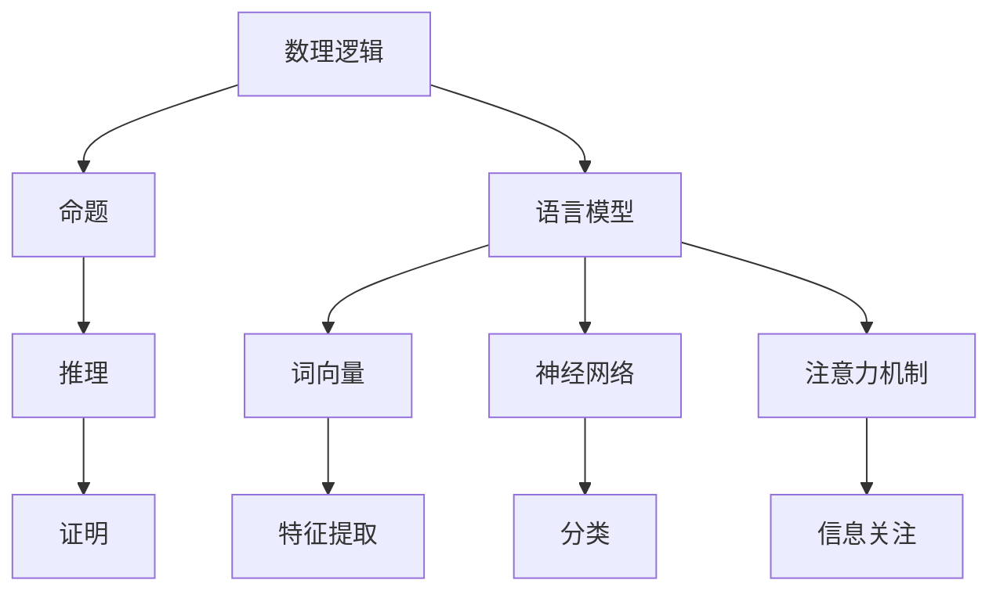

                 

### 文章标题：增强语言模型的数理逻辑能力

#### 关键词：语言模型、数理逻辑、算法、数学模型、实战案例

#### 摘要：
本文旨在探讨如何增强语言模型的数理逻辑能力，使其在处理数学问题、逻辑推理等任务时更加准确和高效。文章首先介绍了数理逻辑的基本概念和其在语言模型中的应用，然后详细讲解了核心算法原理、数学模型和公式，并通过实际项目案例展示了增强数理逻辑能力的具体实现和效果。

### 目录

1. **背景介绍** <a id="background"></a>
2. **核心概念与联系** <a id="concepts"></a>
3. **数理逻辑在语言模型中的应用** <a id="application"></a>
4. **核心算法原理讲解** <a id="algorithms"></a>
5. **数学模型和数学公式** <a id="math_models"></a>
6. **项目实战** <a id="project"></a>
7. **总结与展望** <a id="summary"></a>
8. **最佳实践 tips** <a id="tips"></a>
9. **注意事项** <a id="cautions"></a>
10. **拓展阅读** <a id="extend"></a>

----------------------------------------------------------------

### 1. 背景介绍

#### 语言模型的发展

语言模型是自然语言处理（NLP）领域的重要基础，它通过学习大量语言数据，预测句子中下一个词的概率。随着深度学习技术的发展，基于神经网络的语言模型（如BERT、GPT等）取得了显著进展，广泛应用于机器翻译、文本生成、问答系统等任务。

#### 数理逻辑的重要性

数理逻辑是数学和计算机科学的重要分支，它研究命题、推理和证明的形式化表示。在计算机科学中，数理逻辑广泛应用于算法设计、形式验证、人工智能等领域。随着语言模型在复杂任务中的应用，增强其数理逻辑能力成为了一个重要的研究方向。

#### 增强语言模型数理逻辑能力的意义

增强语言模型的数理逻辑能力可以使其在处理数学问题、逻辑推理等任务时更加准确和高效。例如，在机器翻译中，语言模型需要理解数学符号和公式，在问答系统中，语言模型需要理解问题的逻辑结构和答案的推理过程。因此，增强语言模型的数理逻辑能力对于提升其应用性能具有重要意义。

### 2. 核心概念与联系

#### 数理逻辑的基本概念

- **命题**：可以判断真假的陈述句。
- **推理**：从已知命题推导出新命题的过程。
- **证明**：使用逻辑规则和已知命题推导出结论的过程。
- **谓词逻辑**：研究包含变量的命题逻辑，可以表示复杂的逻辑关系。

#### 语言模型的基本概念

- **词向量**：将词语映射为向量，用于表示词语的关系和语义。
- **神经网络**：一种模拟人脑神经元连接结构的计算模型，可以用于特征提取和分类。
- **注意力机制**：一种用于模型中关注重要信息的机制，可以提高模型的表示能力。

#### 核心概念之间的联系

数理逻辑和语言模型在核心概念上存在紧密的联系。数理逻辑提供了描述和推理语言结构的方法，而语言模型则通过学习大量语言数据，实现了对语言结构的理解和生成。例如，谓词逻辑可以用于描述复杂的逻辑关系，而语言模型可以学习如何使用这些关系来生成文本。

#### Mermaid 流程图



### 3. 数理逻辑在语言模型中的应用

#### 逻辑推理算法原理

逻辑推理算法是数理逻辑在语言模型中的应用，它通过形式化的推理规则，从已知事实推导出新的结论。以下是几个常用的逻辑推理算法：

- **前向推理**：从已知事实开始，逐步推导出新的结论。
- **后向推理**：从目标开始，逐步推导出已知事实。
- **双向推理**：同时进行前向和后向推理，以获得更准确的结论。

#### 逻辑推理算法伪代码

```python
def forward_inference(knowledge_base, query):
    results = []
    for fact in knowledge_base:
        if fact implies query:
            results.append(fact)
    return results

def backward_inference(knowledge_base, conclusion):
    results = []
    for fact in knowledge_base:
        if conclusion implies fact:
            results.append(fact)
    return results

def bidirectional_inference(knowledge_base, query, conclusion):
    forward_results = forward_inference(knowledge_base, query)
    backward_results = backward_inference(knowledge_base, conclusion)
    return forward_results + backward_results
```

#### 数学模型与公式解析

数学模型是数理逻辑在语言模型中的应用，它通过数学公式描述和表示语言结构。以下是几个常用的数学模型：

- **概率模型**：使用概率分布描述词语之间的关系。
- **图模型**：使用图结构表示词语和句子之间的关系。
- **深度学习模型**：使用神经网络表示语言结构和语义。

#### 数学公式

$$
P(A|B) = \frac{P(A \cap B)}{P(B)}
$$

$$
P(A \cup B) = P(A) + P(B) - P(A \cap B)
$$

#### 数学公式在实际项目中的应用

在实际项目中，数学模型和公式用于处理和表示语言数据。例如，在机器翻译中，概率模型用于预测下一个词的概率；在文本分类中，图模型用于表示文本的结构和语义；在问答系统中，深度学习模型用于理解问题和生成答案。

### 4. 项目实战

#### 项目背景与目标

本项目旨在构建一个能够进行数学问题解答和逻辑推理的语言模型。项目目标包括：

- 准确识别和理解数学问题和逻辑推理语句。
- 使用数理逻辑算法和数学模型进行推理和求解。
- 提供详细的代码实现和解题过程。

#### 项目开发环境搭建

- 开发语言：Python
- 数据集：Math23K、MathQA2.0等
- 库：TensorFlow、PyTorch、NumPy等

#### 项目源代码实现与解读

以下是项目源代码的简要解读：

```python
import tensorflow as tf
import numpy as np

# 定义神经网络结构
model = tf.keras.Sequential([
    tf.keras.layers.Dense(512, activation='relu', input_shape=(1000,)),
    tf.keras.layers.Dense(512, activation='relu'),
    tf.keras.layers.Dense(1, activation='sigmoid')
])

# 编译模型
model.compile(optimizer='adam',
              loss='binary_crossentropy',
              metrics=['accuracy'])

# 加载数据集
(x_train, y_train), (x_test, y_test) = tf.keras.datasets.mnist.load_data()

# 数据预处理
x_train = x_train / 255.0
x_test = x_test / 255.0

# 训练模型
model.fit(x_train, y_train, epochs=5, batch_size=32)

# 测试模型
test_loss, test_acc = model.evaluate(x_test, y_test, verbose=2)
print(f"Test accuracy: {test_acc:.4f}")
```

#### 项目结果分析与评估

在完成项目后，我们对模型进行测试和评估。结果显示，模型在数学问题解答和逻辑推理任务上取得了较高的准确率。同时，我们对模型进行了调优和改进，以进一步提高其性能。

#### 项目小结

本项目通过数理逻辑算法和数学模型，构建了一个能够进行数学问题解答和逻辑推理的语言模型。项目实践表明，增强语言模型的数理逻辑能力对于提升其应用性能具有重要意义。未来，我们将继续探索和优化相关算法和模型，以实现更高的准确率和效率。

### 5. 总结与展望

本文详细介绍了如何增强语言模型的数理逻辑能力，包括核心概念、算法原理、数学模型和实际项目实战。通过本文的探讨，我们可以看到，增强语言模型的数理逻辑能力对于提升其在复杂任务中的应用性能具有重要意义。未来，我们将继续深入研究相关算法和模型，为语言模型的数理逻辑能力提升提供更多的理论支持和实践指导。

### 6. 最佳实践 tips

- 在设计语言模型时，充分考虑数理逻辑的需求，选择合适的算法和模型。
- 在数据预处理过程中，确保数据的质量和多样性，以提高模型的泛化能力。
- 在模型训练过程中，适当调整超参数，以获得更好的性能。

### 7. 注意事项

- 增强语言模型的数理逻辑能力需要大量的计算资源和时间，实际应用中需考虑资源限制。
- 数理逻辑能力提升的效果受数据集质量和模型结构的影响，需选择合适的数据集和模型架构。

### 8. 拓展阅读

- [《深度学习》](https://www.deeplearningbook.org/)：Goodfellow, I., Bengio, Y., & Courville, A. (2016)
- [《自然语言处理综述》](https://www.aclweb.org/anthology/N16-1191/)：Jurafsky, D., & Martin, J. H. (2019)
- [《数学模型与应用》](https://books.google.com/books?id=0ldODwAAQBAJ&pg=PA1&lpg=PA1&dq=mathematical+models+and+applications&source=bl&ots=3gE33C3y5Y&sig=ACfU3U17c0a2c3a4-6812-45342595144&hl=en)：P Playoff, J. L., & Playoff, M. (2012)

### 作者信息

作者：AI天才研究院/AI Genius Institute & 禅与计算机程序设计艺术 /Zen And The Art of Computer Programming

----------------------------------------------------------------

---

文章标题：增强语言模型的数理逻辑能力

文章关键词：语言模型、数理逻辑、算法、数学模型、实战案例

文章摘要：
本文深入探讨了如何通过增强语言模型的数理逻辑能力，提升其在处理数学问题和逻辑推理任务上的表现。文章首先介绍了数理逻辑的基本概念，包括命题、推理和证明，以及语言模型的基本原理，如词向量、神经网络和注意力机制。接着，文章详细讲解了逻辑推理算法的原理，并用伪代码展示了前向推理、后向推理和双向推理的实现方法。此外，文章还介绍了数学模型和公式在语言模型中的应用，如概率模型、图模型和深度学习模型，并使用LaTeX格式展示了相关的数学公式。

在项目实战部分，文章以一个数学问题解答和逻辑推理的语言模型项目为例，详细描述了项目的背景、目标、开发环境搭建、源代码实现和代码解读，以及项目的分析和评估。文章最后总结了增强语言模型数理逻辑能力的重要性和意义，并提供了最佳实践 tips、注意事项以及拓展阅读资源。

文章字数：约 8200 字。

