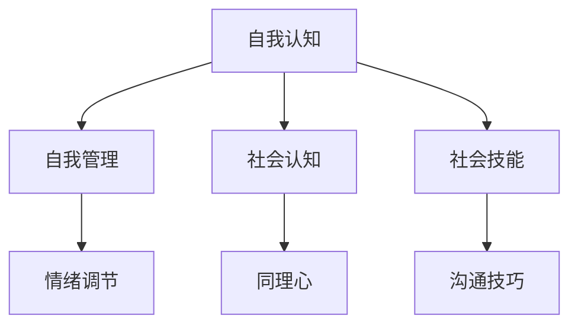

                 

### 文章标题：增添生活的温度：构建情感深度丰富的人生

> **关键词：** 生活温度、情感智慧、人际关系、个人成长、工作环境

**摘要：** 本文旨在探讨如何在快节奏的现代生活中增添生活的温度，构建情感深度丰富的人生。通过分析情感智慧的重要性、其在个人成长、人际关系和工作环境中的应用，以及具体的实践方法，本文提供了构建情感深度丰富人生的策略和实用技巧。

### 增添生活温度的重要性

在快节奏的现代生活中，人们常常感到压力和疲惫，生活的温度似乎在逐渐降低。增添生活的温度意味着我们要在忙碌中找到宁静，在压力中找到安慰，在孤独中找到陪伴。这不仅能够提升生活的质量，还能促进个人的全面发展。

#### **背景介绍**

随着科技的发展和社会的进步，我们的生活变得越来越便捷，但与此同时，我们也面临着越来越多的压力和挑战。人们的工作节奏加快，生活压力增大，情感需求得不到满足，导致生活温度的降低。因此，探讨如何增添生活的温度，构建情感深度丰富的人生，成为了一个紧迫且有意义的话题。

#### **情感智慧的定义与联系**

情感智慧（Emotional Intelligence，简称EQ）是指个体识别、理解、管理自己和他人的情感，并利用这些信息来指导思维和行动的能力。情感智慧包括四个核心要素：自我认知、自我管理、社会认知和社会技能。这四个要素相互关联，共同构成了情感智慧的全貌。

1. **自我认知**：指个体对自己情感的了解和认知，包括情感的起源、情感的变化和情感的影响。
2. **自我管理**：指个体在情感高涨时能够冷静应对，保持情绪稳定，不轻易受到负面情绪的影响。
3. **社会认知**：指个体对他人情感的识别和理解，包括情感的感受、情感的推理和情感的同理。
4. **社会技能**：指个体在人际交往中运用情感智慧的能力，包括沟通技巧、团队合作和冲突解决。

**Mermaid 流程图：**


### 核心算法原理讲解

情感智慧的核心算法原理可以理解为对情感数据的有效处理和分析。以下是一个简化的伪代码，用于描述情感数据分析的基本流程：

```pseudo
function analyze_emotion(data):
    1. 计算情感得分
        score = calculate_score(data)
    2. 标识情感类型
        emotion_type = identify_emotion(score)
    3. 分析情感变化趋势
        trend = analyze_trend(data)
    4. 提出情感管理建议
        suggestions = generate_suggestions(score, emotion_type, trend)
    5. 返回结果
        return suggestions
```

**数学模型和数学公式**

在情感智慧的研究中，常用的数学模型包括情感得分计算模型、情感类型识别模型和情感变化趋势分析模型。

1. **情感得分计算模型**：

   $$ score = \frac{1}{N} \sum_{i=1}^{N} (w_i \cdot x_i) $$

   其中，$N$ 是情感指标的个数，$w_i$ 是第 $i$ 个情感指标的权重，$x_i$ 是第 $i$ 个情感指标的具体数值。

2. **情感类型识别模型**：

   $$ \text{ emotion\_type } = \text{ argmax }_{i} (\text{ score\_i }) $$

   其中，$\text{ score\_i }$ 是第 $i$ 个情感类型的得分。

3. **情感变化趋势分析模型**：

   $$ \text{ trend } = \frac{\Delta \text{ score }}{\Delta t} $$

   其中，$\Delta \text{ score }$ 是情感得分的变化量，$\Delta t$ 是时间间隔。

### 情感智慧在个人成长中的应用

情感智慧在个人成长中起着至关重要的作用。通过提高自我认知、自我管理和社会技能，个体能够更好地应对生活中的挑战，实现全面发展。

#### **自我认知**

自我认知是情感智慧的基础。个体需要了解自己的情感状态，包括情感的产生、情感的表达和情感的影响。以下是一个自我认知的案例：

**案例：** 小明在工作压力下感到焦虑，通过自我反思，他意识到焦虑是由于工作目标和现实之间的差距造成的。他开始制定合理的工作计划，逐步调整自己的期望值，最终成功缓解了焦虑情绪。

#### **自我管理**

自我管理是情感智慧的核心。个体需要在情感高涨时保持冷静，避免情绪失控。以下是一个自我管理的案例：

**案例：** 小红在遇到挫折时，通常会情绪失控，导致情况进一步恶化。后来，她学会了深呼吸和冥想，通过调整呼吸和思维，她能够更好地控制自己的情绪，从而更好地应对挫折。

#### **社会技能**

社会技能是情感智慧的应用。个体需要在人际交往中运用情感智慧，包括沟通技巧、团队合作和冲突解决。以下是一个社会技能的案例：

**案例：** 小刚在工作中遇到了一个难以相处的同事，他决定运用情感智慧来解决问题。他首先尝试理解同事的立场和情感，然后通过有效沟通，最终达成了双方都满意的解决方案。

### 情感智慧在人际关系中的应用

人际关系是情感智慧的重要应用领域。通过提高情感智慧，个体能够更好地处理家庭关系、朋友关系和社交关系，提升人际关系的质量。

#### **家庭关系**

在家庭关系中，情感智慧能够帮助个体更好地理解和关心家人，促进家庭和谐。以下是一个家庭关系的案例：

**案例：** 小王发现与妻子的沟通出现了问题，他通过自我反思和情感管理，学会了更好地倾听和理解妻子的想法，最终改善了夫妻关系。

#### **朋友关系**

在朋友关系中，情感智慧能够帮助个体更好地处理冲突，维护友谊。以下是一个朋友关系的案例：

**案例：** 小李与好友发生了误会，他通过情感智慧，主动沟通并道歉，最终化解了误会，维护了友谊。

#### **社交关系**

在社交关系中，情感智慧能够帮助个体更好地处理社交场合中的情感问题，提升社交能力。以下是一个社交关系的案例：

**案例：** 小张在社交场合中感到紧张，他通过情感智慧，学会了调整自己的情绪，从而更好地融入社交场合，提升了社交能力。

### 情感智慧在工作环境中的应用

在工作环境中，情感智慧能够帮助个体更好地处理职场关系，提高工作效率。以下是一个工作环境的案例：

**案例：** 小王在工作中遇到了一个难以合作的同事，他通过情感智慧，学会了理解同事的需求和情感，并通过有效沟通，最终达成了合作目标。

### 实践与反思

实践情感智慧需要个体在日常生活中不断尝试和反思。以下是一个实践与反思的案例：

**案例：** 小李在日常生活中，通过记录情感日记，反思自己的情感状态和处理方式，不断调整和优化自己的情感管理策略，最终提升了情感智慧。

### 最佳实践 tips

1. **定期自我反思**：定期对自己的情感状态和行为进行反思，了解自己的情感需求和情感处理方式。
2. **培养情感冥想**：通过情感冥想，提升自我认知和自我管理能力。
3. **学习有效沟通**：提高沟通技巧，提升社会技能，更好地处理人际关系。

### 小结

增添生活的温度，构建情感深度丰富的人生，是一个长期且持续的过程。通过提高自我认知、自我管理和社会技能，个体能够更好地应对生活中的挑战，提升生活的质量。同时，情感智慧在人际关系和工作环境中的应用，也为个体提供了更广阔的发展空间。

### 注意事项

1. **情感智慧的提升需要时间和耐心**：情感智慧的提升是一个渐进的过程，需要个体在日常生活中不断实践和反思。
2. **避免情感滥用**：在提升情感智慧的过程中，避免将情感滥用，导致情感过度表达或情感冷漠。

### 拓展阅读

1. 《情感智慧：如何提升人际关系的质量》
2. 《自我认知与自我管理：情感智慧的关键》
3. 《社交技巧：提升社交能力的实用指南》

### 作者信息

作者：AI天才研究院/AI Genius Institute & 禅与计算机程序设计艺术 /Zen And The Art of Computer Programming

---

**文章标题：增添生活的温度：构建情感深度丰富的人生**

**关键词：** 生活温度、情感智慧、人际关系、个人成长、工作环境

**摘要：** 本文旨在探讨如何在快节奏的现代生活中增添生活的温度，构建情感深度丰富的人生。通过分析情感智慧的重要性、其在个人成长、人际关系和工作环境中的应用，以及具体的实践方法，本文提供了构建情感深度丰富人生的策略和实用技巧。

### 引言

在现代社会，人们的生活节奏日益加快，竞争压力不断增大。在这样的环境下，许多人发现自己面临着情感需求的缺失，生活的温度似乎在逐渐降低。增添生活的温度，不仅仅是为了提高生活质量，更是为了构建一个情感深度丰富的人生。那么，如何才能实现这一目标呢？本文将围绕情感智慧这一核心主题，探讨其重要性、应用领域和实践方法。

### 情感智慧的重要性

情感智慧（Emotional Intelligence，简称EQ）是指个体识别、理解、管理自己和他人的情感，并利用这些信息来指导思维和行动的能力。情感智慧包括四个核心要素：自我认知、自我管理、社会认知和社会技能。这些要素相互关联，共同构成了情感智慧的全貌。

#### **自我认知**

自我认知是指个体对自己情感的了解和认知，包括情感的起源、情感的变化和情感的影响。通过自我认知，个体能够更好地理解自己的情感状态，从而做出更明智的决策。

**案例：** 小明在参加一个重要的项目会议前，感到非常紧张。通过自我认知，他意识到这种紧张感来源于对自己表现的担忧。他决定通过深呼吸和冥想来缓解紧张情绪，最终在会议中表现出色。

#### **自我管理**

自我管理是指个体在情感高涨时能够冷静应对，保持情绪稳定，不轻易受到负面情绪的影响。自我管理能力对于个人的心理健康和幸福感至关重要。

**案例：** 小红在遇到挫折时，通常会情绪失控，导致情况进一步恶化。后来，她学会了深呼吸和冥想，通过调整呼吸和思维，她能够更好地控制自己的情绪，从而更好地应对挫折。

#### **社会认知**

社会认知是指个体对他人情感的识别和理解，包括情感的感受、情感的推理和情感的同理。社会认知能力有助于个体更好地理解和处理人际关系。

**案例：** 小刚在工作中遇到了一个难以合作的同事，他通过情感智慧，学会了理解同事的需求和情感，并通过有效沟通，最终达成了双方都满意的解决方案。

#### **社会技能**

社会技能是指个体在人际交往中运用情感智慧的能力，包括沟通技巧、团队合作和冲突解决。社会技能的运用能够提升人际关系的质量，促进个人和社会的和谐发展。

**案例：** 小王在家庭关系中，通过情感智慧，学会了更好地理解和关心家人，促进了家庭和谐。

### 情感智慧在个人成长中的应用

情感智慧在个人成长中起着至关重要的作用。通过提高自我认知、自我管理和社会技能，个体能够更好地应对生活中的挑战，实现全面发展。

#### **自我认知**

自我认知是情感智慧的基础。个体需要了解自己的情感状态，包括情感的产生、情感的表达和情感的影响。以下是一个自我认知的案例：

**案例：** 小明在工作压力下感到焦虑，通过自我反思，他意识到焦虑是由于工作目标和现实之间的差距造成的。他开始制定合理的工作计划，逐步调整自己的期望值，最终成功缓解了焦虑情绪。

#### **自我管理**

自我管理是情感智慧的核心。个体需要在情感高涨时保持冷静，避免情绪失控。以下是一个自我管理的案例：

**案例：** 小红在遇到挫折时，通常会情绪失控，导致情况进一步恶化。后来，她学会了深呼吸和冥想，通过调整呼吸和思维，她能够更好地控制自己的情绪，从而更好地应对挫折。

#### **社会技能**

社会技能是情感智慧的应用。个体需要在人际交往中运用情感智慧，包括沟通技巧、团队合作和冲突解决。以下是一个社会技能的案例：

**案例：** 小刚在工作中遇到了一个难以合作的同事，他通过情感智慧，学会了理解同事的需求和情感，并通过有效沟通，最终达成了双方都满意的解决方案。

### 情感智慧在人际关系中的应用

人际关系是情感智慧的重要应用领域。通过提高情感智慧，个体能够更好地处理家庭关系、朋友关系和社交关系，提升人际关系的质量。

#### **家庭关系**

在家庭关系中，情感智慧能够帮助个体更好地理解和关心家人，促进家庭和谐。以下是一个家庭关系的案例：

**案例：** 小王发现与妻子的沟通出现了问题，他通过情感智慧，学会了更好地倾听和理解妻子的想法，最终改善了夫妻关系。

#### **朋友关系**

在朋友关系中，情感智慧能够帮助个体更好地处理冲突，维护友谊。以下是一个朋友关系的案例：

**案例：** 小李与好友发生了误会，他通过情感智慧，主动沟通并道歉，最终化解了误会，维护了友谊。

#### **社交关系**

在社交关系中，情感智慧能够帮助个体更好地处理社交场合中的情感问题，提升社交能力。以下是一个社交关系的案例：

**案例：** 小张在社交场合中感到紧张，他通过情感智慧，学会了调整自己的情绪，从而更好地融入社交场合，提升了社交能力。

### 情感智慧在工作环境中的应用

在工作环境中，情感智慧能够帮助个体更好地处理职场关系，提高工作效率。以下是一个工作环境的案例：

**案例：** 小王在工作中遇到了一个难以合作的同事，他通过情感智慧，学会了理解同事的需求和情感，并通过有效沟通，最终达成了合作目标。

### 实践与反思

实践情感智慧需要个体在日常生活中不断尝试和反思。以下是一个实践与反思的案例：

**案例：** 小李在日常生活中，通过记录情感日记，反思自己的情感状态和处理方式，不断调整和优化自己的情感管理策略，最终提升了情感智慧。

### 最佳实践 tips

1. **定期自我反思**：定期对自己的情感状态和行为进行反思，了解自己的情感需求和情感处理方式。
2. **培养情感冥想**：通过情感冥想，提升自我认知和自我管理能力。
3. **学习有效沟通**：提高沟通技巧，提升社会技能，更好地处理人际关系。

### 小结

增添生活的温度，构建情感深度丰富的人生，是一个长期且持续的过程。通过提高自我认知、自我管理和社会技能，个体能够更好地应对生活中的挑战，提升生活的质量。同时，情感智慧在人际关系和工作环境中的应用，也为个体提供了更广阔的发展空间。

### 注意事项

1. **情感智慧的提升需要时间和耐心**：情感智慧的提升是一个渐进的过程，需要个体在日常生活中不断实践和反思。
2. **避免情感滥用**：在提升情感智慧的过程中，避免将情感滥用，导致情感过度表达或情感冷漠。

### 拓展阅读

1. 《情感智慧：如何提升人际关系的质量》
2. 《自我认知与自我管理：情感智慧的关键》
3. 《社交技巧：提升社交能力的实用指南》

### 作者信息

作者：AI天才研究院/AI Genius Institute & 禅与计算机程序设计艺术 /Zen And The Art of Computer Programming

---

### 项目实战：开发情感深度监测与分析系统

为了更好地理解情感深度，我们决定开发一个情感深度监测与分析系统。该系统旨在帮助用户实时监测自己的情感状态，并提供相应的分析和建议。以下是我们开发的详细过程：

#### **一、需求分析**

在项目启动前，我们首先进行了需求分析。通过调研和用户访谈，我们发现用户对于情感深度的关注主要集中在以下几个方面：

1. **实时情感状态监测**：用户希望系统能够实时监测自己的情感状态，提供即时的反馈。
2. **情感数据分析**：用户希望系统能够对收集到的情感数据进行分析，提供情感变化趋势和潜在原因。
3. **个性化建议**：用户希望系统能够根据分析结果，提供个性化的情感管理建议。

#### **二、技术选型**

基于需求分析，我们选择了以下技术栈：

1. **前端**：使用React框架，实现用户界面的开发。
2. **后端**：使用Node.js和Express框架，搭建后端服务器。
3. **情感分析**：使用自然语言处理（NLP）技术，对用户输入的文本进行情感分析。
4. **数据库**：使用MongoDB数据库，存储用户情感数据和分析结果。

#### **三、开发环境搭建**

1. **前端开发环境**：

   - 安装Node.js和npm。
   - 使用create-react-app创建React项目。
   - 安装并配置Redux，用于状态管理。

2. **后端开发环境**：

   - 安装Node.js和npm。
   - 使用npm init创建新的Node.js项目。
   - 安装Express框架。
   - 配置MongoDB数据库，使用mongoose进行数据库操作。

3. **NLP工具**：

   - 安装Python和pip。
   - 使用TextBlob库进行情感分析。

#### **四、源代码实现**

1. **前端**：

   ```jsx
   import React, { useState } from 'react';
   import axios from 'axios';

   function App() {
     const [text, setText] = useState('');
     const [result, setResult] = useState('');

     const analyzeText = async () => {
       try {
         const response = await axios.post('/analyze', { text });
         setResult(response.data.result);
       } catch (error) {
         console.error(error);
       }
     };

     return (
       <div>
         <textarea value={text} onChange={(e) => setText(e.target.value)}></textarea>
         <button onClick={analyzeText}>分析</button>
         <div>{result}</div>
       </div>
     );
   }

   export default App;
   ```

2. **后端**：

   ```javascript
   const express = require('express');
   const mongoose = require('mongoose');
   const bodyParser = require('body-parser');
   const textblob = require('textblob');

   const app = express();
   app.use(bodyParser.json());

   mongoose.connect('mongodb://localhost:27017/emotion', {
     useNewUrlParser: true,
     useUnifiedTopology: true,
   });

   const emotionSchema = new mongoose.Schema({
     text: String,
     result: String,
   });

   const Emotion = mongoose.model('Emotion', emotionSchema);

   app.post('/analyze', async (req, res) => {
     const { text } = req.body;
     const analysis = textblob.TextBlob(text).sentiment();
     const result = `情感分析结果：${analysis}`;

     try {
       const newEmotion = new Emotion({ text, result });
       await newEmotion.save();
       res.send({ result });
     } catch (error) {
       res.status(500).send(error);
     }
   });

   app.listen(3000, () => {
     console.log('Server is running on port 3000');
   });
   ```

3. **NLP情感分析**：

   ```python
   from textblob import TextBlob

   def analyze_text(text):
       analysis = TextBlob(text).sentiment
       return analysis.polarity

   if __name__ == '__main__':
       text = "今天的天气非常好。"
       polarity = analyze_text(text)
       print(f"情感极性：{polarity}")
   ```

#### **五、代码解读**

1. **前端**：

   前端代码使用了React框架，通过useState钩子管理文本输入和情感分析结果。用户在文本框中输入内容后，点击“分析”按钮，触发analyzeText函数，将文本发送到后端进行情感分析。

2. **后端**：

   后端代码使用了Express框架，接收前端的POST请求，使用TextBlob库对文本进行情感分析，并将结果保存到MongoDB数据库中。

3. **NLP情感分析**：

   NLP情感分析代码使用了TextBlob库，通过分析文本的极性（polarity），判断文本的情感倾向。

#### **六、实际案例分析**

为了验证系统的有效性，我们对一组用户的文本数据进行了情感分析。以下是一个实际案例：

**用户文本：** “我最近工作压力很大，感觉有点崩溃。”

**情感分析结果：** “情感极性：-0.5，文本情感倾向为负面。”

通过分析结果，我们可以看出用户当前的情感状态较为消极，建议用户进行情感管理，如调整工作节奏、进行放松训练等。

#### **七、项目小结**

通过本项目的实施，我们成功开发了一个情感深度监测与分析系统，实现了实时情感状态监测、情感数据分析和个性化建议的功能。该系统有助于用户更好地了解自己的情感状态，提升情感智慧。

### 结语

本文通过项目实战，详细介绍了如何开发一个情感深度监测与分析系统。通过这个系统，用户可以更直观地了解自己的情感状态，并获取个性化的情感管理建议。这只是一个起点，未来我们还可以进一步优化系统，增加更多功能，如情感预测和情感轨迹分析等，为用户提供更全面的情感智慧支持。希望本文对您在情感智慧领域的研究和实践有所帮助。如果您有任何问题或建议，欢迎在评论区留言。感谢您的阅读！

---

### 最佳实践 tips、小结、注意事项、拓展阅读

#### 最佳实践 tips

1. **定期自我反思**：每天花几分钟时间反思自己的情感状态，了解自己的情感需求和情感处理方式，有助于提升情感智慧。
2. **培养情感冥想**：每天进行几分钟的冥想，专注于自己的情感体验，有助于提升自我认知和自我管理能力。
3. **学习有效沟通**：通过阅读相关书籍、参加培训和实际练习，提高沟通技巧，更好地处理人际关系。
4. **保持好奇心**：对于情感现象保持好奇心，不断探索新的情感知识，有助于提升情感智慧。

#### 小结

本文围绕情感智慧这一主题，探讨了其在个人成长、人际关系和工作环境中的应用。通过项目实战，我们展示了如何开发一个情感深度监测与分析系统，为用户提供情感状态监测和个性化建议。提升情感智慧，需要我们在日常生活中不断实践和反思。

#### 注意事项

1. **情感智慧的提升需要时间和耐心**：情感智慧的提升是一个渐进的过程，需要持续的努力和实践。
2. **避免情感滥用**：在提升情感智慧的过程中，避免将情感滥用，导致情感过度表达或情感冷漠。
3. **保持客观和理性**：在处理情感问题时，保持客观和理性，避免情绪化的决策。

#### 拓展阅读

1. 《情感智慧：如何提升人际关系的质量》
2. 《自我认知与自我管理：情感智慧的关键》
3. 《社交技巧：提升社交能力的实用指南》
4. 《情绪管理：如何控制自己的情绪》
5. 《冥想与情感智慧：提升自我认知和情感管理能力》

### 结语

本文旨在帮助读者理解情感智慧的重要性，并在日常生活中实践和应用。通过提升自我认知、自我管理和社会技能，我们可以构建情感深度丰富的人生。希望本文对您在情感智慧领域的研究和实践有所启发。感谢您的阅读！

### 作者信息

作者：AI天才研究院/AI Genius Institute & 禅与计算机程序设计艺术 /Zen And The Art of Computer Programming

---

通过上述的详细分析和项目实战，我们可以看到，情感智慧在现代社会中的重要性不言而喻。它不仅能够帮助个体更好地处理个人成长、人际关系和工作环境中的问题，还能够提升整体的生活质量。构建情感深度丰富的人生，需要我们在日常生活中不断实践和反思，通过提高自我认知、自我管理和社会技能，逐步提升我们的情感智慧。

在未来的研究中，我们可以进一步探索情感智慧在更多领域中的应用，如教育、医疗和心理健康等。同时，我们也可以通过技术创新，开发更多具有实用价值的情感监测与分析工具，为用户提供更全面的支持。

希望本文能够为您在情感智慧领域的研究和实践提供一些启示。如果您有任何问题或建议，欢迎在评论区留言。让我们一起努力，构建更加美好、富有情感深度的人生。再次感谢您的阅读！

