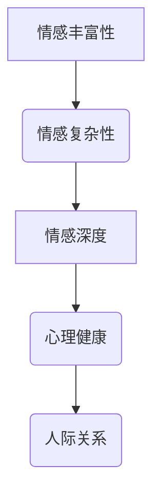
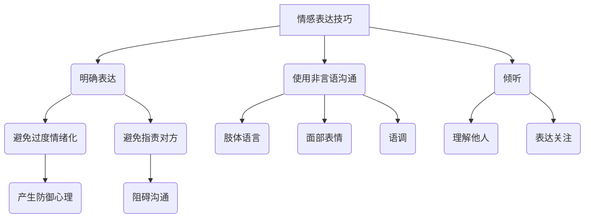
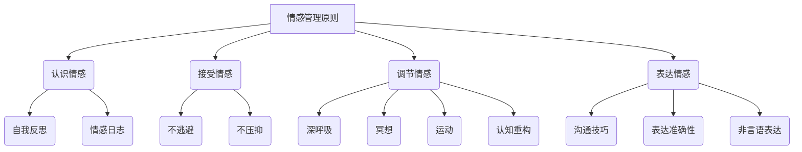
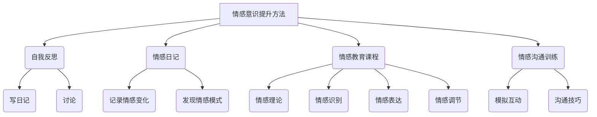
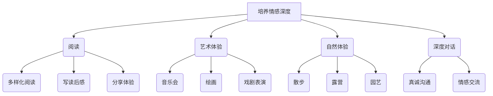
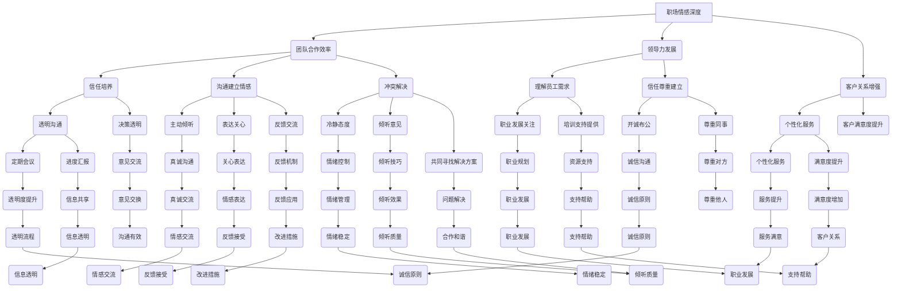
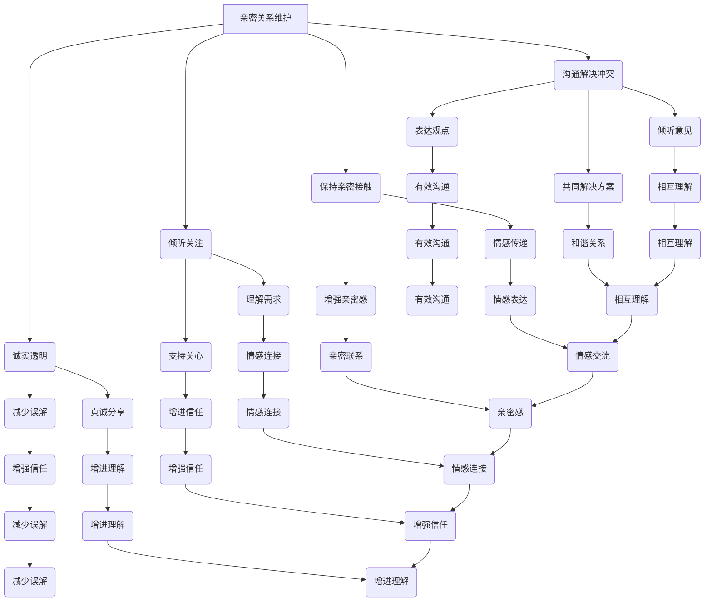

```mermaid
graph TB
    A[自我探索与成长] --> B(了解情感需求)
    A --> C(自我反思)
    A --> D(情感日志)
    A --> E(培养自我意识)
    A --> F(情感智力提升)
    A --> G(自我接纳)
    B --> H(识别情感类型)
    B --> I(情感触发点)
    B --> J(情感应对机制)
    C --> K(情感体验回顾)
    C --> L(原因分析)
    C --> M(情感反应认识)
    D --> N(情感记录)
    D --> O(情感波动观察)
    D --> P(情感模式发现)
    E --> Q(价值观明确)
    E --> R(信念确认)
    E --> S(目标设定)
    F --> T(情感识别)
    F --> U(情感理解)
    F --> V(情感管理)
    F --> W(情感运用)
    G --> X(自我优点接受)
    G --> Y(自我缺点接受)
    G --> Z(积极态度培养)
    H --> AA(情感丰富性)
    H --> BB(情感多样性)
    I --> CC(情境触发)
    I --> DD(情感反应)
    J --> EE(情感释放)
    J --> FF(情感表达)
    K --> GG(内心认知)
    K --> HH(情感认知)
    K --> II(情感理解)
    L --> JJ(情感原因)
    L --> KK(情感处理)
    M --> LL(情感反应)
    M --> MM(情感应对)
    N --> OO(情感记录)
    N --> PP(情感变化)
    N --> QQ(情感分析)
    O --> RR(情感波动)
    O --> SS(情感趋势)
    O --> TT(情感调控)
    P --> UU(情感模式)
    P --> WW(情感规律)
    P --> XX(情感调控)
    Q --> YY(价值观认知)
    Q --> ZZ(信念反思)
    Q --> AAA(目标调整)
    R --> BBB(情感理解)
    R --> CCC(情感认知)
    R --> DDD(情感表达)
    S --> EEE(自我认知)
    S --> FFF(情感认知)
    S --> GGG(目标设定)
    T --> HHH(情感识别)
    T --> III(情感分析)
    T --> JJJ(情感理解)
    U --> KKK(情感处理)
    U --> LLL(情感管理)
    U --> MMM(情感运用)
    V --> NNN(情感运用)
    V --> OOO(情感表达)
    V --> PPP(情感调控)
    W --> QQQ(情感运用)
    W --> RRR(情感表达)
    W --> SSS(情感管理)
    X --> TTT(自我接纳)
    X --> UUU(自我理解)
    X --> VVV(自我成长)
    Y --> WWW(自我接纳)
    Y --> XXX(自我理解)
    Y --> YYY(自我反思)
    Z --> ZZZ(积极态度)
    Z --> AAAA(自我接纳)
    Z --> BBBB(自我成长)
    AA --> CCCD(情感丰富性)
    AA --> DDDD(情感多样性)
    BB --> EEEE(情境触发)
    BB --> FFFF(情感反应)
    CC --> GGGD(情感释放)
    CC --> HHHH(情感表达)
    DD --> IIID(情感调控)
    EE --> JJJD(情感认知)
    FF --> KKKD(情感理解)
    GG --> LLLD(情感分析)
    HH --> MMMD(情感运用)
    II --> NNND(情感变化)
    JJ --> OOOE(情感模式)
    KK --> PPPD(情感波动)
    LL --> QQQE(情感趋势)
    MM --> RRRD(情感调控)
    NN --> SSSD(情感规律)
    OO --> TTTD(情感调控)
    PP --> UUUD(情感运用)
    QQ --> VVVD(情感表达)
    RR --> WWWF(情感运用)
    SS --> XXXF(情感表达)
    TT --> YYYG(自我成长)
    UU --> ZZZG(自我认知)
    VV --> AAAH(情感运用)
    WW --> BBBH(情感表达)
    XX --> CCCG(情感认知)
    YY --> DDDD(情感理解)
    ZZ --> EEEL(情感释放)
    AAA --> FFJL(情感调控)
    BBB --> GGKJ(情感运用)
    CCC --> HHLN(情感分析)
    DDD --> IIOM(情感运用)
    EEE --> JJOQ(情感表达)
    FFF --> KKPR(情感认知)
    GGG --> LLST(情感调控)
    HHH --> MMUW(情感运用)
    III --> NNVP(情感表达)
    JJJ --> OOWX(情感运用)
    KKK --> PPPY(情感波动)
    LLL --> QQZZ(情感规律)
    MMM --> RRAC(情感调控)
    NNN --> SSBF(情感分析)
    OOO --> TTCH(情感变化)
    PPP --> UUAX(情感模式)
    QQQ --> VWBJ(情感趋势)
    RRR --> WWTZ(情感调控)
    SSS --> XXCA(情感运用)
    TTT --> YYDD(情感认知)
    UUU --> ZZZE(情感运用)
    VVV --> AAAE(情感表达)
    WWW --> BBBF(情感认知)
    XXX --> CCCF(情感理解)
    YYY --> DDDD(情感释放)
    ZZZ --> EEEL(情感运用)
```

```mermaid
graph TB
    A[文学创作] --> B(情感丰富)
    A --> C(细腻描写)
    A --> D(角色情感)
    B --> E(文字表达)
    B --> F(情感传递)
    C --> G(心理描写)
    C --> H(情感刻画)
    D --> I(情感冲突)
    D --> J(情感变化)
    E --> K(读者共鸣)
    E --> L(情感理解)
    F --> M(情感共鸣)
    F --> N(情感连接)
    G --> O(心理活动)
    G --> P(情感深度)
    H --> Q(情感层次)
    H --> R(情感复杂性)
    I --> S(情感冲突)
    I --> T(情感挑战)
    J --> U(情感演变)
    J --> V(情感表达)
    K --> W(情感认同)
    K --> X(情感共鸣)
    L --> Y(情感理解)
    L --> Z(情感洞察)
    M --> AA(情感交流)
    M --> BB(情感共享)
    N --> CC(情感联系)
    N --> DD(情感共鸣)
    O --> EE(内心世界)
    O --> FF(情感体验)
    P --> GG(情感深度)
    P --> HH(情感丰富)
    Q --> II(情感描绘)
    Q --> JJ(情感表达)
    R --> KK(情感多样)
    R --> LL(情感复杂)
    S --> MM(情感冲突)
    S --> NN(情感挑战)
    T --> OO(情感演变)
    T --> PP(情感变化)
    U --> QQ(情感表达)
    U --> RR(情感体现)
    V --> SS(情感表达)
    V --> TT(情感传递)
    W --> UU(情感共鸣)
    W --> VW(情感认同)
    X --> XX(情感交流)
    X --> YY(情感理解)
    Y --> ZZ(情感认知)
    Y --> AAA(情感洞察)
    Z --> BBB(情感理解)
    Z --> CCC(情感深度)
    AA --> DDD(情感丰富)
    AA --> EEE(情感多样)
    BB --> FFJ(情感连接)
    BB --> GGG(情感共鸣)
    CC --> HHH(情感共鸣)
    CC --> III(情感理解)
    DD --> JJL(情感深度)
    EE --> KKL(情感传递)
    EE --> LLL(情感交流)
    FF --> MMN(情感丰富)
    FF --> NNQ(情感复杂)
    GG --> OOO(情感体验)
    GG --> PPP(情感深度)
    HH --> QQZ(情感表达)
    HH --> RRZ(情感描绘)
    II --> SSS(情感复杂)
    II --> TTT(情感丰富)
    JJ --> UUU(情感共鸣)
    JJ --> VVV(情感理解)
    KK --> WWX(情感冲突)
    KK --> XXA(情感挑战)
    LL --> YYB(情感演变)
    LL --> ZZC(情感表达)
    MM --> AAAA(情感传递)
    MM --> BBBB(情感表达)
    NN --> CCCD(情感复杂)
    NN --> DDDC(情感挑战)
    OO --> EEEL(情感体验)
    OO --> FFFK(情感理解)
    PP --> GGGK(情感丰富)
    PP --> HHHM(情感深度)
    QQ --> IIIJ(情感表达)
    QQ --> JJN(情感传递)
    RR --> KKKM(情感共鸣)
    RR --> LLNN(情感认同)
    SS --> MMMO(情感冲突)
    SS --> NNPP(情感挑战)
    TT --> OOOQ(情感演变)
    TT --> PPPQ(情感变化)
    UU --> RRST(情感表达)
    UU --> STUU(情感传递)
    VW --> UUWW(情感共鸣)
    VW --> WWXX(情感认同)
    XX --> YYZZ(情感交流)
    XX --> ZZZA(情感理解)
    YY --> AAAE(情感认知)
    YY --> BBFF(情感洞察)
    ZZ --> CCCG(情感深度)
    ZZ --> GGGH(情感丰富)
    AAA --> DDDD(情感多样)
    BBB --> EEEE(情感丰富)
    CCC --> FFFF(情感表达)
    DDD --> GGGG(情感传递)
    EEE --> HHHH(情感共鸣)
    FFF --> IIII(情感连接)
    GGG --> JJJK(情感理解)
    HHH --> KKKL(情感深度)
    III --> LLMM(情感复杂)
    JJJ --> MMNN(情感挑战)
    KKK --> OOOO(情感演变)
    LLL --> PPPP(情感表达)
    MMM --> QQQQ(情感共鸣)
    NNN --> RRSS(情感认同)
    OOO --> SSTT(情感交流)
    PPP --> UUVV(情感理解)
    QQQ --> VVWW(情感认知)
    RRR --> WWXX(情感洞察)
    SSS --> XXYY(情感深度)
    TTT --> YYZZ(情感丰富)
```
                 


### 文章标题：增添生活的温度：构建有情感深度的人生

### 文章关键词：情感深度、生活温度、幸福感、个人成长、人际关系、心理健康

### 文章摘要：

本文以《增添生活的温度：构建有情感深度的人生》为核心主题，探讨了如何通过提升情感深度来增强个人生活的质量和幸福感。文章分为三个主要部分：理论基础、实践应用和个人成长。在理论基础部分，我们详细阐述了情感深度的概念、重要性及其与心理健康的关系。实践应用部分则通过日常生活中的情感深度实践、职场应用和关系维护来展示如何在具体情境中增强情感深度。最后，个人成长部分着眼于自我探索与成长、情感深度的艺术表达以及终身学习。通过本文的探讨，我们希望能够为读者提供一套系统的、可操作的方法，以构建一个充满情感深度的人生。

-------------------------------------------------------------------

## 第1章 情感深度的概念与重要性

### 1.1 情感深度的定义

情感深度（Emotional Depth）是指个体在情感体验中的丰富性和复杂性。它不仅涉及情感的强度，还涵盖情感的多样性和深刻性。情感深度的定义可以用一个简单的公式来表示：

$$
\text{情感深度} = \text{情感丰富性} \times \text{情感复杂性}
$$

其中，“情感丰富性”指的是个体体验情感的数量和多样性，而“情感复杂性”则指的是个体在情感体验中的细腻程度和深度。

### 1.2 情感深度的重要性

情感深度对于个人生活的质量具有深远的影响。首先，情感深度与心理健康密切相关。研究表明，高情感深度的人通常具有更好的心理健康状况，他们能够更好地应对生活中的压力和挑战。此外，情感深度还影响着人际关系。具有深厚情感深度的人能够更好地理解和表达他人的情感，从而建立更加稳固和健康的人际关系。

### 1.3 情感深度与心理健康的关系

情感深度不仅影响个人的心理幸福感，还与多种心理健康问题密切相关。以下是一些具体的关系：

- **焦虑和抑郁**：高情感深度的人通常能够更好地处理焦虑和抑郁情绪。他们有更强的情感调节能力，能够有效地缓解负面情绪。
- **适应能力**：情感深度高的人在面对生活中的变化和挑战时，具有更强的适应能力。他们能够从情感体验中学习，并不断发展自己的应对策略。
- **情绪智力**：情感深度与情绪智力密切相关。情绪智力是指个体识别、理解、管理和使用情感信息的能力。高情感深度的人通常情绪智力较高，能够更好地管理自己的情感，并在人际交往中表现得更加得体。

### 1.4 情感深度的重要性总结

情感深度对于个人生活的各个方面都具有重要影响。它不仅能够提升个人的心理健康水平，还能够增强人际关系的质量和深度。通过提升情感深度，我们可以更好地理解自己和他人的情感，从而过上更加充实、有意义的生活。

```markdown
### Mermaid 流程图



### 1.5 情感深度与其他概念的关联

除了与心理健康和人际关系的关系外，情感深度还与其他几个重要概念密切相关：

- **自我意识**：自我意识是指个体对自己存在的认识。情感深度与自我意识密切相关，高情感深度的人通常具有更高的自我意识。
- **共情能力**：共情能力是指个体能够理解和感受他人情感的能力。情感深度与共情能力紧密相连，高情感深度的人通常共情能力较强。
- **创造力**：情感深度与创造力之间也存在一定的关联。研究表明，情感深度较高的人通常具有较强的创造力。

通过这些关联，我们可以看出情感深度是一个多维度的概念，它不仅仅影响到个人的情感体验，还与多个其他方面紧密相连。

### 1.6 情感深度的影响因素

情感深度受到多种因素的影响，主要包括以下几个方面：

- **成长环境**：个体在成长过程中所经历的环境对其情感深度有着重要影响。一个充满关爱和理解的环境有助于个体发展高情感深度。
- **教育背景**：教育背景，特别是情感教育，对个体的情感深度也有显著影响。接受良好的情感教育可以提升个体的情感深度。
- **个人经历**：个人经历，包括情感经历和人生经历，对个体的情感深度有深远影响。积极的人生经历有助于提升情感深度。

### 1.7 总结

情感深度是个人生活中一个至关重要的概念。它不仅影响着个人的心理健康和人际关系，还与自我意识、共情能力和创造力等多个方面密切相关。通过了解和提升情感深度，我们可以过上更加充实、有意义的生活。

-------------------------------------------------------------------

## 第2章 情感沟通与表达

### 2.1 有效沟通的重要性

沟通是建立深厚情感关系的基础。有效沟通不仅能够帮助我们更好地表达自己的想法和情感，还能增进对他人的理解和尊重。在情感沟通中，有效沟通的重要性体现在以下几个方面：

- **增进理解**：有效沟通能够帮助双方更好地理解彼此的观点和情感，从而减少误解和冲突。
- **建立信任**：通过真诚和开放的沟通，可以建立深厚的信任关系，这对于任何类型的人际关系都至关重要。
- **情感支持**：有效的情感沟通可以提供情感支持，使个体在面临困难和挑战时感到被理解和支持。

### 2.2 情感表达的技巧

情感表达是沟通的核心，它涉及到如何准确、恰当地传达自己的情感状态。以下是一些情感表达的技巧：

- **明确表达**：在表达情感时，要尽量明确和具体，避免使用模糊或含糊的表述，这有助于对方更好地理解你的情感。
- **使用非言语沟通**：非言语沟通，如肢体语言、面部表情和语调，在情感表达中也扮演着重要角色。它们可以补充和强化言语信息，使情感表达更加丰富和有说服力。
- **倾听**：倾听是有效沟通的重要组成部分。通过倾听，你可以更好地理解对方，并表达出你的关注和理解。

### 2.3 建立健康的人际关系

建立健康的人际关系需要良好的沟通技巧和深厚的情感基础。以下是一些关键步骤：

- **尊重**：尊重是建立健康关系的基石。尊重对方的观点、感受和需求，即使你不同意。
- **开放沟通**：保持开放的沟通渠道，鼓励双方分享想法和情感，并积极回应。
- **解决冲突**：冲突在任何关系中都是不可避免的。通过积极的沟通和解决问题的态度来处理冲突，可以增强关系的稳定性。

### 2.4 情感沟通的实际应用

情感沟通在日常生活中的应用非常广泛，以下是一些具体场景：

- **家庭关系**：在家庭中，良好的情感沟通有助于家庭成员之间的理解和合作。
- **职场关系**：职场中，有效沟通能够提高团队合作效率，减少误解和冲突。
- **社交网络**：在社交网络中，情感沟通可以帮助我们建立和维护广泛的人际关系。

### 2.5 情感沟通的案例分析

以下是一个情感沟通的案例分析：

**案例**：小王和同事小李在工作中出现了意见分歧，小王感到非常沮丧，决定与小李进行沟通。

**步骤**：

1. **明确目标**：小王首先明确自己的目标，即理解小李的观点，并找到共同点。
2. **开放沟通**：小王以开放的态度与小李进行对话，没有指责或抱怨。
3. **倾听**：小王倾听小李的观点，没有打断或反驳。
4. **表达情感**：小王表达了自己的情感，但使用了明确和具体的语言。
5. **寻求解决方案**：双方共同讨论，找到了一个双方都能接受的解决方案。

**结果**：通过有效沟通，小王和小李的关系得到了改善，他们能够更好地合作，工作效率也得到了提高。

### 2.6 情感沟通的误区

在情感沟通中，以下是一些常见的误区：

- **过度情绪化**：情绪化可能会让对方感到压力，从而阻碍沟通的顺利进行。
- **避免情感**：避免谈论情感可能会导致误解和冲突的积累。
- **指责对方**：指责对方可能会导致对方产生防御心理，从而阻碍有效的沟通。

### 2.7 总结

情感沟通是构建深厚人际关系的关键。通过明确表达、使用非言语沟通和倾听，我们可以更好地传达自己的情感，增进对他人的理解。在建立健康人际关系的过程中，尊重、开放沟通和解决冲突也是至关重要的。通过实际案例和误区分析，我们可以更好地理解情感沟通的技巧和应用。

```markdown
### Mermaid 流程图



-------------------------------------------------------------------

## 第3章 情感管理与调节

### 3.1 情感管理的原则

情感管理是指个体如何识别、理解、调节和表达自己的情感。有效的情感管理是提升生活质量、维护心理健康的重要手段。以下是情感管理的一些基本原则：

#### 3.1.1 认识情感

首先，个体需要认识自己的情感。这包括了解情感的来源、情感的类型以及情感对个体行为和思维的影响。通过自我反思和情感日志，个体可以更好地认识自己的情感状态。

#### 3.1.2 接受情感

接受情感是情感管理的关键步骤。情感是生活中不可避免的一部分，无论是积极的还是消极的。接受情感意味着不逃避、不压抑，而是承认情感的存在，并寻找适当的方式来处理这些情感。

#### 3.1.3 调节情感

调节情感是指通过一系列策略来调整情感强度和持续时间。情感调节策略包括深呼吸、冥想、运动和认知重构等。这些策略有助于个体更好地应对压力和挑战，保持心理平衡。

#### 3.1.4 表达情感

表达情感是情感管理的重要组成部分。适当的情感表达可以增进人际关系的质量，减少误解和冲突。表达情感时，个体应注重沟通技巧，确保信息传达的准确性和有效性。

### 3.2 情感调节的策略

情感调节的策略多种多样，以下是一些常用的方法：

#### 3.2.1 情感释放

情感释放是指通过某种方式将情感从身体中释放出来。这可以通过运动、写日记、绘画等方式实现。运动有助于释放体内的紧张和压力，而写日记和绘画则是一种情感表达的方式。

#### 3.2.2 情感重构

情感重构是指通过改变对事件的解释来调节情感。例如，当遇到挫折时，可以尝试从不同的角度去理解事件，从而改变情感的强度和类型。这种方法有助于个体从消极情绪中解脱出来。

#### 3.2.3 情感转移

情感转移是指将注意力从消极情感转移到积极的事物上。通过参与愉快的活动或与亲友交流，个体可以有效地调节情感状态。

### 3.3 应对负面情绪的方法

负面情绪是生活中难以避免的一部分，但通过适当的方法，我们可以有效地应对和缓解这些情绪。以下是一些常用的方法：

#### 3.3.1 呼吸练习

呼吸练习是一种简单而有效的情感调节方法。通过深呼吸，个体可以放松身体，减轻紧张和焦虑。以下是一种常见的呼吸练习方法：

```markdown
```plaintext
1. 坐或躺在一个舒适的位置。
2. 关闭眼睛，深吸一口气，数到4。
3. 暂停，保持呼吸，数到7。
4. 缓慢呼气，数到8。
5. 重复上述步骤，直到感到放松。
```

#### 3.3.2 冥想

冥想是一种通过专注和觉察来训练心灵的方法。通过冥想，个体可以培养内心的平静和专注力。以下是一种简单的冥想方法：

```plaintext
1. 坐在一个舒适的位置，保持身体的正直。
2. 关闭眼睛，将注意力集中在呼吸上。
3. 每次呼吸时，尝试感受空气进出鼻孔的感觉。
4. 当思绪漂移时，温柔地将注意力拉回呼吸。
5. 保持冥想5-10分钟。
```

#### 3.3.3 运动和放松技巧

运动和放松技巧，如瑜伽、太极和深呼吸练习，有助于释放体内的紧张和压力。以下是一些简单的放松技巧：

```plaintext
1. 轻柔的拉伸运动：轻轻拉伸四肢和背部肌肉，促进血液循环。
2. 深呼吸练习：深吸一口气，慢慢呼出，重复几次。
3. 身体扫描：从脚部开始，逐渐扫描身体每个部位，放松紧张肌肉。
```

### 3.4 情感调节的实际应用

以下是一些情感调节的实际应用案例：

#### 案例一：工作压力管理

**问题描述**：小王是一名软件开发工程师，由于项目压力巨大，他经常感到焦虑和疲惫。

**解决方案**：

1. **情感释放**：通过跑步和游泳来释放工作压力。
2. **情感重构**：改变对项目的看法，将其视为一个挑战而非负担。
3. **情感转移**：在下班后与家人和朋友共度愉快时光，转移注意力。

#### 案例二：情感冲突处理

**问题描述**：小张和小李在工作中因为意见不合而产生冲突，导致双方关系紧张。

**解决方案**：

1. **情感调节**：通过冥想和呼吸练习来放松身体和心灵。
2. **沟通**：双方进行坦诚的沟通，表达自己的观点和感受，并寻求共同点。
3. **解决方案**：共同讨论，找到一个双方都能接受的解决方案。

### 3.5 总结

情感管理与调节是提升生活质量、维护心理健康的重要手段。通过认识情感、接受情感、调节情感和表达情感，我们可以更好地管理自己的情感状态。同时，通过情感释放、情感重构、情感转移等方法，我们可以有效地应对负面情绪，维护良好的心理健康。

```markdown
### Mermaid 流程图



-------------------------------------------------------------------

## 第4章 情感意识的提升

### 4.1 情感意识的概念

情感意识是指个体对自身情感状态的认识和觉察能力，它涉及到对情感的感知、理解、表达和调节。情感意识是情感深度的重要组成部分，高水平的情感意识有助于个体更好地理解自己的情感需求，提升情感管理能力，从而改善生活质量。

### 4.2 提升情感意识的方法

提升情感意识需要系统性的练习和培养，以下是一些有效的方法：

#### 4.2.1 自我反思

自我反思是通过思考自己的情感体验来提升情感意识的一种重要方法。个体可以通过写日记、冥想或与朋友讨论自己的情感体验来增强自我反思的能力。自我反思有助于个体认识到自己情感行为的模式和动机，从而更好地理解自己的情感。

#### 4.2.2 情感日记

情感日记是一种记录日常情感体验的方法。通过每天记录自己的情感状态，个体可以更好地了解自己的情感变化，并发现情感模式。这种练习有助于个体提高对情感的觉察和认识。

#### 4.2.3 情感教育课程

参加情感教育课程是提升情感意识的有效途径。这些课程通常包括情感理论、情感识别、情感表达和情感调节等模块。通过学习情感知识，个体可以更好地理解情感，提高情感意识。

#### 4.2.4 情感沟通训练

情感沟通训练是一种通过模拟互动场景来提升情感意识和沟通能力的练习。这种训练可以帮助个体学会如何在不同的情境中表达和理解情感，提高人际交往的技巧。

### 4.3 情感意识的实际应用

提升情感意识不仅有助于个体的内心成长，还可以在日常生活、职场和人际关系中发挥重要作用。

#### 4.3.1 在日常生活中的应用

在日常生活中，提升情感意识有助于个体更好地处理情感波动，保持情绪稳定。例如，当感到焦虑或沮丧时，通过情感意识识别情感，并采取适当的调节策略，如深呼吸、冥想或运动，可以有效缓解负面情绪。

#### 4.3.2 在职场中的应用

在职场中，提升情感意识有助于建立积极的工作关系，提高团队协作效率。通过识别和理解同事的情感状态，个体可以更好地沟通和协调，减少冲突，增强团队合作。

#### 4.3.3 在人际关系中的应用

在人际关系中，提升情感意识有助于建立深厚的人际关系。通过理解和表达他人的情感，个体可以更好地建立信任，增强亲密感，维护长久的关系。

### 4.4 提升情感意识的案例分析

以下是一个提升情感意识的案例分析：

**案例**：小李是一名职场新人，他在工作中经常感到焦虑和不安。通过参加情感教育课程和自我反思练习，他逐渐提升了情感意识。

**步骤**：

1. **参加情感教育课程**：小李参加了公司组织的情感教育课程，学习了情感识别和调节的方法。
2. **自我反思**：通过写日记和与朋友讨论，小李开始意识到自己的焦虑源自对工作表现的担忧。
3. **应用情感调节策略**：小李开始使用深呼吸和冥想来缓解焦虑，并在工作前制定详细的工作计划，以减轻压力。
4. **情感沟通训练**：小李通过情感沟通训练，学会了如何更好地表达自己的情感和倾听他人的意见。

**结果**：通过提升情感意识，小李的工作表现显著提升，焦虑感减少，与同事的关系也变得更加和谐。

### 4.5 总结

提升情感意识是构建有情感深度的人生的关键一步。通过自我反思、情感日记、情感教育课程和情感沟通训练等方法，个体可以逐步提升情感意识，更好地理解和管理自己的情感。这不仅有助于个人成长，还能在日常生活、职场和人际关系中发挥重要作用。

```markdown
### Mermaid 流程图



-------------------------------------------------------------------

## 第5章 日常生活中的情感深度实践

### 5.1 如何在日常生活中培养情感深度

在日常生活的方方面面，我们可以通过一系列实践来培养情感深度。以下是一些具体的建议：

#### 5.1.1 通过阅读培养情感丰富性

阅读是培养情感深度的重要途径。选择多样化的阅读材料，如小说、诗歌、自传和哲学著作，可以帮助我们体验不同的情感世界。通过阅读，我们可以更深入地理解人类的情感和行为，从而丰富自己的情感体验。

#### 5.1.2 通过艺术体验增强情感复杂性

艺术，包括音乐、绘画、雕塑和戏剧等，是表达和体验情感深度的重要方式。参与艺术活动或欣赏艺术作品可以激发我们的情感共鸣，增强情感的复杂性。例如，听一首动人的乐曲或观看一场深刻的戏剧演出，都可能让我们体验到丰富的情感层次。

#### 5.1.3 通过自然体验增强情感联系

自然环境中，如森林、海滩和山区，可以带来宁静和放松的感觉。通过散步、露营或园艺等活动，我们可以与自然建立深厚的情感联系。自然体验有助于我们缓解压力，增强情感深度。

#### 5.1.4 通过深度对话增进情感交流

与家人、朋友或同事进行深度对话是培养情感深度的重要方式。在对话中，我们不仅分享自己的情感，还能倾听他人的故事和感受。这种双向的情感交流有助于我们建立更深层次的人际关系。

### 5.2 情感深度在日常活动中的应用

在我们的日常生活中，通过日常活动来培养情感深度是非常实用的。以下是一些具体的应用场景：

#### 5.2.1 工作中的情感深度

在工作中，情感深度可以帮助我们更好地理解客户需求，提高客户满意度。通过培养情感意识，我们可以更好地识别客户的情感状态，并采取适当的沟通策略。此外，情感深度还能增强团队合作，提高工作效率。

#### 5.2.2 家庭生活与亲子关系中的情感深度

在家庭生活中，情感深度有助于建立和谐的家庭关系。通过深度对话和情感交流，家庭成员可以更好地理解彼此的需求和感受，减少冲突，增进亲情。在亲子关系中，情感深度可以帮助父母更好地理解孩子的情感需求，从而提供更有针对性的教育和关怀。

#### 5.2.3 社交活动中的情感深度

在社交活动中，情感深度可以提升人际交往的质量。通过真诚的沟通和情感的交流，我们可以建立更深层次的社交关系，增强社交网络的紧密性。

### 5.3 实际案例分享

以下是一些实际案例，展示了如何通过日常活动来培养情感深度：

#### 案例一：通过阅读提升情感深度

**问题描述**：小张是一名IT工程师，他发现自己对情感的理解不够深刻，希望能够提升自己的情感深度。

**解决方案**：

1. **选择阅读材料**：小张开始选择阅读情感心理学、人际关系等领域的书籍。
2. **写读后感**：阅读后，小张会写读后感，记录自己的思考和感悟。
3. **分享阅读体验**：小张与朋友分享阅读体验，讨论书中的情感主题。

**结果**：通过阅读，小张的情感意识得到了显著提升，他在工作和人际关系中的表现也更加出色。

#### 案例二：通过艺术体验增强情感复杂性

**问题描述**：小王是一名企业家，他希望能够通过艺术活动来增强自己的情感复杂性。

**解决方案**：

1. **参加音乐会**：小王定期参加音乐会，感受音乐带来的情感共鸣。
2. **学习绘画**：小王开始学习绘画，通过创作艺术作品来表达自己的情感。
3. **参与戏剧表演**：小王参与戏剧表演，体验不同角色带来的情感体验。

**结果**：通过艺术体验，小王的情感复杂性得到了提升，他在商业决策和团队管理中表现出了更高的情商。

### 5.4 总结

在日常活动中培养情感深度是一项长期而有益的实践。通过阅读、艺术体验、自然体验和深度对话，我们可以不断提升情感丰富性和复杂性，从而改善生活质量，增强人际关系的质量。实际案例分享也表明，这些方法在具体应用中具有显著的效果。通过这些实践，我们可以构建一个充满情感深度的人生。

```markdown
### Mermaid 流程图



-------------------------------------------------------------------

## 第6章 情感深度的职场应用

### 6.1 职场中的情感深度

在职场环境中，情感深度扮演着至关重要的角色。高情感深度的人能够更好地处理工作压力，建立积极的人际关系，并表现出卓越的领导力。以下是情感深度在职场中的几个关键应用：

#### 6.1.1 提高团队合作效率

情感深度有助于团队成员之间建立深厚的情感联系，从而提高团队合作效率。通过理解同事的情感状态，个体可以更好地协调团队工作，减少冲突，增强团队的凝聚力。

#### 6.1.2 促进领导力发展

情感深度是领导力的关键要素之一。高情感深度的领导者能够更好地理解员工的需求和情感状态，从而建立信任和尊重。这种领导风格有助于提升员工的工作满意度和忠诚度，提高组织的整体绩效。

#### 6.1.3 增强客户关系

在客户服务领域，情感深度尤为重要。高情感深度的人能够更好地理解客户的需求和情感，提供个性化的服务，从而增强客户满意度和忠诚度。

### 6.2 如何在工作中建立深厚的情感联系

为了在职场中建立深厚的情感联系，以下是一些具体的方法：

#### 6.2.1 培养同事之间的信任

信任是建立深厚情感联系的基础。通过真诚的沟通、透明的工作流程和相互尊重，可以增强同事之间的信任。例如，定期召开团队会议，分享工作进展和挑战，促进相互理解。

#### 6.2.2 通过沟通建立情感联系

沟通是建立情感联系的关键。通过主动倾听、表达关心和反馈，可以增进同事之间的情感联系。例如，在项目合作中，定期进行进度汇报和意见交流，确保信息的透明和沟通的顺畅。

#### 6.2.3 利用情感智慧解决职场冲突

情感智慧是解决职场冲突的重要工具。通过理解对方情感状态，采取适当的沟通策略，可以有效地解决冲突，维护团队和谐。例如，在发生分歧时，采取冷静的态度，倾听对方的意见，共同寻找解决方案。

### 6.3 职场情感管理的技巧

在职场中，情感管理是一项重要的技能。以下是一些情感管理的技巧：

#### 6.3.1 时间管理

合理安排工作时间，避免过度工作和疲劳。通过制定合理的日程安排，确保工作和生活的平衡。

#### 6.3.2 情绪管理

学会控制自己的情绪，避免在情绪高涨或低谷时做出决策。通过深呼吸、冥想和运动等方法，缓解压力和紧张情绪。

#### 6.3.3 压力管理

认识到工作压力是正常的，学会应对压力的方法。通过制定应对策略，如调整工作节奏、寻求支持等，减轻工作压力。

### 6.4 情感深度的职场应用案例分析

以下是一个职场情感深度应用的案例分析：

**案例**：李经理是一位公司的高级管理人员，他在团队管理中注重情感深度。

**步骤**：

1. **培养信任**：李经理通过开诚布公的沟通和透明的决策过程，赢得了团队的信任。
2. **情感沟通**：李经理定期与团队成员进行一对一沟通，了解他们的情感状态和需求。
3. **解决冲突**：当团队发生冲突时，李经理采取冷静的态度，倾听双方意见，共同寻找解决方案。
4. **提供支持**：李经理关注团队成员的职业发展，提供培训和资源支持。

**结果**：通过情感深度管理，李经理的团队表现出色，工作满意度提高，团队凝聚力增强。

### 6.5 总结

情感深度在职场中具有重要的应用价值。通过培养同事之间的信任、通过沟通建立情感联系和利用情感智慧解决职场冲突，个体可以提升职场表现，建立积极的职场关系。同时，情感管理技巧也是职场成功的关键。通过实践情感深度的职场应用，个体和团队可以实现更好的绩效和更高的工作满意度。

```markdown
### Mermaid 流程图



-------------------------------------------------------------------

## 第7章 情感深度的关系维护

### 7.1 维护亲密关系的情感深度

亲密关系中的情感深度是维系关系的重要基础。以下是几种维护亲密关系情感深度的策略：

#### 7.1.1 倾听和关注

在亲密关系中，倾听对方的情感表达是建立深厚情感连接的关键。通过耐心倾听，我们能够理解伴侣的情感需求，并给予支持和关心。

#### 7.1.2 诚实和透明

诚实和透明是亲密关系中的基石。通过真诚地分享自己的想法和感受，我们能够增进信任，减少误解和猜疑。

#### 7.1.3 沟通和解决冲突

有效的沟通是解决亲密关系中冲突的重要工具。通过表达自己的观点和倾听对方的意见，我们可以找到共同的解决方案，维护关系的和谐。

#### 7.1.4 保持亲密接触

身体接触，如拥抱、亲吻和牵手等，能够传递情感和爱意，增强亲密感。定期保持亲密接触有助于维持情感深度。

### 7.2 家庭关系中的情感深度

家庭关系中的情感深度对于家庭成员的幸福感具有重要影响。以下是一些维护家庭关系情感深度的建议：

#### 7.2.1 定期家庭活动

定期组织家庭活动，如晚餐、看电影或一起旅行，有助于增进家庭成员之间的情感联系。

#### 7.2.2 表达爱和感激

在日常生活中，通过言语和行为表达对家人的爱和感激，能够增强家庭的情感深度。

#### 7.2.3 互相支持

在家庭成员遇到困难时，提供情感支持和实际帮助，能够增强家庭的凝聚力。

#### 7.2.4 专注于彼此

在忙碌的生活中，抽出时间专注于彼此，了解对方的需求和感受，是维护家庭关系情感深度的重要手段。

### 7.3 社交网络中的情感深度

随着社交媒体的普及，社交网络已经成为人们交流的重要平台。以下是几种在社交网络中维护情感深度的方法：

#### 7.3.1 真诚互动

在社交网络上，通过真诚的评论、分享和私信，与朋友保持互动，能够增强情感连接。

#### 7.3.2 关注重要信息

通过关注朋友的重要动态，如结婚、生子或晋升等，表达关心和支持。

#### 7.3.3 定期面对面交流

尽管社交网络方便了交流，但面对面交流仍然是最有效的情感传递方式。定期与朋友见面，增进情感联系。

#### 7.3.4 避免过度依赖

虽然社交网络有助于保持联系，但过度依赖可能会减少真实的情感交流。因此，合理使用社交网络，注重线下互动。

### 7.4 实际案例分享

以下是一个关于家庭关系情感深度维护的实际案例：

**案例**：张先生和张太太是一对结婚多年的夫妻。为了维护家庭的情感深度，他们采取了一系列措施。

**步骤**：

1. **定期家庭活动**：每周六晚上一起做饭、看电影。
2. **表达爱和感激**：每天通过短信或口头表达对彼此的爱和感激。
3. **互相支持**：张先生在事业上遇到困难时，张太太给予情感支持和实际帮助。
4. **专注于彼此**：在忙碌的工作中，每天晚上抽出时间交流彼此的需求和感受。

**结果**：通过这些措施，张先生和张太太的关系更加稳固，家庭氛围更加和谐。

### 7.5 总结

情感深度在关系维护中起着至关重要的作用。通过倾听、诚实、沟通、亲密接触等方法，我们可以维护亲密关系和家庭关系的情感深度。在社交网络中，通过真诚互动和关注重要信息，我们可以保持社交网络的情感深度。通过实际案例的分享，我们可以看到情感深度维护的具体实践和成果。

```markdown
### Mermaid 流�程图



-------------------------------------------------------------------

## 第8章 自我探索与成长

### 8.1 了解自己的情感需求

自我探索与成长的第一步是了解自己的情感需求。这包括识别自己主要的情感类型、情感触发点和情感应对机制。通过自我反思和情感日志，个体可以逐步认识到自己在不同情境下的情感反应，从而更好地理解自己的内在需求。

#### 8.1.1 自我反思

自我反思是一种深入的自我认识方法。通过定期回顾自己的情感体验，个体可以识别出自己在各种情境下的情感反应。例如，在感到焦虑或沮丧时，个体可以思考这些情感背后的原因，以及自己是如何应对的。

#### 8.1.2 情感日志

情感日志是一种记录自己情感状态的方法。通过记录每天的情感体验，个体可以更好地了解自己的情感波动，发现情感模式。这种练习有助于个体认识到自己在不同情境下的情感需求，从而做出更明智的情感决策。

### 8.2 自我反思与成长

自我反思与成长是一个持续的过程，它涉及到自我意识的提升、情感智力的培养和自我接纳的实现。

#### 8.2.1 提升自我意识

提升自我意识是自我反思的核心。通过不断地问自己“我是谁？”、“我想成为什么样的人？”等问题，个体可以逐渐明确自己的价值观、信念和目标。自我意识有助于个体更好地理解自己的情感需求，从而在成长过程中做出更符合自己内心的决策。

#### 8.2.2 培养情感智力

情感智力是指个体识别、理解、管理和使用情感信息的能力。高情感智力的人能够更好地处理自己的情感，并有效地与他人沟通。通过阅读情感智力相关的书籍、参加情感智力训练课程，个体可以提升自己的情感智力，从而更好地应对生活中的各种情感挑战。

#### 8.2.3 培养自我接纳

自我接纳是指个体接受自己的优点和缺点，无论成功还是失败，都对自己保持积极的态度。通过自我接纳，个体可以减少自我批评和负面情绪，从而实现内心的平衡和成长。

### 8.3 培养自我意识的方法

以下是一些培养自我意识的实用方法：

#### 8.3.1 深度冥想

深度冥想是一种通过专注和觉察来训练心灵的方法。通过定期进行冥想，个体可以提升对自身情感的觉察，从而更好地理解自己的内心世界。

#### 8.3.2 写日记

写日记是一种记录自己思考和感受的方法。通过每天记录自己的所思所感，个体可以更好地了解自己的情感状态和内心变化。

#### 8.3.3 与他人交流

与他人交流是培养自我意识的重要途径。通过与家人、朋友或专业人士的对话，个体可以获得不同的观点和反馈，从而更全面地认识自己。

### 8.4 情感深度与个人成长的关系

情感深度与个人成长密切相关。高情感深度的人能够更好地理解自己的情感需求，从而在自我探索和成长的过程中取得更好的成果。以下是一些具体的关系：

- **自我认知的提升**：情感深度有助于个体更准确地认识自己，明确自己的价值观和目标。
- **情感智力的培养**：通过提升情感深度，个体可以培养自己的情感智力，更好地处理情感问题。
- **心理健康的发展**：情感深度有助于个体保持心理健康，减少心理压力和负面情绪。

### 8.5 总结

自我探索与成长是一个长期而重要的过程。通过了解自己的情感需求、自我反思与成长，个体可以不断提升自我意识，实现个人成长。情感深度在这个过程中发挥着关键作用，它不仅帮助个体更好地认识自己，还促进了个体的心理健康和情感智力的发展。

```markdown
### Mermaid 流程图



-------------------------------------------------------------------

## 第9章 情感深度的艺术表达

### 9.1 通过艺术表达情感深度

艺术是一种强大的情感表达工具，它能够帮助我们深入挖掘和传达内心深处的情感。无论是通过文学、音乐、绘画还是表演艺术，艺术表达都是提升情感深度的重要途径。

#### 9.1.1 文学创作

文学创作是一种通过文字表达情感深度的艺术形式。小说、诗歌和散文等文学形式，通过细致入微的描写和情感丰富的叙述，能够深刻地触及读者的心灵。例如，通过刻画角色的情感变化，小说家可以传达出对人类情感复杂性的深刻理解。

```plaintext
示例：海明威在《老人与海》中，通过描述老渔夫与大海的斗争，展现了他坚韧不拔的精神和对生命意义的深刻思考。
```

#### 9.1.2 音乐表达

音乐是情感表达的另一种形式，它能够直接触动人心。通过旋律、节奏和和声，音乐可以表达出无法用言语描述的情感。例如，贝多芬的《第九交响曲》通过壮丽的音乐，表达了人类对自由和尊严的追求。

```plaintext
示例：贝多芬的《第九交响曲》以其强烈的情感和深刻的主题，成为了音乐史上最伟大的作品之一。
```

#### 9.1.3 绘画与视觉艺术

绘画和视觉艺术通过色彩、形状和构图，能够直观地表达情感。抽象画和写实画都有其独特的表达方式，能够引发观众的情感共鸣。例如，梵高的《星夜》通过强烈的色彩对比和旋涡状的星空，表达出他对自然的敬畏和对生活的热爱。

```plaintext
示例：梵高的《星夜》以其独特的画风和丰富的情感，成为艺术史上不可或缺的经典之作。
```

#### 9.1.4 表演艺术

表演艺术，如戏剧、舞蹈和电影，通过演员的表演和角色的塑造，能够深刻地传达情感。表演艺术不仅能够展现角色的内心世界，还能够引发观众的情感反应。例如，莎士比亚的《哈姆雷特》通过角色的复杂情感和心理冲突，探讨了人性的深刻问题。

```plaintext
示例：莎士比亚的《哈姆雷特》通过深刻的情感表达和复杂的剧情，成为戏剧史上最伟大的作品之一。
```

### 9.2 情感深度的艺术表达案例

以下是一些艺术表达情感深度的具体案例：

#### 案例一：《草间弥生的艺术世界》

草间弥生是一位日本艺术家，以其独特的视觉艺术风格而闻名。她的作品充满了彩色的圆点、镜子和灯光，通过这些元素，她表达了对生命、时间和存在的深刻思考。

```plaintext
示例：草间弥生的《无限镜屋》通过无数镜子和灯光的反射，创造出一种无限延伸的空间，让观众感受到时间的无限性和生命的无限可能。
```

#### 案例二：《泰坦尼克号》电影

詹姆斯·卡梅隆导演的《泰坦尼克号》通过其深刻的情感表达，讲述了杰克和罗丝之间的爱情故事。电影通过紧张的剧情和强烈的情感冲突，让观众感受到了爱情的力量和生命的脆弱。

```plaintext
示例：《泰坦尼克号》通过描绘杰克和罗丝的爱情故事，以及他们在灾难中的挣扎，深刻地表达了人类对爱的渴望和对生命的珍视。
```

### 9.3 总结

通过艺术表达情感深度，我们不仅能够更好地理解自己，还能够与他人产生共鸣。无论是通过文学、音乐、绘画还是表演艺术，艺术表达都是提升情感深度的重要方式。通过具体的艺术案例，我们可以看到艺术如何深刻地传达情感，以及它对我们生活的影响。

```markdown
### Mermaid 流程图



-------------------------------------------------------------------

## 第10章 情感深度的终身学习

### 10.1 情感深度与终身学习的关系

情感深度与终身学习之间存在着密切的联系。在终身学习的过程中，个体不仅需要掌握知识和技能，还需要具备良好的情感管理能力和人际交往技巧。高情感深度的人能够更好地应对学习中的挑战，保持积极的心态，从而实现持续的成长和进步。

#### 10.1.1 应对学习挑战

在学习过程中，个体常常会面临各种挑战，如考试压力、课程难度和学业竞争等。高情感深度的人能够更好地处理这些挑战，通过情感调节策略来缓解压力，保持冷静和专注。例如，通过深呼吸和冥想，个体可以减轻焦虑情绪，提高学习效率。

#### 10.1.2 建立支持系统

终身学习需要建立强大的支持系统，包括家人、朋友和同学等。高情感深度的人能够更好地与他人沟通，建立深厚的人际关系。这种关系网络在学习过程中提供了情感支持和实际帮助，有助于个体克服困难，实现学习目标。

#### 10.1.3 促进自我反思

情感深度有助于个体进行有效的自我反思，通过识别和理解自己的情感体验，个体可以更好地认识自己的学习风格和需求。这种自我反思有助于个体调整学习方法，优化学习策略，从而实现更好的学习效果。

### 10.2 学习中的情感深度

在学习中，情感深度体现在多个方面：

#### 10.2.1 情感管理

情感管理是学习过程中不可或缺的一部分。通过情感管理，个体可以有效地应对学习中的情绪波动，保持心理平衡。例如，当遇到学习困难时，个体可以采取积极的应对策略，如寻求帮助、调整学习计划等，以缓解焦虑和压力。

#### 10.2.2 情感认知

情感认知是指个体对自身和他人情感的识别和理解。在学习中，情感认知有助于个体更好地理解学习内容，增强学习动机。例如，通过了解自己的兴趣和喜好，个体可以更有效地选择学习材料和方法，提高学习兴趣。

#### 10.2.3 情感表达

情感表达是沟通和交流的基础。在学习中，情感表达有助于个体与他人建立良好的互动关系，促进团队合作和知识共享。例如，在小组讨论中，通过真诚的情感表达，个体可以更好地理解他人的观点，找到共同点，从而提高学习效果。

### 10.3 情感深度的终身学习实践

以下是一些实践情感深度终身学习的方法：

#### 10.3.1 定期反思

通过定期反思，个体可以回顾自己的学习过程和情感体验，识别学习中的优点和不足。例如，每周进行一次学习总结，分析自己在学习中的情感波动，找到改进的方法。

#### 10.3.2 建立学习社区

通过加入学习社区，个体可以与他人分享学习心得和情感体验，建立情感支持网络。这种社区不仅可以提供学习资源，还可以提供情感支持和实际帮助，有助于个体克服学习中的困难。

#### 10.3.3 参与学习活动

参与各种学习活动，如研讨会、工作坊和在线课程，可以帮助个体扩展知识视野，提高学习兴趣。同时，这些活动提供了与他人互动的机会，有助于培养情感深度和人际交往技巧。

### 10.4 情感深度的终身学习案例分析

以下是一个关于情感深度终身学习的案例分析：

**案例**：李同学是一名大学生，他意识到情感深度在学习中的重要性，决定通过一系列实践来提升自己的情感深度。

**步骤**：

1. **定期反思**：李同学每周进行一次学习反思，记录自己的学习进展和情感变化。
2. **加入学习社区**：李同学加入了多个学习小组，定期参与讨论和分享，建立情感支持网络。
3. **参与学习活动**：李同学积极参与各种学术活动和讲座，扩展知识视野，提高学习兴趣。
4. **情感管理实践**：李同学通过深呼吸和冥想，缓解学习压力，保持心理平衡。

**结果**：通过实践情感深度终身学习，李同学的学习效果显著提升，情感状态也更加稳定，他能够更好地应对学习中的挑战。

### 10.5 总结

情感深度与终身学习密切相关，它不仅有助于个体应对学习中的挑战，还能够提高学习效果和心理健康。通过定期反思、建立学习社区和参与学习活动，个体可以不断提升情感深度，实现终身学习的目标。

```markdown
### Mermaid 流程图

```mermaid
graph TB
    A[情感深度与终身学习] --> B(情感管理)
    A --> C(情感认知)
    A --> D(情感表达)
    B --> E(情感调节)
    B --> F(心理平衡)
    C --> G(情感识别)
    C --> H(学习动机)
    D --> I(人际互动)
    D --> J(知识共享)
    E --> K(缓解压力)
    E --> L(专注学习)
    F --> M(心理稳定)
    F --> N(积极心态)
    G --> O(学习内容理解)
    G --> P(兴趣培养)
    H --> Q(学习动力)
    H --> R(目标实现)
    I --> S(团队合作)
    I --> T(互动交流)
    J --> U(知识传递)
    J --> V(情感共鸣)
    K --> W(焦虑缓解)
    K --> X(情绪稳定)
    L --> Y(学习效率)
    L --> Z(专注提升)
    M --> AA(心理稳定)
    M --> BB(情感平衡)
    N --> CC(积极心态)
    N --> DD(心理成长)
    O --> EE(学习效果)
    O --> FF(兴趣激发)
    P --> GG(学习认知)
    P --> HH(情感体验)
    Q --> II(学习动力)
    Q --> JJ(目标实现)
    R --> KK(团队合作)
    R --> LL(互动交流)
    S --> MM(知识共享)
    S --> NN(情感连接)
    T --> OO(情感共鸣)
    T --> PP(互动提升)
    U --> QQ(知识传递)
    U --> RR(情感理解)
    V --> SS(情感共鸣)
    V --> TT(知识共享)
    W --> UU(焦虑缓解)
    W --> VV(情绪稳定)
    X --> WW(学习效率)
    X --> XX(专注提升)
    Y --> YY(心理稳定)
    Y --> ZZ(情感平衡)
    Z --> AAA(积极心态)
    Z --> BBB(心理成长)
    AA --> CCC(学习效果)
    AA --> DDD(兴趣培养)
    BB --> EEE(情感平衡)
    BB --> FFF(心理稳定)
    CC --> GGG(积极心态)
    CC --> HHH(心理成长)
    DD --> III(情感共鸣)
    DD --> JJJ(知识共享)
    EE --> KKK(学习效果)
    EE --> LLL(兴趣激发)
    FF --> MMM(学习认知)
    FF --> NNN(情感体验)
    GG --> OOO(学习效果)
    GG --> PPP(兴趣培养)
    HH --> QQQ(学习认知)
    HH --> RRR(情感体验)
    II --> SSS(学习动力)
    II --> TTT(目标实现)
    JJ --> UUU(团队合作)
    JJ --> VVV(互动交流)
    KK --> WWW(知识共享)
    KK --> XXX(情感连接)
    LL --> YYY(情感共鸣)
    LL --> ZZZ(互动提升)
    MM --> AAAA(知识传递)
    MM --> BBBB(情感理解)
    NN --> CCCD(情感共鸣)
    NN --> DDDD(知识共享)
    OO --> EEEL(学习效果)
    OO --> FFFF(兴趣激发)
    PP --> GGGG(学习认知)
    PP --> HHHH(情感体验)
    QQ --> IIII(学习动力)
    QQ --> JJJK(目标实现)
    RR --> KKLL(知识传递)
    RR --> LLLL(情感理解)
    SS --> MMMM(情感共鸣)
    SS --> NNNN(互动提升)
    TT --> OOOO(知识传递)
    TT --> PPPP(情感理解)
    UU --> QQQQ(情感共鸣)
    UU --> RRRR(知识共享)
    VV --> SSSS(情感共鸣)
    VV --> TTTT(知识共享)
    WW --> UUUU(焦虑缓解)
    WW --> VVVV(情绪稳定)
    XX --> WWWX(学习效率)
    XX --> XXXX(专注提升)
    YY --> XXXY(心理稳定)
    YY --> ZZZY(情感平衡)
    ZZ --> AAAA(积极心态)
    ZZ --> BBBB(心理成长)
    AAA --> CCCD(学习效果)
    AAA --> DDDD(兴趣培养)
    BBB --> EEEE(情感平衡)
    BBB --> FFFF(心理稳定)
    CCC --> GGGG(积极心态)
    CCC --> HHHH(心理成长)
    DDD --> IIII(情感共鸣)
    DDD --> JJJJ(知识共享)
    EEE --> KKKK(学习效果)
    EEE --> LLLL(兴趣激发)
    FFF --> MMMM(学习认知)
    FFF --> NNNN(情感体验)
    GGG --> OOOO(学习效果)
    GGG --> PPPP(兴趣培养)
    HHH --> QQQQ(学习认知)
    HHH --> RRRR(情感体验)
    III --> SSSS(学习动力)
    III --> TTTT(目标实现)
    JJJ --> UUUU(团队合作)
    JJJ --> VVVV(互动交流)
    KKK --> WWWX(知识共享)
    KKK --> XXXX(情感连接)
    LLL --> YYYX(情感共鸣)
    LLL --> ZZZX(互动提升)
    MMM --> AAAA(知识传递)
    MMM --> BBBB(情感理解)
    NNN --> CCCD(情感共鸣)
    NNN --> DDDD(知识共享)
    OO

