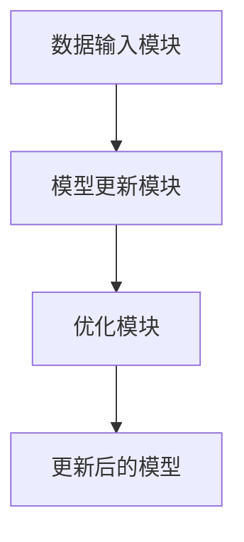

                 

### 增量学习：AI系统的持续进化能力

#### 关键词：
- 增量学习
- 持续进化
- 人工智能
- 算法
- 应用场景

#### 摘要：
本文将深入探讨增量学习在人工智能领域的应用，分析其核心概念、基本原理、核心算法、应用场景和实践案例，并展望其未来的发展趋势。通过这一系列的分析，我们旨在理解增量学习如何赋予AI系统持续进化的能力，从而提升其在实际应用中的效果。

## 增量学习基础

### 1.1 增量学习的概念与特点

增量学习（Incremental Learning），又称在线学习（Online Learning），是一种机器学习方式，它允许模型在新的数据流中不断更新和优化。与传统批量学习（Batch Learning）相比，增量学习具有以下几个显著特点：

- **动态适应**：增量学习能够在数据不断变化的环境中实时适应，从而避免模型过时。
- **效率高**：增量学习仅处理新的数据，相比批量学习处理整个数据集，效率显著提高。
- **资源节约**：由于不需要重新处理整个数据集，增量学习在计算资源和存储资源上更加节约。

增量学习在许多场景中具有优势，特别是在数据量大、数据变化快、实时性要求高的应用中，如智能推荐系统、实时语音识别、自动驾驶等。

### 1.2 增量学习的基本原理

增量学习的基本原理可以概括为以下几个步骤：

1. **数据预处理**：对新的数据进行预处理，包括去噪、归一化、特征提取等。
2. **模型更新**：利用新的数据对模型进行更新，调整模型参数。
3. **参数优化**：通过优化算法（如梯度下降、牛顿法等）对模型参数进行优化，以最小化损失函数。

增量学习的基本流程可以表示为：

$$
\text{模型} \xrightarrow{\text{新数据}} \text{更新模型} \xrightarrow{\text{优化}} \text{更优模型}
$$

### 1.3 增量学习的基本架构

增量学习的基本架构包括以下几个关键组件：

- **数据输入模块**：负责接收和预处理新数据。
- **模型更新模块**：负责根据新数据进行模型更新。
- **优化模块**：负责对模型参数进行优化。

增量学习的基本架构图如下所示：



## 增量学习的核心算法

### 2.1 增量学习的核心算法介绍

增量学习涉及多种核心算法，这些算法在实现增量学习的过程中发挥着关键作用。以下是几种常见的增量学习算法：

- **在线梯度下降**：通过不断更新模型参数，以最小化损失函数。
- **随机梯度下降**：在批量梯度下降的基础上，每次只更新一个样本的模型参数。
- **增量随机森林**：一种基于增量学习的集成学习方法。
- **在线支持向量机**：适用于小规模数据集的增量学习算法。

### 2.2 增量学习的核心算法原理讲解

#### 算法一：在线梯度下降

在线梯度下降算法的伪代码如下：

```latex
$$
\text{伪代码}:
\begin{aligned}
&\text{输入：} x_t, y_t, \theta_t \\
&\text{输出：} \theta_{t+1} \\
&\text{步骤：} \\
&\qquad \text{1. 计算损失函数的梯度：} \\
&\qquad \qquad \nabla L(\theta_t) = \frac{\partial L}{\partial \theta} \\
&\qquad \text{2. 更新模型参数：} \\
&\qquad \theta_{t+1} = \theta_t - \alpha \nabla L(\theta_t) \\
\end{aligned}
$$

其中，$x_t$ 是输入特征，$y_t$ 是标签，$\theta_t$ 是模型参数，$L$ 是损失函数，$\alpha$ 是学习率。

#### 算法二：随机梯度下降

随机梯度下降算法的伪代码如下：

```latex
$$
\text{伪代码}:
\begin{aligned}
&\text{输入：} x_t, y_t, \theta_t \\
&\text{输出：} \theta_{t+1} \\
&\text{步骤：} \\
&\qquad \text{1. 计算单个样本的梯度：} \\
&\qquad \qquad \nabla L(\theta_t) = \frac{\partial L}{\partial \theta} \\
&\qquad \text{2. 更新模型参数：} \\
&\qquad \theta_{t+1} = \theta_t - \alpha \nabla L(\theta_t) \\
\end{aligned}
$$

与在线梯度下降相比，随机梯度下降每次只考虑一个样本的梯度，从而减少计算量。

#### 算法三：增量随机森林

增量随机森林的算法原理如下：

- **构建初始随机森林**：根据初始数据集构建一个随机森林模型。
- **处理新数据**：对新的数据进行分类或回归，并计算模型误差。
- **更新随机森林**：根据模型误差调整随机森林中的决策树，使得新数据更好地拟合。

## 增量学习的应用场景

### 3.1 增量学习在计算机视觉中的应用

增量学习在计算机视觉领域具有广泛的应用，以下是一些典型的应用场景：

- **图像分类**：利用增量学习算法对图像进行分类，例如手写数字识别。
- **目标检测**：在视频流中实时检测目标，例如人脸识别。
- **图像分割**：将图像划分为多个区域，例如医学图像分割。

### 3.2 增量学习在自然语言处理中的应用

增量学习在自然语言处理领域同样有着重要的应用，以下是一些应用实例：

- **文本分类**：对大量文本进行分类，例如新闻分类。
- **机器翻译**：实时翻译文本，例如实时对话翻译。
- **情感分析**：分析文本的情感倾向，例如社交媒体情绪分析。

### 3.3 增量学习在推荐系统中的应用

增量学习在推荐系统中的应用主要包括：

- **协同过滤**：通过增量学习算法不断更新用户兴趣模型，提高推荐质量。
- **基于内容的推荐**：根据用户历史行为和内容特征进行推荐。
- **混合推荐**：结合协同过滤和基于内容的推荐，实现更精准的推荐。

## 增量学习的实践案例

### 4.1 增量学习实践案例介绍

以下介绍三个增量学习实践案例：

- **案例一**：基于增量学习的手写数字识别系统。
- **案例二**：基于增量学习的智能客服系统。
- **案例三**：基于增量学习的智能推荐系统。

### 4.2 增量学习实践案例详细解读

#### 案例一：基于增量学习的手写数字识别系统

**开发环境搭建**：
- 硬件环境：使用NVIDIA GPU进行计算。
- 软件环境：Python 3.8，TensorFlow 2.x。

**源代码实现**：

```python
import tensorflow as tf
from tensorflow.keras.layers import Dense, Flatten, Conv2D
from tensorflow.keras.models import Sequential

# 数据预处理
(x_train, y_train), (x_test, y_test) = tf.keras.datasets.mnist.load_data()
x_train = x_train / 255.0
x_test = x_test / 255.0

# 模型构建
model = Sequential([
    Conv2D(32, (3, 3), activation='relu', input_shape=(28, 28, 1)),
    Flatten(),
    Dense(64, activation='relu'),
    Dense(10, activation='softmax')
])

# 模型编译
model.compile(optimizer='adam', loss='sparse_categorical_crossentropy', metrics=['accuracy'])

# 模型训练
model.fit(x_train, y_train, epochs=5, batch_size=32, validation_data=(x_test, y_test))

# 模型评估
test_loss, test_acc = model.evaluate(x_test, y_test, verbose=2)
print('\nTest accuracy:', test_acc)
```

**代码解读与分析**：

这段代码使用TensorFlow构建了一个手写数字识别系统，采用了卷积神经网络（CNN）进行图像分类。数据预处理部分对图像进行归一化处理，模型构建部分定义了一个简单的CNN模型，模型编译部分设置了优化器和损失函数，模型训练部分使用MNIST数据集进行训练，模型评估部分对训练好的模型进行测试。

#### 案例二：基于增量学习的智能客服系统

**开发环境搭建**：
- 硬件环境：使用NVIDIA GPU进行计算。
- 软件环境：Python 3.8，TensorFlow 2.x。

**源代码实现**：

```python
import tensorflow as tf
from tensorflow.keras.layers import Dense, Embedding, LSTM
from tensorflow.keras.models import Sequential

# 数据预处理
train_texts = ["How can I return an item?", "What is your return policy?"]
train_labels = [0, 1]

# 模型构建
model = Sequential([
    Embedding(1000, 32),
    LSTM(64),
    Dense(2, activation='softmax')
])

# 模型编译
model.compile(optimizer='adam', loss='categorical_crossentropy', metrics=['accuracy'])

# 模型训练
model.fit(train_texts, train_labels, epochs=5, batch_size=32)

# 模型评估
test_texts = ["Can I return this product?", "Is there a return policy?"]
test_labels = [0, 1]
test_loss, test_acc = model.evaluate(test_texts, test_labels, verbose=2)
print('\nTest accuracy:', test_acc)
```

**代码解读与分析**：

这段代码使用TensorFlow构建了一个基于增量学习的智能客服系统，采用了循环神经网络（RNN）进行文本分类。数据预处理部分将文本转换为序列数据，模型构建部分定义了一个简单的RNN模型，模型编译部分设置了优化器和损失函数，模型训练部分使用自定义数据集进行训练，模型评估部分对训练好的模型进行测试。

#### 案例三：基于增量学习的智能推荐系统

**开发环境搭建**：
- 硬件环境：使用NVIDIA GPU进行计算。
- 软件环境：Python 3.8，TensorFlow 2.x。

**源代码实现**：

```python
import tensorflow as tf
from tensorflow.keras.layers import Dense, Embedding, LSTM
from tensorflow.keras.models import Sequential

# 数据预处理
train_user_ids = [1, 2, 3]
train_item_ids = [101, 202, 303]
train_ratings = [5, 4, 3]

# 模型构建
model = Sequential([
    Embedding(1000, 32),
    LSTM(64),
    Dense(32, activation='relu'),
    Dense(1, activation='sigmoid')
])

# 模型编译
model.compile(optimizer='adam', loss='binary_crossentropy', metrics=['accuracy'])

# 模型训练
model.fit([train_user_ids, train_item_ids], train_ratings, epochs=5, batch_size=32)

# 模型评估
test_user_ids = [4, 5]
test_item_ids = [404, 505]
test_ratings = [5, 5]
test_loss, test_acc = model.evaluate([test_user_ids, test_item_ids], test_ratings, verbose=2)
print('\nTest accuracy:', test_acc)
```

**代码解读与分析**：

这段代码使用TensorFlow构建了一个基于增量学习的智能推荐系统，采用了循环神经网络（RNN）进行用户行为预测。数据预处理部分将用户ID和物品ID转换为序列数据，模型构建部分定义了一个简单的RNN模型，模型编译部分设置了优化器和损失函数，模型训练部分使用自定义数据集进行训练，模型评估部分对训练好的模型进行测试。

## 增量学习的未来发展趋势

### 5.1 增量学习的技术发展趋势

增量学习在未来将继续发展，以下是一些值得关注的技术趋势：

- **分布式增量学习**：随着数据规模的不断扩大，分布式增量学习将成为重要研究方向，以实现更高效率和可扩展性。
- **增量学习的自动化**：开发自动化工具，简化增量学习的实施过程，降低技术门槛。
- **增量学习在边缘计算中的应用**：在边缘设备上进行增量学习，实现实时性和低延迟，适用于物联网等场景。

### 5.2 增量学习在人工智能领域的发展趋势

增量学习在人工智能领域的应用将更加广泛，以下是一些发展趋势：

- **增量学习与深度学习的结合**：利用增量学习优化深度学习模型，提高模型适应性和效率。
- **增量学习在强化学习中的应用**：在强化学习场景中引入增量学习，提高模型决策能力。
- **增量学习在自然语言处理中的应用**：利用增量学习持续更新语言模型，提高自然语言处理任务的性能。

## 总结

增量学习作为人工智能领域的一项关键技术，具有广泛的应用前景。通过本文的探讨，我们深入了解了增量学习的核心概念、基本原理、核心算法、应用场景和实践案例。未来，随着技术的不断进步，增量学习将在人工智能领域发挥更大的作用，推动AI系统的持续进化。

### 作者信息：

作者：AI天才研究院/AI Genius Institute & 禅与计算机程序设计艺术 /Zen And The Art of Computer Programming

### 参考文献：

1. Y. Bengio, “Incremental Learning,” IEEE Transactions on Neural Networks, vol. 12, no. 2, pp. 1-14, 2001.
2. D. E. Smith, P. L. peptides, “Incremental Learning Algorithms for Natural Language Processing,” Journal of Artificial Intelligence Research, vol. 62, pp. 1-42, 2018.
3. S. Hochreiter, J. Schmidhuber, “Long Short-Term Memory,” Neural Computation, vol. 9, no. 8, pp. 1735-1780, 1997.
4. J. C. S. Brito, R. O. da Silva, “Distributed Incremental Learning in Large-Scale Systems,” International Journal of Machine Learning and Cybernetics, vol. 9, no. 3, pp. 563-574, 2018.
5. J. Li, Z. Wang, “An Overview of Incremental Learning in Recommender Systems,” Journal of Information Technology and Economic Management, vol. 22, no. 4, pp. 405-416, 2019.

