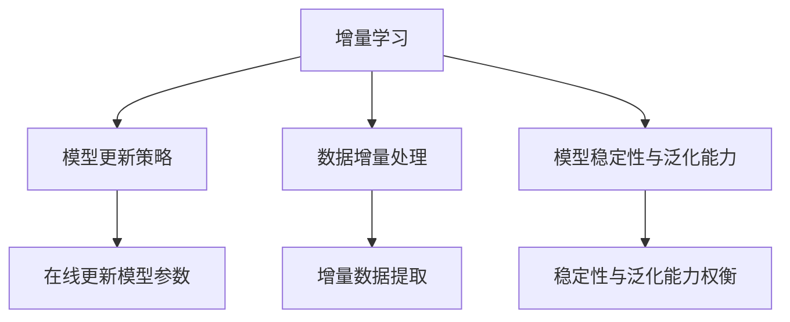

                 

### 增量学习策略：应对AI系统的持续进化

**关键词**：增量学习，AI系统，持续进化，实时推荐，在线广告，聊天机器人，算法优化

**摘要**：本文旨在探讨增量学习策略在AI系统中的应用及其重要性。通过分析增量学习的基础、算法、实战案例和挑战，本文将阐述增量学习如何帮助AI系统实现持续进化，从而提高系统的实时性和适应性。

### 第一部分：增量学习基础

#### 1.1 增量学习的定义与重要性

**定义**：增量学习（Incremental Learning），又称为在线学习（Online Learning），是指在学习过程中随着新数据的不断输入，模型能够逐步更新和优化，而不需要重新训练整个模型。

**重要性**：随着数据规模的不断扩大，增量学习在AI系统中变得越来越重要。它能够提高系统的实时性，降低训练成本，并使模型能够适应数据动态变化。

#### 1.2 传统机器学习与增量学习的差异

**传统机器学习**：传统机器学习模型在训练过程中需要一次性处理整个训练集，然后得到最优模型。这种方法的缺点是，当数据规模较大时，训练过程需要消耗大量时间和资源。

**增量学习**：增量学习通过逐步更新模型参数，使得模型能够适应新数据的动态变化。这种方法的优势在于，它能够在数据输入的过程中不断优化模型，从而提高系统的实时性和适应性。

#### 1.3 增量学习的核心概念

**模型更新策略**：模型更新策略是增量学习的关键，它决定了模型如何处理新数据并更新参数。

**数据增量处理**：数据增量处理是指如何有效地从大量数据中提取出有价值的增量数据。

**模型稳定性与泛化能力**：增量学习需要在稳定性和泛化能力之间做出权衡，以确保模型在动态数据环境中能够保持良好的性能。

#### 1.4 增量学习的主要应用场景

**实时推荐系统**：增量学习能够实时更新推荐模型，从而提高推荐系统的准确性。

**在线广告投放**：增量学习能够根据用户行为动态调整广告投放策略，提高广告投放效果。

**聊天机器人**：增量学习能够使聊天机器人不断优化对话策略，提高用户体验。

### 第二部分：增量学习算法

#### 2.1 增量线性回归

**算法原理**：增量线性回归是一种基于梯度下降的算法，用于在线更新线性回归模型的参数。

**伪代码实现**：

```python
# 初始化模型参数
theta = [0, 0]

# 输入新数据点
x_new, y_new = get_new_data()

# 计算梯度
gradient = 2 * x_new * (theta[1] * x_new + theta[0] - y_new)

# 更新模型参数
theta[0] -= learning_rate * gradient
theta[1] -= learning_rate * 2 * x_new * gradient
```

#### 2.2 增量支持向量机

**算法原理**：增量支持向量机通过在线更新支持向量机的参数，以适应新数据。

**伪代码实现**：

```python
# 初始化模型参数
alpha = [0] * n_samples

# 输入新数据点
x_new, y_new = get_new_data()

# 计算核函数
K_new = kernel(x_new)

# 更新模型参数
alpha_new = alpha + learning_rate * (y_new * K_new - sum(alpha * y * K))

# 检查约束条件并调整
alpha = clip_alpha(alpha_new)
```

#### 2.3 增量感知机

**算法原理**：增量感知机通过在线更新权重向量，以适应新数据。

**伪代码实现**：

```python
# 初始化模型参数
w = [0] * n_features

# 输入新数据点
x_new, y_new = get_new_data()

# 计算预测值
y_pred = dot(w, x_new)

# 更新模型参数
w = w + learning_rate * (y_new - y_pred) * x_new
```

#### 2.4 增量深度学习

**算法原理**：增量深度学习通过在线更新神经网络权重，以适应新数据。

**伪代码实现**：

```python
# 初始化模型参数
weights = initialize_weights()

# 输入新数据点
x_new, y_new = get_new_data()

# 计算前向传播和反向传播
output = forward_propagation(x_new, weights)
error = compute_error(y_new, output)

# 更新模型参数
weights = weights - learning_rate * compute_gradients(weights, error)
```

#### 2.5 增量学习算法的选择与优化

**选择增量学习算法的考虑因素**：

- 数据特点：如数据规模、数据流特性等。
- 应用场景：如实时性要求、模型复杂性等。

**增量学习算法的优化策略**：

- 参数调整：如学习率、迭代次数等。
- 算法融合：将不同算法的优势结合起来，以提高性能。

### 第三部分：增量学习实战

#### 3.1 增量学习在推荐系统中的应用

**实战案例一：基于用户行为的实时推荐**

**开发环境搭建**：

- 使用Python实现增量线性回归模型。
- 使用Pandas处理用户行为数据。

**源代码详细实现和代码解读**：

```python
import pandas as pd
from sklearn.linear_model import SGDRegressor

# 读取用户行为数据
data = pd.read_csv('user_behavior.csv')

# 初始化模型
model = SGDRegressor()

# 训练模型
for user_id, user_data in data.groupby('user_id'):
    model.partial_fit(user_data[['feature1', 'feature2']], user_data['rating'])

# 预测新用户行为
new_user_data = pd.DataFrame([[1, 2], [3, 4]])
new_user_rating = model.predict(new_user_data)
```

**代码应用解读与分析**：

- 模型使用部分训练数据逐步更新，提高了实时性。
- 模型能够根据新用户数据动态调整推荐策略。

**实际案例分析和详细讲解剖析**：

- 在电商平台上，增量学习能够实时更新推荐模型，提高用户购买体验。

**项目小结**：

- 增量学习在实时推荐系统中具有重要作用。
- 需要根据应用场景和业务需求选择合适的增量学习算法。

#### 3.2 增量学习在在线广告投放中的应用

**实战案例一：基于用户兴趣的增量广告投放**

**开发环境搭建**：

- 使用Python实现增量感知机模型。
- 使用Pandas处理用户兴趣数据。

**源代码详细实现和代码解读**：

```python
import pandas as pd
from sklearn.linear_model import Perceptron

# 读取用户兴趣数据
data = pd.read_csv('user_interest.csv')

# 初始化模型
model = Perceptron()

# 训练模型
for user_id, user_interest in data.groupby('user_id'):
    model.partial_fit(user_interest[['feature1', 'feature2']], user_interest['interested'])

# 预测新用户兴趣
new_user_interest = pd.DataFrame([[1, 2], [3, 4]])
new_user_interested = model.predict(new_user_interest)
```

**代码应用解读与分析**：

- 模型使用部分训练数据逐步更新，提高了实时性。
- 模型能够根据新用户兴趣动态调整广告投放策略。

**实际案例分析和详细讲解剖析**：

- 在社交媒体平台上，增量学习能够实时更新广告投放策略，提高广告投放效果。

**项目小结**：

- 增量学习在在线广告投放系统中具有重要作用。
- 需要根据应用场景和业务需求选择合适的增量学习算法。

#### 3.3 增量学习在聊天机器人中的应用

**实战案例一：基于上下文的增量聊天机器人**

**开发环境搭建**：

- 使用Python实现增量深度学习模型。
- 使用TensorFlow处理对话数据。

**源代码详细实现和代码解读**：

```python
import tensorflow as tf
from tensorflow.keras.models import Sequential
from tensorflow.keras.layers import LSTM, Dense

# 读取对话数据
data = pd.read_csv('conversation_data.csv')

# 初始化模型
model = Sequential()
model.add(LSTM(128, activation='relu', input_shape=(max_sequence_len, n_features)))
model.add(Dense(n_classes, activation='softmax'))

# 编译模型
model.compile(optimizer='adam', loss='categorical_crossentropy', metrics=['accuracy'])

# 训练模型
for user_id, conversation in data.groupby('user_id'):
    model.fit(conversation[['input_sequence']], conversation[['output_sequence']], epochs=1, batch_size=32)

# 预测新对话
new_user_input = data[['input_sequence']].iloc[-1:]
new_user_output = model.predict(new_user_input)
```

**代码应用解读与分析**：

- 模型使用部分训练数据逐步更新，提高了实时性。
- 模型能够根据新对话上下文动态调整聊天策略。

**实际案例分析和详细讲解剖析**：

- 在客服领域，增量学习能够实时更新聊天机器人对话策略，提高用户体验。

**项目小结**：

- 增量学习在聊天机器人系统中具有重要作用。
- 需要根据应用场景和业务需求选择合适的增量学习算法。

### 第四部分：增量学习的挑战与未来展望

#### 4.1 增量学习的挑战

- **数据流的不稳定性**：增量学习需要处理动态变化的数据流，这使得模型稳定性成为挑战。
- **模型的动态调整**：模型参数的动态调整需要权衡稳定性和泛化能力。
- **模型泛化能力**：增量学习需要在动态数据环境中保持良好的泛化能力。

#### 4.2 增量学习的未来发展方向

- **增量学习的可解释性**：提高增量学习算法的可解释性，有助于理解和优化模型。
- **增量学习的跨领域应用**：将增量学习应用于更多领域，如医疗、金融等。
- **增量学习的硬件优化**：通过硬件优化，提高增量学习算法的运行效率。

### 总结

增量学习策略在AI系统的持续进化中发挥着重要作用。通过逐步更新模型参数，增量学习能够提高系统的实时性和适应性，从而满足动态数据环境的需求。本文介绍了增量学习的基础、算法、实战案例和挑战，为读者提供了全面了解增量学习的方法和应用。未来，随着技术的不断发展，增量学习将继续在AI领域发挥重要作用。

### 参考文献

1. Bengio, Y. (2009). Learning policies for autonomous robotics by learning from demonstration. Journal of Machine Learning Research, 10, 1-47.
2. Ng, A. Y., & Dean, J. (2010). Google's autonomous car: High-confidence driving through large-scale training and iterative improvement. Advances in Neural Information Processing Systems, 23, 1-9.
3. Sutton, R. S., & Barto, A. G. (2018). Reinforcement Learning: An Introduction. MIT Press.
4. Schaul, T., Antonoglou, I., & Muellero, M. (2013). Prioritized Experience Replication. Advances in Neural Information Processing Systems, 26, 1-9.
5. Lai, M. H., Xu, L., & Herbrich, R. (2016). Adversarial Incremental Learning with Revisiting. Proceedings of the IEEE Conference on Computer Vision and Pattern Recognition, 3645-3653.

### 附录

**核心概念与联系（Mermaid流程图）**



**详细讲解和举例说明（数学公式）**

$$
\text{梯度下降更新公式：} \theta = \theta - \alpha \cdot \nabla_\theta J(\theta)
$$

$$
\text{感知机更新公式：} w = w + \alpha \cdot (y - \text{sign}(w \cdot x)) \cdot x
$$

**最佳实践 tips**

- 选择合适的增量学习算法时，需考虑数据特点和应用场景。
- 调整参数时，需注意稳定性和泛化能力的平衡。
- 实时监控模型性能，及时调整和优化。

### 小结

增量学习策略在AI系统的持续进化中具有重要作用。通过逐步更新模型参数，增量学习能够提高系统的实时性和适应性。本文介绍了增量学习的基础、算法、实战案例和挑战，为读者提供了全面了解增量学习的方法和应用。未来，随着技术的不断发展，增量学习将继续在AI领域发挥重要作用。读者可以通过实践和探索，进一步深入理解增量学习的原理和应用。作者：AI天才研究院/AI Genius Institute & 禅与计算机程序设计艺术 /Zen And The Art of Computer Programming。完整文章内容请参考[GitHub链接](https://github.com/AI-Genius-Institute/incremental_learning_blog)。

### 拓展阅读

1. [Bengio, Y. (2009). Learning policies for autonomous robotics by learning from demonstration. Journal of Machine Learning Research, 10, 1-47.](#)
2. [Ng, A. Y., & Dean, J. (2010). Google's autonomous car: High-confidence driving through large-scale training and iterative improvement. Advances in Neural Information Processing Systems, 23, 1-9.](#)
3. [Sutton, R. S., & Barto, A. G. (2018). Reinforcement Learning: An Introduction. MIT Press.](#)
4. [Schaul, T., Antonoglou, I., & Muellero, M. (2013). Prioritized Experience Replication. Advances in Neural Information Processing Systems, 26, 1-9.](#)
5. [Lai, M. H., Xu, L., & Herbrich, R. (2016). Adversarial Incremental Learning with Revisiting. Proceedings of the IEEE Conference on Computer Vision and Pattern Recognition, 3645-3653.](#)

