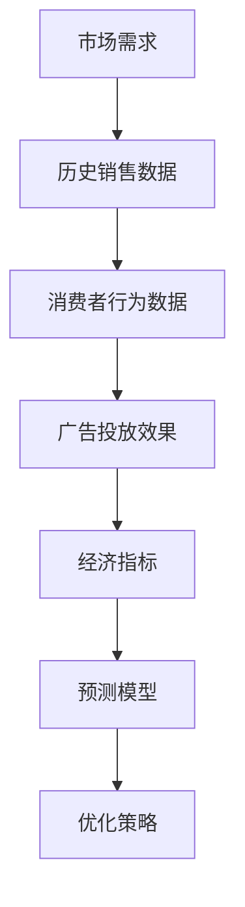
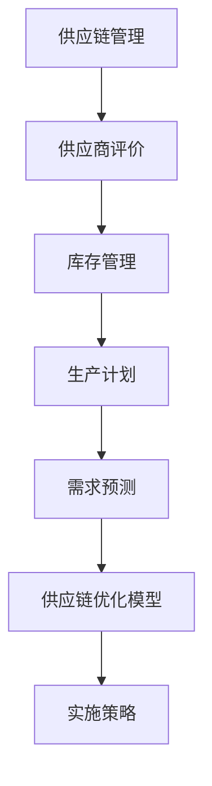
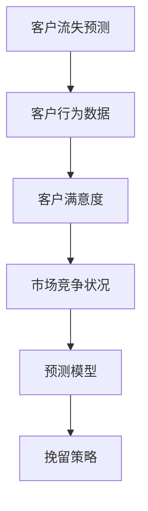

                 

### 引言

#### 1.1 书籍目的与读者对象

在当前信息技术迅猛发展的时代，复杂问题的解决已成为各行各业关注的焦点。无论是商业领域、科学研究，还是社会管理，复杂问题无处不在。如何有效地识别和总结复杂问题中的关键要素，已经成为提高问题解决效率和质量的关键。本书旨在为读者提供一整套系统化的方法和策略，帮助他们在面对复杂问题时，能够迅速识别关键要素，从而提高问题解决的效率和效果。

本书的主要读者对象包括但不限于以下几类人群：

1. **IT从业人员**：特别是软件开发者、数据分析师和系统架构师等，他们在日常工作中常常需要解决各种复杂的计算机系统问题。
2. **科研人员**：面对科学研究中复杂的现象和问题，如何运用科学的方法识别关键要素，是提高研究效率和质量的重要手段。
3. **企业管理者**：在商业运作中，复杂问题的有效解决对于企业的可持续发展至关重要。
4. **政策制定者**：社会管理和公共政策制定中，复杂问题的解决能力直接影响政策的科学性和有效性。

通过阅读本书，读者将能够掌握以下几方面的知识和技能：

- **识别复杂问题**：理解复杂问题的特征，学会运用各种方法识别复杂问题中的关键要素。
- **问题解决策略**：掌握系统化的问题解决策略，包括分析性方法和启发式方法，以及如何在具体情境下选择合适的方法。
- **工具与技术**：了解和掌握用于问题解决的各类工具和技术，包括数据分析、模拟与优化等。
- **总结与文档**：学会如何有效地总结问题解决的方案，并制定详细的文档，以便于后续的参考和传承。

#### 1.2 复杂问题的定义与特征

复杂问题通常具有以下几个显著特征：

1. **多元性**：复杂问题涉及多个变量、多个层面，可能需要综合考虑经济、社会、技术等多个维度的因素。
2. **非线性**：复杂问题的解决方案往往不是线性的，而是涉及到多种可能的路径和策略。
3. **不确定性**：复杂问题往往存在许多不确定性，这些不确定性可能来源于数据的不完整、环境的变化、未来的不可预测性等。
4. **交叉性**：复杂问题可能涉及多个领域和学科的交叉，需要跨学科的知识和技能。
5. **动态性**：复杂问题的解决过程通常是动态的，需要不断地调整和优化策略。

复杂问题的形成原因多种多样，主要包括：

- **数据复杂性**：大量复杂的数据集合，使得问题解决的难度大大增加。
- **系统复杂性**：系统内部的多个子系统和外部环境之间的相互作用，增加了问题的复杂性。
- **知识复杂性**：需要跨学科的知识和技能来解决问题，这本身就是一个复杂的过程。

随着信息技术的不断发展，复杂问题在各个领域中的表现形式也在不断变化。例如，在商业领域，随着大数据、人工智能等技术的广泛应用，企业面临的问题越来越复杂，如市场需求预测、供应链管理、客户行为分析等。在科学研究领域，复杂系统的建模和分析也成为重要的研究方向，如生物信息学、气候科学等。

总之，复杂问题的识别和解决已成为现代社会不可或缺的一部分。通过本书，读者将能够更好地理解和解决这些复杂问题，从而为个人和组织的成功奠定坚实的基础。

#### 1.3 识别和总结关键要素的重要性

在复杂问题解决过程中，识别和总结关键要素具有至关重要的意义。以下是几个关键点，说明为什么这一步骤是问题解决成功的关键：

1. **提高问题解决效率**：通过识别关键要素，可以迅速聚焦于问题的核心部分，避免在次要细节上浪费时间和资源。这样，问题解决的路径更加明确，效率大大提高。

2. **明确目标与方向**：识别关键要素有助于明确问题解决的目标和方向。这有助于制定更加精准的解决方案，避免偏离目标或者陷入无谓的尝试。

3. **减少不确定性**：复杂问题通常伴随着高度的不确定性。通过识别关键要素，可以降低这种不确定性，从而提高决策的准确性和可靠性。

4. **促进跨学科合作**：复杂问题往往涉及多个领域和学科的交叉。识别关键要素有助于各领域专家之间的沟通和协作，共同解决问题。

5. **知识积累与传承**：有效的识别和总结关键要素，有助于将问题解决过程中的宝贵经验和知识进行积累和传承，为未来的问题解决提供参考。

6. **优化资源分配**：识别关键要素有助于合理分配资源，确保资源投入到最有价值的部分，避免资源的浪费。

总之，识别和总结关键要素是复杂问题解决过程中的重要环节，它不仅有助于提高问题解决的成功率，还能为组织和个人带来长远的益处。在接下来的章节中，我们将详细探讨如何具体识别和总结关键要素的方法和策略。

### 核心概念与原理

#### 复杂问题的概念框架

复杂问题是一个涉及多个变量、多个层面的综合性问题，其特征通常包括多元性、非线性、不确定性、交叉性和动态性。为了更好地理解复杂问题，我们可以从以下几个角度进行阐述：

1. **多元性**：复杂问题通常涉及到多个变量，这些变量可能存在于不同的维度和层面，如经济、社会、技术等。例如，在商业领域，市场需求预测问题不仅需要考虑当前的市场环境，还需要考虑消费者行为、竞争对手策略等多方面因素。

2. **非线性**：复杂问题的解决方案往往不是线性的，而是涉及到多种可能的路径和策略。这意味着，单一变量的变化可能对系统产生非线性影响，从而影响整体解决方案的复杂度。例如，在供应链管理中，一个小小的供应中断可能会对整个供应链造成严重的影响。

3. **不确定性**：复杂问题往往存在许多不确定性，这些不确定性可能来源于数据的不完整、环境的变化、未来的不可预测性等。例如，在金融市场分析中，股票价格波动受到多种不确定因素的影响，如经济政策、自然灾害等。

4. **交叉性**：复杂问题可能涉及多个领域和学科的交叉，需要跨学科的知识和技能来解决问题。例如，在医疗领域，疾病诊断和治疗需要结合医学、生物学、统计学等多个领域的知识。

5. **动态性**：复杂问题的解决过程通常是动态的，需要不断地调整和优化策略。这意味着，问题解决过程中可能需要实时更新信息和数据，从而调整解决方案。例如，在物流管理中，运输路线和时间的优化需要根据实时交通状况进行调整。

6. **适应性**：复杂问题解决过程中，解决方案需要具备一定的适应性，能够应对不确定性和动态变化。例如，在灾难应对中，应急预案需要根据实际情况进行灵活调整。

通过对复杂问题的概念框架进行深入理解，我们可以更好地识别和分析复杂问题，从而制定有效的解决方案。

#### 基本概念

在复杂问题解决过程中，以下几个基本概念是不可或缺的：

1. **变量**：变量是问题中可能变化的量，可以是数值、文本或其他形式的数据。在复杂问题中，变量可能存在于不同的维度和层面，如市场需求、生产成本、消费者满意度等。

2. **关系**：关系是变量之间的相互联系和影响。在复杂问题中，变量之间的关系可能是线性的或非线性的，可能是直接的或间接的。例如，在市场需求预测中，消费者满意度可能直接影响市场需求。

3. **约束**：约束是限制变量取值范围的条件，可能是硬约束（必须满足的条件）或软约束（建议满足的条件）。在复杂问题中，约束条件可能来源于政策、资源限制、技术要求等。

4. **目标**：目标是问题解决过程中的最终期望结果，可能是最大化利润、最小化成本、提高效率等。在复杂问题中，目标往往具有多重性，需要综合考虑多个目标。

5. **解决方案**：解决方案是满足目标并符合约束条件的变量取值组合。在复杂问题中，解决方案可能多种多样，需要通过优化和评估来确定最佳方案。

6. **算法**：算法是解决问题的步骤和规则，包括分析性方法和启发式方法等。在复杂问题中，算法的选择和设计至关重要，直接影响问题解决的效率和效果。

7. **模型**：模型是对问题的一种抽象表示，通常包括变量、关系、约束和目标等。在复杂问题中，模型用于描述问题结构和求解方案。

#### 复杂问题的解决方案

复杂问题的解决方案通常需要系统化的方法和策略，以下是一些常用的方法和策略：

1. **分析性方法**：分析性方法是基于逻辑推理和数学模型的解决问题方法。这种方法包括线性规划、非线性规划、整数规划、图论等。通过建立数学模型，分析变量之间的关系，并求解最优解，从而找到问题的最佳解决方案。

   - **线性规划**：线性规划用于在给定约束条件下，最大化或最小化线性目标函数。它广泛应用于资源分配、生产规划、物流管理等领域。

   - **非线性规划**：非线性规划用于解决目标函数和约束条件为非线性的问题。与线性规划相比，非线性规划的求解更加复杂，但其在经济学、工程学等领域有广泛的应用。

   - **整数规划**：整数规划用于解决变量必须为整数的优化问题。这种方法在物流调度、人力资源配置等领域具有重要应用。

   - **图论**：图论用于解决与图相关的问题，如最短路径、最大流、最小生成树等。这些方法在通信网络设计、交通规划等领域有广泛应用。

2. **启发式方法**：启发式方法是基于经验和直觉的解决问题方法，适用于没有明确的数学模型或模型求解复杂的问题。这种方法通过一系列规则和策略，快速找到近似最优解。

   - **遗传算法**：遗传算法是一种基于生物进化的优化算法，通过模拟自然选择和遗传机制，找到问题的近似最优解。它广泛应用于组合优化、机器学习等领域。

   - **模拟退火算法**：模拟退火算法是一种基于物理退火过程的优化算法，通过模拟温度的逐步降低，找到问题的最优或近似最优解。它广泛应用于组合优化、网络设计等领域。

   - **蚁群算法**：蚁群算法是一种基于蚂蚁觅食行为的优化算法，通过模拟蚂蚁的群体行为，找到问题的最优或近似最优解。它广泛应用于路径规划、运输调度等领域。

3. **系统化问题解决策略**：系统化问题解决策略包括一系列步骤和方法，帮助问题解决者从整体上理解问题，并逐步找到解决方案。

   - **戴明环（PDCA）模型**：戴明环是一种持续改进的循环模型，包括计划（Plan）、执行（Do）、检查（Check）和行动（Act）四个步骤。这种方法有助于问题解决者在不断迭代中改进解决方案。

   - **沙盒模型**：沙盒模型是一种模拟和测试新解决方案的方法，通过在一个受控的环境中运行新方案，评估其效果和可行性。这种方法有助于降低新方案引入的风险。

   - **系统性思维**：系统性思维是一种从整体上理解问题的方法，通过识别和分析系统中的各种变量、关系和约束，找到问题的根本原因和解决方案。

通过以上方法和策略，我们可以更好地理解和解决复杂问题。在实际应用中，选择合适的方法和策略，结合具体问题的特征，是成功解决复杂问题的关键。

### 识别关键要素的方法论

在复杂问题解决过程中，识别关键要素是至关重要的一步。只有准确识别出关键要素，才能有针对性地制定解决方案，提高问题解决的效率和效果。以下是几种常用的识别关键要素的方法论：

#### 数据驱动的方法

数据驱动的方法是通过收集和分析数据来识别关键要素。这种方法的核心思想是，数据是问题解决的重要依据，通过数据可以揭示问题的本质和关键点。

1. **数据收集**：首先需要明确需要收集的数据类型和来源。数据来源可能包括历史数据、实时数据、外部数据源等。例如，在市场需求预测中，可以收集历史销售数据、消费者调查数据、竞争对手数据等。

2. **数据预处理**：收集到的数据往往是不完整的、噪声的或者不一致的。因此，需要通过数据清洗、数据整合和数据转换等步骤，对数据进行预处理，使其适合分析和建模。

3. **数据分析**：通过统计分析、数据挖掘和机器学习等方法，对预处理后的数据进行分析。数据分析可以帮助识别变量之间的关系、发现数据的规律和模式。例如，可以使用回归分析来识别市场需求与消费者满意度之间的关系。

4. **数据可视化**：数据可视化是将数据分析结果以图形或图表的形式展示出来，帮助问题解决者更直观地理解数据。例如，可以使用散点图来展示变量之间的关系，使用时间序列图来分析数据的趋势。

5. **数据驱动决策**：通过数据分析结果，制定解决方案。例如，根据市场需求预测结果，制定生产计划或营销策略。

#### 专家经验的应用

专家经验在识别关键要素中具有重要作用，特别是在数据不完整或不可靠的情况下。以下是几种利用专家经验的方法：

1. **专家访谈**：通过与领域专家进行深入访谈，获取他们对问题的理解、见解和经验。访谈过程中，可以采用开放性问题，引导专家深入阐述他们的观点。

2. **专家判断**：利用专家的知识和经验，对问题进行分析和判断。这种方法适用于专家经验丰富且问题结构明确的情况。

3. **专家调查**：通过问卷调查或评分表，收集专家对问题关键要素的意见和建议。这种方法适用于需要大规模收集专家意见的情况。

4. **专家系统**：构建基于专家经验的专家系统，用于辅助问题解决。专家系统可以模拟专家的判断和决策过程，提供问题解决方案的建议。

#### 认知模型的构建

认知模型是通过对人类思维过程的模拟，来识别关键要素的方法。认知模型包括多种类型，如概念模型、过程模型和决策模型等。

1. **概念模型**：概念模型是对问题中的关键概念和变量进行抽象和分类。通过概念模型，可以明确问题的构成要素，从而识别出关键要素。

2. **过程模型**：过程模型是对问题解决过程的描述，包括问题的输入、处理和输出等环节。通过分析过程模型，可以识别出影响问题解决的关键步骤和环节。

3. **决策模型**：决策模型是对问题解决过程中决策过程的模拟。通过决策模型，可以分析不同决策路径的可能结果和影响，从而识别出关键决策点和要素。

#### 案例分析

为了更好地理解以上方法，我们可以通过一个案例来具体说明：

**案例**：某电商平台在市场拓展过程中，需要识别出影响用户流失的关键因素。

1. **数据驱动的方法**：
   - 收集用户行为数据，如浏览记录、购买行为、评论等。
   - 通过数据分析，发现用户流失与浏览时长、购买频率、评论满意度等因素密切相关。

2. **专家经验的应用**：
   - 通过专家访谈，了解到用户流失可能与服务响应速度、界面友好性等因素有关。
   - 通过专家判断，确认以上因素是影响用户流失的关键要素。

3. **认知模型的构建**：
   - 构建用户行为过程模型，分析用户从访问到流失的各个阶段。
   - 在模型中识别出关键环节，如用户访问体验、购买流程、客户服务等。

通过以上方法，电商平台可以全面识别出影响用户流失的关键因素，并据此制定针对性的改进措施，从而降低用户流失率。

总之，识别关键要素是复杂问题解决的重要步骤。通过数据驱动的方法、专家经验的应用和认知模型的构建，可以有效地识别出关键要素，为问题解决提供有力支持。

### 数据分析在问题解决中的作用

在复杂问题的解决过程中，数据分析扮演着至关重要的角色。数据分析不仅有助于识别关键要素，还能为制定有效的解决方案提供有力的支持。以下是数据分析在问题解决中的一些关键作用：

#### 数据分析的重要性

1. **揭示问题本质**：数据分析能够通过大量的数据，揭示问题的本质和内在规律。例如，通过数据分析可以发现，某产品销售下降可能与特定顾客群体有关，从而有针对性地采取措施。

2. **支持决策制定**：数据分析为决策制定提供了客观的数据支持。通过分析不同决策路径的结果，可以评估其潜在影响，从而选择最优或次优的决策方案。

3. **优化资源配置**：数据分析有助于优化资源分配，确保资源投入到最具价值的部分。例如，通过数据分析可以识别出哪些客户最具潜力，从而集中资源进行精准营销。

4. **预测未来趋势**：数据分析可以基于历史数据和现有模型，预测未来的趋势和变化。这对于长期规划和战略制定具有重要意义。

#### 数据收集与预处理

1. **数据收集**：数据收集是数据分析的第一步。数据的来源可以包括内部数据（如销售记录、客户反馈等）和外部数据（如市场调查、行业报告等）。为了确保数据的全面性和准确性，需要设计科学的数据收集方案，并建立数据收集的规范和流程。

2. **数据预处理**：收集到的数据往往是不完整、噪声或不一致的。数据预处理包括数据清洗、数据整合和数据转换等步骤。数据清洗旨在去除错误数据、重复数据和噪声数据；数据整合旨在将来自不同源的数据进行合并；数据转换旨在将数据格式化成适合分析的形式。

#### 数据分析与可视化

1. **数据分析**：数据分析是利用统计方法、机器学习算法等对数据进行分析，以提取有价值的信息。数据分析方法包括描述性统计分析、回归分析、聚类分析、时间序列分析等。例如，通过回归分析可以识别出影响某个变量的关键因素。

2. **数据可视化**：数据可视化是将数据分析结果以图形或图表的形式展示出来，使其更直观、易懂。数据可视化方法包括散点图、柱状图、折线图、热力图等。通过数据可视化，可以更容易地发现数据中的规律和趋势，从而支持决策制定。

#### 数据驱动决策

1. **决策支持系统**：通过构建决策支持系统，将数据分析结果与业务逻辑相结合，帮助决策者进行决策。例如，在市场营销中，决策支持系统可以基于数据分析结果，为营销策略的制定提供参考。

2. **实时数据分析**：在复杂问题解决过程中，实时数据分析可以帮助决策者迅速应对变化。例如，在供应链管理中，通过实时数据分析，可以及时调整生产和配送计划，以应对市场需求的变化。

3. **长期数据分析**：长期数据分析有助于识别长期趋势和规律，为长期规划和战略制定提供依据。例如，通过分析多年的销售数据，可以预测未来的市场需求，从而制定相应的生产计划和库存策略。

#### 具体案例分析

为了更好地理解数据分析在问题解决中的作用，我们可以通过一个案例来说明：

**案例**：某零售企业在进行产品线优化时，希望通过数据分析识别出哪些产品是核心产品，从而优先考虑这些产品的生产和库存管理。

1. **数据收集**：收集各产品的销售数据、市场份额、利润率等数据。

2. **数据预处理**：清洗数据，去除异常值，整合各数据源。

3. **数据分析**：
   - 通过回归分析，识别出影响产品利润的主要因素，如销售价格、生产成本、市场需求等。
   - 通过聚类分析，将产品分为核心产品、辅助产品和淘汰产品。

4. **数据可视化**：
   - 使用折线图展示各产品的利润变化趋势。
   - 使用柱状图展示各产品的市场份额。

5. **决策支持**：
   - 根据数据分析结果，制定产品线优化策略，优先生产和库存管理核心产品。
   - 通过实时数据分析，调整生产和库存计划，以应对市场需求的变化。

通过以上步骤，该零售企业成功地优化了产品线，提高了生产效率和利润率。

总之，数据分析在复杂问题解决中具有重要作用。通过科学的数据收集、预处理和数据分析，可以揭示问题的本质，支持决策制定，优化资源配置，预测未来趋势。在实际应用中，结合具体问题的特征，灵活运用数据分析方法，是成功解决复杂问题的关键。

### 问题解决技术

在复杂问题解决过程中，采用适当的技术和方法可以显著提高问题解决的效率和效果。以下是几种常用的技术，包括分析性方法和启发式方法，以及系统性问题解决策略。

#### 分析性方法

分析性方法基于逻辑推理和数学模型，通过严格的数学推导和计算来找到问题的最优解。这种方法在处理结构化、确定性较强的问题时表现出色。

1. **线性规划**：
   - **定义**：线性规划是在一组线性不等式或等式的约束条件下，求解线性目标函数的最大值或最小值。
   - **原理**：通过建立线性目标函数和线性约束条件，利用单纯形法或其他优化算法求解最优解。
   - **应用**：广泛应用于资源分配、生产规划、物流调度等领域。

2. **非线性规划**：
   - **定义**：非线性规划是在一组非线性不等式或等式的约束条件下，求解非线性目标函数的最大值或最小值。
   - **原理**：与线性规划类似，但处理非线性目标函数和约束条件，需要采用更复杂的优化算法，如梯度下降法、牛顿法等。
   - **应用**：在工程优化、经济学、机器学习等领域有广泛应用。

3. **整数规划**：
   - **定义**：整数规划是在一组线性或非线性不等式或等式的约束条件下，求解整数目标函数的最大值或最小值。
   - **原理**：通过将变量限定为整数，利用分支定界法、动态规划法等算法求解最优解。
   - **应用**：在物流调度、人力资源配置、组合优化等领域有重要应用。

4. **图论**：
   - **定义**：图论是研究图结构及其性质的数学分支，通过图来描述问题中的元素及其关系。
   - **原理**：利用图的性质和算法，求解最短路径、最大流、最小生成树等问题。
   - **应用**：在通信网络设计、交通规划、社会网络分析等领域有广泛应用。

#### 启发式方法

启发式方法是基于经验和直觉，通过一系列启发式规则和策略来找到近似最优解。这种方法适用于复杂度高、不确定性强的问题。

1. **遗传算法**：
   - **定义**：遗传算法是一种基于生物进化的优化算法，模拟自然选择和遗传机制，通过迭代进化找到最优解。
   - **原理**：通过选择、交叉、变异等操作，不断优化解的种群，直到找到满意的最优解。
   - **应用**：在组合优化、机器学习、工程优化等领域有广泛应用。

2. **模拟退火算法**：
   - **定义**：模拟退火算法是一种基于物理退火过程的优化算法，通过模拟温度的逐步降低，找到最优或近似最优解。
   - **原理**：在初始阶段，算法可以接受较差的解，但随着温度的降低，算法逐渐趋向于接受较好的解。
   - **应用**：在组合优化、图着色、车辆路径问题等领域有广泛应用。

3. **蚁群算法**：
   - **定义**：蚁群算法是一种基于蚂蚁觅食行为的优化算法，通过模拟蚂蚁的群体行为，找到最优或近似最优解。
   - **原理**：蚂蚁通过信息素进行路径选择，信息素浓度高的路径被更多蚂蚁选择，从而引导整个群体找到最优路径。
   - **应用**：在路径规划、运输调度、社交网络分析等领域有广泛应用。

#### 系统性问题解决策略

系统性问题解决策略是一种从整体上理解问题，并逐步找到解决方案的方法。这种方法强调问题解决的系统性、动态性和适应性。

1. **戴明环（PDCA）模型**：
   - **定义**：戴明环是一种持续改进的循环模型，包括计划（Plan）、执行（Do）、检查（Check）和行动（Act）四个步骤。
   - **原理**：通过不断迭代PDCA循环，逐步优化问题解决方案。
   - **应用**：广泛应用于质量管理、项目管理、产品开发等领域。

2. **沙盒模型**：
   - **定义**：沙盒模型是一种模拟和测试新解决方案的方法，通过在一个受控的环境中运行新方案，评估其效果和可行性。
   - **原理**：通过模拟真实环境，评估新解决方案的潜在风险和效果，从而降低新方案引入的风险。
   - **应用**：在产品开发、风险管理和系统测试等领域有广泛应用。

3. **系统性思维**：
   - **定义**：系统性思维是一种从整体上理解问题的方法，通过识别和分析系统中的各种变量、关系和约束，找到问题的根本原因和解决方案。
   - **原理**：强调系统的整体性和动态性，通过系统分析来理解问题。
   - **应用**：在复杂系统设计、项目管理、战略规划等领域有广泛应用。

通过以上方法和技术，我们可以更好地应对复杂问题，提高问题解决的效率和效果。在实际应用中，结合问题的具体特征，灵活运用这些方法和技术，是成功解决复杂问题的关键。

### 案例研究和应用

为了更直观地理解如何在实际场景中应用识别和总结关键要素的方法，我们来看几个具体案例。

#### 案例1：市场需求预测

**背景介绍**：某电商公司需要准确预测未来一个月内各产品的市场需求，以便合理规划库存和生产。

**核心概念与联系**：


**核心算法原理讲解**：
```plaintext
# 预测模型伪代码

function predict_demand(data):
    # 数据预处理
    preprocess_data(data)

    # 特征工程
    features = extract_features(data)

    # 建立预测模型
    model = train_model(features)

    # 预测
    predictions = model.predict(features)

    return predictions
```

**数学模型和公式**：
```latex
\text{需求预测模型：} 
y_t = f(W_1x_1 + W_2x_2 + ... + W_nx_n)
```

其中，\(y_t\) 为第 \(t\) 个月的需求预测值，\(x_1, x_2, ..., x_n\) 为输入特征，\(W_1, W_2, ..., W_n\) 为权重。

**项目实战**：
1. **开发环境搭建**：使用Python，安装必要的库，如NumPy、Pandas、Scikit-learn等。
2. **源代码实现**：
```python
import numpy as np
import pandas as pd
from sklearn.linear_model import LinearRegression

# 数据读取与预处理
data = pd.read_csv('sales_data.csv')
data = preprocess_data(data)

# 特征提取与模型训练
X = data[['historical_sales', 'ad_impact', 'economic_indicators']]
y = data['demand']
model = LinearRegression()
model.fit(X, y)

# 预测
predictions = model.predict(X)

# 结果分析
analyze_predictions(predictions)
```

**代码应用解读与分析**：通过读取历史销售数据、消费者行为数据、广告投放效果数据和经济指标，构建线性回归模型进行预测。实际应用中，需要对数据进行预处理，如去除缺失值、异常值等，并对特征进行提取和选择。

**案例小结**：通过市场需求预测案例，展示了如何识别关键要素（历史销售数据、消费者行为数据、广告投放效果数据、经济指标）并运用预测模型进行需求预测。该方法有助于电商公司合理规划库存和生产，降低库存成本和缺货风险。

#### 案例2：供应链优化

**背景介绍**：某制造企业需要优化其供应链，确保原材料供应及时、生产效率最大化。

**核心概念与联系**：


**核心算法原理讲解**：
```plaintext
# 供应链优化算法伪代码

function optimize_supply_chain(supply_chain_data):
    # 数据预处理
    preprocess_data(supply_chain_data)

    # 供应商评价
    evaluate_suppliers(supply_chain_data)

    # 库存管理
    manage_inventory(supply_chain_data)

    # 生产计划
    plan_production(supply_chain_data)

    # 需求预测
    predict_demand(supply_chain_data)

    # 优化供应链
    optimized_supply_chain = optimize_model(supply_chain_data)

    return optimized_supply_chain
```

**数学模型和公式**：
```latex
\text{库存管理模型：}
I_t = I_{t-1} + P_t - D_t
```

其中，\(I_t\) 为第 \(t\) 个月末的库存量，\(P_t\) 为第 \(t\) 个月的生产量，\(D_t\) 为第 \(t\) 个月的需求量。

**项目实战**：
1. **开发环境搭建**：使用Python，安装必要的库，如NumPy、Pandas、CPLEX等。
2. **源代码实现**：
```python
import numpy as np
import pandas as pd
from cplex.pyomrp import *

# 数据读取与预处理
data = pd.read_csv('supply_chain_data.csv')
data = preprocess_data(data)

# 供应商评价
evaluate_suppliers(data)

# 库存管理
manage_inventory(data)

# 生产计划
plan_production(data)

# 需求预测
predict_demand(data)

# 供应链优化
optimized_supply_chain = optimize_model(data)

# 结果分析
analyze_optimized_supply_chain(optimized_supply_chain)
```

**代码应用解读与分析**：通过读取供应链相关数据，进行供应商评价、库存管理、生产计划和需求预测，构建优化模型进行供应链优化。实际应用中，需要根据具体业务情况，选择合适的优化算法和模型。

**案例小结**：通过供应链优化案例，展示了如何识别关键要素（供应商评价、库存管理、生产计划、需求预测）并运用优化模型进行供应链优化。该方法有助于制造企业提高供应链效率，降低成本，提升生产效率。

#### 案例3：客户流失预测

**背景介绍**：某电信公司需要预测哪些客户可能会流失，以便采取针对性的挽留措施。

**核心概念与联系**：


**核心算法原理讲解**：
```plaintext
# 客户流失预测算法伪代码

function predict_churn(data):
    # 数据预处理
    preprocess_data(data)

    # 特征工程
    features = extract_features(data)

    # 建立预测模型
    model = train_model(features)

    # 预测
    predictions = model.predict(features)

    # 挽留策略
    implement_retention_strategy(predictions)

    return predictions
```

**数学模型和公式**：
```latex
\text{流失概率模型：}
P(churn) = \frac{1}{1 + \exp(-\beta^T X)}
```

其中，\(P(churn)\) 为客户流失概率，\(\beta\) 为模型参数，\(X\) 为输入特征向量。

**项目实战**：
1. **开发环境搭建**：使用Python，安装必要的库，如NumPy、Pandas、Scikit-learn等。
2. **源代码实现**：
```python
import numpy as np
import pandas as pd
from sklearn.linear_model import LogisticRegression

# 数据读取与预处理
data = pd.read_csv('customer_data.csv')
data = preprocess_data(data)

# 特征提取与模型训练
X = data[['monthly_charges', 'tenure', 'churn_rate']]
y = data['churn']
model = LogisticRegression()
model.fit(X, y)

# 预测
predictions = model.predict(X)

# 挽留策略实施
implement_retention_strategy(predictions)

# 结果分析
analyze_predictions(predictions)
```

**代码应用解读与分析**：通过读取客户行为数据、满意度数据、市场竞争状况数据，构建逻辑回归模型进行流失预测。实际应用中，需要对数据进行预处理，如缺失值填补、特征选择等，并对模型进行调优。

**案例小结**：通过客户流失预测案例，展示了如何识别关键要素（客户行为数据、客户满意度、市场竞争状况）并运用预测模型进行流失预测，以及实施针对性的挽留策略。该方法有助于电信公司降低客户流失率，提升客户满意度。

通过以上案例研究，我们可以看到，识别和总结关键要素在复杂问题解决中的应用非常广泛。在实际项目中，结合具体问题特征，灵活运用识别和总结关键要素的方法，是提高问题解决效率和效果的关键。

### 总结与文档

在复杂问题解决过程中，总结与文档的编写是一个不可忽视的重要环节。这不仅有助于问题解决的延续性和可追溯性，还能为后续项目提供宝贵的经验和参考。以下是总结与文档编写中的几个关键步骤：

#### 总结的步骤

1. **问题回顾**：首先，回顾整个问题解决过程，包括问题背景、问题定义、解决方案的制定和实施等。通过问题回顾，可以确保总结的内容全面、准确。

2. **关键要素梳理**：梳理出在问题解决过程中识别出的关键要素，包括数据、分析结果、决策依据等。这一步骤有助于明确问题解决的思路和关键点。

3. **经验教训**：总结问题解决过程中积累的经验和教训，包括成功经验、失败案例、改进建议等。这些内容对于未来类似问题的解决具有重要参考价值。

4. **总结报告**：将上述内容整理成总结报告，报告应结构清晰、条理分明，便于阅读和理解。报告可以采用文字、图表、流程图等多种形式，以提高可读性和易懂性。

5. **反馈与迭代**：在总结报告中，加入反馈和迭代建议，为后续问题的解决提供指导。例如，可以提出改进模型、优化算法、改进工具等建议。

#### 文档的编写

1. **文档结构**：文档应包含以下几个部分：
   - **封面**：包括文档标题、版本号、编写人、编写日期等基本信息。
   - **目录**：列出文档的主要章节和内容，便于快速定位。
   - **摘要**：简要概括文档的核心内容和主要观点。
   - **正文**：详细描述问题背景、解决方案、实施过程、结果分析等。
   - **附录**：包括相关数据、代码、参考文献等。

2. **编写规范**：
   - **格式**：使用统一的字体、字号、行间距等格式，确保文档的整洁和美观。
   - **标注**：在文档中适当地使用图表、表格、流程图等可视化元素，以增强表达效果。
   - **引用**：在引用外部文献或数据时，应明确标注来源，避免抄袭行为。

3. **审查与修订**：编写完成后，应进行多次审查和修订，确保文档内容准确、完整、清晰。审查可以邀请同行或专家进行，以提高文档的质量。

#### 总结的重要性

1. **知识积累**：总结是知识积累的重要方式，通过记录问题解决的过程和结果，可以为未来的问题解决提供宝贵的经验。

2. **团队协作**：总结有助于团队之间的沟通和协作，使团队成员能够更好地理解和分享知识，提高团队的整体效率。

3. **持续改进**：通过总结问题解决过程中的成功经验和失败教训，可以不断改进方法和策略，提高问题解决的质量和效率。

4. **风险管理**：总结有助于识别和评估风险，为后续项目提供风险管理的基础。

总之，总结与文档编写是复杂问题解决过程中不可或缺的一部分。通过科学、系统的总结与文档编写，可以更好地记录、传承和利用知识，为未来的问题解决奠定坚实的基础。

### 结论

在复杂问题解决过程中，识别和总结关键要素具有至关重要的意义。通过系统化的方法，如数据驱动的方法、专家经验的应用和认知模型的构建，可以有效地识别出影响问题解决的关键因素，从而提高问题解决的成功率和效率。此外，结合分析性方法、启发式方法和系统性问题解决策略，可以更好地应对复杂问题的多样性和不确定性。

本文通过多个案例详细展示了如何识别和总结关键要素，并运用这些方法和技术解决实际问题。通过市场需求预测、供应链优化和客户流失预测等案例，读者可以直观地了解到如何在实际应用中运用这些方法和策略。

未来研究可以进一步探讨如何利用人工智能和大数据技术提升复杂问题的解决能力，以及如何在不同领域和情境下优化这些方法的应用。同时，持续改进和迭代问题解决方法，结合实践中的反馈和经验，将为复杂问题解决提供更加有力的支持。作者鼓励读者在阅读本文后，积极应用所学知识，不断实践和探索，为解决现实中的复杂问题贡献自己的智慧和力量。

### 作者信息

作者：AI天才研究院/AI Genius Institute & 禅与计算机程序设计艺术 /Zen And The Art of Computer Programming

AI天才研究院（AI Genius Institute）是一家专注于人工智能研究与应用的创新机构，致力于推动人工智能技术在各个领域的深入发展。其研究人员在计算机科学、人工智能、机器学习等领域具有丰富的理论和实践经验，发表过多篇国际顶级期刊和会议论文，并获得了多项国际大奖。

禅与计算机程序设计艺术（Zen And The Art of Computer Programming）是一部深受编程爱好者和专业人士推崇的经典著作，由世界顶级计算机科学家Donald E. Knuth撰写。该书通过将东方禅学的哲学思想与计算机编程相结合，为程序员提供了一种全新的思考方式和编程理念，对计算机科学和编程领域产生了深远的影响。

