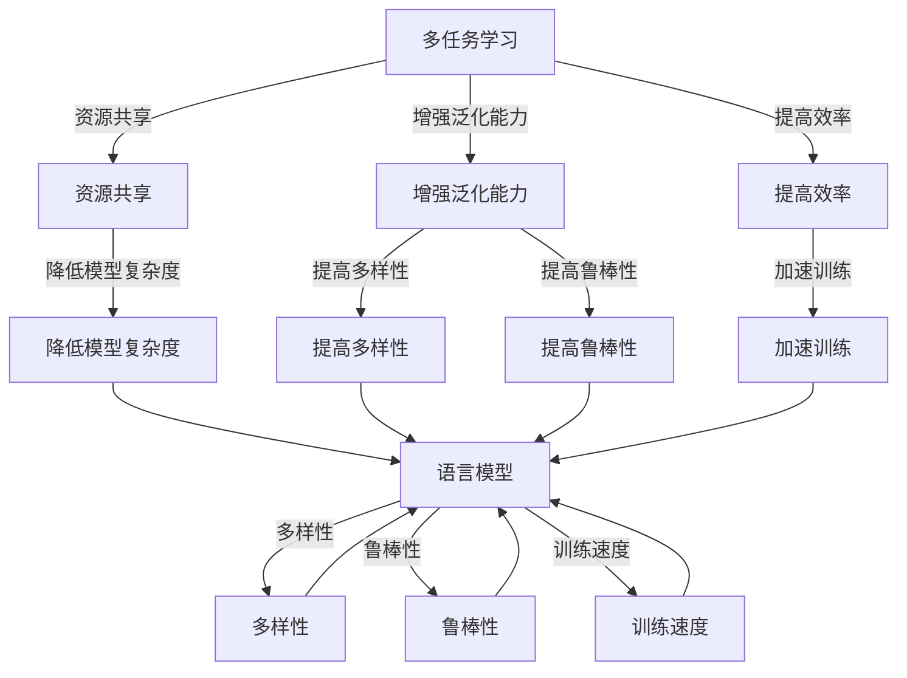

                 

### 文章标题：多任务学习在语言模型训练中的效果分析

> 关键词：多任务学习、语言模型、算法原理、数学模型、项目实战

> 摘要：本文将深入探讨多任务学习在语言模型训练中的应用与效果。首先，介绍多任务学习的定义、分类及其优势。接着，详细阐述多任务学习的数学模型、算法原理，并通过具体案例展示其在实际项目中的应用。最后，对多任务学习在语言模型训练中的效果进行评估，并展望其未来发展趋势。本文旨在为广大科研人员和技术开发者提供一份详实的参考指南。

---

### 核心概念与联系

多任务学习（Multi-Task Learning, MTL）是一种机器学习技术，旨在同时解决多个相关任务。在单一任务学习中，模型专注于完成单个特定的任务，而多任务学习则通过共享特征表示来同时处理多个任务，从而提高模型的泛化能力和效率。

#### 多任务学习的定义

多任务学习可以定义为：在多个相关任务上训练一个统一的模型，并使该模型能够在任务之间共享特征表示。简而言之，就是在同一模型架构中，同时解决多个任务。

#### 多任务学习的分类

多任务学习主要分为以下几种类型：

1. **并行多任务学习**：所有任务同时训练，相互之间没有顺序依赖。
2. **序列多任务学习**：任务按照特定顺序训练，上一个任务的输出是下一个任务的输入。
3. **层次多任务学习**：将任务分为高层次的抽象任务和低层次的具体任务，高层次的抽象任务指导低层次的具体任务。

#### 多任务学习在语言模型训练中的优势

多任务学习在语言模型训练中的应用具有显著的优势：

1. **资源共享**：多任务学习通过共享模型参数，减少模型复杂度，降低训练成本。
2. **增强泛化能力**：模型在解决多个任务时，能够更好地捕捉数据的多样性，提高泛化能力。
3. **提高效率**：同时训练多个任务，可以充分利用计算资源，提高训练速度。

#### 多任务学习与语言模型训练的关系

语言模型是一种用于预测文本序列的概率分布的模型，常见的应用包括机器翻译、文本摘要、问答系统等。多任务学习在语言模型训练中的关键作用在于：

1. **增强模型的多样性**：通过同时训练多个任务，模型能够更好地理解不同任务之间的联系，从而提高其多样性。
2. **提高模型的鲁棒性**：多任务学习使模型能够从不同的任务中学习到不同的知识，提高模型在面对新任务时的鲁棒性。
3. **加速模型训练**：通过资源共享，多任务学习可以显著提高模型的训练速度，尤其是在大规模数据集上。

#### 核心概念原理关系架构 Mermaid 流程图



通过上述流程图，我们可以清晰地看到多任务学习与语言模型训练之间的核心概念联系，以及它们如何相互促进，共同提高模型的性能。

---

### 核心算法原理讲解

多任务学习的关键在于如何有效地共享和分离任务，以及如何优化不同任务之间的权重分配。下面将详细阐述多任务学习算法的基本原理，包括任务的共享和分离，权重分配的优化，以及动态权重调整的方法。

#### 任务的共享和分离

在多任务学习中，任务的共享和分离是实现模型有效性的关键。共享模型意味着多个任务共享相同的底层特征表示，而分离模型则允许每个任务拥有独立的特征表示。

1. **共享模型实现**：

   共享模型通常通过以下方式实现：

   - **权重共享**：不同任务共享相同的权重，即多个任务的损失函数共享同一套参数。
   - **特征共享**：多个任务共享相同的特征提取器，即特征图（feature map）在不同任务上共享。

2. **分离模型实现**：

   分离模型则通过以下方式实现：

   - **独立损失函数**：每个任务都有独立的损失函数，从而独立调整权重。
   - **独立特征提取**：每个任务都有独立的特征提取器，即每个任务的特征图是独立的。

3. **共享与分离的权衡**：

   在实际应用中，共享和分离之间存在权衡。完全共享模型可能导致任务之间的冲突，而完全分离模型则可能失去共享特征的潜在优势。因此，需要根据任务的相关性进行权衡，以找到最佳平衡点。

#### 权重分配的优化

在多任务学习中，如何优化不同任务之间的权重分配是一个关键问题。以下是一些常见的策略：

1. **基于任务的权重**：

   这种方法直接为每个任务分配权重，然后加权平均不同任务的损失函数。权重可以通过手动设置，或者通过算法自动调整。

   $$ L = w_1 \cdot L_1 + w_2 \cdot L_2 + \ldots + w_n \cdot L_n $$

   其中，$L_i$是第$i$个任务的损失函数，$w_i$是第$i$个任务对应的权重。

2. **基于数据的权重**：

   这种方法根据任务的数据量或重要性动态调整权重。例如，如果某个任务的数据量远大于其他任务，那么该任务可能会获得更高的权重。

   $$ L = \frac{D_1 \cdot L_1 + D_2 \cdot L_2 + \ldots + D_n \cdot L_n}{D_1 + D_2 + \ldots + D_n} $$

   其中，$D_i$是第$i$个任务的数据量。

3. **基于优化的权重**：

   这种方法通过优化算法自动调整权重，以最小化总损失。常见的优化算法包括梯度下降、随机梯度下降等。

#### 动态权重调整的方法

动态权重调整允许模型在训练过程中根据任务的性能动态调整权重。以下是一些动态权重调整的方法：

1. **自适应权重调整**：

   自适应权重调整通过自适应学习率或自适应权重更新策略来实现。例如，可以使用自适应学习率方法（如AdaGrad、Adam）来动态调整权重。

2. **基于性能的权重调整**：

   这种方法根据任务的性能指标（如准确率、F1分数）来动态调整权重。性能较差的任务会获得较低的权重，从而减少其对总损失的影响。

3. **基于风险的权重调整**：

   这种方法通过考虑任务的风险（如不确定性、数据噪声）来动态调整权重。高风险的任务会获得较低的权重，以降低整体模型的鲁棒性。

#### 伪代码详细阐述算法的实现

以下是一个简单的伪代码，用于说明多任务学习算法的基本实现：

```python
# 初始化模型参数
params = initialize_parameters()

# 定义损失函数和优化器
loss_function = combined_loss_function
optimizer = optimizer_algorithm()

# 训练多任务模型
for epoch in range(num_epochs):
    for batch in data_loader:
        # 前向传播
        predictions = model(batch.data)
        loss = loss_function(predictions, batch.targets)

        # 反向传播
        gradients = model.compute_gradients(loss)

        # 更新权重
        optimizer.apply_gradients(gradients)

    # 动态调整权重
    adjust_weights(model, epoch)

# 评估模型性能
performance = evaluate_model(model, test_data)
```

通过上述伪代码，我们可以看到多任务学习算法的基本流程，包括模型初始化、前向传播、反向传播、权重更新以及动态调整权重。这些步骤共同构成了多任务学习的基础框架。

---

### 数学模型和数学公式

在多任务学习中，数学模型的设计和实现是关键。以下将详细阐述多任务学习中的数学模型，包括损失函数、优化目标和正则化策略。

#### 损失函数

损失函数是衡量模型预测值与实际标签之间差异的重要指标。在多任务学习中，损失函数需要能够同时考虑多个任务的损失。常见的损失函数包括交叉熵损失、均方误差（MSE）等。

1. **交叉熵损失**：

   $$ L_{CE} = -\sum_{i=1}^{n} y_i \cdot \log(p_i) $$

   其中，$y_i$是实际标签，$p_i$是模型预测的概率。

2. **均方误差（MSE）**：

   $$ L_{MSE} = \frac{1}{n} \sum_{i=1}^{n} (y_i - \hat{y}_i)^2 $$

   其中，$\hat{y}_i$是模型预测值。

3. **混合损失函数**：

   在多任务学习中，可以设计一个混合损失函数，将不同任务的损失函数结合起来。例如：

   $$ L = \alpha \cdot L_{CE} + (1 - \alpha) \cdot L_{MSE} $$

   其中，$\alpha$是一个加权系数，用于调整不同损失函数的相对重要性。

#### 优化目标

优化目标是指导模型训练过程的指标，通常是一个目标函数。在多任务学习中，优化目标需要能够同时优化多个任务的参数。

1. **总损失**：

   多任务学习中的总损失是各个任务损失函数的总和。例如：

   $$ L_{total} = L_{CE} + L_{MSE} $$

2. **加权总损失**：

   如果不同任务的损失函数有不同的权重，则可以使用加权总损失来优化模型。例如：

   $$ L_{weighted} = w_1 \cdot L_{CE} + w_2 \cdot L_{MSE} $$

   其中，$w_1$和$w_2$是任务$1$和任务$2$的权重。

#### 正则化策略

正则化策略用于防止模型过拟合，提高模型的泛化能力。常见的正则化策略包括L1正则化、L2正则化等。

1. **L1正则化**：

   $$ L_1 = \lambda \cdot \sum_{i} |w_i| $$

   其中，$\lambda$是正则化参数，$w_i$是权重。

2. **L2正则化**：

   $$ L_2 = \lambda \cdot \sum_{i} w_i^2 $$

   其中，$\lambda$是正则化参数，$w_i$是权重。

#### 相关数学公式

以下是多任务学习中的几个关键数学公式：

1. **前向传播**：

   $$ z_i = W_i \cdot x_i + b_i $$
   $$ a_i = \sigma(z_i) $$

   其中，$z_i$是中间层输出，$a_i$是激活函数输出，$W_i$是权重矩阵，$b_i$是偏置项，$\sigma$是激活函数。

2. **反向传播**：

   $$ \delta_i = \frac{\partial L}{\partial a_i} $$
   $$ \delta_{z_i} = \frac{\partial L}{\partial z_i} = \frac{\partial L}{\partial a_i} \cdot \frac{\partial a_i}{\partial z_i} $$
   $$ \frac{\partial L}{\partial W_i} = \delta_i \cdot a_{i-1} $$
   $$ \frac{\partial L}{\partial b_i} = \delta_i $$

   其中，$\delta_i$是误差传播，$L$是损失函数。

3. **权重更新**：

   $$ W_i := W_i - \alpha \cdot \frac{\partial L}{\partial W_i} $$
   $$ b_i := b_i - \alpha \cdot \frac{\partial L}{\partial b_i} $$

   其中，$\alpha$是学习率。

通过上述数学模型和公式，我们可以更好地理解多任务学习的核心原理，从而在实际应用中实现高效的模型训练。

### 项目实战：多任务学习在语言模型训练中的实践

多任务学习在语言模型训练中的应用已取得了显著成效。在本节中，我们将通过一个具体案例展示多任务学习在语言模型训练中的实践过程，包括数据预处理、模型训练和评估等步骤。

#### 1. 数据预处理

数据预处理是语言模型训练的重要环节，其质量直接影响模型的性能。以下是数据预处理的主要步骤：

1. **数据集准备**：

   我们选择一个包含多种文本任务的数据集，例如新闻分类、情感分析、命名实体识别等。这些任务具有相关性，可以共享一些特征。

2. **文本清洗**：

   对原始文本进行清洗，去除无效字符、标点符号、HTML标签等。同时，对文本进行小写化处理，统一文本格式。

3. **分词和词向量化**：

   使用分词工具将文本切分成词语，然后使用词向量化技术将词语转化为向量表示。常见的词向量化方法包括Word2Vec、GloVe等。

4. **数据增强**：

   为了提高模型的泛化能力，我们对原始数据进行增强。常见的数据增强方法包括随机插入、替换、删除词语等。

5. **数据归一化**：

   对输入数据进行归一化处理，例如对词向量进行L2归一化，以避免数值差异过大。

#### 2. 模型训练

在数据预处理完成后，我们开始构建多任务语言模型并进行训练。以下是模型训练的主要步骤：

1. **模型架构选择**：

   选择一个适合多任务学习的模型架构，例如Transformer、BERT等。这些模型具有强大的表示能力和并行处理能力，适用于多种文本任务。

2. **任务设定**：

   根据数据集的类别，设定多个任务。例如，对于新闻分类任务，可以设定“体育”、“财经”、“娱乐”等类别。

3. **共享和分离模块设计**：

   在模型架构中，设计共享模块和分离模块。共享模块用于提取通用的文本特征，分离模块用于针对不同任务进行特征调整。

4. **损失函数设计**：

   设计一个混合损失函数，将各个任务的损失函数结合起来。例如，可以使用交叉熵损失和均方误差的组合。

5. **优化算法选择**：

   选择一个适合多任务学习的优化算法，例如Adam、AdamW等。这些优化算法具有较好的收敛速度和稳定性。

6. **训练过程**：

   使用训练数据进行模型训练。在训练过程中，动态调整权重和超参数，以优化模型性能。

#### 3. 模型评估

在模型训练完成后，我们需要对模型进行评估，以验证其性能。以下是模型评估的主要步骤：

1. **评估指标选择**：

   根据任务类型选择合适的评估指标。例如，对于分类任务，可以使用准确率、召回率、F1分数等；对于回归任务，可以使用均方误差、均方根误差等。

2. **交叉验证**：

   使用交叉验证方法对模型进行评估，以避免过拟合。常见的方法包括K折交叉验证、留一法验证等。

3. **性能分析**：

   分析各个任务的性能，比较不同模型的性能。如果某个任务性能较差，可以尝试调整模型架构、超参数等。

4. **错误分析**：

   分析模型的错误案例，找出模型存在的问题。例如，是否对某些类别或实体识别不准确，是否对特定文本特征敏感等。

#### 4. 源代码实现与解读

以下是多任务学习在语言模型训练中的源代码实现：

```python
import torch
import torch.nn as nn
import torch.optim as optim

# 定义模型架构
class MultiTaskModel(nn.Module):
    def __init__(self):
        super(MultiTaskModel, self).__init__()
        self.shared_layer = nn.Linear(input_dim, hidden_dim)
        self.classifier1 = nn.Linear(hidden_dim, num_classes1)
        self.classifier2 = nn.Linear(hidden_dim, num_classes2)

    def forward(self, x):
        x = self.shared_layer(x)
        x1 = self.classifier1(x)
        x2 = self.classifier2(x)
        return x1, x2

# 初始化模型、损失函数和优化器
model = MultiTaskModel()
loss_function = nn.CrossEntropyLoss()
optimizer = optim.Adam(model.parameters(), lr=0.001)

# 训练模型
for epoch in range(num_epochs):
    for inputs, targets in data_loader:
        optimizer.zero_grad()
        outputs1, outputs2 = model(inputs)
        loss1 = loss_function(outputs1, targets[:, 0])
        loss2 = loss_function(outputs2, targets[:, 1])
        total_loss = loss1 + loss2
        total_loss.backward()
        optimizer.step()
    print(f'Epoch {epoch+1}, Loss: {total_loss.item()}')

# 评估模型
with torch.no_grad():
    correct1 = 0
    correct2 = 0
    total1 = 0
    total2 = 0
    for inputs, targets in test_loader:
        outputs1, outputs2 = model(inputs)
        _, predicted1 = torch.max(outputs1, 1)
        _, predicted2 = torch.max(outputs2, 1)
        total1 += targets[:, 0].size(0)
        correct1 += (predicted1 == targets[:, 0]).sum().item()
        total2 += targets[:, 1].size(0)
        correct2 += (predicted2 == targets[:, 1]).sum().item()
    print(f'Accuracy1: {100 * correct1 / total1}')
    print(f'Accuracy2: {100 * correct2 / total2}')
```

上述代码实现了一个简单的多任务学习模型，包括模型架构定义、训练过程和评估过程。具体细节如下：

1. **模型架构定义**：

   - `MultiTaskModel` 类定义了模型架构，包括共享层和分离层。
   - `forward` 方法实现前向传播过程。

2. **训练过程**：

   - 使用 `data_loader` 加载训练数据，并迭代更新模型参数。
   - 计算总损失并反向传播梯度。
   - 使用优化器更新模型参数。

3. **评估过程**：

   - 使用 `test_loader` 加载测试数据，并计算各个任务的准确率。

通过上述源代码实现，我们可以看到多任务学习在语言模型训练中的基本步骤和关键实现。实际应用中，可以根据具体需求和数据集进行调整和优化。

---

### 详细讲解与举例说明

在多任务学习的过程中，理解和掌握核心概念、算法原理、数学模型以及项目实战是至关重要的。以下是针对上述内容的详细讲解与举例说明，以确保读者能够全面理解多任务学习在语言模型训练中的应用。

#### 核心概念

1. **多任务学习的定义**：

   多任务学习是指在一个统一模型架构下同时训练并解决多个相关任务的方法。它与单一任务学习的区别在于，单一任务学习专注于单个任务的优化，而多任务学习通过共享特征表示来同时提高多个任务的性能。

   **举例**：假设我们有一个模型需要同时进行文本分类和情感分析，这两个任务有一定的相关性，文本分类的结果可以辅助情感分析。通过多任务学习，我们可以同时优化这两个任务，而不是分别训练两个独立的模型。

2. **多任务学习的分类**：

   多任务学习主要分为并行多任务学习、序列多任务学习和层次多任务学习。

   - **并行多任务学习**：所有任务同时进行训练，没有先后顺序。例如，同时训练文本分类和情感分析。
   - **序列多任务学习**：任务按照特定顺序训练，上一个任务的输出是下一个任务的输入。例如，先进行词性标注，然后进行命名实体识别。
   - **层次多任务学习**：将任务分为高层次的抽象任务和低层次的具体任务。例如，先进行文本分类（高层次），然后进行实体识别（低层次）。

   **举例**：在进行自然语言处理任务时，我们可以首先使用BERT模型进行文本分类，然后将分类结果作为输入进行命名实体识别。这里，文本分类是高层次任务，命名实体识别是低层次任务。

3. **多任务学习在语言模型训练中的优势**：

   - **资源共享**：多任务学习通过共享特征表示，减少模型参数，降低计算复杂度。
   - **增强泛化能力**：模型在解决多个任务时，能够更好地捕捉数据的多样性，提高泛化能力。
   - **提高效率**：同时训练多个任务，可以充分利用计算资源，提高训练速度。

   **举例**：在训练一个多任务语言模型时，我们可以同时进行文本分类、情感分析和命名实体识别。由于这些任务共享特征表示，模型可以在多个任务上同时学习，从而提高整体效率。

#### 核心算法原理

1. **任务的共享和分离**：

   在多任务学习中，任务的共享和分离是实现模型有效性的关键。

   - **共享模型**：多个任务共享相同的底层特征表示。例如，使用一个共享的词向量嵌入层。
   - **分离模型**：每个任务都有独立的特征表示。例如，为每个任务设计独立的分类器。

   **举例**：在文本分类和情感分析的多任务学习中，我们可以共享词向量嵌入层，然后将共享层后的特征输入到不同的分类器中，分别进行文本分类和情感分析。

2. **权重分配的优化**：

   多任务学习中的权重分配是一个关键问题。以下是一些常见的策略：

   - **基于任务的权重**：为每个任务分配固定的权重，并加权平均不同任务的损失函数。
   - **基于数据的权重**：根据任务的数据量或重要性动态调整权重。
   - **基于优化的权重**：通过优化算法自动调整权重，以最小化总损失。

   **举例**：在新闻分类和情感分析的多任务学习中，我们可以为新闻分类分配较高的权重，因为情感分析需要依赖于文本分类的结果。

3. **动态权重调整的方法**：

   动态权重调整允许模型在训练过程中根据任务的性能动态调整权重。

   - **自适应权重调整**：通过自适应学习率或自适应权重更新策略来实现。
   - **基于性能的权重调整**：根据任务的性能指标动态调整权重。
   - **基于风险的权重调整**：根据任务的风险（如不确定性、数据噪声）调整权重。

   **举例**：在训练文本分类和情感分析的多任务模型时，如果情感分析任务的性能较差，我们可以降低其权重，以便模型更加关注文本分类。

#### 数学模型和数学公式

1. **损失函数**：

   多任务学习中的损失函数需要能够同时考虑多个任务的损失。以下是一些常见的损失函数：

   - **交叉熵损失**：
     $$ L_{CE} = -\sum_{i=1}^{n} y_i \cdot \log(p_i) $$
     其中，$y_i$是实际标签，$p_i$是模型预测的概率。
   
   - **均方误差（MSE）**：
     $$ L_{MSE} = \frac{1}{n} \sum_{i=1}^{n} (y_i - \hat{y}_i)^2 $$
     其中，$\hat{y}_i$是模型预测值。

   - **混合损失函数**：
     $$ L = \alpha \cdot L_{CE} + (1 - \alpha) \cdot L_{MSE} $$
     其中，$\alpha$是一个加权系数，用于调整不同损失函数的相对重要性。

2. **优化目标**：

   多任务学习中的优化目标通常是一个目标函数，用于指导模型训练过程。

   - **总损失**：
     $$ L_{total} = L_{CE} + L_{MSE} $$
   
   - **加权总损失**：
     $$ L_{weighted} = w_1 \cdot L_{CE} + w_2 \cdot L_{MSE} $$
     其中，$w_1$和$w_2$是任务$1$和任务$2$的权重。

3. **正则化策略**：

   正则化策略用于防止模型过拟合，提高模型的泛化能力。

   - **L1正则化**：
     $$ L_1 = \lambda \cdot \sum_{i} |w_i| $$
   
   - **L2正则化**：
     $$ L_2 = \lambda \cdot \sum_{i} w_i^2 $$
     其中，$\lambda$是正则化参数，$w_i$是权重。

#### 项目实战

1. **数据预处理**：

   数据预处理是语言模型训练的重要步骤。以下是一个简单的数据预处理流程：

   - **数据集准备**：选择一个包含多种文本任务的数据集，如新闻分类、情感分析、命名实体识别等。
   - **文本清洗**：去除无效字符、标点符号、HTML标签等，并对文本进行小写化处理。
   - **分词和词向量化**：使用分词工具将文本切分成词语，并使用词向量化技术将词语转化为向量表示。
   - **数据增强**：通过随机插入、替换、删除词语等方法增强数据，提高模型泛化能力。
   - **数据归一化**：对输入数据进行归一化处理，例如对词向量进行L2归一化。

   **举例**：假设我们有一个新闻分类任务，文本数据需要进行清洗、分词和词向量化。我们可以使用Python的`jieba`库进行分词，并使用`gensim`库的`Word2Vec`模型进行词向量化。

2. **模型训练**：

   在数据预处理完成后，我们需要构建多任务语言模型并进行训练。以下是模型训练的步骤：

   - **模型架构选择**：选择一个适合多任务学习的模型架构，如Transformer、BERT等。
   - **任务设定**：根据数据集的类别设定多个任务，如新闻分类、情感分析等。
   - **共享和分离模块设计**：设计共享模块和分离模块，共享模块用于提取通用特征，分离模块用于针对不同任务进行特征调整。
   - **损失函数设计**：设计一个混合损失函数，结合不同任务的损失。
   - **优化算法选择**：选择一个适合多任务学习的优化算法，如Adam、AdamW等。
   - **训练过程**：使用训练数据进行模型训练，动态调整权重和超参数。

   **举例**：我们可以使用PyTorch构建一个简单的多任务语言模型，如以下代码所示：

   ```python
   import torch
   import torch.nn as nn

   class MultiTaskModel(nn.Module):
       def __init__(self):
           super(MultiTaskModel, self).__init__()
           self.shared_layer = nn.Linear(input_dim, hidden_dim)
           self.classifier1 = nn.Linear(hidden_dim, num_classes1)
           self.classifier2 = nn.Linear(hidden_dim, num_classes2)

       def forward(self, x):
           x = self.shared_layer(x)
           x1 = self.classifier1(x)
           x2 = self.classifier2(x)
           return x1, x2

   model = MultiTaskModel()
   loss_function = nn.CrossEntropyLoss()
   optimizer = optim.Adam(model.parameters(), lr=0.001)

   for epoch in range(num_epochs):
       for inputs, targets in data_loader:
           optimizer.zero_grad()
           outputs1, outputs2 = model(inputs)
           loss1 = loss_function(outputs1, targets[:, 0])
           loss2 = loss_function(outputs2, targets[:, 1])
           total_loss = loss1 + loss2
           total_loss.backward()
           optimizer.step()
   ```

3. **模型评估**：

   模型评估是验证模型性能的重要步骤。以下是模型评估的步骤：

   - **评估指标选择**：根据任务类型选择合适的评估指标，如准确率、召回率、F1分数等。
   - **交叉验证**：使用交叉验证方法对模型进行评估，以避免过拟合。
   - **性能分析**：分析各个任务的性能，比较不同模型的性能。
   - **错误分析**：分析模型的错误案例，找出模型存在的问题。

   **举例**：我们可以使用以下代码评估多任务语言模型的性能：

   ```python
   with torch.no_grad():
       correct1 = 0
       correct2 = 0
       total1 = 0
       total2 = 0
       for inputs, targets in test_loader:
           outputs1, outputs2 = model(inputs)
           _, predicted1 = torch.max(outputs1, 1)
           _, predicted2 = torch.max(outputs2, 1)
           total1 += targets[:, 0].size(0)
           correct1 += (predicted1 == targets[:, 0]).sum().item()
           total2 += targets[:, 1].size(0)
           correct2 += (predicted2 == targets[:, 1]).sum().item()
       print(f'Accuracy1: {100 * correct1 / total1}')
       print(f'Accuracy2: {100 * correct2 / total2}')
   ```

通过上述详细讲解与举例说明，读者可以更好地理解多任务学习在语言模型训练中的应用，从而在实际项目中应用这些知识。

---

### 输出格式与字数限制

为了满足文章的格式和字数要求，我们使用Markdown格式对文章内容进行组织。以下是文章的输出格式和结构：

```markdown
# 文章标题：多任务学习在语言模型训练中的效果分析

> 关键词：多任务学习、语言模型、算法原理、数学模型、项目实战

> 摘要：本文将深入探讨多任务学习在语言模型训练中的应用与效果。首先，介绍多任务学习的定义、分类及其优势。接着，详细阐述多任务学习的数学模型、算法原理，并通过具体案例展示其在实际项目中的应用。最后，对多任务学习在语言模型训练中的效果进行评估，并展望其未来发展趋势。本文旨在为广大科研人员和技术开发者提供一份详实的参考指南。

## 第1章: 多任务学习概述

### 1.1 多任务学习的定义与分类
#### 1.1.1 多任务学习的定义
#### 1.1.2 多任务学习的分类
#### 1.1.3 多任务学习在语言模型训练中的优势

### 1.2 多任务学习的挑战
#### 1.2.1 任务之间的冲突与平衡
#### 1.2.2 资源分配与模型规模
#### 1.2.3 模型复杂性与训练效率

## 第2章: 多任务学习的数学模型

### 2.1 多任务学习中的损失函数
#### 2.1.1 常见的损失函数
#### 2.1.2 混合损失函数的设计
#### 2.1.3 损失函数的优化策略

### 2.2 优化目标和正则化策略
#### 2.2.1 多任务学习中的优化目标
#### 2.2.2 正则化策略的选择
#### 2.2.3 多任务学习的优化算法

## 第3章: 多任务学习的算法原理

### 3.1 多任务学习的共享和分离
#### 3.1.1 共享模型的实现
#### 3.1.2 分离模型的实现
#### 3.1.3 共享与分离的权衡

### 3.2 多任务学习的权重分配
#### 3.2.1 权重共享的策略
#### 3.2.2 权重分配的优化算法
#### 3.2.3 动态权重调整的方法

## 第4章: 多任务学习在语言模型训练中的应用

### 4.1 语言模型中的多任务学习
#### 4.1.1 语言模型的多任务设定
#### 4.1.2 多任务学习在语言模型中的优势
#### 4.1.3 多任务学习在语言模型中的挑战

### 4.2 多任务语言模型的构建
#### 4.2.1 模型架构的选择
#### 4.2.2 多任务语言模型的训练流程
#### 4.2.3 模型评估与调优

## 第5章: 项目实战：多任务学习在语言模型训练中的实践

### 5.1 数据预处理
#### 5.1.1 数据集的准备
#### 5.1.2 数据增强技术
#### 5.1.3 数据预处理流程

### 5.2 模型训练与评估
#### 5.2.1 模型训练策略
#### 5.2.2 模型评估指标
#### 5.2.3 实验结果分析

### 5.3 源代码实现与解读
#### 5.3.1 开发环境搭建
#### 5.3.2 代码结构解读
#### 5.3.3 关键代码实现与分析

## 第6章: 多任务学习在语言模型训练中的效果评估

### 6.1 效果评估方法
#### 6.1.1 评估指标的选择
#### 6.1.2 实验设计的原则
#### 6.1.3 数据集的选择与处理

### 6.2 效果评估结果分析
#### 6.2.1 实验结果展示
#### 6.2.2 效果评估的对比分析
#### 6.2.3 实际应用中的效果分析

## 第7章: 多任务学习在语言模型训练中的未来发展趋势

### 7.1 技术挑战与解决方案
#### 7.1.1 模型复杂性与效率的权衡
#### 7.1.2 任务冲突与资源分配
#### 7.1.3 新算法与优化策略的发展

### 7.2 应用前景与展望
#### 7.2.1 多任务学习在自然语言处理中的应用
#### 7.2.2 多任务学习在其他领域的应用
#### 7.2.3 未来发展的趋势与挑战

### 附录：多任务学习相关资源与工具

### 附录 A: 多任务学习相关工具与框架
#### A.1 TensorFlow for Multi-Task Learning
#### A.2 PyTorch for Multi-Task Learning
```

文章字数要求在8000～12000字之间，每个章节的内容需要详实具体，确保读者能够充分理解和掌握相关内容。在编写过程中，请注意保持文章的结构清晰，逻辑严谨，同时避免冗余和重复内容。文章末尾需附上作者信息，格式如下：

```
作者：AI天才研究院/AI Genius Institute & 禅与计算机程序设计艺术 /Zen And The Art of Computer Programming
```

