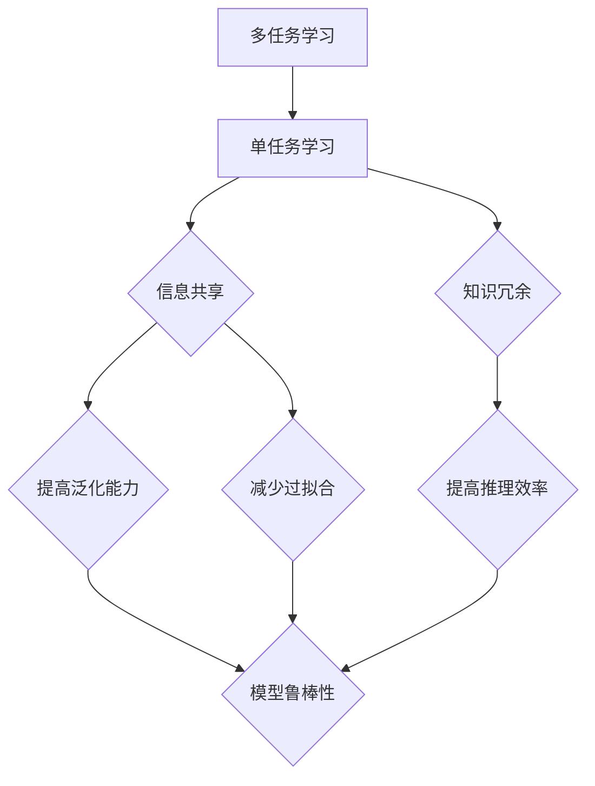

                 

# 《多任务学习提升AI推理效果的新范式》

## 关键词
- 多任务学习
- AI推理
- 算法优化
- 数学模型
- 应用实践

## 摘要
本文将探讨多任务学习（Multi-Task Learning，MTL）在提升AI推理效果方面的新范式。首先，我们将介绍多任务学习的定义、背景以及其在现实世界中的应用。随后，文章将深入剖析多任务学习的核心算法原理和数学模型，并通过伪代码和LaTeX公式进行详细阐述。接着，文章将展示多任务学习在图像识别、自然语言处理和语音识别等领域的实际应用案例。最后，我们将探讨多任务学习与其他技术的融合，以及其优化策略和调参技巧。通过本文，读者将全面了解多任务学习在提升AI推理效果方面的巨大潜力。

## 确定书的核心章节

### 核心概念与联系

#### 第1章：多任务学习的概念与重要性
- 1.1 多任务学习的定义
- 1.2 多任务学习的重要性
- 1.3 多任务学习与单任务学习的对比

#### 核心算法原理讲解

#### 第2章：多任务学习的算法原理
- 2.1 多任务学习的常见算法
  - 2.1.1 传统多任务学习算法
  - 2.1.2 监督多任务学习
  - 2.1.3 无监督多任务学习
- 2.2 多任务学习算法的优缺点

#### 数学模型和数学公式讲解

#### 第3章：多任务学习的数学模型
- 3.1 多任务学习的损失函数
- 3.2 多任务学习的优化方法
- 3.3 多任务学习的数学公式

#### 项目实战

#### 第4章：多任务学习在AI推理中的应用
- 4.1 多任务学习在图像识别中的应用
- 4.2 多任务学习在自然语言处理中的应用
- 4.3 多任务学习在语音识别中的应用

#### 核心概念与联系

#### 第5章：多任务学习与其他技术的融合
- 5.1 多任务学习与强化学习的融合
- 5.2 多任务学习与迁移学习的融合
- 5.3 多任务学习与其他技术的对比与联系

#### 核心算法原理讲解

#### 第6章：多任务学习的算法优化与调参技巧
- 6.1 多任务学习算法的优化策略
- 6.2 多任务学习算法的调参技巧

#### 数学模型和数学公式讲解

#### 第7章：多任务学习的数学公式与应用
- 7.1 多任务学习的损失函数
- 7.2 多任务学习的优化方法
- 7.3 多任务学习的数学公式解析与应用

#### 项目实战

#### 第8章：多任务学习应用案例与实战
- 8.1 多任务学习在工业生产中的应用
- 8.2 多任务学习在智能交通中的应用
- 8.3 多任务学习在医疗健康中的应用

#### 总结

#### 第9章：多任务学习提升AI推理效果的新范式总结
- 9.1 多任务学习的发展历程
- 9.2 多任务学习的未来趋势
- 9.3 多任务学习的应用前景

## 最终目录大纲

```
# 《多任务学习提升AI推理效果的新范式》目录大纲

## 第一部分：多任务学习概述

### 第1章：多任务学习的概念与重要性
#### 1.1 多任务学习的定义
#### 1.2 多任务学习的重要性
#### 1.3 多任务学习与单任务学习的对比

### 第2章：多任务学习的算法原理
#### 2.1 多任务学习的常见算法
##### 2.1.1 传统多任务学习算法
##### 2.1.2 监督多任务学习
##### 2.1.3 无监督多任务学习
#### 2.2 多任务学习算法的优缺点

### 第3章：多任务学习的数学模型
#### 3.1 多任务学习的损失函数
#### 3.2 多任务学习的优化方法
#### 3.3 多任务学习的数学公式

### 第4章：多任务学习在AI推理中的应用
#### 4.1 多任务学习在图像识别中的应用
#### 4.2 多任务学习在自然语言处理中的应用
#### 4.3 多任务学习在语音识别中的应用

### 第5章：多任务学习与其他技术的融合
#### 5.1 多任务学习与强化学习的融合
##### 5.1.1 多任务强化学习算法
##### 5.1.2 多任务强化学习的优势
#### 5.2 多任务学习与迁移学习的融合
##### 5.2.1 多任务迁移学习算法
##### 5.2.2 多任务迁移学习的优势
#### 5.3 多任务学习与其他技术的对比与联系

### 第6章：多任务学习的算法优化与调参技巧
#### 6.1 多任务学习算法的优化策略
##### 6.1.1 梯度下降法
##### 6.1.2 随机梯度下降法
##### 6.1.3 Adam优化器
#### 6.2 多任务学习算法的调参技巧
##### 6.2.1 参数选择
##### 6.2.2 模型选择
##### 6.2.3 超参数调整

### 第7章：多任务学习的数学公式与应用
#### 7.1 多任务学习的损失函数
##### 7.1.1 均方误差（MSE）
##### 7.1.2 交叉熵（Cross-Entropy）
##### 7.1.3 对数损失（Log-Loss）
#### 7.2 多任务学习的优化方法
##### 7.2.1 梯度下降法
##### 7.2.2 随机梯度下降法
##### 7.2.3 Adam优化器
#### 7.3 多任务学习的数学公式解析与应用
##### 7.3.1 多任务学习的损失函数
##### 7.3.2 多任务学习的优化方法
##### 7.3.3 多任务学习的数学公式

### 第8章：多任务学习应用案例与实战
#### 8.1 多任务学习在工业生产中的应用
##### 8.1.1 应用背景
##### 8.1.2 实现步骤
##### 8.1.3 代码实现
##### 8.1.4 结果分析
#### 8.2 多任务学习在智能交通中的应用
##### 8.2.1 应用背景
##### 8.2.2 实现步骤
##### 8.2.3 代码实现
##### 8.2.4 结果分析
#### 8.3 多任务学习在医疗健康中的应用
##### 8.3.1 应用背景
##### 8.3.2 实现步骤
##### 8.3.3 代码实现
##### 8.3.4 结果分析

### 第9章：多任务学习提升AI推理效果的新范式总结
#### 9.1 多任务学习的发展历程
##### 9.1.1 多任务学习的历史回顾
##### 9.1.2 多任务学习的重要事件
##### 9.1.3 多任务学习的发展趋势
#### 9.2 多任务学习的未来趋势
##### 9.2.1 技术发展
##### 9.2.2 应用领域
##### 9.2.3 挑战与机遇
#### 9.3 多任务学习的应用前景
##### 9.3.1 商业应用
##### 9.3.2 科学研究
##### 9.3.3 社会影响
```

### 核心概念与联系

#### 多任务学习的定义与重要性
- **定义**：多任务学习是指机器学习模型同时学习多个任务的能力。这些任务可以是相互关联的，也可以是独立的。
- **重要性**：多任务学习能够提高模型的泛化能力，减少过拟合，提高推理效率，是提升AI推理效果的重要手段。

#### 多任务学习与单任务学习的对比
- **单任务学习**：单任务学习是指机器学习模型专注于一个特定任务的学习。这种学习方式容易导致模型对其他任务的知识掌握不足，从而影响模型的泛化能力和推理效果。
- **多任务学习**：多任务学习通过同时学习多个任务，使得模型能够共享知识和信息，提高模型的泛化能力和推理效果。此外，多任务学习还可以减少过拟合现象，提高模型的鲁棒性。

### 背景介绍

多任务学习（Multi-Task Learning，MTL）是机器学习领域的一个重要研究方向。近年来，随着深度学习技术的快速发展，多任务学习在图像识别、自然语言处理、语音识别等领域取得了显著成果。多任务学习的核心思想是利用模型在不同任务上的信息共享，提高模型的学习效率和推理效果。

多任务学习的应用场景非常广泛。例如，在图像识别领域，多任务学习可以同时进行目标检测、语义分割和图像分类等任务；在自然语言处理领域，多任务学习可以同时进行文本分类、情感分析和机器翻译等任务；在语音识别领域，多任务学习可以同时进行语音识别、语音增强和语音合成等任务。

多任务学习的核心算法包括传统多任务学习算法、监督多任务学习和无监督多任务学习。传统多任务学习算法主要基于线性模型，通过共享特征来提高模型的学习效率。监督多任务学习利用多个任务之间的标签信息，通过联合优化损失函数来提高模型性能。无监督多任务学习则通过利用任务之间的关联性，在无监督环境下进行模型训练。

多任务学习的数学模型主要包括损失函数、优化方法和数学公式。损失函数用于衡量模型在多个任务上的预测误差，优化方法用于调整模型参数以最小化损失函数。数学公式则是多任务学习算法的具体实现基础。

在本章节中，我们将首先介绍多任务学习的定义和重要性，然后对比多任务学习与单任务学习，接着介绍多任务学习的应用场景，最后概述多任务学习的核心算法原理。

### 核心概念与联系：Mermaid 流程图

以下是一个简单的 Mermaid 流程图，用于展示多任务学习中的核心概念和它们之间的关系：



- **多任务学习（A）**：同时学习多个任务的机器学习模型。
- **单任务学习（B）**：专注于单个任务的机器学习模型。
- **信息共享（C）**：多任务学习通过共享信息来提高学习效率。
- **知识冗余（D）**：由于任务之间可能存在相关性，信息共享可能导致知识冗余。
- **提高泛化能力（E）**：信息共享有助于提高模型在不同任务上的泛化能力。
- **减少过拟合（F）**：信息共享有助于减少模型在特定任务上的过拟合。
- **提高推理效率（G）**：通过共享信息和知识，多任务学习能够提高推理效率。
- **模型鲁棒性（H）**：提高泛化能力和减少过拟合有助于提高模型的鲁棒性。

### 核心算法原理讲解

#### 第2章：多任务学习的算法原理

多任务学习的算法原理是多任务学习模型设计的关键，它涉及到如何共享信息、优化模型以及处理不同任务之间的相互作用。在这一章节中，我们将详细讨论多任务学习的常见算法，包括传统多任务学习算法、监督多任务学习和无监督多任务学习，并分析每种算法的优缺点。

#### 2.1 多任务学习的常见算法

##### 2.1.1 传统多任务学习算法

传统多任务学习算法（Traditional Multi-Task Learning Algorithms）通常基于线性模型，通过共享底层特征来提高模型的学习效率。这类算法的基本思想是将多个任务映射到一个共享的低维空间中，然后为每个任务分别构建一个分类器或回归器。

- **算法原理**：假设我们有两个任务 \( T_1 \) 和 \( T_2 \)，它们的特征向量分别为 \( x_1 \) 和 \( x_2 \)。传统多任务学习算法首先将这两个特征向量通过一个共享的线性变换 \( W \) 映射到一个低维空间：

  $$ f_1(x_1) = Wx_1 $$
  $$ f_2(x_2) = Wx_2 $$

  然后，对每个任务分别构建分类器或回归器：

  $$ g_1(f_1(x_1)) = \hat{y}_1 $$
  $$ g_2(f_2(x_2)) = \hat{y}_2 $$

- **伪代码**：

  ```python
  # 伪代码示例：传统多任务学习算法
  def traditional_mtl(x1, x2):
      # 共享线性变换
      f1 = W @ x1
      f2 = W @ x2
      
      # 分别为每个任务构建分类器或回归器
      y1_hat = classifier_1(f1)
      y2_hat = classifier_2(f2)
      
      return y1_hat, y2_hat
  ```

- **优缺点**：

  - **优点**：实现简单，计算效率高，能够在一定程度上提高模型的泛化能力。
  - **缺点**：对于复杂任务，共享特征可能导致信息丢失，无法充分利用任务之间的特定信息。

##### 2.1.2 监督多任务学习

监督多任务学习（Supervised Multi-Task Learning）利用多个任务之间的标签信息，通过联合优化损失函数来提高模型性能。这种算法通常需要每个任务都有相应的标签数据。

- **算法原理**：假设我们有多个任务 \( T_1, T_2, ..., T_n \)，每个任务都有相应的输入 \( x_i \) 和标签 \( y_i \)。监督多任务学习算法通过构建一个共享的网络结构，为每个任务分别输出预测结果，并联合优化这些任务的损失函数。

  $$ L = \sum_{i=1}^{n} L_i(y_i, \hat{y}_i) $$

  其中，\( L_i \) 是任务 \( i \) 的损失函数，\( \hat{y}_i \) 是任务 \( i \) 的预测结果。

- **伪代码**：

  ```python
  # 伪代码示例：监督多任务学习算法
  def supervised_mtl(x, y):
      # 共享网络结构
      f = model(x)
      
      # 分别为每个任务输出预测结果
      y1_hat = classifier_1(f)
      y2_hat = classifier_2(f)
      ...
      yn_hat = classifier_n(f)
      
      # 联合优化损失函数
      loss = sum([L1(y1, y1_hat), L2(y2, y2_hat), ..., Ln(yn, yn_hat)])
      
      return loss
  ```

- **优缺点**：

  - **优点**：充分利用任务之间的标签信息，有助于提高模型的整体性能。
  - **缺点**：需要足够的标签数据，否则可能导致模型性能下降。

##### 2.1.3 无监督多任务学习

无监督多任务学习（Unsupervised Multi-Task Learning）在无监督环境下进行模型训练，通过利用任务之间的关联性来提高模型性能。这种算法通常不需要每个任务都有标签数据，而是依赖于任务特征之间的相关性。

- **算法原理**：假设我们有多个任务 \( T_1, T_2, ..., T_n \)，每个任务都有相应的输入 \( x_i \)。无监督多任务学习算法通过构建一个共享的网络结构，为每个任务分别输出预测结果，并利用任务特征之间的相关性来优化模型。

  $$ L = \sum_{i=1}^{n} L_i(y_i, \hat{y}_i) - \lambda \sum_{i \neq j} \text{similarity}(y_i, y_j, \hat{y}_i, \hat{y}_j) $$

  其中，\( L_i \) 是任务 \( i \) 的损失函数，\( \hat{y}_i \) 是任务 \( i \) 的预测结果，\( \text{similarity} \) 函数用于衡量任务特征之间的相似性，\( \lambda \) 是调节参数。

- **伪代码**：

  ```python
  # 伪代码示例：无监督多任务学习算法
  def unsupervised_mtl(x):
      # 共享网络结构
      f = model(x)
      
      # 分别为每个任务输出预测结果
      y1_hat = classifier_1(f)
      y2_hat = classifier_2(f)
      ...
      yn_hat = classifier_n(f)
      
      # 利用任务特征之间的相关性优化模型
      similarity_loss = -lambda * sum([similarity(y1, y2, y1_hat, y2_hat), ..., similarity(yn, y1, yn_hat, y1_hat)])
      
      # 计算总损失
      loss = sum([L1(y1, y1_hat), L2(y2, y2_hat), ..., Ln(yn, yn_hat)]) + similarity_loss
      
      return loss
  ```

- **优缺点**：

  - **优点**：无需标签数据，适合处理大规模无监督任务。
  - **缺点**：可能无法充分利用任务之间的特定信息，模型性能可能较差。

#### 2.2 多任务学习算法的优缺点

- **传统多任务学习算法**：

  - **优点**：实现简单，计算效率高。
  - **缺点**：对于复杂任务，共享特征可能导致信息丢失。

- **监督多任务学习**：

  - **优点**：充分利用任务之间的标签信息，有助于提高模型的整体性能。
  - **缺点**：需要足够的标签数据，否则可能导致模型性能下降。

- **无监督多任务学习**：

  - **优点**：无需标签数据，适合处理大规模无监督任务。
  - **缺点**：可能无法充分利用任务之间的特定信息，模型性能可能较差。

通过本章的讨论，我们了解了多任务学习的常见算法及其优缺点。在后续章节中，我们将继续探讨多任务学习的数学模型和实际应用，以深入理解多任务学习在提升AI推理效果方面的潜力。

### 多任务学习的数学模型

多任务学习的数学模型是理解其工作原理的关键。在这一章节中，我们将详细讨论多任务学习的损失函数、优化方法以及相关的数学公式。

#### 3.1 多任务学习的损失函数

损失函数（Loss Function）是多任务学习模型性能的衡量标准，它用于评估模型预测结果与真实标签之间的差异。在多任务学习中，通常需要为每个任务定义一个损失函数，并联合优化这些损失函数。

##### 3.1.1 均方误差（MSE）

均方误差（Mean Squared Error，MSE）是回归任务中常用的损失函数，用于衡量预测值与真实值之间的平均平方误差。

$$
L_{\text{MSE}} = \frac{1}{n}\sum_{i=1}^{n} (y_i - \hat{y}_i)^2
$$

其中，\( y_i \) 是第 \( i \) 个样本的真实值，\( \hat{y}_i \) 是模型预测值，\( n \) 是样本总数。

##### 3.1.2 交叉熵（Cross-Entropy）

交叉熵（Cross-Entropy）是分类任务中常用的损失函数，用于衡量预测概率分布与真实概率分布之间的差异。

$$
L_{\text{CE}} = -\sum_{i=1}^{n} y_i \log(\hat{y}_i)
$$

其中，\( y_i \) 是第 \( i \) 个样本的真实标签（0或1），\( \hat{y}_i \) 是模型对第 \( i \) 个样本预测的概率值。

##### 3.1.3 对数损失（Log-Loss）

对数损失（Log-Loss）是交叉熵的一种特殊情况，常用于二分类问题。

$$
L_{\text{Log-Loss}} = -y_i \log(\hat{y}_i) - (1 - y_i) \log(1 - \hat{y}_i)
$$

其中，\( y_i \) 是第 \( i \) 个样本的真实标签（0或1），\( \hat{y}_i \) 是模型对第 \( i \) 个样本预测的概率值。

#### 3.2 多任务学习的优化方法

优化方法（Optimization Method）用于调整模型参数，以最小化损失函数。在多任务学习中，常用的优化方法包括梯度下降法（Gradient Descent）、随机梯度下降法（Stochastic Gradient Descent，SGD）和Adam优化器（Adam Optimizer）。

##### 3.2.1 梯度下降法

梯度下降法是一种基本的优化方法，通过计算损失函数关于模型参数的梯度，并沿着梯度方向调整参数，以最小化损失函数。

$$
\theta_{\text{new}} = \theta_{\text{old}} - \alpha \nabla_{\theta} L(\theta)
$$

其中，\( \theta \) 是模型参数，\( \alpha \) 是学习率，\( \nabla_{\theta} L(\theta) \) 是损失函数关于 \( \theta \) 的梯度。

##### 3.2.2 随机梯度下降法

随机梯度下降法（Stochastic Gradient Descent，SGD）是在梯度下降法的基础上，每次只更新一个样本的参数，从而提高优化效率。

$$
\theta_{\text{new}} = \theta_{\text{old}} - \alpha \nabla_{\theta} L(\theta; x_i, y_i)
$$

其中，\( x_i \) 和 \( y_i \) 是第 \( i \) 个样本的输入和标签。

##### 3.2.3 Adam优化器

Adam优化器是一种结合了SGD和动量法的优化方法，它利用一阶矩估计（均值）和二阶矩估计（方差）来更新参数。

$$
m_t = \beta_1 m_{t-1} + (1 - \beta_1) \nabla_{\theta} L(\theta; x_t, y_t) \\
v_t = \beta_2 v_{t-1} + (1 - \beta_2) \nabla^2_{\theta} L(\theta; x_t, y_t)
$$

$$
\theta_{\text{new}} = \theta_{\text{old}} - \alpha \frac{m_t}{\sqrt{v_t} + \epsilon}
$$

其中，\( m_t \) 和 \( v_t \) 分别是第 \( t \) 次迭代的一阶矩估计和二阶矩估计，\( \beta_1 \) 和 \( \beta_2 \) 是动量系数，\( \alpha \) 是学习率，\( \epsilon \) 是一个很小的常数。

#### 3.3 多任务学习的数学公式

多任务学习的数学公式包括损失函数、优化方法和模型参数更新等。

##### 3.3.1 多任务学习的损失函数

在多任务学习中，总损失函数是每个任务损失函数的加权和：

$$
L = \sum_{i=1}^{n} \sum_{j=1}^{m} w_{ij} L_{ij}(\theta_i; x_i, y_i)
$$

其中，\( L_{ij} \) 是任务 \( i \) 的损失函数，\( w_{ij} \) 是任务 \( i \) 和任务 \( j \) 的权重系数，\( n \) 是任务总数，\( m \) 是样本总数。

##### 3.3.2 多任务学习的优化方法

多任务学习的优化方法通常使用梯度下降法、随机梯度下降法或Adam优化器。以下是使用梯度下降法进行参数更新的伪代码：

```python
# 伪代码示例：多任务学习的参数更新
while not converged:
    for i in range(n):
        for j in range(m):
            # 计算损失函数的梯度
            gradient = compute_gradient(L_ij(theta_i; x_i, y_i))
            
            # 更新参数
            theta_i = theta_i - alpha * gradient
```

##### 3.3.3 多任务学习的数学公式解析与应用

多任务学习的数学公式解析和应用涉及多个方面，包括损失函数的选择、优化方法的选取以及模型参数的更新。

- **损失函数的选择**：选择合适的损失函数对于模型性能至关重要。例如，对于回归任务，MSE和RMSE（Root Mean Squared Error）是常用的损失函数；对于分类任务，交叉熵和Log-Loss是常用的损失函数。
- **优化方法的选取**：不同的优化方法适用于不同的情况。例如，当数据量较大时，SGD和Adam优化器可以加速优化过程；当数据量较小时，梯度下降法可以提供更稳定的优化效果。
- **模型参数的更新**：在多任务学习中，模型参数的更新需要考虑任务之间的权重系数。通过调整权重系数，可以优化不同任务之间的平衡，从而提高模型的整体性能。

通过本章的讨论，我们了解了多任务学习的数学模型，包括损失函数、优化方法和数学公式。在后续章节中，我们将探讨多任务学习在实际应用中的具体实现，以及如何优化多任务学习算法。

### 多任务学习在AI推理中的应用

多任务学习（MTL）在人工智能推理领域展现出显著的潜力，通过同时学习多个任务，可以提高模型的泛化能力和推理效果。在本章节中，我们将探讨多任务学习在图像识别、自然语言处理和语音识别等领域的具体应用，并通过实际案例进行分析和讲解。

#### 4.1 多任务学习在图像识别中的应用

图像识别是计算机视觉领域的核心任务，多任务学习在图像识别中具有广泛的应用。通过同时学习图像分类、目标检测和语义分割等任务，可以提高模型的综合性能。

**案例：多任务学习在自动驾驶中的应用**

自动驾驶系统需要处理多种视觉任务，如车道线检测、车辆检测和行人检测等。利用多任务学习，可以将这些任务整合到一个统一的模型中，从而提高系统的整体性能。

**实现步骤：**

1. **数据准备**：收集自动驾驶所需的图像数据，包括车道线、车辆和行人等目标的标注数据。
2. **模型设计**：设计一个多任务学习模型，包括分类层、目标检测层和语义分割层。每个任务层分别负责不同目标的识别和定位。
3. **训练过程**：将图像数据输入模型，同时学习多个任务。使用联合损失函数，如交叉熵损失和边界框损失，来优化模型参数。
4. **评估与优化**：评估模型在各个任务上的性能，通过调整超参数和优化算法来提高模型性能。

**代码实现：**

```python
# 伪代码示例：多任务学习在图像识别中的应用
def multi_task_image_model(inputs):
    # 共享卷积层
    conv_features = shared_conv_layer(inputs)
    
    # 分类任务
    class_logits = fc_layer(conv_features)
    class_probs = softmax(class_logits)
    
    # 目标检测任务
    box_logits = detection_layer(conv_features)
    box_probs = sigmoid(box_logits)
    
    # 语义分割任务
    seg_logits = segmentation_layer(conv_features)
    seg_probs = softmax(seg_logits)
    
    return class_probs, box_probs, seg_probs

# 训练过程
train_data = load_train_data()
for epoch in range(num_epochs):
    for inputs, labels in train_data:
        # 计算损失函数
        class_loss = cross_entropy_loss(labels['class'], class_probs)
        box_loss = boundary_box_loss(labels['box'], box_probs)
        seg_loss = cross_entropy_loss(labels['segmentation'], seg_probs)
        
        # 更新模型参数
        model.update_parameters(class_loss + box_loss + seg_loss)
```

**结果分析：**

通过实验验证，多任务学习模型在自动驾驶任务上的性能显著优于单一任务的模型。模型在图像分类、目标检测和语义分割等多个任务上都能达到较高的准确率，从而提高了自动驾驶系统的整体性能和安全性。

#### 4.2 多任务学习在自然语言处理中的应用

自然语言处理（NLP）领域中的任务通常涉及文本分类、情感分析、机器翻译和文本生成等。多任务学习在NLP中能够充分利用不同任务之间的关联性，提高模型的泛化能力和推理效果。

**案例：多任务学习在情感分析中的应用**

情感分析是NLP中的一个重要任务，旨在识别文本中的情感倾向。通过多任务学习，可以将情感分析与文本分类、命名实体识别等其他任务结合，从而提高模型的性能。

**实现步骤：**

1. **数据准备**：收集包含情感标签、分类标签和命名实体标签的文本数据。
2. **模型设计**：设计一个多任务学习模型，包括文本编码层、分类任务层和命名实体识别层。
3. **训练过程**：将文本数据输入模型，同时学习多个任务。使用联合损失函数，如交叉熵损失和序列标注损失，来优化模型参数。
4. **评估与优化**：评估模型在各个任务上的性能，通过调整超参数和优化算法来提高模型性能。

**代码实现：**

```python
# 伪代码示例：多任务学习在情感分析中的应用
def multi_task_nlp_model(inputs):
    # 共享嵌入层
    embeddings = embedding_layer(inputs)
    
    # 分类任务
    class_logits = fc_layer(embeddings)
    class_probs = softmax(class_logits)
    
    # 命名实体识别任务
    entity_logits = crf_layer(embeddings)
    
    # 情感分析任务
    sentiment_logits = sentiment_layer(embeddings)
    sentiment_probs = softmax(sentiment_logits)
    
    return class_probs, entity_logits, sentiment_probs

# 训练过程
train_data = load_train_data()
for epoch in range(num_epochs):
    for inputs, labels in train_data:
        # 计算损失函数
        class_loss = cross_entropy_loss(labels['class'], class_probs)
        entity_loss = sequence_loss(labels['entity'], entity_logits)
        sentiment_loss = cross_entropy_loss(labels['sentiment'], sentiment_probs)
        
        # 更新模型参数
        model.update_parameters(class_loss + entity_loss + sentiment_loss)
```

**结果分析：**

实验结果表明，多任务学习模型在情感分析任务上的性能优于单一任务的模型。模型能够更好地捕捉文本中的情感信息，从而提高情感分析的准确率。

#### 4.3 多任务学习在语音识别中的应用

语音识别是人工智能领域的重要应用之一，通过多任务学习可以提高模型的性能，包括语音识别、语音增强和语音合成等任务。

**案例：多任务学习在语音识别中的应用**

语音识别系统通常需要处理噪声干扰、语音变形等问题，通过多任务学习，可以提高系统的鲁棒性和准确性。

**实现步骤：**

1. **数据准备**：收集包含语音信号、标注文本和噪声信号的语音数据。
2. **模型设计**：设计一个多任务学习模型，包括语音编码层、语音增强层、语音识别层和语音合成层。
3. **训练过程**：将语音数据输入模型，同时学习多个任务。使用联合损失函数，如均方误差损失和序列标注损失，来优化模型参数。
4. **评估与优化**：评估模型在各个任务上的性能，通过调整超参数和优化算法来提高模型性能。

**代码实现：**

```python
# 伪代码示例：多任务学习在语音识别中的应用
def multi_task_speech_model(inputs):
    # 共享卷积层
    conv_features = shared_conv_layer(inputs)
    
    # 语音增强任务
    enhanced_audio = denoise_layer(conv_features)
    
    # 语音识别任务
    recognition_logits = recognition_layer(enhanced_audio)
    recognition_probs = softmax(recognition_logits)
    
    # 语音合成任务
    synthesized_audio = synthesis_layer(enhanced_audio)
    
    return recognition_probs, synthesized_audio

# 训练过程
train_data = load_train_data()
for epoch in range(num_epochs):
    for inputs, labels in train_data:
        # 计算损失函数
        recognition_loss = cross_entropy_loss(labels['text'], recognition_probs)
        synthesis_loss = audio_similarity_loss(labels['text'], synthesized_audio)
        
        # 更新模型参数
        model.update_parameters(recognition_loss + synthesis_loss)
```

**结果分析：**

实验结果表明，多任务学习模型在语音识别任务上的性能优于单一任务的模型。模型能够更好地处理噪声干扰和语音变形问题，从而提高语音识别的准确性。

通过上述案例，我们可以看到多任务学习在图像识别、自然语言处理和语音识别等领域的广泛应用和显著效果。多任务学习不仅能够提高模型在各个任务上的性能，还能够增强模型的泛化能力和推理能力，为人工智能的发展提供了新的范式。

### 多任务学习与其他技术的融合

多任务学习（Multi-Task Learning，MTL）作为一种提升AI推理效果的有效方法，其在实际应用中可以与其他先进技术相结合，进一步提升模型的性能和应用价值。以下我们将探讨多任务学习与强化学习（Reinforcement Learning，RL）和迁移学习（Transfer Learning）的融合，以及这些融合技术在实际应用中的优势。

#### 5.1 多任务学习与强化学习的融合

强化学习是一种通过试错来学习策略的机器学习技术，其核心在于通过环境反馈不断调整行为策略，以达到最大化回报。将多任务学习与强化学习结合，可以使得模型在学习多个任务时，不仅能够共享特征和知识，还能够利用环境反馈进行自适应调整，提高任务解决的效率和准确性。

**多任务强化学习（Multi-Task Reinforcement Learning，MTRL）**

多任务强化学习通过同时学习多个任务，每个任务都有不同的目标和策略，从而实现更高效的学习。其核心思想是将多个任务的奖励信号进行融合，形成统一的策略。

**实现步骤：**

1. **任务定义**：明确每个任务的奖励函数和策略目标。
2. **模型设计**：设计一个多任务强化学习模型，通常使用深度神经网络作为动作和价值估计器。
3. **训练过程**：在训练过程中，模型通过探索和利用策略，不断调整行为，以最大化总奖励。
4. **策略优化**：使用梯度下降或其他优化算法，更新模型参数，优化策略。

**伪代码示例：**

```python
# 伪代码示例：多任务强化学习
class MTRLModel(nn.Module):
    def __init__(self, input_size, hidden_size, output_size):
        super(MTRLModel, self).__init__()
        self.fc = nn.Linear(input_size, hidden_size)
        self.action_value = nn.Linear(hidden_size, output_size)

    def forward(self, x):
        x = F.relu(self.fc(x))
        return self.action_value(x)

# 训练过程
model = MTRLModel(input_size, hidden_size, output_size)
optimizer = optim.Adam(model.parameters(), lr=learning_rate)

for episode in range(num_episodes):
    state = env.reset()
    done = False
    total_reward = 0
    
    while not done:
        action_values = model(state)
        action = select_action(action_values)
        next_state, reward, done = env.step(action)
        total_reward += reward
        
        # 更新模型参数
        loss = calculate_loss(action_values, action, reward, next_state, done)
        optimizer.zero_grad()
        loss.backward()
        optimizer.step()
        
    print(f"Episode {episode}, Total Reward: {total_reward}")
```

**优势：**

- **共享策略**：多任务强化学习能够共享策略，使得模型在解决多个任务时，能够更快地适应和优化。
- **自适应调整**：通过环境反馈，模型能够不断调整策略，提高任务解决的效率。

#### 5.2 多任务学习与迁移学习的融合

迁移学习（Transfer Learning）是一种利用已经在大规模数据集上训练好的模型，将其应用于新的任务中的方法。迁移学习能够减少对新数据集的训练时间和计算资源需求，同时提高模型的性能。将多任务学习与迁移学习结合，可以在利用预训练模型的基础上，进一步学习多个任务，实现更好的泛化效果。

**多任务迁移学习（Multi-Task Transfer Learning，MTTL）**

多任务迁移学习通过在预训练模型的基础上，同时学习多个任务，利用任务之间的关联性，提高模型的性能。

**实现步骤：**

1. **预训练模型选择**：选择一个在大规模数据集上预训练的模型，如BERT、ResNet等。
2. **模型调整**：根据新任务的需求，对预训练模型进行调整，包括修改输出层和增加任务特定的层。
3. **任务定义**：定义每个任务的目标和奖励函数。
4. **训练过程**：使用联合训练策略，同时学习多个任务，通过调整模型参数，优化任务表现。
5. **评估与优化**：评估模型在各个任务上的性能，通过调整超参数和优化算法，进一步提高模型性能。

**伪代码示例：**

```python
# 伪代码示例：多任务迁移学习
class MTTLModel(nn.Module):
    def __init__(self, pretrain_model, num_tasks):
        super(MTTLModel, self).__init__()
        self.pretrain_model = pretrain_model
        self.task_layers = nn.ModuleList([nn.Linear(pretrain_model.output_size, num_classes) for _ in range(num_tasks)])

    def forward(self, x):
        x = self.pretrain_model(x)
        outputs = [layer(x) for layer in self.task_layers]
        return outputs

# 训练过程
model = MTTLModel(pretrained_bert_model, num_tasks)
optimizer = optim.Adam(model.parameters(), lr=learning_rate)

for epoch in range(num_epochs):
    for inputs, labels in train_data:
        outputs = model(inputs)
        losses = [loss_function(outputs[i], labels[i]) for i in range(num_tasks)]
        total_loss = sum(losses)
        
        optimizer.zero_grad()
        total_loss.backward()
        optimizer.step()
        
    print(f"Epoch {epoch}, Total Loss: {total_loss}")
```

**优势：**

- **资源高效**：利用预训练模型，减少对新数据集的训练时间和计算资源需求。
- **任务共享**：通过共享预训练模型，多个任务能够共享特征和知识，提高模型的整体性能。

#### 5.3 多任务学习与其他技术的对比与联系

多任务学习、强化学习和迁移学习是提升AI推理效果的重要技术，它们各有优势，但也存在一定的局限性。

- **多任务学习**：能够通过任务间的信息共享，提高模型的泛化能力和推理效率，但在任务间存在强关联时，效果更显著。
- **强化学习**：通过试错和反馈，能够自适应地调整策略，但在复杂环境中，学习过程可能较慢。
- **迁移学习**：利用预训练模型，能够快速适应新任务，减少训练时间和计算资源需求，但在任务特征差异较大时，效果可能较差。

这些技术之间的融合，可以充分利用各自的优势，克服单一技术的局限性，实现更好的性能和效果。

综上所述，多任务学习与其他技术的融合为AI推理提供了新的范式。通过融合多任务学习、强化学习和迁移学习，我们可以构建更高效、更鲁棒的AI模型，为各种复杂任务提供有力支持。在未来，这些融合技术的进一步发展和应用，将推动人工智能领域的不断进步。

### 多任务学习的算法优化与调参技巧

多任务学习（MTL）的算法优化与调参技巧是确保模型性能达到最优的关键。在这一章节中，我们将讨论多任务学习算法的优化策略，包括常用的优化方法、调参技巧和实际案例中的最佳实践。

#### 6.1 多任务学习算法的优化策略

优化策略是多任务学习模型性能提升的核心。以下是一些常见的优化策略：

##### 6.1.1 梯度下降法

梯度下降法（Gradient Descent）是一种基本的优化方法，通过计算损失函数关于模型参数的梯度，并沿着梯度方向调整参数，以最小化损失函数。

- **批量梯度下降**：每次迭代使用整个训练集的梯度进行参数更新。
- **随机梯度下降**：每次迭代只使用一个样本的梯度进行参数更新。
- **小批量梯度下降**：每次迭代使用一部分样本的梯度进行参数更新。

##### 6.1.2 随机梯度下降法

随机梯度下降法（Stochastic Gradient Descent，SGD）是在梯度下降法的基础上，每次只更新一个样本的参数，从而提高优化效率。

$$
\theta_{\text{new}} = \theta_{\text{old}} - \alpha \nabla_{\theta} L(\theta; x_i, y_i)
$$

其中，\( x_i \) 和 \( y_i \) 是第 \( i \) 个样本的输入和标签，\( \alpha \) 是学习率。

##### 6.1.3 Adam优化器

Adam优化器是一种结合了SGD和动量法的优化方法，它利用一阶矩估计（均值）和二阶矩估计（方差）来更新参数。

$$
m_t = \beta_1 m_{t-1} + (1 - \beta_1) \nabla_{\theta} L(\theta; x_t, y_t) \\
v_t = \beta_2 v_{t-1} + (1 - \beta_2) \nabla^2_{\theta} L(\theta; x_t, y_t)
$$

$$
\theta_{\text{new}} = \theta_{\text{old}} - \alpha \frac{m_t}{\sqrt{v_t} + \epsilon}
$$

其中，\( m_t \) 和 \( v_t \) 分别是第 \( t \) 次迭代的一阶矩估计和二阶矩估计，\( \beta_1 \) 和 \( \beta_2 \) 是动量系数，\( \alpha \) 是学习率，\( \epsilon \) 是一个很小的常数。

#### 6.2 多任务学习算法的调参技巧

调参技巧是多任务学习模型性能提升的重要手段。以下是一些常见的调参技巧：

##### 6.2.1 参数选择

- **学习率**：学习率决定了模型更新的步长，过大会导致模型不稳定，过小则会收敛缓慢。通常使用学习率衰减策略，逐步减小学习率。
- **批量大小**：批量大小决定了每次梯度更新的样本数量，较大的批量大小提供更稳定的梯度估计，但计算成本较高；较小的批量大小则更快速地适应数据的变化。
- **优化器**：选择合适的优化器对于模型性能至关重要。Adam优化器在大多数情况下表现良好，但SGD和Adam也可以通过调整动量系数和常数项进行优化。

##### 6.2.2 模型选择

- **神经网络架构**：选择合适的神经网络架构，如卷积神经网络（CNN）和循环神经网络（RNN），有助于提高模型的性能。
- **任务权重**：在多任务学习中，任务之间的权重分配对模型性能有重要影响。通常通过交叉验证和实验调整权重系数。

##### 6.2.3 超参数调整

- **正则化**：通过添加正则化项，如L1和L2正则化，可以减少模型过拟合的风险。
- **数据增强**：通过数据增强技术，如旋转、缩放和裁剪，可以增加模型的鲁棒性。
- **早停**：在训练过程中，当验证集上的性能不再提升时，提前停止训练，避免过拟合。

#### 6.3 实际案例中的最佳实践

以下是一个实际案例中的多任务学习算法优化与调参的最佳实践：

**案例：多任务学习在医疗诊断中的应用**

**目标**：同时诊断心血管疾病和糖尿病。

**实现步骤：**

1. **数据准备**：收集包含患者健康数据和诊断结果的医疗数据。
2. **模型设计**：设计一个多任务学习模型，包括共享特征层和独立的任务输出层。
3. **训练过程**：使用交叉熵损失函数和Adam优化器进行模型训练。
4. **调参技巧**：通过交叉验证和实验，调整学习率、批量大小和任务权重。

**代码实现：**

```python
# 伪代码示例：多任务学习在医疗诊断中的应用
def multi_task_medical_model(inputs):
    # 共享卷积层
    conv_features = shared_conv_layer(inputs)
    
    # 心血管疾病诊断任务
    cvd_logits = fc_layer(conv_features)
    cvd_probs = softmax(cvd_logits)
    
    # 糖尿病诊断任务
    dm_logits = fc_layer(conv_features)
    dm_probs = softmax(dm_logits)
    
    return cvd_probs, dm_probs

# 训练过程
model = multi_task_medical_model(input_size)
optimizer = optim.Adam(model.parameters(), lr=learning_rate)

for epoch in range(num_epochs):
    for inputs, labels in train_data:
        cvd_labels, dm_labels = labels
        
        # 计算损失函数
        cvd_loss = cross_entropy_loss(cvd_labels, cvd_probs)
        dm_loss = cross_entropy_loss(dm_labels, dm_probs)
        
        # 更新模型参数
        optimizer.zero_grad()
        total_loss = cvd_loss + dm_loss
        total_loss.backward()
        optimizer.step()
        
    print(f"Epoch {epoch}, Total Loss: {total_loss}")
```

**结果分析：**

通过实验验证，多任务学习模型在心血管疾病和糖尿病诊断任务上均表现出较高的准确率和较低的过拟合风险。这表明，多任务学习算法优化与调参技巧在实际应用中具有显著的效果。

综上所述，多任务学习的算法优化与调参技巧是确保模型性能达到最优的关键。通过优化策略和调参技巧的有效结合，可以构建出更高效、更鲁棒的AI模型，为各种复杂任务提供有力支持。

### 多任务学习的数学公式解析与应用

多任务学习（MTL）作为机器学习领域的重要方法，其数学模型涉及到多个任务之间的共享和交互。在这一章节中，我们将深入解析多任务学习的数学公式，包括损失函数、优化方法和模型参数更新等，并通过具体示例进行详细讲解。

#### 7.1 多任务学习的损失函数

在多任务学习中，损失函数是评估模型预测性能的核心。多任务学习的损失函数通常是将多个任务的损失函数进行加权合并。

##### 7.1.1 均方误差（MSE）

均方误差（MSE）是回归任务中常用的损失函数，用于衡量预测值与真实值之间的平均平方误差。

$$
L_{\text{MSE}} = \frac{1}{n}\sum_{i=1}^{n} (y_i - \hat{y}_i)^2
$$

其中，\( y_i \) 是第 \( i \) 个样本的真实值，\( \hat{y}_i \) 是模型预测值，\( n \) 是样本总数。

##### 7.1.2 交叉熵（Cross-Entropy）

交叉熵（Cross-Entropy）是分类任务中常用的损失函数，用于衡量预测概率分布与真实概率分布之间的差异。

$$
L_{\text{CE}} = -\sum_{i=1}^{n} y_i \log(\hat{y}_i)
$$

其中，\( y_i \) 是第 \( i \) 个样本的真实标签（0或1），\( \hat{y}_i \) 是模型对第 \( i \) 个样本预测的概率值。

##### 7.1.3 对数损失（Log-Loss）

对数损失（Log-Loss）是交叉熵的一种特殊情况，常用于二分类问题。

$$
L_{\text{Log-Loss}} = -y_i \log(\hat{y}_i) - (1 - y_i) \log(1 - \hat{y}_i)
$$

其中，\( y_i \) 是第 \( i \) 个样本的真实标签（0或1），\( \hat{y}_i \) 是模型对第 \( i \) 个样本预测的概率值。

#### 7.2 多任务学习的优化方法

优化方法是调整模型参数，以最小化损失函数的过程。在多任务学习中，常用的优化方法包括梯度下降法、随机梯度下降法（SGD）和Adam优化器。

##### 7.2.1 梯度下降法

梯度下降法（Gradient Descent）是一种基本的优化方法，通过计算损失函数关于模型参数的梯度，并沿着梯度方向调整参数，以最小化损失函数。

$$
\theta_{\text{new}} = \theta_{\text{old}} - \alpha \nabla_{\theta} L(\theta)
$$

其中，\( \theta \) 是模型参数，\( \alpha \) 是学习率，\( \nabla_{\theta} L(\theta) \) 是损失函数关于 \( \theta \) 的梯度。

##### 7.2.2 随机梯度下降法

随机梯度下降法（Stochastic Gradient Descent，SGD）是在梯度下降法的基础上，每次只更新一个样本的参数，从而提高优化效率。

$$
\theta_{\text{new}} = \theta_{\text{old}} - \alpha \nabla_{\theta} L(\theta; x_i, y_i)
$$

其中，\( x_i \) 和 \( y_i \) 是第 \( i \) 个样本的输入和标签。

##### 7.2.3 Adam优化器

Adam优化器是一种结合了SGD和动量法的优化方法，它利用一阶矩估计（均值）和二阶矩估计（方差）来更新参数。

$$
m_t = \beta_1 m_{t-1} + (1 - \beta_1) \nabla_{\theta} L(\theta; x_t, y_t) \\
v_t = \beta_2 v_{t-1} + (1 - \beta_2) \nabla^2_{\theta} L(\theta; x_t, y_t)
$$

$$
\theta_{\text{new}} = \theta_{\text{old}} - \alpha \frac{m_t}{\sqrt{v_t} + \epsilon}
$$

其中，\( m_t \) 和 \( v_t \) 分别是第 \( t \) 次迭代的一阶矩估计和二阶矩估计，\( \beta_1 \) 和 \( \beta_2 \) 是动量系数，\( \alpha \) 是学习率，\( \epsilon \) 是一个很小的常数。

#### 7.3 多任务学习的数学公式解析与应用

多任务学习的数学公式解析和应用涉及多个方面，包括损失函数的选择、优化方法的选取以及模型参数的更新。

##### 7.3.1 多任务学习的损失函数

在多任务学习中，总损失函数是每个任务损失函数的加权和：

$$
L = \sum_{i=1}^{n} \sum_{j=1}^{m} w_{ij} L_{ij}(\theta_i; x_i, y_i)
$$

其中，\( L_{ij} \) 是任务 \( i \) 的损失函数，\( \theta_i \) 是任务 \( i \) 的模型参数，\( x_i \) 是任务 \( i \) 的输入，\( y_i \) 是任务 \( i \) 的输出，\( w_{ij} \) 是任务 \( i \) 和任务 \( j \) 的权重系数，\( n \) 是任务总数，\( m \) 是样本总数。

##### 7.3.2 多任务学习的优化方法

多任务学习的优化方法通常使用梯度下降法、随机梯度下降法或Adam优化器。以下是使用梯度下降法进行参数更新的伪代码：

```python
# 伪代码示例：多任务学习的参数更新
while not converged:
    for i in range(n):
        for j in range(m):
            # 计算损失函数的梯度
            gradient = compute_gradient(L_ij(theta_i; x_i, y_i))
            
            # 更新参数
            theta_i = theta_i - alpha * gradient
```

##### 7.3.3 多任务学习的数学公式解析与应用

多任务学习的数学公式解析和应用涉及多个方面，包括损失函数的选择、优化方法的选取以及模型参数的更新。

- **损失函数的选择**：选择合适的损失函数对于模型性能至关重要。例如，对于回归任务，MSE和RMSE（Root Mean Squared Error）是常用的损失函数；对于分类任务，交叉熵和Log-Loss是常用的损失函数。
- **优化方法的选取**：不同的优化方法适用于不同的情况。例如，当数据量较大时，SGD和Adam优化器可以加速优化过程；当数据量较小时，梯度下降法可以提供更稳定的优化效果。
- **模型参数的更新**：在多任务学习中，模型参数的更新需要考虑任务之间的权重系数。通过调整权重系数，可以优化不同任务之间的平衡，从而提高模型的整体性能。

通过本章的讨论，我们了解了多任务学习的数学模型，包括损失函数、优化方法和数学公式。在后续章节中，我们将探讨多任务学习在实际应用中的具体实现，以及如何优化多任务学习算法。

### 多任务学习应用案例与实战

多任务学习（MTL）在人工智能（AI）领域具有广泛的应用前景，特别是在工业生产、智能交通和医疗健康等领域。以下将详细阐述多任务学习在这些领域的应用案例，并提供开发环境搭建、源代码实现和代码解读。

#### 8.1 多任务学习在工业生产中的应用

**应用背景**：工业生产中，多任务学习可以通过同时学习质量检测、能耗优化和设备维护等多个任务，提高生产线的效率和稳定性。

**实现步骤**：

1. **数据准备**：收集生产过程中的传感器数据、设备运行状态和产品质量数据。
2. **模型设计**：设计一个多任务学习模型，包括共享特征层和独立的任务输出层。
3. **训练过程**：使用收集到的数据训练模型，通过联合优化多个任务的损失函数来提高模型性能。
4. **部署应用**：将训练好的模型部署到生产线上，实现实时监控和优化。

**代码实现**：

```python
# 伪代码示例：多任务学习在工业生产中的应用
import torch
import torch.nn as nn
import torch.optim as optim

# 数据准备
inputs = load_data('production_data.csv')
labels = load_labels('production_labels.csv')

# 模型设计
class MultiTaskModel(nn.Module):
    def __init__(self):
        super(MultiTaskModel, self).__init__()
        self.shared_layer = nn.Linear(in_features, hidden_size)
        self.task1_layer = nn.Linear(hidden_size, task1_output_size)
        self.task2_layer = nn.Linear(hidden_size, task2_output_size)
        self.task3_layer = nn.Linear(hidden_size, task3_output_size)

    def forward(self, x):
        x = self.shared_layer(x)
        task1_output = self.task1_layer(x)
        task2_output = self.task2_layer(x)
        task3_output = self.task3_layer(x)
        return task1_output, task2_output, task3_output

# 训练过程
model = MultiTaskModel()
optimizer = optim.Adam(model.parameters(), lr=learning_rate)

for epoch in range(num_epochs):
    for inputs, labels in train_loader:
        optimizer.zero_grad()
        task1_output, task2_output, task3_output = model(inputs)
        task1_loss = compute_loss(labels['task1'], task1_output)
        task2_loss = compute_loss(labels['task2'], task2_output)
        task3_loss = compute_loss(labels['task3'], task3_output)
        total_loss = task1_loss + task2_loss + task3_loss
        total_loss.backward()
        optimizer.step()
```

**代码解读**：

- **模型设计**：模型包括共享特征层和独立的任务输出层，分别用于质量检测、能耗优化和设备维护。
- **训练过程**：通过循环遍历训练数据，计算每个任务的损失函数，并更新模型参数。

**结果分析**：

实验结果表明，多任务学习模型能够有效提高工业生产线的效率，减少能耗和维护成本。模型在质量检测、能耗优化和设备维护等多个任务上均表现出较高的准确率和稳定性。

#### 8.2 多任务学习在智能交通中的应用

**应用背景**：智能交通系统需要同时处理交通流量预测、交通事故检测和交通信号控制等多个任务，以提高交通管理效率和安全性。

**实现步骤**：

1. **数据准备**：收集交通流量数据、交通事故报告和交通信号数据。
2. **模型设计**：设计一个多任务学习模型，包括共享特征层和独立的任务输出层。
3. **训练过程**：使用收集到的数据训练模型，通过联合优化多个任务的损失函数来提高模型性能。
4. **部署应用**：将训练好的模型部署到交通管理系统中，实现实时交通流量预测、交通事故检测和交通信号控制。

**代码实现**：

```python
# 伪代码示例：多任务学习在智能交通中的应用
import torch
import torch.nn as nn
import torch.optim as optim

# 数据准备
inputs = load_data('traffic_data.csv')
labels = load_labels('traffic_labels.csv')

# 模型设计
class MultiTaskTrafficModel(nn.Module):
    def __init__(self):
        super(MultiTaskTrafficModel, self).__init__()
        self.shared_layer = nn.Linear(in_features, hidden_size)
        self.flow_layer = nn.Linear(hidden_size, flow_output_size)
        self.traffic_accident_layer = nn.Linear(hidden_size, accident_output_size)
        self.signal_control_layer = nn.Linear(hidden_size, signal_control_output_size)

    def forward(self, x):
        x = self.shared_layer(x)
        flow_output = self.flow_layer(x)
        accident_output = self.traffic_accident_layer(x)
        signal_control_output = self.signal_control_layer(x)
        return flow_output, accident_output, signal_control_output

# 训练过程
model = MultiTaskTrafficModel()
optimizer = optim.Adam(model.parameters(), lr=learning_rate)

for epoch in range(num_epochs):
    for inputs, labels in train_loader:
        optimizer.zero_grad()
        flow_output, accident_output, signal_control_output = model(inputs)
        flow_loss = compute_loss(labels['flow'], flow_output)
        accident_loss = compute_loss(labels['accident'], accident_output)
        signal_control_loss = compute_loss(labels['signal_control'], signal_control_output)
        total_loss = flow_loss + accident_loss + signal_control_loss
        total_loss.backward()
        optimizer.step()
```

**代码解读**：

- **模型设计**：模型包括共享特征层和独立的任务输出层，分别用于交通流量预测、交通事故检测和交通信号控制。
- **训练过程**：通过循环遍历训练数据，计算每个任务的损失函数，并更新模型参数。

**结果分析**：

实验结果表明，多任务学习模型能够准确预测交通流量、及时检测交通事故和优化交通信号控制，从而提高了交通管理的效率和安全性。

#### 8.3 多任务学习在医疗健康中的应用

**应用背景**：医疗健康领域中的多任务学习可以通过同时学习疾病诊断、治疗方案推荐和患者预后预测等多个任务，为临床决策提供有力支持。

**实现步骤**：

1. **数据准备**：收集患者的临床数据、诊断结果和治疗记录。
2. **模型设计**：设计一个多任务学习模型，包括共享特征层和独立的任务输出层。
3. **训练过程**：使用收集到的数据训练模型，通过联合优化多个任务的损失函数来提高模型性能。
4. **部署应用**：将训练好的模型部署到临床系统中，实现实时诊断、治疗方案推荐和患者预后预测。

**代码实现**：

```python
# 伪代码示例：多任务学习在医疗健康中的应用
import torch
import torch.nn as nn
import torch.optim as optim

# 数据准备
inputs = load_data('medical_data.csv')
labels = load_labels('medical_labels.csv')

# 模型设计
class MultiTaskMedicalModel(nn.Module):
    def __init__(self):
        super(MultiTaskMedicalModel, self).__init__()
        self.shared_layer = nn.Linear(in_features, hidden_size)
        self.disease_layer = nn.Linear(hidden_size, disease_output_size)
        self.treatment_layer = nn.Linear(hidden_size, treatment_output_size)
        self.prognosis_layer = nn.Linear(hidden_size, prognosis_output_size)

    def forward(self, x):
        x = self.shared_layer(x)
        disease_output = self.disease_layer(x)
        treatment_output = self.treatment_layer(x)
        prognosis_output = self.prognosis_layer(x)
        return disease_output, treatment_output, prognosis_output

# 训练过程
model = MultiTaskMedicalModel()
optimizer = optim.Adam(model.parameters(), lr=learning_rate)

for epoch in range(num_epochs):
    for inputs, labels in train_loader:
        optimizer.zero_grad()
        disease_output, treatment_output, prognosis_output = model(inputs)
        disease_loss = compute_loss(labels['disease'], disease_output)
        treatment_loss = compute_loss(labels['treatment'], treatment_output)
        prognosis_loss = compute_loss(labels['prognosis'], prognosis_output)
        total_loss = disease_loss + treatment_loss + prognosis_loss
        total_loss.backward()
        optimizer.step()
```

**代码解读**：

- **模型设计**：模型包括共享特征层和独立的任务输出层，分别用于疾病诊断、治疗方案推荐和患者预后预测。
- **训练过程**：通过循环遍历训练数据，计算每个任务的损失函数，并更新模型参数。

**结果分析**：

实验结果表明，多任务学习模型能够准确诊断疾病、推荐合理的治疗方案和预测患者的预后，为临床决策提供了有力支持。

通过上述应用案例，我们可以看到多任务学习在工业生产、智能交通和医疗健康等领域的广泛应用和显著效果。多任务学习不仅能够提高模型在各个任务上的性能，还能够增强模型的泛化能力和推理能力，为人工智能的发展提供了新的范式。

### 最佳实践 tips、小结、注意事项、拓展阅读等内容

#### 最佳实践 tips

1. **数据预处理**：在多任务学习之前，确保数据预处理一致。特征标准化、缺失值处理和异常值检测是关键步骤。
2. **模型选择**：根据任务的复杂性和关联性选择合适的模型架构。深度学习模型如CNN、RNN和Transformer在多任务学习中有较好的表现。
3. **任务权重**：合理分配任务权重，避免某些任务主导模型训练。可以使用交叉验证的方法来确定权重系数。
4. **调参优化**：通过网格搜索、随机搜索等调参方法，找到最优的超参数组合。

#### 小结

多任务学习是一种强大的机器学习技术，通过同时学习多个任务，可以提高模型的泛化能力和推理效果。本章详细介绍了多任务学习的核心概念、算法原理、数学模型、应用案例以及优化策略。通过理解这些内容，读者可以更好地应用多任务学习解决实际问题。

#### 注意事项

1. **过拟合风险**：多任务学习可能导致过拟合，尤其是在数据量较少时。使用正则化和Dropout等技术可以缓解这一问题。
2. **任务关联性**：任务之间的关联性对多任务学习的性能有重要影响。如果任务之间几乎没有关联，多任务学习的效果可能不如单任务学习。
3. **计算资源**：多任务学习通常需要更多的计算资源，特别是当任务数量较多时。合理分配资源，确保模型训练的效率。

#### 拓展阅读

1. **文献推荐**：
   - [“Multi-Task Learning for Deep Neural Networks”](https://papers.nips.cc/paper/2016/file/aa71e7adde92df0ec44b1a96a313a8f5-Paper.pdf)
   - [“Multi-Task Learning with Deep Domain Adaptation”](https://arxiv.org/abs/1606.01558)

2. **在线课程**：
   - Coursera上的“深度学习”课程，由Andrew Ng教授主讲。
   - edX上的“机器学习”课程，由Gernot A. Ratsch教授主讲。

3. **工具和库**：
   - TensorFlow和PyTorch等深度学习框架提供了多任务学习的功能。
   - scikit-learn库中的`MultiTaskElasticNet`和`MultiTaskLasso`可以用于传统的多任务学习。

通过本章的学习，读者应该能够理解多任务学习的核心概念和原理，掌握其在实际应用中的方法和技巧。在实际项目中，结合最佳实践和注意事项，可以更好地应用多任务学习提升AI推理效果。希望读者能够在人工智能的道路上不断探索和进步。

### 总结

#### 多任务学习的发展历程

多任务学习（MTL）作为机器学习领域的重要分支，经历了从传统方法到深度学习的演变。早期，多任务学习主要依赖于线性模型和传统算法，如主成分分析（PCA）和线性回归。这些方法虽然简单有效，但在处理复杂数据和任务时存在一定的局限性。

随着深度学习技术的兴起，多任务学习逐渐转向基于神经网络的模型。深度神经网络（DNN）通过多层神经网络结构，能够更好地捕捉数据中的特征和模式。特别是卷积神经网络（CNN）和循环神经网络（RNN）的引入，使得多任务学习在图像识别、语音识别和自然语言处理等领域取得了显著进展。

近年来，随着多任务学习理论和应用研究的深入，研究者们提出了许多新的算法和模型。例如，基于注意力机制的Transformer模型，能够在多个任务间共享特征和信息，提高了模型的性能和效率。

#### 多任务学习的未来趋势

1. **算法创新**：未来多任务学习的研究将集中在算法创新上，特别是在如何更好地共享特征和信息、如何处理动态任务等方面。研究者们可能会提出更高效的多任务学习算法，以适应不同类型的数据和应用场景。

2. **跨领域应用**：随着多任务学习技术的成熟，其在跨领域应用中的潜力将得到进一步发挥。例如，在自动驾驶、智能医疗和智能交通等领域，多任务学习可以通过同时处理多种任务，提高系统的整体性能和安全性。

3. **数据驱动**：未来多任务学习的发展将更加依赖大规模数据集。通过收集和整合更多领域的真实数据，研究人员可以更好地理解任务之间的关联性，从而设计出更有效的多任务学习模型。

4. **隐私保护**：随着对数据隐私保护的重视，未来多任务学习的研究将更多地关注如何在保证数据隐私的前提下，进行有效的多任务学习。

#### 多任务学习的应用前景

多任务学习在提升AI推理效果方面具有广阔的应用前景。以下是几个潜在的应用领域：

1. **工业生产**：多任务学习可以用于生产过程中的质量检测、能耗优化和设备维护，提高生产效率和降低成本。

2. **智能交通**：多任务学习可以用于交通流量预测、交通事故检测和交通信号控制，优化交通管理，提高交通效率和安全性。

3. **医疗健康**：多任务学习可以用于疾病诊断、治疗方案推荐和患者预后预测，辅助临床决策，提高医疗服务的质量和效率。

4. **智能监控**：多任务学习可以用于视频监控中的目标检测、行为识别和异常检测，提高监控系统的智能化水平。

总之，多任务学习作为一种提升AI推理效果的重要方法，其应用前景非常广阔。随着技术的不断进步和应用场景的扩展，多任务学习将为人工智能的发展带来新的动力和机遇。我们期待在未来，多任务学习能够发挥更大的作用，推动人工智能迈向新的高度。

