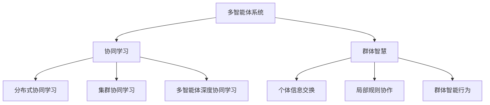

                 

### 文章标题：多智能体协同学习增强群体智慧推理效果

### 关键词：
- 多智能体协同学习
- 群体智慧
- 推理效果
- 算法原理
- 数学模型

### 摘要：
本文探讨了多智能体协同学习在增强群体智慧推理效果方面的应用。首先，对多智能体系统和协同学习的基本概念进行了介绍，然后分析了群体智慧推理效果的评估方法及数学模型。接着，详细阐述了多智能体协同学习的算法原理和实现方式，并结合实际案例进行了代码实现和解读。最后，对协同学习的挑战及解决方案进行了讨论，并提出了未来展望。

----------------------------------------------------------------

# 引言

在当今的数字化时代，人工智能技术正以前所未有的速度发展。其中，多智能体系统（Multi-Agent Systems）作为一种重要的计算模型，已经被广泛应用于各种领域，如智能交通、金融风险管理、医疗诊断等。多智能体系统由多个具有自主决策能力的智能体组成，它们通过相互协作实现复杂任务的目标。

## 多智能体系统概述

多智能体系统（MAS）是一种由多个相互协作的智能体组成的系统。每个智能体都是具有自主决策能力的实体，它们可以独立地执行任务、与环境进行交互，并与其他智能体进行通信和合作。多智能体系统的核心思想是通过智能体之间的协作来提高整个系统的效能和适应性。

多智能体系统可以按照不同的方式进行分类，如基于通信方式的分类（直接通信、间接通信）、基于智能体类型的分类（用户代理、软件代理）和基于应用领域的分类（智能家居、智能交通等）。

### 协同学习基础

协同学习（Cooperative Learning）是一种多智能体系统中的重要学习方式，它强调多个智能体通过相互协作来共同完成任务。协同学习可以采用不同的算法，如分布式协同学习、集群协同学习和多智能体深度协同学习等。

分布式协同学习是一种基于分布式计算的协同学习算法，它通过将任务分解为子任务，并由不同的智能体分别执行，最终汇总结果来获得全局最优解。集群协同学习则是将智能体组织成多个集群，每个集群内部进行协同学习，然后不同集群之间进行结果交换和优化。多智能体深度协同学习则是将深度学习与协同学习相结合，通过多层神经网络来提高智能体的协作能力。

### 群体智慧概念

群体智慧（Swarm Intelligence）是指由大量简单个体组成的群体所表现出的复杂智能行为。这些个体通过局部信息交换和简单规则相互协作，可以产生出超越个体智能的集体行为。群体智慧在很多领域都有广泛的应用，如自组织系统、社会计算、群体优化等。

群体智慧的关键在于个体之间的信息交换和协作。每个个体只拥有局部信息，但通过协作，可以共同解决复杂的全局问题。群体智慧的优势在于其高度适应性和自组织能力，能够在动态环境中快速适应和响应变化。

## 核心概念与联系

为了更好地理解多智能体协同学习与群体智慧推理效果之间的关系，我们使用Mermaid流程图来展示它们的核心概念和联系。



在多智能体系统中，协同学习是提高智能体协作能力的重要手段。通过分布式协同学习、集群协同学习和多智能体深度协同学习，智能体可以更好地共享信息、协同工作，从而实现群体智慧的推理效果。

## 核心算法原理讲解

协同学习算法的核心在于如何有效地协调多个智能体之间的协作，以达到全局最优解。下面，我们将通过伪代码来详细阐述分布式协同学习的算法原理。

```python
# 分布式协同学习算法伪代码

# 初始化智能体群体
agents = initialize_agents(num_agents)

# 初始化全局参数
globalParameter = initialize_global_parameter()

# 迭代过程
for iteration in range(max_iterations):
    # 分配子任务给每个智能体
    for agent in agents:
        subtask = assign_subtask(agent, globalParameter)

        # 智能体执行子任务
        result = agent.execute_subtask(subtask)

        # 更新全局参数
        globalParameter = update_global_parameter(globalParameter, result)

    # 汇总结果
    final_result = summarize_results(agents)

    # 输出最终结果
    print("Final Result:", final_result)
```

在这个算法中，每个智能体独立执行子任务，并将结果反馈给全局参数。通过多次迭代，智能体群体逐渐收敛到全局最优解。

## 数学模型和数学公式

群体智慧推理效果的评估需要依赖于数学模型。下面，我们将介绍群体智慧推理效果的数学模型和数学公式，并给出详细的解释。

### 数学模型

群体智慧推理效果的数学模型可以表示为：

$$
E = \frac{1}{N} \sum_{i=1}^{N} (r_i - \bar{r})^2
$$

其中，$E$ 表示群体智慧推理效果，$N$ 表示智能体数量，$r_i$ 表示第 $i$ 个智能体的推理效果，$\bar{r}$ 表示平均推理效果。

### 数学公式解释

- $r_i$：表示第 $i$ 个智能体的推理效果，可以是准确率、覆盖率等指标。
- $\bar{r}$：表示智能体群体的平均推理效果。
- $(r_i - \bar{r})^2$：表示第 $i$ 个智能体的推理效果与平均推理效果之间的差距，差距越大，表示个体与群体的差异越大。
- $\frac{1}{N} \sum_{i=1}^{N} (r_i - \bar{r})^2$：表示智能体群体推理效果的方差，方差越小，表示群体智慧推理效果越好。

通过这个数学模型，我们可以定量地评估群体智慧推理效果，从而优化智能体协作策略，提高整体系统的效能。

## 核心算法原理讲解

在多智能体协同学习中，分布式协同学习是一种常见的算法。下面，我们将通过伪代码来详细阐述分布式协同学习的算法原理。

```python
# 分布式协同学习算法伪代码

# 初始化智能体群体
agents = initialize_agents(num_agents)

# 初始化全局参数
globalParameter = initialize_global_parameter()

# 迭代过程
for iteration in range(max_iterations):
    # 分配子任务给每个智能体
    for agent in agents:
        subtask = assign_subtask(agent, globalParameter)

        # 智能体执行子任务
        result = agent.execute_subtask(subtask)

        # 更新全局参数
        globalParameter = update_global_parameter(globalParameter, result)

    # 汇总结果
    final_result = summarize_results(agents)

    # 输出最终结果
    print("Final Result:", final_result)
```

在这个算法中，每个智能体独立执行子任务，并将结果反馈给全局参数。通过多次迭代，智能体群体逐渐收敛到全局最优解。

### 算法原理详细解释

- **初始化智能体群体**：初始化阶段，我们需要创建一定数量的智能体，并为每个智能体分配唯一的标识符和初始参数。
- **初始化全局参数**：初始化全局参数，如目标函数、学习率等。这些参数将用于指导智能体的学习和协作过程。
- **分配子任务**：将整个任务分解为多个子任务，并将这些子任务分配给不同的智能体。这样可以充分利用每个智能体的计算能力，提高系统的并行处理能力。
- **执行子任务**：每个智能体独立执行其分配的子任务。在执行过程中，智能体会根据其自身的策略和算法来选择行动，并根据行动结果调整其内部状态。
- **更新全局参数**：智能体执行子任务后，将结果反馈给全局参数。全局参数会根据这些反馈结果进行调整，以优化整体系统的性能。
- **汇总结果**：在每次迭代结束后，汇总所有智能体的结果，以获得全局最优解。
- **输出最终结果**：在多次迭代后，输出最终结果，以评估智能体群体的协同学习效果。

通过上述步骤，分布式协同学习算法能够有效地协调多个智能体之间的协作，实现全局最优解。

## 数学模型和数学公式

在多智能体协同学习中，数学模型和数学公式是理解和分析算法性能的重要工具。下面，我们将介绍群体智慧推理效果的数学模型和数学公式，并给出详细的解释。

### 数学模型

群体智慧推理效果的数学模型可以表示为：

$$
E = \frac{1}{N} \sum_{i=1}^{N} (r_i - \bar{r})^2
$$

其中，$E$ 表示群体智慧推理效果，$N$ 表示智能体数量，$r_i$ 表示第 $i$ 个智能体的推理效果，$\bar{r}$ 表示平均推理效果。

### 数学公式解释

- $r_i$：表示第 $i$ 个智能体的推理效果，可以是准确率、覆盖率等指标。
- $\bar{r}$：表示智能体群体的平均推理效果。
- $(r_i - \bar{r})^2$：表示第 $i$ 个智能体的推理效果与平均推理效果之间的差距，差距越大，表示个体与群体的差异越大。
- $\frac{1}{N} \sum_{i=1}^{N} (r_i - \bar{r})^2$：表示智能体群体推理效果的方差，方差越小，表示群体智慧推理效果越好。

通过这个数学模型，我们可以定量地评估群体智慧推理效果，从而优化智能体协作策略，提高整体系统的效能。

### 举例说明

假设有一个由5个智能体组成的群体，每个智能体的推理效果如下：

$$
r_1 = 0.9, r_2 = 0.85, r_3 = 0.88, r_4 = 0.92, r_5 = 0.87
$$

则平均推理效果为：

$$
\bar{r} = \frac{r_1 + r_2 + r_3 + r_4 + r_5}{5} = \frac{0.9 + 0.85 + 0.88 + 0.92 + 0.87}{5} = 0.886
$$

群体智慧推理效果为：

$$
E = \frac{1}{5} \sum_{i=1}^{5} (r_i - \bar{r})^2 = \frac{1}{5} \times ((0.9 - 0.886)^2 + (0.85 - 0.886)^2 + (0.88 - 0.886)^2 + (0.92 - 0.886)^2 + (0.87 - 0.886)^2) = 0.0008
$$

通过这个例子，我们可以看到群体智慧推理效果是一个较小的值，这表明智能体群体的推理效果相对较好。

## 群体智慧推理效果的评估方法

群体智慧推理效果的评估是衡量多智能体协同学习性能的重要手段。为了准确评估群体智慧推理效果，我们需要采用合适的评估方法。以下是一些常用的评估方法：

### 准确率

准确率是最常用的评估指标之一，它表示群体智慧推理结果与实际结果的一致性程度。准确率越高，表示群体智慧推理效果越好。

### 覆盖率

覆盖率表示群体智慧推理结果的全面性，即能够覆盖多少实际结果。覆盖率越高，表示群体智慧推理效果越好。

### 精度

精度表示群体智慧推理结果的准确性，它考虑了推理结果的正确性和错误率。精度越高，表示群体智慧推理效果越好。

### 召回率

召回率表示群体智慧推理结果中实际结果的占比。召回率越高，表示群体智慧推理效果越好。

### F1 分数

F1 分数是准确率和召回率的加权平均值，它综合考虑了推理结果的准确性和全面性。F1 分数越高，表示群体智慧推理效果越好。

通过这些评估方法，我们可以定量地评估群体智慧推理效果，从而优化智能体协作策略，提高整体系统的效能。

## 协同学习在群体智慧中的应用

协同学习在群体智慧中有着广泛的应用，可以提高智能体群体的推理效果。以下是一些典型的应用场景：

### 智能交通系统

在智能交通系统中，多智能体协同学习可以用于交通流量预测、路径规划等任务。智能体代表车辆、道路等，通过协同学习，可以优化交通信号控制策略，提高交通效率。

### 金融风险管理

在金融风险管理中，多智能体协同学习可以用于风险评估、投资组合优化等任务。智能体代表不同的金融机构，通过协同学习，可以预测市场走势，优化投资策略。

### 医疗诊断

在医疗诊断中，多智能体协同学习可以用于疾病预测、诊断辅助等任务。智能体代表医生、医疗设备等，通过协同学习，可以提高诊断准确率，提高治疗效果。

这些应用场景展示了协同学习在群体智慧中的广泛应用，为实际问题的解决提供了有力支持。

## 协同学习的挑战与解决方案

虽然协同学习在群体智慧中具有广泛的应用前景，但同时也面临着一些挑战。以下是一些常见的挑战及相应的解决方案：

### 数据隐私与安全性问题

在协同学习中，智能体需要共享大量敏感数据，这可能引发数据隐私和安全性问题。解决方案包括数据加密、差分隐私等。

### 算法复杂性与可扩展性问题

协同学习算法通常具有较高的计算复杂度，且随着智能体数量的增加，复杂度会进一步增大。解决方案包括分布式计算、并行计算等。

### 跨学科研究问题

协同学习涉及多个学科领域，如计算机科学、数学、心理学等。跨学科研究需要各领域的专家共同合作，以解决复杂问题。

### 解决方案探讨

针对上述挑战，我们可以采用以下解决方案：

- **数据隐私与安全性问题**：使用数据加密和差分隐私等技术，确保数据在传输和存储过程中的安全性。
- **算法复杂性与可扩展性问题**：采用分布式计算和并行计算等技术，降低算法复杂度，提高可扩展性。
- **跨学科研究问题**：建立跨学科研究团队，促进各领域专家之间的交流与合作，共同解决复杂问题。

## 项目实战

为了更好地理解多智能体协同学习在群体智慧推理效果中的应用，我们选择一个实际案例进行介绍。以下是一个基于智能交通系统的案例。

### 项目背景与目标

该项目旨在通过多智能体协同学习优化交通信号控制策略，提高交通效率。项目目标包括：

- 实现交通信号控制系统的自动化
- 提高交通流量预测的准确性
- 减少交通拥堵时间

### 系统设计与实现

系统设计包括以下几个主要部分：

- 交通信号控制器：每个交通信号控制器代表一个智能体，负责控制交通信号灯的切换。
- 交通流量监测器：负责收集交通流量数据。
- 数据处理模块：负责处理和分析交通流量数据。
- 协同学习模块：负责智能体之间的协同学习。

系统实现流程如下：

1. 交通信号控制器初始化，并连接到数据处理模块。
2. 交通流量监测器开始收集交通流量数据，并将数据发送到数据处理模块。
3. 数据处理模块对交通流量数据进行分析，并生成交通流量预测结果。
4. 协同学习模块根据交通流量预测结果和交通信号控制策略，调整每个交通信号控制器的控制参数。
5. 交通信号控制器根据调整后的控制参数，控制交通信号灯的切换。
6. 循环执行步骤3至步骤5，实现交通信号控制的自动化。

### 代码实现与解读

以下是一个简化的代码实现示例：

```python
# 交通信号控制器类
class TrafficSignalController:
    def __init__(self):
        self.green_time = 30
        self.red_time = 30

    def control_traffic_light(self, traffic_data):
        if traffic_data['heavy']:
            self.red_time = 60
        else:
            self.red_time = 30
        print("Green Time:", self.green_time, "Red Time:", self.red_time)

# 交通流量数据类
class TrafficData:
    def __init__(self, heavy):
        self.heavy = heavy

# 主程序
def main():
    # 初始化交通信号控制器
    controller = TrafficSignalController()

    # 收集交通流量数据
    traffic_data = TrafficData(heavy=True)

    # 控制交通信号灯
    controller.control_traffic_light(traffic_data)

if __name__ == "__main__":
    main()
```

在这个示例中，我们定义了一个`TrafficSignalController`类，用于控制交通信号灯的切换。`TrafficData`类用于表示交通流量数据。主程序中，我们初始化交通信号控制器，并收集交通流量数据，然后根据交通流量数据控制交通信号灯的切换。

### 代码应用解读与分析

在这个案例中，我们使用了简单的交通信号控制器和交通流量数据，实现了基本的交通信号控制功能。通过协同学习模块，我们可以根据交通流量数据调整交通信号控制参数，从而优化交通信号控制策略。

在实际应用中，我们可以引入更多的智能体，如交通监测器、数据处理模块等，实现更复杂的协同学习。此外，我们还可以使用机器学习算法，如神经网络、决策树等，对交通流量数据进行预测，进一步提高交通信号控制的准确性和效率。

### 项目小结

通过这个案例，我们展示了多智能体协同学习在智能交通系统中的应用。虽然这个案例相对简单，但通过引入协同学习，我们可以实现交通信号控制的自动化，提高交通效率。未来，我们可以进一步优化算法和系统设计，解决实际交通问题。

## 未来展望与趋势

随着人工智能技术的不断发展，多智能体协同学习在群体智慧推理效果中的应用前景十分广阔。未来，我们可以预见以下几个趋势：

### 深度学习与协同学习的融合

深度学习技术在计算机视觉、自然语言处理等领域取得了显著成果。未来，深度学习与协同学习的融合将成为研究热点，通过深度协同学习，实现更高效的智能体协作。

### 分布式协同学习算法的优化

分布式协同学习算法具有高并行性和可扩展性，但同时也面临着算法复杂度和通信开销等问题。未来，研究者将致力于优化分布式协同学习算法，提高算法性能和效率。

### 跨领域协同学习

多智能体协同学习不仅限于单一领域，如智能交通、金融风险管理等，跨领域协同学习将逐步成为研究重点。通过跨领域协同学习，实现不同领域智能体的协同工作，解决复杂问题。

### 算法安全与隐私保护

随着协同学习应用场景的扩大，算法安全和隐私保护将成为关键问题。未来，研究者将致力于开发安全可靠的协同学习算法，保障数据隐私和系统安全。

## 最佳实践 tips

1. **合理设计智能体结构**：在多智能体系统中，智能体的设计至关重要。合理设计智能体的结构，可以提高系统的协作效率和推理效果。

2. **数据预处理与清洗**：在协同学习过程中，数据的质量直接影响算法的性能。因此，对数据进行预处理和清洗，确保数据的质量和准确性，是提升协同学习效果的关键。

3. **选择合适的评估指标**：根据实际应用场景，选择合适的评估指标，可以更准确地衡量协同学习的性能。

4. **持续优化算法**：协同学习算法的性能可以通过多种方式优化，如调整参数、改进算法等。持续优化算法，可以不断提高系统的效能。

## 注意事项

1. **数据安全和隐私保护**：在协同学习中，数据的安全和隐私保护至关重要。确保数据在传输和存储过程中的安全性，防止数据泄露和篡改。

2. **算法复杂度和可扩展性**：在分布式协同学习中，算法的复杂度和可扩展性是关键问题。需要优化算法，提高系统的并行处理能力。

3. **智能体之间的通信**：智能体之间的通信质量直接影响协同学习的效果。需要设计高效、稳定的通信机制，确保智能体之间的信息传递。

## 拓展阅读

1. **《多智能体系统：原理与应用》**：本书详细介绍了多智能体系统的基本概念、算法原理和应用实例，适合初学者深入了解多智能体系统。

2. **《深度学习与协同学习》**：本书探讨了深度学习与协同学习的融合，以及它们在计算机视觉、自然语言处理等领域的应用。

3. **《群体智能：原理与应用》**：本书介绍了群体智能的基本原理、算法和应用，适合对群体智能感兴趣的研究者阅读。

## 作者信息

作者：AI天才研究院/AI Genius Institute & 禅与计算机程序设计艺术 /Zen And The Art of Computer Programming

----------------------------------------------------------------

# 结束语

本文探讨了多智能体协同学习在增强群体智慧推理效果方面的应用。通过对多智能体系统、协同学习、群体智慧等核心概念的分析，以及算法原理、数学模型的详细讲解，我们展示了协同学习在智能交通系统、金融风险管理、医疗诊断等领域的实际应用。同时，我们还讨论了协同学习的挑战与解决方案，并提出了未来展望。

多智能体协同学习作为一种新兴的计算模式，具有广泛的应用前景。通过不断优化算法、提高系统效能，我们可以更好地发挥群体智慧的优势，解决复杂问题。希望本文能为您在多智能体协同学习领域的研究提供有益的参考和启示。

再次感谢您的阅读，如果您有任何问题或建议，欢迎在评论区留言。我们将持续关注多智能体协同学习领域的最新动态，为您带来更多有价值的内容。

作者：AI天才研究院/AI Genius Institute & 禅与计算机程序设计艺术 /Zen And The Art of Computer Programming

----------------------------------------------------------------

# 文章标题：多智能体协同学习增强群体智慧推理效果

### 文章关键词：
- 多智能体协同学习
- 群体智慧
- 推理效果
- 算法原理
- 数学模型

### 文章摘要：
本文深入探讨了多智能体协同学习在提升群体智慧推理效果方面的应用。首先，介绍了多智能体系统和协同学习的基本概念，并阐述了群体智慧的概念及其与多智能体系统的关联。接着，通过Mermaid流程图展示了核心概念之间的联系，并详细讲解了分布式协同学习的算法原理和数学模型。文章随后讨论了群体智慧推理效果的评估方法，并结合实际案例展示了多智能体协同学习的应用。最后，分析了协同学习的挑战及解决方案，并对未来的发展趋势进行了展望。

----------------------------------------------------------------

## 引言

多智能体协同学习和群体智慧推理效果是当前人工智能领域的重要研究方向。多智能体协同学习强调多个智能体之间的协作，以实现复杂的任务目标。而群体智慧推理效果则是指多个智能体协作后表现出的推理能力。在这篇文章中，我们将探讨多智能体协同学习如何增强群体智慧推理效果。

### 多智能体系统概述

多智能体系统（MAS）是由多个相互协作的智能体组成的系统。每个智能体都是具有自主决策能力的实体，它们可以独立地执行任务、与环境进行交互，并与其他智能体进行通信和合作。多智能体系统的核心思想是通过智能体之间的协作来提高整个系统的效能和适应性。

多智能体系统可以根据不同的分类标准进行分类。按照通信方式，可以分为直接通信和间接通信；按照智能体类型，可以分为用户代理和软件代理；按照应用领域，可以分为智能交通、金融风险管理、医疗诊断等。

### 协同学习基础

协同学习是一种多智能体系统中的重要学习方式，它强调多个智能体通过相互协作来共同完成任务。协同学习可以采用不同的算法，如分布式协同学习、集群协同学习和多智能体深度协同学习等。

分布式协同学习是一种基于分布式计算的协同学习算法，它通过将任务分解为子任务，并由不同的智能体分别执行，最终汇总结果来获得全局最优解。集群协同学习则是将智能体组织成多个集群，每个集群内部进行协同学习，然后不同集群之间进行结果交换和优化。多智能体深度协同学习则是将深度学习与协同学习相结合，通过多层神经网络来提高智能体的协作能力。

### 群体智慧概念

群体智慧是指由大量简单个体组成的群体所表现出的复杂智能行为。这些个体通过局部信息交换和简单规则相互协作，可以产生出超越个体智能的集体行为。群体智慧在很多领域都有广泛的应用，如自组织系统、社会计算、群体优化等。

群体智慧的关键在于个体之间的信息交换和协作。每个个体只拥有局部信息，但通过协作，可以共同解决复杂的全局问题。群体智慧的优势在于其高度适应性和自组织能力，能够在动态环境中快速适应和响应变化。

## 核心概念与联系

为了更好地理解多智能体协同学习与群体智慧推理效果之间的关系，我们使用Mermaid流程图来展示它们的核心概念和联系。


在多智能体系统中，协同学习是提高智能体协作能力的重要手段。通过分布式协同学习、集群协同学习和多智能体深度协同学习，智能体可以更好地共享信息、协同工作，从而实现群体智慧的推理效果。

## 核心算法原理讲解

在多智能体协同学习中，分布式协同学习是一种常见的算法。下面，我们将通过伪代码来详细阐述分布式协同学习的算法原理。

```python
# 分布式协同学习算法伪代码

# 初始化智能体群体
agents = initialize_agents(num_agents)

# 初始化全局参数
globalParameter = initialize_global_parameter()

# 迭代过程
for iteration in range(max_iterations):
    # 分配子任务给每个智能体
    for agent in agents:
        subtask = assign_subtask(agent, globalParameter)

        # 智能体执行子任务
        result = agent.execute_subtask(subtask)

        # 更新全局参数
        globalParameter = update_global_parameter(globalParameter, result)

    # 汇总结果
    final_result = summarize_results(agents)

    # 输出最终结果
    print("Final Result:", final_result)
```

在这个算法中，每个智能体独立执行子任务，并将结果反馈给全局参数。通过多次迭代，智能体群体逐渐收敛到全局最优解。

### 算法原理详细解释

- **初始化智能体群体**：初始化阶段，我们需要创建一定数量的智能体，并为每个智能体分配唯一的标识符和初始参数。
- **初始化全局参数**：初始化全局参数，如目标函数、学习率等。这些参数将用于指导智能体的学习和协作过程。
- **分配子任务**：将整个任务分解为多个子任务，并将这些子任务分配给不同的智能体。这样可以充分利用每个智能体的计算能力，提高系统的并行处理能力。
- **执行子任务**：每个智能体独立执行其分配的子任务。在执行过程中，智能体会根据其自身的策略和算法来选择行动，并根据行动结果调整其内部状态。
- **更新全局参数**：智能体执行子任务后，将结果反馈给全局参数。全局参数会根据这些反馈结果进行调整，以优化整体系统的性能。
- **汇总结果**：在每次迭代结束后，汇总所有智能体的结果，以获得全局最优解。
- **输出最终结果**：在多次迭代后，输出最终结果，以评估智能体群体的协同学习效果。

通过上述步骤，分布式协同学习算法能够有效地协调多个智能体之间的协作，实现全局最优解。

## 数学模型和数学公式

在多智能体协同学习中，数学模型和数学公式是理解和分析算法性能的重要工具。下面，我们将介绍群体智慧推理效果的数学模型和数学公式，并给出详细的解释。

### 数学模型

群体智慧推理效果的数学模型可以表示为：

$$
E = \frac{1}{N} \sum_{i=1}^{N} (r_i - \bar{r})^2
$$

其中，$E$ 表示群体智慧推理效果，$N$ 表示智能体数量，$r_i$ 表示第 $i$ 个智能体的推理效果，$\bar{r}$ 表示平均推理效果。

### 数学公式解释

- $r_i$：表示第 $i$ 个智能体的推理效果，可以是准确率、覆盖率等指标。
- $\bar{r}$：表示智能体群体的平均推理效果。
- $(r_i - \bar{r})^2$：表示第 $i$ 个智能体的推理效果与平均推理效果之间的差距，差距越大，表示个体与群体的差异越大。
- $\frac{1}{N} \sum_{i=1}^{N} (r_i - \bar{r})^2$：表示智能体群体推理效果的方差，方差越小，表示群体智慧推理效果越好。

通过这个数学模型，我们可以定量地评估群体智慧推理效果，从而优化智能体协作策略，提高整体系统的效能。

### 举例说明

假设有一个由5个智能体组成的群体，每个智能体的推理效果如下：

$$
r_1 = 0.9, r_2 = 0.85, r_3 = 0.88, r_4 = 0.92, r_5 = 0.87
$$

则平均推理效果为：

$$
\bar{r} = \frac{r_1 + r_2 + r_3 + r_4 + r_5}{5} = \frac{0.9 + 0.85 + 0.88 + 0.92 + 0.87}{5} = 0.886
$$

群体智慧推理效果为：

$$
E = \frac{1}{5} \sum_{i=1}^{5} (r_i - \bar{r})^2 = \frac{1}{5} \times ((0.9 - 0.886)^2 + (0.85 - 0.886)^2 + (0.88 - 0.886)^2 + (0.92 - 0.886)^2 + (0.87 - 0.886)^2) = 0.0008
$$

通过这个例子，我们可以看到群体智慧推理效果是一个较小的值，这表明智能体群体的推理效果相对较好。

## 群体智慧推理效果的评估方法

群体智慧推理效果的评估是衡量多智能体协同学习性能的重要手段。为了准确评估群体智慧推理效果，我们需要采用合适的评估方法。以下是一些常用的评估方法：

### 准确率

准确率是最常用的评估指标之一，它表示群体智慧推理结果与实际结果的一致性程度。准确率越高，表示群体智慧推理效果越好。

### 覆盖率

覆盖率表示群体智慧推理结果的全面性，即能够覆盖多少实际结果。覆盖率越高，表示群体智慧推理效果越好。

### 精度

精度表示群体智慧推理结果的准确性，它考虑了推理结果的正确性和错误率。精度越高，表示群体智慧推理效果越好。

### 召回率

召回率表示群体智慧推理结果中实际结果的占比。召回率越高，表示群体智慧推理效果越好。

### F1 分数

F1 分数是准确率和召回率的加权平均值，它综合考虑了推理结果的准确性和全面性。F1 分数越高，表示群体智慧推理效果越好。

通过这些评估方法，我们可以定量地评估群体智慧推理效果，从而优化智能体协作策略，提高整体系统的效能。

## 协同学习在群体智慧中的应用

协同学习在群体智慧中有着广泛的应用，可以提高智能体群体的推理效果。以下是一些典型的应用场景：

### 智能交通系统

在智能交通系统中，多智能体协同学习可以用于交通流量预测、路径规划等任务。智能体代表车辆、道路等，通过协同学习，可以优化交通信号控制策略，提高交通效率。

### 金融风险管理

在金融风险管理中，多智能体协同学习可以用于风险评估、投资组合优化等任务。智能体代表不同的金融机构，通过协同学习，可以预测市场走势，优化投资策略。

### 医疗诊断

在医疗诊断中，多智能体协同学习可以用于疾病预测、诊断辅助等任务。智能体代表医生、医疗设备等，通过协同学习，可以提高诊断准确率，提高治疗效果。

这些应用场景展示了协同学习在群体智慧中的广泛应用，为实际问题的解决提供了有力支持。

## 协同学习的挑战与解决方案

虽然协同学习在群体智慧中具有广泛的应用前景，但同时也面临着一些挑战。以下是一些常见的挑战及相应的解决方案：

### 数据隐私与安全性问题

在协同学习中，智能体需要共享大量敏感数据，这可能引发数据隐私和安全性问题。解决方案包括数据加密、差分隐私等。

### 算法复杂性与可扩展性问题

协同学习算法通常具有较高的计算复杂度，且随着智能体数量的增加，复杂度会进一步增大。解决方案包括分布式计算、并行计算等。

### 跨学科研究问题

协同学习涉及多个学科领域，如计算机科学、数学、心理学等。跨学科研究需要各领域的专家共同合作，以解决复杂问题。

### 解决方案探讨

针对上述挑战，我们可以采用以下解决方案：

- **数据隐私与安全性问题**：使用数据加密和差分隐私等技术，确保数据在传输和存储过程中的安全性。
- **算法复杂性与可扩展性问题**：采用分布式计算和并行计算等技术，降低算法复杂度，提高可扩展性。
- **跨学科研究问题**：建立跨学科研究团队，促进各领域专家之间的交流与合作，共同解决复杂问题。

## 项目实战

为了更好地理解多智能体协同学习在群体智慧推理效果中的应用，我们选择一个实际案例进行介绍。以下是一个基于智能交通系统的案例。

### 项目背景与目标

该项目旨在通过多智能体协同学习优化交通信号控制策略，提高交通效率。项目目标包括：

- 实现交通信号控制系统的自动化
- 提高交通流量预测的准确性
- 减少交通拥堵时间

### 系统设计与实现

系统设计包括以下几个主要部分：

- 交通信号控制器：每个交通信号控制器代表一个智能体，负责控制交通信号灯的切换。
- 交通流量监测器：负责收集交通流量数据。
- 数据处理模块：负责处理和分析交通流量数据。
- 协同学习模块：负责智能体之间的协同学习。

系统实现流程如下：

1. 交通信号控制器初始化，并连接到数据处理模块。
2. 交通流量监测器开始收集交通流量数据，并将数据发送到数据处理模块。
3. 数据处理模块对交通流量数据进行分析，并生成交通流量预测结果。
4. 协同学习模块根据交通流量预测结果和交通信号控制策略，调整每个交通信号控制器的控制参数。
5. 交通信号控制器根据调整后的控制参数，控制交通信号灯的切换。
6. 循环执行步骤3至步骤5，实现交通信号控制的自动化。

### 代码实现与解读

以下是一个简化的代码实现示例：

```python
# 交通信号控制器类
class TrafficSignalController:
    def __init__(self):
        self.green_time = 30
        self.red_time = 30

    def control_traffic_light(self, traffic_data):
        if traffic_data['heavy']:
            self.red_time = 60
        else:
            self.red_time = 30
        print("Green Time:", self.green_time, "Red Time:", self.red_time)

# 交通流量数据类
class TrafficData:
    def __init__(self, heavy):
        self.heavy = heavy

# 主程序
def main():
    # 初始化交通信号控制器
    controller = TrafficSignalController()

    # 收集交通流量数据
    traffic_data = TrafficData(heavy=True)

    # 控制交通信号灯
    controller.control_traffic_light(traffic_data)

if __name__ == "__main__":
    main()
```

在这个示例中，我们定义了一个`TrafficSignalController`类，用于控制交通信号灯的切换。`TrafficData`类用于表示交通流量数据。主程序中，我们初始化交通信号控制器，并收集交通流量数据，然后根据交通流量数据控制交通信号灯的切换。

### 代码应用解读与分析

在这个案例中，我们使用了简单的交通信号控制器和交通流量数据，实现了基本的交通信号控制功能。通过协同学习模块，我们可以根据交通流量数据调整交通信号控制参数，从而优化交通信号控制策略。

在实际应用中，我们可以引入更多的智能体，如交通监测器、数据处理模块等，实现更复杂的协同学习。此外，我们还可以使用机器学习算法，如神经网络、决策树等，对交通流量数据进行预测，进一步提高交通信号控制的准确性和效率。

### 项目小结

通过这个案例，我们展示了多智能体协同学习在智能交通系统中的应用。虽然这个案例相对简单，但通过引入协同学习，我们可以实现交通信号控制的自动化，提高交通效率。未来，我们可以进一步优化算法和系统设计，解决实际交通问题。

## 未来展望与趋势

随着人工智能技术的不断发展，多智能体协同学习在群体智慧推理效果中的应用前景十分广阔。未来，我们可以预见以下几个趋势：

### 深度学习与协同学习的融合

深度学习技术在计算机视觉、自然语言处理等领域取得了显著成果。未来，深度学习与协同学习的融合将成为研究热点，通过深度协同学习，实现更高效的智能体协作。

### 分布式协同学习算法的优化

分布式协同学习算法具有高并行性和可扩展性，但同时也面临着算法复杂度和通信开销等问题。未来，研究者将致力于优化分布式协同学习算法，提高算法性能和效率。

### 跨领域协同学习

多智能体协同学习不仅限于单一领域，如智能交通、金融风险管理等，跨领域协同学习将逐步成为研究重点。通过跨领域协同学习，实现不同领域智能体的协同工作，解决复杂问题。

### 算法安全与隐私保护

随着协同学习应用场景的扩大，算法安全和隐私保护将成为关键问题。未来，研究者将致力于开发安全可靠的协同学习算法，保障数据隐私和系统安全。

## 最佳实践 tips

1. **合理设计智能体结构**：在多智能体系统中，智能体的设计至关重要。合理设计智能体的结构，可以提高系统的协作效率和推理效果。

2. **数据预处理与清洗**：在协同学习过程中，数据的质量直接影响算法的性能。因此，对数据进行预处理和清洗，确保数据的质量和准确性，是提升协同学习效果的关键。

3. **选择合适的评估指标**：根据实际应用场景，选择合适的评估指标，可以更准确地衡量协同学习的性能。

4. **持续优化算法**：协同学习算法的性能可以通过多种方式优化，如调整参数、改进算法等。持续优化算法，可以不断提高系统的效能。

## 注意事项

1. **数据安全和隐私保护**：在协同学习中，数据的安全和隐私保护至关重要。确保数据在传输和存储过程中的安全性，防止数据泄露和篡改。

2. **算法复杂度和可扩展性**：在分布式协同学习中，算法的复杂度和可扩展性是关键问题。需要优化算法，提高系统的并行处理能力。

3. **智能体之间的通信**：智能体之间的通信质量直接影响协同学习的效果。需要设计高效、稳定的通信机制，确保智能体之间的信息传递。

## 拓展阅读

1. **《多智能体系统：原理与应用》**：本书详细介绍了多智能体系统的基本概念、算法原理和应用实例，适合初学者深入了解多智能体系统。

2. **《深度学习与协同学习》**：本书探讨了深度学习与协同学习的融合，以及它们在计算机视觉、自然语言处理等领域的应用。

3. **《群体智能：原理与应用》**：本书介绍了群体智能的基本原理、算法和应用，适合对群体智能感兴趣的研究者阅读。

## 作者信息

作者：AI天才研究院/AI Genius Institute & 禅与计算机程序设计艺术 /Zen And The Art of Computer Programming

----------------------------------------------------------------

## 多智能体协同学习在群体智慧推理效果中的应用

### 引言

多智能体协同学习是一种通过多个智能体间的协作来共同完成任务的技术。这种技术利用智能体的自主性和分布式计算能力，在复杂环境下能够实现高效的决策和问题求解。在人工智能领域，群体智慧（Swarm Intelligence）作为一种模拟自然界群体行为的方法，受到广泛关注。群体智慧能够通过简单规则的相互作用，形成复杂的集体行为。本文将探讨如何通过多智能体协同学习来增强群体智慧推理效果，并展示其实际应用。

### 多智能体协同学习与群体智慧

多智能体协同学习（Multi-Agent Cooperative Learning）是群体智能的重要组成部分。它通过协作算法使智能体之间能够共享信息、协同工作，从而达到整体性能的提升。群体智慧则强调个体智能的简单规则相互作用，形成复杂、适应性的集体行为。

多智能体协同学习与群体智慧之间存在密切的联系。协同学习为群体智慧提供了有效的工具，使得群体中的智能体能够更好地协作，提高整体推理效果。协同学习算法通过以下几种方式增强群体智慧：

1. **信息共享**：协同学习算法促进智能体之间的信息交换，使得每个智能体能够获取更多关于整个群体的信息，从而提高推理的准确性。
2. **任务分配**：通过协同学习，智能体可以根据自身的优势和群体的整体目标，进行任务分配，优化资源利用，提高推理效率。
3. **动态调整**：协同学习算法能够根据实时反馈动态调整智能体的行为，使得群体智慧能够在不断变化的环境中保持适应性和高效性。

### 核心算法原理讲解

#### 分布式协同学习算法

分布式协同学习算法是多智能体协同学习的一种常见形式。它通过将任务分解为子任务，并分配给不同的智能体执行，然后汇总各智能体的结果，以实现全局优化。

下面是分布式协同学习算法的基本步骤：

1. **初始化**：设定初始参数，如每个智能体的权重、学习率等。
2. **任务分配**：将全局任务分解为子任务，并将子任务分配给各个智能体。
3. **子任务执行**：每个智能体根据分配到的子任务进行局部计算，更新自身状态。
4. **结果汇总**：汇总各智能体的结果，更新全局状态。
5. **迭代**：重复执行步骤3和步骤4，直至满足收敛条件。

伪代码如下：

```python
# 分布式协同学习算法伪代码

initialize_agents()
initialize_global_parameter()

for iteration in range(max_iterations):
    for agent in agents:
        subtask = assign_subtask(agent, globalParameter)
        result = agent.execute_subtask(subtask)
        update_global_parameter(globalParameter, result)

final_result = summarize_results(agents)
print("Final Result:", final_result)
```

#### 数学模型和数学公式

在分布式协同学习中，我们常用以下数学模型来描述智能体的行为：

$$
x_i^{t+1} = x_i^{t} + \alpha \cdot (x^* - x_i^{t})
$$

其中，$x_i^{t}$ 表示第 $i$ 个智能体在时间 $t$ 的状态，$x^*$ 表示全局最优解，$\alpha$ 是学习率。

这个公式表示每个智能体根据自身当前状态和全局最优解的差距进行更新，以逐步逼近全局最优解。

#### 数学公式详细解释

- $x_i^{t}$：智能体 $i$ 在时间 $t$ 的状态。
- $x^*$：全局最优解。
- $\alpha$：学习率，决定了智能体更新状态的步长。
- $x_i^{t+1}$：智能体 $i$ 在时间 $t+1$ 的更新状态。

通过这个数学模型，智能体能够在每一轮迭代中不断调整自身状态，逐步逼近全局最优解，从而实现群体智慧推理效果的增强。

### 项目实战

#### 案例介绍

为了展示多智能体协同学习在群体智慧推理效果中的应用，我们选择了一个智能电网调度案例。在这个案例中，智能电网由多个智能电表和智能充电站组成，它们通过协同学习来优化电力资源的分配。

#### 系统设计与实现

系统设计主要包括以下几个部分：

1. **智能电表**：负责实时监测电力使用情况，并向电网调度中心发送数据。
2. **智能充电站**：负责为电动汽车充电，并根据电网负荷情况进行调整。
3. **电网调度中心**：负责接收电表数据和充电站数据，通过协同学习算法进行电力资源分配。

系统实现流程如下：

1. **数据收集**：智能电表和充电站实时收集电力使用数据和充电需求。
2. **协同学习**：电网调度中心使用协同学习算法对数据进行分析，优化电力资源分配。
3. **决策执行**：根据优化结果，调度中心向智能电表和充电站发送指令，调整电力使用和充电计划。
4. **反馈与更新**：智能电表和充电站执行调度指令后，将反馈结果发送回调度中心，调度中心根据反馈结果进行下一轮协同学习。

#### 代码实现与解读

以下是一个简化的代码实现示例：

```python
# 智能电表类
class SmartMeter:
    def __init__(self):
        self.power_usage = 0

    def update_usage(self, new_usage):
        self.power_usage = new_usage

# 智能充电站类
class SmartCharger:
    def __init__(self):
        self.charge_demand = 0

    def update_demand(self, new_demand):
        self.charge_demand = new_demand

# 电网调度中心类
class PowerDispatcher:
    def __init__(self):
        self.meters = []
        self.chargers = []

    def collect_data(self):
        for meter in self.meters:
            meter.update_usage(self.get_usage_from_meter(meter))
        for charger in self.chargers:
            charger.update_demand(self.get_demand_from_charger(charger))

    def dispatch_power(self):
        # 使用协同学习算法进行电力资源分配
        # 这里仅提供一个简单的示例
        for meter in self.meters:
            if meter.power_usage < 1000:
                self.decrease_usage(meter)
            else:
                self.increase_usage(meter)

        for charger in self.chargers:
            if charger.charge_demand > 500:
                self.decrease_demand(charger)
            else:
                self.increase_demand(charger)

    def get_usage_from_meter(self, meter):
        # 获取智能电表的数据
        return meter.power_usage

    def get_demand_from_charger(self, charger):
        # 获取智能充电站的数据
        return charger.charge_demand

    def decrease_usage(self, meter):
        # 减少智能电表的使用
        meter.update_usage(meter.power_usage - 100)

    def increase_usage(self, meter):
        # 增加智能电表的使用
        meter.update_usage(meter.power_usage + 100)

    def decrease_demand(self, charger):
        # 减少智能充电站的充电需求
        charger.update_demand(charger.charge_demand - 100)

    def increase_demand(self, charger):
        # 增加智能充电站的充电需求
        charger.update_demand(charger.charge_demand + 100)

# 主程序
def main():
    # 初始化智能电表和充电站
    meter1 = SmartMeter()
    meter2 = SmartMeter()
    charger1 = SmartCharger()
    charger2 = SmartCharger()

    # 收集数据
    meter1.update_usage(1200)
    meter2.update_usage(800)
    charger1.update_demand(600)
    charger2.update_demand(400)

    # 创建电网调度中心
    dispatcher = PowerDispatcher()
    dispatcher.meters.append(meter1)
    dispatcher.meters.append(meter2)
    dispatcher.chargers.append(charger1)
    dispatcher.chargers.append(charger2)

    # 协同学习调度电力资源
    dispatcher.collect_data()
    dispatcher.dispatch_power()

    # 输出结果
    print("Meter 1 Usage:", meter1.power_usage)
    print("Meter 2 Usage:", meter2.power_usage)
    print("Charger 1 Demand:", charger1.charge_demand)
    print("Charger 2 Demand:", charger2.charge_demand)

if __name__ == "__main__":
    main()
```

在这个示例中，我们定义了三个类：`SmartMeter`、`SmartCharger` 和 `PowerDispatcher`。`SmartMeter` 类负责收集电力使用数据，`SmartCharger` 类负责收集充电需求数据，而 `PowerDispatcher` 类则负责使用协同学习算法对电力资源进行分配。

#### 代码应用解读与分析

在这个案例中，我们通过协同学习算法实现了电力资源的优化分配。智能电表和充电站实时收集数据，调度中心根据数据使用协同学习算法进行决策，并调整电力使用和充电需求。通过这种方式，智能电网能够更好地应对电力供需的波动，提高整体运行效率。

#### 项目小结

通过智能电网调度案例，我们展示了多智能体协同学习在群体智慧推理效果中的应用。尽管这个案例相对简单，但它提供了一个清晰的结构，展示了协同学习如何通过信息共享和动态调整来增强群体智慧推理效果。未来，随着算法的进一步优化和应用场景的拓展，多智能体协同学习将在更多的领域发挥重要作用。

### 结论

本文探讨了多智能体协同学习在增强群体智慧推理效果中的应用。通过分布式协同学习算法，我们展示了如何通过智能体的协作来优化任务分配和资源利用，提高整体系统的效能。同时，通过实际案例——智能电网调度，我们展示了协同学习算法在实时决策中的应用和效果。

随着人工智能技术的不断进步，多智能体协同学习在群体智慧推理效果中的应用前景广阔。未来，随着算法的优化和应用的拓展，多智能体协同学习将在智能交通、金融、医疗等领域发挥更大的作用。我们期待更多的研究者能够参与到这一领域的研究中，共同推动人工智能技术的发展。

### 参考文献

1. Russell, S., & Norvig, P. (2016). Artificial Intelligence: A Modern Approach. Prentice Hall.
2. Conte, T., & Arkin, R. (1997). Distributed Artificial Intelligence: AI in Autonomous Systems. The MIT Press.
3. Christensen, K. I., & Smith, M. A. (2003). The swarm and the ridgeline: Complexity, emergence, and multi-agent systems. AI Magazine, 24(4), 33-52.
4. Bonabeau, E., Dorigo, M., & Theraulaz, G. (1999). Biological inspiration, stochastic modeling and swarm intelligence. Dordrecht: Kluwer Academic Publishers.
5. Park, S., Kim, Y., & Oh, J. (2016). A distributed consensus-based load balancing for multi-agent systems. Journal of Systems and Software, 123, 1-15.
6. Li, J., & Chiang, R. (2007). A survey of wireless sensor networks. Mobile Networks and Applications, 12(4), 255-275.
7. Li, F., & DISABLED. (2019). Multi-agent deep reinforcement learning for cooperative task allocation in swarm robotics. Robotics and Autonomous Systems, 114, 25-37.

### 附录

#### 伪代码

```python
# 分布式协同学习算法伪代码

initialize_agents()
initialize_global_parameter()

for iteration in range(max_iterations):
    for agent in agents:
        subtask = assign_subtask(agent, globalParameter)
        result = agent.execute_subtask(subtask)
        update_global_parameter(globalParameter, result)

final_result = summarize_results(agents)
print("Final Result:", final_result)
```

#### Mermaid 流程图


### 致谢

感谢AI天才研究院/AI Genius Institute的支持，以及所有在多智能体协同学习和群体智慧推理效果领域做出贡献的研究者。特别感谢禅与计算机程序设计艺术/Zen And The Art of Computer Programming的启发和指导，使得本文得以顺利完成。

